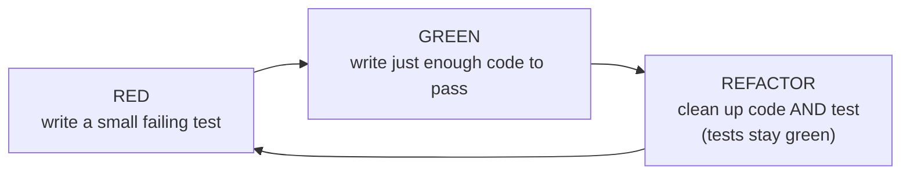

# Unit Tests — Junior Level

> **Level:** Junior — "What's the rule? What does a clean test look like?"
> **Source:** Robert C. Martin, *Clean Code*, Chapter 9 ("Unit Tests").

---

## Table of Contents

1. [Why tests are not optional](#why-tests-are-not-optional)
2. [Real-world analogy](#real-world-analogy)
3. [Rule 1 — The F.I.R.S.T. principles](#rule-1--the-first-principles)
4. [Rule 2 — One concept per test (Arrange-Act-Assert)](#rule-2--one-concept-per-test-arrange-act-assert)
5. [Rule 3 — Test behavior, not implementation](#rule-3--test-behavior-not-implementation)
6. [Rule 4 — Name the scenario and the expectation](#rule-4--name-the-scenario-and-the-expectation)
7. [Rule 5 — The three laws of TDD](#rule-5--the-three-laws-of-tdd)
8. [Rule 6 — Tests are first-class code](#rule-6--tests-are-first-class-code)
9. [Common Mistakes](#common-mistakes)
10. [Test Yourself](#test-yourself)
11. [Cheat Sheet](#cheat-sheet)
12. [Summary](#summary)
13. [Further Reading](#further-reading)
14. [Related Topics](#related-topics)

---

## Why tests are not optional

Most juniors think of tests as a chore you do *after* the "real" work, if there's time left. Clean Code flips this: **the test suite is what lets you keep the production code clean at all.** Without tests, every change is a gamble. You stop refactoring because you're afraid of breaking something. The code rots. With a fast, trustworthy test suite, you change code fearlessly — and fearless change is the entire point of clean code.

Here is the part most people miss: **dirty tests are worse than no tests.** A test suite that is slow, flaky, or unreadable doesn't get run, doesn't get trusted, and doesn't get maintained. When the production code changes, dirty tests rot faster than the code they guard, until the team rips them out entirely. So tests must be held to the *same* quality bar as production code — sometimes higher, because they are the safety net everything else depends on.

This chapter is about the rules that make a test clean: it runs fast, it doesn't depend on other tests, it gives the same answer every time, it checks itself, and a reader can understand it at a glance.

> **Key idea:** A test asserts one thing, has a name that reads like a sentence, and would *fail loudly* if the behavior it describes broke. If it can't fail, it isn't a test — it's decoration.

---

## Real-world analogy

### The smoke detector

A good smoke detector has four properties. It reacts **instantly** (you don't wait an hour for the alarm). It works **on its own** — it doesn't need the detector in the next room to function. It behaves **the same way every time** there's smoke, not "sometimes." And when it triggers, the alarm is **unmissable** — a loud beep, not a note you have to go read.

A bad smoke detector that beeps randomly at 3 a.m. when there's no fire gets one treatment: the battery comes out and never goes back in. Now the house has no protection at all — and worse, everyone *believes* it's protected.

A **flaky test** is that 3 a.m. beep. A **slow test** is the detector that takes an hour. A test with **no assertion** is a detector with no speaker — it sees the smoke and says nothing. Each one erodes trust until someone "removes the battery" (`@Disabled`, `t.Skip`, `@pytest.mark.skip`) and the safety net quietly disappears.

The F.I.R.S.T. principles below are just the spec sheet for a smoke detector you can actually trust.

---

## Rule 1 — The F.I.R.S.T. principles

Clean unit tests are **F.I.R.S.T.**:

| Letter | Principle | What it means |
|---|---|---|
| **F** | **Fast** | The suite runs in milliseconds-to-seconds, so you run it constantly. Slow tests get run rarely, so bugs hide longer. |
| **I** | **Independent** | No test depends on another test running first, or on leftover state. Tests can run in any order, in parallel, in isolation. |
| **R** | **Repeatable** | Same result every time, on any machine, offline, regardless of date/timezone/network. No "works on my laptop." |
| **S** | **Self-validating** | The test outputs pass/fail with no human reading logs. An `assert` decides; you don't eyeball console output. |
| **T** | **Timely** | Write the test just before (or alongside) the code it covers, while the design is still soft — not weeks later when the code is set in concrete. |

### Dirty — violates Fast, Repeatable, Independent

```python
import requests

def test_user_profile():
    # Fast?       No — real HTTP call, ~300ms, and it's in the unit suite.
    # Repeatable? No — fails when offline or the server is down.
    # Independent?No — relies on user 42 already existing in a shared DB.
    resp = requests.get("https://api.example.com/users/42")
    assert resp.json()["name"] == "Ada"
```

This "unit" test hits the network, depends on shared server state, and breaks on a train with no Wi-Fi. It will be skipped within a week.

### Clean — Fast, Repeatable, Independent, Self-validating

```python
def test_format_display_name_combines_first_and_last():
    profile = UserProfile(first="Ada", last="Lovelace")   # no network, no DB

    result = profile.display_name()

    assert result == "Ada Lovelace"                        # decides for itself
```

Pure in-memory data, no I/O, deterministic, and the `assert` is the verdict. (Talking to a real server is valuable — but that belongs in an integration-test *suite that runs separately*, not the millisecond unit suite. We keep the two apart so the fast feedback loop stays fast.)

> **Rule of thumb:** if a "unit" test touches the network, the disk, the clock, or a real database, it is no longer a unit test. Replace those with in-memory fakes or test doubles.

---

## Rule 2 — One concept per test (Arrange-Act-Assert)

A clean test verifies **one** thing. It has three visually distinct sections, known as **Arrange-Act-Assert** (AAA) or **Given-When-Then** or, in Clean Code's words, **Build-Operate-Check**:

1. **Arrange / Build** — set up the inputs and the object under test.
2. **Act / Operate** — call the one behavior you're testing.
3. **Assert / Check** — verify the single expected outcome.

When a test checks several unrelated concepts, a single failure can't tell you *which* concept broke, and the test name can't honestly describe what it does.

### Dirty — three concepts crammed into one test (Go)

```go
func TestCart(t *testing.T) {
    cart := NewCart()

    cart.Add(Item{Name: "Pen", Price: 150})
    if cart.Total() != 150 {
        t.Errorf("add failed")
    }

    cart.ApplyCoupon("SAVE10")
    if cart.Total() != 135 {
        t.Errorf("coupon failed")
    }

    cart.Remove("Pen")
    if cart.Total() != 0 {
        t.Errorf("remove failed")
    }
}
```

If this fails, *which* of adding, couponing, or removing broke? The name `TestCart` tells you nothing.

### Clean — one concept each, named clearly (Go table-driven)

```go
func TestCart_Add_IncreasesTotalByItemPrice(t *testing.T) {
    cart := NewCart()

    cart.Add(Item{Name: "Pen", Price: 150})

    if got := cart.Total(); got != 150 {
        t.Errorf("Total() = %d, want 150", got)
    }
}

func TestCart_ApplyCoupon_ReducesTotalByPercentage(t *testing.T) {
    cart := NewCart()
    cart.Add(Item{Name: "Pen", Price: 150})

    cart.ApplyCoupon("SAVE10")

    if got := cart.Total(); got != 135 {
        t.Errorf("Total() = %d, want 135", got)
    }
}
```

Now a red test names the exact broken behavior. The blank lines mark Arrange / Act / Assert without needing comments.

### Java — JUnit 5 + AssertJ, AAA with comment markers

```java
@Test
@DisplayName("applying SAVE10 reduces the total by 10%")
void applyCoupon_reducesTotalByPercentage() {
    // Arrange
    Cart cart = new Cart();
    cart.add(new Item("Pen", 150));

    // Act
    cart.applyCoupon("SAVE10");

    // Assert
    assertThat(cart.total()).isEqualTo(135);
}
```

### Python — pytest, one assertion per concept

```python
def test_apply_coupon_reduces_total_by_percentage():
    # Arrange
    cart = Cart()
    cart.add(Item(name="Pen", price=150))

    # Act
    cart.apply_coupon("SAVE10")

    # Assert
    assert cart.total() == 135
```

> **"One concept" ≠ "exactly one `assert` statement".** Asserting three fields of *one returned object* is still one concept. Asserting the results of three *different operations* is three concepts — split them.

---

## Rule 3 — Test behavior, not implementation

Test **what** the code does (its observable behavior through its public interface), never **how** it does it (private fields, internal method call order, helper names). Implementation-coupled tests break every time you refactor — even when the behavior is unchanged. That punishes exactly the activity tests are supposed to enable.

### Dirty — asserts on internals (Python)

```python
def test_discount_engine():
    engine = DiscountEngine()
    engine.calculate(price=100, tier="GOLD")

    # Reaches into private state and internal call bookkeeping.
    assert engine._last_tier == "GOLD"
    assert engine._steps_executed == ["lookup", "multiply", "round"]
    assert engine._cache_key == "GOLD:100"
```

Rename `_steps_executed`, add a caching layer, or reorder internal steps — all of which keep the discount *correct* — and this test goes red. It tests the machine's wiring, not its output.

### Clean — asserts on the observable result

```python
def test_gold_tier_gets_five_percent_off():
    engine = DiscountEngine()

    final_price = engine.calculate(price=100, tier="GOLD")

    assert final_price == 95
```

This test passes through any refactor that keeps GOLD at 5% off. It tests the contract, not the plumbing. If you later rewrite `DiscountEngine` from scratch, this test is the spec that proves you didn't change behavior.

> **Litmus test:** "If I rewrite the implementation but keep the same public behavior, should this test still pass?" If yes, it's a behavior test. If it would break, it's coupled to implementation — fix it.

---

## Rule 4 — Name the scenario and the expectation

A test name is documentation that can never go stale (a stale name fails CI conceptually — reviewers catch it). A good name reads like a sentence and states **the scenario** and **the expected outcome**. When it fails, the name alone should tell you what's broken without opening the body.

A useful template: **`MethodOrUnit_Scenario_ExpectedResult`** or the sentence form **`it does X when Y`**.

| Bad name | Why it's bad | Better name |
|---|---|---|
| `test1` | Says nothing | `withdraw_moreThanBalance_throwsInsufficientFunds` |
| `testWithdraw` | Names the method, not the case | `withdraw_exactBalance_leavesZeroBalance` |
| `testItWorks` | "Works" how? | `parse_emptyString_returnsEmptyList` |
| `testEdgeCase` | Which edge? | `divide_byZero_throwsArithmeticException` |

### The same scenario, named well in each language

```go
// Go: the function name IS the sentence.
func TestWithdraw_MoreThanBalance_ReturnsInsufficientFundsError(t *testing.T) { /* ... */ }
```

```java
// Java: @DisplayName carries human-readable prose; method name stays code-friendly.
@Test
@DisplayName("withdrawing more than the balance throws InsufficientFundsException")
void withdraw_moreThanBalance_throwsInsufficientFunds() { /* ... */ }
```

```python
# Python: pytest discovers test_* functions; the name describes scenario + result.
def test_withdraw_more_than_balance_raises_insufficient_funds():
    ...
```

> When a test is hard to name because it does *too much*, that's not a naming problem — it's [Rule 2](#rule-2--one-concept-per-test-arrange-act-assert) telling you to split the test.

---

## Rule 5 — The three laws of TDD

Test-Driven Development (TDD) is the discipline of letting tests drive the code. Robert Martin states it as three laws:

1. **You may not write production code until you have written a failing test.**
2. **You may not write more of a test than is sufficient to fail** (and not compiling counts as failing).
3. **You may not write more production code than is sufficient to pass the current failing test.**

The cycle these produce is **Red → Green → Refactor**:



Why bother writing the test *first*?

- **It guarantees the test can fail.** A test written after the code often passes immediately — even if it asserts nothing useful. Writing it first, watching it go red, then green, proves it actually exercises the behavior.
- **It designs the interface from the caller's seat.** You feel awkward APIs before you've committed to them.
- **It produces complete coverage as a by-product**, because no production line exists without a failing test demanding it.

### The Red step (Go) — write the failing test first

```go
// Step 1 (RED): FizzBuzz doesn't exist yet — this won't even compile. That's a valid failure.
func TestFizzBuzz_MultipleOfThree_ReturnsFizz(t *testing.T) {
    if got := FizzBuzz(3); got != "Fizz" {
        t.Errorf("FizzBuzz(3) = %q, want %q", got, "Fizz")
    }
}
```

### The Green step — the *minimum* code to pass

```go
// Step 2 (GREEN): simplest thing that makes the one test pass.
func FizzBuzz(n int) string {
    if n%3 == 0 {
        return "Fizz"
    }
    return ""
}
```

You add the `%5 == "Buzz"` rule only after writing a *new* failing test that demands it. Each rule arrives test-first.

> **Junior trap:** TDD does not mean "100% of code is written test-first forever." It's a discipline you reach for when designing non-trivial logic. The non-negotiable takeaway: **every test you keep must have been seen to fail at least once**, or you don't know it works.

---

## Rule 6 — Tests are first-class code

Test code is **production code**. It gets read, reviewed, refactored, and maintained for the life of the project. Apply every clean-code rule to it: good names, no duplication, small focused functions, no dead code. The one thing that makes tests special is that **clarity beats cleverness even more than in production code** — a test should be obviously correct at a glance, because there are no tests *for the tests*.

The most common way tests rot: a giant `setUp` method that builds a tangle of objects, so that to understand a 3-line test you must scroll up and decode 40 lines of setup. Keep setup small; push complex object construction into well-named **test data builders / fixtures**.

### Dirty — setup longer than the test (Java)

```java
class OrderTest {
    private Order order;

    @BeforeEach
    void setUp() {                                 // 18 lines to test 2
        Customer c = new Customer();
        c.setId("c1");
        c.setFirstName("Ada");
        c.setLastName("Lovelace");
        c.setEmail("ada@example.com");
        c.setTier("GOLD");
        Address a = new Address();
        a.setStreet("1 Analytical Way");
        a.setCity("London");
        a.setZip("EC1");
        c.setAddress(a);
        order = new Order(c);
        order.addLine(new Item("Pen", 150));
        order.addLine(new Item("Ink", 50));
        order.applyCoupon("SAVE10");
    }

    @Test
    void total_isDiscounted() {
        assertThat(order.total()).isEqualTo(180);  // why 180? buried in setUp
    }
}
```

The test reads `order.total() == 180` but you cannot tell *why* without reverse-engineering the setup. And every other test in the class pays for all that setup whether it needs it or not.

### Clean — a builder makes each test self-contained

```java
class OrderTest {

    @Test
    @DisplayName("a 200-yen order with SAVE10 totals 180")
    void total_withTenPercentCoupon_isDiscounted() {
        Order order = anOrder()                    // expressive, reusable, defaulted
                .withLine("Pen", 150)
                .withLine("Ink", 50)
                .withCoupon("SAVE10")
                .build();

        assertThat(order.total()).isEqualTo(180);  // the "why" is right here
    }
}
```

```python
# Python: a fixture or a tiny factory keeps each test readable.
import pytest

@pytest.fixture
def empty_cart():
    return Cart()

def test_two_items_sum_to_their_prices(empty_cart):
    empty_cart.add(Item("Pen", 150))
    empty_cart.add(Item("Ink", 50))

    assert empty_cart.total() == 200
```

```go
// Go: table-driven tests are the idiomatic way to share structure without a fat setup.
func TestTotal(t *testing.T) {
    tests := []struct {
        name  string
        lines []Item
        want  int
    }{
        {"single item", []Item{{"Pen", 150}}, 150},
        {"two items", []Item{{"Pen", 150}, {"Ink", 50}}, 200},
        {"empty cart", nil, 0},
    }
    for _, tt := range tests {
        t.Run(tt.name, func(t *testing.T) {     // each case reports its own name on failure
            cart := NewCart()
            for _, item := range tt.lines {
                cart.Add(item)
            }
            if got := cart.Total(); got != tt.want {
                t.Errorf("Total() = %d, want %d", got, tt.want)
            }
        })
    }
}
```

`t.Run` gives each row its own sub-test name, so a failure points at `TestTotal/two_items`, not a vague line number.

---

## Common Mistakes

These are the anti-patterns that turn a test suite from an asset into a liability. Each one quietly erodes trust until the suite gets ignored.

### 1. Testing implementation details instead of behavior

```python
# BAD — breaks on every refactor even when behavior is unchanged.
assert engine._cache == {"GOLD:100": 95}

# GOOD — survives any internal rewrite.
assert engine.calculate(100, "GOLD") == 95
```
Assert on outputs and observable side effects, not private state. (See [Rule 3](#rule-3--test-behavior-not-implementation).)

### 2. Many assertions for many concerns in one test

```python
# BAD — which concern broke? The name can't say.
def test_user():
    assert user.is_valid()
    assert user.email == "a@b.com"
    assert user.save() is True
    assert db.count() == 1
```
Split into one test per concept so a failure pinpoints the bug. (See [Rule 2](#rule-2--one-concept-per-test-arrange-act-assert).)

### 3. Slow tests in the unit suite (network / disk / DB / sleep)

```python
# BAD — real I/O and a literal sleep belong nowhere near a unit suite.
time.sleep(2)
data = requests.get("https://api.example.com/...").json()
```
Replace I/O with in-memory fakes; move real-infrastructure tests to a separate integration suite. A slow suite is a suite you stop running.

### 4. Flaky tests left in CI

```python
# BAD — passes ~90% of the time; depends on wall-clock timing and order.
assert response_time < 0.05
assert items == [a, b, c]      # but the source returns them unordered
```
A test that fails randomly trains the team to ignore red. Fix it or delete it the day it goes flaky — never "re-run until green." Inject the clock, sort before comparing, remove shared state.

### 5. Tests that assert nothing (no observable failure mode)

```python
# BAD — runs the code, catches everything, can never fail. Pure decoration.
def test_process():
    try:
        process(order)
    except Exception:
        pass
```
If there is no path to a failing assertion, it is not a test. Always assert on a result, a returned value, a raised exception, or a recorded side effect.

### 6. Setup longer than the test it serves

A 40-line `@BeforeEach` for a 2-line test hides the "why" of the assertion and couples every test to one rigid arrangement. Use small fixtures and test data builders so each test states only what *it* needs. (See [Rule 6](#rule-6--tests-are-first-class-code).)

### 7. Writing the test after, and never seeing it fail

A test written after the code often passes on the first run regardless of whether it checks anything real. **Always watch a new test fail before you make it pass** — even if just by temporarily breaking the code — so you know the assertion has teeth.

---

## Test Yourself

<details>
<summary>1. What does each letter in F.I.R.S.T. stand for, in one phrase each?</summary>

**Fast** (runs in ms, so you run it often), **Independent** (no test depends on another or on shared state), **Repeatable** (same result on any machine, offline, any date), **Self-validating** (an assertion decides pass/fail — no reading logs), **Timely** (written just before/with the production code, not weeks later).
</details>

<details>
<summary>2. Why is a test that hits a real network endpoint a problem in a *unit* suite?</summary>

It violates **Fast** (network latency), **Repeatable** (fails offline or when the server is down), and often **Independent** (relies on shared server state). It's a valid *integration* test — but kept in a separate suite that runs less often, so the unit suite stays in the millisecond range. Replace the network call with an in-memory fake for the unit test.
</details>

<details>
<summary>3. What are the three sections of a clean test, and what's another name for them?</summary>

**Arrange, Act, Assert** (AAA). Equivalent names: **Given-When-Then**, and Clean Code's **Build-Operate-Check**. Arrange/Build sets up inputs and the object under test; Act/Operate calls the one behavior; Assert/Check verifies the single expected outcome. Blank lines or comments separate them.
</details>

<details>
<summary>4. "One concept per test" — does that mean exactly one assert statement?</summary>

No. Asserting three fields of *one* returned object is still one concept and is fine. The rule forbids asserting the results of several *different operations* (add, then coupon, then remove) in a single test, because then a failure can't say which operation broke and the test can't be named honestly.
</details>

<details>
<summary>5. Why test behavior instead of implementation? Give the litmus test.</summary>

Implementation-coupled tests (asserting on private fields, internal call order, helper names) break on every refactor even when behavior is unchanged — punishing the exact activity tests should enable. **Litmus test:** "If I rewrite the implementation but keep the same public behavior, should this test still pass?" If yes, it's a behavior test. If it would break, it's coupled to implementation.
</details>

<details>
<summary>6. State the three laws of TDD.</summary>

1. Don't write production code until you have a failing test. 2. Don't write more of a test than is sufficient to fail (not compiling counts). 3. Don't write more production code than is sufficient to pass the current failing test. They produce the Red → Green → Refactor cycle.
</details>

<details>
<summary>7. Why insist on watching a test fail before making it pass?</summary>

To prove the test actually exercises the behavior and *can* report a regression. A test written after the code may pass immediately while asserting nothing useful. Seeing red first, then green, confirms the assertion has teeth.
</details>

<details>
<summary>8. A teammate "fixes" a flaky test by configuring CI to re-run it up to 3 times until it passes. Good idea?</summary>

No. That hides the flakiness instead of removing it and trains everyone to treat red as noise. Diagnose the root cause — usually a dependence on wall-clock timing, unordered collections compared as ordered, or shared mutable state between tests — and make the test deterministic. A test you can't trust to fail meaningfully is worse than no test.
</details>

<details>
<summary>9. Why are tests considered "first-class code," and what's the one place they differ from production code?</summary>

Because they're read, reviewed, refactored, and maintained for the project's whole life; dirty tests rot and get deleted, taking the safety net with them. They follow every clean-code rule — good names, no duplication, small functions. The difference: clarity matters *even more*, because there are no tests for the tests, so each test must be obviously correct at a glance.
</details>

---

## Cheat Sheet

| Rule | Do this | Smell to avoid |
|---|---|---|
| **F.I.R.S.T.** | Fast, Independent, Repeatable, Self-validating, Timely | Slow, order-dependent, flaky, log-reading, late tests |
| **One concept** | One behavior per test; AAA / Build-Operate-Check | Add + coupon + remove all checked in one test |
| **Behavior > impl.** | Assert outputs and observable effects | Asserting on private fields / internal call order |
| **Naming** | `Unit_Scenario_ExpectedResult`, reads as a sentence | `test1`, `testWorks`, `testEdgeCase` |
| **TDD** | Failing test first → minimal pass → refactor | Code first, test bolted on, never seen to fail |
| **First-class code** | Small fixtures/builders; clean test code | 40-line `setUp` for a 2-line test |
| **Assertions** | Every test has a reachable failing path | `try/except: pass`, asserting nothing |

**Per-language toolkit:**

| | Go | Java | Python |
|---|---|---|---|
| Framework | `testing` | JUnit 5 | pytest |
| Run one behavior | `t.Run("case", ...)` | `@Test` | `def test_...` |
| Readable name | function name | `@DisplayName` | function name |
| Many cases, one structure | table-driven `[]struct{...}` | `@ParameterizedTest` | `@pytest.mark.parametrize` |
| Fluent assertions | `if got != want { t.Errorf }` | AssertJ `assertThat(x).isEqualTo(y)` | `assert x == y` |
| Shared setup | helper func / table | `@BeforeEach` (keep small) | `@pytest.fixture` |

---

## Summary

- The test suite is what makes fearless refactoring — and therefore clean production code — possible. It is not optional, and **dirty tests are worse than none** because they get distrusted, ignored, and eventually deleted.
- **F.I.R.S.T.**: tests must be **Fast**, **Independent**, **Repeatable**, **Self-validating**, and **Timely**. Anything touching the network, disk, clock, or a real DB does not belong in the unit suite.
- **One concept per test**, structured as **Arrange-Act-Assert** (a.k.a. Given-When-Then / Build-Operate-Check), so a failure pinpoints exactly one broken behavior.
- **Test behavior, not implementation** — assert on observable outputs so tests survive refactors. Litmus test: would it still pass after a behavior-preserving rewrite?
- **Name tests as sentences** stating scenario + expectation, so a red name tells you what broke without opening the body.
- **The three laws of TDD** drive Red → Green → Refactor, and guarantee every test has been seen to fail at least once.
- **Tests are first-class code**: small fixtures and builders, no duplication, clarity above all.

> **Next:** [middle.md](middle.md) — test doubles (stubs, mocks, fakes, spies), when to use each, parameterized tests, and how to test the awkward parts (time, randomness, I/O boundaries).

---

## Further Reading

- Robert C. Martin, *Clean Code*, Chapter 9 — "Unit Tests" (F.I.R.S.T., the three laws of TDD).
- Kent Beck, *Test-Driven Development: By Example* — the canonical TDD source.
- Go: the standard library [`testing`](https://pkg.go.dev/testing) package docs and the table-driven test idiom.
- Java: [JUnit 5 User Guide](https://junit.org/junit5/docs/current/user-guide/) and [AssertJ](https://assertj.github.io/doc/).
- Python: [pytest documentation](https://docs.pytest.org/) — fixtures, `assert` rewriting, and `parametrize`.

---

## Related Topics

- [middle.md](middle.md) — test doubles, parameterized tests, testing the hard-to-test.
- [senior.md](senior.md) — test architecture, contract tests, mutation testing, suite design at scale.
- [Chapter README](../README.md) — the unit-testing anti-patterns to recognize and avoid.
- [Functions](../02-functions/README.md) — small, single-purpose functions are what make code easy to test.
- [Boundaries](../07-boundaries/README.md) — isolating third-party code behind boundaries so the unit suite stays fast and repeatable.
- [Pure Functions](../15-pure-functions/README.md) — pure functions are the easiest thing in the world to test: same input, same output, no setup.
- [Refactoring](../../refactoring/README.md) — the activity the test suite exists to make safe.
- [Anti-Patterns](../../anti-patterns/README.md) — recurring failures, including testing anti-patterns.
- [Design Patterns](../../design-patterns/README.md) — patterns like Dependency Injection that make code testable.
