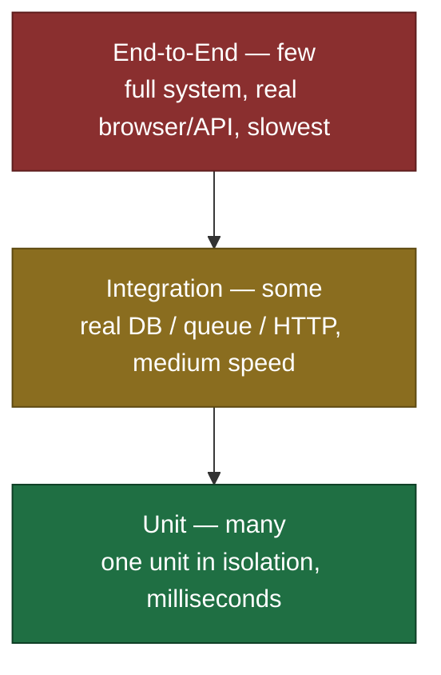

# Unit Tests — Middle Level

> Focus: "Why?" and "When does it bend?" — the trade-offs behind testing rules, when a guideline becomes a liability, and how to choose the right test for the job.

---

## Table of Contents

1. ["One assert per test" vs. "one concept per test"](#one-assert-per-test-vs-one-concept-per-test)
2. [Behavior vs. implementation testing](#behavior-vs-implementation-testing)
3. [Over-mocking: how tests get coupled to structure](#over-mocking-how-tests-get-coupled-to-structure)
4. [The test pyramid: ratios and when to climb it](#the-test-pyramid-ratios-and-when-to-climb-it)
5. [Test doubles: the full taxonomy](#test-doubles-the-full-taxonomy)
6. [Deterministic tests: controlling time, randomness, and IO](#deterministic-tests-controlling-time-randomness-and-io)
7. [What NOT to unit-test](#what-not-to-unit-test)
8. [Coverage: a guide, not a goal](#coverage-a-guide-not-a-goal)
9. [Classicist vs. mockist TDD](#classicist-vs-mockist-tdd)
10. [Common Mistakes](#common-mistakes)
11. [Test Yourself](#test-yourself)
12. [Cheat Sheet](#cheat-sheet)
13. [Summary](#summary)
14. [Further Reading](#further-reading)
15. [Related Topics](#related-topics)

---

## "One assert per test" vs. "one concept per test"

The junior rule is "one assert per test." It is a useful default, but taken literally it produces test files three times longer than they need to be, with five near-identical setup blocks. The real rule is **one concept per test** — and a concept can require multiple assertions.

The distinction: multiple asserts are fine when they describe **one logical outcome of one action**. They are a smell when they verify **unrelated behaviors** that could fail for different reasons.

```python
# GOOD: multiple asserts, ONE concept — "parsing this header yields this object"
def test_parses_authorization_header():
    auth = parse_authorization("Bearer abc123")

    assert auth.scheme == "Bearer"
    assert auth.token == "abc123"
    assert auth.is_valid is True
```

All three asserts describe the same parsed object. If the parser breaks, you want to see every field that's wrong, not fix one and re-run to discover the next.

```python
# BAD: multiple CONCEPTS in one test — two reasons to fail, fused together
def test_user_service():
    user = service.create("ada@example.com")
    assert user.id is not None              # concept 1: creation

    service.deactivate(user.id)
    assert service.get(user.id).active is False   # concept 2: deactivation
```

When this fails on line 1, you never learn whether deactivation works. Two concepts → two tests. The diagnostic value of a test is proportional to how precisely its name and its failure point to a single broken behavior.

> **Practical heuristic:** if the test name needs the word "and" (`test_creates_and_deactivates`), you almost certainly have two concepts. Split it.

The asserting-on-one-object case is so common that good test frameworks support it directly: AssertJ's `assertThat(obj).extracting(...)`, Python's `dataclass` equality, Go's `cmp.Diff` against an expected struct — all let you assert a whole object in one logical comparison.

```go
// Go: one assertion, whole-object — the cleanest form of "one concept"
func TestParseAuthorizationHeader(t *testing.T) {
    got := ParseAuthorization("Bearer abc123")
    want := Auth{Scheme: "Bearer", Token: "abc123", Valid: true}

    if diff := cmp.Diff(want, got); diff != "" {
        t.Errorf("ParseAuthorization() mismatch (-want +got):\n%s", diff)
    }
}
```

---

## Behavior vs. implementation testing

This is the single most important idea separating tests that help from tests that hurt. A **behavior test** asserts *what* the unit does — its observable outputs and effects. An **implementation test** asserts *how* it does it — which private methods ran, in what order, with what intermediate state.

Behavior tests survive refactoring. Implementation tests break on refactoring even when behavior is unchanged — which is exactly backwards, because **the entire point of having tests is to refactor safely**.

```java
// IMPLEMENTATION test — couples to HOW. Breaks if you swap the cache or reorder calls.
@Test
void getUser_checksCacheThenDatabase() {
    service.getUser(42);

    InOrder order = inOrder(cache, database);
    order.verify(cache).get(42);          // asserting the call sequence
    order.verify(database).findById(42);  // asserting an internal decision
}
```

If you later add a second cache tier, batch the DB lookups, or short-circuit on a cache hit, this test fails — yet the user-visible behavior is identical. The test is now an obstacle, not a safety net.

```java
// BEHAVIOR test — couples to WHAT. Survives any internal rewrite.
@Test
void getUser_returnsTheStoredUser() {
    database.save(new User(42, "Ada"));

    User result = service.getUser(42);

    assertThat(result.name()).isEqualTo("Ada");
}
```

The behavior version uses a real (or fake) database and asserts the returned value. You can rewrite caching strategy freely; as long as `getUser(42)` returns Ada, the test passes.

**When implementation detail legitimately *is* the behavior:** sometimes the interaction is the contract. If a `PaymentService` *must* call the fraud-check gateway before charging the card — and skipping it is a real defect, not an optimization — then verifying that call order is verifying behavior, not implementation. The test of "is this implementation or behavior?" is: *would a correct, behavior-preserving refactor ever change this?* If yes, you're over-specifying.

---

## Over-mocking: how tests get coupled to structure

Mocks make the *shape* of your code part of the test. Every `verify(mock).someMethod()` is an assertion that the method-under-test calls `someMethod` — a statement about internal structure. The more you mock, the more your tests describe your wiring diagram instead of your behavior.

The result is **brittle tests**: a refactor that splits one collaborator into two, or inlines a method, or changes a call into a batch, breaks dozens of tests that were "passing" only because they memorized the old structure.

```python
# OVER-MOCKED — three mocks, the test re-states the implementation line by line
def test_place_order(mocker):
    repo = mocker.Mock()
    pricing = mocker.Mock()
    notifier = mocker.Mock()
    pricing.total.return_value = 100
    repo.save.return_value = Order(id=1)

    service = OrderService(repo, pricing, notifier)
    service.place_order(cart)

    pricing.total.assert_called_once_with(cart)   # structure
    repo.save.assert_called_once()                # structure
    notifier.send.assert_called_once_with(1)      # structure
```

This test passes only if `place_order` calls exactly these three methods in this way. It is a transcription of the method body. It will catch a *typo* but break on every honest refactor and verify almost no actual outcome.

**The cure is usually a real object or a fake, not a mock.** Mock only what you cannot use for real in a unit test: things that are slow (network), non-deterministic (clock, RNG), or have side effects you don't want (sending real email, charging real cards). Pricing logic is none of those — use the real `PricingCalculator`.

```python
# REPAIRED — fake the unwanted side effect, use real logic, assert the outcome
def test_place_order_charges_full_total_and_notifies():
    repo = InMemoryOrderRepo()
    notifier = FakeNotifier()                    # records sends; doesn't hit SMTP
    service = OrderService(repo, PricingCalculator(), notifier)

    order = service.place_order(cart_with_two_items_at_50())

    assert repo.get(order.id).total == 100       # outcome, via real pricing
    assert notifier.sent_to(order.id)            # outcome, via observable state
```

Notice the repaired test asserts *outcomes* (`repo.get(...).total == 100`) reached through real collaborators, with a fake only where a side effect must be intercepted. Over-mocking is the root cause of most "we can't refactor, the tests will all break" complaints.

---

## The test pyramid: ratios and when to climb it

The test pyramid describes a healthy *ratio* of test types, sized by speed and scope:



| Layer | Scope | Speed | Count | Failure tells you |
|---|---|---|---|---|
| Unit | One class/function, deps faked | ~1 ms | thousands | *which* unit is broken |
| Integration | Unit + one real dependency (DB, queue, HTTP) | 10–500 ms | hundreds | *which seam* is broken |
| E2E | Whole system through the front door | seconds | tens | *that* something is broken |

The pyramid shape exists because of **feedback economics**: a 10,000-unit-test suite runs in seconds and pinpoints failures; a 10,000-E2E suite runs in hours and tells you only that *something somewhere* broke. Inverting the pyramid (an "ice cream cone" — many E2E, few unit) produces slow, flaky CI and undiagnosable failures.

**When an integration test is the right tool — not a compromise:**

- **The bug lives in the seam, not the unit.** SQL that's syntactically valid but semantically wrong, an ORM mapping, a serialization round-trip, a transaction boundary — none of these can be caught by a unit test with a mocked DB, because the mock returns whatever you told it to. Mocking the database to test a query asserts only that your assumptions match your assumptions.
- **The dependency is the thing under test.** Testing a repository implementation against a real PostgreSQL (via Testcontainers / `testing.T` + Docker / `pytest` fixtures) verifies the actual contract.
- **The configuration wiring is the risk.** Dependency-injection containers, framework auto-wiring, and serialization config fail at startup or at the boundary, not in any single unit.

The mistake is using an integration test where a unit test would do — paying 100× the runtime for logic that has no external dependency. Test pure business logic as units; reserve integration tests for the seams real dependencies introduce.

---

## Test doubles: the full taxonomy

"Mock" is colloquially used for all five, but they are distinct tools (Gerard Meszaros's taxonomy). Choosing the right one keeps tests both isolated and non-brittle.

| Double | Purpose | Has logic? | You assert on it? |
|---|---|---|---|
| **Dummy** | Fills a required parameter; never used | No | No |
| **Stub** | Returns canned answers to feed the path under test | Minimal | No (state-based) |
| **Spy** | A stub that *also* records how it was called | Minimal | Yes (after the fact) |
| **Mock** | Pre-programmed with expectations; verifies interactions | No | Yes (the verification *is* the test) |
| **Fake** | A working but simplified implementation | Yes | No (assert on real behavior) |

```python
# DUMMY — required but irrelevant to this test
service.process(order, logger=DummyLogger())   # logger never called on this path

# STUB — feeds a specific branch
clock = StubClock(now=datetime(2030, 1, 1))     # forces the "expired" branch
assert token.is_expired(clock) is True

# SPY — stub + records calls, asserted afterwards
class SpyMailer:
    def __init__(self): self.sent = []
    def send(self, to, body): self.sent.append((to, body))

mailer = SpyMailer()
service.notify(user, mailer)
assert mailer.sent == [("ada@x.com", "Welcome")]   # assert after acting

# MOCK — expectation set BEFORE acting; the framework fails if unmet
mailer = mocker.Mock()
service.notify(user, mailer)
mailer.send.assert_called_once_with("ada@x.com", "Welcome")

# FAKE — real behavior, simplified backing store
repo = InMemoryUserRepo()    # full save/get/delete semantics, just a dict inside
repo.save(User("ada"))
assert repo.get("ada").active
```

**When each fits:**

- **Dummy** — the signature forces an argument the test doesn't exercise.
- **Stub** — you need a collaborator to return a specific value to reach a code path. Use for queries.
- **Spy** — you want to verify an interaction *and* prefer asserting after the action (reads more naturally than pre-set expectations).
- **Mock** — the interaction itself is the contract (e.g., "must call the audit log"). Use sparingly; this is where brittleness comes from. Use for commands with no observable return.
- **Fake** — the dependency is queried in complex ways and a stub would need dozens of canned answers. A `Fake` (in-memory DB, in-memory clock) is the antidote to over-mocking: real behavior, no brittleness, no external resource.

> **Rule of thumb:** prefer **fakes for queries, mocks for commands**. If you're stubbing the same collaborator five different ways across a test file, you wanted a fake.

---

## Deterministic tests: controlling time, randomness, and IO

A test that sometimes fails is worse than no test — it trains the team to ignore red builds. The three classic sources of non-determinism are **time, randomness, and IO**, and the cure for all three is the same: **inject the source instead of calling it directly.**

```go
// BAD — reaches for the real clock; the assertion depends on wall-clock time
func IsExpired(t Token) bool {
    return time.Now().After(t.ExpiresAt)   // untestable without sleeping
}

// GOOD — time is a dependency, injected
type Clock interface{ Now() time.Time }

func IsExpired(t Token, clock Clock) bool {
    return clock.Now().After(t.ExpiresAt)
}

// Test uses a fixed clock — fully deterministic, no sleeps
func TestExpiredToken(t *testing.T) {
    clock := FixedClock{T: time.Date(2030, 1, 1, 0, 0, 0, 0, time.UTC)}
    tok := Token{ExpiresAt: time.Date(2029, 1, 1, 0, 0, 0, 0, time.UTC)}

    if !IsExpired(tok, clock) {
        t.Error("expected token to be expired")
    }
}
```

The same principle, applied to each source:

- **Time** — inject a `Clock`. Java: `java.time.Clock` (`Clock.fixed(...)` in tests). Python: pass a `now` callable, or use `freezegun`. Never call `LocalDateTime.now()` / `time.Now()` / `datetime.now()` inside testable logic.
- **Randomness** — inject the RNG with a fixed seed, or inject the random *result*. `Random(seed=42)` in Python; a `*rand.Rand` in Go; an injected `Random` in Java. A "pick a winner" function should take the random index as a parameter or take a seedable source.
- **IO** — inject the boundary (a `Repository`, an `HttpClient` interface, a `Clock`). The unit test uses a fake; the integration test uses the real thing. **Never let unit-level logic touch the filesystem, network, or system clock directly.**

```java
// Java — time injected via java.time.Clock, the idiomatic seam
class SubscriptionService {
    private final Clock clock;
    SubscriptionService(Clock clock) { this.clock = clock; }

    boolean isActive(Subscription s) {
        return Instant.now(clock).isBefore(s.expiresAt());
    }
}

@Test
void subscriptionExpiresExactlyAtBoundary() {
    Clock fixed = Clock.fixed(Instant.parse("2030-01-01T00:00:00Z"), ZoneOffset.UTC);
    var service = new SubscriptionService(fixed);

    assertThat(service.isActive(subscriptionExpiring("2029-12-31T23:59:59Z"))).isFalse();
}
```

A flaky test is a design smell pointing at a hidden, uninjected dependency. Fix the seam, not the symptom (`@Retry` on a flaky test hides the design flaw).

---

## What NOT to unit-test

More tests is not strictly better. Tests cost time to write, time to run, and — most expensively — time to *maintain when they break*. Some code earns its tests; some doesn't.

**Don't unit-test:**

- **Trivial getters/setters and pure data holders.** A test for `getName() returns name` asserts the language works. It will never catch a real bug and adds maintenance weight.
- **Framework / library code.** You don't test that Spring autowires, that the ORM saves, or that the standard library's `sort` sorts. Those are tested by their authors. Test *your* logic that uses them — preferably at the integration layer if a real dependency is involved.
- **Generated code.** DTOs from a schema, ORM entities, protobuf classes. If it's regenerated, don't hand-test it; test the code that *consumes* it.
- **Configuration and constants.** A test asserting `MAX_RETRIES == 3` just duplicates the constant; change one, you change both, and the test never caught anything.
- **Pure delegation with no logic.** A method that only forwards `a.foo()` to `b.foo()` is best covered by the test of whatever uses the result.

**Do test:** anything with a branch, a calculation, a transformation, an invariant, or a decision. The presence of an `if`, a loop, arithmetic, or a domain rule is the signal that a unit test will earn its keep.

> The question to ask: *"If this code were silently wrong, would any of my other tests fail?"* If yes, a dedicated test is redundant. If no, and the code has logic, write the test.

---

## Coverage: a guide, not a goal

Code coverage measures which lines/branches executed during the test run. It is genuinely useful — as a **flashlight for finding untested logic**, not as a target.

The failure mode is making coverage a goal (Goodhart's Law: "when a measure becomes a target, it ceases to be a good measure"). Chasing 100% produces tests that *execute* code without *asserting* anything about it:

```python
# 100% line coverage, ZERO behavior verified — the function runs, nothing is checked
def test_calculate_discount():
    calculate_discount(order)   # no assert! coverage tool reports this line green
```

Coverage tells you a line *ran*. It cannot tell you the line was *checked*. You can hit 100% coverage with tests that would pass even if every function returned `null`.

**How to use coverage well:**

- Treat **drops** as signals — a PR that lowers coverage usually added untested logic.
- Use **branch coverage**, not just line coverage — it reveals untested `else` paths and unhandled error branches, which is where bugs hide.
- Look at **what's uncovered**, not the percentage. An uncovered error-handling branch is a real gap; an uncovered getter is noise.
- Pair it with **mutation testing** (PIT for Java, `mutmut`/`cosmic-ray` for Python, `go-mutesting` for Go) when you want to know whether tests actually *assert*. Mutation testing flips a `>` to `>=` and checks whether a test fails — the true measure of test quality.

A team mandating "90% coverage" with no mutation/assertion discipline often ends up with high coverage and low confidence. Aim for *meaningful* coverage of *logic*, and don't sweat the last few percent of trivial code.

---

## Classicist vs. mockist TDD

Two schools of test-driven development, differing on how to handle collaborators:

- **Classicist (Detroit / state-based):** use real objects wherever feasible; substitute doubles only at genuine boundaries (DB, network, clock). Assert on **resulting state**. A "unit" can be a small cluster of cooperating classes. Champions: Kent Beck, Martin Fowler.
- **Mockist (London / interaction-based):** isolate the class-under-test from *all* collaborators using mocks; assert on **interactions** (which methods were called). A "unit" is strictly one class. Champions: Steve Freeman, Nat Pryce (*Growing Object-Oriented Software*).

| Dimension | Classicist | Mockist |
|---|---|---|
| Collaborators | Real objects / fakes | Mocked |
| Asserts on | State (return values, stored data) | Interactions (calls made) |
| Coupling to structure | Low — survives refactoring | Higher — can break on refactor |
| Drives design toward | Cohesive clusters | Many small roles/interfaces |
| Localization of failure | Coarser (cluster) | Sharp (one class) |
| Risk | Tests can be too broad | Brittle / tests-the-mock |

Neither is universally right. **Use classicist by default** — it produces the durable, behavior-focused tests this chapter advocates, and it's the safer choice for code you'll refactor often. **Reach for mockist** when designing the interaction protocol *is* the work: defining how a new component should talk to not-yet-built collaborators (outside-in design), or when the collaborator is genuinely a boundary (a port in hexagonal architecture). Most experienced teams land on a pragmatic blend: classicist for domain logic, mockist for orchestration across boundaries.

---

## Common Mistakes

1. **Asserting on mocks instead of outcomes.** `verify(mock).save(...)` proves a call happened, not that the *result* is correct. Prefer asserting the stored/returned state via a fake.
2. **Mocking value objects and data structures.** Never mock a `Money`, a `LocalDate`, or a list. Construct the real thing — it's cheap and deterministic. Mock only behavior-bearing boundaries.
3. **Mocking types you don't own.** Mocking a third-party `HttpClient` bakes your *assumptions* about its API into tests. Wrap it in your own interface and mock that; verify the real one with a thin integration test.
4. **Shared mutable state between tests.** A static cache, a class-level fixture mutated in place, or test-ordering dependence makes tests pass alone but fail in suite (or vice versa). Each test must set up and tear down its own world.
5. **`Thread.sleep` / `time.sleep` to "wait" for async work.** Slow *and* flaky. Use awaitility-style polling with a deadline, or inject a controllable scheduler.
6. **Setup longer than the test.** A 40-line `@BeforeEach` building objects most tests don't need signals missing test-data builders. Use the Builder/Object Mother pattern; let each test express only what it cares about.
7. **Testing private methods directly** (via reflection or by widening visibility). Private methods are implementation; test them through the public API. If a private method is too complex to reach that way, it wants to be its *own* public unit on a new class.
8. **One giant test "for the happy path."** Bundling create-update-delete into one test destroys failure localization. One concept, one test.
9. **Treating coverage percentage as the deliverable.** Green coverage with no assertions is theater. Measure whether tests *fail when the code is wrong*.

---

## Test Yourself

<details>
<summary>1. A test has four assertions on the same returned object. Is that a violation of "one assert per test"?</summary>

No. The real rule is **one concept per test**, and a single returned object is one concept. Four asserts that all describe the same outcome (the parsed result, the computed invoice) are fine and even desirable — they show every wrong field at once. It's a violation only if the asserts cover *unrelated* behaviors that fail for different reasons.
</details>

<details>
<summary>2. Why do over-mocked tests make refactoring harder, when the whole point of tests is to enable refactoring?</summary>

Because mocks assert on *interactions* — which methods get called, in what order, with what arguments. Those are statements about the code's internal structure. A behavior-preserving refactor (splitting a collaborator, batching calls, inlining a method) changes the interactions without changing the result, so the mocks fail even though nothing is actually broken. The tests now resist the very change they were supposed to make safe.
</details>

<details>
<summary>3. You need to test a SQL query that filters and joins. Unit test with a mocked DB, or integration test with a real DB?</summary>

Integration test with a real database (Testcontainers, an embedded DB, or a Docker fixture). Mocking the database means the mock returns whatever you tell it — so the test asserts your assumptions match your assumptions, and cannot catch a semantically wrong query, a bad join, or an ORM mapping error. The bug lives in the *seam* with the database, which only a real database exercises.
</details>

<details>
<summary>4. When is a mock the right double, and when should you reach for a fake instead?</summary>

Use a **mock** when the interaction itself is the contract — a command with no observable return value that *must* happen (e.g., "must write to the audit log"). Use a **fake** when the collaborator is *queried* in varied ways and a stub would need many canned answers — an in-memory repository or clock gives real behavior without brittleness or external resources. Heuristic: fakes for queries, mocks for commands; and if you're stubbing one collaborator five different ways, you wanted a fake.
</details>

<details>
<summary>5. A test passes locally but fails ~5% of the time in CI. What's the likely root cause and the right fix?</summary>

A hidden non-deterministic dependency — almost always time, randomness, or IO called directly inside the logic (`now()`, an unseeded RNG, a network/filesystem hit, or a `sleep`-based async wait). The right fix is to **inject the source** (a `Clock`, a seeded RNG, an IO boundary interface) so the test controls it deterministically. Adding `@Retry` or increasing a sleep hides the design flaw; it doesn't fix it.
</details>

<details>
<summary>6. Your team mandates 100% line coverage. Why might confidence still be low?</summary>

Line coverage only proves a line *executed*, not that anything was *asserted* about it. A test can call a function with no assertions, hit 100% coverage, and pass even if the function always returned null. Use **branch coverage** to reveal untested paths, and **mutation testing** to verify tests actually fail when the code is wrong. Coverage is a flashlight for finding gaps, not a measure of quality.
</details>

<details>
<summary>7. Should you write a unit test for a getter, a constant, or an ORM-generated entity?</summary>

No. Getters and constants have no logic — a test for them asserts the language/compiler works and only adds maintenance cost. Framework- and tool-generated code is the author's responsibility, not yours. Test code with a *branch, calculation, transformation, or invariant* — and test the code that *consumes* generated types, ideally at the integration layer if a real dependency is involved.
</details>

<details>
<summary>8. A teammate tests a private method via reflection. What does that tell you, and what should they do?</summary>

It signals the private method is doing enough that it deserves its own home. Tests should exercise the **public API**; testing privates couples tests to implementation and breaks on refactor. The fix: either reach the private logic through the public method (if it's genuinely a detail), or — if it's complex and independently meaningful — extract it into its own class with a public method and test *that* directly.
</details>

<details>
<summary>9. Classicist or mockist: which produces more refactor-resilient tests, and when would you still pick the other?</summary>

**Classicist** (real objects/fakes, assert on state) produces the more durable, behavior-focused tests because it doesn't encode the call structure. Pick **mockist** (isolate with mocks, assert on interactions) when designing the *interaction protocol* is the actual work — outside-in design of how a new component talks to not-yet-built collaborators, or at a true architectural boundary (a port). Most teams blend: classicist for domain logic, mockist across boundaries.
</details>

<details>
<summary>10. Your `@BeforeEach` is 50 lines; most tests use a fraction of it. What's the smell and the cure?</summary>

The smell is opaque, shared setup that hides what each test actually depends on and forces every test to carry irrelevant state. The cure is a **test-data builder / Object Mother**: a fluent helper that creates a sensible default object, where each test overrides only the one field it cares about (`aUser().withExpiredSubscription().build()`). The test then reads as a precise statement of its own preconditions.
</details>

---

## Cheat Sheet

| Situation | Do this | Not this |
|---|---|---|
| Multiple asserts | One *concept* per test (whole-object compare is fine) | Mechanically one assert per test |
| Choosing what to assert | Observable behavior / state | Internal calls and order |
| Isolating a side effect | Fake or spy at the boundary | Mock every collaborator |
| Query collaborator | Fake (in-memory) | Five different stubs |
| Command collaborator (must-happen) | Mock + verify | Nothing (silently untested) |
| Testing a SQL query / ORM mapping | Integration test, real DB | Unit test, mocked DB |
| Time / randomness / IO in logic | Inject a `Clock` / seed / boundary | Call `now()` / unseeded RNG directly |
| Async wait | Poll with deadline | `sleep(n)` |
| Getters, constants, generated code | Don't unit-test | "100% coverage" tests |
| Coverage | Flashlight for gaps + mutation testing | A target to hit |
| Complex private logic | Extract to its own public unit | Reflection / widened visibility |
| Default TDD style | Classicist (state) | Mockist everywhere |

**Test double quick-pick:** Dummy (fill a param) · Stub (feed a value) · Spy (record + assert after) · Mock (verify must-happen interaction) · Fake (real behavior, in-memory).

---

## Summary

The junior rules ("one assert," "use mocks," "high coverage") are scaffolding. The middle-level skill is knowing *why* they exist and *when they bend*:

- **One concept per test**, not one assert — multiple asserts on one outcome are good.
- **Test behavior, not implementation** — so tests survive the refactors they're meant to protect.
- **Over-mocking couples tests to structure** and is the usual cause of "we can't refactor." Prefer fakes; mock only boundaries and must-happen commands.
- **The test pyramid** is about feedback economics; an integration test is the *right* tool when the bug lives in a seam (DB, serialization, wiring), not a unit.
- **Five test doubles, five jobs** — fakes for queries, mocks for commands.
- **Determinism comes from injection** — control time, randomness, and IO; a flaky test is an uninjected dependency.
- **Don't test trivia** — getters, constants, framework and generated code earn nothing.
- **Coverage is a flashlight, not a finish line** — use branch coverage and mutation testing to know tests actually assert.
- **Classicist by default, mockist at boundaries.**

---

## Further Reading

- *Test-Driven Development by Example* — Kent Beck (the classicist canon).
- *Growing Object-Oriented Software, Guided by Tests* — Freeman & Pryce (the mockist / outside-in canon).
- *xUnit Test Patterns* — Gerard Meszaros (the source of the dummy/stub/spy/mock/fake taxonomy).
- "Mocks Aren't Stubs" — Martin Fowler (the definitive classicist-vs-mockist essay).
- *Working Effectively with Legacy Code* — Michael Feathers (seams, characterization tests, testing the untestable).
- *Unit Testing Principles, Practices, and Patterns* — Vladimir Khorikov (behavior-vs-implementation, the four pillars of a good test).

---

## Related Topics

- [`junior.md`](junior.md) — the baseline rules: F.I.R.S.T., Arrange-Act-Assert, what a unit test is.
- [`senior.md`](senior.md) — test architecture at scale, contract testing, CI strategy, test suites as a product.
- [Chapter README](../README.md) — the positive rules and anti-patterns of this chapter.
- [`../07-boundaries/README.md`](../07-boundaries/README.md) — learning tests and wrapping third-party code (the boundary you fake).
- [`../10-emergence/README.md`](../10-emergence/README.md) — "tests enable refactoring," the first rule of simple design.
- [`../../refactoring/README.md`](../../refactoring/README.md) — why behavior-focused tests are the prerequisite for safe refactoring.
- [`../../design-patterns/README.md`](../../design-patterns/README.md) — dependency injection and the patterns that make code testable.
