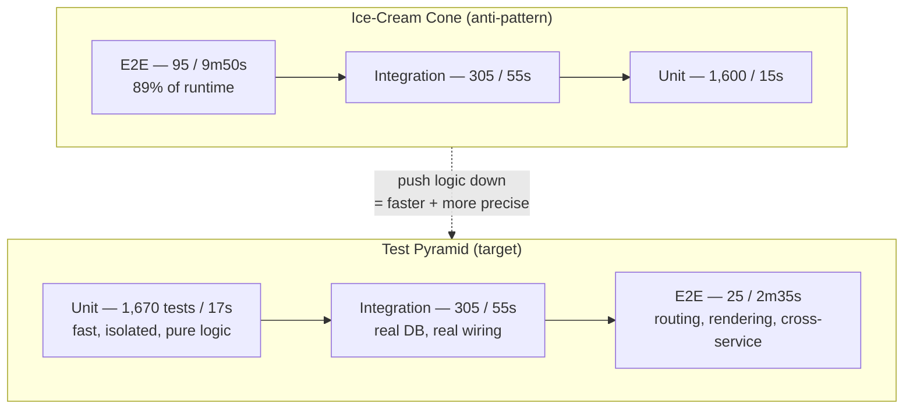
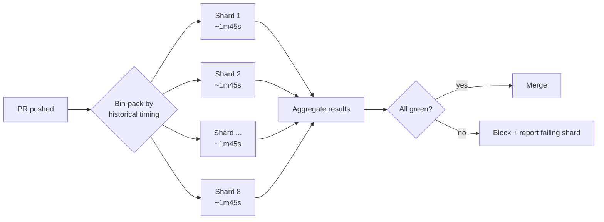

# Unit Tests — Optimize & Reconcile

> A test suite that takes 12 minutes to run is, in practice, a suite that runs once a day. The **F** in FIRST — *Fast* — is not cosmetic: it is the load-bearing property that lets TDD work at all. This file reconciles the two forces that pull against each other in every test suite: **trust** (the suite catches real regressions and you believe its green) and **speed** (the suite is cheap enough that you run it on every save). Each scenario starts from a slow or untrustworthy suite, measures it, and resolves the tension with a principle — not a hack. The wrong optimizations buy speed by destroying trust (deleting assertions, sharing mutable fixtures, retrying flaky tests until green). The right ones buy speed *and keep* trust.

---

## Table of Contents

1. [The 8-minute suite that killed the TDD loop](#scenario-1--the-8-minute-suite-that-killed-the-tdd-loop)
2. [`t.Parallel` exposes a shared-state bug (Go)](#scenario-2--tparallel-exposes-a-shared-state-bug-go)
3. [JUnit 5 parallel execution and the static singleton (Java)](#scenario-3--junit-5-parallel-execution-and-the-static-singleton-java)
4. [pytest-xdist and the shared temp directory (Python)](#scenario-4--pytest-xdist-and-the-shared-temp-directory-python)
5. [Replacing a real database with an in-memory fake](#scenario-5--replacing-a-real-database-with-an-in-memory-fake)
6. [The inverted pyramid: 90% of runtime in 5% of tests](#scenario-6--the-inverted-pyramid-90-of-runtime-in-5-of-tests)
7. [Suite-level fixture vs per-test isolation (Python)](#scenario-7--suite-level-fixture-vs-per-test-isolation-python)
8. [The flaky-retry tax](#scenario-8--the-flaky-retry-tax)
9. [Profiling a slow suite to find the real cost](#scenario-9--profiling-a-slow-suite-to-find-the-real-cost)
10. [Test selection / impacted-tests / build caching](#scenario-10--test-selection--impacted-tests--build-caching)
11. [testcontainers vs in-memory: realism vs speed](#scenario-11--testcontainers-vs-in-memory-realism-vs-speed)
12. [CI sharding: 14 minutes to 2 minutes](#scenario-12--ci-sharding-14-minutes-to-2-minutes)
13. [`sleep` in tests and the time tax](#scenario-13--sleep-in-tests-and-the-time-tax)
14. [bcrypt cost factor in the test config (Java)](#scenario-14--bcrypt-cost-factor-in-the-test-config-java)

---

### Scenario 1 — The 8-minute suite that killed the TDD loop

A 1,400-test backend suite takes **8m 10s** locally. The team writes tests, but nobody runs the suite before pushing — they wait for CI. TDD's red-green-refactor loop, which needs sub-10-second feedback to be usable, is dead. Bugs land in `main` and are caught hours later.

<details><summary>Resolution</summary>

**Measurement first.** Categorize by type before touching anything:

```
$ go test ./... -json | <tally by package>
unit (pure logic):        1,180 tests   →   9s
integration (real DB):      190 tests   →  6m 40s
e2e (HTTP + DB + queue):     30 tests   →  1m 21s
```

The 1,180 *unit* tests already run in 9 seconds. The problem is the inner loop is being run *together with* the slow tiers. The fix is not "make integration tests faster" — it is **separate the tiers so the fast feedback loop exists independently**.

In Go, tag the slow ones with build tags or `testing.Short()`:

```go
func TestOrderRepository_Integration(t *testing.T) {
    if testing.Short() {
        t.Skip("skipping integration test in -short mode")
    }
    // ... real DB ...
}
```

Now the inner loop is `go test -short ./...` → **9 seconds**. The full suite still runs on every push and in CI. Nothing was deleted; nothing lost trust. We *partitioned* the suite so the property "fast" applies to the tier that needs it (the TDD loop) without forcing the integration tier to lie about what it tests.

**Principle:** *Fast* is a property of the **inner-loop suite**, not of every test that exists. The mistake is treating "the suite" as one monolith. A 9-second unit suite + a 6-minute integration suite run on push is a healthy split; an 8-minute everything-suite is not.

</details>

---

### Scenario 2 — `t.Parallel` exposes a shared-state bug (Go)

A unit suite runs in 9s serially. Adding `t.Parallel()` to every test should cut it to ~2s on an 8-core machine. Instead, three tests now fail **intermittently** — sometimes all green, sometimes one red.

```go
var counter int // package-level

func TestIncrement(t *testing.T) {
    t.Parallel()
    counter = 0
    increment()
    if counter != 1 { t.Fatalf("got %d", counter) }
}

func TestIncrementTwice(t *testing.T) {
    t.Parallel()
    counter = 0
    increment(); increment()
    if counter != 2 { t.Fatalf("got %d", counter) }
}
```

<details><summary>Resolution</summary>

Parallelism did not *create* a bug — it *revealed* one. The two tests share the package-level `counter`. When they run concurrently, `TestIncrementTwice` resets `counter = 0` between the two `increment()` calls of... no — between operations of `TestIncrement`. The interleaving makes the assertions race. Run `go test -race` and it reports a genuine data race.

**The shared state is itself the smell.** A test that mutates package-level globals is not isolated (the **I** in FIRST). The resolution is to remove the shared mutable state, not to remove `t.Parallel()`:

```go
func TestIncrement(t *testing.T) {
    t.Parallel()
    c := &Counter{}      // local instance, owned by this test
    c.Increment()
    if c.Value() != 1 { t.Fatalf("got %d", c.Value()) }
}
```

Now parallelism is safe and the suite drops to **2.1s**. The general rule: **parallelism is a free speedup only for tests that were already isolated.** If `t.Parallel()` breaks a test, the test was already lying about isolation — it passed serially by accident of execution order. Add `-race` to CI permanently so the next shared-state regression fails loudly instead of flaking.

**Anti-resolution to reject:** "just don't parallelize those three." That keeps the latent ordering dependency, which will bite later (e.g., when someone reorders tests, or runs a single test in isolation). Fix the isolation.

</details>

---

### Scenario 3 — JUnit 5 parallel execution and the static singleton (Java)

A 900-test JUnit 5 suite takes **3m 20s**. Enabling parallel execution:

```properties
# junit-platform.properties
junit.jupiter.execution.parallel.enabled=true
junit.jupiter.execution.parallel.mode.default=concurrent
```

cuts it to **48s** on a 12-core box — but `PriceCalculatorTest` and `DiscountServiceTest` now fail randomly.

<details><summary>Resolution</summary>

Both touch a global mutable singleton:

```java
public final class FeatureFlags {
    private static boolean PROMO_ENABLED = false; // process-wide static
    public static void setPromoEnabled(boolean v) { PROMO_ENABLED = v; }
}
```

One test sets the flag true, the other assumes it false; concurrent execution interleaves them. Three legitimate resolutions, in order of preference:

1. **Remove the global.** Inject `FeatureFlags` as a dependency so each test gets its own instance. This is the real fix — the static was a testability defect, parallelism merely surfaced it.

2. **If you cannot remove it yet**, declare the resource contract so JUnit serializes only the tests that touch it, keeping everyone else parallel:

   ```java
   @ResourceLock("FEATURE_FLAGS")
   class PriceCalculatorTest { ... }

   @ResourceLock("FEATURE_FLAGS")
   class DiscountServiceTest { ... }
   ```

   JUnit guarantees these two never run concurrently, while the other 898 tests still parallelize. Suite stays at ~50s.

3. **Worst option (reject):** disable parallelism globally. You pay 3m 20s to avoid fixing two tests.

**Principle:** declare shared resources explicitly (`@ResourceLock`) so the framework can maximize parallelism while preserving correctness. A `synchronized` block or `@Execution(SAME_THREAD)` on the whole class is a blunter version of the same idea. The static field remains a smell to pay down — see [boundaries](../07-boundaries/README.md) on isolating third-party and global state behind an injectable seam.

</details>

---

### Scenario 4 — pytest-xdist and the shared temp directory (Python)

A 600-test pytest suite runs in **2m 50s**. Adding xdist:

```
$ pytest -n auto      # spawns 8 workers
```

drops it to **34s** — but `test_export_report` and `test_import_report` now fail ~1 run in 5.

<details><summary>Resolution</summary>

Both write to a hardcoded path:

```python
def test_export_report():
    export("/tmp/report.csv")           # fixed path
    assert os.path.exists("/tmp/report.csv")
```

Under xdist, two workers run these in separate processes that share the same filesystem. They collide on `/tmp/report.csv`. The bug is **a shared external resource with a fixed name**, exposed by process-level parallelism.

Resolve by giving each test a private, unique path via the `tmp_path` fixture (pytest creates a fresh per-test directory):

```python
def test_export_report(tmp_path):
    target = tmp_path / "report.csv"
    export(str(target))
    assert target.exists()
```

For genuinely shared resources that *must* be per-worker (a database, a port), use the xdist `worker_id`:

```python
@pytest.fixture(scope="session")
def db_url(worker_id):
    # worker_id is "gw0".."gw7" under xdist, "master" without it
    return f"postgresql://localhost/test_{worker_id}"
```

Each worker gets its own database; no cross-worker contention. Suite stays at 34s.

**Principle (mirrors Scenarios 2 & 3 across three languages):** parallelism is the *test* for isolation. Go's goroutine-level `t.Parallel`, JUnit's thread-level concurrency, and xdist's process-level workers all expose the same class of bug — shared mutable state, whether a variable, a static, or a file. The resolution is always "make state private to the test," never "turn off parallelism." Process isolation (xdist) is actually the *safest* of the three because separate processes don't share memory — only the filesystem, sockets, and databases remain as shared surfaces to dedupe.

</details>

---

### Scenario 5 — Replacing a real database with an in-memory fake

`UserService` tests each spin up a real Postgres connection, run a migration, insert rows, assert, and truncate. 80 such tests take **52s** — 650ms each, almost all of it connection + migration overhead, not logic.

<details><summary>Resolution</summary>

These are *unit* tests of `UserService` logic that happen to drag a database along. The database is a collaborator, not the subject. Replace it with an **in-memory fake repository** — a hand-written double that honors the same contract:

```go
// Real interface the service depends on:
type UserRepo interface {
    Save(u User) error
    FindByEmail(e string) (User, bool)
}

// In-memory fake — a real implementation, not a mock:
type FakeUserRepo struct{ byEmail map[string]User }

func NewFakeUserRepo() *FakeUserRepo { return &FakeUserRepo{byEmail: map[string]User{}} }
func (r *FakeUserRepo) Save(u User) error      { r.byEmail[u.Email] = u; return nil }
func (r *FakeUserRepo) FindByEmail(e string) (User, bool) { u, ok := r.byEmail[e]; return u, ok }
```

The 80 service tests now run against `FakeUserRepo` in **0.4s total** — a **130× speedup**.

**The trust you must NOT lose:** a fake that diverges from the real database silently re-introduces bugs (e.g., the fake is case-insensitive on email but Postgres with a `citext` column behaves differently, or the fake never enforces the unique constraint). Two guards keep the fake honest:

1. **A contract test** run against *both* the fake and the real implementation, proving they agree on the behaviors the service relies on:

   ```go
   func runRepoContract(t *testing.T, repo UserRepo) {
       require.NoError(t, repo.Save(User{Email: "a@x.com"}))
       _, ok := repo.FindByEmail("a@x.com")
       require.True(t, ok)
   }
   func TestFakeRepo_Contract(t *testing.T)  { runRepoContract(t, NewFakeUserRepo()) }
   func TestRealRepo_Contract(t *testing.T)  { runRepoContract(t, newPostgresRepo(t)) } // -short skips
   ```

2. **Keep a thin slice of real-DB integration tests** (5-10, not 80) that exercise the actual SQL, constraints, and migrations. The fake covers logic-breadth fast; the real DB covers integration-correctness with a few high-value cases.

**Principle:** prefer a **fake** (working in-memory implementation) over a **mock** (records calls and asserts on them) for replacing infrastructure. A fake lets you test *behavior* (what the system does) instead of *interaction* (which methods got called) — see [mocking-strategies] in the related skills. The contract test is what converts "fast but maybe wrong" into "fast *and* trustworthy."

</details>

---

### Scenario 6 — The inverted pyramid: 90% of runtime in 5% of tests

A suite has 2,000 tests / **11m**. Profiling the tiers:

```
e2e (browser, full stack):    95 tests  →  9m 50s   (89% of runtime,  5% of tests)
integration:                 305 tests  →    55s
unit:                      1,600 tests  →    15s
```

Adding a feature requires touching 8 e2e tests; each local run costs 10 minutes. The suite shape is an **ice-cream cone**, not a pyramid.

<details><summary>Resolution</summary>

The test pyramid is not an aesthetic preference — it is a **performance strategy**. Cost-per-test rises ~10× per tier (unit ~10ms, integration ~200ms, e2e ~6s here), so runtime is dominated by whichever tier you over-invest in. Pushing test coverage *down* the pyramid is the single largest lever on suite speed.

Audit the 95 e2e tests by **what each uniquely verifies**:

- ~70 of them assert *business logic* ("a 3-item cart with a 10% coupon totals $X") that could be a 10ms unit test. They use e2e only because that's how the team writes tests, not because the browser is essential.
- ~25 genuinely verify *integration*: routing, auth redirects, the actual HTML rendering, the checkout happy path across services. These belong at e2e.

Rewrite the 70 as unit tests of the pricing/cart logic. The pyramid rebalances:

```
e2e:           25 tests  →  2m 35s
integration:  305 tests  →     55s
unit:       1,670 tests  →     17s
total:                       ~3m 47s   (down from 11m)
```

The 70 moved tests are now **faster *and* more precise**: when cart math breaks, a unit test names the exact function, whereas the old e2e test reported "checkout page total is wrong" after 6 seconds of browser orchestration.

**Principle:** keep a thin layer of e2e tests for *integration confidence* and push *logic verification* down to unit tests. An e2e test should fail only for reasons no cheaper test could catch (real routing, real rendering, real cross-service wiring). Every e2e test that fails for a pure-logic bug is a misplaced test paying a 600× runtime tax. This is the same Move Method instinct from refactoring, applied to tests: put the assertion where the cheapest tool can make it.



</details>

---

### Scenario 7 — Suite-level fixture vs per-test isolation (Python)

A pytest module has 40 tests; each rebuilds an expensive in-memory graph (parse a 4 MB schema file, build an index). Per-test, that setup costs 300ms → **12s** of pure setup. Switching the fixture to `scope="module"` builds the graph once and shares it → **0.3s** of setup. But now `test_add_node` fails when run *after* `test_remove_node`.

<details><summary>Resolution</summary>

This is the central optimize trade-off in fixtures: **amortizing expensive setup across tests** (fast) **vs per-test isolation** (trustworthy). Sharing a fixture is safe *only if tests don't mutate it*. The two failing tests mutate the shared graph, so order now matters — an isolation violation.

Decision rule:

- **Setup is expensive AND the object is read-only for all tests** → share it (`scope="module"` / `scope="session"`). Maximum speedup, zero isolation risk.
- **Tests mutate the object** → either give each test its own copy, or share an *immutable* base and layer per-test mutations on a cheap clone.

Best of both: build the expensive part once (session scope), then hand each test a cheap, isolated copy:

```python
@pytest.fixture(scope="session")
def base_graph():
    return build_graph("schema_4mb.json")   # paid ONCE per session: 300ms

@pytest.fixture
def graph(base_graph):
    return base_graph.copy()                 # per-test: ~2ms shallow clone
```

The 300ms parse happens once; each test gets a fresh, isolated `graph` for ~2ms. Total setup: **300ms + 40×2ms ≈ 0.38s**, and isolation is restored. We bought ~97% of the speedup *without* sacrificing the **I** in FIRST.

If a true deep copy is itself expensive, that is a signal the fixture object is too large for a unit test — push the mutation tests down to a smaller object, or accept module scope only for the genuinely read-only tests and keep mutating tests function-scoped.

**Java/Go equivalents:** JUnit 5 `@BeforeAll` (per-class, static) vs `@BeforeEach`; Go `TestMain` for one-time setup vs per-test setup. Same rule — share read-only, isolate mutable.

**Anti-resolution to reject:** keeping `scope="module"` and "just ordering the tests so it works." Test-order dependence is the most insidious flakiness: it survives until someone parallelizes (Scenario 2-4), shards (Scenario 12), or runs one test alone, then fails inexplicably.

</details>

---

### Scenario 8 — The flaky-retry tax

CI flakes ~8% of runs. Someone adds automatic retries: `pytest --reruns 3`. Green-rate recovers, but the suite's *wall-clock* on a flaky run jumps from 4m to 11m, and developers have started ignoring failures ("just hit rerun").

<details><summary>Resolution</summary>

Auto-retry is a **debt instrument with compounding interest**. It trades a one-time fix cost for a recurring tax paid by every run, plus a hidden trust cost: once retries are normal, *real* failures get retried away too, and the suite stops being a signal. Quantify the tax:

- Each flaky test that needs 3 reruns to pass costs `3 × test_time` on every failing run, and retries run *serially after* the failure, so they often land on the critical path.
- 8% flake rate across ~2,000 tests means dozens of reruns per CI run. The 4m→11m jump is that tax made visible.

The correct sequence:

1. **Measure flakiness, don't hide it.** Tag and track. pytest can record reruns; in CI, fail the *build's quality gate* if flake rate exceeds a threshold so the debt stays visible.
2. **Quarantine, then fix.** Move known-flaky tests to a separate suite that runs but doesn't block merges, with a tracking issue and an owner. This stops them from masking real failures *without* deleting coverage.
3. **Root-cause the flake.** Almost always one of: shared state (Scenarios 2-4), time/`sleep` dependence (Scenario 13), test-order dependence (Scenario 7), real-network calls, or unseeded randomness.

A bounded retry (e.g., 1 retry) as a *last-resort* shock absorber for irreducibly nondeterministic e2e tests is defensible — but it must be paired with flake-rate tracking, or it silently rots the suite. Retry is a thermometer reading you log, never a cure you apply and forget.

**Principle:** a flaky test is worse than no test — it costs runtime *and* erodes trust in green. Optimizing the *retry budget* down to zero by fixing root causes is faster and more trustworthy than tuning the retry count up. See [find-bug](find-bug.md) for diagnosing the specific flake categories.

</details>

---

### Scenario 9 — Profiling a slow suite to find the real cost

A 700-test suite takes **6m**. The team's instinct is "the database tests are slow, let's mock the DB." Before spending a week on that, profile.

<details><summary>Resolution</summary>

**Never optimize a suite by guessing.** Each language has a built-in profiler; use it first.

**Python — `--durations`:**

```
$ pytest --durations=15
==== slowest 15 durations ====
58.0s  test_full_catalog_import       <- ONE test
41.0s  test_search_reindex
12.0s  test_pdf_generation
 0.9s  test_user_login
 ...
```

Two tests account for **99 seconds** — 27% of the entire suite. The "database tests" the team blamed are 0.2s each. The win is not mocking the DB; it's the import test, which loads a 200k-row fixture to assert that "import doesn't crash." Shrink its fixture to 200 representative rows: 58s → 0.4s.

**Go — per-test timing and CPU profile:**

```
$ go test ./... -v 2>&1 | grep -E '^(ok|--- PASS)' | sort -k3 -h | tail
$ go test ./services -run TestSearch -cpuprofile=cpu.out && go tool pprof cpu.out
```

`pprof` will show whether the time is in *your* logic, in the DB driver, or — frequently — in test *setup* (re-running migrations per test).

**Java — JUnit timing + JFR:**

```
@RegisterExtension static TimingExtension timing = new TimingExtension(); // logs per-test ms
$ mvn test -Dtest=SlowSuite -Djdk.attach.allowAttachSelf=true # attach JFR / async-profiler
```

**Principle:** suite runtime is almost always **Pareto-distributed** — a handful of tests dominate. Profiling tells you *which*, so a day of work targeting the top 5 tests beats a week of blanket "mock everything." The blanket approach also costs trust (Scenario 5's divergence risk) for tests that were never the bottleneck. Measure, then cut the long tail's head.

</details>

---

### Scenario 10 — Test selection / impacted-tests / build caching

A monorepo runs **all** 12,000 tests on every PR — **22m** — even when the PR only touches one leaf package's README or one service's pricing logic. Developers wait 22 minutes to validate a one-line change.

<details><summary>Resolution</summary>

Running every test on every change ignores the dependency graph. Two complementary levers:

**1. Build/test caching — skip what hasn't changed.** Go caches test results by default, keyed on the compiled inputs:

```
$ go test ./...        # first run
$ go test ./...        # second run, no changes:
ok   example.com/pricing   (cached)
ok   example.com/orders    (cached)
```

A cached package returns in microseconds. Only packages whose inputs changed actually re-run. Bazel and Nx generalize this across languages with content-addressed, *remote* caches shared by the whole team and CI — if any machine has run a target with identical inputs, everyone reuses the result.

**2. Impacted-test selection — run only what *could* be affected.** Tools that model the dependency DAG (`bazel test //... --build_tests_only` with target determination, `nx affected --target=test`) compute the set of targets transitively downstream of the changed files and test only those:

```
$ nx affected --target=test --base=main
   Running tests for 2 of 47 projects affected by changes...
```

A PR touching `pricing` runs `pricing`'s tests plus everything that depends on `pricing` — perhaps 400 tests / **40s** instead of 12,000 / 22m.

**The trust requirement:** test selection is only safe if the dependency graph is **complete and honest**. A hidden dependency the graph doesn't know about (a test that reads a shared config file, a runtime reflection-based wiring) can cause a real regression to be *not selected* and slip through. Guards:

- Keep the graph accurate; treat "test passed selection but broke `main`" as a graph bug to fix, not a flake to retry.
- Run the **full** suite on the merge to `main` (or nightly) as a backstop, even if PRs run only the affected subset. Fast feedback on PRs, total coverage before release.

**Principle:** the cheapest test is the one you correctly *don't run*. Caching skips unchanged work; impacted-selection skips unaffected work. Both preserve trust only if their inputs (cache keys, dep graph) are sound — an unsound cache key that ignores a real input is exactly Scenario 5's divergence bug in a new costume.

</details>

---

### Scenario 11 — testcontainers vs in-memory: realism vs speed

The team replaced their Postgres integration tests with H2 (in-memory SQL) "for speed." Tests dropped from 90s to 8s — but a production bug shipped: a query using Postgres `JSONB` operators and `ON CONFLICT ... DO UPDATE` that H2 silently accepted with different semantics. The fast tests were *fast and wrong*.

<details><summary>Resolution</summary>

This is the realism/speed frontier. The choices, with their actual costs:

| Double | Speed | Fidelity | Right use |
|---|---|---|---|
| In-memory fake (hand-written) | ~0ms | logic only | service-logic unit tests (Scenario 5) |
| H2 / SQLite "compatibility mode" | ~5ms | *approximate* SQL | rarely — divergence ships bugs |
| Testcontainers (real Postgres in Docker) | ~50ms/test + ~3s once | exact prod engine | SQL-correctness integration tests |
| Shared real DB | varies | exact | discouraged — shared state |

H2's "Postgres mode" is the dangerous middle: fast enough to be tempting, similar enough to pass, different enough to ship bugs. **For tests whose entire purpose is verifying real SQL behavior, the production engine is the only trustworthy substrate.** Use Testcontainers:

```java
@Testcontainers
class OrderQueryIT {
    @Container
    static PostgreSQLContainer<?> pg = new PostgreSQLContainer<>("postgres:16")
            .withReuse(true);          // reuse the container across runs/classes

    @Test void jsonbContainmentQuery() { /* real JSONB, real ON CONFLICT */ }
}
```

Speed it up without losing fidelity:

- **`withReuse(true)`** keeps the container alive across test runs (saves the ~3s startup repeatedly during local TDD).
- **Singleton container** shared across all integration test classes — start once per JVM, not once per class.
- **Template databases**: create the schema once, then `CREATE DATABASE x TEMPLATE base` per test for a cheap, isolated copy (Postgres clones in tens of ms) — Scenario 7's "expensive-once, cheap-per-test" pattern applied to databases.

Result: real Postgres semantics, ~50ms/test, isolated — and the JSONB bug fails in CI instead of production.

**Principle:** match fidelity to what the test *claims to verify*. A logic test should use a fast fake (it doesn't claim to verify SQL). A SQL test must use the real engine (it claims exactly that). The error is using a low-fidelity double for a test whose value depends on high fidelity — that's buying speed with counterfeit trust. See [boundaries](../07-boundaries/README.md): the seam between your code and a third-party engine is exactly where fidelity matters most.

</details>

---

### Scenario 12 — CI sharding: 14 minutes to 2 minutes

After all local optimizations, the *full* CI suite is an honest **14m** of genuinely necessary work (a real integration tier that can't be faked away). The team runs it on one CI machine. PRs queue.

<details><summary>Resolution</summary>

Some suites are irreducibly large — once you've pushed tests down the pyramid (Scenario 6), faked what should be faked (Scenario 5), and cached/selected (Scenario 10), the remaining work is real. The lever now is **horizontal parallelism across machines: sharding.**

Split the suite into N shards run on N CI workers simultaneously:

```yaml
# GitHub Actions, 8 shards
strategy:
  matrix:
    shard: [1, 2, 3, 4, 5, 6, 7, 8]
steps:
  - run: go test ./... -shard=${{ matrix.shard }}/8
```

14m of work across 8 workers → ideally ~1m 45s wall-clock, plus overhead. Two correctness/efficiency requirements:

1. **Balance shards by *runtime*, not test count.** Naively splitting 2,000 tests into 8 groups of 250 leaves one shard with all the slow integration tests (Scenario 6's 6s e2e tests) running 6m while others finish in 30s — wall-clock is the *slowest* shard. Use historical per-test timings to bin-pack shards to equal duration. Tools (`pytest-split --durations`, Knapsack Pro, CircleCI `--split-by=timings`) do this automatically.

2. **Sharding is the ultimate isolation test.** Tests are now distributed across *machines* with no shared memory, no shared filesystem, no shared DB unless you provision per-shard. Any test that depended on order, shared fixtures, or a singleton resource (Scenarios 2-4, 7) fails here. This is a feature: sharding-clean ⇒ truly isolated.



**Principle:** sharding attacks *wall-clock*, not *total CPU-time* — you spend the same machine-seconds, just concurrently. It's the right lever only *after* you've removed waste (don't shard a suite that's 89% misplaced e2e tests — fix the pyramid first, or you're paying 8× the cloud bill to run bad tests fast). Balance by duration, and treat a shard-only failure as an isolation bug to fix at the root.

</details>

---

### Scenario 13 — `sleep` in tests and the time tax

A suite of 60 async/timing tests contains lines like `time.sleep(2)` / `Thread.sleep(2000)` / `time.Sleep(2 * time.Second)` to "wait for the background job to finish." The suite spends **~2 minutes** asleep, and the tests *still* flake on slow CI machines.

<details><summary>Resolution</summary>

`sleep` in a test is a double failure: it's **slow** (pays the full wait every run, even when the work finished in 5ms) and **flaky** (on a loaded CI box the work takes longer than the sleep, and the test fails). It optimizes for neither speed nor trust. Two fixes by category:

**1. Polling/waiting on a real async result** — replace fixed sleep with bounded *poll-until-condition*:

```go
// Bad: time.Sleep(2 * time.Second); assert(done)
// Good: poll up to a generous ceiling, return as soon as condition holds
require.Eventually(t, func() bool { return job.IsDone() }, 2*time.Second, 5*time.Millisecond)
```

When the job finishes in 5ms, the test proceeds in 5ms; the 2s is only a *ceiling* for the failure case, not a fixed cost. 60 tests × (2s → ~10ms) reclaims ~2 minutes. Java: Awaitility `await().atMost(2, SECONDS).until(job::isDone)`. Python: a poll loop or `tenacity`.

**2. Logic that depends on the clock** — don't sleep, **inject a fake clock.** A test for "token expires after 30 minutes" should not wait 30 minutes (or even sleep at all):

```go
type Clock interface{ Now() time.Time }

func TestTokenExpiry(t *testing.T) {
    clk := &FakeClock{t: base}
    tok := IssueToken(clk)
    clk.Advance(31 * time.Minute)     // instant
    require.True(t, tok.Expired(clk))
}
```

Time becomes a controllable dependency: the test runs in microseconds and is *deterministic* regardless of machine speed — eliminating the flake from Scenario 8 at its root.

**Principle:** real wall-clock time is shared mutable global state (like Scenarios 2-4) and a performance cost. Replace *waiting* with *polling for a condition*, and replace *clock-dependent logic* with an *injected clock*. Both make tests simultaneously faster and more deterministic — the rare optimization with no trust trade-off.

</details>

---

### Scenario 14 — bcrypt cost factor in the test config (Java)

`UserServiceTest` has 120 tests, each creating a user (which hashes a password with bcrypt). The production cost factor is `12`. The auth-heavy tests take **48s** — and the team is about to "mock the password encoder" to speed them up.

<details><summary>Resolution</summary>

bcrypt with cost factor 12 is *designed* to be slow (~250ms/hash) — that's the security property. 120 tests × hashing ≈ the whole 48s. But the resolution is neither "mock the encoder" (loses trust — you'd no longer test that hashing/verification actually round-trips) nor "keep cost 12" (needlessly slow).

**Lower the work factor *in the test profile only*:**

```java
// test profile bean — real BCrypt, just a cheap cost factor
@Bean @Profile("test")
PasswordEncoder testPasswordEncoder() {
    return new BCryptPasswordEncoder(4);   // ~4ms/hash vs ~250ms at 12
}
```

Cost factor 4 still exercises the *real* bcrypt algorithm — encoding, salting, and `matches()` verification all run for real, so the round-trip trust is intact — at ~60× less CPU. The 120 tests drop from 48s to **~0.8s**. Production config keeps cost 12; the test config keeps *fidelity of behavior* while dropping *cost of behavior*.

This generalizes to any deliberately expensive computation in tests: PBKDF2/Argon2 iteration counts, key-derivation rounds, retry/backoff intervals, large-N defaults. Make the *cost parameter* configurable and set it cheap for tests, while keeping the *real algorithm* in the loop.

**Principle:** when a test is slow because it faithfully runs an *intentionally* expensive operation, tune the **cost knob**, not the **algorithm**. Mocking the encoder would buy speed by deleting the exact behavior the test exists to verify. Lowering the cost factor buys the same speed while keeping the verification real — the difference between optimizing and gutting.

</details>

---

## Rules of Thumb

- **Fast is a property of the inner-loop suite, not of every test.** Partition tiers (unit / integration / e2e) so the TDD loop stays sub-10s while slower tiers still run on push and in CI. (Scenario 1)
- **Parallelism is a test for isolation, not a cause of bugs.** If `t.Parallel` / JUnit concurrency / xdist breaks a test, the test was already sharing mutable state. Fix the isolation; never disable the parallelism. Run `-race` permanently. (Scenarios 2-4)
- **Declare shared resources explicitly** (`@ResourceLock`, per-worker `worker_id`, `tmp_path`) so the framework parallelizes everything else. (Scenarios 3-4)
- **Prefer a fake (working in-memory implementation) over a mock for infrastructure**, and pin it with a contract test run against both fake and real, plus a thin slice of real-integration tests. A fake without a contract test is a silent divergence waiting to ship. (Scenario 5)
- **The pyramid is a performance strategy.** Push logic verification *down*; reserve e2e for what only e2e can catch. A misplaced e2e test pays a ~600× runtime tax and gives worse failure messages. (Scenario 6)
- **Share fixtures only when read-only; isolate when mutable.** Build expensive state once (session scope), hand each test a cheap isolated copy. Never fix order-dependence by ordering tests. (Scenario 7)
- **A flaky test is worse than no test.** Track flake rate, quarantine, root-cause. Auto-retry is a thermometer to log, not a cure to forget. Drive the retry budget to zero by fixing causes. (Scenario 8)
- **Profile before optimizing.** Suite runtime is Pareto-distributed; `--durations` / `pprof` / JFR name the few tests that dominate. A day on the top 5 beats a week of "mock everything." (Scenario 9)
- **The cheapest test is one you correctly don't run.** Build caching (Go/Bazel/Nx) skips unchanged work; impacted-selection skips unaffected work — but only if the cache key and dep graph are honest. Always run the full suite on merge as a backstop. (Scenario 10)
- **Match fidelity to what the test claims to verify.** Logic test → fast fake. SQL test → real engine (Testcontainers, not H2). The low-fidelity-double-for-high-fidelity-claim is counterfeit trust. (Scenario 11)
- **Shard by historical runtime, not test count**, and only after removing waste — sharding attacks wall-clock by spending CPU-seconds concurrently, not by reducing them. (Scenario 12)
- **Replace `sleep` with poll-until-condition; replace clock-dependent logic with an injected clock.** Wall-clock time is shared global state and a fixed cost. (Scenario 13)
- **Tune the cost knob, not the algorithm.** For deliberately expensive operations (bcrypt, KDFs, backoff), lower the cost parameter in the test profile while keeping the real algorithm in the loop. (Scenario 14)

---

## Related Topics

- [README](../README.md) — the positive rules of clean unit tests (FIRST, one-assert-per-concept, behavior over implementation).
- [find-bug](find-bug.md) — diagnosing the specific failure modes (flaky categories, order dependence, shared state) that the optimizations here resolve at the root.
- [professional](professional.md) — senior-level judgment on when fast-but-lower-fidelity is the right call and when it is malpractice.
- [Boundaries](../07-boundaries/README.md) — isolating third-party engines, globals, and the clock behind injectable seams, which is what makes fakes, fake clocks, and parallelism possible.
- [Refactoring](../../refactoring/README.md) — Move Method and Extract Class instincts applied to *where an assertion lives* (push it to the cheapest tool that can make it).

Related skills: `unit-testing-patterns`, `mocking-strategies`, `test-data-management`, `integration-testing`, `profiling-techniques`, `property-based-testing`.
