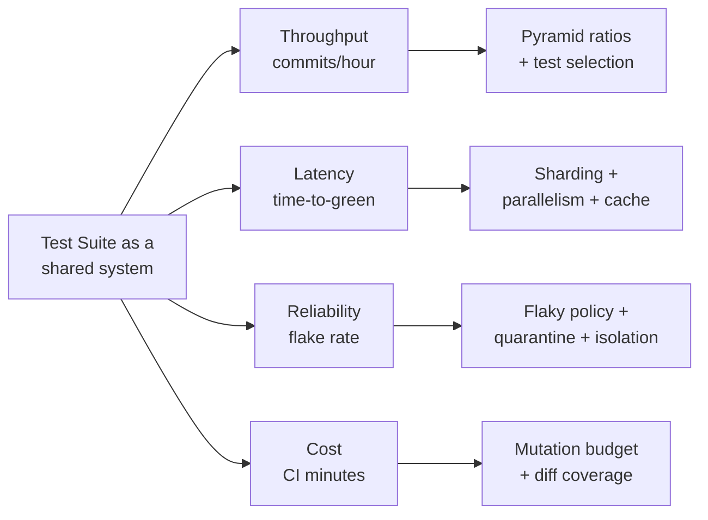

# Unit Tests — Senior Level

> Focus: testing as a *team-scale strategy*, not a personal habit. The test pyramid and its target ratios, flaky-test policy, CI speed (parallelism, sharding, impacted-test selection, caching), coverage gates done right (diff coverage and mutation testing — not absolute %), test data builders, fixture isolation, contract/integration placement, tests as living documentation, reviewing tests, and linting out tautological and assertion-free tests. Go + Java + Python, with real config.

---

## Table of Contents

1. [The strategy problem](#the-strategy-problem)
2. [The pyramid, the trophy, and target ratios](#the-pyramid-the-trophy-and-target-ratios)
3. [Flaky-test policy: detect, quarantine, deflake](#flaky-test-policy-detect-quarantine-deflake)
4. [CI test speed: parallelism, sharding, selection, caching](#ci-test-speed-parallelism-sharding-selection-caching)
5. [Coverage gates done right](#coverage-gates-done-right)
6. [Mutation testing: the only honest coverage](#mutation-testing-the-only-honest-coverage)
7. [Test data: builders, object mothers, fixtures](#test-data-builders-object-mothers-fixtures)
8. [Where contract and integration tests live](#where-contract-and-integration-tests-live)
9. [Tests as living documentation](#tests-as-living-documentation)
10. [Reviewing tests](#reviewing-tests)
11. [Linting out bad tests](#linting-out-bad-tests)
12. [Common Mistakes](#common-mistakes)
13. [Test Yourself](#test-yourself)
14. [Cheat Sheet](#cheat-sheet)
15. [Summary](#summary)
16. [Further Reading](#further-reading)
17. [Related Topics](#related-topics)

---

## The strategy problem

At the junior level, "write good unit tests" is about a single test: one assertion per concern, fast, isolated, behaviour over implementation. At the senior level the unit of concern changes. You are no longer optimizing one test — you are optimizing a **suite that 30 engineers commit to 200 times a day**, runs on every PR, gates every merge, and must stay fast and trustworthy under that load.

A test suite is a shared production system. It has throughput (commits/hour it can clear), latency (time-to-green), reliability (flake rate), and operating cost (CI minutes). When any of these degrades, the whole team slows down — and the failure mode is insidious: people stop trusting red, start force-merging, and the suite becomes decorative.

The senior job is to design the policies that keep the suite trustworthy at scale. Everything below is a lever on one of four properties:



---

## The pyramid, the trophy, and target ratios

The **test pyramid** (Mike Cohn, popularized by Martin Fowler) says: many fast unit tests, fewer integration tests, very few end-to-end tests. The shape is dictated by *cost and speed*, not dogma — each layer up is slower, flakier, and harder to diagnose.

Kent C. Dodds's **testing trophy** reweights this for systems where most bugs live at the seams: a fat middle of integration tests, a solid base of static analysis (types + lint), fewer unit tests than the classic pyramid, a thin E2E cap. Both models agree on the only rule that matters: **push each test to the lowest layer that can still catch the bug.**

| Layer | What it tests | Speed | Target share | Failure clarity |
|---|---|---|---|---|
| Static (types, lint) | Whole classes of bugs, free | instant | — (gate) | excellent |
| Unit | One behaviour, no I/O | µs–ms | 60–75% (pyramid) | excellent |
| Integration | Module + real DB/broker | 10ms–1s | 20–35% | good |
| Contract | Service boundary compatibility | ms | small but mandatory | good |
| E2E / system | Full user journey | seconds | < 5% | poor |

Do not chase a numeric ratio for its own sake. The ratio is a *symptom*. An ice-cone (lots of E2E, few unit) means bugs are caught late and CI is slow and flaky. The fix is to move coverage down, not to delete E2E tests.

> **Anti-pattern to name in reviews:** the *test ice-cream cone* — heavy manual + E2E, thin unit base. It is the single most expensive testing topology a team can adopt.

---

## Flaky-test policy: detect, quarantine, deflake

A flaky test — one that passes and fails on the same code — is worse than no test. It teaches the team to ignore red. One flaky test in a 5,000-test suite that fails 1% of the time fails roughly **every other CI run** if run on each PR. The policy must be written down and automated; "be careful" is not a policy.

A three-stage policy works:

**1. Detect.** Re-run the full suite on a schedule (nightly) against an unchanged commit. Any test that ever fails there is flaky by definition. Tools: pytest reruns, Gradle test retry with reporting, `go test -count=N`, and CI-native flake detection (GitHub Actions test reporters, Buildkite Test Analytics, Datadog CI Visibility).

**2. Quarantine.** Move a known-flaky test out of the blocking gate immediately — do *not* leave it failing the build while someone "gets to it." Quarantined tests still run and report, but do not block merge. They are tracked with an owner and a deadline.

```go
// Go: a build-tag-gated quarantine. Quarantined tests run only in the
// non-blocking nightly job (go test -tags=quarantine ./...).
//go:build quarantine

func TestPaymentWebhook_Quarantined(t *testing.T) {
    // FLAKY: GH-4821, owner @bakhodir, deadline 2026-06-20.
    // Suspected clock dependency in retry backoff.
}
```

```java
// JUnit 5: tag it, exclude the tag from the PR gate, run it nightly.
@Tag("quarantine") // tracked in FLAKY-REGISTRY.md with owner + deadline
@Test
void chargeRetriesOnTransient502() { /* ... */ }
```

```python
# pytest: mark it; PR gate runs `-m "not flaky"`, nightly runs everything.
@pytest.mark.flaky  # JIRA-4821, owner: bakhodir, deadline: 2026-06-20
def test_payment_webhook(): ...
```

**3. Deflake.** Quarantine is a debt account, not a graveyard. A bounded SLA (e.g. "quarantined > 14 days → delete or fix, owner's lead decides") prevents the registry from rotting. Deflaking means finding the *real* nondeterminism, not adding retries:

| Flake source | Real fix (not a retry) |
|---|---|
| Wall-clock / `time.Now()` | Inject a clock; freeze it (`clockwork`, `Clock` fixture, `freezegun`) |
| Random seed | Pin the seed; log it on failure |
| Test ordering / shared state | Isolate fixtures; run with `-shuffle=on`, `pytest-randomly`, `@TestMethodOrder` checks |
| Async race / sleep-based wait | Replace `sleep(N)` with poll-until-condition with a timeout |
| Network/DB latency | Make it a deterministic fake or pin it as integration, out of the unit gate |
| Port/temp-file collision under parallelism | Per-worker isolation (random ports, `tmp_path`, unique schemas) |

> **Retries hide flakes; they do not fix them.** A `@RepeatedTest`/`--reruns 3` that turns a 30%-flaky test green is lying to you at 27% confidence. Use retries only as a *temporary* shield while the registry deadline runs, and alert on retry-rescued passes.

---

## CI test speed: parallelism, sharding, selection, caching

Time-to-green is a productivity multiplier. A 25-minute suite means a 25-minute feedback loop on every push; engineers context-switch away and the cost compounds. Four levers, applied in this order of leverage:

### 1. Parallelism (within one machine)

```bash
# Go: t.Parallel() in tests + -p controls package-level parallelism.
go test -parallel 8 ./...        # parallel tests within a package
go test -p 4 ./...               # parallel packages (defaults to GOMAXPROCS)
```

```bash
# Python: pytest-xdist fans tests across worker processes.
pytest -n auto                   # one worker per CPU
pytest -n auto --dist loadscope  # keep a class/module on one worker (shared fixtures)
```

```kotlin
// Gradle (JUnit 5): fork JVMs + enable JUnit's own parallel engine.
tasks.test {
    maxParallelForks = (Runtime.getRuntime().availableProcessors() / 2).coerceAtLeast(1)
}
```
```properties
# junit-platform.properties — engine-level parallelism
junit.jupiter.execution.parallel.enabled = true
junit.jupiter.execution.parallel.mode.default = concurrent
junit.jupiter.execution.parallel.config.strategy = dynamic
```

Parallelism is free speed *only if tests are isolated*. A suite that shares a DB row, a global, or a fixed port will deadlock or flake the moment you parallelize. **Parallelism is a forcing function for isolation** — that is a feature.

### 2. Sharding (across machines)

Split the suite into N shards run on N runners. The naive split (by file count) leaves slow shards idle; **balance by historical runtime**.

```yaml
# GitHub Actions: matrix sharding with timing-based split.
jobs:
  test:
    strategy:
      fail-fast: false
      matrix:
        shard: [1, 2, 3, 4]
    steps:
      - uses: actions/checkout@v4
      - name: Test (shard ${{ matrix.shard }} of 4)
        run: |
          pytest --splits 4 --group ${{ matrix.shard }} \
                 --splitting-algorithm=least_duration \
                 -n auto -p no:randomly
```

### 3. Test selection / impacted tests

The biggest win on a large monorepo: **don't run tests that can't be affected by the diff.** Build graphs know which tests depend on which changed targets.

```bash
# Bazel: query the reverse-dependency closure of the changed files,
# run only those tests. This is the gold standard for monorepos.
bazel test $(bazel query "rset($(git diff --name-only origin/main | sed 's|^|//|'))" \
            --output=package | xargs -I{} echo "kind(test, rdeps(//..., {}))")
```

```bash
# Go: package-level affected-test selection via the dependency graph.
CHANGED=$(git diff --name-only origin/main | xargs -n1 dirname | sort -u)
go list -deps -test ./... | ...  # map changed pkgs -> dependent test pkgs
```

```bash
# Python: pytest-testmon tracks per-test coverage and reruns only impacted tests.
pytest --testmon
```

> **Caveat:** test selection is an *optimization on top of* a full nightly run, never a replacement. Selection can miss reflection-, config-, or generation-based dependencies. Always run the full suite on `main` and nightly.

### 4. Caching

Cache dependencies and (where the toolchain supports it) test results.

```bash
go test ./...        # Go caches passing test results by default;
                     # only re-runs packages whose inputs changed.
go clean -testcache  # force a clean run
```

```bash
# Gradle build cache + test result caching across CI runs.
./gradlew test --build-cache
```

A note on `go test -count`: `-count=1` is the idiom to **bypass the cache** (force a real run), and `-count=N` runs each test N times — the standard way to smoke out flakiness locally before it reaches CI.

---

## Coverage gates done right

The most common coverage mistake is gating on an **absolute line-coverage percentage** of the whole repo. It is gameable (assertion-free tests raise it), demoralizing (legacy code drags it), and it measures *execution*, not *verification*. A line counts as "covered" if it merely ran — even with no assertion checking its result.

Two strategies that actually work:

### Diff (patch) coverage

Gate on the coverage of **lines changed in the PR**, not the whole repo. New code must be tested; legacy debt is not your PR's problem.

```yaml
# Codecov: enforce diff coverage, ignore the absolute-project metric.
coverage:
  status:
    project:
      default:
        informational: true   # report, never block, on absolute %
    patch:
      default:
        target: 85%            # changed lines must hit 85%
        threshold: 0%          # no slippage allowed
```

```bash
# Tool-agnostic: diff-cover compares a coverage report against a git diff.
diff-cover coverage.xml --compare-branch=origin/main --fail-under=85
```

This makes the gate **monotonic**: the codebase can only get better. It sidesteps the "we'll never hit 80% on a 1M-line legacy repo" deadlock and focuses the test-writing energy exactly where new risk enters.

### Coverage as a floor, never a ceiling

Even diff coverage measures execution, not assertion strength. 100% line coverage with weak assertions catches nothing. Coverage answers "what code did the test *touch*"; it cannot answer "would the test *fail* if the code were wrong." For that, you need mutation testing.

---

## Mutation testing: the only honest coverage

Mutation testing deliberately introduces bugs ("mutants") into your code — flip a `>` to `>=`, replace `+` with `-`, negate a boolean, return null — then runs your tests. If the tests fail, the mutant is **killed** (good: your tests catch that bug). If they still pass, the mutant **survives** — meaning your tests would not notice that bug in production. The **mutation score** (killed / total) is the closest thing to an honest measure of suite strength.

| Language | Tool | Run |
|---|---|---|
| Java | **PIT (pitest)** | `./gradlew pitest` |
| Go | **go-mutesting**, **gremlins** | `gremlins unleash ./...` |
| Python | **mutmut**, **cosmic-ray** | `mutmut run` |
| JS/TS | **Stryker** | `npx stryker run` |

```xml
<!-- Maven + PIT: gate on mutation score for changed classes only. -->
<plugin>
  <groupId>org.pitest</groupId>
  <artifactId>pitest-maven</artifactId>
  <configuration>
    <mutationThreshold>80</mutationThreshold>
    <!-- scmMutationCoverage: only mutate files touched in the diff -->
    <features><feature>+GIT(from[HEAD~1])</feature></features>
  </configuration>
</plugin>
```

Mutation testing is **expensive** — it runs the relevant tests once per mutant, so a naive full-repo run can take hours. The senior move is to **scope it to the diff** (PIT's `+GIT`, gremlins' diff mode, `mutmut`'s `--paths-to-mutate`) and run a full pass nightly. Treat surviving mutants as a review artifact, not a hard CI failure at first — they are a list of "tests that lie."

> Run mutation testing on the code that matters most: the money path, the auth check, the parser. A surviving mutant on `getName()` is noise; a surviving mutant on `isAuthorized()` is a security finding.

---

## Test data: builders, object mothers, fixtures

As suites grow, **test data setup** becomes the dominant source of noise, coupling, and brittleness. A test that needs a 20-field `Order` to assert one thing will break every time `Order` gains a field. Three patterns, in increasing order of flexibility:

**Object Mother** — named, canonical examples. Good for shared "happy" cases; rigid when you need a one-off variation.

```java
Order order = OrderMother.shippedOrderWithTwoItems();
```

**Test Data Builder** — fluent, defaulted, override-what-matters. The workhorse. Each test states *only the field under test*; everything else is a sane default.

```java
// The test reads as: "an order, but unpaid" — intent is loud, noise is silent.
Order order = anOrder().withStatus(UNPAID).build();
```

```go
// Go: functional-options builder keeps test data DRY and intent-forward.
func anOrder(opts ...func(*Order)) *Order {
    o := &Order{Status: Paid, Items: []Item{anItem()}} // sane defaults
    for _, opt := range opts {
        opt(o)
    }
    return o
}
func withStatus(s Status) func(*Order) { return func(o *Order) { o.Status = s } }

// usage: o := anOrder(withStatus(Unpaid))
```

```python
# Python: factory_boy is the idiomatic builder; override only what matters.
class OrderFactory(factory.Factory):
    class Meta: model = Order
    status = OrderStatus.PAID
    items  = factory.LazyFunction(lambda: [ItemFactory()])

# usage: order = OrderFactory(status=OrderStatus.UNPAID)
```

**Guideline:** builders > mothers > inline literals > shared mutable fixture. The further right, the more coupling and the louder the noise.

### Shared fixtures vs isolation

A shared fixture (one DB, one container, one in-memory cache) is fast but couples tests through mutable state — and it is the #1 cause of order-dependent flakiness under parallelism. The senior balance:

- **Share expensive, immutable setup** (a started Testcontainer, a loaded schema, a compiled template). Initialize once per worker.
- **Isolate all mutable state** per test: a fresh transaction rolled back at teardown, a unique schema/namespace per worker, `tmp_path` for files, random ports.

```python
# pytest: session-scoped container (shared, immutable), function-scoped
# transaction (isolated, rolled back). Best of both.
@pytest.fixture(scope="session")
def pg_container():
    with PostgresContainer("postgres:16") as c:
        yield c

@pytest.fixture()
def db(pg_container):
    conn = connect(pg_container.get_connection_url())
    txn = conn.begin()
    yield conn
    txn.rollback()   # isolation: nothing leaks between tests
```

---

## Where contract and integration tests live

A senior decision is *placement*: which tests run in the fast PR gate, which run before deploy, which run against real infrastructure.

- **Unit tests** — in the PR gate, no I/O, milliseconds. The bulk.
- **Integration tests** — module + real DB/broker via Testcontainers. In the PR gate if fast enough; otherwise a second, parallel CI stage. Never in the *unit* package — keep them separable so the unit gate stays fast (`go test -short`, `@Tag("integration")`, `pytest -m "not integration"`).
- **Contract tests** — the cheap insurance against the distributed-monolith failure mode. A consumer-driven contract (Pact) lets the *consumer* publish what it expects of a provider; the provider verifies that contract in *its own* pipeline. This replaces slow, flaky cross-service E2E for compatibility checking.

```bash
# Pact: provider verifies the consumer-published contract in CI,
# gating its own deploy on backward compatibility.
pact-provider-verifier \
  --provider OrderService \
  --pact-broker-base-url=$PACT_BROKER \
  --provider-app-version=$GIT_SHA \
  --publish-verification-results
```

```go
// Go: gate I/O-touching tests behind -short so the unit suite stays fast.
func TestRepo_Save(t *testing.T) {
    if testing.Short() {
        t.Skip("integration: needs Postgres")
    }
    // ... Testcontainers Postgres ...
}
// PR unit gate:        go test -short ./...
// Pre-merge full gate: go test ./...
```

> The placement rule: **a test belongs at the lowest, fastest layer that can still catch its target bug.** Contract tests exist precisely so you do *not* need a 12-service E2E run to learn that someone renamed a JSON field.

---

## Tests as living documentation

A well-named, well-structured test suite is the most reliable documentation a system has — because, unlike prose, it *fails when it goes stale*. To realize this, optimize tests for reading:

- **Name tests as behaviour specs**, not method names: `transfer_fails_when_source_balance_is_insufficient`, not `testTransfer3`. The name is the spec sentence.
- **Structure each test Arrange–Act–Assert** (or Given–When–Then) with visible separation. A reader should see the precondition, the action, and the expected outcome at a glance.
- **Push noise into builders** so the test body contains only the variable under test.
- **One reason to fail per test.** Multiple unrelated assertions blur what broke; group with soft assertions (`assertAll`, `assert_that` blocks) only when they describe *one* concern.

```python
def test_transfer_fails_when_source_balance_is_insufficient():
    # Arrange — only the relevant variable is stated; rest is defaulted
    account = AccountFactory(balance=Money(10, "USD"))

    # Act
    result = account.transfer(Money(50, "USD"), to=AccountFactory())

    # Assert — one concern: insufficient funds is rejected, balance untouched
    assert result == TransferResult.INSUFFICIENT_FUNDS
    assert account.balance == Money(10, "USD")
```

A reviewer who reads this test learns the rule "you cannot overdraw" without reading the implementation. That is documentation that cannot drift.

---

## Reviewing tests

Tests are code reviewed *more* carefully than production code, because a weak test silently disables the safety net. In review, check the test, not just the feature:

- **Does the test fail for the right reason?** Ask the author to break the production code and show the test goes red. A test never seen red is unproven.
- **Is the assertion strong?** `assertNotNull(result)` after a complex computation verifies almost nothing. Assert the *value*.
- **Is it tautological?** A test that mocks the very thing it claims to test (`when(repo.find(1)).thenReturn(x); assertEquals(x, service.get(1))` where `get` just delegates) tests the mock, not the code.
- **Is it coupled to implementation?** Tests that assert call sequences (`verify(x).step1(); verify(x).step2()`) break on harmless refactors. Prefer asserting observable outcomes.
- **Will it be flaky?** Look for `sleep`, real time, random without a seed, shared state, fixed ports.
- **Is the data builder-based?** Inline 20-field literals are a future maintenance tax; flag them.

> A useful review heuristic: **the diff should add a test that would have failed before the production change.** If the production change and the test change are independent, one of them is probably wrong.

---

## Linting out bad tests

Policies that rely on reviewer vigilance erode. Encode the rules that machines can check:

**Assertion-free tests** — a test method with zero assertions almost always passes vacuously. Lint it.

```yaml
# pytest: flake8-pytest / PT-rules + a custom check; or fail collection
#   on tests with no assert via a conftest hook. Ruff:
[tool.ruff.lint]
select = ["PT"]   # flake8-pytest-style: bans assert-free/duplicate-param patterns
```

```yaml
# Java: SonarQube ships rules for this out of the box.
#   S2699  "Tests should include assertions"            (assertion-free)
#   S2589 / S5785  tautological / always-true conditions
#   S5778  "one method invocation per assertThrows"
#   S5810+ assorted weak-assertion smells
# Enforce on the test source set in the quality gate.
```

```go
// Go: testifylint catches misused assertions; revive/staticcheck catch
//   empty tests. golangci-lint config:
//   linters: [ testifylint, thelper, tparallel ]
//   - thelper:   t.Helper() in helpers
//   - tparallel: t.Parallel() used correctly (a real isolation/flake guard)
```

**Tautological tests** — harder to detect statically, which is exactly why mutation testing matters: a tautological test kills *no* mutants. A class with high line coverage and a near-zero mutation score is a red flag for tests that execute but do not verify.

**Other machine-checkable rules:** ban `sleep`/`Thread.sleep` in the test source set (custom lint or grep gate), ban `@Disabled`/`t.Skip`/`@pytest.mark.skip` without a tracking reference, require `t.Parallel()` in unit packages (`tparallel`), forbid real `time.Now()` in unit tests via an injected-clock lint.

---

## Common Mistakes

- **Gating on absolute repo coverage %.** Gameable and demoralizing. Gate on *diff* coverage; report absolute as informational only.
- **Treating coverage as a quality measure.** Coverage measures execution, not verification. 100% covered, zero mutants killed = no real testing. Add mutation testing on critical paths.
- **Retrying flaky tests instead of fixing them.** Retries convert a visible flake into an invisible 27%-confidence lie. Quarantine with an owner and deadline; fix the nondeterminism.
- **Putting integration tests in the unit gate.** One container start in the hot path and the fast feedback loop is gone. Tag and separate; run unit with `-short` / `-m "not integration"`.
- **Sharding by file count.** Leaves slow shards idle. Split by historical runtime (least-duration).
- **Running the whole suite on every PR in a monorepo.** Use impacted-test selection on PRs; run the full suite on `main` and nightly.
- **Shared mutable fixtures.** The #1 cause of order-dependent flakiness under parallelism. Share immutable setup; isolate mutable state per test.
- **Asserting on implementation details** (call order, private state). Breaks on safe refactors; couples tests to structure. Assert observable behaviour.
- **20-field inline test data literals.** Every new field breaks every test. Use builders/factories; state only the field under test.
- **No flaky-test policy.** "Be careful" is not a policy. Without quarantine + deadline + nightly detection, the suite rots into "everyone ignores red."

---

## Test Yourself

**1. Why is gating on absolute repo-wide line coverage a poor CI policy, and what replaces it?**

<details><summary>Answer</summary>

Absolute coverage is gameable (assertion-free tests raise it), it punishes PRs for legacy debt they didn't create (deadlocking adoption on large old codebases), and it measures execution rather than verification. Replace it with **diff/patch coverage** — gate only on the lines the PR changed — which is monotonic (the codebase can only improve) and focuses test effort where new risk enters. Report absolute coverage as informational. For verification strength, layer **mutation testing** on critical paths.
</details>

**2. A test fails ~5% of CI runs. A colleague adds `--reruns 3` and it goes green. Defend or refute.**

<details><summary>Answer</summary>

Refute as a *fix*; allow only as a *temporary shield*. The retry doesn't remove the nondeterminism — it hides it. With 5% per-run flake, three reruns pass ~99.99% of the time, so you've masked a real bug at ~27% per-attempt confidence. The right move: quarantine the test out of the blocking gate (so it stops failing unrelated PRs), assign an owner and a deadline, and deflake the *root cause* — usually wall-clock, unseeded random, async sleep, shared state, or a port/temp collision under parallelism. If you must keep a retry while the deadline runs, alert on retry-rescued passes so the flake stays visible.
</details>

**3. Your monorepo's PR suite takes 28 minutes. Rank the levers you'd apply and name one risk of the highest-leverage one.**

<details><summary>Answer</summary>

Order by leverage: (1) **impacted-test selection** — don't run tests that the diff can't affect (Bazel rdeps, pytest-testmon); biggest win on a large monorepo. (2) **Sharding by historical runtime** across runners. (3) **Within-machine parallelism** (`-n auto`, `t.Parallel()`, JUnit parallel engine). (4) **Caching** (Go testcache, Gradle build cache). The risk of test selection: it can miss reflection-, config-, codegen-, or resource-based dependencies and pass a PR that actually broke something. Mitigate by always running the **full** suite on `main` and nightly — selection is an optimization layered on top of a full run, never a replacement.
</details>

**4. A class shows 95% line coverage but its mutation score is 20%. What does that mean, and is it a problem?**

<details><summary>Answer</summary>

It means the tests *execute* almost all the code but *verify* almost none of it — 80% of injected bugs (flipped operators, negated conditions, swapped return values) survive undetected. That's the classic signature of weak assertions and tautological tests (e.g. asserting only non-null, or asserting against a mocked-out collaborator that the test itself stubbed). It is a serious problem precisely where coverage looks reassuring. Whether to act depends on the code: a 20% mutation score on `isAuthorized()` or the payment path is a must-fix; on a trivial getter it's noise. Scope mutation testing and remediation to high-risk code.
</details>

**5. When is a shared fixture the right call, and how do you keep it from causing order-dependent flakiness?**

<details><summary>Answer</summary>

Share setup that is **expensive and immutable**: a started Testcontainer, a loaded schema, a compiled template, a warmed cache — initialize once per worker so each test doesn't pay the startup cost. Keep it flake-free by **isolating all mutable state per test**: wrap each test in a transaction rolled back at teardown, give each parallel worker a unique schema/namespace, use per-test temp dirs (`tmp_path`) and random ports. The rule: share the immutable, isolate the mutable. Then run with shuffled order (`-shuffle=on`, `pytest-randomly`) so any accidental coupling fails loudly instead of hiding.
</details>

**6. Why are contract tests preferable to end-to-end tests for catching a provider that renamed a JSON field?**

<details><summary>Answer</summary>

A consumer-driven contract (Pact) captures exactly the shape the consumer depends on and verifies it in the *provider's own* pipeline — fast (milliseconds), deterministic, and pinpointed: the failure says precisely which field broke which consumer. An E2E run would catch the same break only by spinning up the full topology — slow, flaky, expensive, and with poor failure clarity ("something 500'd somewhere"). Contract tests sit at the lowest layer that can still catch a boundary-compatibility bug, which is the placement rule in action.
</details>

---

## Cheat Sheet

| Concern | Senior default | Tooling |
|---|---|---|
| Suite shape | Push each test to the lowest layer that catches the bug | Pyramid / trophy |
| Coverage gate | **Diff coverage** (changed lines), absolute = informational | Codecov patch, diff-cover |
| Verification strength | Mutation testing on critical paths, diff-scoped + nightly | PIT, gremlins/go-mutesting, mutmut |
| Flaky tests | Detect (nightly re-run) → quarantine (owner+deadline) → deflake root cause | test retry reporters, CI flake analytics |
| PR speed | Selection → runtime-balanced sharding → parallelism → cache | Bazel rdeps, testmon, xdist, GHA matrix |
| Test data | Builders/factories; state only the field under test | factory_boy, functional options, test-data-builder |
| Fixtures | Share immutable setup; isolate mutable state per test | session+function pytest scopes, txn rollback |
| Integration placement | Out of the unit gate; tag + separate stage | `-short`, `@Tag`, `-m "not integration"` |
| Boundary compat | Contract tests, not E2E | Pact |
| Bad-test prevention | Lint assertion-free/tautological; ban sleep + unseeded random | SonarQube S2699, ruff PT, testifylint |
| Local flake smoke | `go test -count=10`, `pytest -p randomly`, `-shuffle=on` | built-in |

```bash
# The senior CI shape in one screen:
go test -short ./...                              # fast unit gate
pytest -n auto --splits 4 --group $SHARD --testmon  # parallel, sharded, impacted
diff-cover coverage.xml --compare-branch=origin/main --fail-under=85
./gradlew pitest                                  # mutation, diff-scoped
go test -count=1 ./...                            # nightly: bypass cache, full run
```

---

## Summary

At scale, a test suite is a shared production system judged on throughput, latency, reliability, and cost — and the senior job is to design the *policies* that keep it trustworthy, not to write better individual tests. Shape the suite by the pyramid/trophy rule (lowest layer that catches the bug), gate on **diff coverage** rather than absolute %, and measure real verification strength with **mutation testing** on the code that matters. Make CI fast with impacted-test selection, runtime-balanced sharding, parallelism, and caching — in that order of leverage. Treat flaky tests as a tracked debt with detect → quarantine → deflake, never papered over with retries. Keep test data builder-driven and fixtures "share-immutable, isolate-mutable," place integration and contract tests out of the unit gate, and encode the rules machines can check — assertion-free and tautological tests die to linters and mutation scores, not to reviewer goodwill. The payoff is a suite the team trusts enough to keep red meaningful.

---

## Further Reading

- Martin Fowler — *TestPyramid* and *Eradicating Non-Determinism in Tests* (martinfowler.com)
- Kent C. Dodds — *The Testing Trophy and Testing Classifications*
- Nat Pryce & Steve Freeman — *Growing Object-Oriented Software, Guided by Tests* (test data builders)
- *Software Engineering at Google* (Winters, Manshreck, Wright) — chapters on testing, flakiness, and CI
- PIT (pitest.org), Stryker Mutator, mutmut, gremlins — mutation testing docs
- Pact (docs.pact.io) — consumer-driven contract testing

---

## Related Topics

- [junior.md](junior.md) — what makes a single test good: one concern, fast, isolated, behaviour over implementation
- [middle.md](middle.md) — mocks/stubs/fakes, AAA structure, parameterized tests, testing edge cases
- [professional.md](professional.md) — TDD discipline, test smells, designing for testability
- [Chapter README](../README.md) — the positive rules this strategy operationalizes
- [07-boundaries](../07-boundaries/README.md) — learning tests and adapter tests at third-party seams
- [10-emergence](../10-emergence/README.md) — "runs all the tests" as the first rule of simple design
- [Refactoring](../../refactoring/README.md) — characterization tests and the refactor safety net
- [Anti-Patterns](../../anti-patterns/README.md) — the test ice-cream cone and other testing anti-patterns

---

> **Next:** [09-classes](../09-classes/README.md) — cohesion, the Single Responsibility Principle, and organizing for change.