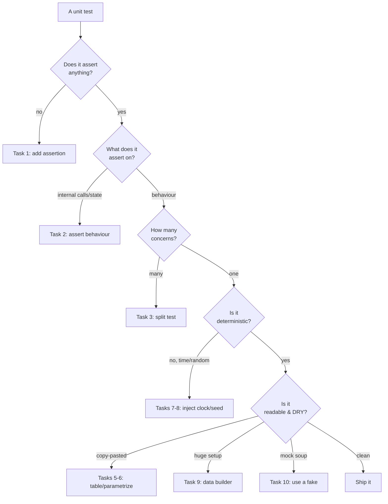

# Unit Tests — Practice Tasks

> 12 hands-on exercises that take a bad test (or untested code) and turn it into a clean one. Every task: a scenario, the starting code, a precise instruction, then a collapsible solution with the corrected test **and** the reasoning. Languages rotate across Go, Java, and Python. Ordered easy → hard.

A clean unit test obeys the same rules as clean production code, plus a few of its own. It asserts on **observable behaviour**, not internal mechanics. It tests **one concern**, so a failure names a single cause. It is **deterministic** — same input, same result, every run, on every machine. It is **fast** — no real clock, no real network, no real disk. And it actually **asserts** — a test that exercises code without checking anything is a green light wired to nothing.

---

## Table of Contents

| # | Task | Skill | Difficulty |
|---|------|-------|------------|
| 1 | Add the missing assertion | Assertion-free test | Easy |
| 2 | Assert on behaviour, not implementation | Coupling to internals | Easy |
| 3 | Split a multi-concern test | One reason to fail | Easy |
| 4 | Name the test after the behaviour | Readable failures | Easy |
| 5 | Convert copy-pasted tests to table-driven | Duplication | Medium |
| 6 | Parametrize repeated Python tests | Duplication | Medium |
| 7 | Deflake a clock-dependent test | Determinism | Medium |
| 8 | Deflake a random-dependent test | Determinism | Medium |
| 9 | Replace a giant setup with a test data builder | Setup noise | Medium |
| 10 | Replace over-mocking with a fake | Mock-heavy tests | Hard |
| 11 | Write the first failing TDD test | Test-first design | Hard |
| 12 | Add a property-based test | Invariants over examples | Hard |

---

## How to Use

1. Read the scenario and the starting code. Decide what is wrong **before** opening the solution — naming the defect is the skill being trained.
2. Rewrite the test (or write the missing one) on paper or in an editor. Make it compile and pass in your head.
3. Open the solution. Compare not just the code but the *reasoning* — the "why" is what transfers to your own suite.
4. The languages rotate on purpose. The test-design principles are language-agnostic; seeing them in Go's `testing`, JUnit 5, and `pytest` proves it.

A quick mental model for where each task fits:



---

## Task 1 — Add the Missing Assertion (Go)

**Difficulty:** Easy

**Scenario:** A teammate added a test for a `Stack`. It is green and has stayed green for months. It also asserts nothing — it exercises the code and throws the result away. This is the most dangerous kind of test: it gives confidence it has not earned.

```go
package stack

import "testing"

func TestStackPush(t *testing.T) {
    s := New()
    s.Push(1)
    s.Push(2)
    s.Push(3)
    s.Pop()
    s.Len() // result discarded — nothing is checked
}
```

**Instruction:** Add the assertions that make this test fail if `Push`, `Pop`, or `Len` regress. State, in one sentence, the behaviour you are pinning down.

<details>
<summary>Solution</summary>

The behaviour: after pushing 3 and popping 1, the top is `2` and the length is `2`. Assert both.

```go
package stack

import "testing"

func TestPopReturnsLastPushedValue(t *testing.T) {
    s := New()
    s.Push(1)
    s.Push(2)
    s.Push(3)

    got, ok := s.Pop()

    if !ok {
        t.Fatal("Pop on a non-empty stack returned ok=false")
    }
    if got != 3 {
        t.Errorf("Pop() = %d, want 3 (last pushed)", got)
    }
    if s.Len() != 2 {
        t.Errorf("Len() after one Pop = %d, want 2", s.Len())
    }
}
```

**Reasoning.** A test without an assertion can only fail one way: if the code under test *panics*. It cannot catch a wrong return value, a corrupted length, or a silent no-op. Coverage tools count the lines as covered, which actively misleads — the line is executed but unverified. Every test must end in at least one assertion whose failure has a clear, single cause. Note also the rename: `TestStackPush` lied (it never checked `Push`'s effect); `TestPopReturnsLastPushedValue` states the contract.
</details>

---

## Task 2 — Assert on Behaviour, Not Implementation (Java)

**Difficulty:** Easy

**Scenario:** This test verifies that a `PriceCalculator` works by spying on the *order of internal method calls*. It passes today. Tomorrow someone reorders two independent steps — behaviour identical, output identical — and the test goes red. That is a false alarm, and false alarms train engineers to ignore the suite.

```java
@Test
void calculatesPrice() {
    PriceCalculator calc = spy(new PriceCalculator());

    calc.total(cart);

    // asserting on HOW the answer is computed, not WHAT it is
    InOrder inOrder = inOrder(calc);
    inOrder.verify(calc).applyDiscounts(any());
    inOrder.verify(calc).applyTax(any());
    inOrder.verify(calc).roundToCents(any());
}
```

**Instruction:** Rewrite the test to assert on the returned price. Remove the spy and the call-order verification entirely.

<details>
<summary>Solution</summary>

```java
@Test
void appliesDiscountThenTaxToReachFinalPrice() {
    PriceCalculator calc = new PriceCalculator();
    Cart cart = new Cart(List.of(
        new LineItem("widget", money("100.00"), 1)
    ));
    // 10% off -> 90.00, then 8% tax -> 97.20
    cart.applyCoupon(new Coupon("SAVE10", percent(10)));

    Money total = calc.total(cart);

    assertEquals(money("97.20"), total);
}
```

**Reasoning.** The original test couples to the *implementation*: the existence of `applyDiscounts`, `applyTax`, `roundToCents`, and their sequence. None of that is a promise the calculator makes to its callers — the only promise is "given this cart, the total is `97.20`." Tests that mirror implementation are change-detectors, not behaviour-detectors: they break on safe refactors (rename a private method, inline a step) and stay green on real bugs (wrong rate, missed rounding) as long as the calls still happen in order. Assert on the public, observable result. As a bonus, the example values document the intended math, so the test doubles as a spec.
</details>

---

## Task 3 — Split a Multi-Concern Test (Python)

**Difficulty:** Easy

**Scenario:** One test validates registration, login, and password reset. When it fails, the CI line just says `test_user_flow FAILED` — you have no idea which of the three broke without reading the traceback and counting lines.

```python
def test_user_flow():
    svc = UserService(InMemoryUserRepo())

    # registration
    user = svc.register("ada@example.com", "hunter2")
    assert user.id is not None
    assert user.email == "ada@example.com"

    # login
    token = svc.login("ada@example.com", "hunter2")
    assert token is not None

    # password reset
    svc.reset_password(user.id, "newpass99")
    assert svc.login("ada@example.com", "hunter2") is None
    assert svc.login("ada@example.com", "newpass99") is not None
```

**Instruction:** Split into focused tests, each with one reason to fail. Share construction through a fixture, not copy-paste.

<details>
<summary>Solution</summary>

```python
import pytest

@pytest.fixture
def svc():
    return UserService(InMemoryUserRepo())

def test_register_assigns_id_and_stores_email(svc):
    user = svc.register("ada@example.com", "hunter2")
    assert user.id is not None
    assert user.email == "ada@example.com"

def test_login_with_correct_password_returns_token(svc):
    svc.register("ada@example.com", "hunter2")
    token = svc.login("ada@example.com", "hunter2")
    assert token is not None

def test_reset_password_invalidates_old_password(svc):
    user = svc.register("ada@example.com", "hunter2")
    svc.reset_password(user.id, "newpass99")
    assert svc.login("ada@example.com", "hunter2") is None

def test_reset_password_accepts_new_password(svc):
    user = svc.register("ada@example.com", "hunter2")
    svc.reset_password(user.id, "newpass99")
    assert svc.login("ada@example.com", "newpass99") is not None
```

**Reasoning.** A test should have **one reason to fail**, so the test name *is* the diagnosis. The monolithic version also has a subtle hazard: if the `register` assertion throws, the login and reset paths never run — a failure early in the body *masks* later behaviour, so one bug can hide another. Splitting gives four independent signals; a red bar now reads like a sentence: "reset password does not invalidate the old password." The shared `svc` fixture removes the duplication that tempts people to keep tests merged in the first place.
</details>

---

## Task 4 — Name the Test After the Behaviour (Java)

**Difficulty:** Easy

**Scenario:** A class has three tests named `test1`, `test2`, `test3`. When `test2` fails in CI, nobody can tell what broke without opening the file. Test names are the first line of documentation and the first thing you read in a failure report.

```java
@Test
void test1() {
    assertThrows(InsufficientFundsException.class,
        () -> new Account(money("10.00")).withdraw(money("20.00")));
}

@Test
void test2() {
    Account a = new Account(money("100.00"));
    a.withdraw(money("30.00"));
    assertEquals(money("70.00"), a.balance());
}

@Test
void test3() {
    Account a = new Account(money("0.00"));
    assertThrows(IllegalArgumentException.class, () -> a.withdraw(money("-5.00")));
}
```

**Instruction:** Rename each test using a `methodUnderTest_givenCondition_expectedOutcome` style (or a full readable sentence). Change nothing else.

<details>
<summary>Solution</summary>

```java
@Test
void withdraw_whenAmountExceedsBalance_throwsInsufficientFunds() {
    assertThrows(InsufficientFundsException.class,
        () -> new Account(money("10.00")).withdraw(money("20.00")));
}

@Test
void withdraw_whenAmountWithinBalance_decreasesBalance() {
    Account a = new Account(money("100.00"));
    a.withdraw(money("30.00"));
    assertEquals(money("70.00"), a.balance());
}

@Test
void withdraw_whenAmountIsNegative_throwsIllegalArgument() {
    Account a = new Account(money("0.00"));
    assertThrows(IllegalArgumentException.class, () -> a.withdraw(money("-5.00")));
}
```

**Reasoning.** The body of a test answers *how*; the name must answer *what* and *when*. A good name survives even when the assertion is wrong — reading `withdraw_whenAmountExceedsBalance_throwsInsufficientFunds` tells a reviewer the intended contract independent of whether the code achieves it. The CI failure line becomes self-explanatory, and the list of test names reads as a behaviour catalogue for the class. Pick one convention (`method_condition_result`, or `should...When...`, or plain sentences) and apply it everywhere; consistency matters more than which one you choose.
</details>

---

## Task 5 — Convert Copy-Pasted Tests to Table-Driven (Go)

**Difficulty:** Medium

**Scenario:** Five near-identical tests for `Classify(n int)` differ only in input and expected label. Adding a sixth case means copy-paste-edit, and a typo in the copied boilerplate is easy to miss.

```go
func TestClassifyNegative(t *testing.T) {
    if got := Classify(-3); got != "negative" {
        t.Errorf("Classify(-3) = %q, want %q", got, "negative")
    }
}
func TestClassifyZero(t *testing.T) {
    if got := Classify(0); got != "zero" {
        t.Errorf("Classify(0) = %q, want %q", got, "zero")
    }
}
func TestClassifyOne(t *testing.T) {
    if got := Classify(1); got != "small" {
        t.Errorf("Classify(1) = %q, want %q", got, "small")
    }
}
func TestClassifyHundred(t *testing.T) {
    if got := Classify(100); got != "large" {
        t.Errorf("Classify(100) = %q, want %q", got, "large")
    }
}
func TestClassifyMax(t *testing.T) {
    if got := Classify(1 << 30); got != "huge" {
        t.Errorf("Classify(1<<30) = %q, want %q", got, "huge")
    }
}
```

**Instruction:** Collapse into one table-driven test with a named subtest per case. Use `t.Run` so failures still report which case broke.

<details>
<summary>Solution</summary>

```go
func TestClassify(t *testing.T) {
    tests := []struct {
        name  string
        input int
        want  string
    }{
        {"negative", -3, "negative"},
        {"zero", 0, "zero"},
        {"small positive", 1, "small"},
        {"large", 100, "large"},
        {"huge", 1 << 30, "huge"},
    }

    for _, tt := range tests {
        t.Run(tt.name, func(t *testing.T) {
            if got := Classify(tt.input); got != tt.want {
                t.Errorf("Classify(%d) = %q, want %q", tt.input, got, tt.want)
            }
        })
    }
}
```

**Reasoning.** The five tests shared one piece of logic — the assertion — and varied only in data. A table makes that explicit: the cases become a readable matrix, and adding a sixth is a single line, not a copied function. `t.Run(tt.name, ...)` preserves the one virtue the original had — a named, isolated failure (`TestClassify/huge`) — and lets you run a single case with `-run TestClassify/huge`. The shared assertion now lives in exactly one place, so a fix to the error message or comparison applies to every case at once. This is the DRY principle applied to tests, without sacrificing failure granularity.
</details>

---

## Task 6 — Parametrize Repeated Python Tests (Python)

**Difficulty:** Medium

**Scenario:** A validator has six tests that are textually identical except for the input string and the expected boolean. The duplication hides the one case the author forgot, and a change to the assertion shape has to be made six times.

```python
def test_valid_simple():
    assert is_valid_email("a@b.com") is True

def test_valid_subdomain():
    assert is_valid_email("a@mail.b.com") is True

def test_invalid_no_at():
    assert is_valid_email("ab.com") is False

def test_invalid_no_domain():
    assert is_valid_email("a@") is False

def test_invalid_empty():
    assert is_valid_email("") is False

def test_invalid_spaces():
    assert is_valid_email("a b@c.com") is False
```

**Instruction:** Collapse into one `@pytest.mark.parametrize` test. Give each case an `id` so failures are legible.

<details>
<summary>Solution</summary>

```python
import pytest

@pytest.mark.parametrize(
    "address, expected",
    [
        ("a@b.com", True),
        ("a@mail.b.com", True),
        ("ab.com", False),
        ("a@", False),
        ("", False),
        ("a b@c.com", False),
    ],
    ids=[
        "simple-valid",
        "subdomain-valid",
        "missing-at",
        "missing-domain",
        "empty",
        "contains-space",
    ],
)
def test_is_valid_email(address, expected):
    assert is_valid_email(address) is expected
```

**Reasoning.** `parametrize` is `pytest`'s answer to Go's table test: one assertion, many rows of data. The `ids` list does the job of `t.Run`'s subtest names — a failure reports `test_is_valid_email[missing-domain]`, not an opaque index. The win is the same as Task 5: the cases line up as a readable truth table, the valid/invalid split is obvious at a glance, and adding a case is one row. When you later spot a gap (no test for a trailing dot, say) you add one tuple instead of cloning a whole function and risking a copy-paste mistake.
</details>

---

## Task 7 — Deflake a Clock-Dependent Test (Python)

**Difficulty:** Medium

**Scenario:** This test passes most of the time and fails near midnight, on the CI box in another timezone, and on the last day of the month. It reads the real wall clock, so its result depends on *when* it runs.

```python
def test_token_is_expired():
    token = Token(issued_at=datetime.now() - timedelta(hours=2),
                  ttl=timedelta(hours=1))
    # "now" is captured again inside is_expired() — a different instant
    assert token.is_expired() is True

def test_token_is_still_valid():
    token = Token(issued_at=datetime.now(), ttl=timedelta(hours=1))
    assert token.is_expired() is False  # flaky if the suite is slow
```

The production code:

```python
class Token:
    def __init__(self, issued_at, ttl):
        self.issued_at = issued_at
        self.ttl = ttl

    def is_expired(self):
        return datetime.now() > self.issued_at + self.ttl  # hidden dependency
```

**Instruction:** Make the clock an injected dependency so the test controls "now." Show both the production change and the deterministic tests.

<details>
<summary>Solution</summary>

```python
# Production: time is a parameter, not a hidden global.
class Token:
    def __init__(self, issued_at, ttl):
        self.issued_at = issued_at
        self.ttl = ttl

    def is_expired(self, now):
        return now > self.issued_at + self.ttl
```

```python
# Tests: a fixed, explicit "now" — no wall clock anywhere.
EPOCH = datetime(2026, 1, 1, 12, 0, 0)

def test_token_expired_one_second_after_ttl():
    token = Token(issued_at=EPOCH, ttl=timedelta(hours=1))
    now = EPOCH + timedelta(hours=1, seconds=1)
    assert token.is_expired(now) is True

def test_token_valid_one_second_before_ttl():
    token = Token(issued_at=EPOCH, ttl=timedelta(hours=1))
    now = EPOCH + timedelta(minutes=59, seconds=59)
    assert token.is_expired(now) is False

def test_token_at_exact_expiry_boundary_is_not_yet_expired():
    token = Token(issued_at=EPOCH, ttl=timedelta(hours=1))
    now = EPOCH + timedelta(hours=1)
    assert token.is_expired(now) is False  # ">" is exclusive at the boundary
```

**Reasoning.** `datetime.now()` buried inside `is_expired` is a hidden, non-deterministic input — the test cannot pin it, so the result wobbles with real time. The fix is **dependency injection of the clock**: time enters through a parameter (or, equivalently, an injected `Clock` object), so the test supplies a fixed instant and the outcome is reproducible on any machine at any hour. Determinism also lets us test the part that mattered all along but was impossible before: the exact `==`-boundary case, which reveals whether expiry is inclusive or exclusive. If you prefer not to thread `now` through every call, inject a `Clock` collaborator (`clock.now()`) and pass a `FixedClock(EPOCH)` in tests — same principle, object-shaped.
</details>

---

## Task 8 — Deflake a Random-Dependent Test (Java)

**Difficulty:** Medium

**Scenario:** A `TokenGenerator` test occasionally fails because it draws from a real, unseeded random source. The fix is the same shape as the clock problem: the source of non-determinism must be injectable.

```java
@Test
void generatesTokenOfCorrectLength() {
    TokenGenerator gen = new TokenGenerator(); // uses `new Random()` internally
    String token = gen.next();
    assertEquals(16, token.length());
    // and someone "tested" randomness like this — flaky by construction:
    assertNotEquals(gen.next(), gen.next()); // can collide; non-deterministic
}
```

Production:

```java
class TokenGenerator {
    private final Random random = new Random(); // unseeded global-ish source
    String next() { /* uses random to pick chars */ }
}
```

**Instruction:** Inject the `Random` so the test can seed it. Replace the flaky "is it random?" assertion with a deterministic, exact-value check.

<details>
<summary>Solution</summary>

```java
// Production: the randomness source is a constructor dependency.
class TokenGenerator {
    private final Random random;

    TokenGenerator(Random random) {
        this.random = random;
    }

    String next() { /* uses random to pick chars */ }
}
```

```java
@Test
void generatesTokenOfConfiguredLength() {
    TokenGenerator gen = new TokenGenerator(new Random(42L)); // fixed seed
    assertEquals(16, gen.next().length());
}

@Test
void sameSeedProducesSameSequence() {
    TokenGenerator a = new TokenGenerator(new Random(42L));
    TokenGenerator b = new TokenGenerator(new Random(42L));
    assertEquals(a.next(), b.next()); // deterministic, repeatable
}

@Test
void consecutiveCallsAdvanceTheSequence() {
    TokenGenerator gen = new TokenGenerator(new Random(42L));
    String first = gen.next();
    String second = gen.next();
    assertNotEquals(first, second); // safe: with a fixed seed this is now a FACT, not a hope
}
```

**Reasoning.** An unseeded `new Random()` is the same category of bug as `datetime.now()`: an uncontrolled input that makes the test's outcome a roll of the dice. Injecting `Random` lets the test fix the seed, which converts every assertion from probabilistic to certain. Note the third test: `assertNotEquals(next(), next())` was *flaky* with a real source (two draws can collide) but is *deterministic* with a fixed seed — the specific seed-42 sequence is reproducible, so "first ≠ second" is now a provable fact about that sequence rather than a statistical gamble. The rule generalizes: never test behaviour against a live entropy source; inject the source and seed it.
</details>

---

## Task 9 — Replace a Giant Setup With a Test Data Builder (Java)

**Difficulty:** Medium

**Scenario:** Every test in this class starts with 20 lines constructing a fully-populated `Order` even though each test cares about exactly one field. The setup is longer than the test, it obscures *which* field drives the assertion, and changing the `Order` constructor breaks 40 tests at once.

```java
@Test
void orderOverThresholdQualifiesForFreeShipping() {
    Customer customer = new Customer("C-1", "Ada", "ada@example.com",
        new Address("1 Main St", "Springfield", "IL", "62701", "US"));
    List<LineItem> items = List.of(
        new LineItem("SKU-1", "Widget", money("40.00"), 1),
        new LineItem("SKU-2", "Gadget", money("60.00"), 1));
    Order order = new Order("O-1", customer, items, money("100.00"),
        money("8.00"), money("0.00"), OrderStatus.PLACED,
        Instant.parse("2026-01-01T00:00:00Z"), null, PaymentMethod.CARD);

    assertTrue(order.qualifiesForFreeShipping());
}
```

**Instruction:** Introduce a `OrderBuilder` with sensible defaults so each test sets only the field it exercises. Show the builder plus two rewritten tests.

<details>
<summary>Solution</summary>

```java
// A builder centralizes the "valid by default" object; tests override one thing.
class OrderBuilder {
    private Money subtotal = money("10.00");
    private OrderStatus status = OrderStatus.PLACED;

    static OrderBuilder anOrder() { return new OrderBuilder(); }

    OrderBuilder withSubtotal(Money subtotal) {
        this.subtotal = subtotal;
        return this;
    }
    OrderBuilder withStatus(OrderStatus status) {
        this.status = status;
        return this;
    }

    Order build() {
        // all the irrelevant fields get safe defaults in one place
        Customer customer = new Customer("C-1", "Ada", "ada@example.com",
            new Address("1 Main St", "Springfield", "IL", "62701", "US"));
        List<LineItem> items = List.of(
            new LineItem("SKU-1", "Widget", subtotal, 1));
        return new Order("O-1", customer, items, subtotal,
            money("0.00"), money("0.00"), status,
            Instant.parse("2026-01-01T00:00:00Z"), null, PaymentMethod.CARD);
    }
}
```

```java
@Test
void orderOverThresholdQualifiesForFreeShipping() {
    Order order = anOrder().withSubtotal(money("100.00")).build();
    assertTrue(order.qualifiesForFreeShipping());
}

@Test
void orderUnderThresholdDoesNotQualify() {
    Order order = anOrder().withSubtotal(money("99.99")).build();
    assertFalse(order.qualifiesForFreeShipping());
}
```

**Reasoning.** The original setup mixed **relevant** data (the subtotal, which drives free shipping) with **incidental** data (customer name, address, payment method) that the test does not care about but must still supply. A reader cannot tell which value matters. The builder pattern inverts this: defaults cover the incidental fields once, and each test names *only* the field under test — so `withSubtotal(money("100.00"))` reads as the cause of the expected `qualifiesForFreeShipping()`. The second benefit is maintenance: when the `Order` constructor changes, you fix the builder, not 40 test methods. Keep the builder in the test source tree; it is test infrastructure, not production code.
</details>

---

## Task 10 — Replace Over-Mocking With a Fake (Go)

**Difficulty:** Hard

**Scenario:** This test for an `OrderService` mocks the repository so heavily that the test is really testing the mock's script, not the service. It restates the implementation line by line: "call `FindByID`, then call `Save` with these exact arguments." Refactor the service internals and the test breaks even though behaviour is unchanged — and the test no longer proves anything about persistence actually working.

```go
func TestCancelOrder_Overmocked(t *testing.T) {
    repo := new(MockRepo)
    order := &Order{ID: "O-1", Status: Placed}

    repo.On("FindByID", "O-1").Return(order, nil)
    repo.On("Save", mock.MatchedBy(func(o *Order) bool {
        return o.ID == "O-1" && o.Status == Cancelled
    })).Return(nil)

    svc := NewOrderService(repo)
    err := svc.Cancel("O-1")

    assert.NoError(t, err)
    repo.AssertExpectations(t) // asserts on calls, not on resulting state
}
```

**Instruction:** Replace the mock with an in-memory **fake** repository that genuinely stores and returns orders. Assert on the resulting state, not on the call sequence.

<details>
<summary>Solution</summary>

```go
// A fake: a real, working implementation backed by a map. No call scripting.
type InMemoryRepo struct {
    orders map[string]*Order
}

func NewInMemoryRepo() *InMemoryRepo {
    return &InMemoryRepo{orders: make(map[string]*Order)}
}

func (r *InMemoryRepo) FindByID(id string) (*Order, error) {
    o, ok := r.orders[id]
    if !ok {
        return nil, ErrNotFound
    }
    return o, nil
}

func (r *InMemoryRepo) Save(o *Order) error {
    r.orders[o.ID] = o
    return nil
}
```

```go
func TestCancelOrder_SetsStatusToCancelled(t *testing.T) {
    repo := NewInMemoryRepo()
    repo.Save(&Order{ID: "O-1", Status: Placed}) // arrange real state

    svc := NewOrderService(repo)
    err := svc.Cancel("O-1")

    if err != nil {
        t.Fatalf("Cancel returned error: %v", err)
    }
    got, _ := repo.FindByID("O-1")
    if got.Status != Cancelled {
        t.Errorf("order status = %v, want Cancelled", got.Status)
    }
}

func TestCancelOrder_UnknownID_ReturnsNotFound(t *testing.T) {
    svc := NewOrderService(NewInMemoryRepo()) // empty repo
    err := svc.Cancel("missing")
    if !errors.Is(err, ErrNotFound) {
        t.Errorf("err = %v, want ErrNotFound", err)
    }
}
```

**Reasoning.** The mock-heavy test was a tautology: it told the repo what calls to expect and then asserted those calls happened. It verifies the test's own script, couples to the exact `FindByID`/`Save` shape, and proves nothing about whether the round-trip works. A **fake** — a simple but genuine implementation — lets you arrange real state, run the service, and assert on the *observable result* (the stored order is now `Cancelled`). The test survives any internal refactor that keeps the behaviour, and it exercises the persistence contract for real. Reach for a mock only when the *interaction itself is the behaviour you must verify* (e.g. "an email was sent," "the payment gateway was charged exactly once"); for plain state, a fake is clearer and more robust. See [mocking-strategies] for choosing between mocks, stubs, spies, and fakes.

[mocking-strategies]: ../../README.md
</details>

---

## Task 11 — Write the First Failing TDD Test (Python)

**Difficulty:** Hard

**Scenario:** You are about to build a `ShoppingCart` discount feature. The rule: **buy 3 or more of the same item and the cheapest unit of that item is free** ("buy 3 pay 2"). No code exists yet. TDD says the first thing you write is a test that fails for the right reason — it pins the behaviour and shapes the API before you commit to an implementation.

**Instruction:** Write the first failing test (red phase) for the simplest meaningful case. Then sketch the minimal implementation that makes it green, and name the next test you would write. Do not over-build.

<details>
<summary>Solution</summary>

**Step 1 — the first failing test.** Start at the boundary where the rule first kicks in: exactly 3 identical items.

```python
def test_buying_three_identical_items_makes_the_cheapest_free():
    cart = ShoppingCart()
    cart.add(Item("apple", price=Decimal("2.00")), quantity=3)

    # 3 apples at 2.00 = 6.00; cheapest unit free -> pay for 2 -> 4.00
    assert cart.total() == Decimal("4.00")
```

Run it: it fails because `ShoppingCart`, `Item`, `add`, and `total` do not exist. That is the *right* kind of red — a missing-behaviour failure, not a typo. Writing it first forced three design decisions before any implementation: the constructor takes no args, `add` takes an item and a quantity, and `total` returns a `Decimal`.

**Step 2 — minimal implementation to go green.** Write only enough to pass; resist generalizing.

```python
from decimal import Decimal
from collections import defaultdict

class Item:
    def __init__(self, name, price):
        self.name = name
        self.price = price

class ShoppingCart:
    def __init__(self):
        self._quantities = defaultdict(int)
        self._prices = {}

    def add(self, item, quantity=1):
        self._quantities[item.name] += quantity
        self._prices[item.name] = item.price

    def total(self):
        result = Decimal("0")
        for name, qty in self._quantities.items():
            free = qty // 3            # one free per group of three
            result += (qty - free) * self._prices[name]
        return result
```

**Step 3 — the next test (drive the design forward).** Each new test adds one increment of behaviour:

```python
def test_two_items_get_no_discount():
    cart = ShoppingCart()
    cart.add(Item("apple", price=Decimal("2.00")), quantity=2)
    assert cart.total() == Decimal("4.00")  # below the threshold
```

then later: `test_six_items_make_two_free`, then `test_mixed_items_discount_each_group_independently`.

**Reasoning.** TDD's first test is a design tool, not just verification. Written before any code, it commits you to the smallest useful slice of behaviour and forces the public API to exist on the *caller's* terms (`cart.add(item, quantity)`, `cart.total()`) rather than whatever an implementation happens to expose. The discipline is: red (a failing test that fails for the intended reason) → green (the minimal code to pass) → refactor (clean up with the test as a safety net). Starting at the rule's boundary (exactly 3) makes the first test meaningful rather than trivial, and naming the *next* test keeps the design moving one verified step at a time. See the [test-driven-development] workflow for the full red-green-refactor loop.

[test-driven-development]: ../../refactoring/README.md
</details>

---

## Task 12 — Add a Property-Based Test (Python)

**Difficulty:** Hard

**Scenario:** A `roundtrip` pair — `encode` then `decode` — is covered by a handful of hand-picked example tests. Examples can only ever check the cases you thought of; the bug is usually in the case you did not. A **property-based** test asserts an invariant over *generated* inputs, so the framework hunts for the counterexample you missed.

```python
# Example-based tests: fine, but they only cover what you imagined.
def test_roundtrip_simple():
    assert decode(encode({"a": 1})) == {"a": 1}

def test_roundtrip_nested():
    assert decode(encode({"a": {"b": [1, 2, 3]}})) == {"a": {"b": [1, 2, 3]}}
```

**Instruction:** Add a property-based test (using `hypothesis`) asserting the round-trip invariant — `decode(encode(x)) == x` — over a generated space of inputs. Explain what it buys you over the examples.

<details>
<summary>Solution</summary>

```python
from hypothesis import given, strategies as st

# A recursive strategy describing the full space of values encode/decode claim to support.
json_values = st.recursive(
    st.none() | st.booleans() | st.integers() | st.text(),
    lambda children: st.lists(children) | st.dictionaries(st.text(), children),
    max_leaves=20,
)

@given(json_values)
def test_decode_is_the_inverse_of_encode(value):
    # The invariant: encoding then decoding must return the original, for ANY input.
    assert decode(encode(value)) == value
```

**Reasoning.** The example tests assert the round-trip for two values the author happened to think of. The property test asserts it for the *entire space* `encode`/`decode` claim to handle — `hypothesis` generates hundreds of structured inputs (empty dicts, deeply nested lists, empty strings, large ints, unicode text, `None`) and, crucially, when it finds a failure it **shrinks** the input to the smallest reproducing case (e.g. `{"": None}` rather than some sprawling nested blob), so the counterexample is debuggable. This is the right tool when behaviour is governed by an **invariant** — round-trips (`decode∘encode = identity`), commutativity, idempotence, "the output is always sorted," "length is preserved." Property tests complement examples rather than replacing them: keep a couple of readable examples as living documentation, and let the property net catch the inputs you never imagined. See [property-based-testing] for choosing good properties and tuning strategies.

[property-based-testing]: ../README.md
</details>

---

## Self-Assessment

Work through these without looking back at the tasks. If you can answer all of them, you can review a test suite for the failure modes this chapter targets.

1. A test passes for months, then you delete its single assertion and it *still* passes. What was wrong with it before? (Task 1)
2. Why does asserting on the order of internal method calls make a test break on a safe refactor? What should it assert on instead? (Task 2)
3. A CI line reads `test_user_flow FAILED`. Why is that a worse signal than `test_reset_password_invalidates_old_password FAILED`? (Tasks 3, 4)
4. Give the one-line rule for *when* to collapse several tests into a table/parametrized test — and the one virtue you must preserve when you do. (Tasks 5, 6)
5. A test reads `datetime.now()` inside the code under test. Name the defect and the fix in two words each. (Task 7)
6. With a *fixed seed*, why is `assertNotEquals(gen.next(), gen.next())` now legitimate when it was flaky before? (Task 8)
7. Your test's setup is longer than its assertion and 30 other tests share the boilerplate. What pattern fixes both problems at once? (Task 9)
8. When is a **mock** the right tool and a **fake** the wrong one — and vice versa? (Task 10)
9. In TDD, what does it mean for the first test to "fail for the right reason"? (Task 11)
10. Name three invariants that are natural fits for a property-based test. (Task 12)

---

## Related Topics

- [README.md](README.md) — *this folder is the practice set for the Unit Tests chapter; start there if you have not read the rules yet.* (link target: [the chapter README](../README.md))
- [junior.md](junior.md) — the junior-level definitions of every anti-pattern these tasks drill.
- [find-bug.md](find-bug.md) — buggy test snippets where the defects in these tasks hide in the wild.
- [optimize.md](optimize.md) — slow and brittle suites to speed up and stabilize.
- [Clean Code chapters](../README.md) — the surrounding clean-code curriculum (naming, functions, comments) that these test rules build on.
- [Refactoring](../../refactoring/README.md) — the safe-transformation catalogue; a green test suite is what makes refactoring safe in the first place.

> **Next:** [find-bug.md](find-bug.md) — spot the defect in tests that look correct at a glance.
