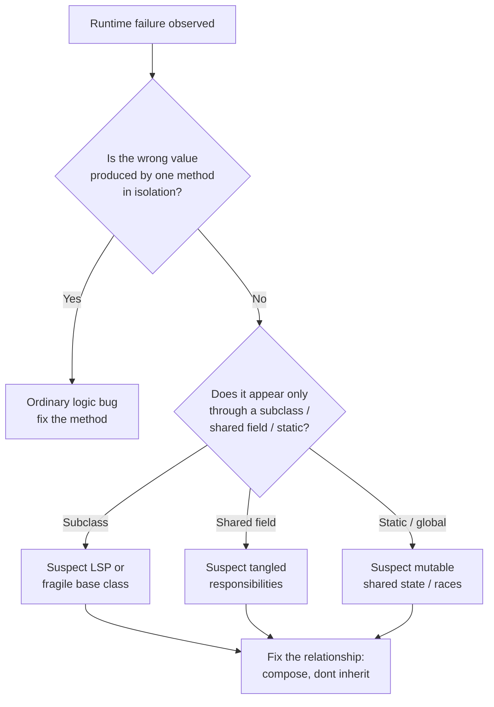
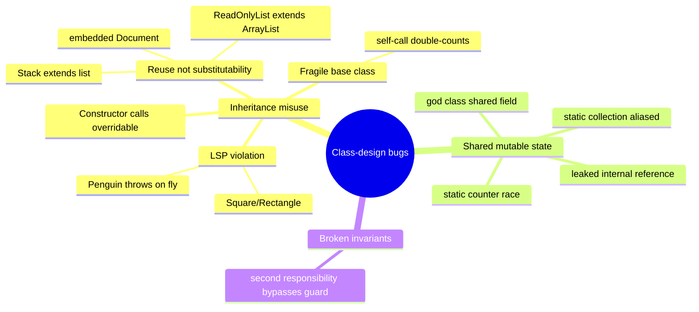

# Classes — Find the Bug

> 12 snippets where the bug is not in the arithmetic or the loop — it is in the **class design**. A subtype that breaks its parent's contract, a base class that quietly poisons every subclass, two responsibilities sharing one mutable field and corrupting each other, a constructor that calls a method the subclass hasn't finished wiring up. Find the design flaw first; the concrete failure follows from it.

These are the bugs that survive code review because each line looks fine in isolation. The defect lives in the *relationship* between classes — inheritance, shared state, invariants spread across responsibilities. Train your eye to read those relationships, not just the statements.

---

## Table of Contents

1. [Snippet 1 — Square extends Rectangle (LSP violation, Java)](#snippet-1--square-extends-rectangle-lsp-violation-java)
2. [Snippet 2 — Fragile base class self-call (Java)](#snippet-2--fragile-base-class-self-call-java)
3. [Snippet 3 — God class with shared mutable state (Python)](#snippet-3--god-class-with-shared-mutable-state-python)
4. [Snippet 4 — Constructor calls overridable method (Java)](#snippet-4--constructor-calls-overridable-method-java)
5. [Snippet 5 — Mutable static state in a utility class (Go)](#snippet-5--mutable-static-state-in-a-utility-class-go)
6. [Snippet 6 — Subtype throws on a supported operation (Python)](#snippet-6--subtype-throws-on-a-supported-operation-python)
7. [Snippet 7 — Inheritance for reuse: ReadOnlyList extends List (Java)](#snippet-7--inheritance-for-reuse-readonlylist-extends-list-java)
8. [Snippet 8 — Invariant bypassed by a second responsibility (Go)](#snippet-8--invariant-bypassed-by-a-second-responsibility-go)
9. [Snippet 9 — Stack extends Vector exposes the wrong API (Python)](#snippet-9--stack-extends-vector-exposes-the-wrong-api-python)
10. [Snippet 10 — Shared base-class collection aliased across instances (Java)](#snippet-10--shared-base-class-collection-aliased-across-instances-java)
11. [Snippet 11 — Embedded struct promotes a method that breaks the subtype (Go)](#snippet-11--embedded-struct-promotes-a-method-that-breaks-the-subtype-go)
12. [Snippet 12 — Data class with leaked internal reference (Python)](#snippet-12--data-class-with-leaked-internal-reference-python)
13. [Scorecard](#scorecard)
14. [Related Topics](#related-topics)

---

## How to Use

Read each snippet and answer the question **before** opening the `Answer` block. For each one, write down three things on paper or in a comment:

1. **The design flaw** — which class-design rule is violated (LSP, encapsulation, single responsibility, the constructor/virtual-call rule, shared mutable state)?
2. **The concrete bug** — the exact wrong value, crash, or corruption a caller observes, and the smallest input that triggers it.
3. **The fix** — the structural change that makes the bug *impossible*, not just patched at one call site.

If you only find the symptom but not the design flaw, you will fix it in the wrong place and it will come back. The whole point of this file is to connect a runtime failure back to the class relationship that caused it.

Difficulty: ⭐ approachable · ⭐⭐ intermediate · ⭐⭐⭐ subtle.



---

### Snippet 1 — Square extends Rectangle (LSP violation, Java)

Difficulty: ⭐⭐

```java
class Rectangle {
    protected int width;
    protected int height;

    public void setWidth(int width)   { this.width = width; }
    public void setHeight(int height) { this.height = height; }
    public int  area()                { return width * height; }
}

class Square extends Rectangle {
    @Override
    public void setWidth(int width) {
        this.width = width;
        this.height = width;   // a square keeps sides equal
    }
    @Override
    public void setHeight(int height) {
        this.width = height;
        this.height = height;
    }
}

// A utility that works on any Rectangle:
class Geometry {
    /** Grows the rectangle to a target width, then asserts the area. */
    static void growToWidthAndCheck(Rectangle r, int newWidth) {
        int originalHeight = r.height;
        r.setWidth(newWidth);
        // The height was untouched, so area must be newWidth * originalHeight.
        assert r.area() == newWidth * originalHeight
            : "expected " + (newWidth * originalHeight) + " got " + r.area();
    }
}

// Caller:
Geometry.growToWidthAndCheck(new Square(), 5); // started 0x0
```

**What's wrong?**

<details><summary>Answer</summary>

**Design flaw — Liskov Substitution Principle violation.** `Square` claims to be a `Rectangle`, so any code written against `Rectangle` must keep working when handed a `Square`. But `Rectangle`'s implicit contract is: *`setWidth` changes the width and leaves the height alone.* `Square` cannot honor that — it must change both to stay square. The "is-a" relationship is false: a mutable square is **not** substitutable for a mutable rectangle.

**Concrete bug.** `growToWidthAndCheck` reads `originalHeight` (0 for a fresh `Square`), calls `setWidth(5)`. For a real `Rectangle`, `area()` would be `5 * 0 = 0` and the assertion `area() == 5 * 0` holds. For a `Square`, `setWidth(5)` *also* sets height to 5, so `area()` is `25`, and the assertion fails: `expected 0 got 25`. The utility is correct; the subtype broke the contract it inherited. With assertions disabled in production, you instead get silently wrong geometry — every algorithm that mutates width independently of height now miscomputes for squares.

**Fix.** Drop the inheritance. `Square` and `Rectangle` are different shapes; neither is a subtype of the other when shapes are mutable. Model them as separate types behind a read-only `Shape` interface, or make rectangles immutable so "set width" doesn't exist as a mutating contract.

```java
interface Shape { int area(); }

final class Rectangle implements Shape {
    private final int width, height;
    Rectangle(int width, int height) { this.width = width; this.height = height; }
    public int area() { return width * height; }
    public Rectangle withWidth(int w) { return new Rectangle(w, height); }
}

final class Square implements Shape {
    private final int side;
    Square(int side) { this.side = side; }
    public int area() { return side * side; }
}
```

Now there is no inherited `setWidth` to violate. `withWidth` returns a new `Rectangle`; a `Square` simply doesn't offer it, and the compiler stops anyone from treating one as the other.

</details>

---

### Snippet 2 — Fragile base class self-call (Java)

Difficulty: ⭐⭐⭐

```java
class CountingList<E> {
    private final List<E> items = new ArrayList<>();
    private int addCount = 0;

    public void add(E item) {
        addCount++;
        items.add(item);
    }

    public void addAll(Collection<? extends E> c) {
        for (E item : c) {
            add(item);     // delegate to add() so the count stays correct
        }
    }

    public int getAddCount() { return addCount; }
    public int size()        { return items.size(); }
}

// A subclass that wants to also keep a running total of string lengths:
class LengthTrackingList extends CountingList<String> {
    private int totalLength = 0;

    @Override
    public void add(String item) {
        totalLength += item.length();
        super.add(item);
    }

    @Override
    public void addAll(Collection<? extends String> c) {
        for (String s : c) {
            totalLength += s.length();
        }
        super.addAll(c);   // base class also tracks the count
    }

    public int getTotalLength() { return totalLength; }
}

// Caller:
var list = new LengthTrackingList();
list.addAll(List.of("ab", "cde"));
System.out.println(list.getTotalLength()); // expected 5
```

**What's wrong?**

<details><summary>Answer</summary>

**Design flaw — the fragile base class problem (self-use leaking through inheritance).** `CountingList.addAll` is implemented *in terms of* `add`. That is an internal detail, but inheritance exposes it: a subclass that overrides **both** `add` and `addAll` ends up running its own logic twice, because `super.addAll(c)` loops and calls the **overridden** `add` (dynamic dispatch always resolves to the subclass).

**Concrete bug.** `addAll(List.of("ab", "cde"))`:

1. `LengthTrackingList.addAll` adds `2 + 3 = 5` to `totalLength`.
2. It calls `super.addAll(c)`. Inside `CountingList.addAll`, the loop calls `add(item)` — which is `LengthTrackingList.add` (overridden), adding `2 + 3 = 5` **again**.

Result: `totalLength == 10`, not `5`. The subclass double-counts every batch insert. Nothing in either class looks wrong on its own; the bug only exists because the base class's *self-call* and the subclass's override interact. If a later refactor changes `CountingList.addAll` to call `items.add` directly instead of `add`, the count would silently start under-counting instead. The subclass is coupled to an implementation detail it can't see.

**Fix.** Prefer composition over inheritance — wrap a `CountingList` instead of extending it, so the base class's internal self-calls are invisible and irrelevant:

```java
final class LengthTrackingList {
    private final CountingList<String> delegate = new CountingList<>();
    private int totalLength = 0;

    public void add(String item) {
        totalLength += item.length();
        delegate.add(item);
    }

    public void addAll(Collection<? extends String> c) {
        for (String s : c) add(s);   // one path; no hidden second traversal
    }

    public int getTotalLength() { return totalLength; }
    public int getAddCount()    { return delegate.getAddCount(); }
}
```

If inheritance is mandatory, the base class must **document its self-use** ("`addAll` calls `add`") as part of the contract, and the subclass must override only one of the two. Composition removes the trap entirely. This is the exact bug Josh Bloch uses in *Effective Java* Item 18 to argue "favor composition over inheritance."

</details>

---

### Snippet 3 — God class with shared mutable state (Python)

Difficulty: ⭐⭐

```python
class OrderManager:
    """Handles cart, pricing, inventory, and the current customer's discount."""

    def __init__(self):
        self.items = []
        self.discount = 0.0          # current discount rate, 0.0-1.0
        self.total = 0.0

    # --- pricing responsibility ---
    def apply_promo(self, rate):
        self.discount = rate

    def recompute_total(self):
        subtotal = sum(i.price * i.qty for i in self.items)
        self.total = subtotal * (1 - self.discount)

    # --- inventory / reporting responsibility ---
    def export_tax_report(self):
        # Tax authority wants the UNDISCOUNTED subtotal.
        self.discount = 0.0                 # reset so recompute gives gross
        self.recompute_total()
        return {"gross": self.total}

    # --- checkout responsibility ---
    def checkout(self):
        self.recompute_total()
        return self.total


mgr = OrderManager()
mgr.items = [Item(price=100, qty=1)]
mgr.apply_promo(0.20)            # 20% off
report = mgr.export_tax_report() # ops runs the nightly report
charged = mgr.checkout()         # customer pays
print(charged)                   # expected 80.0
```

**What's wrong?**

<details><summary>Answer</summary>

**Design flaw — a god class where two responsibilities share one mutable field.** `OrderManager` owns pricing, tax reporting, and checkout, and they all read/write `self.discount`. The tax-report code needs the *gross* total, so it takes a shortcut: it overwrites `self.discount = 0.0` and reuses `recompute_total`. That mutation leaks into every other responsibility that trusts `self.discount`.

**Concrete bug.** `export_tax_report()` sets `self.discount = 0.0` and never restores it. When `checkout()` runs afterward, the 20% promo is gone: the customer is charged `100.0` instead of `80.0`. The promo silently evaporates whenever the nightly report runs between `apply_promo` and `checkout`. Order of calls — not any single method — determines correctness, which is the signature of tangled shared state. It is also a latent race: if report export and checkout run on the same object from two threads, the discount flickers to zero mid-checkout.

**Fix.** Split the responsibilities so no one borrows and corrupts shared mutable state. Pricing computations should be pure functions of their inputs, not side effects on a shared field.

```python
@dataclass(frozen=True)
class Pricing:
    items: tuple
    discount: float = 0.0

    def subtotal(self) -> float:
        return sum(i.price * i.qty for i in self.items)

    def total(self) -> float:
        return self.subtotal() * (1 - self.discount)


class Checkout:
    def charge(self, pricing: Pricing) -> float:
        return pricing.total()

class TaxReport:
    def gross(self, pricing: Pricing) -> dict:
        return {"gross": pricing.subtotal()}   # reads subtotal; mutates nothing
```

`TaxReport.gross` asks for the subtotal directly instead of zeroing a shared discount. `Pricing` is immutable, so no responsibility can corrupt another's view. The god class is gone, and the bug is structurally impossible.

</details>

---

### Snippet 4 — Constructor calls overridable method (Java)

Difficulty: ⭐⭐⭐

```java
abstract class Report {
    private final String header;

    Report() {
        this.header = buildHeader();   // call a method subclasses define
    }

    /** Subclasses provide the title used in the header. */
    protected abstract String title();

    protected String buildHeader() {
        return "=== " + title().toUpperCase() + " ===";
    }

    public String header() { return header; }
}

class SalesReport extends Report {
    private final String region;

    SalesReport(String region) {
        super();                 // runs Report() first
        this.region = region;
    }

    @Override
    protected String title() {
        return "Sales for " + region;   // uses the field set in the subclass
    }
}

// Caller:
Report r = new SalesReport("EMEA");
System.out.println(r.header()); // expected: === SALES FOR EMEA ===
```

**What's wrong?**

<details><summary>Answer</summary>

**Design flaw — calling an overridable method from a constructor.** `Report()` calls `buildHeader()`, which calls the overridable `title()`. Java runs the superclass constructor **before** the subclass constructor body, so `title()` executes while `SalesReport.region` is still `null` (fields are initialized to their defaults until the subclass constructor body runs).

**Concrete bug.** Construction order for `new SalesReport("EMEA")`:

1. `SalesReport` instance allocated; `region` is `null`.
2. `super()` runs `Report()`, which calls `buildHeader()` → `title()` → `"Sales for " + region` = `"Sales for null"`.
3. `header` is frozen as `"=== SALES FOR NULL ==="`.
4. *Then* `this.region = "EMEA"` runs — too late; `header` was already computed.

Output: `=== SALES FOR NULL ===`. The subclass override ran against half-constructed state. If `title()` had dereferenced `region` (e.g., `region.trim()`), it would `NullPointerException` straight out of the constructor — a crash with a baffling stack trace, since the field "obviously" gets a value.

**Fix.** Never call an overridable method from a constructor. Compute the value lazily on first access, or pass everything the base class needs into `super(...)` so no override is involved during construction.

```java
abstract class Report {
    protected abstract String title();

    // Computed on demand, after construction is complete.
    public String header() {
        return "=== " + title().toUpperCase() + " ===";
    }
}

class SalesReport extends Report {
    private final String region;
    SalesReport(String region) { this.region = region; }
    @Override protected String title() { return "Sales for " + region; }
}
```

Now `header()` runs only after the object is fully built, so `region` is set. (Effective Java Item 19: a class designed for inheritance must not invoke overridable methods from its constructor.)

</details>

---

### Snippet 5 — Mutable static state in a utility class (Go)

Difficulty: ⭐⭐⭐

```go
package idgen

import "fmt"

// IDFormatter is a "utility": package-level state, package-level functions.
var prefix string
var counter int

func SetPrefix(p string) { prefix = p }

// Next returns the next formatted ID, e.g. "INV-1".
func Next() string {
    counter++
    return fmt.Sprintf("%s-%d", prefix, counter)
}
```

```go
// Two HTTP handlers, served concurrently by net/http:
func handleInvoice(w http.ResponseWriter, r *http.Request) {
    idgen.SetPrefix("INV")
    id := idgen.Next()
    fmt.Fprintln(w, id)
}

func handleReceipt(w http.ResponseWriter, r *http.Request) {
    idgen.SetPrefix("RCP")
    id := idgen.Next()
    fmt.Fprintln(w, id)
}
```

**What's wrong?**

<details><summary>Answer</summary>

**Design flaw — a utility class (here, a package) holding mutable static state shared across all callers.** `prefix` and `counter` are package globals. Every goroutine that serves a request mutates the *same* `prefix` and the *same* `counter`. `net/http` runs each request in its own goroutine concurrently.

**Concrete bug — two intertwined failures:**

1. **Cross-contaminated prefix.** Between `SetPrefix("INV")` and `Next()` in `handleInvoice`, the receipt handler can run `SetPrefix("RCP")`. The invoice handler then formats with the wrong prefix: an invoice comes out as `RCP-42`. The set-then-use pair is not atomic, so the shared `prefix` is whatever the last writer left.
2. **Data race on `counter`.** `counter++` is read-modify-write with no synchronization. Run under `go test -race` (or `go run -race`) and the race detector fires; two goroutines can read the same value and both return the same ID, breaking the uniqueness the generator exists to guarantee.

Because the state is static, you also *cannot* mock or substitute it in tests, and tests pollute each other through the leftover `counter`.

**Fix.** Replace the stateful utility with an instantiable type each caller owns, and guard the counter with a mutex (or an atomic):

```go
type Generator struct {
    prefix  string
    mu      sync.Mutex
    counter int
}

func NewGenerator(prefix string) *Generator {
    return &Generator{prefix: prefix}
}

func (g *Generator) Next() string {
    g.mu.Lock()
    defer g.mu.Unlock()
    g.counter++
    return fmt.Sprintf("%s-%d", g.prefix, g.counter)
}

// Each handler owns its generator; no shared mutable state.
var invoiceIDs = NewGenerator("INV")
var receiptIDs = NewGenerator("RCP")
```

The prefix is fixed at construction (no set-then-use window), the counter is protected, and each generator is an isolated, mockable object. The utility-class-with-state is gone.

</details>

---

### Snippet 6 — Subtype throws on a supported operation (Python)

Difficulty: ⭐⭐

```python
class Bird:
    def fly(self) -> str:
        return "flap flap"

class Penguin(Bird):
    def fly(self) -> str:
        raise NotImplementedError("penguins can't fly")


def migrate(birds: list[Bird]) -> list[str]:
    """Every bird in the flock takes off for migration."""
    return [b.fly() for b in birds]


flock = [Bird(), Penguin(), Bird()]
print(migrate(flock))   # expected: a list of flight descriptions
```

**What's wrong?**

<details><summary>Answer</summary>

**Design flaw — LSP violation: a subtype removes a behavior the supertype guarantees.** `Bird.fly()` is part of the contract: any `Bird` flies. `Penguin` is declared a `Bird` but **throws** on `fly()`. Callers written against `Bird` reasonably assume `fly()` works; `Penguin` makes that assumption false. This is the classic "a subclass that throws on a method the base supports" anti-pattern — strengthening a precondition / weakening the postcondition, both of which LSP forbids.

**Concrete bug.** `migrate(flock)` iterates and calls `b.fly()` on each. The `Penguin` raises `NotImplementedError`, the comprehension aborts, and `migrate` crashes mid-flock — the first two results are discarded and the caller gets an exception instead of a list. No single class is "wrong"; the failure is that `Penguin` was forced under a `Bird` interface it can't satisfy. Worse, `migrate`'s type hint (`list[Bird]`) says this call is perfectly legal, so the crash is a runtime surprise, not a type error.

**Fix.** Don't put non-flying birds under a `fly()` contract. Split the capability into its own type so the type system stops you from passing a penguin where flight is required.

```python
from typing import Protocol

class Bird:
    pass

class FlyingBird(Bird, Protocol):
    def fly(self) -> str: ...

class Sparrow(Bird):
    def fly(self) -> str: return "flap flap"

class Penguin(Bird):
    def swim(self) -> str: return "glide"


def migrate(birds: list[FlyingBird]) -> list[str]:
    return [b.fly() for b in birds]

# migrate([Penguin()]) is now a type error, caught before runtime.
```

The contract `migrate` depends on (`fly`) is exactly the contract its parameter type requires. Penguins simply aren't `FlyingBird`s, so they can never reach the crashing line.

</details>

---

### Snippet 7 — Inheritance for reuse: ReadOnlyList extends List (Java)

Difficulty: ⭐⭐⭐

```java
// "I want a list I can read but not modify — I'll reuse ArrayList's storage."
class ReadOnlyList<E> extends ArrayList<E> {

    ReadOnlyList(Collection<? extends E> initial) {
        super(initial);   // populate once, at construction
    }

    @Override
    public boolean add(E e) {
        throw new UnsupportedOperationException("read-only");
    }

    @Override
    public E remove(int index) {
        throw new UnsupportedOperationException("read-only");
    }
}

// Caller hands the read-only view to a logging routine:
void publish(List<String> tags) {
    ReadOnlyList<String> view = new ReadOnlyList<>(tags);
    audit(view);                 // third-party code, takes a List<String>
    System.out.println(view);    // expected: still the original tags
}

void audit(List<String> list) {
    list.removeIf(s -> s.startsWith("_"));   // strips internal tags for the log
}
```

**What's wrong?**

<details><summary>Answer</summary>

**Design flaw — inheriting for code reuse instead of for substitutability.** `ReadOnlyList` extends `ArrayList` to reuse its storage, then tries to lock down mutation by overriding `add` and `remove`. But `ArrayList` has *many* mutators — `removeIf`, `clear`, `set`, `addAll`, `replaceAll`, `sort`, the `Iterator.remove` path. You can only override the ones you remember. The subclass inherits a huge surface it must neutralize and inevitably misses some.

**Concrete bug.** `audit` calls `list.removeIf(...)`. `ReadOnlyList` never overrode `removeIf`, so it falls through to `ArrayList.removeIf`, which happily mutates the backing array. The "read-only" list silently drops every tag starting with `_`. After `audit` returns, `view` (and any aliasing of the original data) is mutated; the print shows the *stripped* list, not the original. The whole point of the class — immutability — fails through a method the author forgot existed.

**Fix.** Don't subclass to *subtract* behavior; that's reuse-driven inheritance and it's fragile. Compose: wrap the list and expose only the read operations, or use the JDK's purpose-built immutable view.

```java
final class ReadOnlyList<E> {
    private final List<E> items;
    ReadOnlyList(Collection<? extends E> initial) {
        this.items = List.copyOf(initial);   // truly immutable snapshot
    }
    public E get(int i)  { return items.get(i); }
    public int size()    { return items.size(); }
    public Stream<E> stream() { return items.stream(); }
    // No mutators exist to forget.
}

// Or, if you must pass a List to third-party code:
void publish(List<String> tags) {
    List<String> view = Collections.unmodifiableList(new ArrayList<>(tags));
    audit(view);   // removeIf now throws UnsupportedOperationException — fail loud
}
```

Composition exposes *only* what you intend; there is no inherited `removeIf` to slip through. `unmodifiableList` and `List.copyOf` reject every mutator uniformly, including the ones you'd never remember to override.

</details>

---

### Snippet 8 — Invariant bypassed by a second responsibility (Go)

Difficulty: ⭐⭐⭐

```go
type Account struct {
    balance  int   // cents; invariant: balance >= 0
    overdraft bool
}

// The deposit/withdraw responsibility guards the invariant.
func (a *Account) Withdraw(amount int) error {
    if amount > a.balance {
        return errors.New("insufficient funds")
    }
    a.balance -= amount
    return nil
}

// The "admin adjustments" responsibility, bolted onto the same struct later.
func (a *Account) AdjustBalance(delta int) {
    a.balance += delta          // direct write, no invariant check
}

// Persistence responsibility, also bolted on.
func (a *Account) LoadFromRow(row Row) {
    a.balance = row.Balance     // trusts the DB blindly
}

func main() {
    a := &Account{balance: 100}
    a.AdjustBalance(-250)       // a refund reversal
    fmt.Println(a.balance)      // expected: never below 0
    _ = a.Withdraw(10)
}
```

**What's wrong?**

<details><summary>Answer</summary>

**Design flaw — a class invariant enforced by only one of several responsibilities.** `Account` has an invariant: `balance >= 0`. `Withdraw` carefully enforces it. But two other responsibilities glued onto the same struct — admin adjustments and persistence — write `balance` **directly**, bypassing the guard. An invariant is only as strong as its weakest writer.

**Concrete bug.** `AdjustBalance(-250)` does `a.balance += -250` with no check, leaving `balance == -150`. The invariant is now broken. Every downstream consumer that trusts `balance >= 0` misbehaves: interest is computed on a negative balance, the overdraft flag stays `false`, a "you owe nothing" UI shows a negative number, and `Withdraw(10)` then *succeeds* (`10 > -150` is false) driving the balance to `-160`. `LoadFromRow` has the same hole — one corrupt DB row poisons the in-memory object. The class can never guarantee its own invariant because three methods can each violate it.

**Fix.** Funnel **every** mutation of `balance` through one guarded private operation, so no responsibility can write the field directly.

```go
type Account struct {
    balance int // cents; invariant: balance >= 0 — enforced ONLY via setBalance
}

func (a *Account) setBalance(next int) error {
    if next < 0 {
        return fmt.Errorf("invariant violated: balance would be %d", next)
    }
    a.balance = next
    return nil
}

func (a *Account) Withdraw(amount int) error { return a.setBalance(a.balance - amount) }
func (a *Account) Adjust(delta int) error    { return a.setBalance(a.balance + delta) }

func (a *Account) LoadFromRow(row Row) error {
    return a.setBalance(row.Balance) // even persistence must pass the gate
}
```

`balance` is unexported and only `setBalance` touches it, so the invariant holds no matter which responsibility runs. If a responsibility legitimately needs negative balances (overdraft), that becomes an explicit, named state — not an accident of an unchecked write.

</details>

---

### Snippet 9 — Stack extends Vector exposes the wrong API (Python)

Difficulty: ⭐⭐

```python
class Stack(list):
    """LIFO stack. Reuses list for storage."""

    def push(self, x):
        self.append(x)

    def pop_top(self):
        return self.pop()       # list.pop() removes the LAST element


def undo_history(actions):
    s = Stack()
    for a in actions:
        s.push(a)
    # Some code elsewhere "helpfully" trims the history to the 2 newest:
    while len(s) > 2:
        s.pop(0)                # <-- inherited list.pop(index)
    return [s.pop_top() for _ in range(len(s))]


print(undo_history(["a", "b", "c", "d"]))  # expected newest-first: ['d', 'c']
```

**What's wrong?**

<details><summary>Answer</summary>

**Design flaw — inheriting from `list` to reuse storage exposes the entire list API, including operations that violate the stack abstraction.** A stack should offer only `push`/`pop` at one end. By subclassing `list`, `Stack` inherits `pop(index)`, `insert`, `__setitem__`, slicing — every one of which lets a caller mutate the "stack" at arbitrary positions, breaking LIFO. (This is precisely why `java.util.Stack extends Vector` is a textbook mistake.)

**Concrete bug.** The trimming loop calls `s.pop(0)` — the inherited `list.pop(0)` removes from the **front** (the *oldest* item), not the top. To keep "the 2 newest," it should drop from the front... but combined with `pop_top()` (which removes from the back), the two ends fight. Trace `["a","b","c","d"]`:

- After pushes: `["a","b","c","d"]`.
- `len > 2`: `pop(0)` removes `"a"` → `["b","c","d"]`; `pop(0)` removes `"b"` → `["c","d"]`.
- `pop_top()` twice → `"d"`, then `"c"` → returns `["d","c"]`.

This particular trace happens to look right, which is exactly the danger: because both ends are reachable, correctness depends on the caller *guessing* which end each inherited method touches. Swap the trim to `pop()` (no arg) or have someone `insert(0, x)` and the LIFO order silently inverts. The abstraction provides no protection.

**Fix.** Compose a list; expose only stack operations.

```python
class Stack:
    def __init__(self):
        self._items = []

    def push(self, x):
        self._items.append(x)

    def pop(self):
        return self._items.pop()    # always the top

    def __len__(self):
        return len(self._items)
    # No insert, no pop(index), no slicing — the LIFO invariant can't be bypassed.
```

Now there is no inherited `pop(0)` to misuse; the only way to remove an item is from the top, so the stack abstraction holds.

</details>

---

### Snippet 10 — Shared base-class collection aliased across instances (Java)

Difficulty: ⭐⭐⭐

```java
class Widget {
    // "Default" CSS classes every widget starts with.
    protected static final List<String> DEFAULT_CLASSES =
        new ArrayList<>(List.of("widget"));

    protected List<String> cssClasses = DEFAULT_CLASSES;   // start from defaults

    public void addClass(String c) {
        cssClasses.add(c);
    }

    public List<String> classes() { return cssClasses; }
}

class Button extends Widget {
    Button() {
        addClass("button");   // buttons add their own class
    }
}

// Caller:
Button a = new Button();
Button b = new Button();
System.out.println(a.classes()); // expected: [widget, button]
```

**What's wrong?**

<details><summary>Answer</summary>

**Design flaw — instances aliasing a single shared mutable collection through a `static` base-class field.** `cssClasses = DEFAULT_CLASSES` does **not** copy; every `Widget` (and every subclass instance) points at the *same* `static` list. Mutating one instance's classes mutates the shared list that all instances and the "defaults" share.

**Concrete bug.** Each `Button` constructor calls `addClass("button")`, which appends to the shared `DEFAULT_CLASSES`:

- `new Button() a` → list becomes `[widget, button]`.
- `new Button() b` → appends again → `[widget, button, button]`.

So `a.classes()` prints `[widget, button, button]`, not `[widget, button]` — and it keeps growing with every widget ever created. The "default" list is now permanently polluted; a brand-new `new Widget()` starts with all the classes every previous widget ever added. State leaks across unrelated instances through the static field, and under concurrent construction the unsynchronized `ArrayList.add` is also a data race.

**Fix.** Treat the defaults as an immutable template and give every instance its own collection.

```java
class Widget {
    private static final List<String> DEFAULT_CLASSES = List.of("widget"); // immutable
    private final List<String> cssClasses = new ArrayList<>(DEFAULT_CLASSES); // per-instance copy

    public void addClass(String c) { cssClasses.add(c); }
    public List<String> classes()  { return List.copyOf(cssClasses); } // defensive copy out
}
```

`DEFAULT_CLASSES` is immutable so it can never be mutated; each instance copies it into its own private list; and `classes()` returns a copy so callers can't reach in and corrupt the field either. Instances are now fully isolated.

</details>

---

### Snippet 11 — Embedded struct promotes a method that breaks the subtype (Go)

Difficulty: ⭐⭐⭐

```go
type Document struct {
    content string
}

func (d *Document) Save() error {
    return writeToDisk(d.content)   // documents are saved to disk
}

func (d *Document) Content() string { return d.content }

// A read-only document embeds Document to "reuse" Content().
type ReadOnlyDocument struct {
    *Document
}

// We override Save to refuse writes.
func (r *ReadOnlyDocument) Save() error {
    return errors.New("read-only document")
}

// A generic archival routine accepts anything that can be saved.
type Saver interface {
    Save() error
}

func archiveAll(savers []Saver) {
    for _, s := range savers {
        _ = s.Save()
    }
}

func main() {
    ro := &ReadOnlyDocument{Document: &Document{content: "frozen"}}

    // Elsewhere, a helper takes the embedded *Document directly:
    backup(ro.Document)
}

func backup(d *Document) {
    _ = d.Save()   // expected: should respect read-only
}
```

**What's wrong?**

<details><summary>Answer</summary>

**Design flaw — embedding (Go's "inheritance for reuse") promotes the base method *and* exposes the embedded value, so the override is trivially bypassed.** `ReadOnlyDocument` embeds `*Document` to reuse `Content()`, and overrides `Save()` to forbid writes. But embedding doesn't subclass — it *contains*. The embedded `*Document` is a fully reachable field (`ro.Document`), and the base `Save()` still exists on it. The override only shadows `Save` when you call it *through* `ReadOnlyDocument`; reach the inner value and you get the writable base behavior back.

**Concrete bug.** `backup(ro.Document)` passes the embedded `*Document` directly. Inside, `d.Save()` resolves to `Document.Save` — the *writable* one — because `d` is a `*Document`, not a `*ReadOnlyDocument`. The "read-only" document gets written to disk anyway. The read-only guarantee holds only if every caller is careful to never touch `.Document`, which the type system does nothing to enforce. (It's the same shape as the Square/Rectangle problem: the subtype can't actually restrict the supertype's contract.) Note also that `archiveAll([]Saver{ro})` *does* respect read-only, so the bug is intermittent — it depends on whether code goes through the wrapper or grabs the embedded value.

**Fix.** Don't embed for reuse when you need to *restrict* behavior. Hold the document privately and expose only the operations you intend.

```go
type ReadOnlyDocument struct {
    inner *Document   // unexported: callers cannot reach the writable value
}

func NewReadOnly(content string) *ReadOnlyDocument {
    return &ReadOnlyDocument{inner: &Document{content: content}}
}

func (r *ReadOnlyDocument) Content() string { return r.inner.Content() } // explicit delegation
func (r *ReadOnlyDocument) Save() error     { return errors.New("read-only document") }
```

With `inner` unexported, there is no `ro.Document` to hand to `backup`, so the writable `Save` is unreachable. The read-only contract is enforced by encapsulation, not by hoping callers behave.

</details>

---

### Snippet 12 — Data class with leaked internal reference (Python)

Difficulty: ⭐⭐

```python
class ScheduleConfig:
    """A config object: validated once, then treated as read-only."""

    def __init__(self, allowed_days):
        if not allowed_days:
            raise ValueError("must allow at least one day")
        self.allowed_days = allowed_days     # e.g. ["Mon", "Wed", "Fri"]

    def is_allowed(self, day):
        return day in self.allowed_days


def build_default_config():
    days = ["Mon", "Tue", "Wed", "Thu", "Fri"]
    return ScheduleConfig(days), days   # also returns the raw list for "logging"


cfg, raw = build_default_config()
raw.clear()                              # caller logs then "frees" the list
print(cfg.is_allowed("Mon"))            # expected: True
```

**What's wrong?**

<details><summary>Answer</summary>

**Design flaw — a data class that stores a caller-supplied mutable object by reference, breaking its own validated invariant.** `ScheduleConfig` validates `allowed_days` in `__init__` and then presents itself as read-only. But it stores the **same list object** the caller passed in (`self.allowed_days = allowed_days`). The caller still holds a reference (`days` / `raw`) to that exact list and can mutate it after construction — the "validated, immutable" config shares mutable state with the outside world.

**Concrete bug.** `build_default_config` hands back both the config *and* the underlying `days` list. The caller does `raw.clear()`, emptying the very list `cfg.allowed_days` points at. Now `cfg.is_allowed("Mon")` is `"Mon" in []` → `False`. The config that *guaranteed* at least one allowed day (and was validated to enforce it) now allows nothing, with no exception and no warning. The constructor's validation is meaningless because the validated object can be gutted afterward through an external alias. The same aliasing means mutating `cfg.allowed_days` from one place silently changes it everywhere the list is shared.

**Fix.** Take a defensive copy on the way in and freeze it, so the object owns its state and no external reference can mutate it.

```python
class ScheduleConfig:
    def __init__(self, allowed_days):
        days = tuple(allowed_days)           # copy + make immutable
        if not days:
            raise ValueError("must allow at least one day")
        self._allowed_days = days

    def is_allowed(self, day):
        return day in self._allowed_days

    @property
    def allowed_days(self):
        return self._allowed_days            # a tuple; callers can't mutate it
```

`tuple(allowed_days)` snapshots the input, so the caller's later `clear()` affects only *their* list, not the config's. The validated invariant ("at least one day") now actually holds for the object's lifetime.

</details>

---

## Scorecard

Tally how many you diagnosed — both the **design flaw** and the **concrete bug** — before opening the answer.

| Score | Reading | What it means |
|-------|---------|---------------|
| 11–12 | ⭐⭐⭐ | You read class *relationships*, not just statements. You'd catch these in review before they ship. |
| 8–10  | ⭐⭐  | Strong. You spot LSP and shared-state bugs; tighten up on constructor/virtual-call and embedding subtleties. |
| 5–7   | ⭐    | Good instincts on the obvious ones (god class, mutable statics). Study the fragile-base-class and invariant-bypass cases — they're the ones that survive review. |
| 0–4   | —    | Re-read [junior.md](junior.md) for the rules, then come back. Focus on one idea: *a runtime failure that only appears through a subclass, a shared field, or a static is almost always a design bug, not a logic bug.*

Common thread across all 12: **the buggy line is innocent in isolation.** The defect is in the relationship — what the subtype promised, who else can write the field, which method the constructor reached too early. Fix the relationship and the bug class disappears; patch the line and it returns next quarter.



---

## Related Topics

- [junior.md](junior.md) — the plain-language rules these snippets violate (god class, data class, utility class, inherit for substitutability not reuse).
- [tasks.md](tasks.md) — hands-on exercises: refactor an inheritance hierarchy into composition, and harden a class's invariants.
- [Chapter README](../README.md) — the positive rules for classes (small, single-responsibility, cohesive, organized for change).
- [../../anti-patterns/README.md](../../anti-patterns/README.md) — the broader catalogue of anti-patterns, including object-orientation abuse and god objects.
- [../../refactoring/README.md](../../refactoring/README.md) — the mechanics for the fixes shown here: *Replace Inheritance with Delegation*, *Extract Class*, *Encapsulate Field*, and *Replace Subclass with Fields*.
