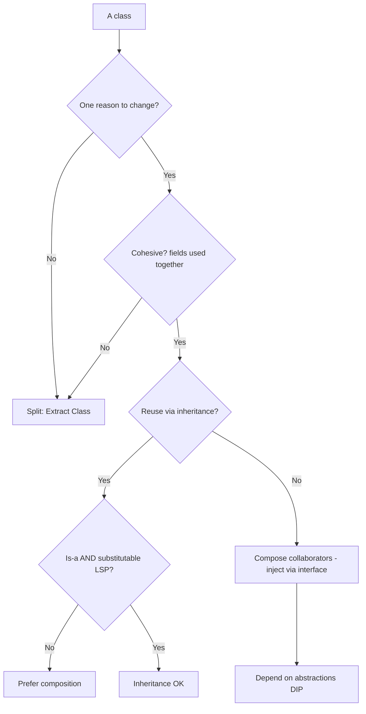

# Classes — Interview Questions

> 50+ questions on class design, SRP, SOLID, cohesion, composition vs inheritance, and the god/data/utility-class smells. Grouped by tier. Each answer is crisp; harder questions flag *what the interviewer is really checking*. Use as self-review or interview prep.

---

## Table of Contents

- [Junior](#junior-15-questions) — what a class is, SRP, basic smells
- [Mid-level](#mid-level-15-questions) — all of SOLID, cohesion, composition vs inheritance
- [Senior](#senior-13-questions) — LSP, LCOM, DIP, dependency injection, Go's OO
- [Staff](#staff-9-questions) — architecture-scale SOLID, fitness functions, trade-offs
- [Trick Questions](#trick-questions-8)
- [Rapid-Fire](#rapid-fire)
- [Summary](#summary)
- [Further Reading](#further-reading)
- [Related Topics](#related-topics)



---

## Junior (15 questions)

### Q1. What is a class, conceptually?

<details><summary>Answer</summary>

A bundle of related data (fields) and the behaviour that operates on it (methods), exposing a small public interface and hiding its internals (encapsulation). A well-designed class models one concept and keeps its data private, exposing operations rather than raw state.
</details>

### Q2. What is the Single Responsibility Principle?

<details><summary>Answer</summary>

A class should have **one reason to change**. Robert C. Martin's precise definition: *a module should be responsible to one, and only one, actor* — one group of stakeholders whose needs drive changes. If billing rules and report formatting both force edits to the same class, two actors share it, and a change for one risks breaking the other.
</details>

### Q3. What's wrong with the phrase "a class should do one thing"?

<details><summary>Answer</summary>

It's too vague — "one thing" can be read at any granularity. The actor-based definition is sharper: group methods by *who* requests changes. A `Employee` class with `calculatePay()` (finance), `reportHours()` (operations), and `save()` (DBAs) serves three actors → three responsibilities, even though informally it's "just about employees."
</details>

### Q4. What is a god class?

<details><summary>Answer</summary>

A class that knows or does too much — thousands of lines, dozens of fields, methods touching unrelated concerns. It centralizes logic that belongs in many classes. Symptoms: everyone edits it, merge conflicts are constant, and you can't test one behaviour without constructing the whole world. Cure: Extract Class along responsibility seams.
</details>

### Q5. What is a data class (as a smell)?

<details><summary>Answer</summary>

A class with only fields and getters/setters — data with no behaviour. Logic that belongs on the data lives elsewhere (often a god class manipulating the data class's fields). It's the "anemic" half of an anemic domain model. Cure: move the behaviour onto the data (Move Method) so the class owns invariants over its own state.

*Note:* a pure data carrier (DTO, `record`, config struct) at a system boundary is fine — the smell is when domain logic that *should* be on the type lives outside it.
</details>

### Q6. What is a utility class?

<details><summary>Answer</summary>

A class with only static methods and no instance state — `StringUtils`, `MathHelpers`. Convenient, but it can't be mocked, can't be substituted via an interface, and tends to become a dumping ground with no cohesion. Prefer instance methods on the relevant type, or inject a small collaborator you can stub in tests.
</details>

### Q7. Why prefer small classes?

<details><summary>Answer</summary>

Smaller classes are easier to name, understand, test, and reuse. A class you can describe in one sentence without "and" usually has one responsibility. Large classes hide multiple concepts and force readers to learn everything before changing anything.
</details>

### Q8. What is encapsulation and why does it matter for class design?

<details><summary>Answer</summary>

Keeping fields private and exposing behaviour, not state. It lets a class enforce its invariants (you can't set a negative balance if there's no public setter) and change internals without breaking callers. A class full of public getters/setters has no encapsulation — it's a data class.
</details>

### Q9. Composition vs inheritance — one sentence each.

<details><summary>Answer</summary>

**Inheritance** ("is-a"): a subclass *is a kind of* its parent and inherits its interface and implementation. **Composition** ("has-a"): a class holds other objects and delegates to them. Default to composition; reach for inheritance only when there's a genuine is-a relationship *and* substitutability.
</details>

### Q10. What does "favor composition over inheritance" mean?

<details><summary>Answer</summary>

When you want code reuse, hold a collaborator and delegate rather than subclassing it. Inheritance couples you to the parent's implementation and exposes its whole interface; composition lets you expose only what you need and swap the collaborator. From the GoF book: *favor object composition over class inheritance.*
</details>

### Q11. Name the five SOLID principles.

<details><summary>Answer</summary>

- **S** — Single Responsibility
- **O** — Open/Closed
- **L** — Liskov Substitution
- **I** — Interface Segregation
- **D** — Dependency Inversion
</details>

### Q12. What is the Open/Closed Principle?

<details><summary>Answer</summary>

Software entities should be **open for extension, closed for modification**. You should be able to add behaviour by writing new code (a new subclass/implementation/strategy), not by editing existing, tested code. Achieved via polymorphism: depend on an abstraction, add new implementations.
</details>

### Q13. A `Rectangle` has `setWidth`/`setHeight`. Should `Square` extend it?

<details><summary>Answer</summary>

No — the classic LSP violation. A `Square` that keeps width == height breaks `setWidth(5); setHeight(4)` (a caller expects width to stay 5). Inheriting for the "is-a" intuition ("a square is a rectangle") breaks behavioural substitutability. Model them separately, or use an immutable `Shape` with an `area()` method.
</details>

### Q14. Why are deep inheritance hierarchies a smell?

<details><summary>Answer</summary>

Each level adds coupling: a subclass depends on every ancestor's implementation, and a change near the root ripples down unpredictably. Reading one class means reading the whole chain. Rule of thumb: keep hierarchies 2–3 levels deep; beyond that, prefer composition or strategy objects.
</details>

### Q15. What does it mean to inherit "for code reuse" and why is it risky?

<details><summary>Answer</summary>

Subclassing solely to grab some methods, with no real is-a relationship — e.g., `Stack extends Vector` (Java's historical mistake) so `Stack` "gets" the list operations. The subclass leaks the parent's whole interface (you can `insertElementAt` into a stack), and you're coupled to the parent's implementation. Reuse via composition instead: hold a `List` and delegate.
</details>

---

## Mid-level (15 questions)

### Q16. Give a clean SRP refactor of a class that violates it.

<details><summary>Answer</summary>

```java
// Before: three actors share one class
class Employee {
    Money calculatePay() { ... }   // finance
    String reportHours() { ... }   // operations
    void save() { ... }            // DBAs / persistence
}

// After: one responsibility each
class PayCalculator { Money calculate(Employee e) { ... } }
class HoursReporter { String report(Employee e) { ... } }
class EmployeeRepository { void save(Employee e) { ... } }
```

`Employee` becomes a focused domain object; each collaborator changes for exactly one actor.
</details>

### Q17. Show Open/Closed with and without polymorphism.

<details><summary>Answer</summary>

```java
// Violates OCP: adding a shape edits this method
double area(Shape s) {
    if (s instanceof Circle c) return Math.PI * c.r * c.r;
    if (s instanceof Square sq) return sq.side * sq.side;
    // adding Triangle → edit here
}

// Honors OCP: add a shape by adding a class
interface Shape { double area(); }
record Circle(double r) implements Shape { public double area(){ return Math.PI*r*r; } }
record Square(double side) implements Shape { public double area(){ return side*side; } }
// Triangle: new class, zero edits to existing code
```

*Caveat:* OCP costs an abstraction up front. Don't pre-abstract every `if`; apply it where you've seen the axis of change.
</details>

### Q18. State the Liskov Substitution Principle precisely.

<details><summary>Answer</summary>

If `S` is a subtype of `T`, objects of type `T` may be replaced with objects of type `S` **without altering the correctness** of the program. Concretely, a subtype must not strengthen preconditions, weaken postconditions, or violate invariants of the supertype. "It compiles" is not enough — behaviour must remain substitutable.
</details>

### Q19. What is the Interface Segregation Principle?

<details><summary>Answer</summary>

Clients should not be forced to depend on methods they don't use. Prefer many small, role-specific interfaces over one fat interface. A `Machine` interface with `print()`, `scan()`, `fax()` forces a simple printer to implement (or stub-throw) `scan` and `fax`. Split into `Printer`, `Scanner`, `Fax`.
</details>

### Q20. Show an ISP violation and its fix.

<details><summary>Answer</summary>

```java
// Fat interface — old printer must stub scan/fax
interface MultiFunction { void print(Doc d); void scan(); void fax(); }

// Segregated roles — implement only what you support
interface Printer { void print(Doc d); }
interface Scanner { void scan(); }
class SimplePrinter implements Printer { public void print(Doc d){...} }
class OfficeMachine implements Printer, Scanner { ... }
```

ISP is the interface-level expression of SRP: each interface serves one client role.
</details>

### Q21. What is cohesion?

<details><summary>Answer</summary>

How focused a class's responsibilities are — how much its methods and fields belong together. High cohesion: every method uses most of the fields; the class is "about" one thing. Low cohesion: disjoint clusters of methods touching disjoint fields — a sign two classes are hiding inside one.
</details>

### Q22. What is LCOM and what does a high value mean?

<details><summary>Answer</summary>

**Lack of Cohesion of Methods** — a metric for how *un*cohesive a class is. Intuition: pairs of methods that share no fields are "disconnected." High LCOM means methods form separate islands touching separate fields → the class wants to be split. LCOM4 (the common variant) counts connected components of the method/field graph; > 1 component literally means the class is two or more classes glued together.
</details>

### Q23. What is coupling, and how does it relate to cohesion?

<details><summary>Answer</summary>

Coupling is how much one class depends on the internals of another. The design goal is **low coupling, high cohesion**: classes that are internally focused (cohesive) and externally independent (loosely coupled). Inheritance is high coupling (you depend on the parent's implementation); depending on a narrow interface is low coupling.
</details>

### Q24. What is Dependency Inversion?

<details><summary>Answer</summary>

Two rules: (1) high-level modules should not depend on low-level modules — both depend on **abstractions**; (2) abstractions should not depend on details — details depend on abstractions. So an `OrderService` depends on a `PaymentGateway` *interface*, not on `StripeClient` directly. The arrow of dependency is "inverted" to point at the abstraction.
</details>

### Q25. What is dependency injection, and how does it differ from DIP?

<details><summary>Answer</summary>

DIP is the *principle* (depend on abstractions). DI is a *technique* for satisfying it: pass a class's dependencies in (via constructor, setter, or method) rather than having it `new` them itself. Constructor injection is preferred — dependencies are explicit, final, and the object is always fully constructed.

```java
class OrderService {
    private final PaymentGateway gateway;
    OrderService(PaymentGateway gateway) { this.gateway = gateway; } // injected
}
```
</details>

### Q26. Constructor vs setter vs field injection — which and why?

<details><summary>Answer</summary>

**Constructor injection** by default: required dependencies are explicit, the object is immutable and never half-built, and tests can pass fakes directly. **Setter injection** only for genuinely optional dependencies. **Field injection** (reflection-based) hides dependencies, breaks immutability, and can't be used without the container — avoid it.
</details>

### Q27. When is inheritance the *right* choice?

<details><summary>Answer</summary>

When all hold: (1) a true **is-a** relationship, (2) the subtype is **behaviourally substitutable** (LSP), (3) you intend to inherit the parent's *interface*, not just steal its code, and (4) the hierarchy stays shallow. Template Method and stable framework base classes are good fits. If you're only after reuse, compose.
</details>

### Q28. How does composition enable swapping behaviour at runtime?

<details><summary>Answer</summary>

A composed collaborator can be replaced after construction; an inherited base class is fixed at compile time. This is the Strategy pattern: `new Sorter(new QuickSort())` vs `new Sorter(new MergeSort())`. With inheritance you'd need a separate subclass for each combination, causing class explosion.
</details>

### Q29. What's the relationship between SRP and the Single Responsibility of a *function*?

<details><summary>Answer</summary>

Same idea at different scope. A function should do one thing; a class should have one reason to change. SRP at the class level is often achieved by extracting cohesive functions first, then noticing which functions cluster around which fields, then extracting those clusters into their own classes.
</details>

### Q30. How do you detect a god class in review?

<details><summary>Answer</summary>

Signals: very high line/method/field count; the class name is vague (`Manager`, `Processor`, `Helper`, `Util`); many imports from unrelated subsystems; high LCOM; it appears in most PR diffs (high change frequency). Confirm by trying to write a one-sentence description — if you need "and," it's doing too much.
</details>

---

## Senior (13 questions)

### Q31. *What the interviewer is checking:* Walk me through identifying actors to apply SRP on a real class.

<details><summary>Answer</summary>

*They want to see if you operationalize SRP rather than recite it.* For each public method, ask "who asks for this to change, and why?" Group methods by that answer. The groups are your candidate classes. Then check field usage: methods in a group should share fields (high cohesion); if a group touches fields no other group uses, that's a clean Extract Class seam. Validate with LCOM if you have tooling.
</details>

### Q32. How would you measure cohesion across a codebase, and what would you do with the numbers?

<details><summary>Answer</summary>

Run an LCOM metric (LCOM4 in tools like Sonar, `lcom` plugins, or `jdepend`). Treat it as a *triage signal*, not a gate — sort classes by LCOM × change-frequency to find cohesion hotspots worth refactoring. A high-LCOM class that never changes is low priority; a high-LCOM class everyone edits is where bugs cluster. Don't fail builds on raw LCOM — it has false positives (e.g., classes with legitimately independent helper methods).
</details>

### Q33. Give a subtle LSP violation that compiles fine.

<details><summary>Answer</summary>

`ImmutableList implements List` but throws `UnsupportedOperationException` on `add()`. It satisfies the type but violates the contract — callers holding a `List` expect `add` to work. The subtype *strengthened a precondition* (you may only call mutators if mutable). Fix: a narrower interface (`ImmutableCollection` without mutators) so substitutability holds for what the type actually promises.
</details>

### Q34. How does DIP enable testing and what does the test look like?

<details><summary>Answer</summary>

Because the class depends on an interface, tests inject a fake.

```java
class FakeGateway implements PaymentGateway {
    boolean charged;
    public Receipt charge(Money m) { charged = true; return Receipt.ok(); }
}

@Test void placingOrderCharges() {
    var fake = new FakeGateway();
    new OrderService(fake).place(order);
    assertTrue(fake.charged);
}
```

No network, no Stripe, no container. The seam created by DIP *is* the test seam.
</details>

### Q35. How does Go do object-orientation without classes or inheritance?

<details><summary>Answer</summary>

- **No classes:** methods are attached to types via receivers (`func (s *Server) Start()`).
- **No inheritance:** reuse is via **struct embedding** (composition that promotes the embedded type's methods).
- **Interfaces are satisfied implicitly:** a type implements an interface just by having the methods — no `implements` keyword. This makes ISP and DIP natural: define small interfaces *at the consumer*, and any type with the right methods fits.

So Go bakes "favor composition" and "depend on abstractions" into the language by simply not offering inheritance.
</details>

### Q36. Show Go's implicit interfaces satisfying DIP and ISP.

<details><summary>Answer</summary>

```go
// Consumer declares the narrow interface it needs (ISP)
type Notifier interface { Notify(msg string) error }

type OrderService struct { n Notifier } // depends on abstraction (DIP)

// Any type with Notify() satisfies it — no "implements"
type EmailSender struct{}
func (EmailSender) Notify(msg string) error { /* ... */ return nil }
```

The interface lives next to the *consumer*, defined by what the consumer uses — the purest form of Interface Segregation.
</details>

### Q37. Is struct embedding the same as inheritance?

<details><summary>Answer</summary>

No. Embedding promotes the embedded type's methods (syntactic convenience) but there's **no subtype polymorphism** — an `*Server` embedding `Logger` is not a `Logger` subtype, and there's no virtual dispatch / method overriding through the embedded field. It's composition with delegation sugar. You get reuse without the substitutability obligations (and pitfalls) of inheritance.
</details>

### Q38. How do you refactor a deep inheritance hierarchy?

<details><summary>Answer</summary>

Replace inheritance with delegation incrementally: (1) identify the varying behaviour the subclasses provide; (2) extract it into a Strategy interface; (3) have the base class hold a strategy field instead of relying on overridden methods; (4) convert each subclass into a strategy implementation; (5) collapse the now-empty subclasses. This flattens N levels into one class + a set of pluggable strategies (Replace Inheritance with Delegation).
</details>

### Q39. *What the interviewer is checking:* When does applying SOLID make the design *worse*?

<details><summary>Answer</summary>

*They want judgment, not dogma.* Over-applied SOLID produces interface-per-class, indirection everywhere, and "Enterprise FizzBuzz." Specific failure modes: SRP taken to one-method classes (shotgun surgery to make any change); OCP abstractions added for axes of change that never materialize (YAGNI); DIP creating interfaces with exactly one implementation forever. SOLID is a set of *forces to balance*, applied when you've seen the change actually happen — not a checklist to maximize.
</details>

### Q40. How do you decide between a value object and a service class?

<details><summary>Answer</summary>

A **value object** is defined by its attributes, immutable, equality-by-value, and owns behaviour over its own data (`Money.plus(Money)`). A **service** is stateless, holds collaborators, and orchestrates across objects (`TransferService`). If logic belongs to one piece of data, put it on the value object; if it spans multiple objects or needs injected infrastructure, it's a service. Misplacing service logic onto data, or data logic into services, produces the anemic-model smell.
</details>

### Q41. What's wrong with a static utility class from a testing standpoint?

<details><summary>Answer</summary>

Static calls are hard dependencies — `Utils.now()` or `FileUtils.read(path)` can't be substituted without bytecode-rewriting mock frameworks. Code calling statics isn't isolatable in unit tests. The clean alternative: an injectable instance behind an interface (`Clock`, `FileStore`), so tests pass a fake. Reserve true statics for pure functions with no I/O and no time/randomness dependency.
</details>

### Q42. How does the Dependency Inversion Principle relate to package/module structure?

<details><summary>Answer</summary>

The abstraction (interface) should live in (or near) the *high-level* module that uses it, and the low-level implementation should depend inward on it — this is "the dependency arrow points at the policy." It prevents the core domain from depending on infrastructure. In Clean/Hexagonal architecture, domain defines ports (interfaces); adapters (DB, HTTP) implement them. The build dependency goes adapter → domain, never the reverse.
</details>

### Q43. Composition has a downside — name it and how you mitigate.

<details><summary>Answer</summary>

Delegation boilerplate: a composing class must forward many methods to its collaborator, which is verbose and can drift. Mitigations: forward only the narrow interface you actually expose (often a feature, not a cost); use language support (Kotlin `by` delegation, Go embedding, Lombok `@Delegate`); or accept that the explicit forwarding documents exactly what's exposed — unlike inheritance, which leaks everything.
</details>

---

## Staff (9 questions)

### Q44. How do Bloater/SOLID violations manifest at the service/architecture level?

<details><summary>Answer</summary>

God class → god service (a "monolith microservice" owning many bounded contexts). SRP violation → a service that deploys for many unrelated reasons, so every team blocks on it. DIP violation → services importing each other's concrete clients instead of versioned contracts. The cures scale too: bounded contexts (DDD) are Extract Class at architecture scale; contract/interface boundaries are DIP between services.
</details>

### Q45. How would you enforce class-design rules in CI?

<details><summary>Answer</summary>

Fitness functions. With ArchUnit (Java):

```java
@ArchTest static final ArchRule services_are_small =
    classes().that().resideInAPackage("..service..")
        .should().haveLessThanOrEqualTo(15).methodsThatAreNotPrivate();

@ArchTest static final ArchRule domain_independent_of_infra =
    noClasses().that().resideInAPackage("..domain..")
        .should().dependOnClassesThat().resideInAPackage("..infra..");
```

Plus SonarQube cohesion/complexity gates in *baseline mode* on legacy code (fail only on new violations). Rules encode SRP (size), DIP (dependency direction), and layering.
</details>

### Q46. How do you introduce DIP into a legacy codebase that `new`s everything?

<details><summary>Answer</summary>

Branch by Abstraction: (1) extract an interface from the concrete dependency; (2) make callers depend on the interface, still wired to the same concrete class; (3) introduce a seam (constructor param or factory) so the implementation can be swapped; (4) now you can inject fakes for tests or alternate implementations. Each step is behaviour-preserving and shippable — no big-bang rewire.
</details>

### Q47. *What the interviewer is checking:* SRP says "one reason to change" — but isn't every class changed for many reasons in practice?

<details><summary>Answer</summary>

*They're probing whether you understand "reason" = "actor," not "any edit."* SRP isn't "this class never changes for two literal reasons" — it's "the *responsibilities* this class owns answer to one stakeholder group." A `User` class legitimately changes when the user concept changes. It violates SRP when changes are driven by *different actors* (security policy vs reporting vs persistence schema) who shouldn't be coupled. The test is coupling of *change drivers*, not count of commits.
</details>

### Q48. When is a god class acceptable, at least temporarily?

<details><summary>Answer</summary>

When it's stable and rarely changed (the cost of touching it is the problem; if you don't touch it, the risk is dormant), or when splitting it requires a test harness you don't yet have. Prioritize refactoring by *churn × size*, not size alone. A 5,000-line class untouched for three years is lower priority than an 800-line class edited weekly.
</details>

### Q49. How do you balance ISP against interface explosion?

<details><summary>Answer</summary>

Segregate by **client role**, not by individual method. If three methods are always used together by the same client, they belong in one interface. The unit of segregation is "a coherent set of operations one kind of consumer needs." In Go, let consumers define the interface (so it's exactly as wide as that consumer needs); in Java/C#, group by usage observed across call sites, and split a fat interface only when a real client is forced to depend on what it doesn't use.
</details>

### Q50. How does Liskov substitutability interact with covariance/contravariance?

<details><summary>Answer</summary>

LSP formalizes to: a subtype may have **contravariant** (wider) parameter types and **covariant** (narrower) return types, weaker preconditions, and stronger postconditions/invariants. Most languages restrict method overriding to invariant parameters and covariant returns precisely to stay LSP-safe. Violations show up when an override demands *more* of its input (stronger precondition) or promises *less* about its output than the base contract.
</details>

### Q51. How do DIP and the testing pyramid relate?

<details><summary>Answer</summary>

DIP is what makes the wide base of fast unit tests possible. Each injected abstraction is a seam where you swap a fake, so the unit under test runs without DB/network/clock. Without DIP you're forced up the pyramid into slow integration tests just to isolate logic. So "design for testability" and "follow DIP" are largely the same instruction — over-mocking, however, signals you've inverted dependencies you should have just called directly (see mocking trade-offs).
</details>

### Q52. Decompose a god class — what's your end-to-end process?

<details><summary>Answer</summary>

1. **Characterization tests** to pin current behaviour (no specs to trust).
2. **Map responsibilities to actors**; cluster methods + fields.
3. **Identify the highest-churn cluster** — refactor that first for ROI.
4. **Extract Class** along a field/method cluster; original becomes a coordinator.
5. **Invert dependencies** (DIP) where the extracted class calls back into infrastructure.
6. **Repeat**, one cluster per PR, tests green throughout.

Never one big-bang split — that's a rewrite, and rewrites re-introduce solved bugs.
</details>

---

## Trick Questions (8)

### T1. Is inheritance always bad?

<details><summary>Answer</summary>

**No.** It's a powerful tool when the relationship is genuinely is-a *and* substitutable: Template Method, sealed type hierarchies modeling a closed set of variants, stable framework base classes. The advice is "favor composition," not "ban inheritance." Inheritance is bad when used purely for code reuse, when it breaks LSP, or when it grows deep.
</details>

### T2. Is a class with only static methods OK?

<details><summary>Answer</summary>

**Sometimes.** For genuinely pure functions (`Math.max`, string formatting with no I/O), a static utility is fine and even clearer than forcing an instance. It becomes a smell when it (a) hides I/O or time/randomness you'd want to fake in tests, (b) holds mutable static state, or (c) becomes a low-cohesion grab-bag. Rule: static for pure functions; instance behind an interface for anything with side effects or substitutability needs.
</details>

### T3. Is SOLID always right?

<details><summary>Answer</summary>

**No — they're heuristics, not laws.** Each principle trades simplicity for flexibility. Applied prophylactically (before you know the axis of change), they add indirection that never pays off (YAGNI). SOLID earns its keep where change has actually been observed. A small script, a one-implementation interface, or a stable value object often shouldn't be "SOLID-ified." Judgment > dogma.
</details>

### T4. How small is too small for a class?

<details><summary>Answer</summary>

When splitting forces **shotgun surgery** — a single logical change now requires editing many tiny classes in lockstep. That's low cohesion expressed as fragmentation: the pieces only make sense together. If two classes always change together and never independently, they're one concept artificially split. Cohesion is the test in *both* directions: too big (multiple reasons to change) and too small (pieces that can't change independently) are both failures.
</details>

### T5. A data class is always a smell — true?

<details><summary>Answer</summary>

**False.** A pure data carrier is correct at boundaries: DTOs, API request/response bodies, config structs, `record`/`@dataclass` value holders. The *smell* is when domain logic that should live on the type is scattered elsewhere, leaving the data class anemic *within the domain layer*. Context decides: data-only is right for transport, wrong for a domain entity that should own its invariants.
</details>

### T6. If you depend on an interface with only one implementation, is that pointless DIP?

<details><summary>Answer</summary>

**Often, yes — but not always.** The two legitimate reasons for a one-impl interface: (1) a **test seam** (the second "implementation" is your fake), and (2) **dependency direction** (the interface lets the high-level module avoid importing the low-level one). If neither applies — no tests use a fake and there's no layering benefit — the interface is speculative and adds noise. Don't add interfaces reflexively.
</details>

### T7. "Has-a" can always replace "is-a" — so why keep inheritance at all?

<details><summary>Answer</summary>

Because inheritance gives you **subtype polymorphism** for free — callers treat all subtypes uniformly through the base type. Composition can model the data relationship but you'd hand-roll an interface and delegation to get the polymorphism. When you genuinely need "treat these uniformly *and* they're substitutable," a shallow inheritance (or interface + composition) is the cleaner expression. The point isn't that inheritance is irreplaceable, it's that replacing it isn't free.
</details>

### T8. Does Go's lack of inheritance make it less object-oriented?

<details><summary>Answer</summary>

**No — arguably more disciplined OO.** OO's core ideas are encapsulation, polymorphism, and message-passing; inheritance is just *one* mechanism for reuse and polymorphism. Go keeps encapsulation (package-level visibility), polymorphism (interfaces), and composition (embedding), and drops the one feature most often misused. It's a deliberate design choice that pushes you toward "favor composition" and "depend on small interfaces" by default.
</details>

---

## Rapid-Fire

| Question | Answer |
|---|---|
| SRP in one phrase | One reason to change = one actor |
| Open/Closed | Extend by adding code, not editing it |
| Liskov | Subtypes must be behaviourally substitutable |
| Interface Segregation | Many small role interfaces, not one fat one |
| Dependency Inversion | Depend on abstractions, not concretions |
| DI vs DIP | DI is the technique; DIP is the principle |
| Preferred injection | Constructor |
| Default reuse mechanism | Composition |
| When inheritance is right | True is-a + LSP + shallow |
| God class cure | Extract Class along actor seams |
| Data class cure | Move behaviour onto the data |
| Utility class risk | Can't mock/substitute statics |
| Cohesion metric | LCOM (high = split it) |
| Design goal | Low coupling, high cohesion |
| Max inheritance depth | 2–3 levels |
| Go reuse | Struct embedding (composition) |
| Go polymorphism | Implicit interfaces |
| Is inheritance always bad? | No — misused-for-reuse is |
| Is SOLID always right? | No — heuristics, balance them |
| Too small? | When it causes shotgun surgery |

---

## Summary

Good class design reduces to two forces in tension: **high cohesion** (each class owns one responsibility, measured loosely by LCOM and precisely by the actor test for SRP) and **low coupling** (classes depend on narrow abstractions, achieved by DIP + dependency injection and by favoring composition over inheritance).

SOLID names five facets of this: SRP (one actor), OCP (extend, don't edit), LSP (substitutability is behavioural, not just type-level), ISP (interfaces sized to client roles), DIP (depend inward on abstractions). They're heuristics — apply them where change has actually been observed, not prophylactically.

The recurring smells are the inverse: the **god class** (no cohesion, many actors), the **anemic data class** (data divorced from behaviour), the **static utility class** (can't substitute), **inheritance-for-reuse** and **deep hierarchies** (coupling and broken substitutability). The cures — Extract Class, Move Method, Replace Inheritance with Delegation, introduce-an-interface — are all moves toward higher cohesion and lower coupling. Inheritance isn't banned; it's reserved for true, shallow, LSP-safe is-a relationships. Everything else composes.

---

## Further Reading

- Robert C. Martin, *Clean Code* — Chapter 10 (Classes) and the SOLID essays.
- Robert C. Martin, *Clean Architecture* — SRP-as-actor and DIP at module scale.
- Gamma et al., *Design Patterns* — "favor object composition over class inheritance."
- Barbara Liskov & Jeannette Wing, *A Behavioral Notion of Subtyping* — the formal LSP.
- Martin Fowler, *Refactoring* — Extract Class, Replace Inheritance with Delegation, anemic domain model.

---

## Related Topics

- [Classes — README](README.md) · [Junior](junior.md) · [Professional](professional.md)
- [Chapter README](../README.md)
- Sibling chapter: [Objects and Data Structures](../05-objects-and-data-structures/README.md)
- Cross-section: [Design Patterns](../../design-patterns/README.md) · [Refactoring](../../refactoring/README.md)
