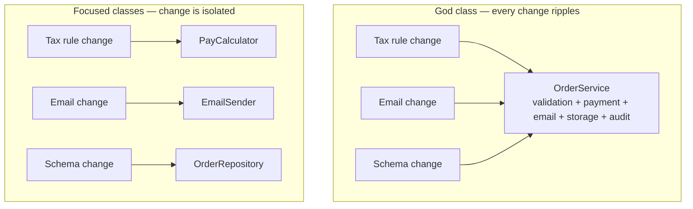

# Classes — Junior Level

> **Level:** Junior — "What's the rule? Show me a clean example."
> **Source:** Robert C. Martin, *Clean Code*, Chapter 10 ("Classes").

---

## Table of Contents

1. [Why classes matter](#why-classes-matter)
2. [Real-world analogy](#real-world-analogy)
3. [Rule 1 — Classes should be small (count responsibilities, not lines)](#rule-1--classes-should-be-small-count-responsibilities-not-lines)
4. [Rule 2 — The Single Responsibility Principle](#rule-2--the-single-responsibility-principle)
5. [Rule 3 — Cohesion: methods should use the fields](#rule-3--cohesion-methods-should-use-the-fields)
6. [Rule 4 — Organize for change](#rule-4--organize-for-change)
7. [Rule 5 — Class organization conventions](#rule-5--class-organization-conventions)
8. [Rule 6 — Prefer composition over inheritance](#rule-6--prefer-composition-over-inheritance)
9. [Rule 7 — Depend on abstractions (intro to DIP)](#rule-7--depend-on-abstractions-intro-to-dip)
10. [Common Mistakes](#common-mistakes)
11. [Test Yourself](#test-yourself)
12. [Cheat Sheet](#cheat-sheet)
13. [Summary](#summary)
14. [Further Reading](#further-reading)
15. [Related Topics](#related-topics)

---

## Why classes matter

Functions are how you organize *statements*. Classes (and Go structs, and Python classes) are how you organize *functions and the data they operate on*. Once a system has more than a handful of functions, the question stops being "is this function clean?" and becomes "which type owns this behavior, and why?"

A clean class is **small, focused, and named after one idea**. You can describe it in a single sentence without using the words "and" or "or." When a new requirement arrives, you can predict which class will change — and it's usually only one.

A messy class is the opposite: it grows in every direction, accumulates fields that have nothing to do with each other, and becomes the place where every new feature lands "because that's where the order stuff lives." Eventually nobody can change it safely.

> **Key idea:** "Small" is measured in **responsibilities**, not lines. A 300-line class that does one thing well can be fine. A 40-line class that does authentication *and* logging *and* email is too big.

---

## Real-world analogy

### The kitchen drawer that holds everything

You start with one drawer: cutlery. Then you toss in batteries "just for now." Then takeout menus, a screwdriver, twist ties, dead pens, a spare key, a USB cable.

A year later, finding a fork means digging. Nobody can describe the drawer except as "the junk drawer." Adding one more thing is easy; *finding* anything is not. And when you move apartments, you can't decide where the drawer's contents belong, because it has no single purpose.

That junk drawer is a **god class**. The fix is not a bigger drawer — it's several labeled, single-purpose ones: cutlery here, tools there, cables in a box. Same objects, sane structure.

A clean class is a labeled drawer. You know what's inside from the label, and you know exactly where a new item goes.

---

## Rule 1 — Classes should be small (count responsibilities, not lines)

The first rule of classes is that they should be small. The second rule is that they should be **smaller than that**. But size is about *responsibilities*, not line count.

A quick test: **describe the class in 25 words without "and," "or," or "but."** If you can't, the class has more than one responsibility.

- `SuperDashboard` that has methods for version reporting, widget management, *and* component focus has three responsibilities.
- `Version` that exposes `majorVersion()`, `minorVersion()`, `buildNumber()` has one responsibility. Small. Good.

### The smell: a god class

```go
// BAD — a god struct that does everything order-related
type OrderService struct {
    db         *sql.DB
    smtpClient *smtp.Client
    logger     *log.Logger
}

func (s *OrderService) PlaceOrder(o Order) error        { /* validation */ return nil }
func (s *OrderService) ChargeCard(o Order) error        { /* payment    */ return nil }
func (s *OrderService) SendConfirmEmail(o Order) error   { /* email     */ return nil }
func (s *OrderService) SaveToDatabase(o Order) error     { /* persist   */ return nil }
func (s *OrderService) WriteAuditLog(o Order) error      { /* logging   */ return nil }
func (s *OrderService) GenerateInvoicePDF(o Order) error { /* report    */ return nil }
// ...20 more methods touching unrelated concerns
```

This struct changes when the payment API changes, when the email template changes, when the database schema changes, when the audit format changes. Five reasons to change living in one type — that is the definition of *too big*.

### The clean version: small, focused types

```go
// GOOD — each type has one job; OrderService coordinates them
type OrderValidator  struct{ /* ... */ }
type PaymentGateway  struct{ /* ... */ }
type EmailSender     struct{ /* ... */ }
type OrderRepository struct{ /* ... */ }

type OrderService struct {
    validator *OrderValidator
    payments  *PaymentGateway
    email     *EmailSender
    repo      *OrderRepository
}

func (s *OrderService) PlaceOrder(o Order) error {
    if err := s.validator.Validate(o); err != nil {
        return err
    }
    if err := s.payments.Charge(o); err != nil {
        return err
    }
    if err := s.repo.Save(o); err != nil {
        return err
    }
    return s.email.SendConfirmation(o)
}
```

`OrderService` is now a *coordinator*. Each collaborator is small and independently testable. Having many small classes is **not** worse than having a few large ones — a system with many small, well-named classes is easier to navigate than one with a few giant ones, the same way a toolbox with labeled compartments beats one giant bin.

---

## Rule 2 — The Single Responsibility Principle

The **Single Responsibility Principle (SRP)** states: *a class should have one, and only one, reason to change.*

"Reason to change" maps to a **stakeholder or a kind of decision**. Rephrase it as: *who would ask for this to change?*

- The DBA changes the schema, so the persistence code changes.
- Marketing changes the email wording, so the email code changes.
- Finance changes the tax rules, so the pricing code changes.

If all three of those live in one class, that class has three reasons to change — and a change requested by one stakeholder risks breaking the other two.

### Java — before: three reasons to change

```java
// BAD — Employee mixes business rules, formatting, and persistence
class Employee {
    private String name;
    private double baseSalary;

    // reason to change #1: payroll/tax rules
    double calculatePay() {
        return baseSalary * 0.78; // tax logic
    }

    // reason to change #2: report formatting
    String toHtmlReport() {
        return "<tr><td>" + name + "</td><td>" + calculatePay() + "</td></tr>";
    }

    // reason to change #3: storage
    void saveToDatabase(Connection conn) throws SQLException {
        // SQL INSERT...
    }
}
```

### Java — after: one reason each

```java
// GOOD — split by reason to change
class Employee {
    private final String name;
    private final double baseSalary;

    Employee(String name, double baseSalary) {
        this.name = name;
        this.baseSalary = baseSalary;
    }

    String name()       { return name; }
    double baseSalary() { return baseSalary; }
}

class PayCalculator {          // changes when tax/payroll rules change
    double calculatePay(Employee e) {
        return e.baseSalary() * 0.78;
    }
}

class EmployeeReporter {       // changes when report format changes
    String toHtmlRow(Employee e, double pay) {
        return "<tr><td>" + e.name() + "</td><td>" + pay + "</td></tr>";
    }
}

class EmployeeRepository {     // changes when storage changes
    void save(Employee e) { /* SQL INSERT */ }
}
```

Now each class has exactly one stakeholder. A tax-law change touches only `PayCalculator`. A redesign of the report touches only `EmployeeReporter`. Nobody steps on anybody.

> SRP is the same idea as the **Large Class** smell from refactoring, viewed from the design side. See [`../../refactoring/README.md`](../../refactoring/README.md).

---

## Rule 3 — Cohesion: methods should use the fields

A class is **cohesive** when its methods operate on its fields. The ideal: every method touches every field. The more methods that touch a given field, the more those methods *belong together* in this class.

When you notice that some methods only use fields A and B, and other methods only use fields C and D, the class is really **two classes squashed together** — split it.

### Python — low cohesion (two classes hiding in one)

```python
# BAD — methods split cleanly into two non-overlapping groups
class UserAccount:
    def __init__(self, username, password_hash, cart_items, shipping_address):
        self.username = username
        self.password_hash = password_hash      # group A: auth
        self.cart_items = cart_items            # group B: shopping
        self.shipping_address = shipping_address

    # group A — only touches auth fields
    def verify_password(self, candidate_hash):
        return self.password_hash == candidate_hash

    def change_password(self, new_hash):
        self.password_hash = new_hash

    # group B — only touches shopping fields
    def add_to_cart(self, item):
        self.cart_items.append(item)

    def cart_total(self):
        return sum(i.price for i in self.cart_items)
```

The auth methods never touch `cart_items`; the cart methods never touch `password_hash`. Two responsibilities, low cohesion.

### Python — high cohesion (split into focused classes)

```python
# GOOD — two cohesive classes; every method uses its own fields
class Credentials:
    def __init__(self, username, password_hash):
        self.username = username
        self._password_hash = password_hash

    def verify(self, candidate_hash):
        return self._password_hash == candidate_hash

    def change_password(self, new_hash):
        self._password_hash = new_hash


class ShoppingCart:
    def __init__(self, items=None):
        self._items = items or []

    def add(self, item):
        self._items.append(item)

    def total(self):
        return sum(i.price for i in self._items)
```

> **Heuristic:** when splitting a long method forces you to promote local variables to fields, cohesion *drops* — and that drop is a signal that the new fields and the methods using them want to become their own class. Maintaining cohesion *causes* the system to break into more, smaller classes. That is a good outcome.

---

## Rule 4 — Organize for change

In a clean system, **change is isolated**. A new requirement should touch a small, predictable set of classes — ideally one. The way you achieve this is by making classes small and focused, so each kind of change has an obvious home.



The top half is fragile: any of the three changes risks breaking the other two, and every change requires re-testing the whole class. The bottom half is the goal: each arrow lands on exactly one small class, and the blast radius of a change equals the size of that one class.

**The practical rule for juniors:** before adding code to an existing class, ask *"is this the same responsibility, or a new one?"* If it's new, make a new class. Resist the gravity that pulls every new feature into the biggest existing class.

---

## Rule 5 — Class organization conventions

A consistent layout makes any class scannable. The conventional top-to-bottom order is:

1. **Public constants** (e.g. `static final` in Java, package-level `const` in Go)
2. **Private fields** (the data the class owns)
3. **Constructor / factory**
4. **Public methods** (the API — what callers use)
5. **Private helper methods** — placed *just below* the public method that calls them (the "stepdown rule": read the class top to bottom like prose, each function followed by those at the next level of abstraction)

### Java — conventional organization

```java
class PasswordPolicy {
    // 1. public constants
    public static final int MIN_LENGTH = 12;

    // 2. private fields
    private final List<String> bannedWords;

    // 3. constructor
    public PasswordPolicy(List<String> bannedWords) {
        this.bannedWords = bannedWords;
    }

    // 4. public method (the API)
    public boolean isAcceptable(String password) {
        return isLongEnough(password) && hasNoBannedWords(password);
    }

    // 5. private helpers — right under the method that uses them
    private boolean isLongEnough(String password) {
        return password.length() >= MIN_LENGTH;
    }

    private boolean hasNoBannedWords(String password) {
        return bannedWords.stream().noneMatch(password::contains);
    }
}
```

A reader gets the public contract first (constants, fields, API) and only descends into private detail if they need it. **Encapsulation** is part of this: keep fields and helpers private unless there's a concrete reason to expose them. Loosening from `private` to `public` is a last resort, not a default. (More on encapsulation in [`../22-abstraction-and-information-hiding/README.md`](../22-abstraction-and-information-hiding/README.md).)

---

## Rule 6 — Prefer composition over inheritance

Inheritance says *"is-a"* and couples a subclass to every detail of its parent. Composition says *"has-a"* and couples a class only to a small, stable interface. For code **reuse**, prefer composition; reserve inheritance for genuine **substitutability** (a `Square` truly *is-a* `Shape` everywhere a `Shape` is used).

The classic trap: reaching for `extends` just to grab some methods you want to reuse.

### Java — inheritance abused for reuse

```java
// BAD — Stack "is-a" ArrayList only to reuse its storage.
// Now Stack inherits add(int, E), remove(int), get(int)... callers can
// poke into the middle of the stack and break the LIFO invariant.
class Stack<E> extends ArrayList<E> {
    public void push(E item) { add(item); }
    public E pop()           { return remove(size() - 1); }
}

// Caller can do this — and the Stack can't stop them:
Stack<String> s = new Stack<>();
s.add(0, "sneaky"); // inserted at the BOTTOM. Invariant violated.
```

### Java — composition (Stack *has-a* list)

```java
// GOOD — Stack owns a list privately and exposes only stack operations.
class Stack<E> {
    private final List<E> items = new ArrayList<>();

    public void push(E item) { items.add(item); }
    public E pop()           { return items.remove(items.size() - 1); }
    public boolean isEmpty() { return items.isEmpty(); }
}
```

The composed `Stack` exposes *only* `push`/`pop`/`isEmpty`. The `List` is an implementation detail; nobody can reach in and break the LIFO invariant. You can swap `ArrayList` for `LinkedList` without touching the API.

### Go — composition is the only option (and that's a feature)

Go has no inheritance at all. You reuse behavior by **embedding** (a `has-a` that forwards methods) and you achieve polymorphism through **interfaces**.

```go
// Reuse by embedding a small, focused type — not by subclassing.
type Logger struct{ prefix string }

func (l Logger) Log(msg string) {
    fmt.Println(l.prefix + ": " + msg)
}

// Server HAS-A Logger; it gains Log() without an inheritance hierarchy.
type Server struct {
    Logger        // embedded
    addr   string
}

func main() {
    s := Server{Logger: Logger{prefix: "srv"}, addr: ":8080"}
    s.Log("started") // -> "srv: started"
}
```

Substitutability in Go comes from interfaces, satisfied structurally:

```go
type Notifier interface {
    Notify(user string) error
}

type EmailNotifier struct{ /* ... */ }
func (EmailNotifier) Notify(user string) error { /* ... */ return nil }

type SMSNotifier struct{ /* ... */ }
func (SMSNotifier) Notify(user string) error   { /* ... */ return nil }

// Any type with a Notify method IS-A Notifier — no "implements" keyword.
func alertAll(n Notifier, users []string) {
    for _, u := range users {
        _ = n.Notify(u)
    }
}
```

### Python — composition over a deep hierarchy

```python
# BAD — inheriting to reuse, building a tall tree
class Animal: ...
class Mammal(Animal): ...
class Pet(Mammal): ...
class Dog(Pet): ...
class GuideDog(Dog): ...   # 5 levels deep — fragile, hard to reason about

# GOOD — compose behaviors instead of stacking subclasses
class Dog:
    def __init__(self, trainer=None):
        self._trainer = trainer          # has-a, not is-a

    def perform(self, command):
        if self._trainer:
            return self._trainer.execute(command)
        return "untrained"
```

> **Depth rule of thumb:** keep inheritance hierarchies to **2–3 levels** at most. Each level adds coupling and hides behavior in a parent the reader has to go find. When you feel the urge to add a fifth subclass, you almost always want composition. More on the difference between reuse and substitutability lives in [`../../design-patterns/README.md`](../../design-patterns/README.md).

---

## Rule 7 — Depend on abstractions (intro to DIP)

The **Dependency Inversion Principle (DIP)** says: depend on **abstractions** (interfaces), not on **concrete details**. High-level policy ("place an order") shouldn't be welded to a low-level detail ("send via SendGrid over SMTP").

Why a junior should care: if `OrderService` constructs its own `SendGridClient`, you can't test `OrderService` without sending real email, and you can't switch email providers without editing `OrderService`. Depending on an *interface* fixes both.

### Go — depend on an interface, inject the concrete type

```go
// Abstraction: what the order code needs, expressed as an interface.
type EmailSender interface {
    SendConfirmation(o Order) error
}

// OrderService depends on the abstraction, not on SendGrid.
type OrderService struct {
    email EmailSender // <- interface, injected
}

func NewOrderService(email EmailSender) *OrderService {
    return &OrderService{email: email}
}

// Production: a real implementation.
type SendGridSender struct{ apiKey string }
func (SendGridSender) SendConfirmation(o Order) error { /* call SendGrid */ return nil }

// Tests: a fake. No network, instant, deterministic.
type FakeSender struct{ sent []Order }
func (f *FakeSender) SendConfirmation(o Order) error {
    f.sent = append(f.sent, o)
    return nil
}
```

In the test you pass `&FakeSender{}`; in production you pass `SendGridSender{}`. `OrderService` doesn't change. This is the payoff of depending on abstractions — and why the **utility class** (a bag of `static` methods you can't substitute or mock) is an anti-pattern: there's no seam to inject a fake.

The mechanics of passing collaborators in (rather than constructing them inside) is **dependency injection** — see [`../05-objects-and-data-structures/README.md`](../05-objects-and-data-structures/README.md).

---

## Common Mistakes

These are the class-level anti-patterns to recognize and avoid.

| Anti-pattern | What it looks like | Why it hurts | Fix |
|---|---|---|---|
| **God class** | One class with 30+ methods touching unrelated concerns; thousands of lines | Every change risks breaking unrelated features; impossible to test in isolation | Split by responsibility (SRP); extract focused classes |
| **Data class** | Only fields + getters/setters, zero behavior | Logic that belongs *on* the data scatters across the codebase; invariants go unenforced | Move behavior next to the data it operates on |
| **Utility class** | Only `static` methods (`StringUtils`, `Helpers`) | Can't mock, can't substitute, no seam for testing; tends to grow into a junk drawer | Make it an instance with an interface, or attach the method to a real type |
| **Inheriting for reuse** | `extends` used just to grab some methods | Subclass coupled to all parent internals; parent changes break children | Use composition (`has-a`) instead |
| **Deep hierarchy** | 4+ levels of `extends` | Behavior hidden across many parents; brittle; hard to follow | Flatten to 2–3 levels; compose behaviors |

A few more day-to-day traps:

- **"I'll just add it here."** A new feature lands in the biggest existing class because that's the path of least resistance. Stop and ask: same responsibility, or new one?
- **Confusing "small file" with "small class."** A class in a short file but doing five things is still a god class. Count responsibilities, not lines.
- **Exposing fields to "make it convenient."** Public mutable fields destroy encapsulation. Keep fields private; expose intent through methods.
- **A data class *next to* a manager class.** `Order` (only fields) + `OrderManager` (all the logic) is a god class wearing two filenames. Put `Order`'s behavior on `Order`.

---

## Test Yourself

**1. A class has 8 methods. Four of them only touch fields `a` and `b`; the other four only touch fields `c` and `d`. What does this tell you, and what's the fix?**

<details><summary>Answer</summary>

It tells you the class has **low cohesion** — it is two classes squashed into one. The fix is to split it into two cohesive classes: one owning `a`/`b` and its four methods, the other owning `c`/`d` and its four methods. After the split, every method in each class uses that class's own fields.

</details>

**2. Why is "the class is only 50 lines" *not* enough to say it follows the Single Responsibility Principle?**

<details><summary>Answer</summary>

SRP is about **reasons to change**, not line count. A 50-line class that handles tax calculation *and* HTML formatting *and* database writes has three reasons to change (finance, design, DBA) and violates SRP. The test is whether you can describe it in one sentence without "and"/"or," and whether only one kind of stakeholder would ever request a change to it.

</details>

**3. You want a `Stack` and you already have a `List` class with `add`/`remove`. Why is `class Stack extends List` a bad idea?**

<details><summary>Answer</summary>

That's **inheriting for reuse**, not for substitutability. `Stack` would inherit `List`'s entire API — including `add(index, item)` and `get(index)` — letting callers insert into the middle and break the LIFO invariant. Use **composition**: `Stack` *has-a* private `List` and exposes only `push`/`pop`/`isEmpty`. The list becomes a hidden implementation detail you can swap freely.

</details>

**4. What's wrong with a `MathUtils` class containing only `static` methods, from a testing standpoint?**

<details><summary>Answer</summary>

A pure **utility class** has no instance and no interface, so there's no **seam** to substitute or mock it. Any class that calls `MathUtils.foo()` is hard-wired to that exact implementation — you can't inject a fake in a test or swap the behavior. (Pure, stateless functions like `Math.sqrt` are fine; the problem is when a utility class hides a dependency you'd want to replace.)

</details>

**5. Your `Order` class has only fields and getters/setters; all the order logic lives in `OrderProcessor`. What anti-pattern is this, and why is it harmful?**

<details><summary>Answer</summary>

`Order` is a **data class** (also called an anemic model) and `OrderProcessor` is sliding toward a **god class**. The harm: behavior that conceptually belongs to an order (validating it, computing its total) is separated from the order's data, so the rules scatter and the same data gets manipulated inconsistently from many places. The fix is to move the behavior onto `Order` itself, so the class encapsulates both its data and the operations on that data.

</details>

**6. When is inheritance actually the right choice over composition?**

<details><summary>Answer</summary>

When the subclass is a genuine **substitute** for the superclass — it satisfies an *is-a* relationship and can be used *anywhere* the superclass is expected without surprising the caller (the Liskov Substitution Principle). If you only want to reuse a few methods, that is a *has-a* relationship and composition is correct. The litmus test: "Could every caller of the parent safely receive my subclass without knowing?" If not, don't inherit.

</details>

---

## Cheat Sheet

| Rule | One-line takeaway |
|---|---|
| **Small** | Count responsibilities, not lines. Describe the class in one sentence without "and." |
| **SRP** | One reason to change = one stakeholder. Split by who would request the change. |
| **Cohesion** | Methods should use the class's fields. Non-overlapping field groups means split it. |
| **Organize for change** | Each kind of change should touch one small, predictable class. |
| **Organization order** | Constants, then private fields, then constructor, then public API, then private helpers below their caller. |
| **Composition over inheritance** | `has-a` for reuse; `is-a` only for true substitutability. Keep hierarchies 2–3 levels deep. |
| **Depend on abstractions** | Inject interfaces, not concrete classes. It buys testability and swappability. |

**Anti-patterns to avoid:** god class · data class · utility class (static-only) · inheriting for reuse · deep hierarchies (4+ levels).

---

## Summary

Clean classes are **small in responsibility**, not necessarily in lines. The Single Responsibility Principle gives "small" a precise meaning: one reason to change, one stakeholder. **Cohesion** is the day-to-day signal — when a class's methods stop sharing its fields, the class wants to split, and chasing cohesion naturally produces many small, focused types instead of a few giants.

You **organize for change** so each new requirement lands in one predictable place, and you follow a consistent **layout** (constants, fields, constructor, public API, then private helpers) so any class reads top-down like prose. For reuse, prefer **composition** (`has-a`) over inheritance (`is-a`); save inheritance for true substitutability and keep hierarchies shallow. Finally, **depend on abstractions** rather than concrete details, which makes classes testable (inject a fake) and flexible (swap an implementation).

Recognize the five class smells — god class, data class, utility class, inheriting for reuse, and deep hierarchies — and you'll catch most class-design problems before they calcify.

---

## Further Reading

- Robert C. Martin, *Clean Code*, Chapter 10 — "Classes".
- Robert C. Martin, *Clean Architecture* — SRP and the Dependency Inversion Principle in depth.
- *Design Patterns* (Gang of Four) — "Favor object composition over class inheritance" (the foundational statement of the rule).
- Joshua Bloch, *Effective Java* — Item 18: "Favor composition over inheritance" (the `Stack`/`List` trap in full).

---

## Related Topics

- [`middle.md`](middle.md) — the same rules under real-world pressure: when to split, when to leave large, and the trade-offs.
- [`senior.md`](senior.md) — class design at architectural scale: module boundaries, SRP across services, and cohesion metrics.
- [`../README.md`](../README.md) — the Classes chapter overview and the positive rules this file teaches.
- [`../02-functions/README.md`](../02-functions/README.md) — clean functions are the building blocks of clean classes.
- [`../05-objects-and-data-structures/README.md`](../05-objects-and-data-structures/README.md) — objects-vs-data-structures, encapsulation, and dependency injection.
- [`../22-abstraction-and-information-hiding/README.md`](../22-abstraction-and-information-hiding/README.md) — encapsulation and why fields and helpers stay private.
- [`../../design-patterns/README.md`](../../design-patterns/README.md) — composition-based patterns (Strategy, Decorator) that replace inheritance.
- [`../../refactoring/README.md`](../../refactoring/README.md) — the Large Class / Data Class smells and the Extract Class refactoring that cures them.
- [`../../anti-patterns/README.md`](../../anti-patterns/README.md) — the god class and anemic-model anti-patterns in their own right.
