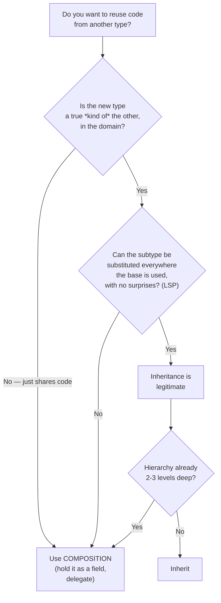

# Classes — Middle Level

> Focus: "Why?" and "When does it bend?" — what "one reason to change" actually means, SOLID as a coherent set, cohesion intuition, and when composition beats inheritance (and when it doesn't).

---

## Table of Contents

1. [What "one reason to change" really means](#what-one-reason-to-change-really-means)
2. [SOLID as a coherent set](#solid-as-a-coherent-set)
3. [Cohesion you can measure: LCOM intuition](#cohesion-you-can-measure-lcom-intuition)
4. [Composition over inheritance — and when inheritance is still right](#composition-over-inheritance--and-when-inheritance-is-still-right)
5. [The cost of too many tiny classes: classitis vs. the god class](#the-cost-of-too-many-tiny-classes-classitis-vs-the-god-class)
6. [Go's composition-only model vs. Java/Python inheritance](#gos-composition-only-model-vs-javapython-inheritance)
7. [Interface segregation in practice](#interface-segregation-in-practice)
8. [Common Mistakes](#common-mistakes)
9. [Test Yourself](#test-yourself)
10. [Cheat Sheet](#cheat-sheet)
11. [Summary](#summary)
12. [Further Reading](#further-reading)
13. [Related Topics](#related-topics)

---

## What "one reason to change" really means

The Single Responsibility Principle is the most quoted and most misunderstood rule in OO design. "A class should do one thing" is wrong — it leads to one-method classes and [classitis](#the-cost-of-too-many-tiny-classes-classitis-vs-the-god-class). Robert Martin's own refinement is precise:

> A module should have **one, and only one, reason to change.** And a "reason to change" is **an actor** — a group of stakeholders who request changes for the same reason.

A responsibility is therefore an **axis of change**: a direction along which requirements move independently. The test isn't "how many things does this class do?" — it's "**who asks for changes, and do their requests arrive together or separately?**"

### The classic violation

```python
class Employee:
    def calculate_pay(self):       # asked to change by: the CFO / accounting
        ...
    def report_hours(self):        # asked to change by: the COO / operations
        ...
    def save(self):                # asked to change by: the DBA / infra
        ...
```

Three actors, three axes of change. When accounting tweaks the pay formula, they touch a class the DBA also depends on. A change for one actor can break another actor's feature — even though their requirements have nothing to do with each other. That coupling is the actual harm SRP prevents: not "ugliness," but **unrelated change propagation**.

The fix splits along actors, not along nouns:

```python
class PayCalculator:    # owned by accounting
    def calculate_pay(self, employee): ...

class HourReporter:     # owned by operations
    def report_hours(self, employee): ...

class EmployeeRepository:  # owned by infra
    def save(self, employee): ...

class Employee:         # a plain data holder the three operate on
    ...
```

### Why "one thing" is the wrong heuristic

Counting "things" is subjective — a `Stack` has `push`, `pop`, `peek`, `size`. Four things or one responsibility? One: they all change for the same reason (the stack's contract) and serve the same actor. The actor lens resolves the ambiguity that the "thing" lens creates.

> **Field test:** before splitting a class, name the actors. If two methods would never be changed by the same pull request from the same stakeholder, they belong to different responsibilities. If you can't find a second actor, you don't have an SRP violation — you have a normal cohesive class.

---

## SOLID as a coherent set

SOLID is not five unrelated tips; it is one idea seen from five angles: **isolate the things that change for different reasons, and depend on stable abstractions rather than volatile details.**

| Principle | One-line meaning | What it isolates |
|---|---|---|
| **S**RP | One actor / one reason to change per module | Change by *who requests it* |
| **O**CP | Open for extension, closed for modification | Change by *adding code, not editing it* |
| **L**SP | Subtypes must be substitutable for their base | Correctness under *polymorphism* |
| **I**SP | No client forced to depend on methods it doesn't use | Coupling via *fat interfaces* |
| **D**IP | Depend on abstractions, not concretions | Direction of *source dependencies* |

They reinforce each other. **OCP** is usually *achieved* through **DIP**: you extend behavior by plugging a new implementation into an abstraction the caller already depends on. **ISP** keeps those abstractions small enough that **LSP** is easy to honor — a one-method interface is hard to violate. And all of them serve **SRP**'s goal: keeping independent reasons-to-change from contaminating each other.

### A worked example tying them together

```java
// DIP: high-level policy depends on an abstraction it owns.
interface PaymentGateway {            // ISP: narrow — one capability
    Receipt charge(Money amount, Card card);
}

class CheckoutService {               // SRP: orchestrates checkout, nothing else
    private final PaymentGateway gateway;   // DIP: abstraction, not Stripe
    CheckoutService(PaymentGateway gateway) { this.gateway = gateway; }

    Receipt pay(Cart cart, Card card) {
        return gateway.charge(cart.total(), card);
    }
}

// OCP: add PayPal without editing CheckoutService.
class StripeGateway implements PaymentGateway { /* ... */ }
class PayPalGateway implements PaymentGateway { /* ... */ }  // LSP: must honor charge()'s contract
```

Adding a new gateway never edits `CheckoutService` (OCP). It works because `CheckoutService` depends on the interface, not the vendor (DIP). The interface is one method (ISP), so any implementation trivially satisfies the substitution contract (LSP), and `CheckoutService` keeps its single reason to change (SRP).

### The critiques you should know

SOLID is influential but not gospel. Senior engineers hold these reservations:

- **DIP is over-applied.** Wrapping every concrete class behind an interface "just in case" produces indirection with no second implementation — a one-to-one interface is pure ceremony. Introduce the abstraction when the second implementation (or the test double) actually arrives, not before.
- **OCP can ossify.** "Never modify existing code" taken literally breeds plugin frameworks and abstraction layers for variation points that never vary. Editing a class is fine; the goal is to make *likely* changes additive, not to forbid all edits.
- **SRP is fuzzy without the actor definition.** Most "SRP violations" people cite are aesthetic ("this class is big") rather than real (two actors coupled). The principle is only sharp once you frame it as actors.
- **Functional and data-oriented critics** (e.g., the "SOLID is OOP folklore" camp) note that immutability and pure functions sidestep several of these problems entirely — there's no shared mutable state to protect, so much of the ceremony evaporates.

> **Takeaway:** SOLID describes *forces*, not laws. Apply a principle when the force it counters is present (multiple actors, real variation, real substitution). Applying it speculatively is how SOLID degrades into [classitis](#the-cost-of-too-many-tiny-classes-classitis-vs-the-god-class).

---

## Cohesion you can measure: LCOM intuition

**Cohesion** = how strongly the parts of a class belong together. High cohesion means the methods all use the same fields toward the same purpose. Low cohesion means the class is really two or three classes sharing a name.

**LCOM** (Lack of Cohesion of Methods) makes this measurable. The intuition behind the common LCOM4 variant:

1. Build a graph. Nodes are methods and fields.
2. Draw an edge from a method to every field it touches, and to every method it calls.
3. Count the **connected components**.

- **1 component** → fully cohesive. Every method is reachable through shared state. This is the ideal.
- **2+ components** → the class is secretly N classes glued together. Each component is an Extract Class candidate.

```python
class Report:
    def __init__(self, rows, smtp_host):
        self.rows = rows            # data axis
        self.smtp_host = smtp_host  # email axis

    def total(self):     return sum(r.amount for r in self.rows)  # uses rows
    def average(self):   return self.total() / len(self.rows)     # uses rows + total()
    def email(self, to): send(self.smtp_host, to, self.total())   # uses smtp_host + total()
```

`total` and `average` form one cluster around `rows`. `email` reaches into `smtp_host`. The only bridge is `total()`. LCOM here is borderline-2: emailing is a different concern (a different actor — operations vs. finance) bolted onto the data class. Split `ReportMailer` out and pass it the total.

> **How to use it:** don't chase a magic LCOM number in CI as a hard gate — it generates noise. Use it as a *smell detector*: a class whose LCOM jumps when you add a method is telling you the new method doesn't belong. It operationalizes the same instinct SRP describes, with a graph instead of intuition.

---

## Composition over inheritance — and when inheritance is still right

"Favor composition over inheritance" is sound advice that gets repeated without its second half: **inheritance is still the right tool when there is a true `is-a` relationship that satisfies Liskov substitutability.**

### Why composition usually wins

Inheritance is the **tightest coupling** the language offers. A subclass depends on the *internal* structure of its parent — protected fields, the order in which the parent calls its own methods (the "fragile base class" problem), and every method the parent will ever add. Change the parent and subclasses you've never seen may break. This is the [Gang of Four's](../../design-patterns/README.md) original reasoning for "favor object composition over class inheritance."

Composition couples to a **published interface** instead. You hold a collaborator and call its public methods; its internals are none of your business.

### When inheritance is genuinely correct

Use inheritance only when **both** hold:

1. **A true `is-a`:** the subtype is a *kind of* the supertype in the problem domain, not merely "shares some code with."
2. **Liskov substitutability (LSP):** any code that works with the base must work, unchanged and correctly, with the subtype. No strengthened preconditions, no weakened postconditions, no surprising exceptions.

The textbook LSP failure is the Rectangle/Square trap:

```java
class Rectangle {
    void setWidth(int w)  { this.width = w; }
    void setHeight(int h) { this.height = h; }
}
class Square extends Rectangle {        // "a square IS-A rectangle" — mathematically true...
    void setWidth(int w)  { this.width = w; this.height = w; }   // ...but breaks the contract
    void setHeight(int h) { this.width = h; this.height = h; }
}
// Client written against Rectangle:
void resize(Rectangle r) {
    r.setWidth(5); r.setHeight(4);
    assert r.area() == 20;   // holds for Rectangle, FAILS for Square (area == 16)
}
```

`Square` is-a `Rectangle` in geometry but **not** as a *mutable type*: it strengthens the invariant (width must equal height), which breaks every client that relied on independent setters. The relationship is not substitutable, so inheritance is wrong here even though the English sentence sounds right.



> **Rule:** inheritance models *substitutability*, not *code reuse*. If your reason to inherit is "I get these methods for free," that's the reuse trap — use composition. Inherit only to say "instances of this type can stand in wherever the base type is expected."

---

## The cost of too many tiny classes: classitis vs. the god class

There are two failure modes, and most teams over-correct from one straight into the other.

### The god class (too much in one place)

A `User` or `OrderManager` that owns identity, billing, notifications, persistence, and feature flags — hundreds of methods, dozens of fields, many actors. Every change risks unrelated breakage. This is the classic [Large Class](../../refactoring/README.md) bloater and the failure SRP warns about.

### Classitis (too little in each place)

John Ousterhout (*A Philosophy of Software Design*) names the opposite disease: **classitis** — the belief that "classes are good, so more classes are better." The result is dozens of **shallow classes**: each is tiny and "does one thing," but each adds an interface, a file, a name to learn, and a layer of indirection. The *complexity moves from inside classes to the spaces between them.* To follow one operation you now open seven files.

Ousterhout's framing is **deep modules vs. shallow modules**: a good class offers a **simple interface** over **substantial functionality** — a lot of capability behind a small door. A shallow class is mostly door and no room: its interface is nearly as complex as its implementation, so it pays the cost of being a class (a new abstraction to understand) without the benefit (hiding meaningful complexity).

```text
DEEP module (good):                 SHALLOW module (classitis):
+-------------------+                +-------------------+
|  small interface  |                |  big interface    |
+-------------------+                +-------------------+
| large, valuable   |                | tiny              |
| implementation    |                | implementation    |
| (hides real work) |                +-------------------+
+-------------------+                ^ interface ≈ implementation: no hiding
```

### Resolving the tension

These two principles pull in opposite directions, and that's the point: SRP says *split when there are multiple actors*; deep-modules says *don't split a single cohesive concern just to make classes smaller*. The synthesis:

> Split a class when it serves **multiple actors / axes of change** (real SRP). Do **not** split a class merely because it is *long* but serves **one** actor with high cohesion. Line count is a smoke alarm, not a verdict.

A 400-line class with LCOM-1 and one actor is a **deep module** — leave it. A 120-line class with two actors and LCOM-2 should be split. Size alone decides nothing.

---

## Go's composition-only model vs. Java/Python inheritance

Go made a deliberate language choice that bakes "composition over inheritance" into the type system: **there is no class inheritance at all.** This is a clean natural experiment in whether you can build large systems without it. You can.

### Go: embedding + interfaces

Go reuses code through **struct embedding** (promotes the embedded type's methods) and achieves polymorphism through **structurally satisfied interfaces** (no `implements` keyword):

```go
type Logger struct{ prefix string }
func (l Logger) Log(msg string) { fmt.Println(l.prefix, msg) }

type Server struct {
    Logger        // embedding — Server gets Log() promoted; this is HAS-A, not IS-A
    addr string
}

// Interfaces are satisfied implicitly and kept tiny:
type Stringer interface{ String() string }   // any type with String() string satisfies it
```

Embedding looks like inheritance but is composition: `Server` *has a* `Logger`; it does not become a subtype of `Logger`, and there is no virtual dispatch up a base class. Interface satisfaction is **structural** — a type satisfies `Stringer` simply by having the method, with no declared link. This means interfaces can be defined by the *consumer*, after the fact, which is the strongest possible form of [Dependency Inversion](#solid-as-a-coherent-set).

### Java / Python: inheritance available, easy to misuse

Java and Python offer single (Java) or multiple (Python) class inheritance plus interfaces/ABCs. The power is real — frameworks lean on it — but so is the temptation to inherit for reuse:

```python
class JsonExporter(list):     # WRONG: inheriting from list "to get list methods"
    def export(self): ...     # now JsonExporter IS-A list — clients can .append() junk,
                              # .sort() it, slice it — none of which you intended.

class JsonExporter:           # RIGHT: composition
    def __init__(self, items): self._items = items   # HAS-A list
    def export(self): ...
```

| Aspect | Go | Java / Python |
|---|---|---|
| Class inheritance | None | Single (Java) / multiple (Python) |
| Code reuse | Embedding (composition) | Inheritance or composition |
| Polymorphism | Structural interfaces (implicit) | Nominal interfaces / base classes (explicit) |
| Who defines the interface | Often the **consumer** | Usually the **provider** |
| Fragile base class risk | Absent (no base class) | Present |

> **Lesson the languages teach:** Go shows the "favor composition" advice taken to its logical end — and the sky doesn't fall. In Java/Python the discipline is on *you*: reach for `is-a` + LSP before `extends`; otherwise hold the collaborator as a field.

---

## Interface segregation in practice

ISP says: **no client should be forced to depend on methods it does not use.** Fat interfaces couple every client to every method — including the ones it ignores — so a change to a method one client doesn't even call can still force it to recompile, re-mock, or re-implement.

### The smell

```java
interface Worker {            // fat interface
    void work();
    void eat();
    void sleep();
}
class Robot implements Worker {
    public void work()  { /* ... */ }
    public void eat()   { throw new UnsupportedOperationException(); }  // ISP violation: forced to fake it
    public void sleep() { throw new UnsupportedOperationException(); }
}
```

`Robot` is dragged into depending on `eat`/`sleep` it can't honor — and any client that takes a `Worker` can't tell whether it's safe to call them. The lie surfaces at runtime instead of compile time (also an LSP violation, since `Robot` can't substitute for a `Worker` that eats).

### The fix — split by client need

```java
interface Workable { void work(); }
interface Feedable { void eat(); }
interface Sleepable { void sleep(); }

class Robot  implements Workable { public void work() { /* ... */ } }
class Human  implements Workable, Feedable, Sleepable { /* all three */ }
```

Each client now depends only on the capability it uses. This is exactly the discipline Go enforces by convention — its standard library interfaces (`io.Reader`, `io.Writer`, `Stringer`) are almost all **one method**, and larger ones (`io.ReadWriter`) are *composed* from the small ones:

```go
type Reader interface { Read(p []byte) (n int, err error) }
type Writer interface { Write(p []byte) (n int, err error) }
type ReadWriter interface { Reader; Writer }   // composition of small interfaces
```

> **Practical heuristic:** the right size for an interface is **the set of methods a single client actually calls.** If you find implementers stubbing out methods with "not supported," or mocks that must fake methods the test never exercises, the interface is too fat — segregate it. Small interfaces also make [test doubles](../../refactoring/README.md) trivial to write, which is ISP's quiet payoff.

---

## Common Mistakes

1. **Reading SRP as "one method / one thing."** It is "one *actor* / one reason to change." Counting verbs produces [classitis](#the-cost-of-too-many-tiny-classes-classitis-vs-the-god-class); counting actors produces good seams.

2. **Splitting a class because it's *long*.** Length is a smoke alarm. A long, single-actor, LCOM-1 class is a deep module — leave it. Split on multiple actors, not on line count.

3. **Inheriting to reuse code.** "I get the parent's methods for free" is the reuse trap. Inherit only for true `is-a` + substitutability; otherwise compose.

4. **Sounding-true `is-a` that breaks LSP.** `Square extends Rectangle`, `Stack extends Vector` (Java's own mistake). The English sentence is true; the *type contract* is not.

5. **Speculative DIP.** Wrapping a single concrete class behind a single-implementation interface "for flexibility." Introduce the abstraction when the second implementation or the test double actually arrives.

6. **Fat interfaces with `UnsupportedOperationException` stubs.** A method an implementer can't honor is an ISP and LSP violation at once — segregate the interface.

7. **Treating SOLID as five separate checkboxes.** They are one idea (isolate independent change; depend on stable abstractions) from five angles; OCP is usually reached *through* DIP, and ISP keeps LSP cheap.

8. **Deep inheritance hierarchies (4+ levels).** Each level adds fragile-base-class surface. Past 2–3 levels, the reuse you gain is dwarfed by the coupling you take on — flatten via composition.

---

## Test Yourself

1. **What is the precise definition of a "responsibility" under SRP?**
   <details><summary>Answer</summary>An axis of change tied to an *actor* — a single stakeholder (or group) who requests changes for the same reason. A class has one responsibility when only one actor would ever ask it to change. Counting "things the class does" is the wrong test; the right test is "do two methods serve different stakeholders whose requests arrive independently?"</details>

2. **Why is `Square extends Rectangle` an LSP violation even though a square *is* a rectangle?**
   <details><summary>Answer</summary>It's true geometrically but not as a *mutable type*. `Square` strengthens an invariant (width must equal height), so `setWidth`/`setHeight` no longer behave independently. Any client written against `Rectangle` that sets width and height separately and expects `area == w*h` breaks. The subtype is not substitutable for the base, which is what LSP forbids.</details>

3. **A class is 350 lines, has high cohesion (LCOM-1), and serves a single actor. SRP violation?**
   <details><summary>Answer</summary>No. SRP is about actors/axes of change, not size. A long, cohesive, single-actor class is a *deep module* — exactly what Ousterhout recommends: a small interface over substantial functionality. Splitting it to satisfy a line-count rule would create shallow classes (classitis) and add indirection without removing complexity.</details>

4. **How do OCP and DIP relate?**
   <details><summary>Answer</summary>OCP (extend without modifying) is usually *achieved through* DIP (depend on abstractions). When the caller depends on an interface, you add new behavior by plugging in a new implementation — extending the system without editing the caller. DIP provides the seam; OCP is the property that seam gives you.</details>

5. **When is inheritance the right choice over composition?**
   <details><summary>Answer</summary>When both hold: (1) a true `is-a` relationship in the problem domain, and (2) full Liskov substitutability — the subtype works correctly everywhere the base is expected, with no strengthened preconditions, weakened postconditions, or surprising exceptions. If you're inheriting merely to reuse code, that's the reuse trap; use composition. Also stop before hierarchies exceed 2–3 levels.</details>

6. **Go has no class inheritance. How does it reuse code and achieve polymorphism, and what does that prove?**
   <details><summary>Answer</summary>Reuse via struct *embedding* (composition — the outer type *has-a* embedded type whose methods are promoted); polymorphism via *structurally satisfied* interfaces (a type satisfies an interface just by having the methods — no `implements`). It proves you can build large systems entirely without inheritance, validating the "favor composition" advice. A bonus: consumers can define the interfaces they need, the strongest form of dependency inversion.</details>

7. **You see an implementer throwing `UnsupportedOperationException` for two of an interface's five methods. Which principles are violated and what's the fix?**
   <details><summary>Answer</summary>ISP (the implementer is forced to depend on methods it can't use) and LSP (it can't substitute for the full interface — clients calling those methods crash). Fix: segregate the interface into smaller capability interfaces, and have each type implement only the ones it can honor.</details>

8. **What does a class with LCOM = 2 tell you?**
   <details><summary>Answer</summary>Its methods/fields form two disconnected clusters — it's effectively two classes sharing a name. Each connected component is an Extract Class candidate. LCOM operationalizes the SRP/cohesion instinct: the two clusters usually map to two different actors or axes of change.</details>

9. **Give one legitimate critique of SOLID.**
   <details><summary>Answer</summary>Any of: DIP is over-applied (single-implementation interfaces are pure ceremony — add the abstraction when the second impl or a test double actually exists); OCP taken literally breeds plugin frameworks for variation that never varies (editing code is fine); SRP is unmeasurable without the actor definition (most cited "violations" are aesthetic, not real); functional/immutable designs sidestep much of the ceremony because there's no shared mutable state to protect.</details>

10. **Your team adopts a "max 100 lines per class" lint rule. Good idea?**
    <details><summary>Answer</summary>Useful as a smoke alarm, harmful as a hard gate. It catches genuine god classes, but it also pressures engineers to split cohesive single-actor classes into shallow ones (classitis), moving complexity into the gaps between classes. Treat it as a prompt to ask "how many actors does this serve?" — not as an automatic refactor trigger.</details>

---

## Cheat Sheet

| Question | Heuristic |
|---|---|
| Should I split this class? | Count **actors**, not lines. Two actors → split. One actor + high cohesion → leave it. |
| Is it really one responsibility? | "Would two different stakeholders ever change these methods independently?" No → one responsibility. |
| Inherit or compose? | True `is-a` **and** Liskov-substitutable → inherit. Otherwise → compose. Reuse alone is never a reason to inherit. |
| Is this `is-a` safe? | Can the subtype stand in for the base everywhere, with no strengthened preconditions / surprises? |
| Is my interface the right size? | The set of methods **one client** actually calls. Stubbed "not supported" methods → too fat. |
| Is this class too shallow? | Interface ≈ implementation complexity → shallow (classitis). Small interface over big functionality → deep (good). |
| How deep can a hierarchy go? | 2–3 levels max. Beyond that, fragile-base-class coupling outweighs reuse. |
| Should I add this interface now? | Only if a second implementation or a test double exists *today*. Otherwise it's speculative DIP. |
| Are SOLID principles independent? | No — one idea (isolate independent change; depend on stable abstractions) from five angles. |

---

## Summary

- **SRP is about actors, not verbs.** A responsibility is an axis of change owned by one stakeholder. Split a class when two actors would change it independently — not because it's "doing two things" or because it's long.
- **SOLID is one coherent idea:** isolate things that change for different reasons, and depend on stable abstractions. OCP is reached through DIP; ISP keeps LSP cheap; all serve SRP's goal of containing change. Know its critiques — speculative DIP/OCP is ceremony.
- **LCOM** turns cohesion into a connected-components count: more than one component means the class is secretly several. Use it as a smell detector, not a CI gate.
- **Composition is the default; inheritance is for substitutability.** Inherit only for true `is-a` + LSP, and never deeper than 2–3 levels. Inheriting for code reuse is the trap (`Square extends Rectangle`).
- **Two failure modes pull opposite ways:** the god class (too many actors in one place) and classitis (too many shallow classes). Prefer **deep modules** — a small interface over substantial functionality — and let *actors*, not line count, decide where to cut.
- **Go's composition-only model** proves you can scale without inheritance: embedding for reuse, tiny structural interfaces for polymorphism. In Java/Python the same discipline is yours to enforce.
- **ISP in practice:** size an interface to what a single client calls; stubbed "not supported" methods are the tell that it's too fat.

---

## Further Reading

- Robert C. Martin, *Clean Code* — the **Classes** chapter (SRP, cohesion, organizing for change).
- Robert C. Martin, *Clean Architecture* — the SOLID chapters, including the actor-based redefinition of SRP.
- John Ousterhout, *A Philosophy of Software Design* — deep vs. shallow modules, classitis, "the best modules are deep."
- Gang of Four, *Design Patterns* — "Favor object composition over class inheritance" and the reasoning behind it.
- Barbara Liskov & Jeannette Wing, *A Behavioral Notion of Subtyping* — the formal statement of LSP.
- The Go Blog, *Effective Go* — embedding and interface satisfaction as Go's composition model.

---

## Related Topics

- [junior.md](junior.md) — the definitions and anti-patterns (god class, data class, utility class) at the recognition level.
- [senior.md](senior.md) — architectural impact, module boundaries, and large-codebase trade-offs.
- [Chapter README](../README.md) — the positive rules for classes.
- [Objects and Data Structures](../05-objects-and-data-structures/README.md) — the data/object asymmetry that underlies the data-class anti-pattern.
- [Abstraction and Information Hiding](../22-abstraction-and-information-hiding/README.md) — deep modules and what "small interface, big functionality" means.
- [Design Patterns](../../design-patterns/README.md) — Strategy, Decorator, and friends realize composition over inheritance.
- [Refactoring](../../refactoring/README.md) — Extract Class, Replace Inheritance with Delegation, and the bloaters this chapter prevents.
