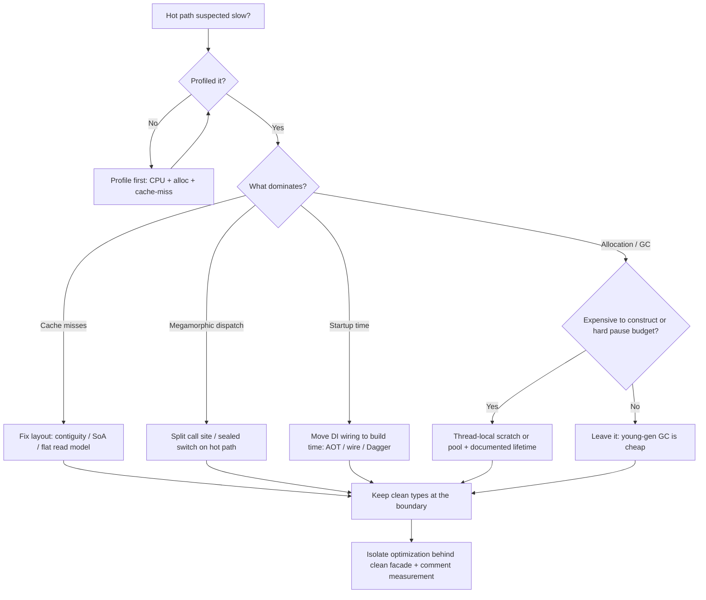

# Classes — Optimize & Reconcile

> Clean class design — small classes, single responsibility, polymorphism over conditionals, composition over inheritance — is the right default. But every abstraction has a runtime cost: a virtual call, an allocation, a pointer chase, a startup penalty. This file holds the tension. Each scenario states a real situation, measures the cost with concrete numbers, and resolves it on a principle: **keep the clean structure by default; flatten, devirtualize, or pool only on a measured hot path, and isolate the ugliness behind a clean boundary.**

The recurring villain here is Casey Muratori's "Clean Code, Horrible Performance" argument: that polymorphism, encapsulation, and small classes cost ~15× on a shape-area microbenchmark. The argument is *correct on that microbenchmark* and *misleading as a general law*. We engage it honestly — and show exactly where it bites and where it evaporates.

---

## Table of Contents

1. [Virtual dispatch vs a switch on a hot loop (the Muratori benchmark)](#scenario-1--virtual-dispatch-vs-a-switch-on-a-hot-loop-the-muratori-benchmark)
2. [Monomorphic call sites and JIT devirtualization (Java)](#scenario-2--monomorphic-call-sites-and-jit-devirtualization-java)
3. [Go interface dispatch and escape analysis](#scenario-3--go-interface-dispatch-and-escape-analysis)
4. [Python method lookup cost in a tight loop](#scenario-4--python-method-lookup-cost-in-a-tight-loop)
5. [Object graph of many small classes vs flat struct (GC pressure)](#scenario-5--object-graph-of-many-small-classes-vs-flat-struct-gc-pressure)
6. [Array of Structs vs Struct of Arrays (Data-Oriented Design)](#scenario-6--array-of-structs-vs-struct-of-arrays-data-oriented-design)
7. [Deep delegation chains (Law of Demeter tax)](#scenario-7--deep-delegation-chains-law-of-demeter-tax)
8. [`final` / `sealed` enabling inlining (Java)](#scenario-8--final--sealed-enabling-inlining-java)
9. [Collapsing a small-class hierarchy on a hot path](#scenario-9--collapsing-a-small-class-hierarchy-on-a-hot-path)
10. [Object pooling trade-offs](#scenario-10--object-pooling-trade-offs)
11. [DI / reflection wiring cost at startup](#scenario-11--di--reflection-wiring-cost-at-startup)
12. [Megamorphic call sites — when polymorphism genuinely costs](#scenario-12--megamorphic-call-sites--when-polymorphism-genuinely-costs)
13. [Boxing small value classes (Java) / interface-wrapping primitives (Go)](#scenario-13--boxing-small-value-classes-java--interface-wrapping-primitives-go)

- [Rules of Thumb](#rules-of-thumb)
- [Related Topics](#related-topics)

---

## Scenario 1 — Virtual dispatch vs a switch on a hot loop (the Muratori benchmark)

**Scenario.** A geometry engine computes the total area of 1,000,000 shapes, summed in a tight loop, 60 times per second. The clean design has a `Shape` interface with `Circle`, `Square`, `Triangle`, `Rectangle` implementing `area()`. Muratori's claim: replace the virtual call with a `switch` on a type tag and a flat array, and you go ~15× faster.

```java
// Clean: polymorphic dispatch
interface Shape { double area(); }
final class Circle implements Shape {
    final double r;
    Circle(double r) { this.r = r; }
    public double area() { return Math.PI * r * r; }
}
// ... Square, Triangle, Rectangle

double totalArea(Shape[] shapes) {
    double sum = 0;
    for (Shape s : shapes) sum += s.area();   // virtual call per element
    return sum;
}
```

```c
// Muratori's "horrible performance" rewrite: tag + table-driven, no branches
double total_area(Shape *shapes, int n) {
    double sum = 0;
    for (int i = 0; i < n; i++) {
        Shape s = shapes[i];                  // contiguous, 32 bytes each
        sum += CTable[s.type] * s.width * s.height; // coefficient lookup, no call
    }
    return sum;
}
```

**Measurement / reasoning.** Muratori's C numbers are real: the table-driven version runs ~1.5 ns/shape vs ~24 ns/shape for the virtual version on his hardware — roughly the cited 15×. Where does the cost come from? Three stacked effects, not one:

1. **Pointer chasing.** `Shape[]` in Java/C++ is an array of *references*. Each `area()` first dereferences the element pointer to a heap object that may live anywhere. The flat version stores shapes inline → sequential memory → hardware prefetcher hits, ~0 cache misses. This is the *dominant* factor, and it is about **memory layout, not virtual dispatch**.
2. **The vtable load + indirect branch.** The virtual call loads the vtable pointer, loads the function pointer, then does an indirect `call`. With 4 shape types randomly interleaved, the indirect-branch predictor mispredicts often (~15–20 cycle bubble each).
3. **No inlining of the arithmetic.** `Math.PI * r * r` cannot be merged with the loop or auto-vectorized when it lives behind a call.

<details><summary>Resolution</summary>

Keep the clean `Shape` interface for 99% of your code — UI, serialization, the editor, any path that touches each shape a handful of times. The 15× only materializes when *all three* effects stack: millions of elements, random type interleaving, and trivial per-element work.

If profiling proves this loop is the bottleneck (it rarely is — most "1M shapes" claims are 1K shapes touched once), then **the highest-leverage fix is layout, not killing polymorphism**: store shapes contiguously by value (Scenario 6, SoA) so the prefetcher works. That alone recovers most of the gap. Only after that, if the indirect branch still dominates, replace the call with a tag dispatch *in that one loop*, behind a clean façade:

```java
double totalArea(ShapeBuffer buf) {   // SoA-backed, contiguous
    double sum = 0;
    for (int i = 0; i < buf.size; i++) {
        switch (buf.type[i]) {        // dense int tag, predictable
            case CIRCLE -> sum += Math.PI * buf.a[i] * buf.a[i];
            case RECT   -> sum += buf.a[i] * buf.b[i];
            // ...
        }
    }
    return sum;
}
```

The lie in "clean code is 15× slower" is the implied *always*. The honest statement: *polymorphism + reference-array layout costs ~15× on a memory-bound microkernel touching every element with near-zero work per element.* Move one variable (work per element up to even a `sqrt`, or element count down to thousands) and the gap collapses to single-digit percent. Default to clean; measure before you flatten.

</details>

---

## Scenario 2 — Monomorphic call sites and JIT devirtualization (Java)

**Scenario.** A pricing service has a `PriceRule` interface with 12 implementations, but in production 98% of call sites only ever see one concrete type. A teammate wants to delete the interface "because virtual calls are slow."

```java
interface PriceRule { Money apply(Money base); }

Money price(Money base, PriceRule rule) {
    return rule.apply(base);   // is this expensive?
}
```

**Measurement / reasoning.** HotSpot's C2 compiler profiles call sites at runtime. A call site is one of:

- **Monomorphic** (one type observed): the JIT installs an *inline cache*, speculatively inlines the target, and guards it with a single type check (~1 cycle, perfectly predicted). Effective cost: equal to a direct call, often fully inlined and then optimized as if the interface weren't there.
- **Bimorphic** (two types): still inlined, with two guarded branches.
- **Polymorphic/megamorphic** (3+ / many): falls back to a vtable or itable lookup, no inlining.

So a monomorphic interface call after JIT warmup costs essentially **nothing** — the JIT *devirtualizes* it. A JMH microbenchmark of a monomorphic interface call vs a direct call typically shows <1 ns difference, within noise.

<details><summary>Resolution</summary>

Keep the interface. Deleting it buys nothing on monomorphic sites — the JIT already removed the cost. You would trade real design flexibility (12 implementations, testability, the Open/Closed boundary) for a speculative gain the compiler already captured.

Two caveats that *do* matter:

- **Warmup.** Before C2 compiles the method (first ~10k invocations), calls run interpreted/C1 and the inline cache isn't installed. For short-lived JVMs (CLI tools, serverless), this matters; for long-running services it's irrelevant. Mitigate with tiered compilation tuning or AOT (GraalVM native-image, or Project Leyden).
- **Profile pollution.** If a test or warmup path exercises all 12 types, the call site becomes megamorphic and the JIT gives up inlining *for the whole site*, including in hot production code. Keep hot paths type-stable. This is a real, measurable trap (see Scenario 12).

Verify with `-XX:+PrintInlining` or JITWatch before assuming anything.

</details>

---

## Scenario 3 — Go interface dispatch and escape analysis

**Scenario.** A Go log pipeline defines `type Sink interface { Write(Record) error }` with `FileSink`, `KafkaSink`, `NullSink`. The hot path writes 500k records/sec. Someone proposes replacing the interface with a concrete `*FileSink` to "avoid the interface tax."

```go
type Sink interface { Write(Record) error }

func (p *Pipeline) emit(r Record) {
    p.sink.Write(r)   // interface call: itable lookup + indirect call
}
```

**Measurement / reasoning.** Go interface calls are *not* devirtualized by the compiler the way HotSpot does at runtime (Go's compiler does limited static devirtualization since 1.20+ when the concrete type is provable, but generally not across an `interface` field). An interface call is: load the itab, load the function pointer, indirect call. Cost ~2–4 ns vs ~1 ns for a direct call — a real but small per-call delta.

The bigger, more common cost is **escape analysis defeat**. Passing a value into an `interface{}` parameter forces it to the heap, because the compiler can't prove its lifetime through the interface boundary:

```go
func log(v any) { ... }   // v escapes to heap → allocation per call
```

A `Record` that would live on the stack now allocates. At 500k/sec that's 500k allocations/sec feeding the GC. `go build -gcflags='-m'` prints `escapes to heap` — this is your measurement tool.

<details><summary>Resolution</summary>

Keep the `Sink` interface — it's the seam for testing (`NullSink`), config-driven backends, and the Open/Closed boundary. The ~2 ns dispatch delta is invisible against the actual work (a syscall for `FileSink`, a network round-trip for `KafkaSink`).

The thing worth fixing is the **allocation**, not the dispatch:

- Keep interface *types* concrete in signatures (`Write(Record)`, not `Write(any)`), so non-pointer values don't get boxed needlessly.
- For genuinely hot, allocation-bound loops, pass concrete types and reserve the interface for the boundary where backends are selected:

```go
type Pipeline struct { sink Sink }      // interface at the seam

func (p *Pipeline) Run(batch []Record) {
    if fs, ok := p.sink.(*FileSink); ok {  // one type assertion, then concrete
        for _, r := range batch { fs.writeDirect(r) }  // inlinable, no escape
        return
    }
    for _, r := range batch { p.sink.Write(r) }
}
```

This is a measured-hot-path escape hatch, not the default. Run `go test -bench` with `-benchmem` and confirm `allocs/op` actually drops before keeping the assertion.

</details>

---

## Scenario 4 — Python method lookup cost in a tight loop

**Scenario.** A CPython data-cleaning job calls `record.normalize()` on 10M rows. Each `normalize` is a small method on a `Record` class. The job takes 40 s; profiling blames attribute and method lookup.

```python
class Record:
    def normalize(self) -> None:
        self.value = self.value.strip().lower()

for r in records:          # 10M iterations
    r.normalize()          # bound-method creation + dict lookup per call
```

**Measurement / reasoning.** Every `r.normalize()` in CPython does: look up `normalize` on the instance dict (miss), then the type's MRO, create a *bound method object* (a small allocation), then call it with frame setup. A method call is roughly **3–5× the cost of an inlined expression** in pure Python. With 10M rows and trivial work per row, lookup and frame overhead dominate — this is real, and CPython does not JIT it away (pre-3.13; the 3.13+ experimental JIT helps but doesn't erase it).

A `perf`/`cProfile` run shows `normalize` with high *cumulative* time but tiny *per-call* body time — the classic "the call is the cost" signature.

<details><summary>Resolution</summary>

Keep `Record.normalize()` for the model's public API and for the 99% of call sites that aren't in a 10M-row loop. For the hot loop specifically:

1. **Hoist the lookup** out of the loop when the method is fixed:

```python
normalize = Record.normalize       # bind once
for r in records:
    normalize(r)                    # skip per-iteration attribute lookup
```

2. **Better — move the loop into C.** The principled Python answer to "method calls are slow in a tight loop" is *don't write the tight loop in Python.* Vectorize:

```python
import pandas as pd
df["value"] = df["value"].str.strip().str.lower()   # loop runs in C, ~10–50× faster
```

Or push it into NumPy / Polars / a compiled extension. The clean OO model stays for the domain layer; the bulk transform lives in a vectorized boundary. This dwarfs any micro-optimization of the method-lookup path.

3. Use `__slots__` on `Record` to cut per-instance memory and speed attribute access (no instance `__dict__`), which compounds across 10M objects.

The lesson: in Python, "polymorphism is slow" is usually really "you wrote a hot numeric loop in the interpreter." Fix the loop's *home*, not the class design.

</details>

---

## Scenario 5 — Object graph of many small classes vs flat struct (GC pressure)

**Scenario.** A clean-OO order model: `Order` → `Customer` → `Address`, plus `List<OrderLine>` where each `OrderLine` → `Product` → `Money` → `Currency`. Loading 100k orders allocates ~1.5M small objects. GC pauses creep up; allocation rate hits 2 GB/s.

```java
class Order {
    Customer customer;          // pointer
    List<OrderLine> lines;      // pointer to list of pointers
    ShippingInfo shipping;      // pointer
}
class OrderLine { Product product; Money price; int qty; }  // 3 pointers + int
```

**Measurement / reasoning.** Each small object carries a 12–16 byte header (mark word + class pointer, plus padding to 8-byte alignment) on the JVM. An `OrderLine` with three references + one int is ~40 bytes of which ~16 is pure overhead — 40% waste. Worse, the *graph* is scattered across the heap: iterating `order.lines` chases a pointer per line, then a pointer to `product`, then to `money`. Each chase risks a cache miss (~100+ cycles to DRAM). And every allocation is GC fuel — at 2 GB/s, young-gen collections fire constantly.

Allocation-profile with async-profiler (`-e alloc`) and check `jstat -gcutil` / GC logs for promotion rate and pause times.

<details><summary>Resolution</summary>

Keep the rich model for the *transactional* path — creating an order, editing it, validating business rules. The clarity is worth far more than the bytes when you touch a handful of orders per request.

Flatten only the **bulk analytical / read path** that materializes 100k+ rows:

- Project into a flat, primitive-heavy DTO or columnar buffer for the report query — don't hydrate the full object graph just to sum totals.
- Use value-type-friendly representations: store `Money` as a `long` of minor units, `Currency` as an `enum` ordinal, so an `OrderLine` becomes a flat record with no nested pointers.
- On newer JVMs, **Project Valhalla value classes** will let a small `Money`/`Currency` be flattened inline into the containing array — clean type, struct layout, no header. Until then, hand-flatten the hot read model.

The architecture: keep two models. The domain model (clean, rich) for writes and single-entity work; a flat read model for bulk scans. This is CQRS at the object-layout level — and it lets the clean design survive untouched where it matters.

</details>

---

## Scenario 6 — Array of Structs vs Struct of Arrays (Data-Oriented Design)

**Scenario.** A particle simulation updates positions for 2M particles each frame. The OO design has `class Particle { Vec3 pos, vel; float mass, charge; Color color; }` stored in a `Particle[]`. The integrator only touches `pos` and `vel`, yet runs at 8 ms/frame — over the 16 ms budget once everything else is added.

**Measurement / reasoning.** With Array-of-Structs (AoS), each `Particle` is ~64 bytes. The integrator reads only `pos` and `vel` (24 bytes), but the cache line it pulls in (64 bytes) also drags `mass`, `charge`, `color` — data the loop never uses. Effective cache utilization ~37%. The CPU stalls on memory it then discards.

Struct-of-Arrays (SoA) stores each field in its own contiguous array: `float[] posX, posY, posZ, velX, ...`. Now the integrator streams `pos*` and `vel*` arrays with 100% cache-line utilization and perfect prefetching, and the loop auto-vectorizes (SIMD: 4–8 lanes at once). Typical result on this kind of kernel: **2–4× speedup**, often dropping 8 ms → 2–3 ms.

<details><summary>Resolution</summary>

This is the one place where Data-Oriented Design legitimately overrides clean OO *as the default* — but only for the genuinely data-parallel, performance-critical subsystem (physics, rendering, signal processing, columnar analytics). Outside that subsystem, keep clean objects.

Wrap the SoA behind a clean API so the rest of the codebase doesn't see the transposition:

```go
type Particles struct {        // SoA, internal
    posX, posY, posZ []float32
    velX, velY, velZ []float32
    mass, charge     []float32
}

func (p *Particles) Integrate(dt float32) {   // hot, vectorizable
    for i := range p.posX {
        p.posX[i] += p.velX[i] * dt
        p.posY[i] += p.velY[i] * dt
        p.posZ[i] += p.velZ[i] * dt
    }
}

func (p *Particles) Get(i int) Particle { ... } // clean view for the rare scalar caller
```

The clean object (`Particle`) becomes a *view* materialized on demand for code that thinks in single entities; the storage is SoA for the loop that thinks in fields. Measure with a cache-miss profiler (`perf stat -e cache-misses`, VTune, or `Instruments`) and confirm the kernel was memory-bound before transposing — SoA hurts random single-element access, so it's a trade, not a free win.

</details>

---

## Scenario 7 — Deep delegation chains (Law of Demeter tax)

**Scenario.** Following "Tell, Don't Ask," a `Report.total()` delegates: `Report.total()` → `Section.total()` → `LineGroup.total()` → `Line.subtotal()` → `Money.amount()`. Each layer adds nothing but a forwarding call. Building a 50,000-line report calls the chain millions of times.

```java
class Report {
    public Money total() {
        Money sum = Money.ZERO;
        for (Section s : sections) sum = sum.add(s.total());  // 4-deep delegation per leaf
        return sum;
    }
}
// Section.total() -> sum of LineGroup.total() -> sum of Line.subtotal() ...
```

**Measurement / reasoning.** Each forwarding method is a call frame and (often) a `Money` allocation for the intermediate sum. The depth itself isn't the killer — the JIT inlines short forwarders readily, so 4 levels of pass-through often inline into one. The real costs are: (a) intermediate immutable `Money` allocations at every level (`sum.add(...)` makes a new object per addition), and (b) if any layer is megamorphic or too large to inline, the chain stops collapsing.

A JMH run comparing the delegated version to a single flat sum often shows the *allocation* of intermediate `Money` objects, not the call depth, as the dominant cost.

<details><summary>Resolution</summary>

Keep the delegation — it's good encapsulation and the JIT usually inlines pure forwarders, making depth nearly free. Attack the *allocation*, not the structure:

- Make `Money` accumulation use a mutable accumulator internally (a `long minorUnits` summed in a local) and box to `Money` once at the boundary:

```java
public Money total() {
    long cents = 0;
    for (Section s : sections) cents += s.totalCents();  // primitive accumulation, no per-step alloc
    return Money.ofCents(cents, currency);
}
```

- Keep `total()` as the public, clean API; have the internal `*Cents()` helpers do primitive math.

If a delegation layer genuinely refuses to inline (too large — over HotSpot's `MaxInlineSize`/`FreqInlineSize` bytecode limits), that's a signal the forwarder is doing more than forwarding; split or shrink it rather than deleting the layer. Don't collapse a 4-level hierarchy for "the call depth" — verify with `-XX:+PrintInlining` that depth is actually the problem first; it almost never is.

</details>

---

## Scenario 8 — `final` / `sealed` enabling inlining (Java)

**Scenario.** A `RateConverter` calls `currency.symbol()` inside a hot formatting loop (5M calls/sec). `Currency` is a non-final class with one subclass used only in tests. The team wonders whether marking it `final` would help.

```java
class Currency {                     // not final
    String symbol() { return symbol; }
}
```

**Measurement / reasoning.** A virtual call to `symbol()` on a non-final class is a *candidate* for devirtualization, but the JIT must guard it: it speculatively inlines based on profile and inserts a class check, deoptimizing if an unexpected subclass appears. Marking the class (or method) `final` — or, since Java 17, `sealed` with a known permit list — gives the compiler a *static* guarantee: the method has exactly one implementation, so it inlines unconditionally with no guard and no deopt risk.

The measured delta on a trivial accessor in a tight loop is usually small (the JIT's speculative path is already good), but `final` removes the *guard check* and the *megamorphic-pollution risk* (Scenario 12), and lets the inlined body fold into surrounding code. On accessor-heavy kernels, single-digit-percent to ~2× depending on how much folding the inline unlocks.

<details><summary>Resolution</summary>

Mark classes `final` (or `sealed`) **by default** unless they're explicitly designed for extension — this is good design *and* a free optimization hint. Effective Java's "design and document for inheritance or else prohibit it" aligns perfectly with the performance story: a `final` class can't be subclassed, can't be polluted, and inlines cleanly.

The test-only subclass is the real smell: don't open a production class for inheritance just to mock it. Use an interface seam or a test double via composition instead. Then `Currency` can be `final`, the test still works, and the JIT gets its guarantee.

```java
final class Currency { String symbol() { return symbol; } }   // closed, inlinable
// tests depend on an interface or use a real Currency, not a subclass
```

This is a rare case where the clean-design rule and the performance rule point the *same* direction. Take the win.

</details>

---

## Scenario 9 — Collapsing a small-class hierarchy on a hot path

**Scenario.** A trading risk engine models `Instrument` with subclasses `Bond`, `Equity`, `Option`, `Future`, each overriding `riskWeight()`. The nightly batch revalues 200M positions; profiling shows `riskWeight()` dispatch + the scattered object layout costs 40% of the run, pushing it past its time window.

**Measurement / reasoning.** Two costs again: megamorphic dispatch (4+ types interleaved → vtable lookup, no inlining) and pointer-chase layout (positions hold `Instrument` references scattered on the heap). For 200M elements with light per-element math, this is exactly the Scenario 1 regime — and here it's a *real, measured* 40%, not a microbenchmark.

<details><summary>Resolution</summary>

This is a legitimate case for collapsing — but surgically and reversibly:

1. **First fix layout.** Project the 200M positions into a flat columnar buffer (instrument type tag + the few numeric fields `riskWeight` needs). Measure: often the contiguous layout alone recovers most of the 40% because the kernel was memory-bound, not dispatch-bound.
2. **Then, if dispatch still dominates,** replace polymorphism with a tag-switch *in that one batch kernel*:

```java
double riskWeight(byte type, double notional, double tenor) {
    return switch (type) {            // dense tag, predictable branch
        case BOND   -> notional * bondCurve(tenor);
        case EQUITY -> notional * EQUITY_BETA;
        case OPTION -> notional * optionDelta(tenor);
        case FUTURE -> notional * FUTURE_MARGIN;
        default -> throw new IllegalStateException();
    };
}
```

3. **Keep the `Instrument` hierarchy everywhere else** — the order entry, pricing UI, position management. The flat kernel is one isolated, well-commented method behind a clean façade (`RiskBatch.run()`), and the polymorphic model remains the source of truth.

The discipline: collapse the *behavior on the hot path*, not the *types in the domain*. The switch is an optimization detail, not the architecture. Document why it exists ("measured 40% of nightly batch — see benchmark X") so the next reader doesn't "clean it up" and regress.

</details>

---

## Scenario 10 — Object pooling trade-offs

**Scenario.** A market-data feed parses 1M messages/sec, each into a `Tick` object. Allocation profiling shows `Tick` instances drive young-gen GC at 1.2 GB/s and cause 5 ms pauses. A developer proposes a pool to reuse `Tick` objects.

```java
Tick t = new Tick();             // 1M/sec → GC pressure
t.parse(buffer);
process(t);
```

**Measurement / reasoning.** On a modern JVM, allocation in the young generation is *cheap* — a bump-the-pointer in a thread-local allocation buffer (TLAB), ~a few ns. Short-lived objects die in young-gen and are collected almost for free (dead objects cost nothing to reclaim in a copying collector). So pooling often **loses**: a pool moves objects to old-gen (they live longer), creating mixed-generation references that *increase* GC complexity, plus the pool itself needs synchronization or thread-locals and `reset()` discipline, and pooled-but-stale state is a classic bug source.

Pooling pays off only in specific regimes: objects expensive to *construct* (not just allocate), large objects (direct `ByteBuffer`s), or when you must hit a hard pause budget (low-latency trading) where even cheap GC is unacceptable.

<details><summary>Resolution</summary>

Default: **don't pool.** Let the generational GC do its job; it's optimized for exactly this churn. First try cheaper wins:

- **Avoid allocation entirely** on the hot path: parse directly out of the buffer into primitives, or use a single reused `Tick` per thread (a thread-local mutable scratch object — a "flyweight of one"), which gets you the pooling benefit without a pool's bookkeeping.
- Tune the collector (larger young gen, ZGC/Shenandoah for sub-ms pauses) before adding pool code.

If you *do* pool (measured, hard latency budget):

```java
// Thread-confined reuse — simplest correct "pool"
private final Tick scratch = new Tick();   // one per consumer thread
void onMessage(ByteBuffer buf) {
    scratch.reset();
    scratch.parse(buf);
    process(scratch);                       // must not retain the reference past the call
}
```

The contract — *the object is valid only within the call* — must be loud and documented, because the failure mode (a downstream component caching a pooled object that's then mutated) is a silent data-corruption bug. Pooling trades GC pressure for manual lifetime management; only take that trade when a profiler says the GC pause is your actual problem.

</details>

---

## Scenario 11 — DI / reflection wiring cost at startup

**Scenario.** A Spring Boot service with ~600 beans takes 9 s to start. A serverless deployment penalizes this on every cold start (billed, and the first request times out). The team blames "too many small classes / too much DI."

**Measurement / reasoning.** Classic reflection-based DI (Spring's default) scans the classpath, reads annotations via reflection, builds a bean dependency graph, and proxies beans (CGLIB/JDK dynamic proxies) — all at startup. Cost scales with bean count and classpath size. Reflection is slow to *set up* (looking up methods/fields, generating proxies) but the resulting wiring runs at near-native speed afterward. So this is a **startup tax, not a steady-state tax**: the small-class / DI design costs seconds once, then nothing.

Measure with Spring's `ApplicationStartup` / `-Dspring.context.startup=...` or the actuator startup endpoint to see which phase dominates (usually bean instantiation + proxy creation).

<details><summary>Resolution</summary>

Keep the small classes and DI — they're not a steady-state cost, and the testability/decoupling is the whole point. Attack the *startup* phase directly, without abandoning the design:

- **Move wiring to build time.** Compile-time DI generates the wiring code with zero startup reflection: Dagger (Java/Kotlin), Spring's AOT processing + GraalVM `native-image`, Micronaut, Quarkus. A Spring native image starts in ~50–100 ms vs ~9 s — the *same bean graph*, wired at build time. Go's `google/wire` does the same: it generates plain constructor-call code, so there's literally no runtime DI cost.
- **Lazy-init** beans not needed for the first request (`spring.main.lazy-initialization=true`), so cold-start work is deferred.
- Trim the classpath / auto-configuration that pulls in beans you don't use.

```go
// Go: compile-time DI (wire) — generated code is just constructor calls, no reflection
func InitializeService() *Service {
    repo := NewRepo(NewDB())
    return NewService(repo)        // zero startup reflection cost
}
```

The principle: the cost of "wiring many small classes" is a *build-time vs runtime* placement choice, not a reason to merge classes. Pay it once at build time and the clean structure is free at runtime.

</details>

---

## Scenario 12 — Megamorphic call sites — when polymorphism genuinely costs

**Scenario.** A generic `Validator` interface is called from one central `validate(rule)` method, and that single call site sees all 30 rule types at runtime. The site is hot (every request). A teammate insists "the JIT inlines virtual calls, so this is fine" — but profiling shows it isn't.

```java
boolean validate(ValidationRule rule, Request req) {
    return rule.check(req);   // ONE call site, sees 30 concrete types → megamorphic
}
```

**Measurement / reasoning.** HotSpot's inline cache holds at most ~2 types (bimorphic). At 3+ it becomes *polymorphic*, and past a threshold *megamorphic* — the JIT abandons inlining for that site and falls back to a vtable/itable lookup every call. No inlining means the rule body can't fold into the caller, and the indirect branch mispredicts because 30 targets are unpredictable (~15–20 cycle bubble per mispredict). This is the case where "polymorphism is slow" is *true* in Java — and it's caused by *one shared call site seeing many types*, not by having many types.

<details><summary>Resolution</summary>

The fix is not "fewer classes" — it's **fewer types per call site**. Split the megamorphic site so each becomes monomorphic/bimorphic:

- **Bind rules to their context** so each rule is invoked from its own site (e.g., per-rule fields or a small set of dedicated dispatchers) rather than funneling all 30 through one `validate()`.
- Or partition: route rules into a few groups, each with its own call site seeing ≤2 types.
- If the rules are a *closed* set, a `sealed interface` + `switch` pattern-match gives the JIT a static, predictable dispatch:

```java
boolean check(ValidationRule rule, Request req) {
    return switch (rule) {            // sealed → exhaustive, predictable
        case LengthRule r  -> req.field().length() <= r.max();
        case RegexRule r   -> r.pattern().matcher(req.field()).matches();
        // ... compiler-checked exhaustive
    };
}
```

Keep all 30 rule types — the design is fine. The lesson sharpens Scenario 2: monomorphic interface calls are free, but **a single hot site that sees many types is the real polymorphism tax**. Diagnose with `-XX:+PrintInlining` (look for `not inlining ... megamorphic`) before restructuring.

</details>

---

## Scenario 13 — Boxing small value classes (Java) / interface-wrapping primitives (Go)

**Scenario.** A clean design models temperature as `final class Celsius { final double v; }` and stores a time-series as `List<Celsius>` of 50M readings. Memory blows up to ~3 GB and iteration is cache-hostile.

**Measurement / reasoning.** `List<Celsius>` is an array of *references* to heap `Celsius` objects, each ~24 bytes (16-byte header + 8-byte double, padded). 50M readings = ~1.2 GB of objects + ~0.4 GB of references, scattered across the heap so iteration cache-misses constantly. The "value" is 8 bytes of actual data wrapped in 3× overhead and a pointer indirection. A `double[]` of the same data is 400 MB, contiguous, vectorizable.

In Go, the analogue is storing `[]Stringer` (or `[]any`) when the underlying values are small concrete types — each element is a 16-byte interface header (type ptr + data ptr) and the data is heap-boxed, defeating the contiguity you'd get from `[]float64`.

<details><summary>Resolution</summary>

Keep the `Celsius` *type* in your APIs — it prevents mixing Celsius with Fahrenheit and documents intent (this is the Primitive-Obsession cure from the objects chapter). But don't *store 50M of them as boxed objects*:

- For the bulk time-series, store a primitive `double[]` (or a columnar buffer) and expose `Celsius` only at the boundary where individual readings are read/written:

```java
final class TemperatureSeries {
    private final double[] values;          // flat, contiguous, 400 MB not 1.6 GB
    Celsius at(int i) { return new Celsius(values[i]); }  // box only on demand
    void set(int i, Celsius c) { values[i] = c.v; }
}
```

- On the JVM, **Project Valhalla value classes** are designed to remove exactly this overhead: a `value class Celsius` can be flattened inline into an array (`Celsius[]` laid out like `double[]`, no headers, no indirection) — clean type *and* struct layout. Until it ships, hand-flatten the bulk storage.

In Go, prefer `[]float64` (or a struct slice) over `[]interface` for homogeneous numeric data; reserve interfaces for genuinely heterogeneous or pluggable collections.

The pattern across this whole file: **the type is the contract; the storage is the optimization.** Keep the clean type at the boundary and choose the layout that fits the access pattern behind it.

</details>

---

## Rules of Thumb

1. **Clean structure is the default; flattening is the exception that needs a profiler's signature.** Never trade an interface, a small class, or a hierarchy for performance without a measurement showing that exact site is the bottleneck.
2. **Layout beats dispatch.** When a polymorphic loop is slow, the cache-miss from a reference-array layout almost always dwarfs the vtable cost. Fix memory layout (contiguity, SoA) before you kill polymorphism — it usually recovers most of the gap while keeping the types.
3. **Monomorphic/bimorphic virtual calls are effectively free** after JIT warmup (Java) or when statically resolvable (Go since 1.20+). The real Java polymorphism tax is a **megamorphic call site** — one hot site seeing 3+ types. Split the site, don't delete the types.
4. **Allocation in young-gen is cheap; pooling is usually a loss.** Reach for object pools only for expensive-to-construct or large objects, or under a hard pause budget — and document the lifetime contract loudly.
5. **DI/reflection wiring is a startup tax, not a steady-state tax.** Move it to build time (Dagger, GraalVM AOT, Micronaut, Go `wire`) instead of merging classes; the clean structure then costs nothing at runtime.
6. **Mark classes `final`/`sealed` by default.** It's good design (Effective Java) and a free inlining hint — the rare case where clean and fast agree.
7. **The type is the contract; the storage is the optimization.** Keep value types (`Money`, `Celsius`, `CustomerId`) in APIs for safety and intent; choose flat/primitive/columnar storage behind a clean façade for bulk hot paths.
8. **In Python, "polymorphism is slow" usually means "you wrote a hot numeric loop in the interpreter."** Vectorize (NumPy/Polars/pandas) or push the loop into C; keep the OO model for the domain layer. Use `__slots__` for many-instance classes.
9. **Isolate every optimization behind a clean boundary and comment the measurement.** A tag-switch or SoA buffer should be one well-named, well-documented method — not a leak of performance concerns into the whole codebase. Leave the benchmark reference so nobody "cleans it up" and regresses.
10. **Engage the Muratori argument honestly:** it is right on a memory-bound microkernel touching every element with trivial work, and misleading as a general law. Identify which regime you're in (element count, work per element, type interleaving) before generalizing from it.



---

## Related Topics

- [find-bug.md](find-bug.md) — class-design bugs to spot and fix.
- [professional.md](professional.md) — senior-level judgment on class boundaries and responsibilities.
- [Chapter README](../README.md) — the positive rules of clean class design that this file reconciles against.
- [Objects and Data Structures](../05-objects-and-data-structures/README.md) — the data/object anti-symmetry, Law of Demeter, and DTOs that underpin Scenarios 5, 7, and 13.
- [Functional Programming](../../functional-programming/README.md) — immutable value types and data-transformation pipelines that reframe several of these allocation and layout trade-offs.
