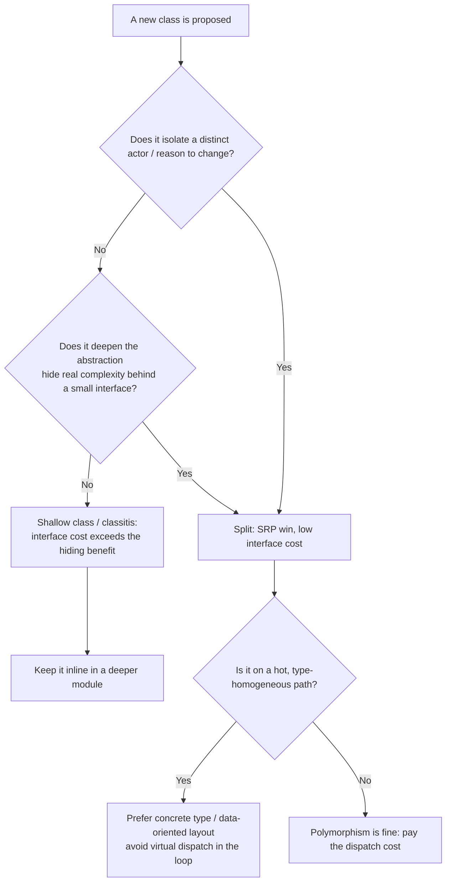

# Classes — Professional Level

> Focus: the deep end and the live debates. SRP's ambiguity and Martin's "reason to change / actor" reformulation; the SOLID-critique literature (Dan North's CUPID, Casey Muratori on virtual dispatch, Ousterhout's deep-vs-shallow argument against many small classes); composition vs. inheritance at the type-theory level (LSP, variance, the fragile base class problem); object orientation vs. data-oriented design and the *measured* cost of vtable dispatch and pointer-chasing object graphs; when a class is the wrong tool at all.

---

## Table of Contents

1. [SRP is underspecified — and Martin knows it](#srp-is-underspecified--and-martin-knows-it)
2. [The SOLID critique: North, Muratori, Ousterhout](#the-solid-critique-north-muratori-ousterhout)
3. [Liskov substitution, formally](#liskov-substitution-formally)
4. [Variance: the part of LSP everyone forgets](#variance-the-part-of-lsp-everyone-forgets)
5. [The fragile base class problem](#the-fragile-base-class-problem)
6. [Composition over inheritance, mechanically](#composition-over-inheritance-mechanically)
7. [The cost of polymorphism: vtables, megamorphism, cache](#the-cost-of-polymorphism-vtables-megamorphism-cache)
8. [Data-oriented design: when objects are the wrong shape](#data-oriented-design-when-objects-are-the-wrong-shape)
9. [When a class is the wrong tool](#when-a-class-is-the-wrong-tool)
10. [The theoretical limits of cohesion metrics](#the-theoretical-limits-of-cohesion-metrics)
11. [A performance case study: small classes that hurt](#a-performance-case-study-small-classes-that-hurt)
12. [Common Mistakes](#common-mistakes)
13. [Test Yourself](#test-yourself)
14. [Cheat Sheet](#cheat-sheet)
15. [Summary](#summary)
16. [Further Reading](#further-reading)
17. [Related Topics](#related-topics)

---

## SRP is underspecified — and Martin knows it

The Single Responsibility Principle is the most cited and least precise of the SOLID set. The original 2003 wording — *"a class should have only one reason to change"* — collapses the moment you ask *what counts as a reason*. Every class has many reasons to change at some granularity: a bug, a renamed field, a new requirement. The word "responsibility" is doing undefined work.

Robert C. Martin restated it himself in *Clean Architecture* (2017) precisely because the original was misread:

> "A module should be responsible to one, and only one, **actor**."

The reformulation moves the axis from *what the code does* to *who requests changes to it*. The canonical example is an `Employee` class with three methods:

```java
class Employee {
    BigDecimal calculatePay() { ... }   // requested by the CFO / accounting
    void save() { ... }                 // requested by the DBAs / architects
    String reportHours() { ... }        // requested by HR / operations
}
```

Three different actors can demand changes to one class. `calculatePay` and `reportHours` might share a private `regularHours()` helper; a change requested by accounting silently breaks the HR report. The fix is to split along the **social** seam — who pays for the change — not along a technical seam. This is why Martin's preferred cure is the *Facade* or *Single-Responsibility decomposition* into `PayCalculator`, `HourReporter`, `EmployeeRepository`, often coordinated by an `EmployeeData` value carrier.

The point for a senior+ engineer: SRP is a *coupling-management heuristic about organizational change*, not a counting rule about methods. "One responsibility" never meant "one method" or "one verb." Teams that read it that way produce the explosion of two-method classes that Ousterhout later attacked (below). The right question is always: *if requirement X changes, how many classes do I touch, and does a change for actor A risk breaking actor B?*

---

## The SOLID critique: North, Muratori, Ousterhout

SOLID is a default, not a law. Three serious critiques are worth internalizing because they correct real over-application.

### Dan North — "SOLID is not solid" / CUPID

Dan North (who coined BDD) argued in his talk and essay *"CUPID — for joyful coding"* (2021) that SOLID is a 1990s-OOP artifact that doesn't transfer cleanly to modern, polyglot, functional-leaning codebases. His specific objections:

- **SRP** is unfalsifiable ("define responsibility").
- **OCP** ("open for extension, closed for modification") encourages speculative abstraction; in practice you *can* modify code and re-test it — version control and CI make "closed for modification" a weaker virtue than it was in shipped-binary days.
- **DIP** plus heavy interface-everything leads to the "interface per class" pattern that adds indirection without polymorphism.

His replacement, **CUPID**, is a set of *properties* rather than rules: **C**omposable, **U**nix-philosophy, **P**redictable, **I**diomatic, **D**omain-based. The deep insight is that *properties* describe a center of gravity you move toward, while *principles* invite binary compliance arguments.

### Casey Muratori — "Clean Code, Horrible Performance"

Muratori's 2023 critique is narrower and empirical. He took the standard clean-code shape — a `Shape` base class with virtual `Area()` overridden by `Circle`, `Rectangle`, `Triangle` — and benchmarked it against a data-oriented version using a tag (`enum`) plus a flat switch and a coefficient table. The polymorphic version was roughly **1.5×–15× slower** depending on the operation, because:

1. Every `shape->Area()` call is an **indirect call through a vtable pointer** — unpredictable for the branch predictor when types are mixed.
2. Objects are heap-allocated and accessed via pointers, so iterating a `Shape*[]` is **pointer-chasing**, defeating the prefetcher.
3. The compiler cannot inline a virtual call it cannot devirtualize.

His conclusion is deliberately provocative — "the rules of clean code are, almost without exception, the exact opposite of the rules we'd use to write high-performance software" — but the *defensible* version is: **runtime polymorphism is a cost, and in hot, type-homogeneous loops that cost dominates.** The rebuttals (from the clean-code camp) are equally valid: the benchmark measures a code shape, not a real system; most code is not in a hot loop; and a switch over a closed enum is *also* a maintainability cost (every new shape edits every switch — exactly what OCP warns about). Both sides are right about different code.

### John Ousterhout — deep vs. shallow modules

In *A Philosophy of Software Design* (2018, 2nd ed. 2021), Ousterhout attacks a corollary that the clean-code community over-derived from "classes should be small." His central abstraction is **module depth**:

> *depth = functionality provided / interface complexity.*

A **deep** module hides a lot of implementation behind a simple interface (e.g., a Unix file as `open/read/write/close`). A **shallow** module exposes nearly as much interface as it implements — a pass-through, a thin wrapper, a class with one method that just forwards. Ousterhout's claim, directly contradicting "many small classes":

> "Classes should be deep... The mantra 'classes should be small' is, in my opinion, taking things too far. Splitting up a class introduces the cost of *interface* and *information leakage* between the pieces."

The cost of a small class is not free: each split adds a public boundary, and boundaries leak (callers must understand both halves, must keep them in sync). He calls the result of over-splitting **"classitis"** — many shallow classes whose aggregate interface is *larger* than one deep class would have been. This is the strongest theoretical counterweight to naive SRP, and a senior engineer should hold both ideas in tension: split for *actors and change*, not for *line count*.



---

## Liskov substitution, formally

The Liskov Substitution Principle is the one SOLID letter with a rigorous origin. Barbara Liskov and Jeannette Wing's 1994 paper *"A Behavioral Notion of Subtyping"* gives the formal statement:

> Let *φ(x)* be a property provable about objects *x* of type *T*. Then *φ(y)* should be true for objects *y* of type *S* where *S* is a subtype of *T*.

In other words, substitutability is about *behavior*, not just type-checking. The compiler enforces *syntactic* conformance (signatures match); LSP demands *semantic* conformance. The behavioral contract decomposes into four obligations a subtype must honor:

1. **Preconditions cannot be strengthened** in a subtype. If the base accepts any positive integer, the subtype may not demand "even positive integer."
2. **Postconditions cannot be weakened.** If the base guarantees a sorted result, the subtype must too.
3. **Invariants of the supertype must be preserved.**
4. **History constraint** (the part most engineers have never heard of): a subtype may not allow state transitions that the supertype forbids. A mutable `Stack` subtype of an immutable `Point`-style type violates history even if every method signature matches.

The textbook violation is `Rectangle`/`Square`. `Square extends Rectangle` seems natural until `setWidth(5)` on a `Square` must also change height to stay square, breaking the postcondition a client expects from `Rectangle` (*"setting width leaves height unchanged"*). The signatures are fine; the *behavior* is not substitutable. The lesson: **inheritance encodes a behavioral promise the type system does not check.** LSP is the manual proof obligation you take on when you write `extends`.

---

## Variance: the part of LSP everyone forgets

LSP plus method signatures forces specific **variance** rules, and getting them wrong is a silent substitutability bug. For a subtype's overridden method to be safe:

- **Parameter types** may be *contravariant* — equal or *more general* than the base (you may accept *more*).
- **Return types** may be *covariant* — equal or *more specific* than the base (you may promise *more*).

Most languages only allow covariant return types and **invariant** parameters (Java since 5, C#, Kotlin), trading some theoretical flexibility for simpler type rules. The interesting failures are in *containers*:

```java
// Java arrays are COVARIANT — and this is a known design mistake.
Object[] arr = new String[3];   // compiles
arr[0] = Integer.valueOf(1);    // compiles, throws ArrayStoreException at RUNTIME
```

Java arrays let a `String[]` masquerade as an `Object[]`, deferring a type error to runtime — a direct LSP violation baked into the language for historical reasons (pre-generics). Generics fixed it by making `List<T>` **invariant**: `List<String>` is *not* a `List<Object>`. Use-site variance (`? extends T`, `? super T` — PECS: *Producer Extends, Consumer Super*) recovers safe flexibility.

In Kotlin and C#, variance is declaration-site: `interface Producer<out T>` (covariant, T only in output positions) and `interface Consumer<in T>` (contravariant, T only in input positions). Go has no generics variance to speak of (its generics are invariant and it lacks declaration-site variance); Python's `typing` exposes `TypeVar('T', covariant=True)` checked only by type checkers, not the runtime.

The professional takeaway: when you design a generic class or an inheritance hierarchy, *variance is a substitutability decision*, and the language's default (usually invariance) is the safe one. Reach for `out`/`in`/wildcards only when you can prove the producer/consumer position holds.

---

## The fragile base class problem

Implementation inheritance creates a coupling the public type system does not advertise: a subtype depends on *which methods the base calls internally* — its **self-call** structure. Change that, and subtypes break without any signature changing. This is the **fragile base class problem**, and it is the core mechanical reason behind "favor composition."

The canonical example (from Joshua Bloch, *Effective Java*, Item 18 "Favor composition over inheritance"):

```java
// A HashSet subclass that counts insertions.
class CountingHashSet<E> extends HashSet<E> {
    private int count = 0;
    @Override public boolean add(E e) { count++; return super.add(e); }
    @Override public boolean addAll(Collection<? extends E> c) {
        count += c.size();
        return super.addAll(c);   // BUG
    }
}
// new CountingHashSet<>().addAll(List.of("a","b","c")) reports count = 6, not 3.
```

The defect: `HashSet.addAll` is *implemented in terms of* `add`. So `super.addAll` calls the *overridden* `add`, double-counting. Nothing in `HashSet`'s public API documents this self-call dependency — and a future JDK release could change it, silently fixing or breaking the subclass. The subtype is coupled to an *implementation detail of a superclass it does not own*.

Bloch's fix is the **wrapper / decorator** via composition:

```java
class CountingSet<E> implements Set<E> {
    private final Set<E> s;            // forward, don't inherit
    private int count = 0;
    CountingSet(Set<E> s) { this.s = s; }
    @Override public boolean add(E e) { count++; return s.add(e); }
    @Override public boolean addAll(Collection<? extends E> c) {
        count += c.size();
        return s.addAll(c);            // calls the inner set's addAll, not ours
    }
    // ...forward the remaining Set methods...
}
```

Now there is no self-call leakage: `s.addAll` is a different object's method and cannot dispatch back into `CountingSet.add`. The cost is boilerplate forwarding (mitigated by Kotlin's `by` delegation, Go's struct embedding with explicit method shadowing, or Lombok's `@Delegate`). The principle generalizes: **inherit only when there is a genuine `is-a` substitutability relationship and the base was designed and documented for extension** (`protected` extension hooks, "self-use" documented, à la `@implSpec`). Otherwise compose.

---

## Composition over inheritance, mechanically

The slogan hides four distinct failure modes that inheritance causes and composition avoids:

| Failure mode | Why inheritance triggers it | How composition avoids it |
|---|---|---|
| Fragile base class | Subtype couples to superclass self-calls | Forwarding to a *different* object breaks the self-call chain |
| Rigid taxonomy | Single inheritance forces one classification axis | Multiple has-a relationships = multiple orthogonal axes |
| Exposed internals | `protected` members leak implementation to subtypes | Composition keeps the inner object fully private |
| Yo-yo problem | Reading behavior requires jumping up/down a deep hierarchy | Behavior is local to the delegating object |

Languages encode the preference differently:

```go
// Go: no inheritance at all. Embedding is composition with method promotion.
type Logger struct{ prefix string }
func (l Logger) Log(msg string) { fmt.Println(l.prefix, msg) }

type Server struct {
    Logger          // embedded: Server gets Log() promoted, but is NOT a Logger subtype
    addr string
}
// s.Log("up") works; but there is no virtual dispatch, no base-class fragility,
// and you can override by defining Server.Log explicitly (static, not dynamic).
```

Go's design is a deliberate statement: it has *interfaces for polymorphism* (structural, satisfied implicitly) and *embedding for reuse*, but **never** implementation inheritance. This separates the two jobs that `extends` conflates — substitutability and code reuse — which is precisely the distinction the anti-pattern "inheriting for code reuse rather than for substitutability" warns against.

```python
# Python: mixins are reuse-by-inheritance and bring MRO (Method Resolution Order)
# complexity. The "diamond" is real here because Python has multiple inheritance.
class JsonMixin:
    def to_json(self): return json.dumps(self.__dict__)

class TimestampMixin:
    def touch(self): self.updated_at = time.time()

class User(JsonMixin, TimestampMixin):   # C3 linearization defines lookup order
    ...
# Prefer this only when the mixin is stateless behavior. Stateful mixins +
# diamonds reintroduce the fragile-base coupling Go eliminated by fiat.
```

---

## The cost of polymorphism: vtables, megamorphism, cache

Runtime polymorphism is not free, and a professional should know the actual mechanism, not just "it's a bit slower."

### The vtable

A C++/Java virtual call compiles to roughly:

```
mov  rax, [obj]        ; load object pointer
mov  rax, [rax]        ; load vtable pointer (first word of object)
call [rax + offset]    ; indirect call through vtable slot
```

Two extra dependent loads plus an **indirect call**. The indirect call is the expensive part: the CPU's branch-target predictor must guess the destination. When it guesses wrong, you eat a pipeline flush (~15–20 cycles on modern x86).

### Monomorphic vs. polymorphic vs. megamorphic

JITs (HotSpot, V8) optimize call sites by *observed type history*:

- **Monomorphic** — one concrete type ever seen. The JIT can **devirtualize** and even **inline** the target. Cost approaches a direct call (often zero after inlining).
- **Bimorphic / polymorphic** — 2–4 types. The JIT emits an **inline cache**: a guarded sequence of `if type==A … else if type==B …`. Cheap but not free.
- **Megamorphic** — 5+ types (HotSpot's threshold). The inline cache gives up and falls back to a full vtable lookup. No inlining, poor branch prediction.

This is why Muratori's mixed `Shape*[]` is slow: a loop calling `Area()` over a heterogeneous array is megamorphic, so the JIT/AOT compiler can neither devirtualize nor inline, *and* the branch predictor thrashes.

### Cache effects of object graphs

The subtler cost is **memory layout**. An array of polymorphic objects is an array of *pointers*:

```
[ptr0][ptr1][ptr2]...   ->  each ptr points to a heap object, scattered.
```

Iterating dereferences each pointer, so the access pattern is effectively random — the hardware prefetcher cannot help, and each object may sit on a different cache line (or page). A data-oriented layout stores the *fields contiguously* (struct-of-arrays or a flat array-of-structs), so iteration is linear and the prefetcher streams data in. On memory-bound loops this is the difference between ~4 ns/element (L1) and ~100+ ns/element (main memory) — a 20×+ gap that has nothing to do with the arithmetic.

| Call-site shape | Dispatch cost | Inlinable? | Branch prediction |
|---|---|---|---|
| Static / final method | direct call | yes | perfect |
| Monomorphic virtual | ~direct after devirt | yes | perfect |
| Polymorphic (2–4) | inline-cache guards | partially | good |
| Megamorphic (5+) | full vtable lookup | no | poor |

---

## Data-oriented design: when objects are the wrong shape

Data-oriented design (DOD), articulated by Mike Acton (*"Data-Oriented Design and C++"*, CppCon 2014) and Richard Fabian (*Data-Oriented Design*, 2018), starts from a different premise than OOP: **the purpose of a program is to transform data, so design around the data's access patterns and the hardware, not around mental models of "things."**

The flagship transformation is **Array of Structs → Struct of Arrays (AoS → SoA)**:

```go
// AoS — object-oriented, intuitive. Iterating to sum balances loads every field.
type Account struct {
    ID       uint64    // 8
    Name     string    // 16
    Currency [3]byte   // 3 (+ padding)
    Balance  float64   // 8
    // ... 200 more bytes of fields a sum loop never touches
}
accounts := []Account{...}
var total float64
for i := range accounts { total += accounts[i].Balance } // loads whole struct/line per element
```

```go
// SoA — DOD. The hot field is contiguous; one cache line holds 8 balances.
type Accounts struct {
    ID       []uint64
    Name     []string
    Balance  []float64   // dense, contiguous, prefetcher-friendly
}
var total float64
for _, b := range a.Balance { total += b }   // streams; ~8× fewer cache misses
```

When a class accretes 200 bytes of fields and a hot loop touches 8 of them, every iteration pulls 3–4 cache lines to use one value. SoA splits the cold fields out, and the hot loop runs at memory bandwidth. Acton's blunt framing — *"if you don't understand the data, you don't understand the problem"* — is the DOD counterpart to SRP.

This does **not** mean abandon classes. It means: in the *small fraction* of code that is hot and data-parallel (rendering, physics, query engines, serialization, numerical kernels), the OOP defaults (encapsulation per entity, polymorphic dispatch) actively fight the hardware. Recognize that fraction and switch tools. The 95% of business code that is I/O-bound or runs once per request should stay readable and object-oriented — there a virtual call buried under a 5 ms database round-trip is *literally unmeasurable*.

---

## When a class is the wrong tool

A class bundles *state + behavior + identity*. If you don't need all three, a lighter tool is clearer:

- **Pure transformation, no state** → a free function (Go), a module-level function (Python), a `static` method on a namespace, or a function value. A `MathUtils` *class* with only static methods is the **utility-class anti-pattern**: it can't be mocked, can't be substituted via an interface, and exists only because the language (old Java) lacked free functions. Go and Python don't need it — write `package math` or a module function.

- **Data with no behavior** → a record/struct/value type, *not* a "data class" with hand-written getters/setters. Java `record`, Kotlin `data class`, Python `@dataclass(frozen=True)`, Go struct. The **data-class anti-pattern** (a class that is only fields + accessors) is usually a sign that behavior leaked out into the code that *manipulates* the data (feature envy); the cure is to move behavior in — *unless* it is a deliberate DTO / value carrier crossing a boundary, in which case behaviorlessness is correct.

- **A family of operations over one closed data shape** → in Go, a `struct` + free functions; in Rust, an `enum` + `match`; in functional languages, a sum type + pattern match. This is the *opposite* polarity from OOP: OOP makes it easy to add a *type* (new subclass, existing methods) and hard to add an *operation*; sum-type/match makes it easy to add an *operation* and hard to add a *type*. This tension is the **expression problem** (Philip Wadler, 1998). Choose the axis along which your code actually grows.

- **A grouping of related functions and shared config** → a *module/package*, not a class with a single instance. A Python module is already a singleton namespace; wrapping it in a class adds `self` noise for nothing.

Go's standard library is the reference for "class is not the default." `http.Server` is a struct with methods; `strings.ToUpper` is a free function; `io.Reader` is a one-method interface for polymorphism *only where substitutability is needed*. There is no `StringUtils`.

---

## The theoretical limits of cohesion metrics

"High cohesion" is the quantitative cousin of SRP, and the metrics that try to measure it are weaker than they look.

**LCOM (Lack of Cohesion of Methods)** — Chidamber & Kemerer's 1994 metrics suite. LCOM4 (the Hitz–Montazeri refinement) models a class as a graph: nodes are methods and fields; edges connect a method to fields it touches and to methods it calls. LCOM4 = number of *connected components*. One component = cohesive; two or more = the class is really N classes glued together, a split candidate.

The theoretical limits — why you cannot manage class design by metric alone:

1. **Trivial decohesion.** A perfectly reasonable class with one constructor that initializes all fields and a `toString` that reads all fields scores as one component regardless of how unrelated the field *groups* are. A shared utility field (a `Logger`, a `Clock`) links otherwise-unrelated methods into one component, hiding a real split. LCOM is *fooled by incidental coupling*.

2. **It measures field-sharing, not semantic responsibility.** Martin's "actor" axis is invisible to LCOM. Two methods can touch entirely disjoint fields (LCOM says "split!") yet serve one actor and one reason to change (so they belong together). Conversely two methods can share a field and serve different actors.

3. **Gameable.** Inlining accessors, merging fields, or adding a method that touches everything all move the number without improving design — Goodhart's law applies: once LCOM is a target it stops being a measure.

4. **No theory of *interface cost*.** This is the deepest gap, and Ousterhout's point: cohesion metrics reward splitting (more, smaller, internally-cohesive classes) and are *blind to the interface and information-leakage cost* that splitting adds. A metric that only ever says "split more" will, taken literally, produce classitis.

Use LCOM, fan-in/fan-out, and cyclomatic complexity as *smoke detectors* — a high LCOM4 is a prompt to *look*, not a command to split. The decision is a judgment about change axes and abstraction depth, which no static metric captures.

---

## A performance case study: small classes that hurt

A real-world shape that combines every theme above. A pricing engine evaluates discount rules over millions of line items per batch. The "clean" object-oriented design:

```java
interface DiscountRule { Money apply(LineItem item, Money running); }

final class PercentOff implements DiscountRule { ... }
final class BuyXGetY  implements DiscountRule { ... }
final class FlatOff   implements DiscountRule { ... }
// ...12 rule classes total, composed per item:
for (LineItem item : items)            // millions
    for (DiscountRule rule : item.rules())   // a List<DiscountRule>
        running = rule.apply(item, running);
```

What the hardware sees:

1. `item.rules()` is a `List<DiscountRule>` — an array of *pointers* to scattered heap objects (pointer-chasing).
2. The inner `rule.apply(...)` call site is **megamorphic** (12 types) → no devirtualization, no inlining, vtable lookup every call, mispredicted indirect branches.
3. `LineItem` is a 30-field god-ish object; `apply` reads 3 fields but the loop pulls the whole object's cache lines.

Measured (representative, HotSpot 21, 5M items × ~4 rules each): ~210 ms, dominated by `apply` dispatch and cache misses visible in `perf stat` as a high `LLC-load-misses` and `branch-misses` count.

The data-oriented rewrite:

```java
// Rules encoded as a flat, columnar plan. No per-item object graph, no virtual call.
final class RulePlan {
    byte[]   kind;       // tag per rule (closed enum), contiguous
    double[] param;      // SoA: the one numeric param each rule needs
}
double price(double base, RulePlan p, int start, int end) {
    double running = base;
    for (int i = start; i < end; i++) {
        switch (p.kind[i]) {           // dense switch -> jump table, well predicted
            case PERCENT -> running -= running * p.param[i];
            case FLAT    -> running -= p.param[i];
            // ...
        }
    }
    return running;
}
```

Result: ~25 ms — roughly an **8× speedup**. The wins, attributable individually:

- No vtable dispatch; a `switch` over a small dense `enum` compiles to a jump table the predictor handles well.
- Columnar `kind`/`param` arrays stream through cache; the prefetcher works.
- The JIT can inline the per-case bodies because they are concrete.

The honest accounting — *what you traded away*:

- **OCP is gone.** Adding a 13th rule edits the `switch` (and the encoder), exactly the modification OCP wanted to avoid. In the polymorphic version you added a class and touched nothing.
- **Cohesion dropped.** Rule logic is now smeared across an encoder, a tag enum, and a switch instead of living in one self-describing class.
- **It is harder to read and to unit-test in isolation.**

So the rule is *not* "DOD beats clean code." It is: **this loop runs 20M times per batch and is the measured bottleneck, so here the dispatch and layout cost outweighs the maintainability cost — and nowhere else in the system.** The other 99% of the codebase keeps the 12 polymorphic rule classes, because there the dispatch is free relative to the work and the readability is worth everything. Knowing *which* code is the 1% is the entire skill — and you learn it from a profiler, never from a principle.

---

## Common Mistakes

- **Reading SRP as "one method per class."** SRP is about *actors / reasons to change*, not method count. Counting produces classitis. (See Martin's own reformulation and Ousterhout's "deep classes.")
- **Inheriting to reuse code.** `extends` is a *substitutability* promise (LSP) that happens to also share code. If you don't have an honest `is-a` and a base *designed for extension*, you've created fragile-base coupling. Compose instead.
- **Assuming the compiler enforces LSP.** It checks signatures, not behavior. Strengthened preconditions, weakened postconditions, and history-constraint violations all compile fine and break clients at runtime.
- **Ignoring variance.** Treating `List<String>` as a `List<Object>` (or relying on Java's covariant arrays) defers a type error to runtime. Variance is a substitutability decision; default to invariance.
- **Believing "polymorphism is free."** It is free in the JIT-devirtualizable monomorphic case and unmeasurable behind I/O — but megamorphic dispatch over a scattered object graph in a hot loop is a real, large, *measurable* cost.
- **Applying data-oriented design everywhere.** DOD's wins are real only in hot, data-parallel loops. Rewriting request-scoped business logic into SoA switches sacrifices maintainability for a speedup the profiler can't even see.
- **Treating LCOM (or any metric) as a verdict.** Cohesion metrics are smoke detectors with no model of interface cost. They can only ever say "split more," which is wrong as often as it's right.
- **Writing utility classes in languages with free functions.** A `static`-only class in Go or Python is ceremony around a function; in modern Java prefer a `final` class with a private constructor *only* when you truly have no better module unit.

---

## Test Yourself

1. **Martin reformulated SRP from "one reason to change" to a different axis. What is it, and why was the change necessary?**

<details><summary>Answer</summary>

The reformulation is *"responsible to one, and only one, actor"* (a source of change requests — CFO, DBA, HR). The original was necessary to fix because "responsibility" / "reason to change" is unfalsifiable at the method granularity — every class has many reasons to change. The actor framing reanchors the principle on *organizational* change seams: split so that a change demanded by actor A cannot break code relied on by actor B (the `Employee.calculatePay`/`reportHours` shared-helper trap). It is a coupling heuristic about who pays for change, not a method-counting rule.

</details>

2. **`Square extends Rectangle` compiles and every method signature matches. State the precise LSP obligation it violates.**

<details><summary>Answer</summary>

It **weakens a postcondition / breaks an invariant** the supertype promised. A `Rectangle` client may assume the postcondition *"after `setWidth(w)`, `getHeight()` is unchanged."* `Square.setWidth` must also mutate height to preserve squareness, violating that postcondition. The type system only checks signatures (syntactic subtyping); LSP is the behavioral (semantic) contract — preconditions can't be strengthened, postconditions can't be weakened, invariants and history constraints must hold — and it is the *manual proof obligation* you accept when you write `extends`.

</details>

3. **Explain mechanically why Bloch's `CountingHashSet.addAll` double-counts, and why the composition version doesn't.**

<details><summary>Answer</summary>

`HashSet.addAll` is *implemented in terms of* `add` (a self-call). When the subclass overrides both, `super.addAll(c)` dispatches back into the *overridden* `add`, so each element is counted once in `addAll` (by `c.size()`) and again in `add`. The subtype is coupled to an undocumented self-call detail of the superclass — the fragile base class problem. The composition/forwarding version holds a *separate* inner `Set` and calls `inner.addAll(c)`; that method dispatches into the inner object's own `add`, never back into the wrapper, so there is no self-call leakage.

</details>

4. **A hot loop calls a virtual method over a `List` holding 8 different concrete subtypes. Name the JIT term for this call site and the three concrete costs.**

<details><summary>Answer</summary>

It is a **megamorphic** call site (>4 observed types, HotSpot threshold). Costs: (1) the JIT cannot **devirtualize**, so it falls back to a full **vtable lookup** (two dependent loads + indirect call) every call; (2) it cannot **inline** the target, blocking downstream optimization; (3) the indirect branch is poorly predicted → pipeline flushes (~15–20 cycles each). Separately, a `List` of objects is an array of pointers, so iteration is **pointer-chasing** that defeats the prefetcher — a cache cost layered on top of the dispatch cost.

</details>

5. **When is converting an Array-of-Structs to Struct-of-Arrays the right call, and what do you give up?**

<details><summary>Answer</summary>

Right when a *hot, data-parallel loop* touches a few fields of large objects: SoA makes the hot field contiguous so the prefetcher streams it and you run near memory bandwidth (often multi-× speedup; cache misses drop sharply). You give up: locality of *all* fields of one entity (random-access of a single entity now hits multiple arrays), readability/encapsulation, and the natural OOP "entity" abstraction. So restrict it to the profiled bottleneck; leave the rest AoS/object-oriented. It is a hardware-driven optimization, not a default design.

</details>

6. **Ousterhout argues against "classes should be small." Summarize his counter-model and the failure mode of ignoring it.**

<details><summary>Answer</summary>

His model is **module depth = functionality / interface complexity**. *Deep* modules hide much behind a small interface (good); *shallow* modules expose nearly as much interface as they implement (a thin wrapper, a one-forward method). Each class split adds a public boundary, and boundaries leak — callers must understand both halves and keep them in sync. Splitting purely for line count produces **"classitis"**: many shallow classes whose *aggregate* interface is larger and harder to use than one deep class. The takeaway: split for actor/change/abstraction-depth reasons, never for size.

</details>

7. **Why does Go forbid implementation inheritance entirely, and what does it provide instead?**

<details><summary>Answer</summary>

Go deliberately separates the two jobs `extends` conflates: *substitutability* (provided by **interfaces** — structural, satisfied implicitly, used only where polymorphism is needed) and *code reuse* (provided by **struct embedding** with method promotion, which is composition, not subtyping). Embedding has no virtual dispatch up a hierarchy and no fragile-base self-call coupling; you "override" by shadowing statically. This directly avoids the "inherit for reuse" and deep-hierarchy anti-patterns by making them inexpressible.

</details>

8. **A reviewer demands you split a class because its LCOM4 is 2. When should you push back?**

<details><summary>Answer</summary>

Push back when the two components are *semantically* one responsibility / one actor even though they touch disjoint fields — LCOM measures field-sharing, not Martin's change axis, and is fooled by incidental coupling (a shared `Logger` field can fuse unrelated methods into one component, or its absence can split a coherent class). Also push back if the "split" would create two shallow classes whose combined interface exceeds the current one (Ousterhout). LCOM is a smoke detector: it justifies *looking*, not the split itself. The split decision rests on change axes and abstraction depth, which the metric cannot see. Conversely, if the two components genuinely serve different actors, LCOM4=2 is a *correct* prompt and you should split.

</details>

---

## Cheat Sheet

| Concept | One-line professional take |
|---|---|
| SRP | "Responsible to one **actor**" (Martin's restatement); a coupling-by-change heuristic, not a method count. |
| OCP | Useful default; over-applied it breeds speculative abstraction. Modifying + re-testing is cheap now (North). |
| LSP | A **behavioral** contract (Liskov–Wing): preconditions ↓-only, postconditions ↑-only, invariants + history preserved. Compiler checks signatures, *not* this. |
| Variance | Params contravariant, returns covariant; most languages enforce invariant params. Default to **invariant** generics; use `out`/`in`/PECS deliberately. |
| Fragile base class | Subtype couples to superclass *self-calls*; change them and subtypes silently break. Compose/forward to escape it. |
| Composition | Separates reuse from substitutability. Go embedding, Kotlin `by`, decorator. Inherit only for true `is-a` + base designed for extension. |
| Polymorphism cost | Free when monomorphic/devirtualized or behind I/O; **megamorphic** dispatch (>4 types) + scattered object graph in a hot loop is a real, measured cost. |
| DOD / AoS→SoA | Layout for the hardware in hot data-parallel loops; trades OCP + cohesion + readability for cache/dispatch wins. Use only on profiled bottlenecks. |
| Deep vs shallow | Maximize functionality/interface ratio (Ousterhout). Beware "classitis" from splitting by line count. |
| Cohesion metrics | LCOM/fan-in/out = smoke detectors with no model of interface cost; they only ever say "split more." |
| When NOT a class | No state → free function/module; data only → record/struct; ops over closed data → enum+match (expression problem). No `*Utils` classes in Go/Python. |

---

## Summary

At this level the "rules" become *forces in tension*, and your job is to balance them with evidence. SRP is real but underspecified — Martin's "actor" reframing is the usable version; counting methods produces the classitis Ousterhout warns against. SOLID is a strong default, not scripture: North's CUPID reframes principles as properties, and Muratori's benchmarks show that the clean-code shape (polymorphism, small objects, pointer graphs) is the *wrong* shape in hot, data-parallel loops where vtable dispatch and cache misses dominate. Inheritance is a behavioral contract (LSP, with its precondition/postcondition/variance/history obligations the compiler never checks) and a coupling hazard (fragile base class), which is why composition is the default and Go forbids implementation inheritance outright. Data-oriented design and "when a class is the wrong tool" both point the same way: a class bundles state+behavior+identity, and when you don't need all three — or when the hardware punishes the object graph — a lighter or flatter tool wins. Metrics like LCOM are smoke detectors blind to interface cost. The throughline: **principles tell you where to look; a profiler and an honest model of who-changes-what tell you what to do.**

---

## Further Reading

- Robert C. Martin — *Clean Architecture* (2017), Part III: the "actor" reformulation of SRP and the rest of SOLID.
- Barbara Liskov & Jeannette Wing — *"A Behavioral Notion of Subtyping"* (ACM TOPLAS, 1994): the formal LSP.
- Joshua Bloch — *Effective Java* (3rd ed.), Item 18 "Favor composition over inheritance" (the `CountingHashSet` example) and Item 19 "Design and document for inheritance or else prohibit it."
- John Ousterhout — *A Philosophy of Software Design* (2nd ed., 2021): deep vs. shallow modules, "classitis."
- Dan North — *"CUPID — for joyful coding"* (2021) and the talk "SOLID is not solid."
- Casey Muratori — *"Clean Code, Horrible Performance"* (2023) and the surrounding debate (incl. the clean-code rebuttals).
- Mike Acton — *"Data-Oriented Design and C++"* (CppCon 2014); Richard Fabian — *Data-Oriented Design* (2018).
- Philip Wadler — *"The Expression Problem"* (1998, the original Java-genericity mailing-list note).
- Chidamber & Kemerer — *"A Metrics Suite for Object Oriented Design"* (1994); Hitz & Montazeri on LCOM4.
- Ulrich Drepper — *"What Every Programmer Should Know About Memory"* (2007): cache lines, prefetching, the cost of pointer-chasing.

---

## Related Topics

- [senior.md](senior.md) — applied class design: cohesion, the anti-patterns, refactoring toward small focused classes.
- [interview.md](interview.md) — SOLID, composition vs. inheritance, and LSP as interview questions.
- [Chapter README](../README.md) — the positive rules of class design.
- [Abstraction and Information Hiding](../22-abstraction-and-information-hiding/README.md) — Ousterhout's deep-module idea applied to interface design.
- [Emergence](../10-emergence/README.md) — how SRP and cohesion fall out of the four rules of simple design.
- [Design Patterns](../../design-patterns/README.md) — Decorator, Strategy, and the patterns that operationalize "compose, don't inherit."
- [Functional Programming](../../functional-programming/README.md) — free functions, sum types + pattern matching, and the expression problem's other axis.
