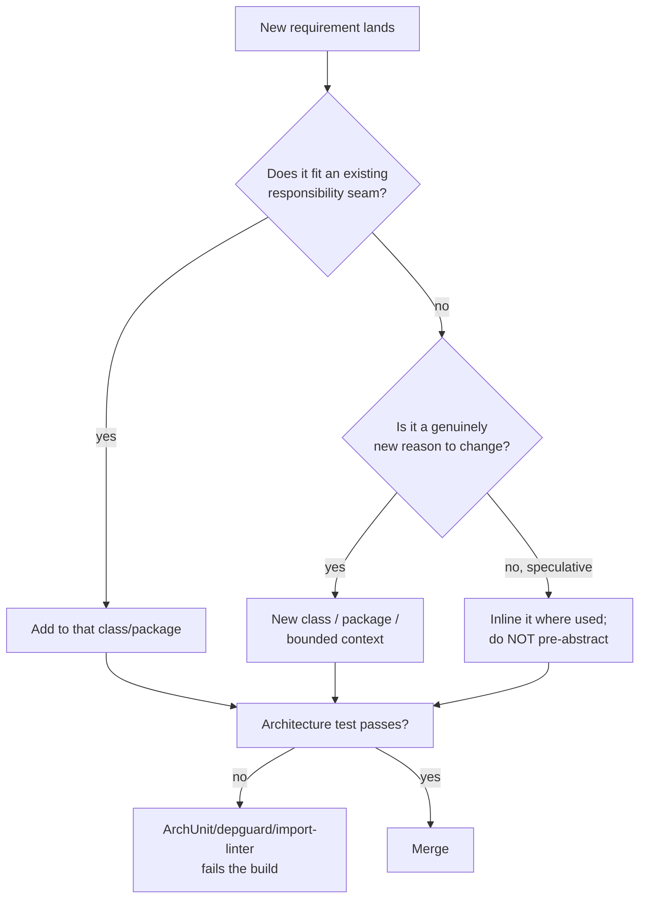
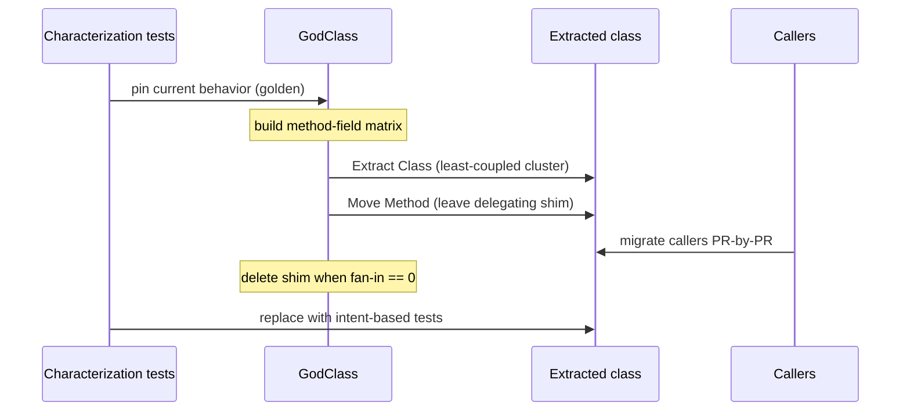
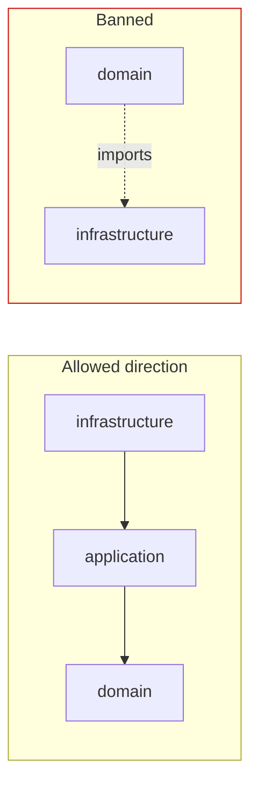

# Classes — Senior Level

> Focus: designing class and type structure across a whole codebase — enforcing SRP at module granularity, organizing for change without speculative generality, killing god classes with metrics and behind-tests refactors, controlling dependency direction with automated guards, and wiring it all together with DI. Real config, three languages: Go, Java, Python.

---

## Table of Contents

1. [The senior shift: from "a class" to "the class graph"](#the-senior-shift-from-a-class-to-the-class-graph)
2. [SRP at module and service granularity](#srp-at-module-and-service-granularity)
3. [Organizing classes for change: OCP and DIP as seams, not ceremony](#organizing-classes-for-change-ocp-and-dip-as-seams-not-ceremony)
4. [Detecting god classes with metrics](#detecting-god-classes-with-metrics)
5. [Refactoring a god class safely behind tests](#refactoring-a-god-class-safely-behind-tests)
6. [Inheritance depth: banning deep hierarchies in review](#inheritance-depth-banning-deep-hierarchies-in-review)
7. [Package organization and dependency direction](#package-organization-and-dependency-direction)
8. [Enforcing structure in CI: ArchUnit, depguard, import-linter](#enforcing-structure-in-ci-archunit-depguard-import-linter)
9. [DI containers and wiring across the three ecosystems](#di-containers-and-wiring-across-the-three-ecosystems)
10. [When "small classes" fights navigability](#when-small-classes-fights-navigability)
11. [Common Mistakes](#common-mistakes)
12. [Test Yourself](#test-yourself)
13. [Cheat Sheet](#cheat-sheet)
14. [Summary](#summary)
15. [Further Reading](#further-reading)
16. [Related Topics](#related-topics)

---

## The senior shift: from "a class" to "the class graph"

At the junior and middle level, "Classes" is about one class: keep it small, give it one reason to change, expose behavior not data. At the senior level the unit of concern is the **graph** — how dozens or hundreds of types reference each other, which way the arrows point, where the seams are, and how you stop the graph from rotting under a team of ten people pushing thirty PRs a week.

Three questions define the senior job:

1. **Where do responsibilities belong?** (SRP, but at package/service scale)
2. **Which way do dependencies point?** (DIP, enforced — not aspirational)
3. **How do you change that structure without a two-week freeze?** (refactor behind tests, strangler fig, automated guards)

The clean-code rules don't change. What changes is that you now own the *tooling and process* that keeps them true across people who haven't read the same book you have.



---

## SRP at module and service granularity

"One reason to change" is the most misquoted rule in software. At scale, the operative word is *who*. A responsibility is a set of changes requested by **one actor** (one role, one stakeholder, one external contract). A class — or a package, or a service — should answer to **one** of them.

Concretely, ask: *when this changes, who asked for it?*

| Symptom in the graph | Likely SRP violation | Seam to introduce |
|---|---|---|
| One package recompiles on almost every PR | God package; multiple actors share it | Split by actor/subdomain |
| `OrderService` changes for tax law, shipping rules, *and* email copy | Three actors, one class | `PricingPolicy`, `Shipping`, `Notifier` |
| A `utils`/`common`/`shared` package depended on by everything | No responsibility at all — a junk drawer | Push each util to its owning module |
| Test setup for one class mocks 12 collaborators | Class coordinates too many actors | Extract a coordinating boundary; thin the rest |

SRP at module scale is what makes a monolith *modular* rather than a big ball of mud. The test is mechanical: if you can't name the single actor a module serves in one phrase, it has more than one.

```go
// BAD: one package answers to three actors.
package order

func (s *Service) Place(o Order) error {
    total := s.computeTax(o)                   // tax authority changes this
    if err := s.reserveStock(o); err != nil {  // warehouse ops change this
        return err
    }
    s.sendConfirmationEmail(o, total)          // marketing changes this
    return nil
}
```

```go
// GOOD: each actor owns a collaborator; order/ orchestrates, owns none of their reasons to change.
package order

type Service struct {
    pricing  Pricing      // owned by finance
    stock    StockKeeper  // owned by warehouse ops
    notifier Notifier     // owned by marketing
}

func (s *Service) Place(o Order) error {
    total, err := s.pricing.Price(o)
    if err != nil {
        return err
    }
    if err := s.stock.Reserve(o); err != nil {
        return err
    }
    return s.notifier.Confirm(o, total)
}
```

The orchestrator stays — coordination *is* a responsibility. What leaves are the three independent reasons to change.

---

## Organizing classes for change: OCP and DIP as seams, not ceremony

The Open/Closed Principle is not "add an interface to everything." It is: **identify the axis of variation that actually varies, and make that axis pluggable.** Everything else stays concrete. Premature OCP — an interface with exactly one implementation that will never gain a second — is speculative generality, and it costs navigability for no payoff.

The senior discipline is knowing *when* a seam earns its keep:

- **Earns a seam:** payment providers, tax jurisdictions, storage backends, anything with a known second implementation on the roadmap or a known need to mock at a process boundary.
- **Does not earn a seam:** `IOrderServiceImpl` patterns where the interface mirrors one class 1:1 forever. That's DIP cargo-culting; it adds indirection a reader must traverse with zero substitutability gained.

DIP — depend on abstractions owned by the *consumer*, not the producer — is what lets the dependency arrows point inward toward the domain. The interface lives with the code that *needs* the capability, not with the code that *provides* it.

```python
# domain owns the port it needs; infrastructure implements it.
# pricing/ports.py  (domain layer — knows nothing about HTTP or DBs)
from typing import Protocol

class ExchangeRates(Protocol):
    def rate(self, base: str, quote: str) -> float: ...

# pricing/service.py
class Pricing:
    def __init__(self, rates: ExchangeRates) -> None:
        self._rates = rates  # depends on the Protocol, not on requests/redis

    def convert(self, amount: float, base: str, quote: str) -> float:
        return amount * self._rates.rate(base, quote)

# infrastructure/ecb_rates.py  (outer layer — depends inward)
class EcbRates:  # structurally satisfies ExchangeRates, no import of it required
    def rate(self, base: str, quote: str) -> float:
        ...  # HTTP call
```

In Python a `Protocol` lets the infrastructure adapter satisfy the port *structurally* with no import edge from infra back to domain — the cleanest possible DIP. In Java you'd declare the interface in the domain package and have infrastructure `implements` it (a compile-time edge inward, which is correct). In Go, interfaces are satisfied implicitly, so define the interface in the *consumer* package and the dependency arrow points the right way for free.

---

## Detecting god classes with metrics

You cannot ban god classes in review by gut feel across a large codebase — you need metrics that flag them before they're 5,000 lines. The four that matter:

| Metric | What it measures | God-class signal | Tool |
|---|---|---|---|
| **WMC** (Weighted Methods per Class) | sum of method complexities | high → too much behavior | SonarQube, ck, PMD |
| **LCOM4** (Lack of Cohesion of Methods) | disjoint method/field clusters | > 1 → class is really N classes | ck (Java), SonarQube |
| **Fan-in** | how many types depend on this | very high → load-bearing god | structure101, ArchUnit, `go list` |
| **Fan-out** (efferent coupling) | how many types this depends on | very high → does everything | structure101, depgraph tools |

**LCOM is the sharpest god-class detector.** LCOM4 partitions methods into connected components where two methods are connected if they touch a common field or call each other. If the count is `> 1`, the class is literally `N` unrelated classes sharing a `.java`/`.py` file — extract along the partition.

```bash
# Java: ck computes LCOM, WMC, fan-in/out per class to CSV.
java -jar ck.jar /path/to/src true 0 false metrics/
#  then sort by lcom desc, wmc desc to get a hit list.

# Go: there are no classes, but the same smell appears as a god *package*.
# fan-out per package (how many internal packages it imports):
go list -deps -f '{{.ImportPath}} {{len .Imports}}' ./... | sort -k2 -nr | head

# SonarQube quality profile flags it directly:
#   S1448      "Too many methods"          (class WMC proxy)
#   S1820      "Too many fields"
#   java:S3776 cognitive complexity per method
```

The single most valuable composite is **change-frequency × size × fan-in**: a large, highly-depended-on class that changes every week is the highest-ROI refactor target. A 4,000-line class untouched for three years is not worth your sprint.

```bash
# "Hotspot" hit list: files changed most often, with line counts.
git log --since="6 months ago" --name-only --pretty=format: \
  | grep -E '\.(go|java|py)$' | sort | uniq -c | sort -nr | head -20
```

---

## Refactoring a god class safely behind tests

The non-negotiable order: **tests first, then structure.** You cannot safely move methods out of a 3,000-line class with 20% coverage. The sequence:

1. **Pin behavior with characterization tests.** If the class has no tests, record real inputs/outputs (golden files, VCR-style capture) and assert the *current* behavior — not the desired behavior. These pass by construction and become your safety net.
2. **Build the method-field usage matrix** (rows = methods, columns = fields; mark touches). Block-diagonal clusters are the extraction boundaries — this is LCOM made visual.
3. **Extract Class one cluster at a time.** Move the most cohesive, *least-coupled* cluster first. Extracting the most-entangled cluster first creates a chatty mess worse than the god class.
4. **Move Method** into the new class; leave a thin delegating method behind so callers don't break yet.
5. **Migrate callers** to the new class incrementally (a single PR per caller group).
6. **Delete the delegating shim** once no caller uses it.
7. **Replace characterization tests** with intent-based unit tests on the now-small classes.



For changes too tangled to attack head-on, use the **Mikado method**: attempt the move, record everything that breaks, revert, fix the prerequisites bottom-up, re-attempt. The output is a dependency tree of small safe steps. For graph-wide moves, use **branch by abstraction** (interface + two implementations behind a flag) so you keep a kill-switch during rollout. See [refactoring techniques](../../refactoring/README.md) for the full catalog of Extract Class / Move Method mechanics.

---

## Inheritance depth: banning deep hierarchies in review

Deep inheritance is a senior-level red flag because it couples subclasses to the *internal* shape of every ancestor (fragile base class) and because most deep hierarchies were built for **code reuse**, not **substitutability** — the cardinal inheritance mistake.

The rule to enforce in review: **inheritance models "is-a substitutable-for"; if you only want to reuse code, use composition.** A `Stack` is not an `ArrayList` even though it could reuse its storage — extending `ArrayList` leaks `add(index, e)` and `remove(0)`, violating the Liskov Substitution Principle. Embed an `ArrayList` instead.

Practical ceilings:

- **Depth ≤ 2–3** for your own concrete types. Framework base classes (e.g., a Spring `JpaRepository` chain) don't count against you — you don't own or modify them.
- **Prefer interfaces + composition** over concrete inheritance. Interface inheritance is cheap (no implementation coupling); implementation inheritance is expensive.
- **`final`/sealed by default.** A class not designed for extension should forbid it. Java `final`/`sealed`, Kotlin closed-by-default, and Go's "no inheritance at all" all encode this.

You can enforce depth automatically:

```java
// ArchUnit: no concrete domain class may be more than 2 levels deep.
@ArchTest
static final ArchRule no_deep_hierarchies =
    classes().that().resideInAPackage("..domain..")
             .should(new ArchCondition<JavaClass>("have inheritance depth <= 2") {
                 @Override public void check(JavaClass c, ConditionEvents events) {
                     int depth = 0;
                     for (var s = c.getRawSuperclass(); s.isPresent()
                              && !s.get().getName().equals("java.lang.Object");
                          s = s.get().getRawSuperclass()) depth++;
                     if (depth > 2)
                         events.add(SimpleConditionEvent.violated(c,
                             c.getName() + " inheritance depth " + depth));
                 }
             });
```

```toml
# Python: ruff/pylint cap inheritance and ancestor count.
# pyproject.toml
[tool.ruff.lint]
select = ["PLR0901"]          # too-many-ancestors
[tool.ruff.lint.pylint]
max-parents = 3
```

Go sidesteps this entirely: there is no implementation inheritance. Struct embedding is composition with syntactic forwarding — it does not create an "is-a" relationship and does not enable polymorphism on its own. This is a feature, not a limitation. (See [composition over inheritance in design principles](../../design-principles/README.md).)

---

## Package organization and dependency direction

The class graph's health is mostly determined by **which way the import arrows point.** Two organizing schemes, and a hard rule about cycles.

**Package by feature, not by layer.** `package-by-layer` (`controllers/`, `services/`, `repositories/`) creates wide, shallow packages where every feature is smeared across every layer and a change touches four packages. `package-by-feature` (`orders/`, `billing/`, `inventory/`) creates tall, cohesive packages with most edges *inside* the package and few crossing it. Cohesion goes up; coupling goes down; deletes are local.

**Dependency arrows point inward, toward the domain.** This is the Dependency Rule of hexagonal/clean architecture: `infrastructure → application → domain`, never the reverse. The domain knows nothing about HTTP, SQL, or Kafka.

**No cycles, ever.** A package cycle means the two packages are really one — you can't compile, test, or reason about either alone. Go *forbids* import cycles at compile time (a genuine architectural gift). Java and Python permit them, so you must forbid them in CI.



---

## Enforcing structure in CI: ArchUnit, depguard, import-linter

Architecture that isn't enforced *is* a suggestion, and suggestions decay. Wire the dependency rules into the build so a violating PR goes red. One tool per ecosystem:

**Java — ArchUnit** (runs as a plain JUnit test):

```java
@AnalyzeClasses(packages = "com.acme.shop")
class ArchitectureTest {

    @ArchTest
    static final ArchRule layered =
        layeredArchitecture().consideringAllDependencies()
            .layer("Domain").definedBy("..domain..")
            .layer("Application").definedBy("..application..")
            .layer("Infrastructure").definedBy("..infrastructure..")
            .whereLayer("Infrastructure").mayNotBeAccessedByAnyLayer()
            .whereLayer("Domain").mayOnlyBeAccessedByLayers("Application", "Infrastructure");

    @ArchTest
    static final ArchRule no_cycles =
        slices().matching("com.acme.shop.(*)..").should().beFreeOfCycles();
}
```

**Go — depguard** (via `golangci-lint`):

```yaml
# .golangci.yml — domain may not import infrastructure.
linters:
  enable: [depguard]
linters-settings:
  depguard:
    rules:
      domain:
        files: ["**/internal/domain/**"]
        deny:
          - pkg: "github.com/acme/shop/internal/infra"
            desc: "domain must not depend on infrastructure (DIP)"
```

Go's compiler already rejects import cycles, so depguard only has to police *direction*. Pair it with `go-arch-lint` for richer layer rules.

**Python — import-linter** (config-driven, runs in CI):

```ini
# .importlinter
[importlinter]
root_package = shop

[importlinter:contract:layers]
name = Clean architecture layers
type = layers
layers =
    shop.infrastructure
    shop.application
    shop.domain
# higher layers may import lower; never the reverse.

[importlinter:contract:no-cycles]
name = No package cycles
type = independence
modules =
    shop.orders
    shop.billing
    shop.inventory
```

```bash
lint-imports   # exits non-zero on violation; wire into CI
```

For legacy codebases drowning in violations, adopt a **baseline**: snapshot current violations, fail only on *new* ones. The backlog shrinks as files are touched, and you never block urgent fixes.

---

## DI containers and wiring across the three ecosystems

DIP gives you injected interfaces; *something* has to construct the object graph and hand each class its collaborators. The senior decision is **how much container magic to accept.**

The spectrum: **manual wiring** (a plain constructor-call composition root) → **compile-time DI** (codegen, no runtime reflection) → **runtime container** (reflection, autowiring). More magic buys less boilerplate at the cost of "where is this bean coming from?" debuggability and slower startup.

```go
// Go — google/wire: compile-time DI, zero runtime reflection.
//go:build wireinject

package main

import "github.com/google/wire"

func InitOrderService() *order.Service {
    wire.Build(
        order.NewService,
        pricing.NewService, wire.Bind(new(order.Pricing), new(*pricing.Service)),
        infra.NewPostgresStock, wire.Bind(new(order.StockKeeper), new(*infra.PgStock)),
        infra.NewSESNotifier, wire.Bind(new(order.Notifier), new(*infra.SES)),
    )
    return nil // wire generates the real body in wire_gen.go
}
```

```java
// Java — Spring: runtime container, constructor injection (the only correct style).
@Service
class OrderService {
    private final Pricing pricing;
    private final StockKeeper stock;
    private final Notifier notifier;

    OrderService(Pricing pricing, StockKeeper stock, Notifier notifier) {
        this.pricing = pricing;   // constructor injection => final fields,
        this.stock = stock;       // no reflection into private fields,
        this.notifier = notifier; // trivially unit-testable with plain `new`.
    }
}
// Guice/Dagger equivalent: @Inject on the constructor; Dagger generates wiring at compile time.
```

```python
# Python — FastAPI Depends: explicit, function-scoped DI; no global container.
from fastapi import Depends, FastAPI

def get_rates() -> ExchangeRates:
    return EcbRates()

def get_pricing(rates: ExchangeRates = Depends(get_rates)) -> Pricing:
    return Pricing(rates)

app = FastAPI()

@app.post("/quote")
def quote(req: QuoteReq, pricing: Pricing = Depends(get_pricing)):
    return {"total": pricing.convert(req.amount, req.base, req.quote)}
```

Senior rules of thumb, regardless of tool:

- **Constructor injection only.** Field/setter injection hides dependencies, defeats `final`, and lets objects exist half-constructed. If a constructor has too many parameters, that's a god class shouting — fix the design, don't reach for field injection.
- **One composition root.** All wiring happens in exactly one place (`main`, the Spring config, the FastAPI app factory). Domain classes never touch the container; they receive collaborators and stay framework-agnostic.
- **Prefer compile-time DI for large Go/Java systems** — `wire` and Dagger turn "missing binding" into a compile error instead of a 3am startup `NoSuchBeanDefinitionException`.

See [dependency injection and the creational patterns](../../design-patterns/README.md) for the factory/builder mechanics that feed the composition root.

---

## When "small classes" fights navigability

Clean Code's "classes should be small" is real, but pushed to a dogma it produces a different pathology: **explosion of trivial classes**, where one logical operation is shattered across fifteen one-method classes, and a reader must open all fifteen to understand the flow. This is the inverse smell — and it is genuinely worse for a *team*, because navigability is a team cost paid on every onboarding and every incident.

The senior judgment call: a class should be **as small as its single responsibility allows, and no smaller.** Some guidance:

- **Cohesion beats line count.** A 300-line class whose methods all touch the same fields (LCOM = 1) is *better* than three 100-line classes that constantly call each other. Splitting cohesive code is fake cleanliness.
- **A seam must buy substitutability or testability** to justify the indirection. If extracting a class adds an interface no one will ever swap and no test needs to mock, you've traded navigability for nothing.
- **Watch for "feature envy in reverse"** — if class B's only job is to be called by A and it touches A's data, it probably belongs *in* A.
- **John Ousterhout's counterpoint matters here:** deep modules (simple interface, substantial implementation) beat shallow ones (thin interface over almost nothing). A pile of tiny classes is a pile of shallow modules — high interface-to-implementation ratio, high cognitive overhead. (See deep modules and complexity and [abstraction and information hiding](../22-abstraction-and-information-hiding/README.md).)

The tie-breaker question in review: *"Does this split reduce the number of things a reader must hold in their head, or increase it?"* If a future maintainer must open more files to understand one flow, the split lost.

---

## Common Mistakes

- **Treating SRP as "one method per class."** SRP is one *actor*, one reason to change. A cohesive class with twelve methods serving one actor is correct; a two-method class split off for purity is not.
- **DIP cargo-culting** — an interface per concrete class, 1:1, forever. Indirection without substitutability. Add the interface when the second implementation (or the test mock at a process boundary) actually arrives.
- **Speculative OCP.** Building plugin points for variation that never varies. You pay navigability now for flexibility you never use. Make the *actually-varying* axis pluggable; leave the rest concrete.
- **Refactoring the god class before pinning it with tests.** You will silently change behavior. Characterization tests first, always.
- **Extracting the most-coupled cluster first.** Produces a chatty tangle worse than the original. Extract the least-coupled, most-cohesive cluster first.
- **Inheriting for code reuse.** The `Stack extends ArrayList` mistake. Inheritance is for substitutability; reuse is for composition.
- **`utils`/`common`/`shared` god packages.** A package with no responsibility that everything depends on. It defeats every dependency rule. Push each helper to its owning module.
- **Field/setter injection.** Hides dependencies, breaks `final`, allows half-built objects. Constructor injection only.
- **No architecture tests.** Unenforced architecture decays to a big ball of mud within a year of team turnover. If it isn't in CI, it isn't true.
- **Over-splitting into trivial classes.** Optimizing the wrong metric (file size) at the expense of the real one (cognitive load per flow).

---

## Test Yourself

1. **A `PaymentService` changes whenever finance updates fee rules, whenever a new gateway is added, and whenever the receipt email wording changes. How many classes should it be, and why?**

<details><summary>Answer</summary>

At least three, because there are three actors: finance (fee rules → `FeePolicy`), integrations (gateways → `PaymentGateway` interface with per-provider implementations), marketing (receipt copy → `Notifier`/template). SRP's unit is the *actor*, not the noun "payment." `PaymentService` itself may survive as a thin orchestrator that owns none of those three reasons to change. The tell is "changes *whenever* X, Y, *or* Z" — three independent change triggers is three responsibilities.

</details>

2. **You inherit a 4,000-line `BookingManager` with 8% test coverage and you must add a feature inside it next sprint. What's your first move — and what's the move you must *not* make?**

<details><summary>Answer</summary>

First move: write **characterization tests** that pin current behavior on the code paths you'll touch (golden files / recorded I/O), asserting what *is* true today, not what *should* be. Then build a method-field usage matrix, extract the least-coupled cohesive cluster behind a delegating shim, and add your feature to the now-isolated piece. The move you must **not** make: start extracting classes or moving methods *before* the safety net exists — you'll change behavior silently. Also don't propose a rewrite; the hard-won domain knowledge lives in those 4,000 lines.

</details>

3. **A teammate's PR adds `interface Repository` with exactly one implementation `JpaRepositoryImpl`, and there's no second implementation on the roadmap. Is this good DIP? When would it be?**

<details><summary>Answer</summary>

Not as justified. A 1:1 interface-to-implementation pair with no substitutability and no test need is DIP cargo-culting — pure indirection a reader must traverse for nothing. It becomes worthwhile the moment one of these is true: (a) a second backend is genuinely planned (in-memory, another DB), (b) the domain layer must not depend on the persistence framework (the interface lives in the domain, the impl in infrastructure — this is real DIP and the import-edge direction is the payoff), or (c) tests at the boundary need to mock it. Absent all three, prefer the concrete class and add the seam when a reason arrives.

</details>

4. **Your team uses package-by-layer (`controllers/`, `services/`, `repositories/`). Why might package-by-feature be better, and what does it do to coupling?**

<details><summary>Answer</summary>

Package-by-layer makes packages wide and shallow: every feature is smeared across all three packages, so one feature change touches three packages and a delete is non-local. It also leaks — every service can see every other service because they all live in `services/`, so there's no encapsulation boundary. Package-by-feature (`orders/`, `billing/`) puts most edges *inside* a package; cross-package edges become few and explicit, cohesion rises, coupling drops, and you can make a feature's internals package-private. The trade-off is shared cross-cutting code needs a deliberate home (a `shared` package risks becoming a junk drawer), so keep it minimal.

</details>

5. **An architecture test caught that `domain` now imports `infrastructure`. A developer says "it's just one import, the test is too strict." How do you respond?**

<details><summary>Answer</summary>

The test is not too strict — it caught a dependency-rule inversion that, left in, will metastasize: once one domain class imports infrastructure, the next dev sees precedent and adds another, and within a quarter the domain can't be tested or reused without the DB/HTTP stack. The fix is mechanical and cheap *now*: define the needed capability as an interface (port) in the domain, have infrastructure implement it, and inject it. The whole point of the CI guard is to make this conversation happen at the 5-line stage instead of the 500-line stage. "Just one import" is exactly how a big ball of mud starts.

</details>

6. **When is implementation inheritance the right tool, and how deep is too deep?**

<details><summary>Answer</summary>

Implementation inheritance is right only when the subclass is genuinely substitutable for the base everywhere the base is used (Liskov) *and* you want to share implementation, not just type. That's rare; most "reuse" cases are better served by composition (embed/delegate) or by interface inheritance (type without implementation coupling). Too deep is generally more than 2–3 levels of your own concrete types, because each level couples you to the internal shape of every ancestor (fragile base class). Framework base classes you don't own don't count toward the limit. Default your classes to `final`/sealed so extension is a deliberate, designed-for act rather than an accident.

</details>

---

## Cheat Sheet

| Concern | Senior move | Tool / mechanism |
|---|---|---|
| SRP at scale | One *actor* per class/package; name it in one phrase | code review; recompile-frequency analysis |
| OCP | Make only the *actually-varying* axis pluggable | strategy/plugin interface at the seam |
| DIP | Interface owned by consumer; arrows point inward | Protocol (Py), implicit iface (Go), domain-declared iface (Java) |
| God-class detection | LCOM4 > 1, high WMC, high fan-in | ck, SonarQube (S1448/S1820/S3776), `go list` |
| Highest-ROI target | change-frequency × size × fan-in | `git log` hotspot + `wc -l` |
| Safe refactor | Characterization tests → method-field matrix → Extract Class (least-coupled first) → migrate → delete shim | Mikado, branch by abstraction |
| Inheritance | Depth ≤ 2–3; `final`/sealed by default; compose to reuse | ArchUnit depth rule, ruff PLR0901 |
| Packaging | By feature, not layer; arrows inward; zero cycles | hexagonal/clean architecture |
| Enforce in CI | Fail the build on violations; baseline legacy | ArchUnit, depguard, import-linter |
| Wiring | Constructor injection only; one composition root | wire (Go), Spring/Dagger (Java), FastAPI Depends (Py) |
| Anti-dogma | As small as SRP allows, *no smaller*; cohesion > line count | deep-module test; "more files to read?" |

---

## Summary

Senior-level "Classes" is about the *graph*, not the class. SRP scales up to "one actor per module"; OCP and DIP are seams you add where variation actually lives, not ceremony you sprinkle everywhere. God classes are found with metrics — LCOM4, WMC, fan-in, and the change-frequency-times-size hotspot — and dismantled behind characterization tests, one least-coupled cluster at a time, never before the safety net exists. Inheritance is reserved for substitutability and kept 2–3 levels shallow; reuse goes through composition. The dependency arrows point inward toward the domain, packages are organized by feature, cycles are banned, and all of it is enforced in CI by ArchUnit, depguard, or import-linter — because unenforced architecture decays. Finally, the small-classes rule has a ceiling: split for cohesion and substitutability, not for a smaller line count, because over-splitting trades the metric you can see (file size) for the one you can't (cognitive load per flow).

---

## Further Reading

- Robert C. Martin — *Clean Code*, Chapter 10 ("Classes") and *Clean Architecture* (the Dependency Rule).
- Martin Fowler — *Refactoring* (2nd ed.): Extract Class, Move Method, and the strangler fig.
- John Ousterhout — *A Philosophy of Software Design*: deep vs. shallow modules; the cost of classitis.
- Eric Evans — *Domain-Driven Design*: bounded contexts, the module-scale analog of a class.
- ArchUnit, depguard (golangci-lint), and import-linter documentation for the enforcement configs above.
- ck (Java metrics) and SonarQube quality-profile docs for LCOM/WMC/cognitive-complexity thresholds.

---

## Related Topics

- [Classes — Junior](junior.md)
- [Classes — Middle](middle.md)
- [Classes — Professional](professional.md)
- [Classes — chapter overview](../README.md)
- [Modules and Packages](../19-modules-and-packages/README.md)
- [Abstraction and Information Hiding](../22-abstraction-and-information-hiding/README.md)
- Deep Modules and Complexity
- [Design Patterns](../../design-patterns/README.md)
- [Anti-Patterns](../../anti-patterns/README.md)
