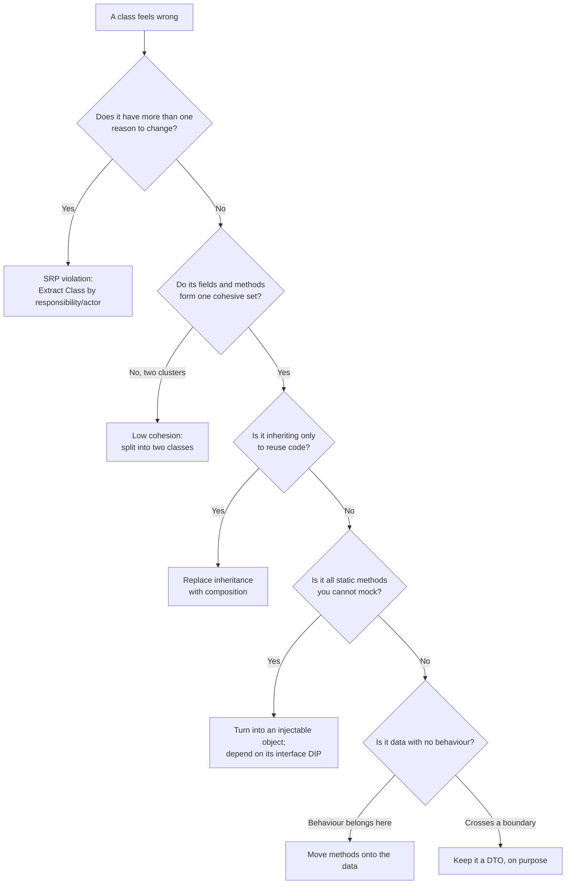
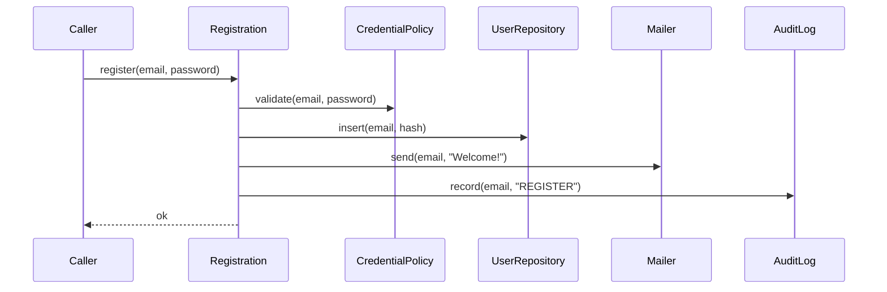

# Classes — Practice Tasks

> 12 hands-on exercises on class design: splitting god classes, raising cohesion, choosing composition over inheritance, flattening hierarchies, making static utilities testable, applying the Dependency Inversion Principle, and deciding when a data class should grow behaviour versus stay a deliberate DTO. Languages vary (Go / Java / Python). Every task carries a difficulty rating and a full, runnable solution with reasoning. Work top to bottom — they progress easy → hard.

---

## Table of Contents

1. [Task 1 — Extract Class from a god `Order` (Python, Easy)](#task-1--extract-class-from-a-god-order-python-easy)
2. [Task 2 — Raise cohesion: split fields that never travel together (Java, Easy)](#task-2--raise-cohesion-split-fields-that-never-travel-together-java-easy)
3. [Task 3 — Data class → proper object: move behaviour to the data (Python, Easy)](#task-3--data-class--proper-object-move-behaviour-to-the-data-python-easy)
4. [Task 4 — Replace inheritance-for-reuse with composition (Java, Medium)](#task-4--replace-inheritance-for-reuse-with-composition-java-medium)
5. [Task 5 — Make a static utility injectable and testable (Go, Medium)](#task-5--make-a-static-utility-injectable-and-testable-go-medium)
6. [Task 6 — Apply DIP: depend on an injected interface (Go, Medium)](#task-6--apply-dip-depend-on-an-injected-interface-go-medium)
7. [Task 7 — Fix an SRP violation: two actors in one class (Python, Medium)](#task-7--fix-an-srp-violation-two-actors-in-one-class-python-medium)
8. [Task 8 — Flatten a deep inheritance hierarchy (Java, Hard)](#task-8--flatten-a-deep-inheritance-hierarchy-java-hard)
9. [Task 9 — Keep it a DTO, deliberately (Go, Medium)](#task-9--keep-it-a-dto-deliberately-go-medium)
10. [Task 10 — Static class → strategy object you can swap (Java, Hard)](#task-10--static-class--strategy-object-you-can-swap-java-hard)
11. [Task 11 — Split a god service by responsibility AND by actor (Python, Hard)](#task-11--split-a-god-service-by-responsibility-and-by-actor-python-hard)
12. [Task 12 — Full class-design audit (Java — open-ended, Hard)](#task-12--full-class-design-audit-java--open-ended-hard)

---

## How to Use

- **Read the scenario first**, then write your own answer before opening the solution. The friction of a blank editor is where the learning happens.
- **Behaviour must not change.** Every refactor here is structural. If you had tests, they would stay green; treat "the public output is identical" as the acceptance criterion.
- **Compile / run mentally (or for real).** The solutions are written to be runnable, not pseudo-code. If you can, drop them into a scratch project.
- **Difficulty is cumulative.** Early tasks isolate one idea (one extraction, one inversion). Later tasks stack smells the way real code does, and ask you to sequence the fixes.
- **There is not always one right answer.** Task 3 and Task 9 are intentionally mirror images: sometimes you give a data class behaviour, sometimes you decide it is correctly a DTO and leave it alone. Knowing *which* is the skill.

The decision spine that runs through every task:



---

## Task 1 — Extract Class from a god `Order` (Python, Easy)

**Scenario:** An `Order` class started as a tidy shopping cart. Over two years it absorbed payment and shipping. Now a change to refund logic risks breaking address formatting, and nobody can test totals without instantiating a payment gateway.

**Smelly code:**

```python
class Order:
    def __init__(self, customer_id, items):
        self.customer_id = customer_id
        self.items = items
        self.status = "PENDING"
        # payment stuff
        self.payment_method = None
        self.payment_token = None
        self.payment_status = "UNPAID"
        self.refund_amount = 0
        # shipping stuff
        self.shipping_address = None
        self.carrier = None
        self.tracking_number = None
        self.delivered = False

    def add_item(self, item): self.items.append(item)
    def total(self): return sum(i.price * i.qty for i in self.items)

    def charge(self, gateway):
        self.payment_token = gateway.charge(self.total(), self.payment_method)
        self.payment_status = "PAID"
    def refund(self, amount, gateway):
        gateway.refund(self.payment_token, amount)
        self.refund_amount += amount
    def is_paid(self): return self.payment_status == "PAID"

    def ship(self, carrier, tracking):
        self.carrier = carrier
        self.tracking_number = tracking
    def mark_delivered(self): self.delivered = True
    def is_shipped(self): return self.tracking_number is not None
```

**Instruction:** Apply **Extract Class** twice. `Order` should *coordinate* a `Payment` and a `Shipment`, not own every field of both. Keep the public methods working (delegate if you must).

<details><summary>Solution</summary>

```python
from dataclasses import dataclass, field
from decimal import Decimal
from typing import Optional, List


@dataclass
class Payment:
    method: Optional[str] = None
    token: Optional[str] = None
    status: str = "UNPAID"
    refund_amount: Decimal = Decimal(0)

    def charge(self, amount: Decimal, gateway) -> None:
        self.token = gateway.charge(amount, self.method)
        self.status = "PAID"

    def refund(self, amount: Decimal, gateway) -> None:
        gateway.refund(self.token, amount)
        self.refund_amount += amount

    def is_paid(self) -> bool:
        return self.status == "PAID"


@dataclass
class Shipment:
    address: Optional[str] = None
    carrier: Optional[str] = None
    tracking_number: Optional[str] = None
    delivered: bool = False

    def ship(self, carrier: str, tracking: str) -> None:
        self.carrier = carrier
        self.tracking_number = tracking

    def mark_delivered(self) -> None:
        self.delivered = True

    def is_shipped(self) -> bool:
        return self.tracking_number is not None


@dataclass
class Order:
    customer_id: str
    items: List["LineItem"] = field(default_factory=list)
    status: str = "PENDING"
    payment: Payment = field(default_factory=Payment)
    shipment: Shipment = field(default_factory=Shipment)

    def add_item(self, item) -> None:
        self.items.append(item)

    def total(self) -> Decimal:
        return sum((i.price * i.qty for i in self.items), Decimal(0))

    # Order coordinates; it does not reimplement payment.
    def charge(self, gateway) -> None:
        self.payment.charge(self.total(), gateway)
```

**Reasoning:** The original class had three reasons to change — cart math, payment rules, shipping rules — so it violated SRP and had three independent field clusters (low cohesion). After extraction you can unit-test `Order.total()` without a gateway, test `Payment` with a fake gateway, and a refund bug can no longer reach `tracking_number`. `Order` keeps only the coordination it genuinely owns. Note `charge` delegates rather than duplicating logic — that is the difference between *moving* a responsibility and *copying* it.

</details>

---

## Task 2 — Raise cohesion: split fields that never travel together (Java, Easy)

**Scenario:** A `Report` class holds both *what the report contains* (rows, columns, title) and *how it gets rendered to a file* (output stream, page size, font). The two halves never use each other's fields. Cohesion is the measure of how much a class's members belong together; here it is low.

**Smelly code:**

```java
class Report {
    private String title;
    private List<String> columns;
    private List<List<String>> rows;

    private OutputStream out;
    private PageSize pageSize;
    private String fontFamily;
    private int fontSize;

    public void addRow(List<String> row) { rows.add(row); }
    public int rowCount() { return rows.size(); }

    public void render() {
        // uses out, pageSize, fontFamily, fontSize — never title/columns/rows directly,
        // it asks for them via getters
    }
    public void setFont(String family, int size) { this.fontFamily = family; this.fontSize = size; }
}
```

**Instruction:** Separate the **content** (the model) from the **rendering** (the formatter). The renderer should take the content as input. Identify the two cohesive clusters first, then split.

<details><summary>Solution</summary>

```java
// Cohesive cluster 1: the data of a report. No I/O, no formatting.
final class Report {
    private final String title;
    private final List<String> columns;
    private final List<List<String>> rows = new ArrayList<>();

    Report(String title, List<String> columns) {
        this.title = title;
        this.columns = List.copyOf(columns);
    }

    public void addRow(List<String> row) { rows.add(List.copyOf(row)); }
    public int rowCount() { return rows.size(); }
    public String title() { return title; }
    public List<String> columns() { return columns; }
    public List<List<String>> rows() { return List.copyOf(rows); }
}

// Cohesive cluster 2: how a report becomes bytes. Holds all the rendering knobs.
final class ReportRenderer {
    private final PageSize pageSize;
    private final String fontFamily;
    private final int fontSize;

    ReportRenderer(PageSize pageSize, String fontFamily, int fontSize) {
        this.pageSize = pageSize;
        this.fontFamily = fontFamily;
        this.fontSize = fontSize;
    }

    public void render(Report report, OutputStream out) {
        // uses pageSize, fontFamily, fontSize + the report passed in
    }
}
```

**Reasoning:** The two field groups had **zero overlap** — `render()` only ever touched the formatting fields, and `addRow`/`rowCount` only the content fields. That is the textbook signature of a class doing two jobs. After the split, `Report` is a pure, easily-tested data model, and you can render the same report to PDF, CSV, or HTML by writing sibling renderers without ever touching `Report`. Passing `out` to `render` rather than storing it also means a renderer instance is reusable and stateless across calls.

</details>

---

## Task 3 — Data class → proper object: move behaviour to the data (Python, Easy)

**Scenario:** `Money` is an anaemic data class: it holds an amount and currency but exposes nothing else, so every caller reaches in and does arithmetic by hand. This is the "Tell, Don't Ask" smell — and it leaks bugs (mixing currencies, floating-point money).

**Smelly code:**

```python
class Money:
    def __init__(self, amount, currency):
        self.amount = amount        # float
        self.currency = currency    # "USD"

# Callers, everywhere:
def total(prices):
    t = 0.0
    for p in prices:
        t += p.amount               # currency silently ignored!
    return t

def apply_discount(money, pct):
    return Money(money.amount * (1 - pct), money.currency)
```

**Instruction:** Convert `Money` into a proper object that owns its behaviour: addition (rejecting mismatched currencies) and discount. Make it immutable and store cents as an integer to kill float error.

<details><summary>Solution</summary>

```python
from __future__ import annotations
from dataclasses import dataclass


@dataclass(frozen=True)
class Money:
    cents: int          # store minor units; never float for money
    currency: str

    def __post_init__(self) -> None:
        if self.cents < 0:
            raise ValueError("Money cannot be negative")

    @classmethod
    def of(cls, major: int, minor: int, currency: str) -> "Money":
        return cls(major * 100 + minor, currency)

    def add(self, other: "Money") -> "Money":
        self._same_currency(other)
        return Money(self.cents + other.cents, self.currency)

    def discounted(self, pct: float) -> "Money":
        if not 0 <= pct <= 1:
            raise ValueError("pct must be in [0, 1]")
        return Money(round(self.cents * (1 - pct)), self.currency)

    def _same_currency(self, other: "Money") -> None:
        if self.currency != other.currency:
            raise ValueError(f"Cannot combine {self.currency} and {other.currency}")


def total(prices: list[Money]) -> Money:
    if not prices:
        raise ValueError("cannot total an empty list")
    acc = prices[0]
    for p in prices[1:]:
        acc = acc.add(p)            # currency mismatch now raises, not hides
    return acc
```

**Reasoning:** The behaviour (`add`, `discounted`) belonged *with* the data it operates on, so we moved it there — the essence of turning a data class into an object. Immutability (`frozen=True`) means a `Money` can be shared freely without defensive copying. Integer cents eliminate the classic `0.1 + 0.2 != 0.3` money bug. The currency guard turns a silent correctness failure into a loud exception at the exact line that caused it. Contrast this with Task 9, where the right call is the opposite — there, leave the data class alone.

</details>

---

## Task 4 — Replace inheritance-for-reuse with composition (Java, Medium)

**Scenario:** Someone needed a stack and "reused" `ArrayList` by subclassing it. Now a stack exposes `add(index, x)`, `remove(0)`, `set(...)` — every list operation — and a caller can corrupt the stack's invariant through the inherited API. This is inheritance used purely for code reuse, not for "is-a substitutability".

**Smelly code:**

```java
// A Stack IS-NOT-A general-purpose list. This leaks 30 methods that break LIFO.
class Stack<T> extends ArrayList<T> {
    public void push(T item) { add(item); }
    public T pop() { return remove(size() - 1); }
    public T peek() { return get(size() - 1); }
}

// Caller can do this and silently violate the stack contract:
// stack.add(0, x);  stack.remove(2);  stack.set(1, y);
```

**Instruction:** Replace the `extends` with **composition** (a private `ArrayList` field). Expose only the stack operations. This is "Replace Inheritance with Delegation".

<details><summary>Solution</summary>

```java
import java.util.ArrayList;
import java.util.List;
import java.util.NoSuchElementException;

// A Stack HAS-A list. The list is an implementation detail, fully hidden.
final class Stack<T> {
    private final List<T> elements = new ArrayList<>();

    public void push(T item) {
        elements.add(item);
    }

    public T pop() {
        if (elements.isEmpty()) {
            throw new NoSuchElementException("pop from empty stack");
        }
        return elements.remove(elements.size() - 1);
    }

    public T peek() {
        if (elements.isEmpty()) {
            throw new NoSuchElementException("peek into empty stack");
        }
        return elements.get(elements.size() - 1);
    }

    public boolean isEmpty() {
        return elements.isEmpty();
    }

    public int size() {
        return elements.size();
    }
}
```

**Reasoning:** Inheritance is for *substitutability* (Liskov): a subtype must be usable anywhere the supertype is. A `Stack` is **not** a usable `ArrayList` — random-access mutation breaks LIFO — so the original was inheritance abused for reuse. Composition gives you the reuse (you still lean on `ArrayList` internally) while keeping the surface area tiny and the invariant enforceable. The rule of thumb: prefer composition; reach for inheritance only when the subtype genuinely passes the "can stand in for the parent in every context" test.

</details>

---

## Task 5 — Make a static utility injectable and testable (Go, Medium)

**Scenario:** `PriceCalculator` calls a package-level `CurrentTime()` and a static tax lookup. Tests are flaky because the result depends on the wall clock, and you cannot simulate "December 31st" or "tax holiday" without changing the system clock.

**Smelly code:**

```go
package pricing

import "time"

// Static, global, untestable.
func taxRate(state string) float64 {
    // hard-coded table; can't be substituted in a test
    if state == "CA" {
        return 0.0875
    }
    return 0.07
}

func FinalPrice(state string, subtotal float64) float64 {
    rate := taxRate(state)
    price := subtotal * (1 + rate)
    // a "happy hour" 10% off between 17:00 and 19:00 — depends on the real clock!
    h := time.Now().Hour()
    if h >= 17 && h < 19 {
        price *= 0.9
    }
    return price
}
```

**Instruction:** Turn the calculator into an object whose collaborators (a clock and a tax source) are **injected** via interfaces. Provide a real implementation and show how a test fakes both.

<details><summary>Solution</summary>

```go
package pricing

import "time"

// Collaborators are now interfaces — substitutable in tests.
type Clock interface {
    Now() time.Time
}

type TaxSource interface {
    RateFor(state string) float64
}

type Calculator struct {
    clock Clock
    tax   TaxSource
}

func NewCalculator(clock Clock, tax TaxSource) *Calculator {
    return &Calculator{clock: clock, tax: tax}
}

func (c *Calculator) FinalPrice(state string, subtotal float64) float64 {
    price := subtotal * (1 + c.tax.RateFor(state))
    h := c.clock.Now().Hour()
    if h >= 17 && h < 19 {
        price *= 0.9
    }
    return price
}

// --- Production implementations ---

type SystemClock struct{}

func (SystemClock) Now() time.Time { return time.Now() }

type TableTax struct{}

func (TableTax) RateFor(state string) float64 {
    if state == "CA" {
        return 0.0875
    }
    return 0.07
}
```

```go
package pricing

import (
    "testing"
    "time"
)

// Fakes live in the test file. No global state, no real clock.
type fixedClock struct{ t time.Time }

func (f fixedClock) Now() time.Time { return f.t }

type flatTax struct{ rate float64 }

func (f flatTax) RateFor(string) float64 { return f.rate }

func TestHappyHourDiscount(t *testing.T) {
    at1800 := fixedClock{time.Date(2026, 6, 10, 18, 0, 0, 0, time.UTC)}
    c := NewCalculator(at1800, flatTax{rate: 0.10})

    got := c.FinalPrice("CA", 100) // 100 * 1.10 * 0.9 = 99
    if got != 99 {
        t.Fatalf("want 99, got %v", got)
    }
}
```

**Reasoning:** A static function with hidden global dependencies (`time.Now()`, a hard-coded table) is a *seam you cannot cut*. By promoting the calculator to a struct and injecting `Clock` and `TaxSource` interfaces, time and tax become parameters of the system rather than ambient facts. Production wiring uses `SystemClock` and `TableTax`; tests use trivial fakes. This is the constructor-injection form of the Dependency Inversion Principle, and it is exactly why "all-static utility classes" are flagged as an anti-pattern: you can never substitute them.

</details>

---

## Task 6 — Apply DIP: depend on an injected interface (Go, Medium)

**Scenario:** `OrderService` reaches directly into a concrete `PostgresOrderRepo`. The high-level business policy (place an order) is welded to a low-level detail (Postgres). You cannot test the policy without a database, and swapping to an in-memory store for a CLI tool means editing the service.

**Smelly code:**

```go
package orders

type PostgresOrderRepo struct{ db *sql.DB }

func (r *PostgresOrderRepo) Save(o Order) error { /* SQL */ return nil }

type OrderService struct {
    repo *PostgresOrderRepo // concrete dependency, pointing "down"
}

func NewOrderService(db *sql.DB) *OrderService {
    return &OrderService{repo: &PostgresOrderRepo{db: db}}
}

func (s *OrderService) Place(o Order) error {
    if len(o.Items) == 0 {
        return errors.New("empty order")
    }
    return s.repo.Save(o)
}
```

**Instruction:** Invert the dependency. Define the `OrderRepository` interface **next to the service that needs it** (consumer-defined interface, the idiomatic Go form of DIP), and inject any implementation.

<details><summary>Solution</summary>

```go
package orders

import "errors"

// The high-level module DEFINES the abstraction it needs.
// Both the policy and the Postgres detail now depend on this interface.
type OrderRepository interface {
    Save(o Order) error
}

type OrderService struct {
    repo OrderRepository // depends on the abstraction, not Postgres
}

func NewOrderService(repo OrderRepository) *OrderService {
    return &OrderService{repo: repo}
}

func (s *OrderService) Place(o Order) error {
    if len(o.Items) == 0 {
        return errors.New("empty order")
    }
    return s.repo.Save(o)
}
```

```go
// In the persistence package — the LOW-LEVEL detail implements the interface.
type PostgresOrderRepo struct{ db *sql.DB }

func (r *PostgresOrderRepo) Save(o orders.Order) error { /* SQL */ return nil }

// In a test — a trivial fake, no database required.
type inMemoryRepo struct{ saved []orders.Order }

func (m *inMemoryRepo) Save(o orders.Order) error {
    m.saved = append(m.saved, o)
    return nil
}
```

**Reasoning:** Before, the arrow of dependency pointed from policy → detail (`OrderService` → `PostgresOrderRepo`). The Dependency Inversion Principle says both should point at an abstraction. By declaring `OrderRepository` *in the consumer's package* and injecting it through the constructor, the service no longer knows or cares whether orders land in Postgres, an in-memory slice, or a mock. Note the interface stays small (one method) — Go rewards narrow, consumer-defined interfaces, and small interfaces are the easiest to substitute. This is the same inversion the [Repository pattern](../../design-patterns/README.md) formalises.

</details>

---

## Task 7 — Fix an SRP violation: two actors in one class (Python, Medium)

**Scenario:** `Employee` has `calculate_pay()` (owned by Finance), `report_hours()` (owned by Operations), and `save()` (owned by the DBAs/platform team). Three different actors request changes to the same class, so a payroll tweak can break the hours report. This is the classic Single Responsibility Principle violation: "a class should have one reason to change," where *reason* means *one source of change requests*.

**Smelly code:**

```python
class Employee:
    def __init__(self, id, name, hourly_rate, timesheet):
        self.id = id
        self.name = name
        self.hourly_rate = hourly_rate
        self.timesheet = timesheet

    def calculate_pay(self):
        # FINANCE owns this rule
        regular = min(self.timesheet.hours, 40) * self.hourly_rate
        overtime = max(self.timesheet.hours - 40, 0) * self.hourly_rate * 1.5
        return regular + overtime

    def report_hours(self):
        # OPERATIONS owns this rule
        return self.timesheet.hours

    def save(self, conn):
        # PLATFORM owns this rule
        conn.execute("INSERT INTO employees ...", (self.id, self.name))
```

The danger: `calculate_pay` and `report_hours` both read `timesheet.hours`. If Finance redefines "hours" to exclude unpaid breaks and edits the shared accessor, Operations' report silently changes too.

**Instruction:** Split by **actor**. Keep `Employee` as the shared data; move each policy into its own class owned by its actor.

<details><summary>Solution</summary>

```python
from dataclasses import dataclass


@dataclass
class Employee:
    id: str
    name: str
    hourly_rate: float
    timesheet: "Timesheet"


# FINANCE's class. Only Finance's change requests land here.
class PayCalculator:
    OVERTIME_THRESHOLD = 40
    OVERTIME_MULTIPLIER = 1.5

    def calculate(self, employee: Employee) -> float:
        hours = employee.timesheet.hours
        regular = min(hours, self.OVERTIME_THRESHOLD) * employee.hourly_rate
        overtime = (
            max(hours - self.OVERTIME_THRESHOLD, 0)
            * employee.hourly_rate
            * self.OVERTIME_MULTIPLIER
        )
        return regular + overtime


# OPERATIONS' class.
class HoursReporter:
    def report(self, employee: Employee) -> float:
        return employee.timesheet.hours


# PLATFORM's class.
class EmployeeRepository:
    def __init__(self, conn):
        self.conn = conn

    def save(self, employee: Employee) -> None:
        self.conn.execute(
            "INSERT INTO employees (id, name) VALUES (?, ?)",
            (employee.id, employee.name),
        )
```

**Reasoning:** SRP is about *people*, not just "the class does one thing." The original `Employee` answered to Finance, Operations, and Platform simultaneously — three actors, three reasons to change, all colliding on shared state. After the split, a Finance rule change touches only `PayCalculator`; Operations' report is provably unaffected because it lives in a different class with its own copy of the hours-reading logic. `Employee` shrinks to the data the three actors agree on. (This is the same separation that the [Repository pattern](../../design-patterns/README.md) provides for the persistence actor specifically.)

</details>

---

## Task 8 — Flatten a deep inheritance hierarchy (Java, Hard)

**Scenario:** A notification system grew a five-level inheritance chain. Adding "an urgent SMS that also logs" means inventing yet another leaf class, and the combinatorial explosion (urgent × {email, SMS, push} × {logged, silent}) is unmanageable. Hierarchies deeper than 2–3 levels are a recognised smell.

**Smelly code:**

```java
class Notification { void send(String msg) { /* base */ } }
class ChannelNotification extends Notification { /* adds a channel field */ }
class EmailNotification extends ChannelNotification { /* SMTP */ }
class UrgentEmailNotification extends EmailNotification { /* prepend "URGENT:" */ }
class LoggedUrgentEmailNotification extends UrgentEmailNotification { /* + audit log */ }
// ...and the same 3-deep chain repeated for SMS and Push. Dozens of leaf classes.
```

**Instruction:** Flatten the hierarchy to **one level** by separating the two axes that were tangled in the chain: *the channel* (how it is delivered) and *the decorations* (urgent prefix, logging). Use composition — a flat `Channel` interface plus wrappers.

<details><summary>Solution</summary>

```java
// Axis 1: the channel. One flat interface, one class per real channel. Depth = 1.
interface Channel {
    void send(String message);
}

final class EmailChannel implements Channel {
    public void send(String message) { /* SMTP */ }
}

final class SmsChannel implements Channel {
    public void send(String message) { /* SMS gateway */ }
}

final class PushChannel implements Channel {
    public void send(String message) { /* APNs/FCM */ }
}

// Axis 2: decorations. Each wraps any Channel — composed, not inherited.
final class UrgentChannel implements Channel {
    private final Channel delegate;
    UrgentChannel(Channel delegate) { this.delegate = delegate; }
    public void send(String message) {
        delegate.send("URGENT: " + message);
    }
}

final class LoggingChannel implements Channel {
    private final Channel delegate;
    private final AuditLog log;
    LoggingChannel(Channel delegate, AuditLog log) {
        this.delegate = delegate;
        this.log = log;
    }
    public void send(String message) {
        log.record(message);
        delegate.send(message);
    }
}

// "An urgent SMS that also logs" — composed at the call site, no new class:
// Channel c = new LoggingChannel(new UrgentChannel(new SmsChannel()), auditLog);
// c.send("Server down");
```

**Reasoning:** The deep chain conflated two independent axes of variation into a single line of inheritance, which forces a leaf class for every *combination*. Composition lets the axes vary independently: three channels + N decorations gives `3 × 2^N` behaviours from only `3 + N` classes, all at depth 1. The decorators each implement `Channel` and hold a `Channel`, so they nest in any order. This is the Decorator pattern arrived at by refactoring — see [structural patterns](../../design-patterns/README.md). The guideline holds: when a hierarchy passes 2–3 levels, look for a second axis that wants to become a collaborator instead of a superclass.

</details>

---

## Task 9 — Keep it a DTO, deliberately (Go, Medium)

**Scenario:** A reviewer says "this struct has no methods — make it a proper object." But `CreateUserRequest` exists only to carry JSON from an HTTP handler into a service. Adding behaviour here would be wrong. This task is the deliberate *inverse* of Task 3: recognising when a behaviour-free data holder is correct.

**Smelly code (actually fine — the trap is "fixing" it):**

```go
package api

type CreateUserRequest struct {
    Email     string `json:"email"`
    Password  string `json:"password"`
    FullName  string `json:"full_name"`
}
```

A misguided "fix" someone proposed:

```go
// DON'T: behaviour on a transport DTO drags domain rules into the wire format.
func (r CreateUserRequest) Validate() error { /* business rules */ }
func (r CreateUserRequest) HashPassword() string { /* crypto in a DTO?! */ }
func (r CreateUserRequest) Save(db *sql.DB) error { /* persistence in a DTO?! */ }
```

**Instruction:** Decide whether `CreateUserRequest` should grow behaviour. Justify keeping it a DTO, and show where the behaviour belongs instead — at the boundary it crosses into.

<details><summary>Solution</summary>

```go
package api

// DTO: a deliberate, behaviour-free shape that mirrors the wire format.
// Its ONLY job is transport. It is allowed to be "anaemic".
type CreateUserRequest struct {
    Email    string `json:"email"`
    Password string `json:"password"`
    FullName string `json:"full_name"`
}

// The conversion to a domain object lives at the boundary, not on the DTO.
func (r CreateUserRequest) ToCommand() (user.CreateCommand, error) {
    return user.NewCreateCommand(r.Email, r.Password, r.FullName)
}
```

```go
package user

// The DOMAIN object owns the behaviour and the invariants.
type CreateCommand struct {
    email    Email
    password HashedPassword
    fullName string
}

func NewCreateCommand(email, rawPassword, fullName string) (CreateCommand, error) {
    e, err := NewEmail(email)            // validation lives here
    if err != nil {
        return CreateCommand{}, err
    }
    pw, err := Hash(rawPassword)         // crypto lives here
    if err != nil {
        return CreateCommand{}, err
    }
    return CreateCommand{email: e, password: pw, fullName: fullName}, nil
}
```

**Reasoning:** Not every fields-only struct is an *anti-pattern* data class. A DTO is a deliberate pattern: it decouples your wire format from your domain model so that a JSON change never forces a domain change, and vice versa. The test is *what boundary the type crosses*. `CreateUserRequest` crosses the HTTP boundary — keep it dumb. Validation, hashing, and persistence are domain/infrastructure concerns and belong in `user.CreateCommand` and a repository, not bolted onto the transport shape. Compare Task 3: there, `Money` lives *inside* the domain and its arithmetic belongs with it. Same surface symptom ("no methods"); opposite correct response. The skill is reading the boundary.

</details>

---

## Task 10 — Static class → strategy object you can swap (Java, Hard)

**Scenario:** `ShippingCalculator` is a final class of static methods with a giant `switch` on carrier. Adding a carrier means editing the class (violating Open/Closed), and you cannot inject a stub carrier in tests. Two anti-patterns at once: the static utility, and the type-code switch that wants to be polymorphism.

**Smelly code:**

```java
final class ShippingCalculator {
    private ShippingCalculator() {}

    public static double cost(String carrier, double weightKg, String zone) {
        switch (carrier) {
            case "UPS":
                return 5.0 + weightKg * 0.5 + zoneFee(zone);
            case "FEDEX":
                return 6.0 + weightKg * 0.45 + zoneFee(zone);
            case "DHL":
                return 7.0 + weightKg * 0.4;
            default:
                throw new IllegalArgumentException("unknown carrier: " + carrier);
        }
    }

    private static double zoneFee(String zone) { return "INTL".equals(zone) ? 10 : 0; }
}
```

**Instruction:** Replace the static class + switch with a `ShippingStrategy` interface and one implementation per carrier, selected via a small registry. The caller depends on the interface, not the static method.

<details><summary>Solution</summary>

```java
import java.util.Map;

// The abstraction the caller depends on (DIP) — and the extension point (OCP).
interface ShippingStrategy {
    double cost(double weightKg, String zone);
}

final class UpsStrategy implements ShippingStrategy {
    public double cost(double weightKg, String zone) {
        return 5.0 + weightKg * 0.5 + zoneFee(zone);
    }
}

final class FedexStrategy implements ShippingStrategy {
    public double cost(double weightKg, String zone) {
        return 6.0 + weightKg * 0.45 + zoneFee(zone);
    }
}

final class DhlStrategy implements ShippingStrategy {
    public double cost(double weightKg, String zone) {
        return 7.0 + weightKg * 0.4; // DHL ignores the zone fee
    }
}

// Shared helper — no longer trapped in a static class.
final class ZoneFees {
    static double zoneFee(String zone) { return "INTL".equals(zone) ? 10 : 0; }
}
// (the strategies above call ZoneFees.zoneFee; aliased here as zoneFee for brevity)

// A registry maps carrier code -> strategy. Adding a carrier = add one entry,
// not edit a switch. The class is now closed for modification, open for extension.
final class ShippingCalculator {
    private final Map<String, ShippingStrategy> strategies;

    ShippingCalculator(Map<String, ShippingStrategy> strategies) {
        this.strategies = Map.copyOf(strategies);
    }

    double cost(String carrier, double weightKg, String zone) {
        ShippingStrategy strategy = strategies.get(carrier);
        if (strategy == null) {
            throw new IllegalArgumentException("unknown carrier: " + carrier);
        }
        return strategy.cost(weightKg, zone);
    }
}

// Wiring (production):
// var calc = new ShippingCalculator(Map.of(
//     "UPS", new UpsStrategy(),
//     "FEDEX", new FedexStrategy(),
//     "DHL", new DhlStrategy()));
//
// Wiring (test): inject Map.of("TEST", (w, z) -> 1.0) — a one-line stub.
```

**Reasoning:** The static class + `switch` is two smells fused: you cannot substitute it (no instances, no injection) and every new carrier reopens the same method (OCP violation). Promoting each branch to a `ShippingStrategy` implementation makes carriers polymorphic, and the registry-backed `ShippingCalculator` becomes an injectable object you can wire with real or stub strategies. Adding "Aramex" is now additive: write one class, add one map entry, touch nothing else. This is the Strategy pattern reached by refactoring — see [behavioral patterns](../../design-patterns/README.md). The shared `zoneFee` shows the legitimate residue of a former static utility: a tiny, pure, stateless helper is fine; a *stateful* or *policy-bearing* one is not.

</details>

---

## Task 11 — Split a god service by responsibility AND by actor (Python, Hard)

**Scenario:** `UserAccountManager` is the kitchen-sink class every growing app produces. It registers users (validation + hashing), authenticates them, sends emails, logs audit events, and talks to the database — all in one 600-line file. This task asks you to combine several earlier techniques: SRP-by-actor, DIP for the side-effecting collaborators, and Extract Class.

**Smelly code:**

```python
import hashlib, smtplib, sqlite3, time

class UserAccountManager:
    def __init__(self, db_path, smtp_host):
        self.conn = sqlite3.connect(db_path)
        self.smtp = smtplib.SMTP(smtp_host)

    def register(self, email, password):
        if "@" not in email:
            raise ValueError("bad email")
        if len(password) < 8:
            raise ValueError("weak password")
        pw_hash = hashlib.sha256(password.encode()).hexdigest()
        self.conn.execute("INSERT INTO users VALUES (?, ?)", (email, pw_hash))
        self.smtp.sendmail("noreply@app", email, "Welcome!")
        self.conn.execute(
            "INSERT INTO audit VALUES (?, ?, ?)", (email, "REGISTER", time.time())
        )

    def authenticate(self, email, password):
        row = self.conn.execute(
            "SELECT password FROM users WHERE email=?", (email,)
        ).fetchone()
        ok = row and row[0] == hashlib.sha256(password.encode()).hexdigest()
        self.conn.execute(
            "INSERT INTO audit VALUES (?, ?, ?)",
            (email, "LOGIN_OK" if ok else "LOGIN_FAIL", time.time()),
        )
        return bool(ok)
```

**Instruction:** Decompose into focused classes. Extract the side-effecting collaborators (`UserRepository`, `Mailer`, `AuditLog`) behind injectable interfaces (DIP), and split the policy into `Registration` and `Authentication` services. Keep password hashing in one place. The top-level service should read like a recipe.

<details><summary>Solution</summary>

```python
from __future__ import annotations
from typing import Optional, Protocol
import hashlib
import time


# --- Injectable collaborator interfaces (DIP). The policy depends on these. ---
class UserRepository(Protocol):
    def insert(self, email: str, password_hash: str) -> None: ...
    def password_hash_for(self, email: str) -> Optional[str]: ...


class Mailer(Protocol):
    def send(self, to: str, body: str) -> None: ...


class AuditLog(Protocol):
    def record(self, email: str, event: str, at: float) -> None: ...


# --- One place for the hashing rule (used by both register and authenticate). ---
class PasswordHasher:
    def hash(self, raw: str) -> str:
        return hashlib.sha256(raw.encode()).hexdigest()

    def matches(self, raw: str, stored_hash: str) -> bool:
        return self.hash(raw) == stored_hash


# --- One place for the input rules. ---
class CredentialPolicy:
    def validate(self, email: str, password: str) -> None:
        if "@" not in email:
            raise ValueError("bad email")
        if len(password) < 8:
            raise ValueError("weak password")


# --- Registration service: owns the "create an account" workflow only. ---
class Registration:
    def __init__(self, users: UserRepository, mailer: Mailer,
                 audit: AuditLog, hasher: PasswordHasher, policy: CredentialPolicy):
        self._users = users
        self._mailer = mailer
        self._audit = audit
        self._hasher = hasher
        self._policy = policy

    def register(self, email: str, password: str) -> None:
        self._policy.validate(email, password)               # validate
        self._users.insert(email, self._hasher.hash(password))  # persist
        self._mailer.send(email, "Welcome!")                 # notify
        self._audit.record(email, "REGISTER", time.time())   # audit


# --- Authentication service: owns the "log in" workflow only. ---
class Authentication:
    def __init__(self, users: UserRepository, audit: AuditLog, hasher: PasswordHasher):
        self._users = users
        self._audit = audit
        self._hasher = hasher

    def authenticate(self, email: str, password: str) -> bool:
        stored = self._users.password_hash_for(email)
        ok = stored is not None and self._hasher.matches(password, stored)
        self._audit.record(email, "LOGIN_OK" if ok else "LOGIN_FAIL", time.time())
        return ok
```

**Reasoning:** The god service mixed at least five responsibilities owned by different actors: input rules (security), persistence (platform), notifications (marketing/comms), audit (compliance), and the orchestration itself. Each got its own home. The side-effecting collaborators became injectable `Protocol` interfaces, so `Registration` and `Authentication` are now unit-testable with in-memory fakes — no SQLite file, no SMTP server. Hashing lives in exactly one `PasswordHasher`, killing the duplicated `sha256(...)` call that previously had to be kept in sync between two methods. Each service's public method now reads as a four-line recipe of named steps. The sequence of *register* makes the collaboration explicit:



(For real systems, SHA-256 is *not* an acceptable password hash — use bcrypt/argon2. It is kept here only to mirror the original code's behaviour during a structural refactor.)

</details>

---

## Task 12 — Full class-design audit (Java — open-ended, Hard)

**Scenario:** Below is a realistic class from a billing system. Identify **every class-design problem** discussed in this chapter, and write a one-line plan for fixing each. Then propose an order of attack.

```java
class BillingManager extends HashMap<String, Invoice> {   // (a)
    private static final TaxTable TAX = new TaxTable();    // (b)

    // identity + config + runtime state + caches all jumbled together  (c)
    private String tenantId;
    private String region;
    private SmtpClient smtp = new SmtpClient("mail.internal"); // (d)
    private Connection db = DriverManager.getConnection(...);  // (d)
    private Map<String, Double> rateCache = new HashMap<>();

    public double charge(String customerId, double amount) { ... } // (e) double money
    public void emailReceipt(String customerId) { ... }
    public Invoice loadInvoice(String id) { ... }   // DB
    public void saveInvoice(Invoice i) { ... }       // DB
    public double calcTax(String region) { ... }     // could be static-only logic
    public String formatAddress(Customer c) { ... }  // (f) feature envy on Customer

    // 40 more methods spanning persistence, email, tax, formatting, caching...
}
```

**Instruction:** Produce the audit table and the ordered plan. (Solution gives the model answer.)

<details><summary>Solution</summary>

| # | Problem | Where | Fix |
|---|---|---|---|
| a | **Inheritance for reuse, not substitutability** | `extends HashMap` | A `BillingManager` is *not* a `Map`; subclassing leaks `put/remove/clear` and lets callers corrupt internal state. Replace with composition: a private `Map<String, Invoice>` field. |
| b | **Static utility / hidden global** | `static final TaxTable TAX` | Promote to an injected `TaxSource` interface so tax rules are substitutable in tests (Task 5/6 technique). |
| c | **God class / low cohesion** | the whole class | Four unrelated field clusters (identity, config, collaborators, caches). Extract `BillingContext` (tenant/region), keep collaborators as injected fields, drop the cache or hide it in a dedicated `RateCache`. |
| d | **Hard-wired collaborators (DIP violation)** | `new SmtpClient(...)`, `DriverManager.getConnection(...)` | Inject `Mailer` and `InvoiceRepository` interfaces through the constructor; the manager must not construct its own infrastructure. |
| e | **Primitive Obsession for money** | `double amount`, `double charge(...)` | Introduce a `Money` value object (integer minor units + currency); never use `double` for money. |
| f | **Feature Envy / misplaced behaviour** | `formatAddress(Customer c)` | The method only uses `Customer`'s data — move it onto `Customer` (or an `AddressFormatter`), not the billing manager. |
| — | **SRP violation by actor** | persistence + email + tax + formatting in one class | Split into `InvoiceRepository` (platform), `ReceiptMailer` (comms), `TaxCalculator` (finance), `AddressFormatter` (presentation); `BillingManager` becomes a thin coordinator. |

**Order of attack** (safest first — each step keeps the build green):

1. **Replace `extends HashMap` with composition** (problem a). Mechanical, contained, removes the most dangerous leak.
2. **Introduce `Money`** (problem e). Pure value object; ripples through signatures but is type-checked.
3. **Move `formatAddress` onto `Customer`** (problem f). Local, isolated Move Method.
4. **Extract the collaborator interfaces** `Mailer`, `InvoiceRepository`, `TaxSource` and inject them (problems b, d). Now the class is testable.
5. **Extract the service classes** by actor — `InvoiceRepository`, `ReceiptMailer`, `TaxCalculator` (the SRP split). `BillingManager` shrinks to coordination.
6. **Extract `BillingContext`** and delete or encapsulate `rateCache` (problem c). Cohesion is now high; re-read the result.

**Why this order:** start with the mechanical, low-risk change that removes the worst hazard (the leaking `Map`), introduce value objects while the class is still small enough to reason about, then invert dependencies *before* the big SRP split so each extracted service can be wired and tested as you go. Doing the SRP split first — while collaborators are still `new`-ed internally — would leave you with several small classes that are still untestable.

</details>

---

## Self-Assessment

Rate yourself honestly on each. If you cannot do it without looking, redo the matching task.

- [ ] I can spot a class with **more than one reason to change** and name the distinct *actors* driving those changes (Tasks 1, 7, 11).
- [ ] Given two field clusters that never interact, I can split a class to **raise cohesion** without changing behaviour (Task 2).
- [ ] I can decide whether a fields-only type should **gain behaviour** (Task 3) or stay a **deliberate DTO** (Task 9) — and justify which boundary it crosses.
- [ ] I can replace **inheritance-used-for-reuse** with composition/delegation and explain the Liskov test I applied (Task 4).
- [ ] I can take an **all-static utility** and make it an injectable, mockable object (Tasks 5, 10).
- [ ] I can apply the **Dependency Inversion Principle** with a small, consumer-defined interface and a constructor-injected implementation (Tasks 6, 11).
- [ ] I can **flatten an inheritance hierarchy** by recognising a second axis of variation that should be a collaborator, not a superclass (Task 8).
- [ ] Given a god class, I can produce an **audit** of every class-design smell and sequence the fixes so the build stays green at each step (Task 12).

If five or more boxes are unchecked, work back through [junior.md](junior.md) before continuing.

---

## Related Topics

- [Classes — chapter README](../README.md) — the positive rules these tasks invert.
- [junior.md](junior.md) — definitions and minimal examples for each anti-pattern.
- [find-bug.md](find-bug.md) — buggy snippets where class-design issues hide.
- [optimize.md](optimize.md) — refactoring drills focused on improving an existing class.
- [Refactoring — code smells & techniques](../../refactoring/README.md) — Extract Class, Replace Inheritance with Delegation, Move Method are catalogued here in depth.
- [Design Patterns](../../design-patterns/README.md) — Strategy (Task 10), Decorator (Task 8), and Repository (Tasks 6, 7) are the patterns these refactors converge on.
