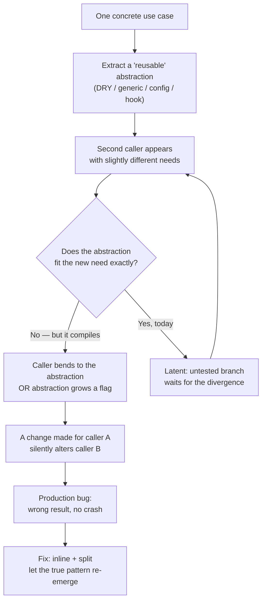

# Emergent Design — Find the Bug

> 12 buggy snippets where the defect lives inside an *over-engineered* abstraction: a premature `DRY` merge, a speculative plugin hook, a generic engine, a "future-proof" config layer. The code looks elegant. That elegance is the bug. Find it, then notice that the fix is almost always **inline and split** — collapse the wrong abstraction and let the right one emerge later.

---

## Table of Contents

1. [How to Use](#how-to-use)
2. [The Shape of an Over-Engineering Bug](#the-shape-of-an-over-engineering-bug)
3. [Snippets](#snippets)
   - [Snippet 1 — Wrong DRY: one rule change corrupts the other caller (Python)](#snippet-1--wrong-dry-one-rule-change-corrupts-the-other-caller-python)
   - [Snippet 2 — Shared range helper hides inclusive vs exclusive (Go)](#snippet-2--shared-range-helper-hides-inclusive-vs-exclusive-go)
   - [Snippet 3 — Config-driven engine with one untested branch (Java)](#snippet-3--config-driven-engine-with-one-untested-branch-java)
   - [Snippet 4 — Speculative strategy hook with a silent default (Go)](#snippet-4--speculative-strategy-hook-with-a-silent-default-go)
   - [Snippet 5 — Generic `Manager<T>` whose assumption breaks for a new T (Java)](#snippet-5--generic-managert-whose-assumption-breaks-for-a-new-t-java)
   - [Snippet 6 — YAGNI caching layer returns stale data (Python)](#snippet-6--yagni-caching-layer-returns-stale-data-python)
   - [Snippet 7 — DRY-ed validation that needed to diverge (Python)](#snippet-7--dry-ed-validation-that-needed-to-diverge-python)
   - [Snippet 8 — Premature base class forces a wrong default (Java)](#snippet-8--premature-base-class-forces-a-wrong-default-java)
   - [Snippet 9 — Over-general formatter swallows a timezone (Go)](#snippet-9--over-general-formatter-swallows-a-timezone-go)
   - [Snippet 10 — Speculative event bus drops the only listener (Python)](#snippet-10--speculative-event-bus-drops-the-only-listener-python)
   - [Snippet 11 — Generic retry wrapper retries a non-idempotent call (Go)](#snippet-11--generic-retry-wrapper-retries-a-non-idempotent-call-go)
   - [Snippet 12 — Parameterized "do everything" method with a flag collision (Java)](#snippet-12--parameterized-do-everything-method-with-a-flag-collision-java)
4. [Scorecard](#scorecard)
5. [Related Topics](#related-topics)

---

## How to Use

Read each snippet **before** opening the answer. For every one, ask the three questions that expose an over-engineering bug:

1. **Was this abstraction extracted from one example or two?** A shared function born from a single use case has no evidence about which parts are truly common. The first divergent requirement breaks it.
2. **Does one caller silently depend on behavior another caller doesn't want?** Wrong DRY couples callers through shared code. A change made *for* one caller lands *on* the other.
3. **Is there a branch / hook / type parameter that no real caller exercises today?** Speculative generality ships untested code paths. The day a second consumer arrives, the unexercised branch runs for the first time — in production.

Try to name the defect and write the fix. Then check yourself against the collapsible answer. Track your score on the [Scorecard](#scorecard).

The fix you reach for should usually feel like a *step backward*: delete the abstraction, duplicate the code, and wait for the real pattern to emerge from two or three concrete cases. That is the discipline of emergent design — duplication is cheaper to fix than the wrong abstraction.

---

## The Shape of an Over-Engineering Bug

Most bugs in this file follow one lifecycle. Recognizing it lets you spot the others before they bite.



The crash never comes. That is what makes these bugs dangerous — the abstraction *absorbs* the divergence instead of rejecting it, and you ship a confidently wrong answer.

---

## Snippets

### Snippet 1 — Wrong DRY: one rule change corrupts the other caller (Python)

**Difficulty:** 🟢 Junior

Two screens display money. Someone noticed both formatted currency and "DRY-ed" them into one helper. Months later, the invoice team asks for accounting-style negatives — parentheses instead of a minus sign.

```python
def format_money(amount: float) -> str:
    """Shared by the cart UI and the invoice PDF generator."""
    sign = "-" if amount < 0 else ""
    return f"{sign}${abs(amount):,.2f}"


# --- cart_view.py ---
def cart_line(item) -> str:
    return f"{item.name}: {format_money(item.price)}"


# --- invoice_pdf.py ---
def invoice_line(entry) -> str:
    return f"{entry.description}  {format_money(entry.amount)}"


# The invoice team's change request: show negatives in accounting style, e.g. ($12.00).
# An engineer edits the shared helper:
def format_money(amount: float) -> str:
    if amount < 0:
        return f"(${abs(amount):,.2f})"        # accounting style
    return f"${amount:,.2f}"
```

**What's wrong?**

<details><summary>Answer</summary>

The change request came from **one** caller (the invoice PDF), but `format_money` is shared with the **cart view**. After the edit, a refunded line item or a negative cart adjustment renders as `($5.00)` in the shopping cart — where users expect `-$5.00`. The cart team didn't ask for accounting notation and never tested for it; their display silently changed.

This is the **wrong-abstraction defect**. The two callers were never the *same* concept — "format money for a consumer-facing cart" and "format money for a formal accounting document" merely *looked* identical the day they were merged. DRY was applied to two pieces of code that happened to coincide, not to a single piece of knowledge. As Sandi Metz puts it: *duplication is far cheaper than the wrong abstraction.*

**The fix — inline and split.** Give each context its own formatter; share only the genuinely-common primitive if one even exists.

```python
def _format_amount(amount: float) -> str:
    return f"${abs(amount):,.2f}"

def cart_money(amount: float) -> str:
    return f"-{_format_amount(amount)}" if amount < 0 else _format_amount(amount)

def invoice_money(amount: float) -> str:
    return f"({_format_amount(amount)})" if amount < 0 else _format_amount(amount)
```

Now a change requested by accounting cannot reach the cart. The shared piece (`_format_amount`) is the part that is *actually* one concept; the divergence lives where it belongs.

**Tell-tale sign:** a bug report from a team that never touched the code, triggered by a change another team requested.
</details>

---

### Snippet 2 — Shared range helper hides inclusive vs exclusive (Go)

**Difficulty:** 🟢 Junior

A pagination helper and a date-range report both needed "a range of values." They were unified into one `Range` builder.

```go
package report

// Range builds [start, end] — used by pagination AND date reports.
type Range struct {
	Start int
	End   int
}

// Values returns every integer in the range, inclusive of both ends.
func (r Range) Values() []int {
	out := make([]int, 0, r.End-r.Start+1)
	for v := r.Start; v <= r.End; v++ {
		out = append(out, v)
	}
	return out
}

// --- pagination.go ---
// Page 0 should show rows [0..pageSize), i.e. pageSize rows starting at 0.
func PageRows(page, pageSize int) []int {
	start := page * pageSize
	r := Range{Start: start, End: start + pageSize}
	return r.Values()
}

// --- daily_report.go ---
// Days 1..31 of a month, both ends shown to the user.
func MonthDays(daysInMonth int) []int {
	return Range{Start: 1, End: daysInMonth}.Values()
}
```

**What's wrong?**

<details><summary>Answer</summary>

`Range.Values()` is **inclusive** of both ends. That is exactly right for `MonthDays` (the user wants day 1 *and* day 31). But pagination is conventionally a **half-open** interval `[start, start+pageSize)`. `PageRows(0, 10)` should return 10 rows: `0..9`. Because `Values()` is inclusive and `End = start + pageSize`, it returns `0..10` — **eleven rows**. Every page leaks one row from the next page; the last item of each page is duplicated at the top of the following page.

The abstraction *hid a behavioral difference*: pagination is exclusive, calendar ranges are inclusive. By forcing both through one inclusive helper, one caller is off-by-one. The compiler is perfectly happy — both call sites type-check, and `MonthDays` even has correct output, which is why tests for the report pass and mask the problem.

**The fix.** Don't make two semantically different ranges share one type. Either give the helper an explicit, named contract, or — cleaner — inline pagination, since half-open iteration is a one-liner that needs no abstraction:

```go
func PageRows(page, pageSize int) []int {
	start := page * pageSize
	out := make([]int, 0, pageSize)
	for v := start; v < start+pageSize; v++ { // half-open: < not <=
		out = append(out, v)
	}
	return out
}
```

If you genuinely want a shared abstraction, make the boundary semantics part of the name so a caller cannot pick the wrong one by accident: `InclusiveRange` vs `HalfOpenRange`. The bug existed because "range" was treated as one idea when it was two.

**Tell-tale sign:** an off-by-one that only one caller exhibits, while a sibling caller using the same helper is correct.
</details>

---

### Snippet 3 — Config-driven engine with one untested branch (Java)

**Difficulty:** 🟡 Middle

To "avoid hardcoding business rules," a team built a discount engine driven by a config table. Only `PERCENT` discounts have ever been configured in production. `FIXED` was added "for completeness."

```java
public enum DiscountType { PERCENT, FIXED }

public record DiscountRule(DiscountType type, BigDecimal value) {}

public class DiscountEngine {

    public BigDecimal apply(BigDecimal price, DiscountRule rule) {
        switch (rule.type()) {
            case PERCENT:
                // value is a percentage, e.g. 15 means 15% off
                return price.subtract(
                    price.multiply(rule.value()).divide(BigDecimal.valueOf(100)));
            case FIXED:
                // value is an absolute amount off, e.g. 20 means $20 off
                return price.subtract(rule.value());
            default:
                return price;
        }
    }
}
```

**What's wrong?**

<details><summary>Answer</summary>

The `FIXED` branch can return a **negative price**. `apply(new BigDecimal("15"), new DiscountRule(FIXED, new BigDecimal("20")))` yields `-5`. A $15 item with a $20-off coupon now *pays the customer $5* — or, downstream, crashes a payment gateway that rejects negative charges, or worse, issues a refund.

The `PERCENT` branch can never go negative (a percentage of a non-negative price subtracted from that price stays `>= 0` for sane inputs), so the only branch ever exercised in production is safe. The `FIXED` branch is **speculative generality** — it was added to make the engine "general," shipped with no test and no clamp, and sat dormant until the first fixed-amount coupon was configured. The over-engineering didn't add value; it added an untested code path that became a latent bug.

**The fix.** First, clamp the floor regardless of type. Second — and more important for emergent design — question whether the engine should exist at all. If `PERCENT` is the only type with real demand, a config-driven enum-dispatch engine is premature; a single function would do, and the `FIXED` branch could be added *with its own test* the day a fixed coupon is actually needed.

```java
public BigDecimal apply(BigDecimal price, DiscountRule rule) {
    BigDecimal discounted = switch (rule.type()) {
        case PERCENT -> price.subtract(
            price.multiply(rule.value()).divide(BigDecimal.valueOf(100)));
        case FIXED   -> price.subtract(rule.value());
    };
    return discounted.max(BigDecimal.ZERO); // price can never go negative
}
```

The clamp fixes the immediate bug. The deeper lesson: a branch no caller exercises is not "extensible," it is **unverified**. Generality you don't yet need is a liability, not an asset.

**Tell-tale sign:** a `default:` / fall-through arm and one enum case that has never appeared in real data.
</details>

---

### Snippet 4 — Speculative strategy hook with a silent default (Go)

**Difficulty:** 🟡 Middle

A notification sender was built with a pluggable `RateLimiter` strategy "so we can swap algorithms later." Only one limiter was ever wired up — except in one construction path.

```go
package notify

type RateLimiter interface {
	Allow(userID string) bool
}

type Sender struct {
	limiter RateLimiter
	gateway Gateway
}

// NewSender wires the production token-bucket limiter.
func NewSender(g Gateway) *Sender {
	return &Sender{limiter: NewTokenBucket(100), gateway: g}
}

// Send checks the rate limit, then delivers.
func (s *Sender) Send(userID, msg string) error {
	if s.limiter == nil || s.limiter.Allow(userID) {
		return s.gateway.Deliver(userID, msg)
	}
	return ErrRateLimited
}

// --- elsewhere, a "lightweight" constructor added for a batch job ---
func NewBatchSender(g Gateway) *Sender {
	// Batch jobs don't need per-user limiting, so we skip the limiter.
	return &Sender{gateway: g}
}
```

**What's wrong?**

<details><summary>Answer</summary>

`NewBatchSender` leaves `limiter` as its zero value: `nil`. Look at the guard in `Send`:

```go
if s.limiter == nil || s.limiter.Allow(userID) {
```

When `limiter` is `nil`, the short-circuit makes the whole condition **true** — every message is delivered with **no rate limiting at all**. The `s.limiter == nil` check was added defensively to avoid a nil-pointer panic, and in doing so it silently turned "no limiter configured" into "unlimited." A batch job that was supposed to be the *most* careful about flooding users instead has *zero* throttling. The first time the batch path runs at scale, it hammers the gateway and trips the provider's abuse protection.

This is the classic **speculative hook with a silent default**. The pluggable-strategy interface existed for a second implementation that never arrived. Meanwhile the "make the optional dependency optional" convenience created a configuration in which the safety mechanism is absent — and *absent fails open*.

**The fix.** A speculative seam should fail **loud**, not silent. Either require the dependency, or make "no limiting" an explicit, named strategy rather than a `nil` that the guard reinterprets:

```go
type NoLimit struct{}
func (NoLimit) Allow(string) bool { return true }

func NewBatchSender(g Gateway) *Sender {
	// Explicit: batch jobs opt OUT of limiting on purpose.
	return &Sender{limiter: NoLimit{}, gateway: g}
}

func (s *Sender) Send(userID, msg string) error {
	if s.limiter.Allow(userID) { // no nil branch; limiter is always set
		return s.gateway.Deliver(userID, msg)
	}
	return ErrRateLimited
}
```

Now "no limiting" is a choice you can see and grep for, not an accident of a defensive nil-check. Better still, if there is only ever one real limiter, drop the interface entirely until a second one is actually needed — the abstraction was speculative to begin with.

**Tell-tale sign:** an `x == nil || x.Method()` guard around a dependency that was supposed to be mandatory.
</details>

---

### Snippet 5 — Generic `Manager<T>` whose assumption breaks for a new T (Java)

**Difficulty:** 🟡 Middle

A generic `CacheManager<T>` was extracted from a `User` cache so it could "work with any entity." A new `Session` entity reuses it.

```java
public class CacheManager<T> {
    private final Map<String, T> store = new ConcurrentHashMap<>();
    private final Function<T, String> keyOf;

    public CacheManager(Function<T, String> keyOf) {
        this.keyOf = keyOf;
    }

    public void put(T item) {
        store.put(keyOf.apply(item), item);  // dedupe by key
    }

    public T get(String key) {
        return store.get(key);
    }

    public int size() {
        return store.size();
    }
}

// Original, fine: every User has a stable, unique id.
CacheManager<User> users = new CacheManager<>(User::id);

// New use case, six months later:
CacheManager<Session> sessions = new CacheManager<>(s -> s.userId());
```

**What's wrong?**

<details><summary>Answer</summary>

`CacheManager<T>` silently assumes that `keyOf` produces a **unique** key per item — true for `User::id`. The `Session` cache keys by `userId()`, but **a single user can have multiple concurrent sessions** (laptop + phone). `put` does `store.put(key, item)`, so the second session for the same user **overwrites** the first. A user logs in on a second device and their first device's session vanishes from the cache; the original session can no longer be found by its own session id (it was never keyed by session id at all), so requests on the first device start failing authentication.

The generic container baked in a hidden invariant — *one item per key* — that held for the type it was extracted from and broke for the new type. Generality created the illusion that any `T` with a key function fits, when the real requirement (unique key vs. multi-value key) differs per entity. This is the hazard of extracting a `Manager<T>` from a single example: the example's incidental properties get promoted to universal assumptions.

**The fix.** Don't force a multi-value relationship through a single-value abstraction. Key `Session` by its own unique id, or use a multimap when one user genuinely owns many sessions:

```java
// Option A — key by the genuinely-unique field:
CacheManager<Session> sessions = new CacheManager<>(Session::sessionId);

// Option B — if you must look up by userId, the structure is a multimap,
// which is a DIFFERENT abstraction, not a parameterization of the same one:
Map<String, List<Session>> byUser = new ConcurrentHashMap<>();
```

The deeper move is to be suspicious of `Manager<T>` / `Handler<T>` / `Helper<T>` extracted from one caller. Wait for a second concrete case; only then can you see which properties are truly shared and which were incidental.

**Tell-tale sign:** a generic container reused for a type whose cardinality (1:1 vs 1:many, unique vs duplicate) differs from the original.
</details>

---

### Snippet 6 — YAGNI caching layer returns stale data (Python)

**Difficulty:** 🟡 Middle

Nobody had a performance problem, but a "for scale" caching decorator was added to the settings lookup anyway.

```python
import functools

@functools.lru_cache(maxsize=None)
def get_feature_flag(flag_name: str) -> bool:
    """Reads the flag from the database. Cached 'for scale'."""
    row = db.query(
        "SELECT enabled FROM feature_flags WHERE name = %s", flag_name
    )
    return bool(row.enabled)


# --- admin_panel.py ---
def toggle_flag(flag_name: str, enabled: bool) -> None:
    db.execute(
        "UPDATE feature_flags SET enabled = %s WHERE name = %s",
        enabled, flag_name,
    )
    # Flag is updated in the DB. Done.


# --- request_handler.py ---
def handle(request):
    if get_feature_flag("new_checkout"):
        return new_checkout(request)
    return old_checkout(request)
```

**What's wrong?**

<details><summary>Answer</summary>

`functools.lru_cache(maxsize=None)` caches **forever**, per process, with no invalidation. After `toggle_flag("new_checkout", True)` updates the database, `get_feature_flag("new_checkout")` keeps returning the **cached** value from the first call. An admin flips a feature on, sees it in the database, and nothing happens — and because each web worker has its own process-local cache, *some* workers serve the new behavior (those that never warmed the cache) and others serve the old, so the rollout is non-deterministic and impossible to reason about. A feature kill-switch that doesn't actually switch is a serious operational hazard.

This is a **YAGNI violation that became a correctness bug**. There was no measured performance problem; the cache was added speculatively "for scale." But a feature-flag read is precisely the thing that must stay fresh, and `lru_cache` provides no TTL and no invalidation hook. The premature optimization didn't just fail to help — it broke the feature's core contract.

**The fix.** First, *delete the cache* — it was never justified by a benchmark. A single indexed primary-key lookup is microseconds.

```python
def get_feature_flag(flag_name: str) -> bool:
    row = db.query("SELECT enabled FROM feature_flags WHERE name = %s", flag_name)
    return bool(row.enabled)
```

If profiling later proves the lookup is genuinely hot, add caching *with an invalidation strategy that matches the freshness requirement* — a short TTL, or explicit invalidation on `toggle_flag`, or a pub/sub bust across workers. The point of emergent design: optimize when you have evidence, and pick a cache whose semantics fit the data's mutability — never reach for the first decorator that says "cache."

**Tell-tale sign:** a cache with no TTL and no invalidation sitting in front of mutable data, added without a benchmark.
</details>

---

### Snippet 7 — DRY-ed validation that needed to diverge (Python)

**Difficulty:** 🔴 Senior

Signup and profile-update both validate a password. They were merged into one validator. Then security tightened the signup policy.

```python
MIN_LENGTH = 8

def validate_password(pw: str) -> None:
    if len(pw) < MIN_LENGTH:
        raise ValueError("Password too short")
    if not any(c.isdigit() for c in pw):
        raise ValueError("Password needs a digit")


# --- signup.py ---
def register(email: str, pw: str) -> User:
    validate_password(pw)
    return create_user(email, pw)


# --- profile.py ---
def change_password(user: User, old_pw: str, new_pw: str) -> None:
    if not verify(user, old_pw):
        raise ValueError("Wrong current password")
    validate_password(new_pw)
    store_password(user, new_pw)


# Security mandate (signup only): new accounts must use >= 12 chars and
# cannot reuse one of the user's last 5 passwords. An engineer edits the
# shared validator and threads a `user` argument through it:
def validate_password(pw: str, user: User | None = None) -> None:
    if len(pw) < 12:                                    # raised from 8 to 12
        raise ValueError("Password too short")
    if not any(c.isdigit() for c in pw):
        raise ValueError("Password needs a digit")
    if user is not None and pw in last_5_passwords(user):
        raise ValueError("Cannot reuse a recent password")
```

**What's wrong?**

<details><summary>Answer</summary>

The mandate applied to **signup only**, but the shared `validate_password` is also called by `change_password`. Two regressions result, both silent (no crash, just wrong policy enforcement):

1. **The 12-character minimum leaked to password *changes*.** Existing users who try to update their password to a perfectly-valid 10-character one are now rejected — a policy nobody approved for that flow. The change made *for* signup landed *on* profile updates.

2. **The reuse check is half-wired in the place it matters most.** `change_password` calls `validate_password(new_pw)` and never passes `user`, so `user is None` and the "cannot reuse a recent password" rule **never runs during a password change** — exactly the flow where reuse prevention is the whole point. Meanwhile signup, where the user has no history, is where the `user` argument would be passed. The rule is active in the flow that doesn't need it and dormant in the flow that does.

This is **wrong DRY under divergence**. Two validations *looked* identical, so they were merged; then their rules diverged. The shared function grew an optional `user` parameter (a flag-shaped smell) trying to serve both masters, and ended up serving neither correctly. When two pieces of *knowledge* (the signup policy and the change policy) start to differ, code that was merged because it once *looked* the same must be split.

**The fix — inline and split.** Each flow owns its own policy. Share only the genuinely-universal rules.

```python
def _basic_rules(pw: str, min_length: int) -> None:
    if len(pw) < min_length:
        raise ValueError("Password too short")
    if not any(c.isdigit() for c in pw):
        raise ValueError("Password needs a digit")

def validate_new_account_password(pw: str) -> None:
    _basic_rules(pw, min_length=12)            # signup policy

def validate_password_change(user: User, new_pw: str) -> None:
    _basic_rules(new_pw, min_length=8)         # change policy
    if new_pw in last_5_passwords(user):       # always checked here
        raise ValueError("Cannot reuse a recent password")
```

Now `register` calls `validate_new_account_password` and `change_password` calls `validate_password_change`. A future change to either policy is physically incapable of corrupting the other, and the reuse check is unconditionally enforced where it belongs.

**Tell-tale sign:** a shared function sprouting an optional parameter so it can behave differently for different callers. That optional flag is the abstraction admitting the callers are not the same.
</details>

---

### Snippet 8 — Premature base class forces a wrong default (Java)

**Difficulty:** 🔴 Senior

An abstract `Report` base class was designed up-front to capture "everything a report does." A new `RealTimeReport` extends it.

```java
public abstract class Report {
    public final String render() {
        var data = fetch();
        var cached = cache(data);   // every report caches its fetched data
        return format(cached);
    }

    protected abstract List<Row> fetch();
    protected abstract String format(List<Row> rows);

    // Speculative: "all reports benefit from caching", so it's baked into render().
    protected List<Row> cache(List<Row> data) {
        ReportCache.put(getClass().getSimpleName(), data, Duration.ofMinutes(15));
        return ReportCache.get(getClass().getSimpleName());
    }
}

public class MonthlySalesReport extends Report {
    protected List<Row> fetch() { return salesDao.lastMonth(); }
    protected String format(List<Row> rows) { return Tables.render(rows); }
}

// New requirement: a live dashboard that must always show current data.
public class RealTimeReport extends Report {
    protected List<Row> fetch() { return metricsDao.now(); }
    protected String format(List<Row> rows) { return Tables.render(rows); }
}
```

**What's wrong?**

<details><summary>Answer</summary>

The base class baked **15-minute caching into the template method `render()`** as a universal truth — "all reports benefit from caching." `RealTimeReport` is, by definition, the report that must **never** cache: it exists to show *current* data. But it inherits `cache()` and `render()` unchanged, so the live dashboard serves data up to 15 minutes stale. The whole point of the feature is silently defeated by an inherited default the subclass never asked for.

The defect is **premature abstraction extracted from one kind of example.** When the base class was written, every known report was a periodic batch report, so caching seemed universal and was hardcoded into the non-overridable `final render()`. The first report that violates the hidden assumption can't escape it without overriding `cache()` to be a no-op — and a subclass forced to *neutralize* inherited behavior is a sign the base class promised something that isn't actually shared.

**The fix.** Caching is not part of "being a report"; it is an *optional decoration* of some reports. Pull it out of the base class so behavior is composed, not inherited by default:

```java
public abstract class Report {
    public final String render() {
        return format(fetch());        // no implicit caching
    }
    protected abstract List<Row> fetch();
    protected abstract String format(List<Row> rows);
}

// Caching becomes an explicit wrapper for the reports that want it:
public final class CachedReport extends Report {
    private final Report delegate;
    private final Duration ttl;
    public CachedReport(Report delegate, Duration ttl) { this.delegate = delegate; this.ttl = ttl; }
    protected List<Row> fetch() {
        return ReportCache.getOrCompute(delegate.getClass().getSimpleName(), ttl, delegate::fetch);
    }
    protected String format(List<Row> rows) { return delegate.format(rows); }
}
```

Now `MonthlySalesReport` is wrapped in `CachedReport`; `RealTimeReport` is used raw. Nobody has to *override away* an unwanted default, because the default no longer exists. Favor composition over a speculative base class — emergent design lets the real shared behavior reveal itself across several subclasses before you commit it to a superclass.

**Tell-tale sign:** a subclass that must override an inherited method to *disable* it. The base class encoded an assumption that isn't truly universal.
</details>

---

### Snippet 9 — Over-general formatter swallows a timezone (Go)

**Difficulty:** 🔴 Senior

A single "format any timestamp" helper was extracted to avoid scattering layout strings. An audit-log caller and a user-profile caller share it.

```go
package format

import "time"

// FormatTime renders a timestamp for display. One helper for the whole app,
// "so we never disagree on the format."
func FormatTime(t time.Time) string {
	return t.Format("2006-01-02 15:04:05")
}

// --- audit_log.go ---
// Audit entries are stored and compared in UTC.
func AuditLine(event string, at time.Time) string {
	return event + " at " + FormatTime(at.UTC())
}

// --- profile.go ---
// User profile shows the time the account was created, in the user's local zone.
func CreatedLine(u User) string {
	return "Joined " + FormatTime(u.CreatedAt) // CreatedAt carries a location
}
```

**What's wrong?**

<details><summary>Answer</summary>

`FormatTime` formats with the layout `"2006-01-02 15:04:05"` — a layout with **no timezone token** (`Z07:00` or `MST`). It renders the wall-clock numbers of whatever zone the `time.Time` happens to carry, and then *discards all evidence of which zone that was*.

- The audit caller explicitly converts to UTC first, so its output is unambiguous *by convention* — but nothing in the string says "UTC," and the convention lives only in the caller.
- The profile caller passes a `CreatedAt` that carries the user's local location. `FormatTime` prints the local wall-clock time with no offset. A support engineer in another zone reading "Joined 2026-06-10 02:00:00" has no way to know whether that's local, UTC, or the user's zone. Worse, if anywhere downstream this string is parsed back (logs ingested into a system that assumes UTC), the local time is silently reinterpreted as UTC and the timestamp shifts by hours.

The over-general "one formatter for all timestamps" **hid a behavioral difference** that mattered: audit times and profile times have different zone semantics, and a single layout string cannot be correct for both. Collapsing them into one helper made the unsafe assumption ("everyone wants this exact layout, zone is someone else's problem") look like a virtue ("we never disagree on the format").

**The fix.** Make the zone semantics explicit per use case, and never emit a timestamp string that can't say what zone it's in:

```go
// Audit: always UTC, always with an explicit offset so it round-trips.
func AuditLine(event string, at time.Time) string {
	return event + " at " + at.UTC().Format("2006-01-02T15:04:05Z07:00")
}

// Profile: user-local, but the offset is printed so it's unambiguous.
func CreatedLine(u User) string {
	return "Joined " + u.CreatedAt.Format("2006-01-02 15:04:05 MST")
}
```

If a shared helper survives at all, it should take the zone intent as part of its contract rather than letting each caller pre-bend the input and hope. The two callers were never doing "the same formatting" — they were doing two different things that produced superficially similar strings.

**Tell-tale sign:** a formatting/serialization helper whose correctness depends on each caller massaging the input the right way *before* calling it, with no enforcement.
</details>

---

### Snippet 10 — Speculative event bus drops the only listener (Python)

**Difficulty:** 🔴 Senior

A simple "email the user after signup" need was implemented through a general-purpose event bus, "so we can add more handlers later."

```python
from collections import defaultdict

class EventBus:
    def __init__(self):
        self._handlers: dict[str, list] = defaultdict(list)

    def subscribe(self, event: str, handler) -> None:
        self._handlers[event] = [handler]   # register the handler

    def publish(self, event: str, payload) -> None:
        for handler in self._handlers.get(event, []):
            handler(payload)


bus = EventBus()

# --- emails.py (loaded at startup) ---
bus.subscribe("user.signed_up", send_welcome_email)

# --- analytics.py (added a year later, also at startup) ---
bus.subscribe("user.signed_up", track_signup)

# --- signup.py ---
def register(email: str) -> User:
    user = create_user(email)
    bus.publish("user.signed_up", user)
    return user
```

**What's wrong?**

<details><summary>Answer</summary>

Look at `subscribe`:

```python
self._handlers[event] = [handler]   # ASSIGNS a new single-element list
```

It **replaces** the handler list instead of **appending** to it. With only one subscriber (the original welcome-email need), this was indistinguishable from correct — there was never a second handler to clobber, so it passed every test for a year. The whole reason to build an event bus is to support multiple listeners, yet the implementation can only ever hold one. The day `analytics.py` is added and registers `track_signup`, it **overwrites** `send_welcome_email`. Now signups are tracked but **welcome emails silently stop** — and the team that owns emails didn't change anything, so they have no reason to suspect their feature broke.

This is **speculative generality with a latent defect**. An event bus was built to enable "more handlers later," but its core promise — fan-out to many handlers — was never actually exercised (only one handler ever existed), so the bug in that exact capability stayed invisible. The abstraction's reason for existing was the one thing it didn't do. Had the original need been implemented directly (`send_welcome_email(user)` right after `create_user`), there would have been no bus, no broken fan-out, and the analytics call would have been added as one more plain line.

**The fix.** Append, and — given the history — write the test that the speculative abstraction never had: *two* handlers for one event.

```python
def subscribe(self, event: str, handler) -> None:
    self._handlers[event].append(handler)   # accumulate handlers
```

```python
def test_multiple_handlers_all_fire():
    bus, calls = EventBus(), []
    bus.subscribe("e", lambda p: calls.append("a"))
    bus.subscribe("e", lambda p: calls.append("b"))
    bus.publish("e", None)
    assert calls == ["a", "b"]   # would have failed and caught the bug
```

The lesson cuts both ways: don't build the bus before you have two real consumers, and if you do build it, *test the generality you claim to provide* — an untested fan-out is just a single-handler call with extra ceremony and a hidden bug.

**Tell-tale sign:** infrastructure whose defining feature (many handlers, many backends, many plugins) has exactly one real instance, so the multiplicity is never tested.
</details>

---

### Snippet 11 — Generic retry wrapper retries a non-idempotent call (Go)

**Difficulty:** 🔴 Senior

A generic `WithRetry` helper was extracted so "any flaky operation" could be made resilient. A read endpoint used it; later, a payment charge reused it.

```go
package resilience

import "time"

// WithRetry runs fn up to 3 times on error. "Use it for anything flaky."
func WithRetry(fn func() error) error {
	var err error
	for attempt := 0; attempt < 3; attempt++ {
		if err = fn(); err == nil {
			return nil
		}
		time.Sleep(time.Duration(attempt+1) * 100 * time.Millisecond)
	}
	return err
}

// --- inventory.go (original, safe) ---
func loadStock(sku string) (int, error) {
	var stock int
	err := WithRetry(func() error {
		var e error
		stock, e = inventoryAPI.Get(sku) // pure read, safe to repeat
		return e
	})
	return stock, err
}

// --- billing.go (added later) ---
func chargeCard(token string, cents int) error {
	return WithRetry(func() error {
		return paymentAPI.Charge(token, cents) // POST /charges
	})
}
```

**What's wrong?**

<details><summary>Answer</summary>

`WithRetry` retries on **any** error, including a **timeout** — the case where the request may well have *succeeded on the server* even though the client never got the response. For `loadStock` that's harmless: re-reading inventory is idempotent. For `chargeCard` it is a disaster: if `paymentAPI.Charge` times out *after* the gateway charged the card, `WithRetry` calls it again, and the customer is **charged two or three times**. The generic helper has no notion of idempotency, so it applies a read-safe policy to a money-moving, non-idempotent operation.

The over-generalization — "use it for anything flaky" — erased the single most important distinction in retry logic: **is the operation safe to repeat?** Retrying is correct for idempotent reads and catastrophic for non-idempotent writes without an idempotency key. By extracting a one-size-fits-all wrapper from a read-only example, the design baked in the read's safety as if it were universal. The payment caller looked identical at the call site (`WithRetry(func() error {...})`) and type-checked perfectly, so nothing flagged the misuse.

**The fix.** Retry must be *opt-in per operation* with the idempotency contract made explicit — not a blanket wrapper. For non-idempotent calls, require an idempotency key so the server deduplicates retries:

```go
// Reads: retry freely.
func loadStock(sku string) (int, error) { /* WithRetry is fine here */ }

// Writes: retry only WITH an idempotency key the server honors.
func chargeCard(token string, cents int) error {
	key := newIdempotencyKey()
	return WithRetry(func() error {
		return paymentAPI.ChargeIdempotent(token, cents, key) // server dedupes
	})
}
```

If `ChargeIdempotent` isn't available, the charge must **not** be wrapped in a blind retry at all. The principle: a "generic resilience helper" that ignores idempotency is the wrong abstraction. Resilience policy depends on the operation's semantics, which a `func() error` signature cannot express — so the policy can't be safely generalized away from the call site.

**Tell-tale sign:** a cross-cutting helper (retry, cache, dedupe, async) applied uniformly to operations whose *semantics* (idempotent vs not, mutable vs immutable) differ in ways the helper can't see.
</details>

---

### Snippet 12 — Parameterized "do everything" method with a flag collision (Java)

**Difficulty:** 🔴 Senior

To avoid "duplicating" two similar export methods, they were merged into one parameterized method controlled by flags.

```java
public class Exporter {

    // Was once two methods: exportForUser() and exportForArchive().
    // Merged "to stay DRY" into one configurable method.
    public byte[] export(
            List<Record> records,
            boolean includeHeader,
            boolean includePii,      // include personally identifiable fields
            boolean compress) {

        var rows = new ArrayList<String>();
        if (includeHeader) {
            rows.add(headerRow(includePii));
        }
        for (var r : records) {
            rows.add(toRow(r, includePii));
        }
        byte[] body = String.join("\n", rows).getBytes(UTF_8);
        return compress ? gzip(body) : body;
    }
}

// User-facing download: header, no PII (privacy), no compression.
exporter.export(records, true, false, false);

// Internal archive: no header, include PII, compressed.
exporter.export(records, false, true, true);

// New requirement six months later: a compliance export — header, NO PII,
// and it must be compressed. A new caller is added:
exporter.export(records, true, true, false);
```

**What's wrong?**

<details><summary>Answer</summary>

The new compliance export was specified as **header, NO PII, compressed**. The correct call is `export(records, true, false, true)`. But the engineer wrote `export(records, true, true, false)` — they got two of the three booleans wrong: `includePii=true` (PII is now leaking into a compliance file that must be PII-free) and `compress=false` (uncompressed). The PII leak is the dangerous one: a file that is supposed to be scrubbed for compliance now contains personal data, and nothing rejects it — three positional booleans accept any combination.

The root cause is the merge itself. Two distinct exports were collapsed into **one method governed by a `boolean, boolean, boolean` triple** "to stay DRY." But the methods didn't represent the same knowledge; they represented different *export policies* that merely shared formatting code. The parameterization turned each policy into a positional flag combination, which (a) is unreadable at the call site — `export(records, true, true, false)` says nothing about intent — and (b) makes every new export a fresh chance to pick the wrong combination. This is the **boolean-trap form of wrong DRY**: the abstraction is "general" precisely because it pushed the real decisions out to opaque flags at every call site.

**The fix — inline and split into intent-named methods**, with the genuinely-shared formatting kept as a private helper:

```java
public class Exporter {
    public byte[] exportUserDownload(List<Record> records) {
        return render(records, /*header*/ true, /*pii*/ false, /*compress*/ false);
    }
    public byte[] exportArchive(List<Record> records) {
        return render(records, true_header(false), /*pii*/ true, /*compress*/ true);
    }
    public byte[] exportCompliance(List<Record> records) {
        return render(records, /*header*/ true, /*pii*/ false, /*compress*/ true);
    }

    private byte[] render(List<Record> records, boolean header, boolean pii, boolean compress) {
        // ... the shared formatting that was actually worth sharing ...
    }
}
```

Now each export is a **named policy**, impossible to call with the wrong flag combination because the flags live in exactly one place per policy and are chosen by the person who owns that policy. Callers write `exporter.exportCompliance(records)` — intent is explicit, and a misconfigured compliance export becomes a code review of one obvious line, not a silent boolean swap buried in a call.

**Tell-tale sign:** one method taking three or more booleans, born from merging several near-identical methods "to avoid duplication," with call sites that read as a meaningless run of `true, false, true`.
</details>

---

## Scorecard

Track how many you diagnosed without the answer. Each snippet is worth points by difficulty.

| # | Snippet | Difficulty | Over-engineering form | Got it? |
|---|---------|-----------|----------------------|---------|
| 1 | Shared `format_money` | 🟢 Junior | Wrong DRY (two contexts merged) | ☐ |
| 2 | Inclusive vs exclusive `Range` | 🟢 Junior | Abstraction hides behavioral diff | ☐ |
| 3 | Config discount engine | 🟡 Middle | Speculative untested branch | ☐ |
| 4 | Pluggable `RateLimiter` | 🟡 Middle | Speculative hook, silent default | ☐ |
| 5 | Generic `CacheManager<T>` | 🟡 Middle | Generic type, broken invariant | ☐ |
| 6 | `lru_cache` feature flag | 🟡 Middle | YAGNI cache, stale data | ☐ |
| 7 | Merged password validator | 🔴 Senior | Wrong DRY under divergence | ☐ |
| 8 | `Report` base class caching | 🔴 Senior | Premature base-class default | ☐ |
| 9 | One `FormatTime` for all | 🔴 Senior | Over-general, hidden zone semantics | ☐ |
| 10 | Single-handler event bus | 🔴 Senior | Speculative infra, untested fan-out | ☐ |
| 11 | Generic `WithRetry` | 🔴 Senior | Generic policy ignores idempotency | ☐ |
| 12 | Flag-driven `export` | 🔴 Senior | Boolean-trap wrong DRY | ☐ |

**Scoring:** 🟢 = 1 pt, 🟡 = 2 pts, 🔴 = 3 pts. Max = 24.

| Score | Verdict |
|-------|---------|
| 20–24 | You have internalized that the wrong abstraction is worse than duplication. Senior-level design instinct. |
| 13–19 | Strong. You catch wrong-DRY and speculative hooks; keep sharpening the idempotency and zone-semantics cases. |
| 6–12 | Solid start. Re-read the [shape diagram](#the-shape-of-an-over-engineering-bug) — most misses share the same lifecycle. |
| 0–5 | Study the pattern: *one example → abstraction → second caller diverges → silent wrong result.* The fix is almost always inline-and-split. |

The meta-lesson across all twelve: **a passing test suite does not validate an abstraction.** Every bug here type-checked and (for the original caller) passed. The defect surfaced only when a *second* requirement met code that was generalized from a *single* example. Prefer duplication until the real pattern is proven by two or three concrete cases — that is what "emergent" design means.

---

## Related Topics

- [junior.md](junior.md) — the beginner-level definition of these emergent-design anti-patterns (speculative generality, premature abstraction, YAGNI, wrong DRY).
- [tasks.md](tasks.md) — hands-on exercises: take an over-engineered module and collapse it back to the simplest design that passes.
- [Chapter README](../README.md) — the positive rules of Emergent Design (Kent Beck's four rules of simple design) that these snippets violate.
- [Anti-Patterns](../../anti-patterns/README.md) — the broader catalogue of design smells, including over-engineering and gold-plating.
- [Refactoring](../../refactoring/README.md) — the mechanical techniques (Inline Function, Inline Class, Collapse Hierarchy) used to undo a premature abstraction safely.
