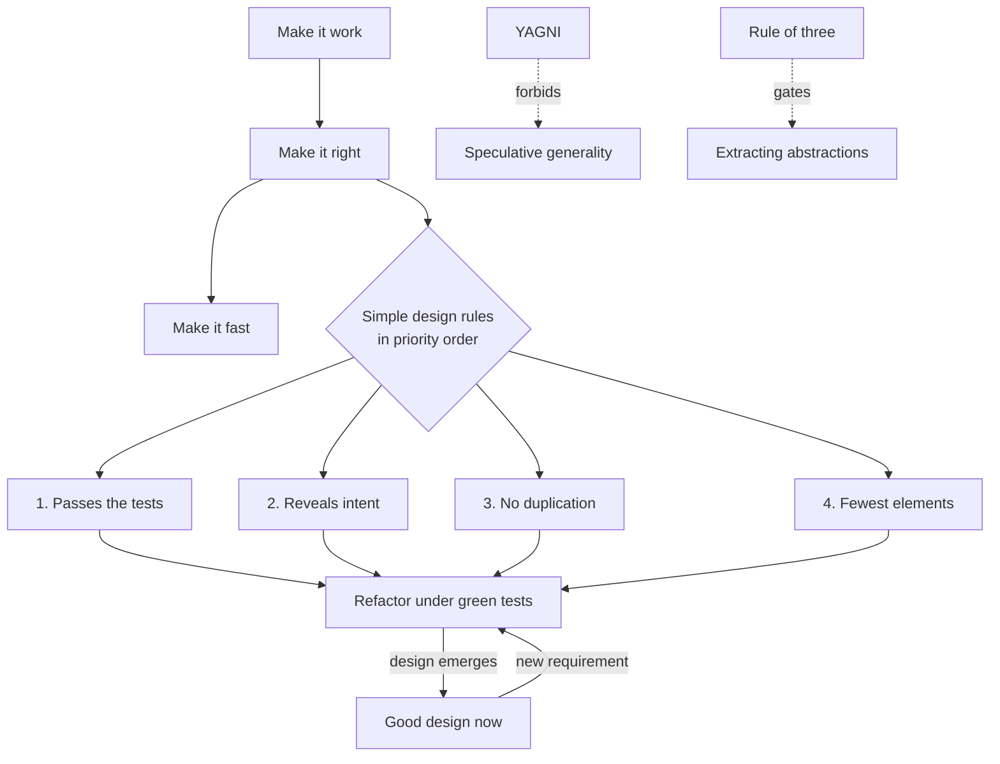
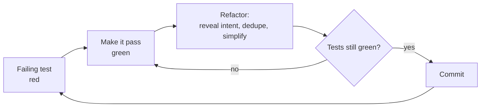

# Emergent Design — Interview Questions

> 50+ questions across all skill levels (junior → staff). Covers Kent Beck's four rules of simple design, YAGNI, DRY, the rule of three, the wrong-abstraction problem, speculative generality, emergent vs up-front design, and the refactoring-plus-tests engine. Use as self-review or interview prep. On the harder questions, a note on *what the interviewer is really checking* follows the answer.

---

## Table of Contents

- [Junior level (12 questions)](#junior-level-12-questions)
- [Mid level (14 questions)](#mid-level-14-questions)
- [Senior level (14 questions)](#senior-level-14-questions)
- [Staff level (12 questions)](#staff-level-12-questions)
- [Trick Questions](#trick-questions)
- [Rapid-Fire](#rapid-fire)
- [Summary](#summary)
- [Further Reading](#further-reading)
- [Related Topics](#related-topics)

---

## The big picture

---

## Junior level (12 questions)

### Q1. What are Kent Beck's four rules of simple design?

A design is simple, in priority order, when it:
1. **Passes all the tests.**
2. **Reveals intention** (the code says what it does; names and structure communicate).
3. **Has no duplication** (DRY).
4. **Minimizes the number of elements** (fewest classes, methods, and moving parts).

Sometimes stated as: *runs all the tests, no duplication, expresses intent, minimal classes and methods.* The first rule is always first; the other three are frequently summarized as "no duplication, reveals intent, fewest elements."

### Q2. Why does "passes the tests" come first?

Because a design that doesn't work isn't a design — it's a wish. Tests are the only objective measure of correctness. The other three rules are about *maintainability*, which is meaningless if the code is wrong. Tests also make the rest of the rules *safe* to apply: you can't refactor toward intent or remove duplication without a way to confirm you didn't break anything.

### Q3. What is YAGNI?

"You Aren't Gonna Need It." Don't build functionality on speculation that you'll need it later. Build it when a *real* requirement arrives. The cost of the feature isn't just writing it — it's carrying it (maintenance, testing, the cognitive weight of code that does nothing useful yet).

### Q4. What is DRY?

"Don't Repeat Yourself." Andy Hunt and Dave Thomas's principle from *The Pragmatic Programmer*: **every piece of knowledge should have a single, authoritative representation in the system.** It is about knowledge, not text — see Q19.

### Q5. What is the rule of three?

Coined by Don Roberts (popularized by Fowler): the first time you do something, just do it. The second time you see duplication, wince but tolerate it. The **third** time, refactor and extract the abstraction. Three occurrences give you enough examples to see the *real* pattern, not a guessed one.

### Q6. What does "emergent design" mean?

The idea that good design *emerges* from continuously applying the simple-design rules as you build, rather than being fully specified up front. You let structure grow out of real requirements and the refactoring you do to keep the code clean — instead of trying to predict the whole shape in advance.

### Q7. What is speculative generality?

A code smell: building flexibility (abstract classes, hooks, parameters, plugin points) for use cases that don't exist yet. Fowler's tell: "if a machinery is being used only by test cases, that's a smell." Examples: an interface with one implementation, an abstract base class with one subclass, a method parameter no caller ever varies.

### Q8. Give an everyday example of a YAGNI violation.

A function that takes a `format` parameter supporting JSON, XML, and CSV — but every caller passes `"json"` and there's no ticket for the others. The XML and CSV branches are untested speculation. YAGNI says: write the JSON path now, add the others when a real consumer needs them.

### Q9. What is "make it work, make it right, make it fast"?

Kent Beck's ordering of effort:
1. **Work** — get a correct solution, however ugly.
2. **Right** — refactor it to be clean and clear (apply the simple-design rules).
3. **Fast** — optimize *only if* profiling shows you need to.

The order matters: optimizing code that's wrong wastes effort, and optimizing code that's not yet clean optimizes the wrong thing.

### Q10. What is the relationship between refactoring and tests?

Tests are what make refactoring *safe*. Refactoring is changing structure without changing behavior; you can only be sure behavior is unchanged if tests confirm it. Without tests, "refactoring" is just "editing and hoping." Together they form the engine of emergent design: tests hold behavior still while you reshape the code.

### Q11. Is duplication always literal copy-paste?

No. Duplication of **knowledge** is worse than duplication of text. Two functions that look different but encode the same business rule are duplicated; if the rule changes you must find and fix both. Conversely, two snippets that look identical but represent *different* knowledge are not true duplication (see Q19).

### Q12. What's the difference between simple and easy?

Simple = few moving parts, low conceptual weight, untangled (objective). Easy = familiar, near-to-hand, low effort to start (subjective). Rich Hickey's distinction: a clever framework can make something *easy* to write while making the system *complex*. The simple-design rules optimize for simple, not easy.

> **What the interviewer is checking (Q9–Q12):** that you treat design as a discipline with an *order* of priorities, not a bag of buzzwords — and that you understand DRY is about knowledge, not characters.

---

## Mid level (14 questions)

### Q13. Why does "reveals intent" rank above "no duplication"?

Because communication is the dominant cost in software. Code is read far more than written. A clear, slightly duplicated piece of code is more valuable than a DRY but cryptic one. Beck's ordering says: if removing duplication would obscure intent, *don't* — favor the more communicative version. Intent first, then dedupe within that constraint.

### Q14. How can removing duplication and revealing intent conflict?

Aggressive deduplication creates indirection: a shared helper with five boolean flags, a generic base class with conditional hooks. Each removal of duplication can add a layer the reader must traverse. At some point the abstraction costs more comprehension than the duplication did. The rules' order resolves the tie: keep it intention-revealing.

### Q15. What is the "wrong abstraction" problem?

Sandi Metz's principle: **"duplication is far cheaper than the wrong abstraction."** When you extract an abstraction from cases that only *seem* similar, then new requirements force you to add parameters and conditionals to the shared code, the abstraction rots into a tangle serving no one. Her prescribed cure: *re-inline* the abstraction back into its callers, recover the duplication, and let the *correct* abstraction emerge from clearer examples.

> **What the interviewer is checking:** seniority. Juniors over-DRY. The mature answer is that a premature abstraction is a liability you may have to *undo*, and that undoing it (re-inlining) is a legitimate, deliberate move — not an admission of failure.

### Q16. How does the rule of three protect against the wrong abstraction?

It forces you to wait for enough real examples before generalizing. With one example you have no pattern; with two you have a coincidence; with three you can distinguish what genuinely varies from what's incidental. Extracting at the third occurrence means your abstraction is grounded in observed variation, not predicted variation.

### Q17. Contrast emergent design with big up-front design (BDUF).

BDUF tries to specify the full architecture before coding, betting that you can predict requirements. Emergent design defers structural decisions until requirements reveal them, betting that you *can't* predict well and that refactoring under tests is cheap enough to evolve the design later. The trade-off is the cost-of-change curve: BDUF wins when change is expensive and requirements are knowable; emergent design wins when change is cheap and requirements are uncertain.

### Q18. So is *no* up-front design the right answer?

No — see Q40. Emergent design is not "no design." It means deferring *reversible* decisions and making the *minimum* set of irreversible architectural choices deliberately. You still think; you just don't speculatively encode predictions into code.

### Q19. Explain the deeper, knowledge-based definition of DRY.

From *The Pragmatic Programmer*: *"Every piece of knowledge must have a single, unambiguous, authoritative representation within a system."* The unit is **knowledge** (a business rule, a constant, a schema), not source lines. Two pieces of code can be byte-identical yet represent different knowledge — deduplicating them couples two things that should change independently. The test for true duplication: *if this fact changes, must both places change for the same reason?*

> **What the interviewer is checking:** whether you parrot "DRY = don't copy-paste" or understand it as a coupling principle. The follow-up is usually Q20.

### Q20. Give an example of *false* duplication (DRY done wrong).

Two validation rules that happen to both check `age >= 18` — one for "can open an account," one for "can purchase alcohol." They look identical, so a junior extracts `isAdult()`. Later, the drinking age changes to 21 in some jurisdictions but the account age stays 18. Now the shared function must grow a parameter and a branch, coupling two unrelated policies. They were never the same knowledge.

### Q21. What is a one-way vs two-way door decision?

Jeff Bezos's framing. A **two-way door** is reversible — if it's wrong you can walk back through easily (a function name, a class boundary, most code structure). A **one-way door** is hard or impossible to reverse (a public API contract, a database schema in production, a wire protocol, a data-loss migration). Decide two-way doors fast and let them emerge; deliberate carefully and design up-front on one-way doors.

### Q22. How does the door framing connect to emergent design?

Emergent design works *because most code decisions are two-way doors.* Refactoring under tests means you can change your mind cheaply, so deferring those decisions costs little. The discipline is recognizing the *few* one-way doors hiding in your design — those deserve up-front thought precisely because emergence can't save you if you get them wrong.

### Q23. What's the difference between YAGNI and not designing at all?

YAGNI forbids building *features and flexibility* for imagined future requirements. It does **not** forbid clean structure, naming, tests, or honoring the simple-design rules for the code you're actually writing now. You apply full design discipline to today's requirement; you just don't add machinery for tomorrow's guessed one.

### Q24. How do you decide between tolerating duplication and extracting it?

Ask three questions: (1) Is it the same *knowledge* or coincidental sameness? (2) Have I seen it at least three times (rule of three)? (3) Will the abstraction be *more* intention-revealing than the duplication, or will it add indirection? Extract only when the answer to all three favors it. Otherwise, wait.

### Q25. What role do tests play *beyond* catching regressions in emergent design?

Tests are a design tool, not just a safety net. Writing the test first forces you to design the *interface* from the caller's perspective (small, focused, intention-revealing). Hard-to-test code is a design smell — it usually signals tangled dependencies. So tests pressure the design toward the simple-design rules even before you refactor.

### Q26. What is "premature abstraction extracted from one example"?

Generalizing from a single case. You build a `ReportGenerator` framework after writing exactly one report. With one data point you cannot know which parts are essential and which are accidental, so the abstraction encodes your *guess* about variation. When the second report arrives and differs in unforeseen ways, the framework fights you. This is speculative generality's most common form.

> **What the interviewer is checking (Q23–Q26):** that you can hold two ideas at once — discipline now, restraint about later — and that you see tests as shaping design, not merely guarding it.

---

## Senior level (14 questions)

### Q27. Walk through the emergent-design loop concretely.

Red → green → refactor. Each refactor step applies the simple-design rules to *just* the code you now have. Design improves in small, test-protected increments. Over many cycles, structure accretes that no one designed up front but everyone can defend.

### Q28. When the simple-design rules conflict, how do you resolve it?

By their fixed priority order. The classic tension is rule 3 (no duplication) vs rule 2 (reveal intent): if deduplicating hurts clarity, clarity wins. Rule 4 (fewest elements) is last, so you never add complexity just to satisfy 4, and you never sacrifice intent or correctness to reduce element count. The order *is* the conflict-resolution mechanism — that's why it's load-bearing.

> **What the interviewer is checking:** whether you know the rules are *ordered* and why. A candidate who lists them as an unordered set hasn't internalized them.

### Q29. How do you recognize the wrong abstraction in a living codebase?

Symptoms: a shared method that has accumulated boolean/enum parameters (`render(x, fast=true, legacy=false)`); callers pass flags they don't understand; bug fixes in one caller break another that "shouldn't" be related; the abstraction's name is vague (`Helper`, `Manager`, `Base`). The fix is Metz's: inline it back into each caller, then let the real seams reappear.

### Q30. Describe re-inlining a wrong abstraction step by step.

1. Find every caller of the bad abstraction.
2. Under green tests, copy the abstraction's body *into* each caller (Inline Method/Class).
3. At each call site, delete the branches that site never exercises.
4. Now each caller holds its own honest, possibly-duplicated code.
5. Observe the *true* commonality across them; extract only that, if rule-of-three justifies it.

Tests stay green throughout — this is a refactoring, not a rewrite.

### Q31. How do you balance YAGNI against legitimately expensive-to-change decisions?

Map the decision to a door (Q21). For two-way doors, apply YAGNI hard — defer, let it emerge. For one-way doors (public APIs, data formats, schemas), invest up-front: these are the cases where "you're gonna need it to be right the first time." The skill is classification, not blanket application of YAGNI everywhere.

### Q32. Can emergent design and up-front architecture coexist? How?

Yes — this is the mature stance. Do up-front design for the *load-bearing, irreversible* structure (bounded contexts, service boundaries, data ownership, public contracts). Let everything *inside* those boundaries emerge through the red-green-refactor loop. Architecture sets the walls; emergent design furnishes the rooms. This is sometimes called "evolutionary architecture."

### Q33. How does test-driven development relate to emergent design?

TDD *is* the operational form of emergent design. The refactor step of red-green-refactor is exactly where the simple-design rules get applied. TDD provides the always-green test suite that makes structural change safe, and the test-first discipline pressures interfaces toward intention-revealing simplicity. Beck's *Test-Driven Development* and the four rules come from the same source for this reason.

### Q34. What's the cost model that makes emergent design viable?

It depends on the **cost of change** staying low. If refactoring is cheap (good tests, good tooling, modular code), deferring decisions is nearly free, so YAGNI and emergence win. If the cost of change is high (no tests, tight coupling, slow builds, a brittle deploy), then mistakes are expensive to fix later, which pushes you toward more up-front design. So the *first* investment is keeping the cost of change low — that's what unlocks everything else.

### Q35. How do you apply the simple-design rules at architectural scale?

The rules scale up. "Passes the tests" → the system meets its SLOs and contract tests. "Reveals intent" → service and module boundaries map to business capabilities. "No duplication" → one authoritative owner per piece of data/knowledge (no two services both claiming to be the source of truth). "Fewest elements" → don't introduce a service, queue, or cache you don't yet need (architectural YAGNI).

### Q36. A teammate extracts a `BaseController` after writing two controllers. Critique.

Two examples is below the rule of three, so the extraction is premature. The risk: the third controller differs in ways the base didn't anticipate, forcing flags and overrides into the base. Better: tolerate the duplication across the two, note it, and revisit when the third arrives. If pressed, I'd ask: *is this the same knowledge, or two controllers that coincidentally share boilerplate?*

### Q37. How does speculative generality hurt teams beyond extra code?

It taxes everyone who reads the code afterward — they must understand abstractions that serve no current purpose and can't tell which are load-bearing. It misleads: a plugin interface implies "extend here," inviting misuse. It resists deletion (people fear removing "flexibility"). And it's untested in its hypothetical paths, so the flexibility often doesn't even work when finally needed.

### Q38. When *should* you extract an abstraction with only two examples?

When the two examples are a *known, closed* set with a clear contract — e.g., exactly two payment providers mandated by the business with no expectation of a third, and the shared interface is a genuine domain concept, not incidental code shape. The rule of three is a heuristic against *speculative* extraction; it bends when the domain itself guarantees the abstraction's correctness.

### Q39. How do you justify refactoring time to a skeptical manager?

Frame it as cost-of-change, not aesthetics. "This module is a hotspot — frequently changed and tangled. Refactoring it under tests reduces the time and risk of the next ten changes." Tie it to throughput and defect rate, not to "clean code" as an end. Emergent design is an *economic* argument: pay small, continuous design costs to avoid a large, discontinuous rewrite cost later.

> **What the interviewer is checking (Q31–Q39):** whether you can apply these principles as engineering economics and at architectural scale — not just to single functions — and whether you know when each principle's heuristic should bend.

### Q40. Should you ever do big up-front design?

Yes, for one-way-door decisions where the cost of being wrong is catastrophic or irreversible: external API contracts, persistent data schemas, security and compliance boundaries, distributed-system consistency models, anything other teams will build hard dependencies on. For those, "design emerges later" is false comfort — you can't cheaply refactor a published contract that thousands of clients consume. Everywhere else, prefer emergence.

> **What the interviewer is checking:** that you don't treat "emergent design" as dogma. The senior answer names the *category* of decisions where up-front design is mandatory.

---

## Staff level (12 questions)

### Q41. How do you make emergent design work across many teams?

Establish strong, deliberately-designed *contracts and boundaries* (the one-way doors) up front, then grant teams autonomy to let design emerge *within* their boundary. Invest org-wide in what keeps the cost of change low: fast CI, contract/consumer-driven tests, trunk-based development, and a culture that treats refactoring as routine. Emergent design fails at scale not from bad intentions but from a high cost of change that makes everyone afraid to refactor.

### Q42. How do you tell genuine flexibility points from speculative generality in an architecture review?

Ask for the *driving requirement*. Genuine flexibility traces to a real, near-term, named consumer or a hard one-way-door constraint. Speculative flexibility traces to "we might need to..." or "to be safe." A concrete test: is anything *other than tests and future hopes* using this seam today? If not, it's speculation, and I'd push to remove it until the second consumer is real.

### Q43. Reconcile DRY with microservice autonomy.

They tension hard. Cross-service code DRY (a shared library every service must adopt) creates lock-step coupling — a change forces coordinated deploys, destroying autonomy. The resolution: DRY *knowledge ownership* (one service owns each fact), but tolerate *code* duplication across service boundaries. Inside a service, DRY normally. Across services, a little duplicated code is far cheaper than the distributed coupling of a forced-shared library — a macro-scale version of Metz's principle.

> **What the interviewer is checking:** whether you can take a "junior" principle (DRY) and reason about where it inverts at scale. The expected insight is that DRY across deployment boundaries trades local cleanliness for global coupling.

### Q44. How does evolutionary architecture operationalize emergent design at the system level?

Through **fitness functions**: automated, objective checks (architecture tests, performance budgets, dependency rules, security scans) that guard the load-bearing properties. They play the role tests play for code — they hold the *architectural* invariants still so the structure can evolve underneath without violating them. This lets you defer architectural decisions while still protecting the few that matter.

### Q45. How do you migrate a speculative framework that's now load-bearing-by-accident?

Treat it like the wrong abstraction at scale. (1) Add characterization tests around its real behavior. (2) Introduce a clean interface in front of it (Branch by Abstraction). (3) Move real consumers to honest, specific implementations, deleting the speculative hooks they never used. (4) Strangle the framework as consumers leave. Never a big-bang rewrite — incremental, test-guarded, reversible at each step.

### Q46. What metrics signal that emergent design is *failing* on a codebase?

Rising lead time for changes; refactors that require touching many files (high coupling); a growing population of `*Manager`/`*Helper`/`*Base` classes with flags; tests that are slow or skipped (so refactoring isn't safe); and an increasing fear-of-change measured by how often people copy-and-modify rather than edit-in-place. The root cause is almost always a high cost of change — fix that before fixing individual smells.

### Q47. How do you coach a team that over-applies DRY?

Reframe DRY as a coupling decision, with the test "same knowledge?" not "same text?" Introduce the wrong-abstraction principle explicitly and *normalize re-inlining* as a healthy move, not a regression — many teams over-DRY because they think extracting is always progress and inlining is always defeat. Pair on a re-inlining session so they feel that recovering duplication can *improve* a design.

### Q48. How do one-way-door decisions change how you run a project?

You front-load and concentrate review on them. They get explicit design docs, broad sign-off, and deliberate optionality (versioned APIs, schema migration strategy, feature flags) to convert as many one-way doors into two-way as possible. Everything else gets fast, decentralized decision-making and emerges through normal development. The leadership skill is *triage*: spend the scarce "deliberate design" budget only where reversal is expensive.

### Q49. Is the rule of three a law or a heuristic, and how do you apply it as a staff engineer?

A heuristic, and I treat it as a *default*, not a gate. It usefully resists speculative extraction, but I override it in both directions: extract earlier when the domain guarantees the abstraction (Q38), and wait *past* three when the three occurrences are still in flux or represent different knowledge. The real discipline underneath is "extract from understood variation," for which "three" is just a convenient proxy.

### Q50. How do you defend emergent design against "we'll just refactor it later (and never do)"?

"Refactor later" only works if later is *cheap and routine*. So I make refactoring continuous and small (part of every change, under green tests), never a deferred mega-task. A deferred refactor is a debt with compounding interest; a continuous one is amortized maintenance. If a team's "later" never comes, the problem isn't the principle — it's that their cost of change is too high to make "later" affordable, and that's what I'd invest in.

### Q51. How do simplicity (Hickey) and the four rules inform platform/API design?

Optimize for *simple* (uncomplected, few concepts) over *easy* (familiar, quick to adopt) because a platform's complexity is paid by every consumer, forever — and a platform is the ultimate one-way door. Apply the four rules to the API surface: it must reveal intent (self-describing), avoid duplicated concepts (one way to do each thing), and minimize elements (small surface area). Speculative endpoints "for flexibility" are pure liability on a contract you can't unship.

### Q52. Summarize the staff-level mental model in one paragraph.

Keep the cost of change low (tests, modularity, fast feedback) so that most decisions become cheap two-way doors. Spend deliberate up-front design only on the few one-way doors. Within the boundaries those doors define, let design emerge via red-green-refactor, applying the four rules in priority order. Treat DRY as knowledge-coupling, extract abstractions only from understood variation, and re-inline fearlessly when an abstraction proves wrong. The whole system is an economic optimization, not an aesthetic one.

---

## Trick Questions

### T1. Is DRY always good?

**No.** DRY done by text-matching produces the *wrong abstraction* (Metz): coupling unrelated knowledge that then must grow flags and branches. DRY across service/deployment boundaries trades local cleanliness for distributed coupling. The correct framing is DRY of **knowledge**, applied where two things truly change together for the same reason. Sometimes the right move is to *increase* duplication by re-inlining a bad abstraction.

### T2. Is YAGNI an excuse for no design?

**No.** YAGNI forbids speculative *features and flexibility*, not design discipline. You still write tests, choose good names, apply the four rules, and keep the code clean — for the requirement you actually have. YAGNI removes guessed-at machinery; it does not license sloppiness on today's code.

### T3. Should you ever do big up-front design?

**Yes — for one-way doors.** Irreversible or expensive-to-change decisions (public API contracts, production data schemas, wire protocols, security and consistency models) deserve deliberate up-front design because emergence can't cheaply fix them later. The mistake is doing BDUF for *everything*; the opposite mistake is pretending nothing needs it.

### T4. Is duplication always bad?

**No.** A little duplication is "far cheaper than the wrong abstraction." Coincidental duplication (same text, different knowledge) *should* stay duplicated. Duplication across autonomy boundaries can be healthier than a forced shared dependency. And the rule of three says early duplication is fine — you wait for the third instance before extracting.

### T5. The four rules say "no duplication" *and* "fewest elements." Don't those conflict?

They can, and the **priority order resolves it.** "No duplication" outranks "fewest elements," but both outrank nothing above them: you never remove duplication in a way that hurts *intent* (rule 2), and you never add elements that hurt intent just to dedupe. "Fewest elements" being last means it's a tiebreaker, not a mandate to collapse everything into clever, dense code.

### T6. If design emerges, why bother thinking ahead at all?

Because emergence only covers reversible decisions and only works when the cost of change is low. You still must (a) identify the one-way doors and design those up front, and (b) actively invest in keeping change cheap (tests, modularity). Emergent design is *guided* evolution under constraints — not the absence of thought.

### T7. A method is duplicated in three places — rule of three says extract. Always?

**No.** The rule of three is a *trigger to evaluate*, not a command. First confirm it's the same knowledge (Q19/Q20). If the three are coincidental or still changing in different directions, extracting now just builds the wrong abstraction three times faster. Three occurrences make extraction *worth considering*, not automatic.

---

## Rapid-Fire

| Prompt | Answer |
|---|---|
| First rule of simple design | Passes all the tests |
| Last rule of simple design | Fewest elements (minimal classes/methods) |
| Order of the middle two rules | Reveals intent, *then* no duplication |
| DRY's real unit | Knowledge, not source text |
| Rule of three's purpose | Wait for real variation before abstracting |
| Cheaper than the wrong abstraction | Duplication (Metz) |
| Cure for a wrong abstraction | Re-inline it, then re-extract from clearer examples |
| YAGNI forbids | Speculative features/flexibility |
| YAGNI permits | Clean design for *today's* requirement |
| Make it work / right / fast — order | Correct, then clean, then (if profiled) fast |
| Two-way door | Reversible decision → decide fast, let it emerge |
| One-way door | Irreversible → design up front |
| Engine of emergent design | Refactoring under green tests (TDD) |
| Speculative generality tell | Machinery used only by tests / one impl |
| Simple vs easy | Uncomplected vs familiar (Hickey) |
| When BDUF is right | One-way doors: APIs, schemas, protocols |
| What unlocks emergent design | A low cost of change |

---

## Summary

Emergent design is the claim that good structure is *grown*, not fully *planned* — produced by repeatedly applying Kent Beck's four rules of simple design (passes tests → reveals intent → no duplication → fewest elements, **in that order**) inside a red-green-refactor loop. Its restraint principles are **YAGNI** (don't build for guessed futures) and the **rule of three** (don't abstract until you've seen real variation). Its central warning is the **wrong abstraction**: premature DRY couples unrelated knowledge, and the cure is to *re-inline* and wait. DRY itself is about a single authoritative source of **knowledge**, not about avoiding repeated text. The whole approach is an economic bet that the **cost of change** is low — which holds for the many **two-way-door** decisions but not for the few **one-way doors** (public APIs, schemas, protocols), where deliberate up-front design remains mandatory.

---

## Further Reading

- Kent Beck — *Extreme Programming Explained* and *Test-Driven Development by Example* (the four rules; red-green-refactor).
- Martin Fowler — *Refactoring* (2nd ed.) and his articles "YAGNI" and "Is Design Dead?".
- Sandi Metz — "The Wrong Abstraction" (2016); *Practical Object-Oriented Design*.
- Andy Hunt & Dave Thomas — *The Pragmatic Programmer* (DRY, orthogonality).
- Neal Ford, Rebecca Parsons, Patrick Kua — *Building Evolutionary Architecture* (fitness functions).
- Rich Hickey — "Simple Made Easy" (simple vs easy).

---

## Related Topics

- [Emergent Design — overview](README.md)
- [Junior notes](junior.md) · [Professional notes](professional.md)
- [Clean Code: Unit Tests](../08-unit-tests/README.md) — the test suite that makes refactoring safe
- [Refactoring](../../refactoring/README.md) — the mechanics behind the refactor step
- [Code Craft — overview](../README.md)

---

[← Emergent Design](README.md) · [Clean Code](../README.md) · [Roadmap](../../README.md)
