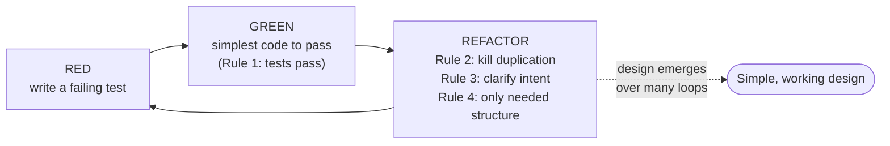

# Emergent Design — Junior Level

> **Level:** Junior — "What's the rule? Show me a clean example."
> **Source:** *Clean Code*, ch. 12 ("Emergence"), Kent Beck's Four Rules of Simple Design.

---

## Table of Contents

1. [What is Emergent Design?](#what-is-emergent-design)
2. [Real-world analogy](#real-world-analogy)
3. [The Four Rules at a glance](#the-four-rules-at-a-glance)
4. [Rule 1 — Runs all the tests](#rule-1--runs-all-the-tests)
5. [Rule 2 — No duplication (DRY)](#rule-2--no-duplication-dry)
6. [Rule 3 — Expresses intent](#rule-3--expresses-intent)
7. [Rule 4 — Minimizes classes and methods](#rule-4--minimizes-classes-and-methods)
8. [YAGNI — You Aren't Gonna Need It](#yagni--you-arent-gonna-need-it)
9. [The engine: red–green–refactor](#the-engine-redgreenrefactor)
10. [Common Mistakes](#common-mistakes)
11. [Test Yourself](#test-yourself)
12. [Cheat Sheet](#cheat-sheet)
13. [Summary](#summary)
14. [Further Reading](#further-reading)
15. [Related Topics](#related-topics)

---

## What is Emergent Design?

**Emergent design** is the idea that a good design does not have to be invented up front, in full, before you write code. Instead it *emerges* — it grows out of small, safe steps, where each step keeps the code working, removes a little duplication, and makes the intent a little clearer.

The engine of this growth is a tiny set of rules from Kent Beck, called the **Four Rules of Simple Design**. A design is "simple enough" when it follows all four. They are listed in **priority order** — when two rules conflict, the earlier one wins:

1. **Runs all the tests** — the design must work, and you must be able to *prove* it works.
2. **No duplication** — say each thing once (the DRY principle: Don't Repeat Yourself).
3. **Expresses intent** — the reader can tell what the code means without a decoder ring.
4. **Minimizes the number of classes and methods** — don't add structure you don't need.

Paired with these is **YAGNI** — "You Aren't Gonna Need It." Build for the requirement in front of you, not the one you imagine might arrive next quarter.

> **Key idea:** You do not *design* simple code and then write it. You write code, then *refactor toward* simplicity using these rules. Good design is the residue of disciplined small steps, not a blueprint drawn before the first line.

The opposite mistake — the one this chapter trains you to *avoid* — is adding flexibility, abstraction, and configuration for a future that has not arrived. That future code is unread, untested by real use, and usually wrong. It is a cost with no buyer.

---

## Real-world analogy

### Don't pave the campus before students walk it

A famous (possibly apocryphal) story: a university built its buildings but laid no footpaths. For one year, students walked wherever they pleased, wearing dirt trails into the grass. The next year, the groundskeepers paved exactly those trails. The paths fit how people actually moved — because they *emerged* from real use.

The opposite approach is to design every path on day one, guessing where people will walk. You build elegant paved walkways at right angles — and a year later there are dirt shortcuts cutting across all of them, because you guessed wrong.

Emergent design is paving the desire lines. You let the real usage tell you where the structure belongs, then you formalize *that*. You do not guess.

### A second analogy: the toolbox

A speculative-generality programmer is the person who, asked to hang one picture, buys a 200-piece tool set "in case." Most of those tools will never be touched, they fill the drawer, and the one screwdriver you actually need is now buried.

YAGNI says: buy the hammer. When the second job arrives and it needs a drill, buy the drill *then* — you'll know exactly which drill.

---

## The Four Rules at a glance

| # | Rule | Plain-English test | Failure smell |
|---|---|---|---|
| 1 | Runs all the tests | "Can I prove it works, automatically?" | No tests; fear of changing code |
| 2 | No duplication | "Is this logic written exactly once?" | Copy-pasted blocks; parallel edits |
| 3 | Expresses intent | "Can a new reader follow it without me?" | Cryptic names; comments explaining *what* |
| 4 | Minimizes classes/methods | "Did I add structure I'm actually using?" | `FooManagerFactoryImpl`; one-use interfaces |

Rules 2–4 are applied **during refactoring**, *after* rule 1 is green. Rule 1 is what makes the rest safe: you can only refactor fearlessly when tests will catch you if you break something.

> **Priority matters.** It is better to have a tiny duplication (rule 2) than to add a confusing abstraction (rules 3 and 4) to remove it. It is better to have one extra class (rule 4) than to bury two intents in one method (rule 3). Earlier rule wins.

---

## Rule 1 — Runs all the tests

### The rule

A design that cannot be verified is not a design you can trust. Rule 1 says: **the system must run all its tests, and you must run them.** A system that is comprehensively tested and passes its tests every time is, by definition, a system that does what it claims.

Why is this rule *first*? Because it makes the other three **possible**. Removing duplication and clarifying intent means *changing* code — and you will only change code freely if a test suite tells you the moment you break something. Tests are the safety net under the high wire of refactoring.

A subtle benefit: code that is hard to test is usually code with a design problem (tight coupling, hidden dependencies). Writing tests *pressures* you toward smaller, decoupled, single-purpose units — which is exactly what rules 3 and 4 want.

### Go example

```go
// Production code: a pure function is trivial to test.
package pricing

func ApplyDiscount(cents int, percent int) int {
    return cents - cents*percent/100
}
```

```go
// pricing_test.go
package pricing

import "testing"

func TestApplyDiscount(t *testing.T) {
    got := ApplyDiscount(1000, 10)
    if got != 900 {
        t.Errorf("ApplyDiscount(1000, 10) = %d, want 900", got)
    }
}
```

### Java example

```java
class Pricing {
    static int applyDiscount(int cents, int percent) {
        return cents - cents * percent / 100;
    }
}
```

```java
// PricingTest.java
import org.junit.jupiter.api.Test;
import static org.junit.jupiter.api.Assertions.assertEquals;

class PricingTest {
    @Test
    void appliesPercentDiscount() {
        assertEquals(900, Pricing.applyDiscount(1000, 10));
    }
}
```

### Python example

```python
# pricing.py
def apply_discount(cents: int, percent: int) -> int:
    return cents - cents * percent // 100
```

```python
# test_pricing.py
from pricing import apply_discount

def test_applies_percent_discount():
    assert apply_discount(1000, 10) == 900
```

> **Junior takeaway:** Before you "clean up" any code, make sure there's a passing test for it. No net, no acrobatics. See [../08-unit-tests/README.md](../08-unit-tests/README.md) for what makes a test trustworthy.

---

## Rule 2 — No duplication (DRY)

### The rule

**Duplication is the primary enemy of a well-designed system.** When the same idea is expressed in two places, every change must be made twice — and the day you change one and forget the other is the day a bug ships. DRY ("Don't Repeat Yourself") says each piece of knowledge should have **one** authoritative home.

Duplication is not only copy-pasted lines. It includes *structural* duplication — two methods that differ only in a value, two switch statements over the same set of cases, two parsers for the same format.

### Dirty → clean: removing duplication

#### Go

```go
// Dirty — the same validation logic, copy-pasted.
func CreateUser(name string) error {
    if name == "" {
        return errors.New("name is required")
    }
    if len(name) > 50 {
        return errors.New("name too long")
    }
    // ... create
    return nil
}

func RenameUser(name string) error {
    if name == "" {
        return errors.New("name is required")
    }
    if len(name) > 50 {
        return errors.New("name too long")
    }
    // ... rename
    return nil
}
```

```go
// Clean — the rule lives in exactly one place.
func validateName(name string) error {
    if name == "" {
        return errors.New("name is required")
    }
    if len(name) > 50 {
        return errors.New("name too long")
    }
    return nil
}

func CreateUser(name string) error {
    if err := validateName(name); err != nil {
        return err
    }
    // ... create
    return nil
}

func RenameUser(name string) error {
    if err := validateName(name); err != nil {
        return err
    }
    // ... rename
    return nil
}
```

#### Java

```java
// Dirty
class UserService {
    void createUser(String name) {
        if (name == null || name.isBlank()) throw new IllegalArgumentException("name is required");
        if (name.length() > 50) throw new IllegalArgumentException("name too long");
        // ... create
    }
    void renameUser(String name) {
        if (name == null || name.isBlank()) throw new IllegalArgumentException("name is required");
        if (name.length() > 50) throw new IllegalArgumentException("name too long");
        // ... rename
    }
}
```

```java
// Clean
class UserService {
    private void validateName(String name) {
        if (name == null || name.isBlank()) throw new IllegalArgumentException("name is required");
        if (name.length() > 50) throw new IllegalArgumentException("name too long");
    }
    void createUser(String name) { validateName(name); /* ... create */ }
    void renameUser(String name) { validateName(name); /* ... rename */ }
}
```

#### Python

```python
# Dirty
def create_user(name: str) -> None:
    if not name:
        raise ValueError("name is required")
    if len(name) > 50:
        raise ValueError("name too long")
    # ... create

def rename_user(name: str) -> None:
    if not name:
        raise ValueError("name is required")
    if len(name) > 50:
        raise ValueError("name too long")
    # ... rename
```

```python
# Clean
def _validate_name(name: str) -> None:
    if not name:
        raise ValueError("name is required")
    if len(name) > 50:
        raise ValueError("name too long")

def create_user(name: str) -> None:
    _validate_name(name)
    # ... create

def rename_user(name: str) -> None:
    _validate_name(name)
    # ... rename
```

> **A warning that matters even at junior level:** DRY is about *knowledge*, not about *characters that happen to match*. Two pieces of code that look identical today but would change for **different reasons** are not true duplication — merging them couples two unrelated decisions. Wait until you see the same knowledge repeated, ideally **three** times (the "rule of three"), before extracting. Rule 4 (don't add structure you don't need) keeps rule 2 honest. See [../../refactoring/README.md](../../refactoring/README.md).

---

## Rule 3 — Expresses intent

### The rule

Code is read far more often than it is written — mostly by the next person, who is often you in six months. **Rule 3 says the code should make its intent obvious.** The author understood it; the job is to transfer that understanding to the reader at the lowest possible cost.

You express intent through:

- **Good names** — `eligibleForFreeShipping` beats `flag2`.
- **Small functions** — a well-named function *is* a comment that can't go stale.
- **Standard structure** — patterns and idioms the reader already knows.
- **Tests as examples** — a readable test documents how a unit is meant to be used.

### Dirty → clean: making intent explicit

#### Go

```go
// Dirty — what does this condition mean?
func canCheckout(c Cart) bool {
    return len(c.Items) > 0 && c.Total > 0 && !c.Locked && c.UserVerified
}
```

```go
// Clean — the name carries the intent.
func canCheckout(c Cart) bool {
    return c.hasItems() && c.hasPositiveTotal() && c.isUnlocked() && c.UserVerified
}

func (c Cart) hasItems() bool         { return len(c.Items) > 0 }
func (c Cart) hasPositiveTotal() bool { return c.Total > 0 }
func (c Cart) isUnlocked() bool       { return !c.Locked }
```

#### Java

```java
// Dirty
boolean canCheckout(Cart c) {
    return c.items.size() > 0 && c.total > 0 && !c.locked && c.userVerified;
}
```

```java
// Clean
boolean canCheckout(Cart c) {
    return c.hasItems() && c.hasPositiveTotal() && c.isUnlocked() && c.isUserVerified();
}
```

#### Python

```python
# Dirty
def can_checkout(cart) -> bool:
    return len(cart.items) > 0 and cart.total > 0 and not cart.locked and cart.user_verified
```

```python
# Clean
def can_checkout(cart) -> bool:
    return (
        cart.has_items()
        and cart.has_positive_total()
        and cart.is_unlocked()
        and cart.user_verified
    )
```

> **Intent over cleverness.** A clever one-liner that the reader has to decode fails rule 3, even if it passes rule 1 and 2. Prefer the boring, obvious version. For deeper guidance see [../02-functions/README.md](../02-functions/README.md).

---

## Rule 4 — Minimizes classes and methods

### The rule

This is the rule juniors most often get backwards. After learning rules 2 and 3, the eager response is to extract *everything* — a class per concept, an interface per class, a factory per interface. Rule 4 is the brake: **don't multiply structure beyond need.**

Because it is the **lowest-priority** rule, it never overrides "no duplication" or "express intent" — you should still extract a method to remove real duplication or to name an intent. But when the extraction buys you *neither* (it removes no duplication and clarifies no intent), rule 4 says: don't.

This rule is the home of every anti-pattern this chapter warns about: speculative generality, premature abstraction, frameworks before a second consumer.

### Dirty → clean: NOT adding speculative generality

#### Go — the speculative version

```go
// Over-engineered — a "strategy" interface, a factory, and a registry...
// for exactly ONE notification type that exists today.
type Notifier interface {
    Notify(userID string, msg string) error
}

type NotifierFactory struct {
    registry map[string]func() Notifier
}

func (f *NotifierFactory) Register(kind string, ctor func() Notifier) { /* ... */ }
func (f *NotifierFactory) Create(kind string) (Notifier, error)        { /* ... */ }

type EmailNotifier struct{ /* ... */ }
func (e *EmailNotifier) Notify(userID, msg string) error { /* ... */ }

// 60 lines of machinery to send one email.
```

```go
// Clean — there is one notification type. Write one function.
func SendEmail(userID, msg string) error {
    // ... send the email
    return nil
}
```

When (if!) a second channel — SMS, push — actually appears, *then* you introduce the `Notifier` interface, extracted from **two real examples**. The abstraction will fit, because reality drew it.

#### Java — the premature interface

```java
// Over-engineered — interface + impl + DI wiring for a single implementation
// that will never have a second one.
interface TaxCalculator {
    Money calculate(Order order);
}

class DefaultTaxCalculator implements TaxCalculator {
    public Money calculate(Order order) { return order.subtotal().times(0.08); }
}
```

```java
// Clean — one concrete class is enough until a second tax rule exists.
class TaxCalculator {
    Money calculate(Order order) { return order.subtotal().times(0.08); }
}
```

> An interface with exactly one implementation, created "for testability" or "for the future," usually adds a file to read and nothing to use. Many test frameworks can mock concrete classes; and the future implementation may differ from your guess, forcing you to reshape the interface anyway.

#### Python — speculative configurability

```python
# Over-engineered — a generic, pluggable formatter "engine"
# for a report that has exactly one format.
class FormatterPlugin:
    def format(self, data): ...

class FormatterRegistry:
    def __init__(self):
        self._plugins = {}
    def register(self, name, plugin): self._plugins[name] = plugin
    def get(self, name): return self._plugins[name]

class JsonFormatter(FormatterPlugin):
    def format(self, data): return json.dumps(data)
```

```python
# Clean — you need JSON. Output JSON.
def format_report(data) -> str:
    return json.dumps(data)
```

> **Junior takeaway:** Every class, interface, and method is a thing the next reader must hold in their head. Earn each one with a *present* need — duplication to remove or intent to express — not a *future* guess.

---

## YAGNI — You Aren't Gonna Need It

### The rule

**YAGNI** is the discipline behind rule 4 and the antidote to speculative generality. It says: **implement things when you actually need them, never when you just foresee that you might.** Most foreseen needs never arrive, arrive in a different shape than predicted, or arrive after the speculative code has rotted unused and untested.

The cost of speculative code is not zero:

- **Carrying cost** — every reader must understand the unused flexibility.
- **Drift cost** — code never exercised by real use is rarely correct when its day comes.
- **Opportunity cost** — time spent on a hypothetical is time stolen from the real task.
- **Lock-in cost** — the wrong early abstraction is *harder* to remove than no abstraction.

### YAGNI in practice

```go
// YAGNI violation: a "currency" parameter, a rounding-mode option, and a
// locale, when the entire app only ever deals in USD with default rounding.
func Format(amountCents int, currency string, roundingMode int, locale string) string {
    // ... 40 lines handling cases that never occur
}

// YAGNI-respecting: solve today's actual problem.
func FormatUSD(amountCents int) string {
    return fmt.Sprintf("$%d.%02d", amountCents/100, amountCents%100)
}
```

```python
# YAGNI violation: "let's support pluggable storage backends"
# when the app has one SQLite database and no plan for a second.
class StorageBackend:  # abstract
    def save(self, record): ...
    def load(self, id): ...

class SQLiteBackend(StorageBackend): ...
class PostgresBackend(StorageBackend): ...   # written "just in case" — never deployed
class S3Backend(StorageBackend): ...         # written "just in case" — never deployed

# YAGNI-respecting:
def save_record(record): ...   # talks to the one database you have
```

> **YAGNI is not an excuse for sloppiness.** It does not mean "skip tests" or "skip clear names" — those serve a *present* need (rules 1 and 3). YAGNI targets exactly one thing: **unrequested capability**. Build clean code for today's requirement; refactor toward new shape when tomorrow's requirement actually lands.

---

## The engine: red–green–refactor

How does design "emerge" in practice? Through a tight loop, usually called **red–green–refactor** (the rhythm of test-driven development):

1. **Red** — write a small failing test for the next bit of behavior you need.
2. **Green** — write the *simplest* code that makes the test pass. Even ugly code is fine here.
3. **Refactor** — now that tests are green (rule 1), apply rules 2, 3, 4: remove the duplication you just created, rename for intent, and only keep the structure you're using.

Then repeat. Design is not decided in advance; it accumulates, one safe step at a time, as the *refactor* phase repeatedly nudges the code toward simplicity.



> **Why this beats big-up-front design:** an up-front design is a set of guesses made when you know the *least* about the problem. The emergent loop lets each decision be made later, with more information, and validated immediately by a test. You trade a fragile master plan for a sequence of small, reversible, verified moves.

---

## Common Mistakes

| Mistake | Why it hurts | Fix |
|---|---|---|
| **Speculative generality** — `Manager<T>`, plugin systems, registries for one use case | Carries cost, never used, usually guessed wrong | Apply YAGNI; build for the one case you have |
| **Premature abstraction** — extracting an interface/base class from a *single* example | One example can't reveal the right abstraction; you lock in a wrong shape | Wait for the **rule of three**; extract from real, repeated cases |
| **Building a framework before a second consumer** | A framework is an abstraction over *many* clients; with one client it's pure speculation | Write the concrete code; generalize when consumer #2 arrives |
| **Over-DRYing** — merging code that merely *looks* alike | Couples decisions that change for different reasons | Merge only true *knowledge* duplication |
| **Extract-everything** — a one-line method/class per fragment | Violates rule 4; adds structure with no payoff | Extract only to kill duplication or name intent |
| **Refactoring without tests** | You can't tell if you broke something — rule 1 first | Get to green before you clean up |
| **Big-up-front design** | Decisions made when you know the least; plan rots | Let design emerge via red–green–refactor |
| **Using YAGNI to skip tests/names** | Tests and clear names serve *today's* need | YAGNI targets unrequested *features*, not quality |

---

## Test Yourself

1. **List the Four Rules of Simple Design in priority order.**

<details><summary>Answer</summary>

(1) Runs all the tests; (2) Contains no duplication; (3) Expresses the intent of the programmer; (4) Minimizes the number of classes and methods. When two conflict, the earlier (lower-numbered) rule wins.

</details>

2. **Why is "runs all the tests" the *first* rule?**

<details><summary>Answer</summary>

Because it makes the others safe and possible. Removing duplication (rule 2) and clarifying intent (rule 3) require *changing* code, and you'll only change code fearlessly when a test suite catches regressions instantly. Tests are the net under the refactoring high wire. Bonus: hard-to-test code reveals design problems, pushing you toward the smaller, decoupled units rules 3 and 4 want.

</details>

3. **A teammate adds a generic `Repository<T>` with pluggable backends, but the app uses one database and has no plan for another. Which rule/principle does this violate, and what should they do?**

<details><summary>Answer</summary>

It violates rule 4 (don't multiply classes/methods beyond need) and YAGNI (don't build unrequested capability). They should write the concrete data-access code for the one database. If a second backend ever truly appears, extract the abstraction from the two real implementations.

</details>

4. **You see two 4-line blocks that look identical today. Should you always extract a shared function?**

<details><summary>Answer</summary>

Not automatically. DRY is about duplicated *knowledge*, not matching characters. If the two blocks would change for *different reasons*, merging them couples unrelated decisions. Prefer the **rule of three**: wait until you've seen the same knowledge repeated (ideally three times) before extracting, so you're confident it's genuine duplication.

</details>

5. **What is "premature abstraction," and why is one example not enough to abstract from?**

<details><summary>Answer</summary>

Premature abstraction is extracting an interface, base class, or generic helper from a *single* concrete case. One example cannot show you which parts vary and which are fixed — so the abstraction you invent is a guess. When the second case arrives shaped differently, you must reshape (or fight) the abstraction. Better to wait for two or three real examples; the right seams reveal themselves.

</details>

6. **What does red–green–refactor have to do with emergent design?**

<details><summary>Answer</summary>

It's the engine. Red = a failing test for the next behavior. Green = the simplest code to pass (rule 1). Refactor = apply rules 2–4 now that tests protect you. Repeating this loop lets the design *accumulate* from small, verified steps instead of being guessed up front. Each design decision is made later, with more knowledge, and checked immediately.

</details>

7. **Does YAGNI mean you can skip writing tests and clear names to save time?**

<details><summary>Answer</summary>

No. Tests serve rule 1 and clear names serve rule 3 — both are *present* needs for the code you're shipping today. YAGNI applies only to **unrequested capability**: speculative features, configurability, and abstraction for a future that hasn't arrived. Build clean code for today; defer tomorrow's *features*, not today's *quality*.

</details>

---

## Cheat Sheet

```text
FOUR RULES OF SIMPLE DESIGN (priority order — earlier wins)
  1. Runs all the tests        -> can you PROVE it works, automatically?
  2. No duplication (DRY)       -> is each piece of knowledge said ONCE?
  3. Expresses intent           -> can a stranger read it without you?
  4. Minimizes classes/methods  -> did you EARN each abstraction?

YAGNI: "You Aren't Gonna Need It"
  Build for the requirement in front of you, not the imagined next one.
  Targets unrequested FEATURES — never an excuse to skip tests or names.

EMERGENCE LOOP:  Red -> Green -> Refactor -> (repeat)
  Design is the residue of disciplined small steps, not a blueprint.

RULE OF THREE: tolerate duplication twice; extract on the third.

RED FLAGS:
  Manager<T> / Factory / Registry for ONE use case   -> speculative generality
  interface with ONE implementation "for later"       -> premature abstraction
  framework before a SECOND consumer                  -> YAGNI violation
  refactoring with NO tests                            -> rule 1 broken
```

---

## Summary

- **Emergent design** means a good design grows from small, safe steps rather than being drawn in full up front.
- Kent Beck's **Four Rules of Simple Design**, in priority order: (1) runs all the tests, (2) no duplication, (3) expresses intent, (4) minimizes classes and methods. Earlier rules win conflicts.
- **Rule 1** comes first because tests make refactoring safe — and they pressure you toward better design.
- **Rule 2 (DRY)** removes duplicated *knowledge*, but respect the **rule of three**: don't merge code that merely looks alike or changes for different reasons.
- **Rule 3** makes the code's intent obvious through names, small functions, and standard structure.
- **Rule 4** is the brake: don't add classes, interfaces, or methods you aren't using. It's the lowest priority — never override DRY or intent with it, but use it to stop over-engineering.
- **YAGNI** is the discipline against speculative generality: build for today's requirement, not an imagined future. It targets unrequested *features*, not quality.
- The **red–green–refactor** loop is the engine that turns these rules into emerging design, one verified step at a time.
- The anti-patterns to flag: speculative generality, over-engineering for hypothetical requirements, frameworks before a second consumer, and premature abstraction from a single example.

---

## Further Reading

- *Clean Code* (Robert C. Martin), ch. 12 — "Emergence."
- *Extreme Programming Explained* (Kent Beck) — origin of the Four Rules of Simple Design.
- *Refactoring* (Martin Fowler) — the mechanical moves that drive the refactor step.

---

## Related Topics

- [middle.md](middle.md) — when the rules collide in real code, and how to judge the trade-offs.
- [senior.md](senior.md) — emergent design at architectural scale; evolutionary architecture and fitness functions.
- [../README.md](../README.md) — the chapter's positive rules and the anti-patterns to avoid.
- [../08-unit-tests/README.md](../08-unit-tests/README.md) — the tests that make rule 1 (and all refactoring) possible.
- [../09-classes/README.md](../09-classes/README.md) — keeping classes small and single-purpose (rules 3 and 4).
- [../02-functions/README.md](../02-functions/README.md) — small, well-named functions that express intent.
- [../../refactoring/README.md](../../refactoring/README.md) — the discipline that carries out the refactor step.
- [../../design-patterns/README.md](../../design-patterns/README.md) — patterns to reach for *when a real need appears*, not before.
- [../../anti-patterns/README.md](../../anti-patterns/README.md) — speculative generality and over-engineering catalogued in depth.
