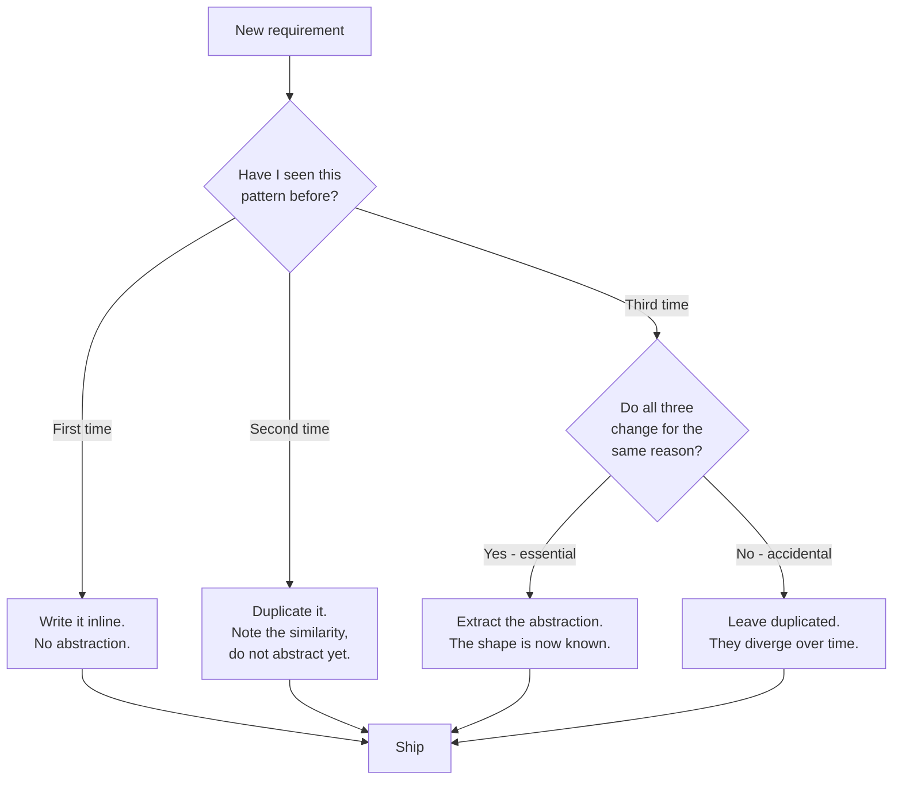

# Emergent Design — Middle Level

> Focus: "Why?" and "When does it bend?" — the trade-offs behind letting design emerge: the rule of three, why premature DRY produces the wrong abstraction, distinguishing accidental from essential duplication, YAGNI versus genuine extensibility, and which decisions you cannot defer.

---

## Table of Contents

1. [The core bet: design is cheaper to discover than to predict](#the-core-bet-design-is-cheaper-to-discover-than-to-predict)
2. [The rule of three](#the-rule-of-three)
3. [Why premature DRY creates the wrong abstraction](#why-premature-dry-creates-the-wrong-abstraction)
4. [Accidental vs. essential duplication](#accidental-vs-essential-duplication)
5. [YAGNI vs. genuine extensibility points](#yagni-vs-genuine-extensibility-points)
6. [What emergent design does NOT cover: the irreversible decisions](#what-emergent-design-does-not-cover-the-irreversible-decisions)
7. [Refactoring is the mechanism, tests are the safety net](#refactoring-is-the-mechanism-tests-are-the-safety-net)
8. ["Make it work, make it right, make it fast"](#make-it-work-make-it-right-make-it-fast)
9. [Emergent design across paradigms](#emergent-design-across-paradigms)
10. [Common Mistakes](#common-mistakes)
11. [Test Yourself](#test-yourself)
12. [Cheat Sheet](#cheat-sheet)
13. [Summary](#summary)
14. [Further Reading](#further-reading)
15. [Related Topics](#related-topics)

---

## The core bet: design is cheaper to discover than to predict

Emergent design rests on one wager: **you will understand the problem better after writing code for it than before.** So instead of designing the perfect abstraction up front from a requirements document, you write the simplest thing that works, then refactor toward structure as the real shape of the domain reveals itself.

This is not an excuse to write sloppy code. It's a sequencing claim: *the right time to extract an abstraction is after you have enough concrete examples to know what the abstraction should be.* Extract too early and you abstract from a sample size of one — you've guessed. Extract at the right moment and you abstract from observed variation — you've measured.

The whole chapter hinges on knowing **when** the moment has arrived. The rest of this file is a set of heuristics for that timing decision.



---

## The rule of three

> "The first time you do something, you just do it. The second time you do something similar, you wince at the duplication, but you do the duplicate thing anyway. The third time you do something similar, you refactor." — Martin Fowler, *Refactoring*

**Why three and not two?** Two occurrences give you almost no information about how the concept varies. The two sites could look identical today purely by coincidence. With three sites you can see the *axis of variation* — what stays constant and what changes — and that axis is exactly what your abstraction needs to parameterize.

Concretely, suppose you have two functions that format a user's name and a product's name:

```python
def format_user_label(user):
    return f"{user.name.strip().title()} (#{user.id})"

def format_product_label(product):
    return f"{product.name.strip().title()} (#{product.id})"
```

Tempting to extract `format_label(obj)` right now. **Don't.** You have a sample of two. You don't yet know:

- Will the third case use `.title()`? (Maybe order numbers shouldn't be title-cased.)
- Will the `(#id)` suffix always apply? (Maybe categories have no numeric id.)
- Is `.strip()` universal, or a coincidence of these two?

Wait for the third call site. If `format_order_label` shows up and it *also* does `strip → title → (#id)`, you now have evidence the pattern is real. Extract:

```python
def format_label(name: str, identifier: int) -> str:
    return f"{name.strip().title()} (#{identifier})"
```

The rule of three is a heuristic, not a law. The real question it encodes is: **do I have enough examples to know the abstraction's shape?** Sometimes that's two (two payment gateways with an obviously identical interface). Sometimes it's five. Three is the default because it's the smallest number that distinguishes a pattern from a coincidence.

---

## Why premature DRY creates the wrong abstraction

DRY — Don't Repeat Yourself — is one of the first principles juniors learn, and it's the one most often misapplied. The failure mode: you see two similar code blocks, extract a shared function, and feel virtuous. Then requirements diverge, and the shared function sprouts flags.

> "Duplication is far cheaper than the wrong abstraction." — Sandi Metz

Here is the lifecycle of a wrong abstraction, the way Metz describes it:

1. You see duplication and extract a shared method `process(x)`.
2. A new requirement needs *almost* the same behavior — but with one difference. You add a parameter: `process(x, special=False)`.
3. Another difference appears. Another flag: `process(x, special=False, legacy=True)`.
4. The method is now a maze of conditionals. Every caller passes a different combination. Nobody understands it.
5. Worse: you're now **afraid to touch it**, because it serves five callers with five different needs that happen to share a function body.

```go
// The wrong abstraction, fully grown.
func RenderInvoice(inv Invoice, isDraft, isCredit, skipTax, legacyFormat bool) string {
    // 200 lines of: if isDraft { ... } else if isCredit { ... }
    // Each caller passes a unique boolean combination.
    // Changing one branch risks breaking three unrelated callers.
}
```

The honest fix is almost always **to inline the abstraction back into its callers** (the duplication you started with), then re-extract along the boundaries that actually share behavior. Metz's prescription: *when you find yourself fighting an abstraction, re-introduce the duplication, then look for the new, correct abstraction.* Going backward is progress.

The deep reason premature DRY fails: **DRY is about knowledge, not text.** Two code blocks that look identical are only true duplication if they represent the *same decision*. If they merely *coincide* today, coupling them forces a single change to ripple into places that had no business changing. Which brings us to the central distinction.

---

## Accidental vs. essential duplication

This is the most important idea in the chapter, and the one juniors most need to internalize.

- **Essential (true) duplication:** two pieces of code that encode *the same knowledge* and will *always change together for the same reason*. Removing this duplication is correct — it's the kind DRY targets.
- **Accidental (incidental) duplication:** two pieces of code that *happen to look alike right now* but change for *different reasons*. Coupling them is the wrong abstraction.

The test is not "do these look the same?" The test is: **"when one changes, must the other change for the same reason?"** If yes → essential, deduplicate. If no → accidental, leave it.

A worked example. Two validation rules, both `value > 0`:

```java
// Validation A: an order quantity must be positive.
boolean validateOrderQuantity(int qty) {
    return qty > 0;
}

// Validation B: a user's age must be positive.
boolean validateAge(int age) {
    return age > 0;
}
```

A junior sees `> 0` twice and extracts `isPositive(int)`. Now consider what happens next quarter:

- The business decides quantities can be ordered in fractional units → quantity validation changes to allow decimals and an upper bound.
- Age validation is unaffected — it's still `> 0` (and bounded by, say, 150).

These rules **change for different reasons.** They were never the same knowledge; they merely shared a comparison operator. The `isPositive` abstraction would now need a flag, or a second method, and you're back in the wrong-abstraction trap. The correct move was to leave them as two separate, intention-revealing methods. The duplicated `> 0` was *accidental*.

Contrast with genuinely essential duplication:

```java
// Three places compute the same tax. This is ONE decision
// (the company's tax rule), expressed three times.
total    = subtotal + subtotal * 0.08;  // checkout
estimate = price    + price    * 0.08;  // cart preview
invoice  = amount   + amount   * 0.08;  // billing
```

When the tax rate changes, *all three must change, for the same reason.* That's essential duplication — extract `applyTax(amount)` (or better, a `TaxPolicy`) without hesitation.

> **Rule of thumb:** Ask "if this requirement changes, do both copies change together?" Same reason → deduplicate. Different reasons that happen to look alike today → keep separate. The magnet for the wrong abstraction is *structural* similarity; the signal for the right one is *semantic* sameness.

---

## YAGNI vs. genuine extensibility points

YAGNI — "You Aren't Gonna Need It" — says: don't build for requirements you only *imagine*. Build for the requirements you *have*. Speculative generality (a `Manager<T>` for a hypothetical second use case, a plugin system with one plugin, a config option nobody sets) is dead weight: it costs maintenance, confuses readers, and is usually wrong when the real second case finally arrives — because you guessed its shape.

But YAGNI is not "never think ahead." Some extensibility points are genuinely needed *now*. How do you tell speculation from a real seam?

| Signal | Speculative (drop it — YAGNI) | Genuine extensibility (build it) |
|---|---|---|
| **Driver** | "We *might* need to support X someday." | "We support X *and* Y in this release." |
| **Evidence** | Imagined future requirement, no ticket. | Two concrete, shipped variants exist. |
| **Cost of deferring** | Cheap — add it when the need is real. | Expensive — it's a public API or data boundary (see next section). |
| **Shape certainty** | Unknown; you're guessing the interface. | Known; the variation is observable today. |

The heuristic: **an extension point is justified when you have a second concrete consumer, or when retrofitting it later is genuinely expensive** (the irreversible decisions below). One consumer plus a hunch is speculation. Two consumers is a fact — and a fact is exactly what the rule of three was waiting for.

```python
# Speculative generality - a YAGNI violation.
# One notification type ever sent, but built as a pluggable framework.
class NotificationStrategy(ABC): ...
class NotificationDispatcher:
    def __init__(self, strategies: list[NotificationStrategy]): ...
# In reality the system only ever sends email. This is pure overhead.

# Honest version until a second channel actually ships:
def send_email(to: str, subject: str, body: str) -> None: ...
```

When SMS genuinely arrives, *then* you extract the strategy — and you'll get the interface right, because you have two real channels to abstract over.

---

## What emergent design does NOT cover: the irreversible decisions

Emergent design is a claim about code-level structure (functions, classes, modules) — the things refactoring can cheaply reshape later. It is **not** a license to defer everything. Some decisions are expensive or impossible to change once they're in production, and these deserve up-front thought:

- **Data models / persistent schemas.** Once millions of rows are written, migrating a schema is a project, not a refactor. Think before you commit a storage layout.
- **Public APIs / published contracts.** Once external clients depend on your endpoint shapes, changing them is a versioning-and-deprecation saga. The boundary is sticky.
- **Distribution / service boundaries.** Where you draw the line between services determines your network calls, failure modes, transaction boundaries, and data ownership. Splitting or merging services later is among the most expensive refactors there is.
- **Concurrency and consistency models.** Choosing eventual vs. strong consistency, or a threading model, is woven through everything downstream.

The discipline is to recognize the **reversibility gradient.** Jeff Bezos's framing maps cleanly: *Type 2 (reversible) decisions* — most code structure — should be made fast and refactored later; that's the emergent-design domain. *Type 1 (one-way-door) decisions* — schemas, public contracts, service boundaries — warrant up-front design because the cost of being wrong is high and the change is not a refactor.

> **The synthesis:** Let the *cheap-to-change* design emerge. Decide the *expensive-to-change* design deliberately. The skill is knowing which is which — and the answer is almost always "data and boundaries are expensive; internal structure is cheap."

---

## Refactoring is the mechanism, tests are the safety net

Emergent design is impossible without two enabling practices, and this is why the chapter sits *after* [`../08-unit-tests/README.md`](../08-unit-tests/README.md) in the clean-code sequence.

- **Refactoring is the *mechanism*.** "Design emerges" sounds passive, like it happens on its own. It does not. Design emerges *because you continuously refactor* — Extract Function, Rename, Inline, Move, Extract Class — reshaping the code as understanding grows. No refactoring, no emergence; you just accumulate the first draft forever.
- **Tests are the *safety net*.** You can only refactor fearlessly if a fast, reliable test suite tells you the behavior is unchanged. Without tests, every refactor is a gamble, so people stop refactoring, so design stops emerging, so bloaters grow. The causal chain is direct: **weak tests → no refactoring → no emergent design.**

This is why "make it right" (refactoring) is only safe *after* you can verify "it works" (tests). The wrong abstraction discussed earlier is recoverable precisely *because* tests let you inline it and re-extract without breaking callers.

---

## "Make it work, make it right, make it fast"

Kent Beck's ordering is the operational discipline behind emergent design. The three phases are strictly sequenced:

1. **Make it work.** Get correct behavior with the simplest code you can — even if it's ugly, duplicated, inefficient. Prove you understand the problem. (A failing-then-passing test marks this phase done.)
2. **Make it right.** *Now* refactor: remove the duplication that turned out to be essential, extract the abstractions whose shape is now visible, improve names. This is where design emerges. Behavior must not change — tests stay green.
3. **Make it fast.** *Only if* measurement shows you need to. Optimize the proven hot paths. Profile first; never guess.

The ordering matters because each phase produces the information the next one needs:

- Optimizing before it's right (skipping step 2) bakes complexity into code you don't fully understand → premature optimization, the classic mistake.
- Abstracting before it works (jumping to step 2 prematurely) is the wrong-abstraction trap again — you're designing from zero working examples.
- Skipping "make it right" entirely is how working code rots into legacy.

> The phases are not "nice to have." They are the order in which you *acquire the information* each next phase needs: working code reveals the right structure; right structure reveals where the real performance costs are.

---

## Emergent design across paradigms

### OOP (Java, C#)

Abstractions emerge as **classes and interfaces**. The wrong-abstraction trap appears as boolean-flag-laden methods and inheritance hierarchies extracted too early. The cure is composition over premature inheritance, and Metz's "re-introduce duplication, then re-extract." IDE refactor tooling (Extract Method, Pull Up, Inline) makes the mechanism cheap, which is exactly what lets design emerge safely.

### Dynamic languages (Python, Ruby, JavaScript)

Emergence is *faster* — no compile step between refactors — but the safety net is *weaker* because the type system catches less. This raises the value of tests dramatically: in Python, your test suite is doing the job a Java compiler does for free. Duck typing also delays the moment you're forced to name an abstraction, so accidental duplication can hide longer; watch for `dict`s and `tuple`s that have quietly become implicit classes.

### Go

Go's culture is structurally aligned with emergent design. Interfaces are satisfied implicitly, so you "discover" an interface by extracting it from concrete code *after* you have implementations — the opposite of declaring interfaces up front. The community proverb captures it exactly:

> "A little copying is better than a little dependency." — Go Proverbs

That is accidental-duplication awareness as a cultural default: prefer two small copies over one coupling that drags an unrelated dependency along. Go's lack of inheritance also removes one of OOP's biggest premature-abstraction footguns.

---

## Common Mistakes

1. **Deduplicating on structural similarity instead of semantic sameness.** Two blocks look alike → extract. The right question is whether they change *for the same reason*, not whether they *read* the same.
2. **Extracting from a sample of one (or two).** Building `BaseHandler<T>` from the first handler. You're guessing the variation axis; you'll guess wrong.
3. **Treating YAGNI as "never design."** Deferring a schema decision because "design should emerge" — then paying for a six-month data migration. Emergence applies to *internal structure*, not irreversible boundaries.
4. **Refactoring without tests.** "Design emerges through refactoring," but with no safety net refactors are risky, so nobody does them, so nothing emerges. The chapter collapses without [`../08-unit-tests/README.md`](../08-unit-tests/README.md).
5. **Skipping "make it right."** Shipping the "make it work" draft and moving on. Working ≠ done; the design phase is where maintainability is bought.
6. **Optimizing before measuring.** Reaching "make it fast" by guessing the hot path, hardening code you don't understand, and obscuring it for a speedup that doesn't matter.
7. **Refusing to undo a bad abstraction.** Treating the extracted method as sacred and bolting on flag #6 instead of inlining it and re-extracting. Going backward is allowed — and usually correct.
8. **Confusing "DRY" with "no two lines may repeat."** DRY is about a single source of *knowledge*, not about textual uniqueness. Two literal `> 0`s that mean different things are not a DRY violation.

---

## Test Yourself

1. **Two functions both contain the line `if status == "active"`. Should you extract a shared `isActive()`?**

<details><summary>Answer</summary>

Only if both express the *same* notion of "active" and will change together when that notion changes. If one is "user account is active" and the other is "subscription is active," they're different concepts that coincide on a string today and will diverge tomorrow (a suspended account is inactive; a trialing subscription is active). That's *accidental* duplication — keep them separate, ideally with two clearly named methods. The shared text is a coincidence, not shared knowledge.

</details>

2. **You're writing the second payment gateway integration and it looks structurally identical to the first. Rule of three says wait for the third. Do you?**

<details><summary>Answer</summary>

The rule of three is a heuristic for *how much information you have*, not a counting ritual. If the two gateways genuinely share an obvious, stable interface (both do `authorize → capture → refund` with the same data), two examples may be enough to extract a `PaymentGateway` interface — especially since a third gateway is plausibly coming. But resist extracting a *shared implementation* (a base class with the common logic): that's where gateways diverge in ugly, provider-specific ways. Extract the *interface* (the contract) confidently; be slow to extract the *body* (the shared code).

</details>

3. **Your team is starting a new service. A senior says "design the database schema carefully before writing code," but you've just learned design should emerge. Who's right?**

<details><summary>Answer</summary>

Both, about different things. The schema is a near-irreversible decision — once production data accumulates, changing it is a migration project, not a refactor — so it warrants deliberate up-front design. The application code *on top of* that schema (services, handlers, domain logic) is cheap to reshape and should emerge through refactoring. Emergent design governs reversible, code-level structure; it never claimed authority over data models, public APIs, or service boundaries.

</details>

4. **A method `calculate(x, mode)` where `mode` is one of three string values, each taking a different branch. Is this a wrong abstraction?**

<details><summary>Answer</summary>

Almost certainly. A mode/type flag selecting between unrelated behaviors is the classic signature of a premature merge — three callers' different needs forced into one body. Inline it back into three intention-revealing methods (`calculateA`, `calculateB`, `calculateC`), then look for what — if anything — they *genuinely* share. Often the answer is "nothing," and the duplication you feared was accidental all along.

</details>

5. **When is it correct to *re-introduce* duplication you previously removed?**

<details><summary>Answer</summary>

When the abstraction you extracted has started accumulating conditionals/flags to serve diverging callers — the tell-tale of a wrong abstraction. Per Sandi Metz, inline the abstraction back into each caller (restoring the duplication), let each copy evolve to its caller's real need, and *then* look for the new, correct seam that actually reflects shared knowledge. Reversing a bad extraction is not failure; it's how you escape a wrong abstraction.

</details>

6. **Why does emergent design depend on a test suite so heavily that the topic is taught after unit testing?**

<details><summary>Answer</summary>

Because design emerges *through* refactoring, and refactoring is only safe with a net that proves behavior is unchanged. No tests → refactoring is a gamble → people stop doing it → the first draft ossifies and design never emerges. Tests are the precondition that makes the whole "make it right" phase — and therefore emergent design — possible.

</details>

---

## Cheat Sheet

| Situation | Rule | Action |
|---|---|---|
| First occurrence of a pattern | Just do it | Write inline, no abstraction |
| Second occurrence | Wince, but wait | Duplicate; note the similarity |
| Third occurrence, same reason to change | Rule of three | Extract the abstraction |
| Code looks alike, changes for *different* reasons | Accidental duplication | Keep separate |
| Code encodes the *same* decision in 3 places | Essential duplication | Deduplicate (DRY) |
| Abstraction sprouting boolean/mode flags | Wrong abstraction | Inline back, then re-extract |
| "We might need X someday" | YAGNI | Don't build it |
| "We ship X *and* Y now" | Genuine extension point | Build the seam |
| Schema / public API / service boundary | Irreversible | Design up front |
| New behavior | Ordering | Work → right → fast |
| Tempted to optimize | "Make it fast" last | Profile first, never guess |

**Decision phrase to memorize:** *"Same look, different reason to change → leave it duplicated. Same reason to change → unify it."*

---

## Summary

- **Emergent design** is the bet that the right structure is cheaper to *discover* through refactoring than to *predict* up front. It applies to reversible, code-level structure.
- **The rule of three** delays abstraction until you have enough examples to see the real axis of variation. It's about information, not a magic count.
- **Premature DRY produces the wrong abstraction.** Sandi Metz: "duplication is far cheaper than the wrong abstraction." A bad abstraction is harder to remove than the duplication it replaced.
- **Accidental vs. essential duplication** is the master distinction. Test: *when one copy changes, must the other change for the same reason?* Same reason → deduplicate; different reasons that merely look alike → leave separate.
- **YAGNI** kills speculative generality, but genuine extension points (two concrete consumers, or an expensive-to-retrofit boundary) earn their place.
- **Some decisions don't get to emerge:** data models, public APIs, distribution boundaries, consistency models. Design those deliberately.
- **Refactoring is the mechanism; tests are the safety net.** Remove either and emergent design stops working.
- **"Make it work, make it right, make it fast"** sequences the work so each phase supplies the information the next one needs.

---

## Further Reading

- *Refactoring: Improving the Design of Existing Code* — Martin Fowler (the rule of three; refactoring as mechanism).
- *Extreme Programming Explained* — Kent Beck (emergent/simple design; "make it work, make it right, make it fast").
- "The Wrong Abstraction" — Sandi Metz (blog post; "duplication is far cheaper than the wrong abstraction").
- *99 Bottles of OOP* — Sandi Metz & Katrina Owen (a book-length worked example of waiting for the right abstraction).
- *The Pragmatic Programmer* — Hunt & Thomas (DRY as a principle about *knowledge*, not text; orthogonality).
- [Go Proverbs](https://go-proverbs.github.io/) — Rob Pike ("A little copying is better than a little dependency").

---

## Related Topics

- [`junior.md`](junior.md) — the anti-patterns to recognize (speculative generality, premature abstraction) at a definitional level.
- [`senior.md`](senior.md) — emergent design at architectural scale: evolutionary architecture, fitness functions, and team-level trade-offs.
- [`../README.md`](../README.md) — the Emergent Design chapter overview and the positive simple-design rules.
- [`../08-unit-tests/README.md`](../08-unit-tests/README.md) — the safety net that makes fearless refactoring (and therefore emergence) possible.
- [`../09-classes/README.md`](../09-classes/README.md) — cohesion and class design, the units that emerge as structure is extracted.
- [`../../refactoring/README.md`](../../refactoring/README.md) — the catalog of mechanical moves (Extract Function, Inline, Move) that drive emergence.
- [`../../design-patterns/README.md`](../../design-patterns/README.md) — patterns are destinations design can emerge *toward*, not blueprints to impose up front.
