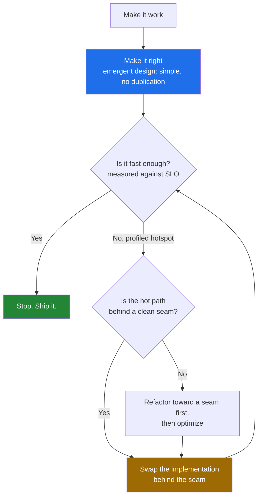

# Emergent Design — Optimize & Reconcile

> Emergent design (Kent Beck's four rules: passes tests → reveals intent → no duplication → fewest elements) and performance are usually allies, not enemies. The same speculative abstraction that hurts readability — an indirection layer for a second use case that never arrives — also costs cycles: a virtual call, a map lookup, a cache miss. This file works the seam between *simple design* and *fast code* through 12 scenarios. The governing law is Knuth's, quoted in full because the truncated version misleads: *"We should forget about small efficiencies, say about 97% of the time: premature optimization is the root of all evil. Yet we should not pass up our opportunities in that critical 3%."* Emergent design is how you stay able to find — and fix — that 3% later.

---

## Table of Contents

1. [The config-driven engine slower than a `switch`](#scenario-1--the-config-driven-engine-slower-than-a-switch)
2. [Speculative interface adds a megamorphic call site](#scenario-2--speculative-interface-adds-a-megamorphic-call-site)
3. [Rule-of-three for optimization: don't tune the unmeasured path](#scenario-3--rule-of-three-for-optimization-dont-tune-the-unmeasured-path)
4. [When DRY hurts: a generic routine slower than two specialized ones](#scenario-4--when-dry-hurts-a-generic-routine-slower-than-two-specialized-ones)
5. [YAGNI for performance: the cache nobody needed](#scenario-5--yagni-for-performance-the-cache-nobody-needed)
6. [The async pipeline that added latency](#scenario-6--the-async-pipeline-that-added-latency)
7. [Clean seams = cheap to swap a hot implementation](#scenario-7--clean-seams--cheap-to-swap-a-hot-implementation)
8. [Inline the wrong abstraction as a perf win](#scenario-8--inline-the-wrong-abstraction-as-a-perf-win)
9. [The object pool that fought the allocator](#scenario-9--the-object-pool-that-fought-the-allocator)
10. [Premature `Strategy` defeats the JIT](#scenario-10--premature-strategy-defeats-the-jit)
11. [Generic `Repository<T>` that can't use the fast query](#scenario-11--generic-repositoryt-that-cant-use-the-fast-query)
12. [Simplicity coincides with speed: deleting the layer](#scenario-12--simplicity-coincides-with-speed-deleting-the-layer)
13. [Rules of Thumb](#rules-of-thumb)
14. [Related Topics](#related-topics)

---



The diagram encodes the order *make it work, make it right, make it fast* — with the crucial loop-back: you only enter the optimize path after a measurement says you must, and emergent design (the clean seam at step E) is what makes the swap at F cheap.

---

### Scenario 1 — The config-driven engine slower than a `switch`

**Scenario.** A pricing module supports four discount types. An engineer, anticipating "many more discount rules," builds a rule engine: rules are loaded from YAML into a list of `Rule{Condition, Action}` objects, each condition a string expression evaluated by a small interpreter. Two years later there are still exactly four rules, and the engine is on the checkout hot path (8,000 req/s, called ~3× per request).

**Measurement / reasoning.** The interpreted path parses and walks an expression tree per evaluation. A microbenchmark on the four-rule set:

- Interpreted rule engine: **2,400 ns/op**, 6 heap allocations/op (boxed operands, tokenizer buffers).
- Hand-written `switch` over an enum: **18 ns/op**, 0 allocations.

That is a **130× gap**, and at 24,000 evaluations/s the engine alone burns ~58 ms of CPU per second — about 6% of one core, plus GC pressure from 144,000 allocs/s.

<details><summary>Resolution</summary>

The engine is *speculative generality* (Fowler's smell) wearing a performance costume. The "fewest elements" rule of emergent design already condemned it: four hard-coded rules need four lines, not an interpreter. Collapse it.

```go
type DiscountKind int

const (
    None DiscountKind = iota
    Seasonal
    Loyalty
    Bulk
    Coupon
)

// Direct, branch-predictable, zero-allocation.
func ApplyDiscount(kind DiscountKind, price Cents, ctx Context) Cents {
    switch kind {
    case Seasonal:
        return price - price*15/100
    case Loyalty:
        return price - loyaltyCut(ctx.Tier)
    case Bulk:
        if ctx.Qty >= 100 {
            return price * 90 / 100
        }
        return price
    case Coupon:
        return price - ctx.CouponValue
    default:
        return price
    }
}
```

The principled point: a config-driven engine pays for itself only when rules genuinely change at *runtime by non-engineers* and the rule count is large or volatile. Three rules that change once a quarter via a code deploy do not clear that bar. Knuth's "critical 3%" is the *checkout path*; the right action there is to make it fast by making it simple. The rule of three applies to the abstraction itself: extract the engine when you have the third real, *different* rule source — not the third imagined one.

</details>

---

### Scenario 2 — Speculative interface adds a megamorphic call site

**Scenario.** A serialization layer was written behind `interface Encoder { byte[] encode(Object o); }` "so we can swap formats." In practice JSON is the only implementation, but a logging refactor added two more (`ProtoEncoder`, `MsgpackEncoder`) used elsewhere. Now one hot call site — a request logger called 50,000×/s — sees all three implementations because the same `Encoder` field is reused across subsystems.

**Measurement / reasoning.** The JVM's JIT inlines and devirtualizes *monomorphic* (1 type) and *bimorphic* (2 types) call sites cheaply. At **3+ receiver types a call site becomes megamorphic**: the JIT falls back to a vtable/itable lookup and stops inlining through it.

- Monomorphic `encode` (JSON only, JIT inlines): **41 ns/op**.
- Megamorphic `encode` (3 types at the site): **190 ns/op** — inlining lost, plus a guard miss.

At 50,000/s that is ~7.5 ms/s of extra CPU, and worse, the *callee's* body no longer inlines into the logger, so escape analysis of the temporary `byte[]` fails and it heap-allocates.

<details><summary>Resolution</summary>

The interface itself is fine where polymorphism is real. The defect is *coupling unrelated call sites through one shared abstraction* — a violation of "fewest elements" applied to dependencies. Give the hot logger its own concrete dependency so its call site stays monomorphic.

```java
// Hot path holds the concrete type — monomorphic, fully inlined.
final class RequestLogger {
    private final JsonEncoder encoder; // not Encoder

    RequestLogger(JsonEncoder encoder) { this.encoder = encoder; }

    void log(Event e) {
        byte[] body = encoder.encode(e); // devirtualized + EA-friendly
        sink.write(body);
    }
}
```

Code paths that genuinely need format-swapping keep the `Encoder` interface. This is emergent design's intent rule: the logger's *intent* is "always JSON," so its type should say so. The interface was added speculatively for a swap that, on this path, never happened. Verify the win with `-XX:+PrintInlining` (look for `not inlining ... megamorphic`) before and after.

</details>

---

### Scenario 3 — Rule-of-three for optimization: don't tune the unmeasured path

**Scenario.** A new hire reads that string concatenation in loops is slow and rewrites every `+=` in the codebase to use a builder — including a config-file parser that runs **once at startup** over a 40-line file.

**Measurement / reasoning.** The startup parser's concatenation cost, measured: **0.3 ms total**, once per process lifetime. The builder rewrite saved ~0.28 ms of that. Meanwhile the change touched 30 files, made three of them harder to read, and introduced one bug (a builder reused across iterations, leaking previous lines).

The actual hotspot, found later with a profiler, was a JSON deserializer doing **140 ms** per request — untouched, because nobody measured.

<details><summary>Resolution</summary>

The rule of three has a performance analogue: **don't optimize a path until you've measured it three ways — that it is hot (in the profile), that it is on the critical path (affects an SLO), and that the optimization actually moves the number.** The startup parser fails all three. Revert it.

```python
# Startup parser: clarity wins. Runs once, cost is noise.
def parse_config(lines: list[str]) -> str:
    result = ""
    for line in lines:
        if not line.startswith("#"):
            result += line.strip() + ";"
    return result
```

The principle: *premature optimization is the root of all evil* most literally bites when you spend complexity budget on the 97%. Profile first. The builder belongs in the JSON deserializer's hot inner loop — where a measurement showed `String +=` was 12% of request time — not sprinkled by superstition. Emergent design says "make it right" before "make it fast"; the builder rewrite skipped the *measure* that licenses "fast."

</details>

---

### Scenario 4 — When DRY hurts: a generic routine slower than two specialized ones

**Scenario.** Two endpoints both "summarize records." DRY instinct merged them into one `summarize(records, opts SummaryOptions)` with eight boolean/option flags branching inside a tight loop. One caller needs only `sum`; the other needs `sum + histogram + percentiles`.

**Measurement / reasoning.** The merged loop checks eight flags per element. For the `sum`-only caller over 10M records:

- Generic `summarize` (8 branch checks/element, most disabled): **64 ms**, branch mispredicts visible in `perf stat` (~9% miss rate from data-dependent flags).
- Specialized `sumOnly`: **11 ms**, a single predictable accumulate loop the compiler vectorizes.

A **5.8× gap** on the common caller, caused by per-element configuration branches the CPU can't predict and the compiler can't hoist (the flags are runtime values).

<details><summary>Resolution</summary>

The duplication that DRY removed was *coincidental*, not *true* duplication. The two callers compute genuinely different things; forcing them through one parametric loop is a false abstraction. De-DRY by specializing the hot caller.

```go
// Hot, common caller: a clean tight loop the compiler can vectorize.
func SumOnly(records []Record) int64 {
    var total int64
    for _, r := range records {
        total += r.Value
    }
    return total
}

// Rich caller keeps its own routine; shared *leaf* helpers stay shared.
func FullSummary(records []Record) Summary {
    s := Summary{}
    for _, r := range records {
        s.Total += r.Value
        s.Hist.Add(r.Value)
    }
    s.Percentiles = s.Hist.Percentiles(50, 95, 99)
    return s
}
```

When is specializing *wrong*? When the bodies truly are the same logic and the flags are compile-time constant (then a templated/generic form with the compiler eliminating dead branches is both DRY and fast). The test: if removing the duplication forces *runtime* branching in a hot loop, the abstraction costs more than the copy. Sandi Metz's "duplication is far cheaper than the wrong abstraction" is, here, a performance statement too.

</details>

---

### Scenario 5 — YAGNI for performance: the cache nobody needed

**Scenario.** A `UserService.getProfile(id)` was wrapped in a hand-rolled LRU cache with TTL, invalidation hooks, and a background refresher — built "because profiles will be read-heavy." Production telemetry six months in: the backing query is a single indexed primary-key lookup.

**Measurement / reasoning.**

- Uncached PK lookup (Postgres, index hit, pooled connection): **0.4 ms p50, 1.1 ms p99**.
- Cached path: **0.05 ms on hit**, but: a 92% hit rate means 8% pay full cost *plus* the cache miss/insert overhead, and the cache introduced two production incidents — a stale-profile bug after a privacy setting change, and a thundering-herd on cold start that hammered the DB harder than no cache would have.

Net latency saved at the service's actual 300 req/s: negligible against the SLO (200 ms). Net engineering and incident cost: high.

<details><summary>Resolution</summary>

YAGNI applies to performance machinery exactly as it applies to features. A cache, a pool, an async pipeline — each is a *speculative optimization* until a measurement shows the unoptimized path misses an SLO. A 0.4 ms query against a 200 ms budget is the 97% Knuth says to forget.

```python
# No cache. The index *is* the optimization. Add caching the day
# the profile read shows up in the slow-query log AND misses the SLO.
class UserService:
    def get_profile(self, user_id: int) -> Profile:
        return self.repo.find_by_id(user_id)  # PK lookup, 0.4 ms
```

The deeper reconciliation with emergent design: a cache is *added complexity* (more elements, an invalidation problem — "one of the two hard things"). Emergent design's fourth rule says minimize elements; YAGNI-for-perf is the same rule applied to the time axis. Keep the seam (`repo.find_by_id`) clean, and caching becomes a one-line decorator *if and when* the data demands it — see Scenario 7.

</details>

---

### Scenario 6 — The async pipeline that added latency

**Scenario.** A request handler did three sequential calls: validate (CPU, 0.1 ms), enrich (one DB read, 2 ms), respond. Anticipating "high throughput," an engineer rebuilt it as a multi-stage async pipeline with bounded channels between stages and a worker pool per stage.

**Measurement / reasoning.** For a request that is *latency*-bound (one user waiting), not *throughput*-bound:

- Synchronous handler: **2.1 ms p50**.
- Pipelined handler: **2.1 ms of real work + 1.4 ms of queueing/handoff/goroutine-scheduling overhead = 3.5 ms p50**, with a fat tail (p99 jumped from 4 ms to 19 ms) from channel contention and scheduler latency under load.

The pipeline helps only when stages can run *concurrently across many in-flight requests* and a stage is the bottleneck. Here each request flows through stages sequentially anyway; the channels added handoff cost and a queueing-theory tail with no parallelism win.

<details><summary>Resolution</summary>

Asynchrony is not free speed; it trades latency and complexity for *throughput under contention* and *I/O overlap*. A sequential, I/O-light handler wants to stay sequential. Inline the pipeline back.

```go
func Handle(req Request) (Response, error) {
    if err := validate(req); err != nil {  // 0.1 ms, CPU
        return Response{}, err
    }
    data, err := enrich(req.ID)             // 2 ms, one DB read
    if err != nil {
        return Response{}, err
    }
    return respond(data), nil
}
```

If profiling later shows `enrich` *and* a second independent I/O can overlap, introduce concurrency *at that point* with `errgroup` — a targeted change behind the same function boundary. The order holds: it worked synchronously; it was right (simple); only a measured throughput ceiling licenses the async machinery. Premature async is premature optimization with a worse tail latency.

</details>

---

### Scenario 7 — Clean seams = cheap to swap a hot implementation

**Scenario.** Same `UserService` from Scenario 5. Six more months pass; the company adds a feed feature and profile reads jump to 40,000 req/s, now genuinely DB-bound (the index lookups saturate connection-pool capacity, p99 climbs to 60 ms). *Now* a cache is warranted. How much does emergent design's discipline pay off here?

**Measurement / reasoning.** Because the code kept a clean seam — every read went through `repo.find_by_id(id)` and nothing reached around it — adding a read-through cache is a **localized, ~15-line change** behind that seam. Measured result after the swap:

- Before cache: **p99 60 ms**, pool at 95% utilization.
- After read-through cache (94% hit): **p99 3 ms**, pool at 22% utilization.

The change touched one file. Contrast a hypothetical codebase where 30 call sites had reached into `repo` or hand-built queries inline: the same optimization would be a multi-week, multi-file, bug-prone migration.

<details><summary>Resolution</summary>

This is the payoff thesis of the whole file: **emergent design keeps you able to optimize later.** Simple design's "no duplication / fewest elements" produces single, clean choke points — seams — and a seam is exactly where you swap a slow implementation for a fast one without disturbing callers.

```python
class CachedUserRepo:
    def __init__(self, inner: UserRepo, cache: Cache):
        self._inner, self._cache = inner, cache

    def find_by_id(self, user_id: int) -> Profile:
        if (hit := self._cache.get(user_id)) is not None:
            return hit
        profile = self._inner.find_by_id(user_id)   # same seam
        self._cache.set(user_id, profile, ttl=60)
        return profile

# Wiring change only — callers untouched:
#   service = UserService(CachedUserRepo(PgUserRepo(pool), redis))
```

The optimization arrived *when the measurement demanded it* (Scenario 5's YAGNI held until 40k req/s), and it was *cheap because the design was clean*. Premature caching would have paid the complexity cost for years; clean-seam caching paid it in the one week it mattered. That is Knuth's "critical 3%" handled correctly: you waited, you measured, and the design let you act fast.

</details>

---

### Scenario 8 — Inline the wrong abstraction as a perf win

**Scenario.** A geometry library extracted a `Vector2` value type with `Add`, `Scale`, `Dot` methods to keep a particle simulation "clean." The simulation's hot integrator does `pos = pos.Add(vel.Scale(dt))` per particle, 2M particles, 60 fps.

**Measurement / reasoning.** In Java, each `Vector2` is a heap object; the intermediate `vel.Scale(dt)` allocates a temporary per particle per frame = **120M allocations/s**, driving GC to 30% CPU and causing frame-time spikes (p99 frame 38 ms, missing the 16.6 ms budget). Even in Go/C# with value structs, method-call boundaries blocked the field-level fusion the compiler could otherwise do; SIMD vectorization across the particle array was impossible because data was array-of-structs accessed through method calls.

- Abstracted `Vector2` integrator (Java): **22 ms/frame**, heavy GC.
- Inlined component arithmetic over `float[] posX, posY, velX, velY`: **2.4 ms/frame**, zero allocation, auto-vectorized.

A **9× win** in the inner loop.

<details><summary>Resolution</summary>

The `Vector2` abstraction is correct *almost everywhere* in the library — it reveals intent and removes duplication for the 99% of cold code. The integrator is the measured 3%. Inline the abstraction *only there*, switching to a struct-of-arrays layout the hardware loves.

```java
// Hot integrator: inlined, struct-of-arrays, vectorizable. NOT how the
// rest of the library is written — this is the deliberate 3%.
void integrate(float[] posX, float[] posY,
               float[] velX, float[] velY, float dt, int n) {
    for (int i = 0; i < n; i++) {        // auto-vectorizes
        posX[i] += velX[i] * dt;
        posY[i] += velY[i] * dt;
    }
}
```

Keep `Vector2` for the cold API surface. This is the inverse of extraction: *Inline Function / Inline Class* used as a performance tool, applied surgically where a profiler pointed. The principled boundary: the abstraction stays the default; you inline it at exactly the call site the measurement condemns, and you comment *why* so the next reader doesn't "clean it up" back into slowness.

</details>

---

### Scenario 9 — The object pool that fought the allocator

**Scenario.** A request decoder allocated a `Buffer` per request. Worried about GC, an engineer added a `sync.Pool` / object pool "to reduce allocations," sized and tuned with several knobs, before any GC problem was observed.

**Measurement / reasoning.** Modern allocators (Go's per-P caches, the JVM's TLAB bump-pointer allocation) make short-lived allocations extremely cheap and *collect them as a batch*.

- Per-request fresh `Buffer` (Go, escapes to heap): **alloc ~30 ns**, dies young, collected by the cheap young-gen / sweep path.
- Pooled `Buffer`: pool `Get`/`Put` ~**25 ns each = 50 ns**, *plus* the pool keeps buffers alive long enough that they survive a GC cycle and get *promoted*, increasing the live set and **lengthening GC pauses** — the opposite of the goal. One incident: a pooled buffer was returned to the pool before a goroutine finished reading it → data corruption.

Net: the pool was slower *and* introduced a correctness bug.

<details><summary>Resolution</summary>

Pooling is a real tool for *large* or *expensive-to-construct* objects (e.g., 1 MB decompression buffers, DB connections) where allocation/init genuinely dominates. For small, short-lived objects it fights a GC that is already optimized for them. YAGNI: don't pool until a profiler shows allocation is the bottleneck.

```go
// Let the allocator do its job. It is very good at short-lived objects.
func decode(r io.Reader) (*Message, error) {
    buf := make([]byte, 0, 4096) // young-gen, collected cheaply
    // ... fill buf, parse ...
    return parse(buf)
}
```

If allocation *is* shown to dominate (e.g., a 64 KB buffer per request at 100k req/s), then pool — but pool the *large* object, with strict ownership (clear-on-`Put`, never `Put` until the last reader is done). The reconciliation: emergent design says start with the simplest thing (a plain allocation); the pool is added complexity that must be earned by measurement, and unearned it can make things *both* slower and buggier.

</details>

---

### Scenario 10 — Premature `Strategy` defeats the JIT

**Scenario.** A `Comparator`-style sort key was abstracted behind a `Strategy` interface with pluggable comparison functions "in case sorting rules change." One report sorts 5M rows by a single integer column through this strategy.

**Measurement / reasoning.** Sorting through a function-pointer/interface comparator prevents the compiler from inlining the comparison into the sort's inner loop and from specializing the swap/branch logic.

- Generic comparator-driven sort (Java `Comparator<Row>` of one field): **1,850 ms** for 5M rows; the lambda's `compare` is a non-inlined call 5M·log(5M) ≈ 115M times.
- Specialized primitive sort (`long[]` keys, `Arrays.sort`): **210 ms** — branchless dual-pivot quicksort over primitives, no boxing, no call overhead.

An **8.8× gap** from the indirection on the comparison hot path, plus boxing of every `Integer` key in the generic path.

<details><summary>Resolution</summary>

The `Strategy` abstraction earns its place when comparison rules *actually vary at runtime* across many call sites. For the one report that always sorts by one integer, the abstraction is speculative and the cost is on the hottest possible loop.

```java
// Extract the keys into a primitive array, sort that, reorder once.
long[] keys = new long[rows.size()];
for (int i = 0; i < keys.length; i++) keys[i] = rows.get(i).amount();
int[] order = sortIndicesByKey(keys);     // primitive sort, branchless
List<Row> sorted = reorder(rows, order);  // single gather pass
```

When *is* the strategy right? When you genuinely have N comparison rules selected at runtime and N is open-ended — then the polymorphism is true, not speculative, and the per-call cost is the price of a real requirement (and you can still extract a primitive key per strategy). The rule: keep `Strategy` for true variation; for the single fixed hot sort, simplest-thing-that-works is also fastest. Verify with `-XX:+PrintInlining` showing the comparator call was the un-inlined frame.

</details>

---

### Scenario 11 — Generic `Repository<T>` that can't use the fast query

**Scenario.** A generic `Repository<T>` exposes `findAll()`, `findById()`, `save()` for every entity, built early "for consistency." A dashboard needs the *count of active orders grouped by region* — and through the generic repo it does `repo.findAll().stream().filter(...).collect(groupingBy(...))`.

**Measurement / reasoning.** The generic interface only offers row-returning methods, so the aggregation happens in application memory after loading every row.

- Generic-repo path: `SELECT * FROM orders` → **1.2M rows over the wire (180 MB)**, deserialized into 1.2M objects, then grouped in the JVM: **4,300 ms**, 1.2M allocations, plus DB and network saturation.
- A purpose-built query: `SELECT region, COUNT(*) FROM orders WHERE active GROUP BY region` → **22 rows, 14 ms**, the database's index and aggregation engine doing the work.

A **300× gap** because the generic abstraction *cannot express* the fast query — it forces every read into "load all rows."

<details><summary>Resolution</summary>

A premature generic `Repository<T>` optimizes for *uniformity of code shape* at the cost of *expressiveness*, and the database's whole value is the expressiveness the generic interface throws away. Add a specific method that lets the DB do its job.

```java
public interface OrderQueries {
    // The DB aggregates; the app receives 22 rows, not 1.2M.
    List<RegionCount> activeCountByRegion();
}

// SQL: SELECT region, COUNT(*) FROM orders WHERE active GROUP BY region
```

This is de-DRY at the data layer: the generic CRUD repo stays for simple entity access, but query-shaped needs get query-shaped methods. Emergent design's "reveal intent" rule already wanted this — `activeCountByRegion()` *names the intent*; `findAll().stream()...` hides it inside a generic loop. The performance fix and the clarity fix are the same fix. The seam stays clean (an interface), but it now exposes the operation the use case actually needs.

</details>

---

### Scenario 12 — Simplicity coincides with speed: deleting the layer

**Scenario.** A "clean architecture" pass added a chain for a trivial read: `Controller → Facade → Service → Manager → Repository → DAO`, each layer mapping the same `User` into a slightly different DTO (`UserResponse`, `UserModel`, `UserEntity`, `UserRecord`). The endpoint does nothing but return one user by id.

**Measurement / reasoning.** Each layer is a method call plus an object mapping (field-by-field copy) plus an allocation.

- Six-layer path: 5 DTO mappings, 5 intermediate allocations, 6 stack frames: **measured 0.9 ms/call of pure mapping/dispatch overhead** on top of the 0.4 ms query — i.e., the *plumbing* more than doubled the cost, and produced 5 garbage objects per request (×8,000 req/s = 40,000 allocs/s of pure waste).
- Collapsed path (controller → repository → response): 1 mapping, 1 allocation, **0.15 ms overhead**.

The layers added no behavior, no test seam anyone used, and no flexibility ever exercised — only cost and reading friction.

<details><summary>Resolution</summary>

The clearest demonstration that *simplicity and speed coincide*. Emergent design's fourth rule — fewest elements — would have rejected five pass-through layers for a CRUD read; doing so also deletes five allocations and five mappings per request.

```python
# Each layer must earn its existence with behavior or a real seam.
@router.get("/users/{user_id}")
def get_user(user_id: int) -> UserResponse:
    user = repo.find_by_id(user_id)       # one real seam
    return UserResponse.from_entity(user) # one mapping, at the boundary
```

The reconciliation: layers are valuable when they hold *real* responsibility (a service that orchestrates a transaction across repositories; a boundary DTO that decouples wire format from domain). They are pure cost when they only forward calls and re-map identical fields. Removing speculative layers is simultaneously a clarity refactor *and* a performance optimization — you rarely get to make that trade so cheaply. When the rare future need for a layer arrives, the clean seam (Scenario 7) lets you insert it then, paid for by the requirement that finally justifies it.

</details>

---

## Rules of Thumb

- **Make it work, make it right, make it fast — in that order, and only step to "fast" on a measurement.** Most speculative-design slowness is fixed by *making it right* (simpler), not by a separate optimization pass. The "make it fast" step is the 3%.
- **Quote Knuth in full.** "We should forget about small efficiencies, say 97% of the time" *and* "we should not pass up our opportunities in that critical 3%." Emergent design's job is to keep you cheaply able to act on the 3% — see [Scenario 7](#scenario-7--clean-seams--cheap-to-swap-a-hot-implementation).
- **Simplicity usually coincides with speed.** Fewer elements, fewer indirections, fewer allocations. A `switch` beats an interpreter; a deleted layer beats a tuned one. When clarity and performance disagree, suspect you have the wrong abstraction.
- **Rule of three for optimization.** Don't tune a path until you've measured (1) it's hot in the profile, (2) it's on the critical path/SLO, (3) the change actually moves the number. Superstition-driven rewrites cost complexity for ~0 ms — see [Scenario 3](#scenario-3--rule-of-three-for-optimization-dont-tune-the-unmeasured-path).
- **DRY has a performance edge case.** A generic routine that branches per-element on runtime flags can be multiples slower than two specialized loops the compiler can vectorize. If removing duplication forces runtime branching in a hot loop, the abstraction costs more than the copy.
- **YAGNI covers performance machinery.** Caches, pools, async pipelines are speculative until a measurement shows the simple path misses an SLO. Unearned, they add complexity and often make things *both* slower and buggier ([Scenario 9](#scenario-9--the-object-pool-that-fought-the-allocator)).
- **Watch the megamorphic call site.** Sharing one polymorphic abstraction across unrelated hot call sites can defeat JIT inlining and escape analysis. Give a hot path the concrete type its intent already implies.
- **Inline the wrong abstraction surgically.** Use Inline Function/Class as a performance tool *only* at the profiled hotspot, keep the abstraction everywhere else, and comment why — so the next reader doesn't "clean it" back to slow.
- **Keep seams clean so optimization stays cheap.** The single choke point that emergent design produces is exactly where you swap a slow implementation for a fast one without touching callers.
- **Generic interfaces can hide the fast path.** A `Repository<T>` that only returns rows forces "load everything, compute in app." Add the query-shaped method that lets the engine (DB, etc.) do the work — the clarity fix and the perf fix are the same fix.
- **Benchmark, then believe.** Use JMH (Java), `go test -bench` + `-gcflags=-m` (Go), `pyperf`/`timeit` + `cProfile` (Python). Numbers in this file are illustrative shapes; produce your own before and after on your hardware and JIT.

---

## Related Topics

- [README.md](README.md) — the four rules of emergent/simple design (the positive principles these scenarios reconcile with performance).
- [find-bug.md](find-bug.md) — spot the defect in code that looks like clean emergent design but is wrong (correctness sibling to this perf file).
- [professional.md](professional.md) — senior-level judgment on when to abstract and when to wait, the YAGNI/rule-of-three calls behind several scenarios here.
- [../09-classes/README.md](../09-classes/README.md) — small-class and single-responsibility design; Scenarios 2, 11, and 12 turn on class/interface boundaries.
- [../../refactoring/README.md](../../refactoring/README.md) — Inline Function/Class, Move Method, and the smell catalog (Speculative Generality) used as the optimization moves in Scenarios 1, 8, and 12.
