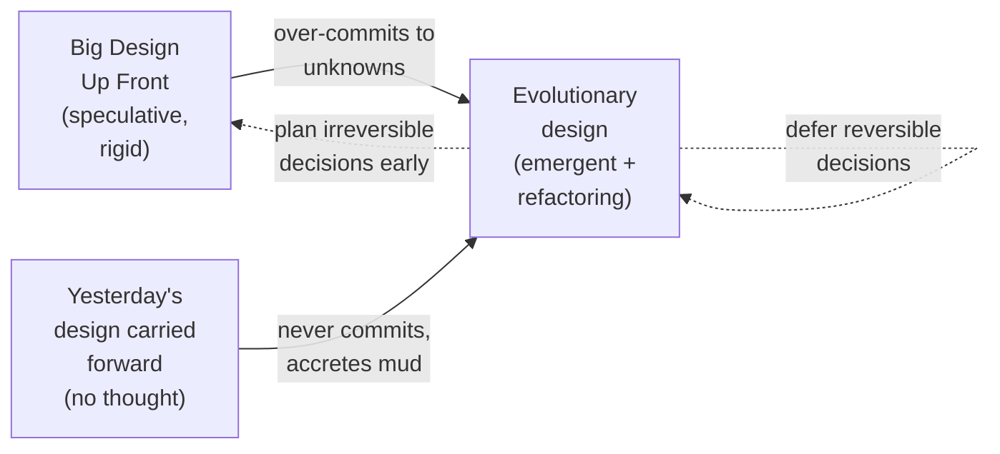
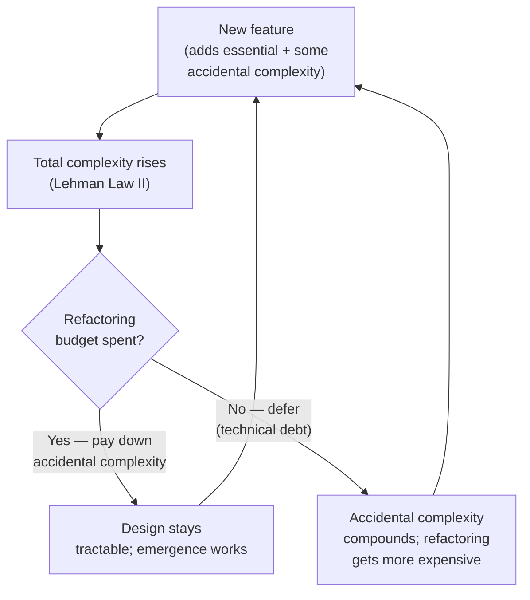

# Emergent Design — Professional Level

> Focus: the deep end and the genuine debates. Emergent vs. up-front design as a real engineering tension, not a slogan. Where Kent Beck's four rules of Simple Design hold, where they break, and what changes when the thing you'd "just refactor" is a wire protocol, a database schema, or a published API that you cannot reverse.

---

## Table of Contents

1. [The actual debate: "Is Design Dead?"](#the-actual-debate-is-design-dead)
2. [Accidental vs. essential complexity (Brooks)](#accidental-vs-essential-complexity-brooks)
3. [The four rules as a value statement — and its critics](#the-four-rules-as-a-value-statement--and-its-critics)
4. [DRY is about knowledge, not text](#dry-is-about-knowledge-not-text)
5. [The counter-discipline: WET, AHA, rule of three](#the-counter-discipline-wet-aha-rule-of-three)
6. [The wrong-abstraction lifecycle and the courage to inline](#the-wrong-abstraction-lifecycle-and-the-courage-to-inline)
7. [When you can't refactor freely: schemas, protocols, distributed systems](#when-you-cant-refactor-freely-schemas-protocols-distributed-systems)
8. [Complexity accretes: Lehman's laws](#complexity-accretes-lehmans-laws)
9. [Cost of deferral: the options view of architecture](#cost-of-deferral-the-options-view-of-architecture)
10. [Common Mistakes](#common-mistakes)
11. [Test Yourself](#test-yourself)
12. [Cheat Sheet](#cheat-sheet)
13. [Summary](#summary)
14. [Further Reading](#further-reading)
15. [Related Topics](#related-topics)

---

## The actual debate: "Is Design Dead?"

The chapter rules — Beck's four rules of Simple Design, refactor mercilessly, let the design emerge — are not uncontested folklore. They were a deliberate provocation aimed at the prevailing 1990s practice of *Big Design Up Front* (BDUF): produce a complete UML model and a layered architecture document before writing code, then "just implement it."

Martin Fowler's essay **"Is Design Dead?"** (2004) is the load-bearing text here, and its conclusion is more careful than either camp's caricature:

> "Design is far from dead, but its nature has changed considerably. XP requires a discipline whereby people evolve a simple design through refactoring. To make this work you need design skills, you just apply them differently." — Fowler, *Is Design Dead?*

Fowler's distinction is between **planned design** and **evolutionary design**, and his point is that *both* exist in XP — the planned portion just shrank, and the refactoring discipline grew to compensate. The failure mode of pure emergence is what he calls **"design as an afterthought"**: teams that hear "the design will emerge" and interpret it as license to never think structurally, producing not emergent design but accreted mud.

The honest professional position is a spectrum, not a binary:



The axis that actually matters is **reversibility**, which Fowler later crystallized in his "irreversibility" criterion (and which Jeff Bezos popularized as **Type 1 vs. Type 2 decisions** — one-way vs. two-way doors). Emergent design works beautifully for reversible decisions because the cost of being wrong is one refactor. It is dangerous for irreversible ones, where being wrong costs a migration, a deprecation cycle, or a multi-team coordination problem.

> **Professional reframing:** "Let the design emerge" is sound advice *exactly to the degree that refactoring is cheap*. The job of a senior engineer is to identify the small set of decisions where refactoring is *not* cheap, and to spend up-front design budget there — and only there.

---

## Accidental vs. essential complexity (Brooks)

Beck's first goal — "runs all the tests" — and the three quality rules that follow are an attack on **accidental complexity**: complexity we introduce ourselves through poor structure, duplication, and bad names. Fred Brooks' **"No Silver Bullet" (1986)** gives the vocabulary that lets you reason about the *limit* of this attack:

> "The essence of a software entity is a construct of interlocking concepts... I believe the hard part of building software to be the specification, design, and testing of this conceptual construct, not the labor of representing it and testing the fidelity of the representation." — Brooks, *No Silver Bullet*

- **Essential complexity** is inherent in the problem domain. Tax law is complicated; a correct tax engine is irreducibly complicated. No amount of clean code removes it.
- **Accidental complexity** is the gap between the problem's essential difficulty and the difficulty your implementation actually imposes. Callback pyramids, leaky abstractions, duplicated business rules — these are accidental.

Why this matters for emergent design: **the four rules of Simple Design can only remove accidental complexity.** When a senior engineer says "this code is complex but it's *essential* complexity," they are making a falsifiable claim — that no restructuring will reduce the cognitive load, because the domain itself carries that load. Juniors frequently misclassify essential complexity as accidental and chase a "clean" rewrite that simply re-discovers the same essential difficulty in new clothes.

Brooks' deeper warning is that we had already harvested most of the *order-of-magnitude* accidental-complexity wins (high-level languages, GC, IDEs) by 1986, so future gains would be incremental. Emergent design is one of those incremental disciplines — valuable, not magical. It does not promise the 10x productivity "silver bullet" that Brooks said does not exist.

---

## The four rules as a value statement — and its critics

Beck's rules, in priority order:

1. Passes all the tests.
2. Reveals intention (clear, expressive).
3. No duplication (DRY).
4. Fewest elements (small).

The **ordering is itself the design philosophy.** It is a tie-breaker, not a checklist: when two rules conflict, the higher one wins. "Passes the tests" beats everything — a clean design that is wrong is worthless. Then expressiveness beats DRY, and both beat minimality.

Corey Haines, in **"Understanding the Four Rules of Simple Design" (2014)**, argues that rules 2 and 3 are in productive tension and the ordering matters precisely *because* aggressive DRY can destroy expressiveness. If removing the last shred of duplication requires an abstraction so generic that no reader can tell what it does, rule 2 (reveal intention) should win and you should *keep* the duplication. Uncle Bob (Robert C. Martin) and Fowler both place expressiveness above DRY for the same reason.

The most cited critique of the ranking is that **rule 3 (DRY) is dangerous when applied mechanically before the domain is understood.** Sandi Metz's now-canonical line — *"duplication is far cheaper than the wrong abstraction"* — is effectively an argument that early in a design's life, rule 2 should suppress rule 3 entirely, because you cannot yet name the abstraction correctly.

```go
// Rule 3 applied too eagerly: "no duplication" achieved, intention destroyed.
func Process(kind string, data any, flag bool, mode int) any {
    // 200 lines of switch-on-kind that "unifies" four unrelated operations
    // because each had a similar-looking 5-line preamble.
}

// Rules 2-then-3: keep them separate until the SHARED KNOWLEDGE is proven.
func ApplyDiscount(o Order) Money { /* ... */ }
func ApplyTax(o Order) Money      { /* ... */ }
// The 5-line preamble repeats. That is acceptable: the operations encode
// different business knowledge that happens to look textually similar today.
```

> **The value statement in one sentence:** *correct, then clear, then non-redundant, then small.* If you ever find yourself making code smaller at the expense of clarity, or DRY at the expense of revealing intent, you have inverted Beck's priorities.

---

## DRY is about knowledge, not text

The single most misunderstood principle in this chapter. The Pragmatic Programmers (Andy Hunt & Dave Thomas) defined DRY precisely in *The Pragmatic Programmer* (1999, 20th-anniversary ed. 2019):

> "Every piece of **knowledge** must have a single, unambiguous, authoritative representation within a system." — Hunt & Thomas, *The Pragmatic Programmer*

The operative word is **knowledge**, not code. In the 20th-anniversary edition they explicitly correct the field's misreading:

> "DRY is about the duplication of knowledge, of intent. It's about expressing the same thing in two different places, possibly in two totally different ways... If you've got the same code in two places, that's not necessarily a violation of DRY."

Two consequences that distinguish the professional from the intermediate:

**1. Two pieces of identical code can be correct and non-duplicative.** A `validatePostalCode` in the shipping module and a textually identical one in the billing module are *not* a DRY violation if shipping postal codes and billing postal codes are different *knowledge* that may evolve independently. Coupling them "to remove duplication" creates a false dependency — a change to one is forced onto the other.

**2. Two pieces of different-looking code can be a DRY violation.** A business rule encoded once in a Java validation annotation and again in a SQL `CHECK` constraint and again in a frontend form validator is *triplicated knowledge* even though no two lines match. This is the hard, valuable DRY work: detecting the *same intent* expressed in different representations.

```python
# NOT a DRY violation — coincidental textual similarity, independent knowledge:
def is_valid_us_zip(s: str) -> bool:      # shipping
    return len(s) == 5 and s.isdigit()
def has_five_digits(pin: str) -> bool:     # auth PIN — same code, different knowledge
    return len(pin) == 5 and pin.isdigit()

# IS a DRY violation — same knowledge, three representations that WILL drift:
#   - Pydantic model:  age: int = Field(ge=18)
#   - SQL:             CHECK (age >= 18)
#   - JS form:         if (age < 18) reject()
# The rule "users must be adults" lives in three places. Generate from one source
# (code-gen, JSON Schema, a shared rules service) or you will ship the bug where
# the API accepts 17 but the DB rejects it.
```

The mechanical de-duplicator chases rule 1. The professional chases rule 2 and *tolerates* rule 1, because conflating coincidental duplication causes worse coupling than the duplication it removes. This is **DRY's deep form**, and it is the form Beck's rule 3 actually intends.

---

## The counter-discipline: WET, AHA, rule of three

Because eager DRY is so destructive, the field developed explicit counter-disciplines:

- **Rule of Three** (Fowler, *Refactoring*, attributed to Don Roberts): "The first time you do something, you just do it. The second time you do something similar, you wince at the duplication, but you do the duplicate thing anyway. The third time you do something similar, you refactor." Two occurrences are not enough evidence to name an abstraction; three give you enough variation to see the *true* shape.

- **WET** — "Write Everything Twice" (or "We Enjoy Typing"): a deliberately provocative inversion reminding teams that some duplication is the correct default until the abstraction is earned.

- **AHA** — "Avoid Hasty Abstractions" (Kent C. Dodds, 2019): "prefer duplication over the wrong abstraction" and "optimize for change first." The name reframes the goal: the sin is not duplication, it is *prematurity*. AHA explicitly subsumes both DRY and WET — be DRY when the knowledge is proven shared, be WET when it isn't, and the deciding evidence is observed change, not observed similarity.

```java
// Rule of three in practice. Occurrence #1 and #2: duplicate, do not abstract.
BigDecimal shipTotal = items.stream()
    .map(i -> i.price().multiply(BigDecimal.valueOf(i.qty())))
    .reduce(BigDecimal.ZERO, BigDecimal::add);

// Occurrence #3 appears (refund totals, invoice totals). NOW you can see the
// invariant shape and the points of variation, so extraction reveals intent
// rather than guessing it:
static BigDecimal sumOf(List<LineItem> items, Function<LineItem, BigDecimal> amount) {
    return items.stream().map(amount).reduce(BigDecimal.ZERO, BigDecimal::add);
}
```

The synthesis: **DRY, the rule of three, WET, and AHA are not contradictory — they are a single decision procedure parameterized by evidence.** Duplicate freely until you have (a) three or more occurrences and (b) confidence that they encode the *same knowledge*, not coincidentally similar text. Only then is the abstraction *earned*.

---

## The wrong-abstraction lifecycle and the courage to inline

Sandi Metz's **"The Wrong Abstraction" (2016)** describes the failure mode that pure emergent design produces when the rule of three is ignored. It is worth tracing the lifecycle because recognizing it is a senior skill:

1. A programmer sees duplication and extracts an abstraction. Good so far.
2. The abstraction is *re-used* by other programmers, who pass it parameters and flags to make it fit their slightly-different cases.
3. Over time the abstraction sprouts conditionals: `if special_case`, `mode`, `options` bags. Each new caller adds one.
4. The abstraction now serves N callers, none of them well. It is a tangle of flags whose combinations no one fully understands.
5. New programmers are afraid to touch it (it's used everywhere) so they add *another* flag rather than fix it. Go to step 3.

> "Existing code exerts a powerful influence. Its very presence argues that it is both correct and necessary... New requirements add additional layers on top. Loops are extended to handle new cases. Variables and methods are renamed to make them more general. Eventually the code is incomprehensible." — Metz, *The Wrong Abstraction*

Metz's prescription is the part that takes courage:

> "Your goal is to **re-introduce duplication** by inlining the abstracted code back into every caller. Once you have done this, the original abstraction is gone... you can find a better one."

This **inline-then-re-abstract** maneuver is the inverse of Extract — it is *Inline Function* / *Inline Class* (see [`../../refactoring/README.md`](../../refactoring/README.md)) applied deliberately to demolish a bad abstraction so a better one can emerge. The emotional barrier — sunk-cost attachment to existing structure — is the real obstacle, not the mechanics.

```python
# The wrong abstraction, mid-rot. Every caller pays for every other caller's flags.
def render(node, *, html=False, markdown=False, truncate=None,
           strip_tags=False, for_email=False, legacy_mode=False):
    ...  # 80 lines of interacting conditionals; nobody knows the safe combinations

# The courageous move (Metz): inline it back into each caller, accept the
# temporary duplication, THEN extract the abstraction the callers actually share.
def render_html(node): ...        # was render(node, html=True)
def render_email(node): ...       # was render(node, for_email=True, strip_tags=True)
# Three honest functions beat one dishonest one. A real shared core may re-emerge
# — or may not, and that is also fine.
```

The lesson for emergent design: **emergence is not monotonic.** Designs improve by *removing* structure as often as by adding it. A team that only ever extracts, and never inlines, will eventually drown in abstractions that emerged too early.

---

## When you can't refactor freely: schemas, protocols, distributed systems

The entire emergent-design argument rests on one assumption: **refactoring is cheap and local.** Inside a single deployable, with good tests, that holds. It collapses precisely where the artifact has *external consumers you do not control or cannot atomically deploy with.*

This is the most important professional caveat in the chapter, and it is where naïve "just let it emerge" advice does real damage.

**1. Database schemas.** You cannot `Rename Column` on a 2-billion-row table in a single transaction without downtime, and you cannot do it at all if another service reads that column. Schema evolution must follow **expand/contract (parallel-change)**: add the new shape, dual-write, backfill, migrate readers, then remove the old shape — a multi-deploy, multi-week dance. The "refactor" is a *distributed protocol*, not an IDE keystroke.

**2. Wire protocols and event schemas.** A field in a Protobuf/Avro/JSON message consumed by other teams is a published contract. You can add optional fields (forward/backward compatible) but you cannot rename or repurpose one freely. Confluent's **schema-compatibility modes** (BACKWARD, FORWARD, FULL) exist precisely to mechanize this constraint. Events are worse than APIs because *old events persist* — a Kafka topic with 90-day retention means your new code must read messages written by code from 90 days ago.

**3. Public/partner APIs.** Once `GET /v1/orders` is documented and integrated by external clients, its shape is frozen for the life of `v1`. "Emergent" changes require versioning, deprecation windows (often 6–24 months), and parallel maintenance.

```protobuf
// SAFE emergent evolution — additive only, never reuse a field number:
message Order {
  string id = 1;
  Money total = 2;
  // string customer_name = 3;   // DEPRECATED — do NOT delete, do NOT reuse tag 3
  Customer customer = 4;          // new richer representation, added alongside
  reserved 3;                     // tag 3 is now poisoned forever
  reserved "customer_name";
}
// "Refactoring" customer_name -> customer is a months-long dual-write migration
// across every producer and consumer, NOT a rename.
```

The governing principle here is **Postel's Law / the robustness principle** ("be conservative in what you send, liberal in what you accept") and **tolerant readers** — patterns that *make* emergence possible across a boundary by decoupling producer and consumer evolution. Where you cannot apply them, emergent design degrades to up-front design by necessity: the cost of being wrong is a migration, so you spend design budget *before* shipping the schema. This is the reversibility axis from §1, made concrete.

> **Professional rule:** the blast radius of a refactor sets the design budget. Local-to-a-process → emerge freely. Crosses a deployment, a schema, or an org boundary → design up front, evolve with expand/contract, and treat every "rename" as a migration project.

---

## Complexity accretes: Lehman's laws

Emergent design is not a steady state; it fights entropy. Meir **Lehman's Laws of Software Evolution** (1974–1996) are the empirical backdrop. Three are directly load-bearing for this chapter:

- **I. Continuing Change.** "A system must be continually adapted or it becomes progressively less satisfactory." There is no "done" design to emerge *toward*; the target moves.
- **II. Increasing Complexity.** "As a system evolves, its complexity increases unless work is done to maintain or reduce it." This is the thermodynamic justification for the refactoring half of emergent design. Refactoring is not optional polish — it is the *negentropy work* that Lehman's second law says you must do continuously or the system decays.
- **VII. Declining Quality.** "The quality of a system will appear to be declining unless it is rigorously maintained and adapted to operational environment changes."

Lehman's laws reframe the four rules of Simple Design as a *maintenance regime against entropy*, not a one-time achievement. "Reveals intention," "no duplication," and "fewest elements" are the specific kinds of negentropy work that law II demands. A team that ships features but never refactors is not "deferring cleanup" — by law II it is actively accruing complexity that compounds, and Ward Cunningham's **technical-debt metaphor** is the financial model for that compounding interest.



The professional insight: emergent design and Lehman's law II are the same phenomenon viewed with opposite signs. Emergence *adds* structure to track the changing problem; refactoring *removes* the accidental complexity that addition introduces. Stop either half and the system either ossifies (no change) or rots (no cleanup).

---

## Cost of deferral: the options view of architecture

If reversibility is the axis, then *architecturally significant* decisions are the ones expensive to reverse, and the question becomes: when do you decide?

The rigorous framing is **real options theory**, brought into software by Chris Matts, Olav Maassen, and popularized in Kevlin Henney's and Fowler's writing: a deferred decision is a *financial option* — you pay a premium (carrying cost of keeping it open) to retain the right, but not the obligation, to decide later when you have more information.

> "Architecture represents the significant decisions, where significance is measured by cost of change." — Grady Booch (frequently quoted by Fowler in this context)

This gives a crisp decision procedure that supersedes both BDUF and naïve emergence:

| Decision type | Cost to reverse | Strategy |
|---|---|---|
| Local code structure (method/class shape) | One refactor | **Defer** — let it emerge, refactor on the rule of three. |
| Module boundary inside one deployable | A day's refactor | **Defer**, but watch coupling; cheap to fix while it's internal. |
| Data schema, internal API between your services | Expand/contract migration (weeks) | **Decide deliberately**, keep evolvable (additive), use parallel-change. |
| Public/partner API, event schema, persistence format | Versioning + deprecation (months–years) | **Design up front** — this is a Type 1 / one-way door. |
| Choice of language, core framework, sync vs. async core | Rewrite | **Design up front** — premium of keeping it open is too high. |

The mistake on *both* ends:

- **BDUF error:** paying to decide a reversible thing early — over-committing to a class hierarchy or framework before you understand the domain. You buy certainty you don't need and forfeit the option value of learning.
- **Naïve-emergence error:** deferring an *irreversible* thing — letting the persistence format or public API "emerge," then discovering you've shipped a schema you can't change without a migration that costs more than the up-front design would have.

> The sophisticated position is not "design up front" or "let it emerge." It is: **defer reversible decisions to harvest their option value; make irreversible decisions deliberately and early, because their option premium is unaffordable.** Emergent design is the disciplined exercise of the *first* half — and the maturity to know which half a given decision belongs to.

---

## Common Mistakes

- **Treating "let the design emerge" as permission not to think.** Fowler's "design as an afterthought" — emergence without the refactoring discipline produces mud, not design. Emergence is *more* design skill applied continuously, not less.
- **Mechanical DRY: de-duplicating coincidental text.** Coupling two textually-similar but conceptually-independent functions creates a false dependency that makes both harder to change. DRY targets *knowledge*, not lines.
- **Extracting an abstraction from a single example.** One occurrence has no variation to learn from; the abstraction is a guess. Wait for the rule of three.
- **Never inlining.** Refusing to demolish a bad abstraction (sunk-cost attachment) lets the wrong-abstraction lifecycle run to completion — a flag-riddled tangle nobody dares touch.
- **Letting irreversible artifacts emerge.** Treating a public API, event schema, or persistence format like local code. The blast radius, not your preference, sets the design budget.
- **Misclassifying essential complexity as accidental.** Chasing a "clean rewrite" of irreducibly hard domain logic; the rewrite re-discovers the same essential difficulty plus new bugs.
- **Equating "fewest elements" with "fewest files/classes."** Minimality is about not introducing speculative elements, not about cramming behavior into god classes (see [`../09-classes/README.md`](../09-classes/README.md)).
- **Skipping the negentropy work.** Shipping features without refactoring budget; by Lehman's law II this is active complexity accrual, not neutral deferral.

---

## Test Yourself

1. **Fowler concludes design is *not* dead in XP. What did he say replaces Big Design Up Front, and what is the failure mode of getting it wrong?**

<details><summary>Answer</summary>

Evolutionary design — a simple design evolved through continuous refactoring — replaces (most of) BDUF, but it requires *more* design skill, applied differently and continuously, not less. The failure mode Fowler names is **"design as an afterthought"**: teams hear "the design will emerge" and stop thinking structurally, producing accreted mud rather than emergent design. The discriminator is whether the refactoring discipline is actually present; emergence without it is not a design method at all.
</details>

2. **A teammate finds two identical 6-line validation functions in the shipping and auth modules and wants to extract a shared helper "to be DRY." Steelman the case for leaving them duplicated.**

<details><summary>Answer</summary>

DRY governs *knowledge*, not text (Hunt & Thomas). If the two functions encode independent business knowledge that merely looks similar today — postal-code validation vs. PIN length, say — then they will evolve independently. Coupling them creates a false dependency: a future change to shipping's rule would be mechanically forced onto auth, or guarded with a flag, reintroducing the wrong-abstraction lifecycle. Coincidental duplication is cheaper than the wrong coupling. Extract only if you can show the two encode the *same* rule.
</details>

3. **Reconcile "duplication is far cheaper than the wrong abstraction" (Metz) with Beck's rule 3 ("no duplication"). Are they contradictory?**

<details><summary>Answer</summary>

No. Beck's rules are *ordered*: rule 2 (reveal intention) outranks rule 3 (no duplication). Metz's aphorism is an argument that early in a design's life you *cannot name the abstraction correctly*, so forcing rule 3 violates rule 2 — the resulting abstraction obscures intent. The rule of three operationalizes the reconciliation: tolerate duplication (let rule 2 dominate) until you have three occurrences and proven shared knowledge, *then* satisfy rule 3. They describe the same priority ordering from opposite directions.
</details>

4. **You decide a `String customerName` field on a public event should become a structured `Customer`. Why is this not a "rename" refactoring, and what is the actual procedure?**

<details><summary>Answer</summary>

The event is a published contract consumed by other teams' code and by *already-persisted messages* in retention. You cannot atomically change all producers and consumers, and you cannot rewrite history. The procedure is **expand/contract (parallel-change)**: add the new `Customer` field alongside the old one (additive, backward-compatible), dual-write both, migrate consumers to read the new field, then — only after every consumer and the retention window have moved — stop writing the old field and reserve its tag forever. It is a multi-deploy migration governed by schema-compatibility rules (BACKWARD/FORWARD/FULL), not an IDE operation.
</details>

5. **Distinguish accidental from essential complexity using Brooks. Give a falsifiable test a reviewer could apply.**

<details><summary>Answer</summary>

Essential complexity is inherent in the problem's conceptual construct (tax rules, regulatory edge cases); accidental complexity is the gap your implementation adds on top (callback pyramids, duplicated rules, leaky abstractions). The four rules of Simple Design can only remove the accidental part. Falsifiable test: *"Can you point to a restructuring that reduces the cognitive load without losing a domain requirement?"* If yes, it was accidental and should be refactored away. If every attempt to simplify drops a real requirement, the complexity is essential and the clean-code move is to *name and isolate* it, not eliminate it.
</details>

6. **By Lehman's Law II, what happens to a team that ships features competently but allocates zero refactoring budget? Frame it economically.**

<details><summary>Answer</summary>

Law II ("complexity increases unless work is done to reduce it") means each feature adds essential complexity *plus* some accidental complexity. Without the negentropy work of refactoring, accidental complexity compounds. Economically this is technical debt with compounding interest (Cunningham): the per-feature cost of change rises over time, refactoring itself becomes more expensive the longer it's deferred, and eventually the interest payments (slow, risky changes) dominate the principal (feature work). The team isn't "deferring cleanup" neutrally — it is borrowing at a compounding rate.
</details>

7. **Using real-options reasoning, classify these and justify: (a) the shape of a private helper method, (b) the on-disk format of an event store, (c) sync vs. async at the core of the system.**

<details><summary>Answer</summary>

(a) **Defer** — reversible by one refactor; carrying cost of keeping it open is ~zero, option value of learning is high. Let it emerge. (b) **Design up front** — an irreversible Type 1 decision; persisted data outlives the code, and changing the format is a migration over all historical events. The premium to keep it open (versioned envelope, schema evolution discipline) is worth paying, but the *core* format must be decided deliberately. (c) **Design up front** — sync-vs-async pervades the entire architecture; reversing it is effectively a rewrite, so the option premium of "deciding later" is unaffordable. Defer the cheap, decide the expensive.
</details>

8. **A widely-used `format(node, *flags)` function has accumulated nine boolean flags over two years. New requirements need a tenth behavior. What does Metz prescribe, and why is the hard part not technical?**

<details><summary>Answer</summary>

This is the wrong-abstraction endgame. Metz prescribes the inverse of extraction: **inline the abstraction back into every caller**, deliberately re-introducing duplication, until the bad abstraction is gone — then look for the *real* shared abstraction the callers need (which may be smaller, or may not exist). The hard part is psychological/organizational: sunk-cost attachment to existing code, fear of touching something "used everywhere," and the social pressure that produced flag #10 in the first place. The mechanics (Inline Function) are trivial; the courage to demolish working-but-wrong structure is not.
</details>

---

## Cheat Sheet

| Question | Professional answer |
|---|---|
| Should I let this design emerge? | Yes *iff* refactoring it later is cheap (reversible, local). |
| What's the design budget for X? | Set by X's blast radius: process-local → ~0; cross-service/schema → expand-contract; public/event → up-front + versioning. |
| Is this a DRY violation? | Only if it's duplicated *knowledge/intent*. Coincidentally similar text encoding different knowledge is not. |
| When do I extract the abstraction? | Rule of three: ≥3 occurrences *and* proven shared knowledge. Earlier is a guess (AHA). |
| The abstraction is a flag-tangle. Now what? | Inline it back into callers (Metz), accept temporary duplication, then re-abstract from honest code. |
| Can I refactor this freely? | Not if it crosses a deployment, schema, wire protocol, or org boundary. Then "refactor" = migration. |
| Is this complexity my fault? | Accidental (your structure → refactor it) vs. essential (the domain → name & isolate it). Brooks. |
| Why must I keep refactoring? | Lehman II: complexity rises unless reduced. Refactoring is the negentropy work, not optional polish. |
| When do I design up front? | Irreversible / Type-1 decisions only: persistence format, public API, sync-vs-async core, language/framework. |

**One-liner:** *Defer reversible decisions to harvest option value; decide irreversible ones early. DRY targets knowledge, not text. Duplicate until the rule of three; inline when the abstraction lies. Refactor continuously or Lehman's entropy wins.*

---

## Summary

Emergent design at the professional level is the discipline of knowing *when* it applies. Fowler's "Is Design Dead?" settles the BDUF-vs-emergence debate not with a winner but with an axis — **reversibility** — and the realization that evolutionary design requires *more* design skill, applied continuously through refactoring, not less. Beck's four rules attack only **accidental** complexity (Brooks); they cannot touch the **essential** complexity of the domain, and confusing the two drives doomed rewrites. The rules' ordering — correct, clear, non-redundant, small — is itself a value statement, and its sharpest edge is that expressiveness (rule 2) outranks DRY (rule 3). DRY, correctly read (Hunt & Thomas), governs the duplication of *knowledge*, not text — which is why coincidental duplication should be tolerated and why the rule of three, WET, and AHA exist as counter-disciplines against premature abstraction. Metz's wrong-abstraction lifecycle shows that emergence is non-monotonic: you must sometimes *inline* to demolish a bad abstraction. And the whole approach has a hard boundary — wherever the artifact crosses a deployment, schema, wire protocol, or org boundary, refactoring becomes migration, and emergence degrades to deliberate up-front design. Lehman's laws supply the backdrop: complexity accretes unless you continuously spend the negentropy budget that refactoring represents. The mature stance, in one line: **let reversible decisions emerge; make irreversible ones up front; and never stop refactoring, because entropy never stops.**

---

## Further Reading

- Martin Fowler — *Is Design Dead?* (2004), martinfowler.com — the foundational planned-vs-evolutionary essay.
- Fred Brooks — *No Silver Bullet: Essence and Accident in Software Engineering* (1986); *The Mythical Man-Month*, anniversary ed.
- Kent Beck — *Extreme Programming Explained* (2nd ed.) — the four rules of Simple Design in their original context.
- Andy Hunt & Dave Thomas — *The Pragmatic Programmer*, 20th-Anniversary Edition (2019) — the corrected, knowledge-centric DRY.
- Sandi Metz — *The Wrong Abstraction* (2016), sandimetz.com — duplication vs. the wrong abstraction; inline-then-re-abstract.
- Kent C. Dodds — *AHA Programming* (2019) — Avoid Hasty Abstractions.
- Corey Haines — *Understanding the Four Rules of Simple Design* (2014).
- Martin Fowler — *Refactoring*, 2nd ed. — Inline Function/Class; the rule of three; Parallel Change (expand/contract).
- Meir M. Lehman — *Laws of Software Evolution Revisited* (1996), and *Programs, Life Cycles, and Laws of Software Evolution* (1980).
- Chris Matts & Olav Maassen — *"Real Options" Underlie Agile Practices* (InfoQ, 2007) — the options view of deferring decisions.
- Ward Cunningham — *The WyCash Portfolio Management System* (OOPSLA 1992) — the technical-debt metaphor.

---

## Related Topics

- [`senior.md`](senior.md) — applying the four rules and emergent design on a real team.
- [`interview.md`](interview.md) — emergent-design Q&A across levels.
- [`../README.md`](../README.md) — the Clean Code chapter index.
- [`../09-classes/README.md`](../09-classes/README.md) — class design, cohesion, and the "fewest elements" trap.
- [`../22-abstraction-and-information-hiding/README.md`](../22-abstraction-and-information-hiding/README.md) — when an abstraction earns its keep.
- [`../../refactoring/README.md`](../../refactoring/README.md) — Inline Function/Class, Parallel Change, and the mechanics behind "let it emerge."
- [`../../design-patterns/README.md`](../../design-patterns/README.md) — patterns as *emergent* targets you refactor toward, not blueprints you impose up front.
