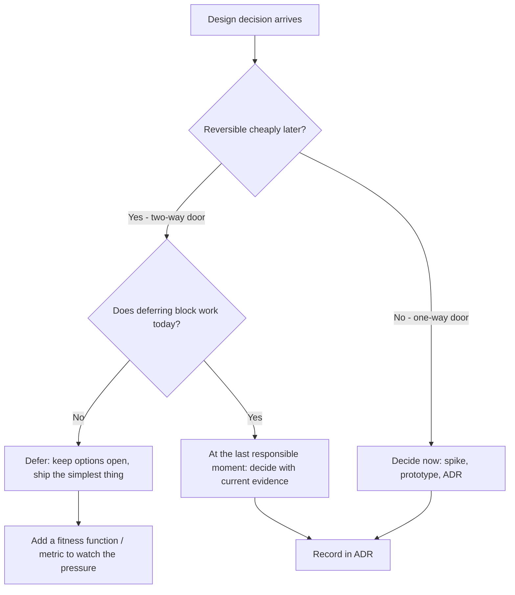
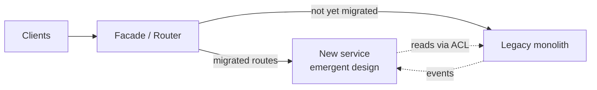

# Emergent Design — Senior Level

> Focus: enabling emergent design across a team and a codebase. The balance between letting design emerge and deciding deliberately; keeping a system *refactorable* so design can keep moving; defending YAGNI in review without freezing the architecture; spotting and reversing the wrong abstraction; and recording the few decisions you *did* make up front.

---

## Table of Contents

1. [The senior's job: keep the system changeable](#the-seniors-job-keep-the-system-changeable)
2. [Emergent vs. intentional: the last responsible moment](#emergent-vs-intentional-the-last-responsible-moment)
3. [One-way vs. two-way doors](#one-way-vs-two-way-doors)
4. [Evolutionary architecture and fitness functions](#evolutionary-architecture-and-fitness-functions)
5. [What makes a system refactorable](#what-makes-a-system-refactorable)
6. [Strangler fig for evolving legacy](#strangler-fig-for-evolving-legacy)
7. [Defending YAGNI in design review](#defending-yagni-in-design-review)
8. [The wrong abstraction: spotting it and inlining it back](#the-wrong-abstraction-spotting-it-and-inlining-it-back)
9. [Tracking duplication and complexity trends](#tracking-duplication-and-complexity-trends)
10. [ADRs: recording the deliberate decisions](#adrs-recording-the-deliberate-decisions)
11. [Common Mistakes](#common-mistakes)
12. [Test Yourself](#test-yourself)
13. [Cheat Sheet](#cheat-sheet)
14. [Summary](#summary)
15. [Further Reading](#further-reading)
16. [Related Topics](#related-topics)

---

## The senior's job: keep the system changeable

Kent Beck's four rules of simple design — *passes tests, reveals intent, no duplication, fewest elements* — describe the local move. At team scale the senior's job is different: **make sure the codebase can absorb the next ten thousand of those local moves without seizing up.**

Emergent design is not "design by accident." It is a bet: *we don't know enough yet to decide, so we will keep the cost of changing our minds low and decide later with more information.* That bet only pays off if changing your mind is actually cheap. The senior owns the machinery that keeps it cheap — tests, CI, trunk-based development, small PRs, observability — and owns the judgment about *which* decisions are safe to defer and which must be made now.

Two failure modes sit on either side of this:

- **Premature commitment** — building the framework, the plugin system, the `Manager<T>` for a second consumer that never arrives. The design ossifies around guesses.
- **Perpetual deferral** — never deciding anything, so the codebase is a thousand inconsistent half-patterns and no one can predict where a feature goes. "Emergent" becomes an excuse for incoherence.

The skill is holding both: *defer what you can reverse cheaply, decide what you cannot.*

---

## Emergent vs. intentional: the last responsible moment

The **last responsible moment** (Lean, Poppendieck) is the latest point at which you can make a decision *without* the cost of delay exceeding the cost of deciding. Not the last *possible* moment — the last *responsible* one. Deferring past it means the decision gets made for you, badly, under pressure.

A senior's daily question in design review is: *does this decision have to be made now?*



Concretely, deferring well means shipping the *simplest thing that reveals intent* and keeping the seams clean so the real decision is a refactor, not a rewrite. A repository interface with one in-memory implementation defers the "which database" decision at near-zero cost. A hand-rolled ORM written before the first query does not — it commits you on day one to a guess about access patterns you haven't observed.

---

## One-way vs. two-way doors

Jeff Bezos's framing (2015 shareholder letter): some decisions are **two-way doors** — if it turns out wrong, you walk back through. Most decisions are like this and should be made fast, by the people closest to the work, with light process. Some are **one-way doors** — consequential and effectively irreversible — and deserve deliberation, senior review, and a written record.

The senior's value-add is *classifying the door correctly*, because both errors are expensive:

- Treating a two-way door as one-way → analysis paralysis, design committees, velocity death.
- Treating a one-way door as two-way → silent lock-in you discover 18 months later.

| Decision | Door | Why |
|---|---|---|
| Internal function/module boundaries | Two-way | Refactor freely behind tests |
| Choice of HTTP client library | Two-way | Wrap it; swap later in an afternoon |
| Naming an internal type | Two-way | Rename refactor is mechanical |
| **Public API / SDK contract** | **One-way** | External consumers depend on it; breaking it costs them |
| **Persisted data schema / event format** | **One-way** | Migrating data and historical events is irreversible work |
| **Primary datastore for the core domain** | **One-way-ish** | Walkable but at enormous cost |
| **Wire protocol between services** | **One-way** | Coordinated multi-team migration |
| **A dependency you let leak through your whole codebase** | **One-way by accident** | The leak *makes* it one-way |

> **The senior insight:** many one-way doors are one-way *only because of how they were built*. A datastore choice behind a clean repository port is closer to two-way. A datastore whose query objects leak into your domain logic is firmly one-way. **You can downgrade a one-way door to two-way by isolating it** — that is what the Anti-Corruption Layer and the Ports-and-Adapters boundary buy you.

---

## Evolutionary architecture and fitness functions

*Building Evolutionary Architecture* (Ford, Parsons, Kua) reframes architecture as something that **evolves under guided change** rather than something fixed up front. The guidance mechanism is the **fitness function**: an automated, objective test that an architectural characteristic still holds. Just as unit tests protect behavior so you can refactor it, fitness functions protect *-ilities* (modularity, latency, coupling) so you can let structure emerge without it drifting into a Big Ball of Mud.

A fitness function is just a test that fails the build when an architectural property is violated.

**Java — module dependency rules with ArchUnit:**

```java
@AnalyzeClasses(packages = "com.acme.orders")
class ArchitectureFitness {

    // Domain must not depend on infrastructure — keeps the core swappable (two-way door).
    @ArchTest
    static final ArchRule domain_is_independent =
        noClasses().that().resideInAPackage("..domain..")
                   .should().dependOnClassesThat().resideInAnyPackage("..infra..", "..web..");

    // No cyclic dependencies between modules — cycles make extraction impossible later.
    @ArchTest
    static final ArchRule no_module_cycles =
        slices().matching("com.acme.(*)..").should().beFreeOfCycles();
}
```

**Go — enforce layering with `go/packages` (or `go-arch-lint` / `depguard` in golangci-lint):**

```go
// fitness_test.go — fail CI if the domain package imports anything from infra.
func TestDomainHasNoInfraImports(t *testing.T) {
    cfg := &packages.Config{Mode: packages.NeedImports | packages.NeedName}
    pkgs, err := packages.Load(cfg, "github.com/acme/orders/domain/...")
    if err != nil {
        t.Fatal(err)
    }
    for _, p := range pkgs {
        for imp := range p.Imports {
            if strings.Contains(imp, "/infra/") || strings.Contains(imp, "/web/") {
                t.Errorf("%s illegally imports %s", p.PkgPath, imp)
            }
        }
    }
}
```

**Python — import-linter as a declarative fitness function (`importlinter` + `.importlinter`):**

```ini
[importlinter]
root_package = acme

[importlinter:contract:layers]
name = Orders layering
type = layers
layers =
    acme.web
    acme.application
    acme.domain
# Higher layers may import lower; the reverse fails the build.
```

Categories of fitness function worth wiring into CI:

| Characteristic | Mechanism | Example |
|---|---|---|
| **Modularity / coupling** | ArchUnit, import-linter, depguard | "domain must not import infra" |
| **No cyclic dependencies** | ArchUnit `beFreeOfCycles`, `madge --circular` | cycle count must stay 0 |
| **Performance** | JMH / `go test -bench` / pytest-benchmark gate | p99 of `checkout()` < 200 ms |
| **Security** | OWASP dependency-check, `govulncheck`, `pip-audit` | no known-critical CVEs |
| **Test coverage of core** | coverage gate scoped to `domain/` | core domain ≥ 85% |
| **Public API stability** | `apidiff` (Go), `revapi` (Java), schema-diff | no unreviewed breaking change |

The point is not to lock the design — it's the opposite. **Fitness functions let you say "yes, restructure freely, the build will tell us if you broke an invariant we care about."** They make emergent design *safe* at team scale.

---

## What makes a system refactorable

Emergent design is only viable while refactoring stays cheap and safe. The senior's standing investment is in the four things that keep it that way:

**1. Test coverage you trust at the right granularity.** Refactoring means changing structure without changing behavior — which is *impossible to verify* without behavior tests. But coverage that pins implementation details (mock-heavy tests asserting *how*, not *what*) makes refactoring *harder*: every structural change breaks a hundred tests. Favor tests at stable seams (HTTP, public service methods, domain commands) so the refactor surface is invisible to them. This is why test design and emergent design are the same skill.

**2. Fast, deterministic CI.** A 40-minute, flaky pipeline kills emergent design: people batch changes to avoid paying the CI tax, batches get big, big changes can't be reverted cleanly, and design stops moving. Sub-10-minute, deterministic CI keeps the refactor-commit-verify loop tight.

**3. Trunk-based development with small PRs.** Long-lived branches are *frozen design*. While your refactor branch lives for two weeks, the trunk moves under you and the merge becomes a rewrite. Trunk-based development (short-lived branches, integrate daily, feature flags for incomplete work) means the codebase has *one* current design at all times, and everyone refactors against it. Small PRs are reviewable, revertable, and bisectable — `git revert` is the cheapest undo button in software, and it only works at small granularity.

**4. Decoupling that creates seams.** Dependency inversion, ports and adapters, and anti-corruption layers exist so that the volatile parts (frameworks, datastores, third-party APIs) sit behind interfaces you control. Every clean seam is a place where design can change on one side without touching the other — it converts one-way doors into two-way ones.

> **Diagnostic question for any system:** "If we decided today that our central design assumption was wrong, how long until we could ship the corrected version?" If the answer is months, the system is not refactorable, and "we'll let it emerge" is wishful thinking. Fix the refactorability *first*.

---

## Strangler fig for evolving legacy

You inherit systems whose design is fixed and wrong. You cannot let design "emerge" in a Big Ball of Mud — there is no seam to move at. The **strangler fig** (Fowler) is how you re-introduce emergence into legacy: grow the new design around the old, route traffic to it incrementally, and retire the old leaf by leaf, keeping the system live throughout.



The senior's playbook:

1. **Insert a seam in front of the legacy system** — a facade, proxy, or router (often the API gateway or an `nginx`/Envoy route). Today it forwards everything to legacy.
2. **Pick the least-coupled capability first.** Extracting the most-entangled one first creates a chatty distributed mess worse than the monolith.
3. **Build the replacement with a clean, emergent design**, fronted by an **Anti-Corruption Layer** so the legacy data model can't infect the new one.
4. **Route that one capability to the new code.** Everything else still hits legacy.
5. **Repeat**, shrinking legacy until it's a husk you can delete.

This is the architectural-scale version of the same bet: keep the system changeable while you learn the right design from real traffic, rather than guessing it in a big-bang rewrite (which, per Spolsky, usually re-introduces every bug the legacy code learned to handle).

---

## Defending YAGNI in design review

"You Aren't Gonna Need It" (Extreme Programming) is the discipline of *not building for requirements you don't have yet*. In review, the senior is the person who pushes back on **speculative generality** — abstraction added for an imagined future. The failure has a name and a smell: a `Manager<T>`, a plugin registry with one plugin, a config system for settings that are all hard-coded anyway, an interface with exactly one implementation and no test double need.

Speculative generality is expensive precisely because it *looks* responsible. The senior's job is to make the cost visible without becoming the person who blocks all abstraction.

**A usable rule for review — the Rule of Three (Fowler):** *don't abstract on the first use; tolerate the second; extract on the third.* One example tells you nothing about the axis of variation. Two might be coincidence. Three reveals the real shape — and the abstraction you extract from three real cases fits, whereas the one extracted from one imagined case almost never does.

**How to push back constructively:**

- Ask for the **concrete second consumer**. "Who is the second caller of this generic interface, and when do they land?" If the answer is "someday," it's speculative — cut it.
- Reframe the cost: "This generality adds an indirection every reader has to traverse, forever, to serve a use case that may never exist. If it arrives, extracting it then is a 20-minute refactor — *because we'll keep the code refactorable*."
- Offer the **YAGNI trade explicitly**: we are betting that adding it later is cheaper than carrying it now. That bet is correct whenever the system is refactorable — which is exactly the property we maintain.
- Distinguish **speculative generality from a genuine one-way door.** YAGNI does *not* mean "never design ahead." A public API or a persisted schema is a one-way door — there, some up-front design is *responsible*, and you record it in an ADR. The skill is applying YAGNI to two-way doors and deliberate design to one-way doors.

> **The asymmetry that justifies YAGNI:** removing a needed abstraction later is cheap and visible (the code won't compile or a test fails). Removing an *unneeded* abstraction later is expensive and rarely happens — it has accreted callers, mocks, and documentation, so it lives forever as tax. Under-abstraction self-corrects; over-abstraction does not.

---

## The wrong abstraction: spotting it and inlining it back

Sandi Metz's "The Wrong Abstraction" (2016): *"duplication is far cheaper than the wrong abstraction."* The mechanism is brutal and common. Someone DRYs up two similar code paths into one shared abstraction. A new requirement makes the two paths diverge slightly — so a boolean parameter is added to the shared abstraction. Then another. Then a third path that's only 60% the same gets forced through it. The abstraction is now a tangle of conditionals serving callers that no longer share a real concept. Each new caller pays the tax of the others' special cases.

**How to spot the wrong abstraction in review and in metrics:**

- The shared function/class grows **boolean or enum "mode" parameters** that switch large branches. Each one is a caller saying "I'm not really the same as the others."
- Callers pass **`null`/`None`/zero-value placeholders** for parameters that don't apply to them.
- **Change-coupling**: the abstraction shows up in the diff of unrelated features. (Catch this with the `git log` co-change hotspot below.)
- Reading any single call site, you **can't predict the behavior** without tracing the flags.

**The cure is counter-intuitive: re-introduce the duplication, then re-abstract from the real cases.**

1. **Inline the abstraction back into each caller** — copy the relevant branch into the call site, delete the parameter that selected it.
2. Each caller now has straight-line code for *its* case. The shared function shrinks; dead branches vanish.
3. Now the *true* commonalities are visible across the inlined copies — and they're often different from the original guess.
4. Re-extract only the parts that are genuinely identical, from three real cases (Rule of Three), not from the historical accident.

This is emergent design in reverse and forward at once: you let the wrong structure *de-emerge* before letting the right one emerge. A senior gives the team explicit permission to do this — juniors are often taught "DRY at all costs" and feel that un-DRYing is heresy. It is not; it is the cure.

---

## Tracking duplication and complexity trends

You cannot manage emergence by vibes. Watch the *trend*, not the absolute number — a 4% duplication ratio that's been stable for a year is fine; a 2% that's climbing weekly is the early signal of either a missing abstraction or a wrong one.

**Duplication and complexity, in CI:**

```bash
# Cross-language duplication detection (token-based, not line-based).
jscpd --min-tokens 70 --reporters json,console ./src

# Per-language complexity gates already in the toolchain:
#   Go:     golangci-lint run --enable=gocognit,gocyclo,dupl
#   Java:   SonarQube cognitive-complexity rule S3776; PMD CPD for duplication
#   Python: ruff (PLR091x complexity codes); radon cc/mi for trends; pylint duplicate-code
```

**The single most valuable signal: the change-coupling / hotspot map.** Adam Tornhill's *behavioural code analysis* (the `code-maat` / CodeScene approach) joins your version history with complexity:

```bash
# Files changed most often — the highest-ROI refactor targets.
git log --pretty=format: --name-only --since=12.month \
  | sort | uniq -c | sort -rn | head -25

# Temporal coupling: which files keep changing together in the same commit?
# Two files that always co-change but live in different modules signal a
# missing abstraction (or the wrong one straddling a boundary).
```

| Signal | What it usually means | Senior action |
|---|---|---|
| Duplication ratio *rising* | Missing abstraction emerging | Wait for Rule of Three, then extract |
| One file's complexity rising + high churn | Bloater forming at a hotspot | Schedule a focused extraction now |
| Two files always co-change across a module boundary | Wrong boundary / leaky abstraction | Move the boundary; co-locate the concept |
| A shared class accreting boolean params | The wrong abstraction | Inline back, re-abstract from real cases |
| Complexity flat + high churn | Healthy, well-factored hotspot | Leave it; it's earning its keep |

> **Why trends beat thresholds:** a hard threshold ("no file over complexity 25") is gameable and noisy on legacy. A *trend* ("this file's complexity has doubled in 8 weeks while churning daily") points straight at where design pressure is building — exactly where the next emergent refactor should land.

---

## ADRs: recording the deliberate decisions

If most of your design emerges and is undocumented (correctly — it lives in the code), the few decisions you made *deliberately and up front* must be written down, or in six months no one can tell which structure was a considered choice and which was an accident no one questioned. An **Architecture Decision Record** (Michael Nygard, 2011) is a short, immutable, numbered document capturing one decision: its **context**, the **decision**, and the **consequences**.

ADRs are the precise complement to emergent design:

- They record the **one-way doors** — the choices you couldn't defer and made on purpose.
- They capture **why you said no to a generality** (a YAGNI decision is itself a decision: "we deliberately did not build a plugin system; revisit if a third integration appears").
- They are **immutable**: you don't edit ADR-0012, you supersede it with ADR-0030 and link them. The chain *is* the evolution history of the architecture — the audit trail of emergent design.

```markdown
# ADR-0014: Keep the datastore behind a repository port

## Status
Accepted (2026-06-10). Supersedes none.

## Context
We expect read patterns to change as the product finds product-market fit.
Choosing the "right" database now is a guess. The datastore is a one-way door
*only if its query model leaks into the domain.*

## Decision
Define `OrderRepository` as a port in the domain layer. Provide an in-memory
adapter for tests and a Postgres adapter for production. No SQL or ORM type
crosses the port. We are deliberately NOT building a multi-database abstraction
(YAGNI) — there is no second datastore on the roadmap.

## Consequences
+ The datastore decision is downgraded from one-way to two-way: swapping it is
  an adapter rewrite, not a domain rewrite. Enforced by an ArchUnit fitness test.
- One layer of indirection on every data access.
- If we never change datastore, the port is mild over-engineering — accepted as
  cheap insurance, revisit in ADR if it bites.
```

Tooling: keep ADRs in-repo under `docs/adr/`, numbered, in Markdown; `adr-tools` or `log4brains` scaffold and index them. The ADR log answers the question that haunts every inherited codebase: *"was this on purpose?"*

---

## Common Mistakes

- **"Emergent design" used as a license for no design.** Deferring two-way-door decisions is emergence; deferring the persisted-event-schema decision is negligence. The senior must classify the door before invoking YAGNI.
- **Letting branches live long "so the refactor doesn't get disrupted."** This freezes one design while the trunk moves. The big-bang merge is harder than the disruption you avoided. Integrate daily; flag incomplete work.
- **Coverage that pins implementation, not behavior.** Mock-heavy tests asserting call sequences make refactoring *more* expensive — the opposite of their purpose. Test at stable seams.
- **DRYing on the first or second occurrence.** One example reveals nothing about the axis of variation. Wait for three real cases; tolerate the duplication until then.
- **Refusing to un-DRY a wrong abstraction** because "DRY is a rule." Duplication is cheaper than the wrong abstraction. Inline it back; re-abstract from reality.
- **Treating fitness functions as architecture police that block change.** Their purpose is the reverse — to *permit* free restructuring by catching only the invariants that matter. If your fitness functions forbid healthy refactors, they encode the wrong invariants.
- **No ADRs, so every structure looks intentional.** Without a record of which doors were deliberate, the team either fears touching everything or rewrites considered decisions by accident.
- **Adding a boolean parameter instead of admitting divergence.** Every mode flag on a shared abstraction is a caller telling you it's not really the same concept. Listen to it.

---

## Test Yourself

**1. A teammate wants to extract a `PaymentProvider` interface now, "because we'll surely add Stripe later," but today there is only the in-house provider. How do you respond in review?**

<details><summary>Answer</summary>
Apply YAGNI to this two-way door. Ask for the concrete second provider and a date; "surely later" is speculative generality. The cost of the interface now is permanent indirection serving a maybe; the cost of adding it when Stripe actually lands is a ~20-minute refactor *because we keep the system refactorable*. The asymmetry favors waiting: under-abstraction self-corrects (the second provider won't compile against the concrete type), over-abstraction lives forever as tax. Caveat: if the payment integration is a *public* contract or a persisted schema, that's a one-way door and some up-front design plus an ADR is warranted.
</details>

**2. A shared `formatReport(data, isPdf, isSummary, includeTotals, legacyMode)` has grown four boolean parameters and is in the diff of every reporting feature. What's the diagnosis and the cure?**

<details><summary>Answer</summary>
This is the wrong abstraction: callers that don't share a real concept were forced through one function, and divergence was absorbed as mode flags. The change-coupling (it's in every reporting diff) confirms it. Cure (Metz): inline `formatReport` back into each caller, deleting the flags so each call site has straight-line code for its case. With the duplication restored, the *true* commonalities become visible; re-extract only those, from the real cases (Rule of Three), not from the accreted accident. Duplication is cheaper than the wrong abstraction.
</details>

**3. Your team says it "does emergent design," yet correcting a core assumption is estimated at three months. Is the team actually doing emergent design?**

<details><summary>Answer</summary>
No. Emergent design is a bet that changing your mind is cheap; a three-month correction means the bet is unfunded. The system isn't refactorable — likely missing trustworthy behavior tests, fast CI, clean seams, or trunk-based flow, or it's a Big Ball of Mud with no seam to move at. Fix refactorability first (characterization tests at seams, decoupling via ports, strangler-fig the worst legacy). Until then "let it emerge" is wishful thinking; the design is de facto frozen.
</details>

**4. How does a fitness function differ from "we agreed on a layering convention," and why does it matter for emergent design?**

<details><summary>Answer</summary>
A convention lives in people's heads and erodes silently as the team changes and pressure mounts. A fitness function is an automated test (ArchUnit `domain must not import infra`, import-linter layers, a `govulncheck` gate) that fails the build the moment the invariant is violated. It matters because it makes emergence *safe*: you can tell the team "restructure anything you like — the build tells us if you broke an invariant we care about." Conventions forbid by hope; fitness functions forbid by CI, which is the only forbidding that survives deadlines.
</details>

**5. You must replace a tangled legacy billing monolith with a cleaner design but can't take an outage or stop feature work. Outline the approach and the first concrete step.**

<details><summary>Answer</summary>
Strangler fig. Put a routing seam (gateway/proxy) in front of the monolith forwarding 100% of traffic today. Identify the *least-coupled* billing capability (not the most central — that creates a chatty distributed mess). Build its replacement with a clean emergent design behind an Anti-Corruption Layer so the legacy data model can't infect it. Route just that capability to the new code; everything else still hits the monolith. Repeat capability by capability, shrinking legacy until it's deletable. First concrete step: insert the routing seam with everything still pointing at legacy — zero behavior change, but now you have the lever.
</details>

**6. Distinguish a one-way door from a two-way door for: (a) renaming an internal struct, (b) the JSON shape of a published Kafka event, (c) which logging library you use. How does your design treatment differ?**

<details><summary>Answer</summary>
(a) Two-way — a mechanical rename refactor; decide instantly, no ceremony. (b) One-way — historical events and external consumers depend on the shape; migrating them is irreversible work, so it deserves deliberate design, schema versioning, and an ADR. (c) Two-way *if* wrapped behind your own logging facade (swap in an afternoon), but a one-way door *by accident* if every file imports it directly — the leak makes it irreversible. Treatment: decide two-way doors fast and locally; deliberate on genuine one-way doors and record them; and proactively *downgrade* accidental one-way doors to two-way by isolating the dependency behind a seam.
</details>

---

## Cheat Sheet

| Situation | Move |
|---|---|
| Decision arrives in review | Classify the door (one-way / two-way) *first* |
| Two-way door | Decide fast, locally; defer to last responsible moment if it blocks nothing |
| One-way door | Deliberate, review, write an ADR |
| "We'll need it later" generality | Ask for the concrete second consumer + date; YAGNI if "someday" |
| First/second occurrence of similar code | Tolerate duplication |
| Third real occurrence | Extract the abstraction (Rule of Three) |
| Shared abstraction growing boolean/mode flags | Wrong abstraction — inline back, re-abstract from real cases |
| Want to let structure restructure freely | Add fitness functions for the invariants that matter |
| Inherited Big Ball of Mud | Strangler fig + ACL; least-coupled capability first |
| Refactor "needs" a long-lived branch | Don't — trunk-based, small PRs, feature flags |
| Decision made on purpose | Record it (ADR), including deliberate non-decisions |
| Deciding what to refactor next | Churn × complexity hotspot, not gut feel |
| Duplication ratio rising | Watch the trend; abstract at Rule of Three, not before |

**Tooling by language:**

| | Java | Go | Python |
|---|---|---|---|
| Architecture fitness | ArchUnit | go-arch-lint / depguard / `go/packages` test | import-linter |
| Complexity | SonarQube S3776, PMD | golangci-lint `gocognit`/`gocyclo` | ruff `PLR091x`, radon |
| Duplication | PMD CPD, jscpd | golangci-lint `dupl`, jscpd | pylint duplicate-code, jscpd |
| API-break detection | revapi | `apidiff` | griffe |
| Security gate | OWASP dependency-check | `govulncheck` | `pip-audit` |
| ADRs | `adr-tools` / `log4brains` (language-agnostic) | same | same |

---

## Summary

At team scale, emergent design is a *funded bet* that changing your mind stays cheap. The senior funds that bet and places it wisely:

- **Classify the door.** Decide one-way doors deliberately; defer two-way doors to the last responsible moment; proactively downgrade accidental one-way doors by isolating dependencies behind seams.
- **Keep the system refactorable.** Behavior tests at stable seams, fast deterministic CI, trunk-based development with small revertable PRs, and decoupling that creates seams. Without these, "emergent" means "frozen."
- **Guide evolution with fitness functions.** Automate the architectural invariants you care about so the team can restructure freely and safely.
- **Defend YAGNI in review** — demand the concrete second consumer, lean on the Rule of Three, and remember the asymmetry: under-abstraction self-corrects, over-abstraction lives forever as tax.
- **Reverse the wrong abstraction** by inlining it back and re-abstracting from real cases. Duplication is cheaper than the wrong abstraction.
- **Track trends, not thresholds** — churn × complexity hotspots point to where design pressure is actually building.
- **Record the deliberate decisions in ADRs** so the team can always tell what was on purpose and what was an accident.
- **Use strangler fig** to re-introduce emergence into legacy that has no seam left to move at.

---

## Further Reading

- Kent Beck — *Extreme Programming Explained* (Four Rules of Simple Design; YAGNI)
- Neal Ford, Rebecca Parsons, Patrick Kua — *Building Evolutionary Architecture* (fitness functions)
- Sandi Metz — "The Wrong Abstraction" (2016) and *Practical Object-Oriented Design*
- Martin Fowler — "StranglerFigApplication", "YAGNI", and *Refactoring* (2nd ed.)
- Jeff Bezos — Amazon 2015 Shareholder Letter (one-way vs. two-way doors)
- Mary & Tom Poppendieck — *Lean Software Development* (the last responsible moment)
- Michael Nygard — "Documenting Architecture Decisions" (2011) (ADRs)
- Adam Tornhill — *Your Code as a Crime Scene* / *Software Design X-Rays* (behavioural code analysis, hotspots)
- Joel Spolsky — "Things You Should Never Do, Part I" (2000) (why rewrites fail)

---

## Related Topics

- [junior.md](junior.md) — the four rules of simple design and YAGNI, first principles
- [middle.md](middle.md) — applying simple design while building a feature
- [professional.md](professional.md) — emergent design as an individual practice across a service
- [Chapter README](../README.md) — the positive rules of emergent design
- [Classes (clean-code ch. 09)](../09-classes/README.md) — cohesion and SRP, the unit that emerges
- [Documentation and ADRs (clean-code ch. 24)](../24-documentation-and-adrs/README.md) — recording deliberate decisions in depth
- [Refactoring](../../refactoring/README.md) — the mechanics that keep design changeable
- [Anti-Patterns](../../anti-patterns/README.md) — speculative generality, the Big Ball of Mud, and the wrong abstraction as named smells
