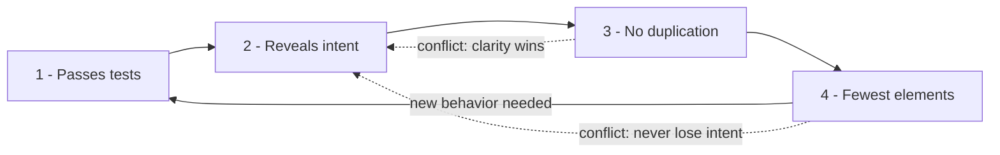

# Emergent Design — Practice Tasks

> 12 hands-on exercises on Kent Beck's four rules of simple design and the YAGNI judgment that surrounds them. Every task: a scenario, code (Go / Java / Python — varied), a precise instruction, and a collapsible `<details>` solution with the *reasoning*, not just the answer. The hard part of emergent design is rarely the mechanics of extraction — it is knowing **when not to abstract**. Several tasks are deliberately judgment calls where the correct answer is "leave it alone (for now)."

---

## Table of Contents

1. [Task 1 — Remove essential duplication (Go, easy)](#task-1--remove-essential-duplication-go-easy)
2. [Task 2 — Leave accidental look-alike duplication alone (Python, easy)](#task-2--leave-accidental-look-alike-duplication-alone-python-easy)
3. [Task 3 — Make intent explicit without adding structure (Java, easy)](#task-3--make-intent-explicit-without-adding-structure-java-easy)
4. [Task 4 — Delete speculative generality: `Manager<T>` (Java, medium)](#task-4--delete-speculative-generality-managert-java-medium)
5. [Task 5 — Delete the unused plugin hook (Go, medium)](#task-5--delete-the-unused-plugin-hook-go-medium)
6. [Task 6 — Apply the Rule of Three (Python, medium)](#task-6--apply-the-rule-of-three-python-medium)
7. [Task 7 — Should you abstract this? (Go, medium — judgment)](#task-7--should-you-abstract-this-go-medium--judgment)
8. [Task 8 — Reduce class count without harming clarity (Java, medium)](#task-8--reduce-class-count-without-harming-clarity-java-medium)
9. [Task 9 — Inline a wrong abstraction back to duplication (Python, hard)](#task-9--inline-a-wrong-abstraction-back-to-duplication-python-hard)
10. [Task 10 — Premature interface from one implementation (Go, hard)](#task-10--premature-interface-from-one-implementation-go-hard)
11. [Task 11 — Sequence a feature: make it work → right → fast (Python, hard)](#task-11--sequence-a-feature-make-it-work--right--fast-python-hard)
12. [Task 12 — Simple-design audit (Java, hard — open-ended)](#task-12--simple-design-audit-java-hard--open-ended)

---

## How to Use

Read the [chapter README](../README.md) first so the four rules are fresh:

1. **Passes the tests** — correctness is non-negotiable.
2. **Reveals intent** — the code says what it means.
3. **No duplication** — every piece of knowledge has one home (DRY).
4. **Fewest elements** — no class, method, or interface that does not earn its place.

Rules are *ordered*. When two conflict, the earlier one wins: clarity (rule 2) beats deduplication (rule 3), and you never delete an element (rule 4) at the cost of intent.

Work each task before opening the solution. For the judgment tasks (7, and parts of 2, 9, 12) write down your decision **and your reason** before expanding — emergent design is a skill of justification, not of pattern-matching. The mermaid diagram below is the loop every task lives inside.



---

## Task 1 — Remove essential duplication (Go, easy)

**Scenario:** Three handlers compute the same discounted price the same way. This is *essential* duplication — one business rule ("loyalty members get 10% off, capped at $50") copied into three places. Change the cap and you must hunt down three call sites. Extract it.

```go
package pricing

func checkoutTotal(items []Item, member bool) float64 {
	subtotal := sum(items)
	if member {
		d := subtotal * 0.10
		if d > 50 {
			d = 50
		}
		subtotal -= d
	}
	return subtotal
}

func cartPreview(items []Item, member bool) float64 {
	subtotal := sum(items)
	if member {
		d := subtotal * 0.10
		if d > 50 {
			d = 50
		}
		subtotal -= d
	}
	return subtotal
}

func emailQuote(items []Item, member bool) float64 {
	subtotal := sum(items)
	if member {
		d := subtotal * 0.10
		if d > 50 {
			d = 50
		}
		subtotal -= d
	}
	return subtotal
}
```

**Instruction:** Give the discount rule a single home (rule 3). The three callers should keep their distinct names — they describe different *intents* (rule 2), so do not collapse them into one function.

<details>
<summary>Solution</summary>

```go
package pricing

const (
	loyaltyRate = 0.10
	loyaltyCap  = 50.0
)

// loyaltyDiscount is the one home for the discount rule.
// Change the cap here and every caller is correct.
func loyaltyDiscount(subtotal float64, member bool) float64 {
	if !member {
		return 0
	}
	d := subtotal * loyaltyRate
	if d > loyaltyCap {
		return loyaltyCap
	}
	return d
}

func checkoutTotal(items []Item, member bool) float64 {
	subtotal := sum(items)
	return subtotal - loyaltyDiscount(subtotal, member)
}

func cartPreview(items []Item, member bool) float64 {
	subtotal := sum(items)
	return subtotal - loyaltyDiscount(subtotal, member)
}

func emailQuote(items []Item, member bool) float64 {
	subtotal := sum(items)
	return subtotal - loyaltyDiscount(subtotal, member)
}
```

**Reasoning.** The duplicated block encodes *one fact* — the loyalty rule — so it qualifies as essential duplication under rule 3. DRY is about knowledge, not about characters: when the same idea appears three times, give it one name. Note what we did *not* do: the three callers stay separate. `checkoutTotal`, `cartPreview`, and `emailQuote` are different intents that today happen to share an implementation. Merging them would serve rule 3 at the expense of rule 2, and rule 2 wins. We extracted the *knowledge* and left the *intent* untouched.

</details>

---

## Task 2 — Leave accidental look-alike duplication alone (Python, easy)

**Scenario:** A reviewer flags these two functions as "duplication — please DRY this up." They look almost identical.

```python
def is_valid_username(s: str) -> bool:
    if not s:
        return False
    if len(s) < 3 or len(s) > 20:
        return False
    return s.isalnum()

def is_valid_room_code(s: str) -> bool:
    if not s:
        return False
    if len(s) < 3 or len(s) > 20:
        return False
    return s.isalnum()
```

**Instruction:** Decide whether to extract a shared `_is_alnum_in_range(s, lo, hi)` helper. State your decision and justify it against the four rules. (Hint: ask what happens when *one* rule changes.)

<details>
<summary>Solution</summary>

**Decision: do not extract — for now.** This is *accidental* (coincidental) duplication. The two functions are equal today by coincidence, not because they encode the same fact. A username rule and a room-code rule are independent business concepts that happen to share constraints this week.

Run the test that distinguishes essential from accidental duplication: **ask what makes each rule change, and whether they change together.** If product later decides usernames may contain underscores, or room codes must be exactly 6 characters, the two functions diverge — and a shared helper becomes a liability. You would either thread in flags (`_is_alnum_in_range(s, lo, hi, allow_underscore=False)`) until the helper is a configuration soup, or you would tear the abstraction back out. A premature merge here would couple two concepts that have no reason to move together.

DRY is about a single source of truth for a piece of *knowledge*, not about deleting visually similar lines. Two facts that are identical by accident are still two facts.

```python
# Leave them separate. Optionally make intent explicit with a comment
# at the point a reader might "helpfully" merge them:

def is_valid_username(s: str) -> bool:
    # Independent of room-code rules despite the resemblance — see Task 2.
    if not s:
        return False
    if not (3 <= len(s) <= 20):
        return False
    return s.isalnum()

def is_valid_room_code(s: str) -> bool:
    if not s:
        return False
    if not (3 <= len(s) <= 20):
        return False
    return s.isalnum()
```

**Reasoning.** The bias under uncertainty is *to wait*. The cost of two independent copies is small and local; the cost of a wrong abstraction is a coupling that fights you on every future change (see Task 9 for the cleanup when this goes wrong). "A little duplication is far cheaper than the wrong abstraction." — Sandi Metz.

</details>

---

## Task 3 — Make intent explicit without adding structure (Java, easy)

**Scenario:** The code passes its tests (rule 1) but a new reader cannot tell *what* the magic numbers and bit-twiddling mean. Rule 2 says reveal intent. You can do it with **renaming and naming intermediate values alone** — no new classes.

```java
class AccessControl {
    boolean check(int u, int r) {
        return (u & 4) != 0 && (r & 1) != 0 && (u & 8) == 0;
    }
}
```

**Instruction:** Rewrite so the *rule* is readable. Do not introduce a class hierarchy or a framework — the smallest change that reveals intent is the right one (rule 4).

<details>
<summary>Solution</summary>

```java
class AccessControl {

    private static final int PERM_WRITE   = 1 << 2; // 4
    private static final int PERM_SUSPENDED = 1 << 3; // 8
    private static final int RESOURCE_WRITABLE = 1 << 0; // 1

    boolean canWrite(int userFlags, int resourceFlags) {
        boolean userHasWrite   = (userFlags & PERM_WRITE) != 0;
        boolean userSuspended  = (userFlags & PERM_SUSPENDED) != 0;
        boolean resourceWritable = (resourceFlags & RESOURCE_WRITABLE) != 0;

        return userHasWrite && resourceWritable && !userSuspended;
    }
}
```

**Reasoning.** Nothing about behavior changed — the same bits are tested in the same order — so rule 1 still holds. What changed is that every magic number now has a name, the method says the question it answers (`canWrite`, not `check`), and the boolean expression reads as the English sentence "a user can write when they have write permission, the resource is writable, and they are not suspended."

This is the *cheapest* rule-2 fix available, and that matters: rule 4 ("fewest elements") tells us not to reach for an `enum PermissionSet`, a `Policy` interface, or a rules engine. Those might be justified if permissions grew into a real domain — but with one method and three flags, structure would *hide* intent behind ceremony, not reveal it. Reveal intent with the lightest tool that works.

</details>

---

## Task 4 — Delete speculative generality: `Manager<T>` (Java, medium)

**Scenario:** A previous engineer built a generic, pluggable, strategy-driven registry "so we can manage any entity in the future." There is exactly one entity: `User`. There is one strategy. There are zero second consumers.

```java
interface EntityStrategy<T> {
    String keyOf(T entity);
    T merge(T existing, T incoming);
}

class DefaultUserStrategy implements EntityStrategy<User> {
    public String keyOf(User u) { return u.id(); }
    public User merge(User existing, User incoming) { return incoming; }
}

class EntityManager<T> {
    private final Map<String, T> store = new HashMap<>();
    private final EntityStrategy<T> strategy;

    EntityManager(EntityStrategy<T> strategy) { this.strategy = strategy; }

    void put(T entity) {
        String k = strategy.keyOf(entity);
        T existing = store.get(k);
        store.put(k, existing == null ? entity : strategy.merge(existing, entity));
    }
    T get(String key) { return store.get(key); }
}

// the only usage anywhere in the codebase:
class UserService {
    private final EntityManager<User> users =
        new EntityManager<>(new DefaultUserStrategy());

    void save(User u) { users.put(u); }
    User find(String id) { return users.get(id); }
}
```

**Instruction:** Apply YAGNI. Collapse the speculative generality into the simplest code that serves the one real requirement (rule 4), keeping behavior identical (rule 1).

<details>
<summary>Solution</summary>

```java
class UserService {
    private final Map<String, User> users = new HashMap<>();

    void save(User u) { users.put(u.id(), u); }   // merge == "incoming wins" == plain put
    User find(String id) { return users.get(id); }
}
```

**Reasoning.** Count the elements YAGNI lets us delete: the `EntityStrategy<T>` interface, the `DefaultUserStrategy` class, the generic `EntityManager<T>` class, the type parameter, and the indirection through `keyOf`/`merge`. The "merge" strategy was `return incoming` — i.e. exactly what `Map.put` already does. Five elements existed to make a `HashMap<String, User>` configurable for consumers who do not exist.

Speculative generality is the most expensive smell in this chapter because it taxes *every* reader forever for a flexibility that may never be used. The discipline: build the generic machinery the day the **second** real consumer arrives and the two share genuine knowledge (Rule of Three, Task 6) — not the day someone imagines it. If a second entity appears tomorrow, re-introducing a generic store is a 15-minute refactor against real requirements, and it will fit them because they are real.

</details>

---

## Task 5 — Delete the unused plugin hook (Go, medium)

**Scenario:** An order pipeline grew a "plugin system" to support hooks "in case we need to extend it." A year later, grep shows the registry is never populated. Every order pays the cost of iterating an always-empty slice and reading the indirection.

```go
package orders

type Hook interface {
	BeforeSubmit(o *Order) error
	AfterSubmit(o *Order) error
}

type Pipeline struct {
	hooks []Hook
}

func (p *Pipeline) Register(h Hook) { p.hooks = append(p.hooks, h) }

func (p *Pipeline) Submit(o *Order) error {
	for _, h := range p.hooks {
		if err := h.BeforeSubmit(o); err != nil {
			return err
		}
	}
	if err := persist(o); err != nil {
		return err
	}
	for _, h := range p.hooks {
		if err := h.AfterSubmit(o); err != nil {
			return err
		}
	}
	return nil
}

// Across the entire codebase, Register is never called and no Hook is implemented.
```

**Instruction:** Confirm the hook machinery is dead, then remove it (rule 4). Show the result and explain how you would *re-introduce* extensibility only when a real hook appears.

<details>
<summary>Solution</summary>

```go
package orders

type Pipeline struct{}

func (p *Pipeline) Submit(o *Order) error {
	return persist(o)
}
```

**Reasoning.** A `grep -r "\.Register(" && grep -r "BeforeSubmit"` across the module returns no implementations and no callers — the extension point is *speculative generality* that never paid off. The `Hook` interface, the `hooks` slice, the `Register` method, and two loops existed for hypothetical extenders. Rule 4 says delete elements that do not earn their place; an unused abstraction earns nothing and costs every reader an "is this used?" investigation (the one we just ran).

How to re-introduce it correctly **when a real need arrives** — say, a genuine "send confirmation email after submit" requirement:

```go
func (p *Pipeline) Submit(o *Order) error {
	if err := persist(o); err != nil {
		return err
	}
	return sendConfirmation(o) // the concrete need, written directly
}
```

If a *second* concrete after-submit action then appears, *that* is the moment the Rule of Three justifies extracting a hook list. You let the abstraction be **pulled out of working code by real duplication**, rather than guessing its shape in advance. Designing the extension point before the first extension reliably produces the wrong extension point.

</details>

---

## Task 6 — Apply the Rule of Three (Python, medium)

**Scenario:** You are adding a third notification channel. The first two were written inline. Now there are three near-identical blocks — and unlike Task 2, they *do* share a fact: "build a payload, send via transport, log the outcome." This is the third occurrence. Now abstract.

```python
def notify_email(user, message):
    payload = {"to": user.email, "body": message, "ts": now()}
    resp = email_client.send(payload)
    log.info("email sent", user=user.id, ok=resp.ok)
    return resp.ok

def notify_sms(user, message):
    payload = {"to": user.phone, "body": message, "ts": now()}
    resp = sms_client.send(payload)
    log.info("sms sent", user=user.id, ok=resp.ok)
    return resp.ok

def notify_push(user, message):   # the third occurrence — abstract now
    payload = {"to": user.device_token, "body": message, "ts": now()}
    resp = push_client.send(payload)
    log.info("push sent", user=user.id, ok=resp.ok)
    return resp.ok
```

**Instruction:** Extract the shared shape now that the Rule of Three is satisfied. The only things that vary are *which field is the address* and *which client sends*. Keep each channel's identity readable.

<details>
<summary>Solution</summary>

```python
from dataclasses import dataclass
from typing import Callable

@dataclass(frozen=True)
class Channel:
    name: str
    address_of: Callable[[object], str]   # how to find the recipient address on a user
    client: object                        # transport with .send(payload) -> resp

def _notify(channel: Channel, user, message) -> bool:
    payload = {"to": channel.address_of(user), "body": message, "ts": now()}
    resp = channel.client.send(payload)
    log.info(f"{channel.name} sent", user=user.id, ok=resp.ok)
    return resp.ok

EMAIL = Channel("email", lambda u: u.email,        email_client)
SMS   = Channel("sms",   lambda u: u.phone,        sms_client)
PUSH  = Channel("push",  lambda u: u.device_token, push_client)

def notify_email(user, message): return _notify(EMAIL, user, message)
def notify_sms(user, message):   return _notify(SMS, user, message)
def notify_push(user, message):  return _notify(PUSH, user, message)
```

**Reasoning.** The Rule of Three says: write it once, copy it the second time (noting the resemblance), and **extract on the third occurrence** — because by then you have enough examples to see which parts genuinely vary and which are fixed. Here three samples reveal the axes of variation precisely: the address-extraction and the transport. Everything else (payload shape, timestamp, logging, return value) is shared knowledge — essential duplication that now has one home in `_notify`.

Why three and not two? With only two examples (as in Task 2) you cannot reliably distinguish "varies" from "coincidentally the same." The third data point is what lets you draw the abstraction's boundary correctly instead of guessing. We also kept `notify_email`/`notify_sms`/`notify_push` as thin named entry points so call sites still read in domain terms (rule 2) — the abstraction removed the duplication without erasing intent.

</details>

---

## Task 7 — Should you abstract this? (Go, medium — judgment)

**Scenario:** You are reviewing a PR. The author has factored two configuration loaders into a generic `LoadConfig[T any]` with reflection-based field mapping, "to avoid duplication." Here is the *before* (what exists on `main`) and the *after* (the PR).

```go
// BEFORE — two small, explicit loaders on main
func loadServerConfig(path string) (ServerConfig, error) {
	var c ServerConfig
	b, err := os.ReadFile(path)
	if err != nil {
		return c, err
	}
	return c, json.Unmarshal(b, &c)
}

func loadDBConfig(path string) (DBConfig, error) {
	var c DBConfig
	b, err := os.ReadFile(path)
	if err != nil {
		return c, err
	}
	return c, json.Unmarshal(b, &c)
}
```

```go
// AFTER — the PR's "DRY" version
func LoadConfig[T any](path string, validators ...func(T) error) (T, error) {
	var c T
	b, err := os.ReadFile(path)
	if err != nil {
		return c, err
	}
	if err := json.Unmarshal(b, &c); err != nil {
		return c, err
	}
	for _, v := range validators {
		if err := v(c); err != nil {
			return c, err
		}
	}
	return c, nil
}
```

**Instruction:** This is a judgment exercise. Decide whether to **accept** the abstraction, and justify against the four rules. There is a defensible nuance — state the condition under which your answer flips.

<details>
<summary>Solution</summary>

**Decision: not yet — request changes (with a caveat below).** As submitted, the abstraction is not earning its place.

Walk the rules:

- **Rule 1 (tests):** both versions pass. Neutral.
- **Rule 2 (intent):** the two explicit loaders say exactly what they do at the call site (`loadDBConfig("db.json")`). `LoadConfigDBConfig` is no clearer and adds a generic ceremony a reader must parse. Slight loss.
- **Rule 3 (duplication):** here is the crux. The "duplicated" body is `ReadFile` + `Unmarshal` — six lines of *standard-library glue*, not domain knowledge. Two functions calling `json.Unmarshal` is not two copies of a business fact; it is two functions doing the obvious thing. This is closer to accidental duplication (Task 2) than essential (Task 1).
- **Rule 4 (fewest elements):** the PR *adds* an element — a generic function with a variadic validator hook — and the validator slice is exactly the speculative plugin point from Task 5. No caller passes a validator today.

So today the right call is to keep the two explicit loaders. The duplication is trivial glue, only two occurrences exist (Rule of Three unmet), and the generic version trades a hair of clarity for a flexibility nobody requested.

**The condition that flips the answer:** if a *third* config type is being added in the same PR (Rule of Three met) **and** at least one loader genuinely needs post-load validation (the `validators` hook has a real first user), then `LoadConfig[T]` is justified — drop the variadic-as-speculation concern and accept it. The lesson: "should I abstract this?" is answered by *counting real occurrences and real needs*, not by how DRY the diff looks.

</details>

---

## Task 8 — Reduce class count without harming clarity (Java, medium)

**Scenario:** A teammate, over-applying "small classes," split a trivial value into a tower of one-line types. Rule 4 says use the fewest elements — but rule 2 (intent) still wins if collapsing would hide meaning. Find the balance.

```java
interface Temperature { double celsius(); }

class CelsiusTemperature implements Temperature {
    private final double value;
    CelsiusTemperature(double value) { this.value = value; }
    public double celsius() { return value; }
}

class TemperatureFactory {
    static Temperature fromCelsius(double c) { return new CelsiusTemperature(c); }
}

class TemperatureFormatter {
    String format(Temperature t) { return t.celsius() + "°C"; }
}

// Only ever used as:
//   Temperature t = TemperatureFactory.fromCelsius(21.5);
//   String s = new TemperatureFormatter().format(t);
```

**Instruction:** Collapse the unnecessary elements while preserving any meaning worth keeping (rule 2). Justify which elements you keep and which you delete.

<details>
<summary>Solution</summary>

```java
record Temperature(double celsius) {
    Temperature {
        if (celsius < -273.15) {
            throw new IllegalArgumentException("Below absolute zero");
        }
    }
    String formatted() { return celsius + "°C"; }
}

// Usage:
//   Temperature t = new Temperature(21.5);
//   String s = t.formatted();
```

**Reasoning.** The four classes/interface collapse to one `record`. We deleted:

- The **interface** `Temperature` — an interface with a single implementation and no second one in sight is speculative generality (cf. Task 10). It adds a type to read with no polymorphism behind it.
- The **`TemperatureFactory`** — a factory that does `new` and nothing else is pure ceremony. `new Temperature(21.5)` is already clear.
- The **`TemperatureFormatter`** — a stateless one-method class wrapping behavior that belongs *on the value itself*. Moving `formatted()` onto the record reveals intent better (the temperature knows how to show itself) while removing an element.

What we *kept* and even added: the `celsius` accessor (now the record component) and an absolute-zero invariant. Note rule 4 is "fewest elements," not "fewest possible at any cost" — we did not, for example, replace `Temperature` with a bare `double`, because the type carries real meaning and guards an invariant. Collapsing to `double` would serve rule 4 but sacrifice rule 2, and the ordering forbids that trade. The skill is deleting *ceremony* (factory, formatter, redundant interface) while preserving *meaning* (the value type and its invariant).

</details>

---

## Task 9 — Inline a wrong abstraction back to duplication (Python, hard)

**Scenario:** Six months ago someone "DRY-ed up" report generation. The abstraction has since grown five boolean flags and a `kind` switch as the two reports drifted apart. The shared function now serves no one well. This is the classic *wrong abstraction* — the fix is to inline it back to two honest, separate functions, then re-extract only what is truly common.

```python
def build_report(kind, data, *, include_totals=False, currency=None,
                 group_by=None, redacted=False, locale="en"):
    rows = []
    for d in data:
        if kind == "invoice":
            row = {"id": d.id, "amount": fmt(d.amount, currency)}
            if redacted:
                row["customer"] = mask(d.customer)
            else:
                row["customer"] = d.customer
        elif kind == "usage":
            row = {"id": d.id, "units": d.units, "locale": locale}
            if group_by:
                row["bucket"] = d.timestamp.strftime(group_by)
        rows.append(row)

    out = {"rows": rows}
    if include_totals and kind == "invoice":
        out["total"] = fmt(sum(d.amount for d in data), currency)
    if include_totals and kind == "usage":
        out["total"] = sum(d.units for d in data)
    return out
```

**Instruction:** The two report kinds share almost nothing real. Inline the abstraction back into two separate functions (accepting some duplication), then extract *only* the genuinely shared piece. Explain why duplication is the better state here.

<details>
<summary>Solution</summary>

```python
# The one genuinely shared fact: turning a list of rows into the output envelope.
def _envelope(rows, total=None):
    out = {"rows": rows}
    if total is not None:
        out["total"] = total
    return out

def build_invoice_report(data, *, currency, include_totals=False, redacted=False):
    rows = [
        {
            "id": d.id,
            "amount": fmt(d.amount, currency),
            "customer": mask(d.customer) if redacted else d.customer,
        }
        for d in data
    ]
    total = fmt(sum(d.amount for d in data), currency) if include_totals else None
    return _envelope(rows, total)

def build_usage_report(data, *, group_by=None, include_totals=False, locale="en"):
    rows = []
    for d in data:
        row = {"id": d.id, "units": d.units, "locale": locale}
        if group_by:
            row["bucket"] = d.timestamp.strftime(group_by)
        rows.append(row)
    total = sum(d.units for d in data) if include_totals else None
    return _envelope(rows, total)
```

**Reasoning.** The original `build_report` was a *false* abstraction: a single function whose body was mostly `if kind == ...` branches that share no behavior. Every parameter (`currency`, `group_by`, `redacted`, `locale`) was relevant to only one branch — a sure sign two concepts were forced into one shape. Such "DRY" code is worse than duplication: a change to invoices risks breaking usage, the signature lies (most arguments are inapplicable for any given call), and the branching grows every time the two drift further.

The cure, per Sandi Metz's "the wrong abstraction" essay: **re-introduce the duplication by inlining, then look again.** Inlining gives two honest functions whose signatures tell the truth — `build_invoice_report` takes only invoice concepts, `build_usage_report` only usage concepts (rule 2 restored). Then we re-extract the *one* piece that is genuinely the same knowledge: assembling the `{"rows", "total"}` envelope (`_envelope`). That is real shared knowledge (rule 3), so it earns a home; the per-kind logic is *not* shared, so duplicating it is correct. Some duplication between the two functions (the comprehension shape) is the cheaper, more honest state than a god-function with five flags.

</details>

---

## Task 10 — Premature interface from one implementation (Go, hard)

**Scenario:** A package exports a `Storage` interface "for testability and future backends." There is one implementation (`PostgresStorage`), one consumer, and tests use the real DB anyway. The interface lives in the same package as its only implementer, forcing both to move together.

```go
package store

type Storage interface {
	SaveUser(ctx context.Context, u User) error
	GetUser(ctx context.Context, id string) (User, error)
	DeleteUser(ctx context.Context, id string) error
	ListUsers(ctx context.Context, page, size int) ([]User, error)
}

type PostgresStorage struct{ db *sql.DB }

func NewPostgresStorage(db *sql.DB) *PostgresStorage { return &PostgresStorage{db: db} }

func (s *PostgresStorage) SaveUser(ctx context.Context, u User) error      { /* ... */ }
func (s *PostgresStorage) GetUser(ctx context.Context, id string) (User, error) { /* ... */ }
func (s *PostgresStorage) DeleteUser(ctx context.Context, id string) error { /* ... */ }
func (s *PostgresStorage) ListUsers(ctx context.Context, page, size int) ([]User, error) { /* ... */ }

// The only consumer:
type UserService struct{ storage Storage }

func NewUserService(s Storage) *UserService { return &UserService{storage: s} }
```

**Instruction:** Apply YAGNI and idiomatic Go. Remove the premature interface (rule 4). Then explain the *correct, deferred* way to introduce an interface — including where it should live — if a second backend or a unit-test seam genuinely appears.

<details>
<summary>Solution</summary>

```go
package store

type PostgresStorage struct{ db *sql.DB }

func NewPostgresStorage(db *sql.DB) *PostgresStorage { return &PostgresStorage{db: db} }

func (s *PostgresStorage) SaveUser(ctx context.Context, u User) error            { /* ... */ }
func (s *PostgresStorage) GetUser(ctx context.Context, id string) (User, error)  { /* ... */ }
func (s *PostgresStorage) DeleteUser(ctx context.Context, id string) error       { /* ... */ }
func (s *PostgresStorage) ListUsers(ctx context.Context, page, size int) ([]User, error) { /* ... */ }

// UserService depends on the concrete type until a real second user appears.
type UserService struct{ storage *PostgresStorage }

func NewUserService(s *PostgresStorage) *UserService { return &UserService{storage: s} }
```

**Reasoning.** An interface with exactly one implementation is speculative generality wearing a "testability" badge. It costs every reader a jump ("which impl runs here?"), and with one implementer it provides no polymorphism — rule 4 says delete it. Note the tests "use the real DB anyway," so the interface was not even buying the test isolation it claimed.

The **deferred, idiomatic** introduction, when a genuine need arrives:

1. *Real need first.* The interface appears the day there is a second backend (e.g. an in-memory store for fast tests, or a second database) — a real second consumer of the abstraction, exactly the Rule-of-Three trigger.
2. *Define it at the consumer, not the producer.* In Go, interfaces belong in the package that **uses** them. So when `UserService` needs to abstract storage, declare a small interface there with only the methods that service actually calls:

```go
package user

// declared by the consumer; lists only what UserService needs
type userStore interface {
	SaveUser(ctx context.Context, u store.User) error
	GetUser(ctx context.Context, id string) (store.User, error)
}

type UserService struct{ store userStore }
```

`PostgresStorage` then satisfies `userStore` *implicitly* — no change to the store package. This keeps the abstraction minimal (only the methods truly needed, not all four), located where the dependency is felt, and introduced only when a second implementation makes it real. "Accept interfaces, return structs" — and accept them only when there is something to abstract over.

</details>

---

## Task 11 — Sequence a feature: make it work → right → fast (Python, hard)

**Scenario:** New requirement: "given a list of orders, return the top-N customers by total spend." A teammate's first instinct is a clever single-pass heap with memoized currency conversion. Emergent design says sequence the work: **make it work** (correct, simplest thing), **make it right** (clean, intent-revealing, deduplicated), **make it fast** (only if measurement demands it). Produce all three stages.

```python
# Requirement: top_n_customers(orders, n) -> [(customer_id, total_spend), ...]
# orders: list of objects with .customer_id and .amount (already same currency)
```

**Instruction:** Write Stage 1 (make it work), Stage 2 (make it right), and Stage 3 (make it fast) — and crucially, state the **condition** under which Stage 3 is actually warranted. Do not optimize without that condition.

<details>
<summary>Solution</summary>

**Stage 1 — make it work.** The simplest correct thing. Don't be clever; pass the test.

```python
def top_n_customers(orders, n):
    totals = {}
    for o in orders:
        totals[o.customer_id] = totals.get(o.customer_id, 0) + o.amount
    ranked = sorted(totals.items(), key=lambda kv: kv[1], reverse=True)
    return ranked[:n]
```

**Stage 2 — make it right.** Same behavior, now revealing intent and removing the manual-accumulation idiom. Names and standard tools say what we mean.

```python
from collections import Counter

def top_n_customers(orders, n):
    spend_by_customer = Counter()
    for order in orders:
        spend_by_customer[order.customer_id] += order.amount
    return spend_by_customer.most_common(n)
```

`Counter.most_common(n)` *is* "the top n by count/total" — the code now states the requirement almost verbatim (rule 2), and we removed the hand-rolled `dict.get(...)+...` and the explicit sort (rule 3: don't re-implement what the stdlib already names). This is the version that should ship.

**Stage 3 — make it fast (only if warranted).** A heap avoids fully sorting when `n` is tiny relative to the number of customers (`O(C log n)` vs `O(C log C)`).

```python
import heapq
from collections import Counter

def top_n_customers(orders, n):
    spend_by_customer = Counter()
    for order in orders:
        spend_by_customer[order.customer_id] += order.amount
    return heapq.nlargest(n, spend_by_customer.items(), key=lambda kv: kv[1])
```

**The condition for Stage 3.** Reach for it *only after measurement proves it matters*: e.g. millions of distinct customers, `n` in the single digits, and a profiler showing this function on the hot path. For the overwhelmingly common case — thousands of customers, called occasionally — Stage 2 is faster to read, equally correct, and the micro-difference is invisible. (Note `most_common` already uses a heap internally, so even Stage 2 is not naive.)

**Reasoning.** The sequencing is the whole point. Optimizing at Stage 1 ("clever heap with memoized conversion") risks shipping something wrong, complex, and slower-to-read in service of a performance need *that has not been demonstrated to exist*. Emergent design says: get it correct, make it clear, and let measurement — not intuition — decide whether to make it fast. Premature optimization is just speculative generality aimed at the CPU instead of at future requirements; YAGNI applies to performance too.

</details>

---

## Task 12 — Simple-design audit (Java, hard — open-ended)

**Scenario:** Below is a real-looking module. Audit it against the four rules of simple design and YAGNI. For each finding, name the rule violated and the fix — and for at least one item, decide that the right move is to **leave it alone**.

```java
// A "flexible" pricing engine for a shop that sells exactly one product type: e-books.
interface PriceRule { BigDecimal apply(BigDecimal base, Context ctx); }

abstract class AbstractPriceRule implements PriceRule {
    protected abstract BigDecimal doApply(BigDecimal base, Context ctx);
    public final BigDecimal apply(BigDecimal base, Context ctx) {
        return doApply(base, ctx);   // hook does nothing but delegate
    }
}

class PercentDiscountRule extends AbstractPriceRule {
    private final BigDecimal pct;
    PercentDiscountRule(BigDecimal pct) { this.pct = pct; }
    protected BigDecimal doApply(BigDecimal base, Context ctx) {
        return base.subtract(base.multiply(pct));
    }
}

class PriceEngine {
    private final List<PriceRule> rules;
    private final RuleFactory factory;          // builds rules from config strings
    private final boolean enableExperimental;   // never read
    PriceEngine(RuleFactory f) { this.factory = f; this.rules = new ArrayList<>(); this.enableExperimental = false; }

    BigDecimal price(BigDecimal base, Context ctx) {
        BigDecimal p = base;
        for (PriceRule r : rules) p = r.apply(base, ctx);   // BUG: uses base, not p
        return p;
    }
}

// In production there is exactly ONE rule configured: a flat 10% e-book discount.
```

**Instruction:** Produce a findings table (rule violated → fix), call out the correctness bug, and state which element you would *keep* and why. Then give the collapsed implementation that this one real requirement actually warrants.

<details>
<summary>Solution</summary>

**Findings.**

| Finding | Rule | Fix |
|---|---|---|
| `apply` accumulates onto `base`, not `p`, so chained rules silently drop all but the last | Rule 1 (must work) | Fix first — correctness precedes every other rule. `p = r.apply(p, ctx);` |
| `AbstractPriceRule` template hook delegates and adds nothing | Rule 4 (fewest elements) | Delete the abstract class; rules implement `PriceRule` directly — or drop the interface too (below). |
| `RuleFactory` builds rules from config strings, but there is one hard-coded rule | Rule 4 / YAGNI | Remove; instantiate the one rule directly until config-driven rules are a real requirement. |
| `enableExperimental` field is never read | Rule 4 / YAGNI | Delete dead state. |
| `PriceRule` interface + `List<PriceRule>` strategy stack for a single, fixed 10% discount | Rule 4 / speculative generality | Collapse to one method computing the discount, since there is one rule and no second consumer. |
| `Context ctx` threaded through every rule but unused by the only rule | Rule 4 / YAGNI | Drop the parameter until a rule needs it. |

**The element to KEEP:** the `BigDecimal` money type and the *value-object discipline* around price (not shown collapsed away). Replacing `BigDecimal` with `double` would "reduce elements" but reintroduce floating-point money errors — a rule-2/rule-1 regression. Rule 4 never justifies deleting an element that guards a real invariant. So we keep money as `BigDecimal`. (One could also argue for keeping the `PriceRule` interface *if* a genuine second discount type is already on the committed roadmap — that is the defensible "leave it for now" call, contingent on a real second consumer, per the Rule of Three.)

**Collapsed implementation for the one real requirement:**

```java
final class EbookPricing {
    private static final BigDecimal DISCOUNT = new BigDecimal("0.10");

    BigDecimal price(BigDecimal base) {
        return base.subtract(base.multiply(DISCOUNT));
    }
}
```

**Order of attack.**

1. **Fix the bug** (`p` not `base`) — rule 1 outranks everything; an elegant design that computes wrong prices is worthless.
2. **Delete dead/speculative elements** — `enableExperimental`, `RuleFactory`, the empty `AbstractPriceRule` hook (rule 4 / YAGNI).
3. **Collapse the strategy stack** to the single real rule, keeping `BigDecimal` (rule 4 without sacrificing rule 1/2).
4. **Re-introduce a `PriceRule` interface only when a second discount type genuinely arrives** — let the abstraction be pulled out by real duplication (Rule of Three), not pushed in by speculation.

**Reasoning.** This module is the chapter's anti-pattern catalogue in one file: a strategy framework, a factory, a template-method hook, and a feature flag — all built for flexibility that one hard-coded 10% discount never needed, *and* hiding a real bug behind the generality. Emergent design would have produced `EbookPricing` directly and grown structure only as real requirements arrived. The audit's discipline is to fix correctness first, then delete what does not earn its place, while refusing to delete the one element (money-as-`BigDecimal`) that carries genuine meaning.

</details>

---

## Self-Assessment

You have internalized emergent design when you can answer these without hedging:

- For a given block of repetition, can you classify it as **essential** (one fact, many copies → extract) or **accidental** (looks alike by coincidence → leave it)? (Tasks 1, 2)
- Can you state the test that distinguishes them — *"do these change for the same reason, at the same time?"* (Task 2)
- Do you reach for the **smallest** rule-2 fix (rename, name a value) before adding a class, interface, or framework? (Tasks 3, 8)
- Can you spot speculative generality — `Manager<T>`, unused hooks, single-implementation interfaces, never-read flags — and delete it without anxiety? (Tasks 4, 5, 10, 12)
- Do you wait for the **third** occurrence before abstracting, and can you justify *why three*? (Task 6)
- When asked "should I abstract this?", is your honest default answer "not yet," and can you name the condition that flips it? (Tasks 7, 12)
- Can you recognize a **wrong abstraction** (flag-laden god-function) and inline it back to honest duplication before re-extracting only what is shared? (Task 9)
- Do you sequence work as **make it work → make it right → make it fast**, optimizing only after measurement? (Task 11)
- When two rules conflict, do you apply them **in order** — correctness, then intent, then no-duplication, then fewest-elements? (every task)

If you abstracted in Task 2 or 7, or optimized in Task 11 without a measured need, re-read the chapter [README](../README.md): the discipline is restraint, not cleverness.

---

## Related Topics

- [Chapter README](../README.md) — the four rules of simple design, stated positively.
- [`junior.md`](junior.md) — emergent-design vocabulary and the YAGNI mindset for beginners.
- [`find-bug.md`](find-bug.md) — snippets where speculative generality hides a defect (as in Task 12).
- [`optimize.md`](optimize.md) — the "make it fast" stage done responsibly, with measurement first.
- [Refactoring](../../refactoring/README.md) — Extract Function, Inline Function, and the mechanics behind these moves.
- [Design Patterns](../../design-patterns/README.md) — patterns are the abstractions you reach for *after* the Rule of Three, never before.
