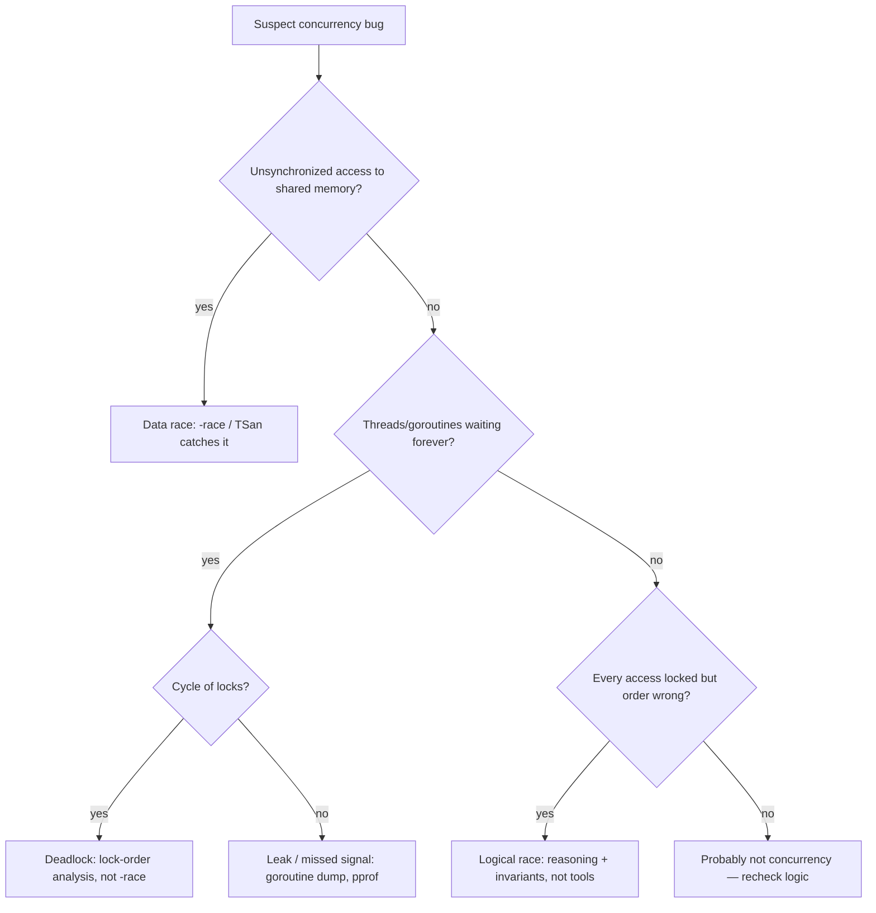

# Concurrency — Find the Bug

> Concurrency is the richest bug source in software: the code reads correctly, the tests pass, the demo works — and then it fails once in ten thousand runs on a customer's machine. The bugs below are real, subtle, and intermittent. Each compiles and runs. Find the race, the visibility hole, or the deadlock before you open the answer.

---

## Table of Contents

1. [Snippet 1 — Check-then-act on a map (Go)](#snippet-1)
2. [Snippet 2 — Lost update on a counter (Java)](#snippet-2)
3. [Snippet 3 — Visibility bug on a stop flag (Java)](#snippet-3)
4. [Snippet 4 — Loop variable captured by goroutines (Go)](#snippet-4)
5. [Snippet 5 — Deadlock from inconsistent lock ordering (Go)](#snippet-5)
6. [Snippet 6 — `synchronized` on the wrong lock object (Java)](#snippet-6)
7. [Snippet 7 — Double-checked locking without `volatile` (Java)](#snippet-7)
8. [Snippet 8 — Goroutine leak on a blocked channel (Go)](#snippet-8)
9. [Snippet 9 — `WaitGroup.Add` inside the goroutine (Go)](#snippet-9)
10. [Snippet 10 — Shared `SimpleDateFormat` across threads (Java)](#snippet-10)
11. [Snippet 11 — TOCTOU on a lock file (Python)](#snippet-11)
12. [Snippet 12 — Unbuffered channel deadlock on the main goroutine (Go)](#snippet-12)
13. [Snippet 13 — Closing a channel from the receiver (Go)](#snippet-13)
14. [Snippet 14 — `defer mu.Unlock()` after an early `return` path (Go)](#snippet-14)
- [Scorecard](#scorecard)
- [Related Topics](#related-topics)

---

## How to Use

Read each snippet and decide **what's wrong** before expanding the answer. For a concurrency bug, a complete diagnosis answers four questions:

1. **What is the data race or coordination flaw?** Name the two operations that interleave badly, or the channel/lock that never gets signaled.
2. **Why is it intermittent?** Almost every concurrency bug passes the first thousand runs. Explain the window that has to be hit.
3. **What's the fix?** Usually a lock, an atomic, a `volatile`/memory barrier, a `context`, or restructuring ownership so the data is never shared.
4. **Would a race detector catch it?** Go's `-race` flag and Java's tooling (e.g. the FindBugs/SpotBugs `MT_CORRECTNESS` checks, ThreadSanitizer for native code) catch *data races* — unsynchronized access to shared memory. They do **not** catch deadlocks, channel leaks, or logical races where every access happens to go through a lock but the *sequence* is still wrong. Knowing which category a bug falls into tells you which tool to reach for.

Difficulty is marked Easy / Medium / Hard. The Hard ones survive code review at most companies.



---

## Snippet 1

**Difficulty: Easy** — Check-then-act on a map (Go)

```go
package cache

import "sync"

type Counter struct {
    mu     sync.Mutex
    counts map[string]int
}

func NewCounter() *Counter {
    return &Counter{counts: make(map[string]int)}
}

// Increment bumps the count for key by one.
func (c *Counter) Increment(key string) {
    if _, ok := c.counts[key]; !ok {
        c.mu.Lock()
        c.counts[key] = 0
        c.mu.Unlock()
    }
    c.mu.Lock()
    c.counts[key]++
    c.mu.Unlock()
}
```

**What's wrong?**

<details><summary>Answer</summary>

**The race:** the `if _, ok := c.counts[key]; !ok` check reads the map **outside** the lock. Two goroutines can both observe `!ok` for a new key, both take the lock (serially), and both write `c.counts[key] = 0`. That part is merely redundant. The real damage is that the *read* of `c.counts` in the `if` is a concurrent map read happening while another goroutine holds the lock and is doing `c.counts[key]++` — a write. **Concurrent read and write of a Go map is a hard runtime error**, not just a logic bug: the runtime detects it and panics with `fatal error: concurrent map read and map write`, which cannot be recovered.

**Why it's intermittent:** the unsynchronized read only collides with a write when the two goroutines hit the exact same map during a rehash or bucket write. Under light load you may never see it; under production load it crashes the whole process.

**The fix:** put the entire check-then-act under one lock so the map is only ever touched while holding `mu`.

```go
func (c *Counter) Increment(key string) {
    c.mu.Lock()
    defer c.mu.Unlock()
    c.counts[key]++ // zero value of int is 0, so no need to pre-initialize
}
```

Go's zero-value semantics make the whole `if !ok` dance unnecessary — `c.counts[key]++` on a missing key starts from 0.

**Race detector:** `go test -race` catches this immediately. The detector reports the unsynchronized read in `Increment` against the locked write, with both stack traces. This is the canonical case `-race` was built for.
</details>

---

## Snippet 2

**Difficulty: Easy** — Lost update on a counter (Java)

```java
public class RequestMeter {
    private long total = 0;

    public void record() {
        total++;
    }

    public long total() {
        return total;
    }
}

// Used from a thread-per-request server:
//   meter.record();   // called by every request thread
```

**What's wrong?**

<details><summary>Answer</summary>

**The race:** `total++` is not atomic. It compiles to three steps: read `total`, add 1, write `total` back. Two threads can both read the same value (say 41), both compute 42, both write 42. One increment is lost. With N threads hammering `record()`, the final count is reliably *less* than the number of calls.

There is a second, sneakier problem: even reads via `total()` have no memory barrier, so a reader thread may see a stale value indefinitely (visibility — see Snippet 3).

**Why it's intermittent:** the lost-update window is the few nanoseconds between read and write-back. Under low concurrency the threads rarely overlap there, so the count looks correct. Under load, thousands of updates vanish — and the loss is non-deterministic, so the bug "comes and goes."

**The fix:** use an atomic, which performs read-modify-write as one indivisible operation and also provides the memory barrier for visibility.

```java
import java.util.concurrent.atomic.AtomicLong;

public class RequestMeter {
    private final AtomicLong total = new AtomicLong();

    public void record() {
        total.incrementAndGet();
    }

    public long total() {
        return total.get();
    }
}
```

For high-contention counters where you only read occasionally, prefer `LongAdder` — it shards the count across cells to avoid CAS contention.

**Race detector:** SpotBugs flags this as `VO_VOLATILE_INCREMENT` / unsynchronized increment. At runtime, Java's ThreadSanitizer-style tools (or the `java.util.concurrent` stress harness `jcstress`) reproduce the lost update deterministically. Plain unit tests almost never do.
</details>

---

## Snippet 3

**Difficulty: Medium** — Visibility bug on a stop flag (Java)

```java
public class Worker implements Runnable {
    private boolean running = true;

    public void stop() {
        running = false;
    }

    @Override
    public void run() {
        while (running) {
            doWork();
        }
    }

    private void doWork() { /* CPU-bound, no I/O, no locks */ }
}

// Main thread:
//   Worker w = new Worker();
//   new Thread(w).start();
//   Thread.sleep(1000);
//   w.stop();   // worker should exit... does it?
```

**What's wrong?**

**Why it's intermittent:** This one is the classic "works on my laptop, hangs in production."

<details><summary>Answer</summary>

**The bug (visibility, not a data race in the classic sense):** `running` is a plain field. The worker thread reads it in a tight loop with no synchronization. The Java Memory Model gives **no guarantee** that the write `running = false` on the main thread ever becomes visible to the worker thread. The JIT is permitted to hoist `running` into a register, turning the loop into `while (true)`. The worker spins forever even after `stop()` returns.

**Why it's intermittent — and why it's worse than intermittent:** on **x86**, hardware has a strong memory model and stores become globally visible quickly, so the loop usually *does* terminate — you'll never see the bug on your Intel/AMD dev machine. On **ARM** (weaker memory model — Apple Silicon, AWS Graviton, mobile), the store can sit in a store buffer indefinitely and the loop genuinely never exits. The bug is invisible until you deploy to ARM servers. Even on x86, a more aggressive JIT optimization level can hoist the read and hang.

**The fix:** declare the flag `volatile`. `volatile` guarantees that writes are visible to all threads and prevents the JIT from caching the read in a register.

```java
private volatile boolean running = true;
```

For a flag that's also read-modified, use `AtomicBoolean`. For interruptible blocking work, prefer `Thread.interrupt()` + checking `Thread.currentThread().isInterrupted()`.

**Race detector:** this is a *visibility* bug, which most data-race detectors **do** classify as a race (unsynchronized read + write to `running`). `jcstress` reproduces it reliably. But a plain functional test on x86 will pass forever, which is exactly why visibility bugs are so dangerous — the platform hides them.
</details>

---

## Snippet 4

**Difficulty: Medium** — Loop variable captured by goroutines (Go)

```go
package main

import (
    "fmt"
    "sync"
)

func main() {
    urls := []string{"a.com", "b.com", "c.com"}
    var wg sync.WaitGroup

    for _, url := range urls {
        wg.Add(1)
        go func() {
            defer wg.Done()
            fmt.Println("fetching", url)
        }()
    }
    wg.Wait()
}
```

**What's wrong?**

<details><summary>Answer</summary>

**The bug:** the closure captures the loop variable `url` **by reference**, not by value. In Go versions before 1.22, there is a single `url` variable reused across iterations. By the time the goroutines actually run (the scheduler may not start them until after the loop finishes), `url` holds the last value. The output is often `fetching c.com` printed three times — and the first two URLs are never fetched. This is the single most common Go concurrency bug, and the equivalent exists in JavaScript with `var` in a `for` loop closing over `setTimeout` callbacks.

**Why it's intermittent:** if the scheduler happens to run each goroutine before the next iteration overwrites `url`, you might see the correct output — so it can pass on a lightly loaded machine and fail under load or with `GOMAXPROCS>1`. The result is data-dependent and timing-dependent.

**The fix (any one of these):**

Bind the value per iteration by shadowing:

```go
for _, url := range urls {
    url := url // new variable each iteration
    wg.Add(1)
    go func() {
        defer wg.Done()
        fmt.Println("fetching", url)
    }()
}
```

Or pass it as an argument (clearest — the value is copied at call time):

```go
for _, url := range urls {
    wg.Add(1)
    go func(u string) {
        defer wg.Done()
        fmt.Println("fetching", u)
    }(url)
}
```

**Go 1.22+:** the language changed so each iteration gets a fresh `url`, fixing this for `for range` loops. But you must know your Go version and `go.mod` language level; older modules still have the old semantics. Pass-by-argument works on every version.

**Race detector:** `go vet` has a `loopclosure` analyzer that flags this statically. `-race` catches it at runtime if the captured variable is *written* concurrently, but the pure read-of-last-value case is best caught by `go vet`.
</details>

---

## Snippet 5

**Difficulty: Hard** — Deadlock from inconsistent lock ordering (Go)

```go
package bank

import "sync"

type Account struct {
    mu      sync.Mutex
    balance int
}

func Transfer(from, to *Account, amount int) {
    from.mu.Lock()
    defer from.mu.Unlock()
    to.mu.Lock()
    defer to.mu.Unlock()

    from.balance -= amount
    to.balance += amount
}
```

**What's wrong?**

<details><summary>Answer</summary>

**The deadlock:** `Transfer` always locks `from` then `to`. But the *order of the accounts* depends on the caller's arguments. Consider two concurrent transfers:

- Goroutine 1: `Transfer(accountA, accountB, 100)` — locks A, then wants B.
- Goroutine 2: `Transfer(accountB, accountA, 50)` — locks B, then wants A.

If both grab their first lock before either grabs the second, G1 holds A and waits for B, while G2 holds B and waits for A. Neither releases. **Classic deadlock from inconsistent lock ordering** — the locks are acquired in a different global order depending on call arguments.

**Why it's intermittent:** the deadlock only triggers when two transfers between the *same pair* of accounts run in *opposite directions* and both acquire their first lock in the tiny window before the second. Most of the time one finishes first. In a test with two accounts and a tight loop, it can hang within seconds; in production it might surface once a week as a stuck request and a leaked connection.

**The fix:** impose a **consistent global lock order**. Lock the accounts in a deterministic order (e.g. by a stable ID) regardless of transfer direction.

```go
type Account struct {
    id      uint64 // unique, assigned at creation
    mu      sync.Mutex
    balance int
}

func Transfer(from, to *Account, amount int) {
    first, second := from, to
    if first.id > second.id {
        first, second = second, first
    }
    first.mu.Lock()
    defer first.mu.Unlock()
    second.mu.Lock()
    defer second.mu.Unlock()

    from.balance -= amount
    to.balance += amount
}
```

Now every transfer acquires locks in ascending-ID order, so no cycle can form. (Guard against `from == to` with an explicit check or a single lock.) An alternative is a single coarse lock for the whole ledger, trading throughput for simplicity.

**Race detector:** `-race` does **not** detect deadlocks — there is no data race; every access is properly locked. Go's runtime detects a *total* deadlock (`all goroutines are asleep - deadlock!`) only when *every* goroutine is blocked. A partial deadlock (most goroutines stuck, a few alive) produces no error — you find it with a goroutine dump (`SIGQUIT` / `pprof goroutine`) showing two goroutines blocked on each other's `Lock`.
</details>

---

## Snippet 6

**Difficulty: Hard** — `synchronized` on the wrong lock object (Java)

```java
public class BoundedBuffer {
    private final Object writeLock = new Object();
    private final java.util.LinkedList<Integer> items = new java.util.LinkedList<>();

    public void put(int value) {
        synchronized (writeLock) {
            items.addLast(value);
        }
    }

    public Integer poll() {
        synchronized (items) {            // <-- different lock!
            return items.isEmpty() ? null : items.removeFirst();
        }
    }
}
```

**What's wrong?**

<details><summary>Answer</summary>

**The bug:** `put` synchronizes on `writeLock`; `poll` synchronizes on `items`. They are **different monitors**. Mutual exclusion only holds between threads that lock the *same* object. A `put` and a `poll` can run truly concurrently, both mutating the same `LinkedList`. `LinkedList` is not thread-safe; concurrent `addLast` and `removeFirst` corrupt its internal node pointers — you get lost elements, `NullPointerException` deep inside `LinkedList`, or a size counter that no longer matches the actual node chain.

**Why it's intermittent:** two writers are correctly serialized (both use `writeLock`), and two pollers are serialized (both use `items`), so single-direction stress tests pass. The corruption needs a `put` and a `poll` to overlap on the exact list operation. Low traffic almost never overlaps; production load hits it and you get a mysterious `NPE` with a stack trace inside the JDK that points nowhere in your code.

**The fix:** every method that touches `items` must hold the **same** lock.

```java
public class BoundedBuffer {
    private final Object lock = new Object();
    private final java.util.LinkedList<Integer> items = new java.util.LinkedList<>();

    public void put(int value) {
        synchronized (lock) { items.addLast(value); }
    }

    public Integer poll() {
        synchronized (lock) {
            return items.isEmpty() ? null : items.removeFirst();
        }
    }
}
```

Better still, use a purpose-built concurrent collection: `ConcurrentLinkedQueue` or `LinkedBlockingQueue`, which encapsulate the locking so it can't be split across two monitors.

**Race detector:** SpotBugs has the `IS2_INCONSISTENT_SYNC` and "synchronizes on different locks" detectors that flag exactly this pattern statically. At runtime, ThreadSanitizer-style Java tooling reports the unsynchronized concurrent access to `items`.
</details>

---

## Snippet 7

**Difficulty: Hard** — Double-checked locking without `volatile` (Java)

```java
public class ConfigRegistry {
    private static ConfigRegistry instance;  // not volatile

    private final Map<String, String> settings;

    private ConfigRegistry() {
        this.settings = loadFromDisk(); // expensive
    }

    public static ConfigRegistry getInstance() {
        if (instance == null) {                 // first check (no lock)
            synchronized (ConfigRegistry.class) {
                if (instance == null) {          // second check (locked)
                    instance = new ConfigRegistry();
                }
            }
        }
        return instance;
    }

    private static Map<String, String> loadFromDisk() { /* ... */ return null; }
}
```

**What's wrong?**

<details><summary>Answer</summary>

**The bug:** classic broken double-checked locking. The field `instance` is **not `volatile`**. The statement `instance = new ConfigRegistry()` is not atomic — it is roughly: (1) allocate memory, (2) run the constructor, (3) publish the reference into `instance`. The JMM permits the compiler/CPU to **reorder** steps 2 and 3, so `instance` can become non-null *before* the constructor finishes initializing `settings`.

Now a second thread enters `getInstance`, sees `instance != null` on the first (unlocked) check, skips the lock, and returns the object — while `settings` is still `null` (or partially constructed). The caller dereferences `settings` and gets an `NullPointerException` or reads a half-built map. The object escaped before it was fully constructed.

**Why it's intermittent:** the reordering only happens under specific JIT/hardware conditions, and only matters if a second thread observes the partially-published reference in the narrow window before construction completes. On x86 you may never see it; on a weakly-ordered ARM CPU it's far more likely. This bug shipped in countless codebases precisely because it almost always works.

**The fix:** mark the field `volatile`. Since Java 5's revised memory model, `volatile` establishes a happens-before edge that forbids the harmful reordering — the write to `instance` cannot be reordered before the constructor's writes.

```java
private static volatile ConfigRegistry instance;
```

Better: use the **initialization-on-demand holder idiom**, which is lazy, thread-safe, and lock-free, relying on the JVM's class-initialization guarantees:

```java
public class ConfigRegistry {
    private ConfigRegistry() { /* ... */ }

    private static class Holder {
        static final ConfigRegistry INSTANCE = new ConfigRegistry();
    }

    public static ConfigRegistry getInstance() {
        return Holder.INSTANCE;
    }
}
```

The JVM guarantees `Holder` is initialized exactly once, on first access, with full memory safety — no `volatile`, no synchronization in your code.

**Race detector:** the missing-`volatile` reordering is genuinely hard to catch dynamically because it depends on speculative reordering; `jcstress` is the right tool and has canonical test cases for exactly this idiom. SpotBugs flags `DC_DOUBLECHECK` (double-checked locking) statically — treat that warning as a real bug, never suppress it.
</details>

---

## Snippet 8

**Difficulty: Medium** — Goroutine leak on a blocked channel (Go)

```go
package search

import "context"

// First returns the first result from any backend; the rest are abandoned.
func First(query string, backends []func(string) string) string {
    results := make(chan string) // unbuffered

    for _, backend := range backends {
        b := backend
        go func() {
            results <- b(query) // send result
        }()
    }

    return <-results // take the first, ignore the rest
}
```

**What's wrong?**

<details><summary>Answer</summary>

**The leak:** the channel `results` is **unbuffered**. We launch one goroutine per backend, but `First` only ever receives **once** (`<-results`). The first goroutine to finish sends successfully and `First` returns. Every *other* goroutine blocks forever on `results <- b(query)` because there is no receiver left. Those goroutines never exit. They hold their stacks, their captured variables, and any resources `b` opened (HTTP connections, file handles) for the lifetime of the process.

**Why it's intermittent — actually it's a steady leak:** the function returns the correct answer every time, so functional tests pass and the bug is invisible to correctness checks. The damage is cumulative: each call to `First` with N backends leaks N-1 goroutines. Memory and goroutine count climb slowly until the process OOMs or the scheduler grinds — often hours or days after deploy, far from the cause.

**The fix:** give the channel enough buffer that every sender can complete and exit even if no one receives their value, and use a `context` so abandoned work can be cancelled.

```go
func First(ctx context.Context, query string, backends []func(context.Context, string) string) string {
    results := make(chan string, len(backends)) // buffered: every sender can finish
    ctx, cancel := context.WithCancel(ctx)
    defer cancel() // signal the losers to stop

    for _, backend := range backends {
        b := backend
        go func() {
            results <- b(ctx, query)
        }()
    }
    return <-results
}
```

The buffer of `len(backends)` guarantees no send blocks, so every goroutine eventually exits even though we only read one value. The `cancel()` lets well-behaved backends abort their in-flight work instead of running to completion.

**Race detector:** `-race` does **not** detect goroutine leaks — there's no data race. You catch this with `runtime.NumGoroutine()` assertions in tests, the `go.uber.org/goleak` library (fails a test if goroutines outlive it), or `pprof` goroutine profiles in production showing a growing count all parked on the same channel send.
</details>

---

## Snippet 9

**Difficulty: Medium** — `WaitGroup.Add` inside the goroutine (Go)

```go
package main

import (
    "fmt"
    "sync"
)

func processAll(jobs []int) {
    var wg sync.WaitGroup

    for _, job := range jobs {
        go func(j int) {
            wg.Add(1)        // <-- Add inside the goroutine
            defer wg.Done()
            fmt.Println("processing", j)
        }(job)
    }

    wg.Wait() // wait for all jobs
    fmt.Println("all done")
}
```

**What's wrong?**

<details><summary>Answer</summary>

**The race:** `wg.Add(1)` is called *inside* each goroutine, which races with `wg.Wait()` on the main goroutine. The spec is explicit: calls to `Add` with a positive delta must **happen before** `Wait`. Here the loop can finish launching goroutines and reach `wg.Wait()` *before* any goroutine has run its `wg.Add(1)`. At that moment the counter is still 0, so `Wait` returns immediately — `processAll` prints "all done" and returns while jobs are still running or haven't started. Worse, a `Done` can then drive the counter negative, which panics (`sync: negative WaitGroup counter`).

**Why it's intermittent:** if the scheduler happens to run every goroutine's `Add` before the main goroutine reaches `Wait`, it works. With few jobs on a single core it often appears correct; with `GOMAXPROCS>1` or many jobs, `Wait` frequently wins the race and returns early — or you get the negative-counter panic. The output is non-deterministic.

**The fix:** call `Add` on the launching goroutine, *before* the `go` statement, so it is guaranteed to happen-before `Wait`.

```go
func processAll(jobs []int) {
    var wg sync.WaitGroup
    for _, job := range jobs {
        wg.Add(1) // before launching — happens-before Wait
        go func(j int) {
            defer wg.Done()
            fmt.Println("processing", j)
        }(job)
    }
    wg.Wait()
    fmt.Println("all done")
}
```

You may also `wg.Add(len(jobs))` once before the loop.

**Race detector:** `-race` detects the data race between the concurrent `Add` and `Wait` on the `WaitGroup`'s internal state, reporting it with both stacks. The negative-counter case panics outright. This is a frequent enough mistake that it's worth memorizing the rule: *`Add` before `go`, always.*
</details>

---

## Snippet 10

**Difficulty: Hard** — Shared `SimpleDateFormat` across threads (Java)

```java
public final class Timestamps {
    // shared static formatter to avoid allocating one per call
    private static final SimpleDateFormat FORMAT =
        new SimpleDateFormat("yyyy-MM-dd'T'HH:mm:ss");

    public static String format(Date when) {
        return FORMAT.format(when);
    }
}

// Called concurrently from many request threads:
//   String ts = Timestamps.format(new Date());
```

**What's wrong?**

<details><summary>Answer</summary>

**The bug:** `SimpleDateFormat` is **not thread-safe** — a famous JDK footgun. Internally it uses a shared mutable `Calendar` field as scratch space during `format()`. When two threads call `FORMAT.format(when)` simultaneously, they stomp on that shared `Calendar`. Symptoms range from subtle (one thread's date bleeds into another's output — you get a timestamp with the wrong year or month) to violent (`NumberFormatException`, `ArrayIndexOutOfBoundsException`, or `Empty digit list` thrown from deep inside the formatter on malformed intermediate state).

**Why it's intermittent:** with a single thread, or under low concurrency, the formatter completes before another call begins and everything is correct. The corruption needs two `format` calls to overlap on the shared `Calendar`. It can run flawlessly in dev and unit tests (single-threaded), then produce garbage timestamps or random exceptions only under production concurrency — and the bad output is data-dependent, so it looks like random data corruption rather than a threading issue.

**The fix:** use the **immutable, thread-safe** `java.time.format.DateTimeFormatter` (Java 8+). A single shared instance is safe to use from any number of threads.

```java
import java.time.Instant;
import java.time.ZoneOffset;
import java.time.format.DateTimeFormatter;

public final class Timestamps {
    private static final DateTimeFormatter FORMAT =
        DateTimeFormatter.ofPattern("yyyy-MM-dd'T'HH:mm:ss").withZone(ZoneOffset.UTC);

    public static String format(Instant when) {
        return FORMAT.format(when);
    }
}
```

If you're stuck on legacy `SimpleDateFormat`, wrap it in a `ThreadLocal<SimpleDateFormat>` so each thread gets its own instance — but migrating to `java.time` is the right move.

**Race detector:** SpotBugs flags `STCAL_STATIC_SIMPLE_DATE_FORMAT_INSTANCE` — "static `SimpleDateFormat` is not thread-safe" — as a dedicated detector, because this mistake is so common. Dynamic data-race detectors also catch the unsynchronized writes to the shared `Calendar`. Always heed that SpotBugs warning.
</details>

---

## Snippet 11

**Difficulty: Medium** — TOCTOU on a lock file (Python)

```python
import os

LOCK = "/tmp/job.lock"

def run_exclusive(task):
    # Acquire a crude file lock so only one process runs the task.
    if not os.path.exists(LOCK):      # time-of-check
        open(LOCK, "w").close()        # time-of-use
        try:
            task()
        finally:
            os.remove(LOCK)
    else:
        print("another instance is running; skipping")
```

**What's wrong?**

<details><summary>Answer</summary>

**The race (TOCTOU — time-of-check to time-of-use):** the gap between `os.path.exists(LOCK)` and `open(LOCK, "w").close()` is unguarded. Two processes (or threads) can both call `os.path.exists`, both see `False`, and both proceed to create the file and run `task()` concurrently — defeating the entire purpose of the lock. The check and the acquire are two separate operations with a window between them.

**Why it's intermittent:** the window is only the few microseconds between the `exists` check and the `open`. Two processes have to start within that window to collide. Cron jobs that fire at the same second, or a thundering herd on startup, hit it; manual testing where you launch processes by hand never does. So the "lock" appears to work for months, then two jobs run together exactly when it matters (e.g. a billing run executes twice).

**The fix:** make check-and-acquire a **single atomic operation**. `O_CREAT | O_EXCL` asks the OS to create the file *and fail if it already exists*, atomically, in the kernel.

```python
import os

LOCK = "/tmp/job.lock"

def run_exclusive(task):
    try:
        fd = os.open(LOCK, os.O_CREAT | os.O_EXCL | os.O_WRONLY)
    except FileExistsError:
        print("another instance is running; skipping")
        return
    try:
        task()
    finally:
        os.close(fd)
        os.remove(LOCK)
```

For robust locking that survives crashes, prefer `fcntl.flock` (advisory locks the OS releases automatically when the process dies) or a dedicated library like `filelock`. The hand-rolled lock file above also leaks the lock forever if the process is `kill -9`'d between create and remove.

**Race detector:** thread/data-race detectors don't apply here — this is a race across **processes** mediated by the filesystem, not shared memory. You reason about it by spotting the non-atomic check-then-act pattern, the same shape as Snippet 1. The fix is always to fold check and act into one atomic syscall or one locked critical section.
</details>

---

## Snippet 12

**Difficulty: Easy** — Unbuffered channel deadlock on the main goroutine (Go)

```go
package main

import "fmt"

func main() {
    ch := make(chan int) // unbuffered

    ch <- 42             // send

    value := <-ch        // receive
    fmt.Println(value)
}
```

**What's wrong?**

<details><summary>Answer</summary>

**The deadlock:** an unbuffered channel requires a sender and a receiver to **rendezvous** — the send `ch <- 42` blocks until some *other* goroutine is ready to receive. Here everything runs on the single `main` goroutine. `ch <- 42` blocks waiting for a receiver, but the receiver (`<-ch`) is the very next line on the *same* goroutine, which can never run because we're blocked on the send. The Go runtime detects that all goroutines are stuck and aborts: `fatal error: all goroutines are asleep - deadlock!`.

**Why it's *not* intermittent (the instructive part):** unlike most bugs here, this one fails **deterministically and immediately** every single time, because the Go runtime has a built-in global deadlock detector for the all-goroutines-blocked case. That makes it a useful contrast: the dangerous deadlocks (Snippet 5) are *partial* — some goroutines stay alive — so the runtime stays quiet and you get a silent hang instead of a crash.

**The fix:** the send and receive must be on different goroutines so they can rendezvous, or the channel needs a buffer.

Different goroutines:

```go
func main() {
    ch := make(chan int)
    go func() { ch <- 42 }() // sender on its own goroutine
    fmt.Println(<-ch)         // main receives
}
```

Or a buffer of at least 1, so the send completes without a waiting receiver:

```go
func main() {
    ch := make(chan int, 1)
    ch <- 42
    fmt.Println(<-ch)
}
```

**Race detector:** not a data race; `-race` is irrelevant. The runtime's deadlock detector catches the total-deadlock case for free. Recognize the pattern: **a blocking channel operation with no concurrent counterpart on another goroutine.**
</details>

---

## Snippet 13

**Difficulty: Hard** — Closing a channel from the receiver (Go)

```go
package pipeline

import "sync"

// fanIn merges values from multiple producers into one channel.
func fanIn(producers []<-chan int) <-chan int {
    out := make(chan int)
    var wg sync.WaitGroup

    for _, p := range producers {
        wg.Add(1)
        go func(in <-chan int) {
            defer wg.Done()
            for v := range in {
                out <- v
            }
            close(out) // close when this producer is drained
        }(p)
    }

    go func() {
        wg.Wait()
    }()

    return out
}
```

**What's wrong?**

<details><summary>Answer</summary>

**The bug:** each fan-in goroutine calls `close(out)` when *its* input is drained. But `out` is shared by all of them. The first goroutine to finish closes `out`; when a second goroutine then tries `out <- v` or `close(out)` again, it triggers a runtime panic: **`send on closed channel`** or **`close of closed channel`**. The cardinal rules are violated: a channel must be closed **exactly once**, and only by the **sender side that owns it** — never by multiple producers racing to close the same channel.

**Why it's intermittent:** if one producer finishes and closes `out` while the others happen to have already drained and exited, you might get away with it. The panic needs a second producer to still be sending (or closing) after the first close. With one slow producer and one fast one, or under load with many producers, the panic fires. It can pass small tests and crash in production where producers have uneven timing.

**The fix:** close the output channel **once**, after **all** producers are done, from the single goroutine that owns `out`. The `wg.Wait()` goroutine is the natural place — but it must do the closing.

```go
func fanIn(producers []<-chan int) <-chan int {
    out := make(chan int)
    var wg sync.WaitGroup

    for _, p := range producers {
        wg.Add(1)
        go func(in <-chan int) {
            defer wg.Done()
            for v := range in {
                out <- v // never close here
            }
        }(p)
    }

    go func() {
        wg.Wait()  // all producers drained
        close(out) // exactly one close, by the owner
    }()

    return out
}
```

Ownership is the discipline: the goroutine that *creates* `out` (or a single coordinator) is responsible for closing it, exactly once, after confirming no one will send again.

**Race detector:** `-race` can flag the racing access to the channel's internal state in some cases, but the decisive symptom is the `panic: send on closed channel` / `close of closed channel` with a clear stack trace. The fix is structural — enforce single-owner-closes — not a lock.
</details>

---

## Snippet 14

**Difficulty: Medium** — `defer mu.Unlock()` placed after an early `return` path (Go)

```go
package store

import (
    "errors"
    "sync"
)

type Store struct {
    mu   sync.Mutex
    data map[string]int
}

func (s *Store) Bump(key string, delta int) (int, error) {
    if delta == 0 {
        return 0, errors.New("delta must be non-zero")
    }

    s.mu.Lock()
    v, ok := s.data[key]
    if !ok {
        return 0, errors.New("key not found") // <-- returns while holding the lock
    }
    defer s.mu.Unlock()

    v += delta
    s.data[key] = v
    return v, nil
}
```

**What's wrong?**

<details><summary>Answer</summary>

**The bug:** `s.mu.Lock()` is acquired, but the `defer s.mu.Unlock()` is placed *after* the `if !ok` early return. When the key is missing, the function returns **while still holding the mutex** — the `defer` was never reached, so it never registered. The lock is now held forever. The next caller to `Bump` (or any method that locks `s.mu`) blocks indefinitely. One missing-key lookup permanently wedges the whole `Store`.

**Why it's intermittent:** the code works perfectly for every existing key — which is the common path that tests and demos exercise. The lock leak only triggers on the *error* path (`!ok`), and only *future* callers suffer, not the one that took the bad path. So a single missing-key request in production silently poisons the store, and every subsequent request hangs — appearing as a sudden, total stall with no obvious trigger in the logs.

**The fix:** register `defer s.mu.Unlock()` **immediately** after `Lock()`, before any branch that can return. `defer` runs on every return path, including the early one.

```go
func (s *Store) Bump(key string, delta int) (int, error) {
    if delta == 0 {
        return 0, errors.New("delta must be non-zero")
    }

    s.mu.Lock()
    defer s.mu.Unlock() // registered before any early return

    v, ok := s.data[key]
    if !ok {
        return 0, errors.New("key not found") // unlock still runs
    }
    v += delta
    s.data[key] = v
    return v, nil
}
```

Note the `delta == 0` check is correctly placed *before* `Lock()`, so it returns without ever touching the mutex — that one is fine. The discipline: **`Lock()` and `defer Unlock()` are a pair; write them on adjacent lines and let no early return slip between them.**

**Race detector:** `-race` does not catch a forgotten unlock — no memory is raced, the lock is simply never released. Go's total-deadlock detector fires only if *every* goroutine ends up blocked. In a server with other live goroutines, you get a silent partial hang. You find it with a goroutine dump showing many goroutines parked on `sync.(*Mutex).Lock` for the same mutex, and a `go vet`-style linter (e.g. `staticcheck`'s `SA` checks) can flag the lock-without-deferred-unlock pattern.
</details>

---

## Scorecard

Track how many you diagnosed correctly **before** opening the answer. A correct diagnosis names the racing operations (or the missed signal), explains the intermittency window, and gives the right fix category.

| # | Snippet | Bug class | Difficulty | Got it? |
|---|---------|-----------|------------|:-------:|
| 1 | Check-then-act on a map | Data race / TOCTOU | Easy | ☐ |
| 2 | Lost update on a counter | Lost update (non-atomic RMW) | Easy | ☐ |
| 3 | Visibility bug on a stop flag | Visibility (missing `volatile`) | Medium | ☐ |
| 4 | Loop variable captured | Closure capture | Medium | ☐ |
| 5 | Inconsistent lock ordering | Deadlock | Hard | ☐ |
| 6 | `synchronized` on wrong object | Split lock / unsafe collection | Hard | ☐ |
| 7 | Double-checked locking | Unsafe publication (reordering) | Hard | ☐ |
| 8 | Blocked-channel goroutine leak | Resource leak | Medium | ☐ |
| 9 | `WaitGroup.Add` in goroutine | Add/Wait race | Medium | ☐ |
| 10 | Shared `SimpleDateFormat` | Unsafe shared mutable state | Hard | ☐ |
| 11 | TOCTOU on a lock file | Cross-process race | Medium | ☐ |
| 12 | Unbuffered channel deadlock | Deadlock (no counterpart) | Easy | ☐ |
| 13 | Closing channel from receivers | Double close / send on closed | Hard | ☐ |
| 14 | `defer Unlock` after early return | Lock leak | Medium | ☐ |

**Scoring:**

- **12–14:** You think in interleavings. You'd catch these in review before they ship.
- **8–11:** Solid. Re-study the Hard ones — unsafe publication (7) and split locks (6) are the ones that survive most code reviews.
- **4–7:** You spot the obvious races but miss the visibility and ordering subtleties. Internalize the rule that *on x86 most visibility bugs hide* — test on ARM, run `jcstress`/`-race`.
- **0–3:** Re-read [`junior.md`](junior.md) for the foundations, then come back. Every bug here maps to one rule there.

**The meta-lesson:** notice how often the bug is invisible to ordinary tests and only a *category-specific* tool catches it — `-race`/TSan for data races, `jcstress` for memory-model reordering, `goleak`/`pprof` for leaks, goroutine dumps for partial deadlocks, and plain *reasoning about ordering* for logical races that no tool flags. Concurrency correctness is designed in (clear ownership, immutability, one lock per invariant), not tested in.

---

## Related Topics

- [`junior.md`](junior.md) — the foundational rules each of these bugs violates.
- [`tasks.md`](tasks.md) — hands-on exercises: write the failing test, then the fix.
- [Chapter README](../README.md) — the positive concurrency rules and anti-patterns to avoid.
- [Anti-Patterns](../../anti-patterns/README.md) — broader catalog of recurring design mistakes, including concurrency anti-patterns.
- [Refactoring](../../refactoring/README.md) — restructuring code (e.g. extracting a single locked critical section, introducing immutability) to make these bugs structurally impossible.
