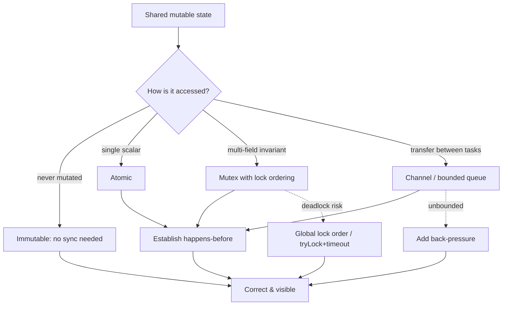

# Concurrency — Interview Questions

> 50+ questions across all skill tiers (Junior → Staff). Each hard question notes **what the interviewer is really checking**. Use as self-review or interview prep. Concurrency is where confident-but-wrong answers get caught fastest — precision matters more here than anywhere else.

---

## Table of Contents

- [Junior (14 questions)](#junior-14-questions)
- [Mid (15 questions)](#mid-15-questions)
- [Senior (15 questions)](#senior-15-questions)
- [Staff (10 questions)](#staff-10-questions)
- [Rapid-Fire](#rapid-fire)
- [Summary](#summary)
- [Further Reading](#further-reading)
- [Related Topics](#related-topics)

---

## Junior (14 questions)

### J1. What is concurrency, and how is it different from parallelism?

<details><summary>Answer</summary>

**Concurrency** is *structuring* a program as independently-progressing tasks; they may interleave on one core. **Parallelism** is *executing* multiple tasks at the same instant on multiple cores. Concurrency is about dealing with many things at once; parallelism is about doing many things at once. You can have concurrency without parallelism (a single-core event loop) and parallelism without explicit concurrency (SIMD).

</details>

### J2. What is a race condition?

<details><summary>Answer</summary>

A bug where the program's correctness depends on the *non-deterministic timing or interleaving* of operations across threads. The classic example is `count++`: read, increment, write — three steps that two threads can interleave so one increment is lost.

</details>

### J3. What is a data race, and how does it differ from a race condition?

<details><summary>Answer</summary>

A **data race** is the *specific* situation where two threads access the same memory location concurrently, at least one access is a write, and there is no synchronization (no happens-before edge) ordering them. In most memory models (C++, Java, Go) a data race is **undefined behavior**.

A race condition is the broader *logical* bug. You can have a race condition with **no** data race — e.g., two correctly-locked operations that are individually atomic but whose combination (`check-then-act`) is not. And you can have a data race that, on a given run, produces the right answer.

> **What the interviewer is checking:** Do you know that "race condition" and "data race" are not synonyms? Strong candidates give the check-then-act example to show a race condition without a data race.

</details>

### J4. What is a mutex?

<details><summary>Answer</summary>

A **mut**ual **ex**clusion lock. Only one thread can hold it at a time; others block until it's released. It creates a *critical section* — code that runs without interference — and (in well-defined memory models) establishes happens-before ordering so writes inside the section are visible to the next holder.

</details>

### J5. What is a deadlock?

<details><summary>Answer</summary>

Two or more threads each waiting forever for a resource the other holds. Thread A holds lock 1 and wants lock 2; thread B holds lock 2 and wants lock 1. Neither can proceed. The whole system (or a subset of it) makes no progress.

</details>

### J6. What is the difference between a mutex and a semaphore?

<details><summary>Answer</summary>

A **mutex** allows one holder and (conceptually) has an *owner* — typically only the locker may unlock. A **semaphore** is a counter allowing up to *N* concurrent holders; any thread may signal it. A binary semaphore (N=1) resembles a mutex but lacks ownership semantics, which is why mutexes are preferred for mutual exclusion and semaphores for *resource counting* (e.g., a pool of 10 connections).

</details>

### J7. What does "thread-safe" mean?

<details><summary>Answer</summary>

A piece of code is thread-safe if it behaves correctly when called from multiple threads concurrently, regardless of interleaving, without requiring the caller to add external synchronization. Thread-safety is a *contract*, not a default — most objects are not thread-safe, and that's fine.

</details>

### J8. Why is `count++` not atomic?

<details><summary>Answer</summary>

It compiles to read-modify-write: load the value, add one, store it back. Between the load and the store, another thread can load the same old value. Both add one to the same number and store it, so one increment is lost. Atomicity must be supplied explicitly (atomic instruction, lock, or single-threaded confinement).

</details>

### J9. What is immutability, and why does it help concurrency?

<details><summary>Answer</summary>

An immutable object never changes after construction. Since there are no writes after publication, there is nothing to synchronize: any number of threads can read it freely with no locks and no data races. Immutability is the cheapest, most reliable thread-safety strategy — "if it can't change, it can't be corrupted."

</details>

### J10. What is a thread pool, and why use one?

<details><summary>Answer</summary>

A set of pre-created worker threads that pull tasks from a queue. It amortizes thread-creation cost, bounds the number of live threads (preventing resource exhaustion), and decouples task *submission* from task *execution*. Creating a thread per request is the classic mistake a pool fixes.

</details>

### J11. What is the producer-consumer problem?

<details><summary>Answer</summary>

One or more producers generate work items and put them on a shared, bounded buffer; one or more consumers take items off and process them. The buffer decouples their rates. The hard parts: blocking when the buffer is full (producers wait) or empty (consumers wait), without busy-waiting or losing items. A blocking queue solves it directly.

</details>

### J12. What is starvation?

<details><summary>Answer</summary>

A thread is perpetually denied a resource it needs to progress, even though the system as a whole makes progress. Causes: unfair locks always granted to other threads, low-priority threads starved by high-priority ones, or a greedy thread that re-acquires a lock before waiters wake.

</details>

### J13. Why shouldn't you `synchronized(this)` (or lock on a public object)?

<details><summary>Answer</summary>

Because *any other code* with a reference to that object can also lock on it, and now they can block your critical section or deadlock with it without your knowledge. Lock on a **private final** object that nobody outside the class can see. This keeps the lock's scope an implementation detail.

</details>

### J14. What is `volatile` (Java) / how do you read a flag from another thread?

<details><summary>Answer</summary>

`volatile` guarantees that reads and writes of a variable go to main memory and are not reordered around, so a write by one thread becomes *visible* to a read by another. It is for **visibility**, not **atomicity** — `volatile count++` is still racy. Use it for simple stop/done flags; use atomics or locks for compound updates.

</details>

---

## Mid (15 questions)

### M1. Name the four Coffman conditions for deadlock.

<details><summary>Answer</summary>

All four must hold simultaneously for deadlock to be possible:

1. **Mutual exclusion** — at least one resource is held in non-shareable mode.
2. **Hold and wait** — a thread holds a resource while waiting for another.
3. **No preemption** — resources can't be forcibly taken; only released voluntarily.
4. **Circular wait** — a cycle of threads each waiting for the next's resource.

Break **any one** and deadlock becomes impossible. Most practical strategies break **circular wait** via global lock ordering, or **hold-and-wait** via acquire-all-or-none.

> **What the interviewer is checking:** Can you name all four *and* connect them to a prevention strategy? Naming them without "break any one to prevent it" is a shallow answer.

</details>

### M2. What is livelock? How does it differ from deadlock?

<details><summary>Answer</summary>

In **deadlock**, threads are blocked and idle. In **livelock**, threads are *actively running* but make no progress — they keep responding to each other and changing state without advancing. The two-people-in-a-hallway who keep stepping the same way is the canonical image. Common cause: naive deadlock recovery where everyone backs off and retries in lockstep. Cure: randomized backoff.

</details>

### M3. Mutex vs channel vs atomic — when do you reach for each?

<details><summary>Answer</summary>

- **Atomic** — a single shared scalar (counter, flag, pointer swap). Lowest overhead, no blocking, but only for one word at a time.
- **Mutex** — protect an *invariant across several fields* or a non-trivial data structure. The default for shared mutable state.
- **Channel / queue** — *transfer ownership* of data between tasks, or model a pipeline / producer-consumer. "Don't communicate by sharing memory; share memory by communicating."

Rule of thumb: if you're guarding state, use a lock or atomic; if you're moving data between stages, use a channel.

</details>

### M4. What is happens-before, and why does it matter?

<details><summary>Answer</summary>

Happens-before is the *partial order* a memory model defines over memory operations. If action A happens-before action B, then A's effects are guaranteed visible to B. Examples of edges: a `volatile`/atomic write happens-before a subsequent read of it; unlocking a mutex happens-before the next lock of it; a thread's `start()` happens-before the new thread's first action.

It matters because without a happens-before edge, the compiler and CPU are free to **reorder** and **cache** writes — so one thread may never see another's update, even on x86. Correct concurrency is the art of establishing the right happens-before edges.

> **What the interviewer is checking:** Do you understand that visibility is *not* automatic? Candidates who think "I wrote it, so the other thread sees it" miss the entire memory-model layer.

</details>

### M5. Why is double-checked locking historically broken?

<details><summary>Answer</summary>

The classic singleton:

```java
if (instance == null) {                 // 1st check (no lock)
    synchronized (lock) {
        if (instance == null)           // 2nd check (locked)
            instance = new Singleton(); // (a) allocate (b) construct (c) assign
    }
}
return instance;
```

Without memory barriers, step (c) — publishing the reference — can be reordered *before* (b) — running the constructor. Another thread takes the fast path, sees a non-null `instance`, and uses a **partially constructed object**. It looks correct and works 99.9% of the time, which is what makes it dangerous.

</details>

### M6. Is double-checked locking OK *now*?

<details><summary>Answer</summary>

**Yes — if you do it correctly.** Since Java 5's revised memory model, declaring the field **`volatile`** makes DCL correct: the volatile write establishes the happens-before edge that prevents the reordering. In C++11, use `std::atomic` with appropriate ordering (or just a function-local `static`, which the standard guarantees thread-safe). In Go, use `sync.Once`.

The honest answer: DCL is correct but rarely worth it. A holder-class idiom (lazy class init, which the JVM synchronizes for you) or `sync.Once` is simpler and just as fast.

> **What the interviewer is checking:** Do you know the *fix* (volatile / atomic) and that the simpler idioms usually win? "DCL is always broken" is outdated; "DCL with volatile is fine but Initialization-on-Demand Holder is cleaner" is the strong answer.

</details>

### M7. What is the GIL?

<details><summary>Answer</summary>

CPython's **Global Interpreter Lock** — a single mutex that serializes execution of Python bytecode so only one thread runs Python code at a time. It exists to make reference-count memory management safe without per-object locks. Consequence: CPU-bound multithreaded Python gets **no parallel speedup** on multiple cores; I/O-bound code does benefit because the GIL is released during blocking I/O. (Python 3.13 ships an experimental free-threaded, no-GIL build.)

</details>

### M8. Does the GIL make Python thread-safe?

<details><summary>Answer</summary>

**No.** The GIL guarantees that a single *bytecode* op is atomic, but most operations you care about span multiple bytecodes. `count += 1` is `LOAD`, `ADD`, `STORE` — the GIL can be released between them, so two threads can still lose an increment. You still need `threading.Lock` for compound operations. The GIL prevents *interpreter corruption*, not *your* race conditions.

> **What the interviewer is checking:** The trap. Many candidates believe the GIL removes the need for locks. It doesn't — it only removes the need for locks *inside the interpreter*.

</details>

### M9. How do you size a thread pool?

<details><summary>Answer</summary>

It depends on the workload:

- **CPU-bound:** ~`number of cores` (or cores + 1). More threads just add context-switch overhead.
- **I/O-bound:** higher, by Little's Law: `threads ≈ cores × (1 + waitTime / computeTime)`. A task that spends 90% waiting can profitably run ~10× cores.

Always **measure**, set an explicit bounded queue, and define a rejection policy. Never use an unbounded queue with a fixed pool — it hides backlog and ends in OOM.

</details>

### M10. What is back-pressure?

<details><summary>Answer</summary>

A feedback mechanism where a slow consumer signals upstream producers to **slow down or stop**, instead of letting work pile up unbounded. Without it, a fast producer + slow consumer fills queues until memory runs out. Implementations: bounded blocking queues (producer blocks when full), reactive `request(n)` demand signals, or dropping/rejecting load (load shedding).

</details>

### M11. What is the readers-writers problem?

<details><summary>Answer</summary>

Many threads read shared data; some write it. Multiple readers can safely proceed concurrently, but a writer needs exclusive access. The solution is a **read-write lock** (`ReadWriteLock`, `sync.RWMutex`): shared read mode, exclusive write mode. The subtlety is *fairness* — a steady stream of readers can starve writers (or vice versa), so real implementations need a fairness policy.

</details>

### M12. What is a race detector and how does it work?

<details><summary>Answer</summary>

A tool that finds **data races** at runtime by instrumenting memory accesses and tracking happens-before relationships (typically a vector-clock algorithm). Go's `-race`, Clang/GCC **ThreadSanitizer**, and Java's tooling all work this way. It reports a race only when the racing accesses actually execute on a given run, so it has **no false positives but can miss races** that the test didn't trigger. Run your test suite under it in CI.

</details>

### M13. What is lock ordering and why does it matter?

<details><summary>Answer</summary>

A **global, consistent order** in which all threads must acquire locks (e.g., always lock account with the lower ID first). It breaks the *circular wait* Coffman condition, making deadlock impossible. The classic bug it fixes: `transfer(A, B)` locks A then B while `transfer(B, A)` locks B then A — a guaranteed deadlock under load. Enforce ordering by a stable key (ID, memory address) or by using a single coarser lock.

</details>

### M14. Are atomics always faster than locks?

<details><summary>Answer</summary>

**No.** Atomics win for a *single* uncontended word. But under **high contention**, an atomic compare-and-swap loop can spin and retry repeatedly, burning CPU and thrashing the cache line (cache-line ping-pong) — sometimes worse than a mutex that parks waiting threads. And atomics can't make a *multi-field* invariant atomic; you'd need a lock anyway. Use atomics for simple counters/flags; benchmark before assuming they beat a lock under contention.

> **What the interviewer is checking:** Whether you treat "lock-free" as a magic speed word. The mature view: lock-free reduces *blocking*, not necessarily *latency under contention*.

</details>

### M15. What is false sharing?

<details><summary>Answer</summary>

Two threads modify *different* variables that happen to sit on the **same CPU cache line** (typically 64 bytes). Each write invalidates the line in the other core's cache, forcing a costly reload — even though the threads never touch the same data. Cure: pad/align hot per-thread fields onto separate cache lines (`@Contended` in Java, padding structs in Go/C++). It's a performance bug, not a correctness bug, but it can silently destroy scalability.

</details>

---

## Senior (15 questions)

### S1. Walk through how you'd diagnose a production deadlock.

<details><summary>Answer</summary>

1. **Confirm symptom:** threads stuck, no progress, CPU often low (deadlock) vs. high (livelock/spin).
2. **Capture a thread dump** (`jstack`, `SIGQUIT`, `kill -ABRT` for Go goroutine dump, `pstack`).
3. **Find the cycle:** locate threads in `BLOCKED`/`waiting to lock` state; trace which lock each holds vs. waits for. JVM dumps even print "Found one Java-level deadlock."
4. **Identify the lock-ordering violation** that created the cycle.
5. **Fix:** impose a global lock order, reduce lock scope, replace nested locks with a single coarser lock, or use `tryLock` with timeout + backoff.
6. **Prevent regression:** add lock-ordering assertions or a deadlock-detection test.

</details>

### S2. How does a `ReadWriteLock` decide between readers and writers, and what's the trap?

<details><summary>Answer</summary>

It maintains shared (read) and exclusive (write) modes. The trap is **fairness and lock upgrade**:

- *Reader-preference* maximizes read throughput but can **starve writers** indefinitely under continuous reads.
- *Writer-preference / fair mode* blocks new readers once a writer is queued, protecting writers at some throughput cost.
- **Upgrading** a read lock to a write lock while holding it commonly **deadlocks** (two readers both wait to upgrade). Most APIs forbid it; you must release the read lock first.

Also: RW locks only pay off when reads vastly outnumber writes *and* critical sections are long enough to amortize their higher overhead vs. a plain mutex.

</details>

### S3. Compare lock-based, lock-free, and wait-free algorithms.

<details><summary>Answer</summary>

| Property | Lock-based | Lock-free | Wait-free |
|---|---|---|---|
| Progress guarantee | none (can deadlock) | *system-wide* progress | *per-thread* bounded steps |
| Blocking | yes | no | no |
| A stalled thread blocks others? | yes | no | no |
| Complexity | low | high | very high |
| Typical use | most code | queues, counters | hard-real-time |

**Lock-free** guarantees *some* thread always makes progress (CAS loops). **Wait-free** guarantees *every* thread finishes in a bounded number of steps. Wait-free is rare because it's extremely hard to implement correctly; lock-based code is the right default.

</details>

### S4. What is the ABA problem?

<details><summary>Answer</summary>

In a CAS loop you read value **A**, and before your compare-and-swap another thread changes it to **B** and back to **A**. Your CAS succeeds because the value matches — but the world changed underneath you (e.g., a node was freed and reallocated). Cure: a **versioned/tagged pointer** (increment a counter alongside the value so A-with-tag-1 ≠ A-with-tag-2), hazard pointers, or epoch-based reclamation. Languages with GC (Java, Go) dodge the memory-reuse flavor but not the logical flavor.

</details>

### S5. What is context cancellation / structured concurrency?

<details><summary>Answer</summary>

**Context cancellation** propagates a "stop now" signal (deadline, timeout, or explicit cancel) down a call tree so spawned tasks shut down promptly and release resources — Go's `context.Context`, .NET's `CancellationToken`.

**Structured concurrency** goes further: child tasks are *lexically scoped* to a parent — the parent block does not return until all children finish (or are cancelled), and a child failure cancels its siblings. This makes concurrency compose like ordinary control flow: no orphaned goroutines, no leaked threads, errors propagate naturally. Java's `StructuredTaskScope`, Kotlin's `coroutineScope`, Swift's task groups, Trio's nurseries.

> **What the interviewer is checking:** Whether you've moved past "fire-and-forget goroutines/threads" to lifecycle ownership. The phrase "every concurrent task must have an owner responsible for its lifetime" signals seniority.

</details>

### S6. Why is "spinning without backoff" an anti-pattern?

<details><summary>Answer</summary>

A tight `while (!ready) {}` busy-wait pegs a core at 100%, starves the very thread that would set `ready`, wastes power, and on a hyperthread degrades the sibling. If you must spin (very short waits), use a **bounded spin then yield/park** strategy, insert a CPU `pause`/`yield` hint, or add exponential backoff. Better: block on a condition variable / channel so the OS wakes you when the condition is actually met.

</details>

### S7. How do condition variables work, and why the `while`-loop wait?

<details><summary>Answer</summary>

A condition variable lets a thread atomically *release a lock and sleep* until another thread *signals* it, then *re-acquire the lock*. You **must** re-check the predicate in a `while` loop, not an `if`, because of:

- **Spurious wakeups** — the thread may wake with no signal.
- **Stolen wakeups** — another thread may consume the condition between signal and wakeup.

```java
synchronized (lock) {
    while (!ready) lock.wait();   // never `if`
    consume();
}
```

Using `if` here is one of the most common concurrency bugs in code review.

</details>

### S8. Is `synchronized` (or a single mutex) "enough" for thread safety?

<details><summary>Answer</summary>

**Not by itself.** A lock makes each *guarded operation* atomic, but it doesn't make *compound* operations atomic. Classic failure — a thread-safe map under check-then-act:

```java
if (!map.containsKey(k))   // atomic
    map.put(k, v);          // atomic
// ...but the gap between them is NOT atomic
```

Two threads can both pass the check. The map is thread-safe; your *use* of it isn't. You need to hold one lock across the whole compound operation, or use an atomic primitive like `putIfAbsent` / `computeIfAbsent`. Thread-safety doesn't compose for free.

> **What the interviewer is checking:** The classic trap. The strong answer names check-then-act / read-modify-write and the `putIfAbsent` fix.

</details>

### S9. How do you make a class immutable in Java, and why does it guarantee thread-safety?

<details><summary>Answer</summary>

- All fields `final` and `private`.
- No setters; no method mutates state.
- `this` never escapes during construction.
- Defensively copy mutable inputs in, and mutable internals out.
- Don't allow subclassing (`final` class) or ensure subclasses preserve the invariant.

The JMM gives a key guarantee: if an object has only `final` fields and `this` didn't escape construction, any thread that obtains a reference sees the **fully initialized** field values **without synchronization** (final-field semantics, "safe publication for free"). That's why immutable objects need no locks.

</details>

### S10. What are the ways to safely publish an object to other threads?

<details><summary>Answer</summary>

Safe publication ensures another thread sees a fully-constructed object (no partial-construction race). The recognized mechanisms:

1. Initialize it from a **static initializer**.
2. Store the reference in a **`volatile`** field or `AtomicReference`.
3. Store it in a **`final`** field of a properly-constructed object.
4. Store it in a field **guarded by a lock** (and read under the same lock).
5. Place it in a **thread-safe collection** (which does the synchronization internally, e.g. `ConcurrentHashMap`, `BlockingQueue`).

Plain assignment to a non-volatile field is **not** safe publication.

</details>

### S11. Coarse-grained vs fine-grained locking — how do you choose?

<details><summary>Answer</summary>

- **Coarse-grained:** one lock for the whole structure. Simple, deadlock-resistant, but a contention bottleneck.
- **Fine-grained:** many locks (per-bucket, per-node, lock striping). Higher throughput under contention, but complex, harder to reason about, and prone to deadlock/lost-update bugs.

Start coarse; profile; go finer only where contention is proven. Often the better move isn't finer locks but *less shared state*: partition data per thread, use immutable snapshots, or switch to a concurrent data structure that already solved this (`ConcurrentHashMap` uses lock striping/CAS internally).

</details>

### S12. What's wrong with using a thread-unsafe collection "under a lock that's only sometimes held"?

<details><summary>Answer</summary>

If *every* access doesn't go through the *same* lock, you have a data race. A common bug: writes are synchronized but a "fast path" read isn't, or one method forgot to lock. The collection's internal invariants (size counters, bucket arrays, rehash state) corrupt silently, producing `ConcurrentModificationException`, lost entries, infinite loops in a resized `HashMap`, or NPEs deep in library code. The rule: a lock protects an object only if **all** accesses — reads included — are consistently guarded by **that same** lock. Document the locking discipline (e.g., `@GuardedBy`).

</details>

### S13. Explain memory ordering: relaxed, acquire-release, sequential consistency.

<details><summary>Answer</summary>

- **Relaxed:** atomicity only; no ordering guarantees relative to other variables. Fine for a pure counter where order doesn't matter.
- **Acquire-release:** a *release* store synchronizes-with an *acquire* load of the same variable, creating a happens-before edge — everything before the release becomes visible after the acquire. This is the workhorse for lock-free publishing (it's exactly what mutex unlock/lock provide).
- **Sequential consistency (seq_cst):** as if all operations occur in one global total order consistent with program order. Easiest to reason about, most expensive (full fences, especially on weakly-ordered ARM/POWER). The default in Java `volatile` and C++ atomics.

Choose the weakest ordering that's still correct; default to seq_cst unless you've proven you need less and measured a win.

</details>

### S14. What is a thundering herd, and how do you mitigate it?

<details><summary>Answer</summary>

Many threads/processes are all blocked on one event; when it fires, *all* wake and contend for one resource, though only one can proceed — wasting cycles and possibly re-blocking. Examples: many requests missing the same cache key and all hitting the DB (cache stampede); many threads waiting on one lock released at once. Mitigations: wake **one** waiter (`signal` not `signalAll` when only one can proceed), request coalescing / single-flight (one fetch, others wait on its result), staggered/randomized backoff, and a brief lock around cache repopulation.

</details>

### S15. How do you test concurrent code?

<details><summary>Answer</summary>

Concurrency bugs are timing-dependent, so ordinary tests miss them. Layered approach:

- **Race detector / ThreadSanitizer** in CI on the full suite.
- **Stress tests:** many threads × many iterations to widen the bug window; assert invariants at the end.
- **Deterministic interleaving tools:** Java's `jcstress`, Lincheck (Kotlin), `loom`/`shuttle` model-checkers that explore interleavings.
- **Inject delays** at suspected windows to force the bad ordering.
- **Property/invariant checks** rather than exact-output assertions.
- Keep critical sections small and prefer immutability so there's less to test.

A green test suite does **not** prove the absence of races — only that none triggered.

</details>

---

## Staff (10 questions)

### St1. When would you choose an actor model over shared-memory locking?

<details><summary>Answer</summary>

When you want to *eliminate shared mutable state* entirely. Each actor owns its state, processes one message at a time from its mailbox, and communicates only by async messages — so there are no locks, no data races, and concurrency reduces to message ordering. Great for stateful distributed systems (Erlang/Elixir, Akka, Orleans virtual actors). Trade-offs: message-passing overhead, harder to express operations that must atomically span multiple actors (you're back to distributed-transaction territory), and mailbox back-pressure must be managed. Choose actors when the domain is naturally entity-per-state; choose shared memory for tight, latency-critical data structures.

</details>

### St2. How do you design back-pressure across an async service boundary (not just in-process)?

<details><summary>Answer</summary>

In-process you block on a bounded queue. Across a network boundary you can't block the producer's thread cheaply, so you need an explicit protocol:

- **Demand signaling** (Reactive Streams `request(n)`, gRPC flow control / HTTP/2 windows): the consumer advertises how much it can take.
- **Bounded buffers + rejection**: return 429/503 and a `Retry-After`, shedding load rather than buffering unboundedly.
- **Pull-based** consumption (Kafka): the consumer reads at its own pace; the broker is the buffer with a retention bound.
- **Credit-based** schemes in messaging systems.

Key principle: *somewhere the chain must be bounded*, and the boundedness must propagate upstream as a signal, or memory/latency blows up at the slowest stage. Pair with timeouts, circuit breakers, and load shedding so back-pressure degrades gracefully instead of cascading into failure.

</details>

### St3. What is a memory model, and why must a language define one?

<details><summary>Answer</summary>

A memory model is the *contract* between programmer, compiler, and hardware specifying which values a read may observe in the presence of concurrent writes — i.e., what reorderings and visibility are legal. It's necessary because compilers reorder/eliminate memory ops for optimization and CPUs have store buffers and weak ordering (especially ARM/POWER). Without a defined model, "correct" concurrent code would be unportable and unreasoning. The model gives you primitives (volatile/atomic, locks) with *defined* happens-before semantics so you can build correct programs on top of unpredictable hardware. The JMM (JSR-133), C++11 model, and Go memory model are the canonical examples; all define a data-race-free program as one whose behavior is sequentially consistent.

</details>

### St4. How do you choose between optimistic and pessimistic concurrency control?

<details><summary>Answer</summary>

- **Pessimistic** (lock first, then act): assumes conflicts are likely. Use under **high contention** or when a conflict is expensive to redo. Cost: blocking, deadlock risk, reduced parallelism.
- **Optimistic** (act, then validate at commit — version checks, CAS, MVCC, `SELECT ... WHERE version = ?`): assumes conflicts are rare. Use under **low contention** or read-heavy workloads. Cost: wasted work and retries when conflicts *do* happen; needs a retry/abort path and idempotency.

Decision driver is the *measured conflict rate*. Many systems combine them: optimistic at the application/DB row level, pessimistic for a few known hotspots.

</details>

### St5. Explain RCU (Read-Copy-Update) and where it shines.

<details><summary>Answer</summary>

RCU lets readers proceed with **zero locks and zero atomics** while writers create a *copy*, mutate it, and atomically swap the pointer; old versions are reclaimed only after a *grace period* during which all pre-existing readers have finished. It shines for **extremely read-heavy, rarely-written** shared structures (kernel routing tables, config) where reader cost must be near-zero. Trade-offs: writers are expensive and complex, reclamation requires tracking grace periods (quiescent states), and it assumes readers are short and don't block. It's the ultimate expression of "make reads free by never mutating in place."

</details>

### St6. A service degrades under load with high CPU but low throughput. Walk the diagnosis.

<details><summary>Answer</summary>

High CPU + low throughput points at *wasted* work, not useful work:

1. **Profile** (flame graph). Look for time in lock acquisition, CAS retry loops, or spin-wait.
2. **Lock contention:** many threads serialized on one hot lock — CPU spent context-switching/spinning, not progressing. Cure: reduce critical section, finer locks, immutable snapshots, or remove the shared state.
3. **CAS livelock / cache-line ping-pong:** a lock-free counter under heavy contention retrying endlessly; check for **false sharing** with `perf c2c`.
4. **Thundering herd / busy-wait:** threads spinning on a condition.
5. **GC pressure** from per-request allocation masquerading as CPU.
6. **Oversized thread pool** thrashing the scheduler.

The signature "CPU pegged but work not getting done" almost always means contention, spinning, or false sharing rather than genuine compute.

</details>

### St7. How do you reason about correctness of a lock-free algorithm?

<details><summary>Answer</summary>

- **Linearizability:** every operation appears to take effect atomically at some instant between its invocation and response, consistent with a sequential history. This is the gold-standard correctness condition.
- Identify the single **linearization point** — the one atomic instruction (usually a CAS) at which the operation "happens."
- Prove the **CAS loop terminates** for *some* thread (lock-freedom) and handle **ABA**.
- Get **memory ordering** right (acquire/release on the linearization point and the data it publishes).
- Verify with a **model checker** (jcstress, Lincheck, CDSChecker, loom) exploring interleavings — hand-proof plus exhaustive small-scale checking.

Because human intuition is unreliable here, "I proved the linearization point and ran it under jcstress" is the only credible answer.

</details>

### St8. How does NUMA affect concurrent design?

<details><summary>Answer</summary>

On NUMA hardware, memory is partitioned per socket; accessing a remote node's memory is slower. Concurrency implications: a lock or shared structure whose memory lives on one node is expensive for threads on another node; thread migration across sockets blows the cache and crosses the interconnect. Strategies: **pin threads** to cores (affinity), allocate per-node (first-touch placement), shard data so each socket touches its own partition, and avoid global locks/counters that bounce across the interconnect (use per-node or striped counters aggregated lazily). Single-node reasoning silently breaks at scale on big servers.

</details>

### St9. Define liveness vs safety properties and give concurrency examples.

<details><summary>Answer</summary>

- **Safety** — "nothing bad ever happens." Examples: no two threads in the critical section (mutual exclusion), no lost updates, no reading a half-constructed object. Violated by a *single bad state*; provable by invariants.
- **Liveness** — "something good eventually happens." Examples: every request eventually served (no deadlock/starvation), a lock is eventually granted (fairness/progress). Violated only by an *infinite execution*; needs progress/fairness arguments.

The tension: stronger safety (more locking) often weakens liveness (more blocking/deadlock risk), and vice versa. Good design balances both explicitly rather than maximizing one. This vocabulary (from Lamport) is how staff engineers frame concurrency guarantees precisely.

</details>

### St10. How would you migrate a deadlock-prone monolith's locking to be reliable without a rewrite?

<details><summary>Answer</summary>

1. **Observe:** add lock-acquisition tracing / a runtime lock-order monitor to map the actual lock graph and find cycles.
2. **Establish a global lock order** and enforce it incrementally (assertions that fail in test when violated).
3. **Shrink critical sections** and remove I/O / callbacks / external calls from inside locks (a common deadlock and latency source).
4. **Replace hotspots** with concurrent data structures or immutable snapshots, eliminating the lock entirely.
5. **Introduce `tryLock` + timeout + bounded backoff** on remaining nested acquisitions so a missed cycle degrades to a retry, not a hang.
6. **Branch by abstraction:** wrap the locking strategy behind an interface so you can swap implementations and roll back safely.
7. **Gate with stress tests + race detector** in CI before each step ships.

Each step is independently shippable and reversible — strangle the bad locking rather than big-bang rewriting it.

</details>

---

## Rapid-Fire

| Question | Answer |
|---|---|
| Race condition vs data race? | Logical timing bug vs unsynchronized concurrent access (≥1 write). |
| Four Coffman conditions? | Mutual exclusion, hold-and-wait, no preemption, circular wait. |
| Break which to prevent deadlock? | Any one — usually circular wait via lock ordering. |
| `volatile` gives atomicity? | No — visibility/ordering only. |
| Does the GIL remove the need for locks? | No — only protects the interpreter, not your compound ops. |
| Atomics always faster than locks? | No — can lose under high contention (CAS spin, cache ping-pong). |
| DCL safe now? | Yes, with `volatile`/atomic — but holder idiom / `sync.Once` is cleaner. |
| Wait on a condition variable with `if`? | No — always `while` (spurious + stolen wakeups). |
| CPU-bound pool size? | ~number of cores. |
| I/O-bound pool size? | cores × (1 + wait/compute). |
| Mutex vs channel? | Guard state vs transfer ownership of data. |
| Lock to use for `synchronized`? | A private final object, never `this` or a public one. |
| Lock-free vs wait-free? | System-wide progress vs per-thread bounded steps. |
| Safe publication? | static init, `volatile`, `final`, lock-guarded, or concurrent collection. |
| What does a race detector miss? | Races not triggered on the run (no false positives, false negatives). |
| Best thread-safety strategy? | Immutability — no writes, nothing to synchronize. |
| Compound op on a thread-safe map? | Use `putIfAbsent`/`computeIfAbsent`, not check-then-act. |
| `signal` vs `signalAll`? | Wake one vs all — `signalAll` risks thundering herd. |

---

## Summary

Concurrency interviews separate people who *use* threads from people who *understand* them. The recurring theme across tiers:



Carry these into the room:

1. **Visibility is not automatic.** Without a happens-before edge (lock, volatile/atomic, final-field publication), one thread may never see another's write.
2. **Distinguish race condition from data race**, and know that thread-safety doesn't compose (check-then-act).
3. **Know the four Coffman conditions** and that breaking any one prevents deadlock — lock ordering is the practical lever.
4. **Resist the magic-bullet traps:** the GIL isn't a lock for *your* code, atomics aren't always faster, DCL is fixable but rarely worth it, `synchronized` alone isn't "enough."
5. **Prefer the simplest tool that's correct:** immutability > confinement > atomic > lock > lock-free, and reach for a channel when you're moving data rather than guarding it.
6. **Own task lifetimes** (structured concurrency, context cancellation) and **bound your queues** (back-pressure).

---

## Further Reading

- *Java Concurrency in Practice* — Goetz et al. (the canonical text; safe publication, JMM, this whole chapter)
- *The Art of Multiprocessor Programming* — Herlihy & Shavit (linearizability, lock-free, wait-free)
- JSR-133: Java Memory Model FAQ — happens-before, final-field semantics, why DCL was broken
- The Go Memory Model (go.dev/ref/mem) — happens-before in Go, why `-race` matters
- *Is Parallel Programming Hard, And, If So, What Can You Do About It?* — McKenney (RCU, memory ordering, NUMA)
- C++ `<atomic>` and `std::memory_order` reference — relaxed / acquire-release / seq_cst

---

## Related Topics

- [Concurrency — Junior](junior.md) · [Concurrency — Professional](professional.md)
- [Clean Code: Concurrency (chapter README)](README.md)
- [Clean Code: Immutability](../14-immutability/README.md) — the cheapest thread-safety strategy
- [Anti-Patterns](../../anti-patterns/README.md) — the concurrency mistakes to recognize and avoid
- [Refactoring](../../refactoring/README.md) — strangling deadlock-prone locking without a rewrite
