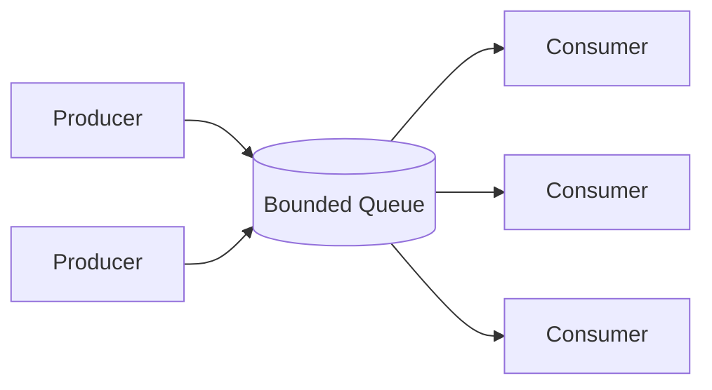

# Concurrency — Junior Level

> **Level:** Junior — "What's the rule? What does clean concurrent code look like?"
> **Source:** Robert C. Martin, *Clean Code*, Chapter 13 — Concurrency.

---

## Table of Contents

1. [Why concurrency is hard](#why-concurrency-is-hard)
2. [Real-world analogy](#real-world-analogy)
3. [Rule 1 — Separate concurrency code from business logic](#rule-1--separate-concurrency-code-from-business-logic)
4. [Rule 2 — Limit and encapsulate shared mutable data](#rule-2--limit-and-encapsulate-shared-mutable-data)
5. [Rule 3 — Keep critical sections small](#rule-3--keep-critical-sections-small)
6. [Rule 4 — Prefer copies, immutability, and message-passing](#rule-4--prefer-copies-immutability-and-message-passing)
7. [Rule 5 — Keep threads as independent as possible](#rule-5--keep-threads-as-independent-as-possible)
8. [Rule 6 — Know your library](#rule-6--know-your-library)
9. [Rule 7 — Know the basic execution models](#rule-7--know-the-basic-execution-models)
10. [Common Mistakes](#common-mistakes)
11. [Test Yourself](#test-yourself)
12. [Cheat Sheet](#cheat-sheet)
13. [Summary](#summary)
14. [Further Reading](#further-reading)
15. [Related Topics](#related-topics)

---

## Why concurrency is hard

**Concurrency** means structuring a program so that multiple things can be *in progress* at the same time — handling many web requests, downloading several files, processing a queue with a pool of workers. Done well, it improves throughput and responsiveness. Done badly, it produces the worst class of bugs in software: ones that appear once a week in production, never reproduce in a debugger, and vanish the moment you add a log line.

The difficulty is not writing threads. It's that **the order in which independent threads run is not under your control**. Two threads reading and writing the same variable can interleave in thousands of ways, and only some of those orderings produce the right answer. The CPU and the compiler are also allowed to reorder and cache memory operations, so a value one thread wrote may not be visible to another thread when you expect.

A **race condition** is when the correctness of your program depends on the timing of threads. The canonical example: two threads both run `balance = balance + 100`. Each one reads `balance`, adds 100, writes it back. If both read the same starting value before either writes, one update is lost. The fix is to make that read-modify-write **atomic** — indivisible — so no other thread can slip in between.

> **Key idea:** Concurrency bugs come from **shared mutable state**. Remove the *shared*, the *mutable*, or both, and most of the danger disappears. Every rule in this chapter is a way to do exactly that.

The rules below are not about exotic algorithms. They are about *structuring* code so that concurrency is contained, visible, and testable — the same instinct as keeping functions small and responsibilities separate, applied to threads.

---

## Real-world analogy

### One kitchen, many cooks

Picture a restaurant kitchen during a dinner rush. Several cooks share one cutting board, one pot, one order ticket spike.

- If two cooks grab the same knife at the same instant, someone gets hurt. (Shared mutable resource, no coordination — a **race**.)
- If one cook holds the only pot for the entire shift "just in case," everyone else stalls. (A **critical section** held far too long.)
- If cooks shout numbers across the room and each keeps a private tally, the totals drift apart. (No single source of truth — **memory visibility**.)

The fix the head chef uses is exactly what good concurrent code does:

1. **Stations** — each cook owns their own board, knives, and ingredients. They don't share. (Independence / copies.)
2. **The pass** — a single counter where finished plates go out and new tickets come in, one at a time. (A **queue / channel** — message-passing.)
3. **The one shared oven** has a rule: you announce, you use it briefly, you step away. (A small, well-defined **critical section** guarded by a lock.)

Nobody coordinates by reading each other's minds. They coordinate by handing things across the pass. That is the heart of clean concurrency: **prefer handing data off over sharing it**.

---

## Rule 1 — Separate concurrency code from business logic

Threading is a **responsibility**, just like persistence or logging. The Single Responsibility Principle says a class or function should have one reason to change. Code that decides *what* to compute should not also be tangled up with *how* it gets scheduled across threads. Mixing them gives you logic you can't unit-test without spinning up threads, and threading you can't reason about without understanding the business rules.

The rule: **put the concurrency in its own layer** — a thread pool, a worker, a channel pipeline — and let the business logic be plain, single-threaded, testable functions that the concurrency layer calls.

### Go — dirty

```go
// Business logic and goroutine management are fused. To test the
// price calculation you must launch goroutines and inspect a shared map.
func ProcessOrders(orders []Order) map[string]float64 {
    results := map[string]float64{}
    var wg sync.WaitGroup
    for _, o := range orders {
        wg.Add(1)
        go func(o Order) {
            defer wg.Done()
            total := 0.0
            for _, item := range o.Items {
                total += item.Price * float64(item.Qty) // business logic, buried
            }
            results[o.ID] = total // DATA RACE: concurrent map write
        }(o)
    }
    wg.Wait()
    return results
}
```

### Go — clean

```go
// Pure, testable business logic. No goroutines, no locks.
func orderTotal(o Order) float64 {
    total := 0.0
    for _, item := range o.Items {
        total += item.Price * float64(item.Qty)
    }
    return total
}

// Concurrency lives in its own function. It only schedules; it does not
// know how a total is computed.
func ProcessOrders(orders []Order) map[string]float64 {
    type result struct {
        id    string
        total float64
    }
    out := make(chan result, len(orders))
    var wg sync.WaitGroup
    for _, o := range orders {
        wg.Add(1)
        go func(o Order) {
            defer wg.Done()
            out <- result{o.ID, orderTotal(o)} // hand off, don't share
        }(o)
    }
    go func() { wg.Wait(); close(out) }()

    results := map[string]float64{}
    for r := range out { // single goroutine owns the map: no race
        results[r.id] = r.total
    }
    return results
}
```

`orderTotal` can now be unit-tested with no threads at all. The map is written by exactly one goroutine, so there is no race.

### Java — clean

```java
// Pure business logic — no threading.
double orderTotal(Order o) {
    return o.items().stream()
        .mapToDouble(i -> i.price() * i.qty())
        .sum();
}

// Concurrency layer: a pool computes totals; results are collected safely.
Map<String, Double> processOrders(List<Order> orders) throws Exception {
    ExecutorService pool = Executors.newFixedThreadPool(8);
    try {
        Map<String, Future<Double>> futures = new LinkedHashMap<>();
        for (Order o : orders) {
            futures.put(o.id(), pool.submit(() -> orderTotal(o)));
        }
        Map<String, Double> results = new LinkedHashMap<>();
        for (var e : futures.entrySet()) {
            results.put(e.getKey(), e.getValue().get()); // collected on one thread
        }
        return results;
    } finally {
        pool.shutdown();
    }
}
```

### Python — clean

```python
from concurrent.futures import ThreadPoolExecutor

# Pure business logic — trivially unit-testable.
def order_total(order):
    return sum(item.price * item.qty for item in order.items)

# Concurrency layer is separate. (See Rule 6 on the GIL for when this helps.)
def process_orders(orders):
    with ThreadPoolExecutor(max_workers=8) as pool:
        # zip preserves the pairing of id -> result; no shared dict mutation.
        totals = pool.map(order_total, orders)
        return {o.id: t for o, t in zip(orders, totals)}
```

> **Takeaway:** If you can't test your business logic without starting a thread, your concurrency and your logic are fused. Split them.

---

## Rule 2 — Limit and encapsulate shared mutable data

Every piece of data shared between threads is a liability. The fewer there are, the fewer places a race can hide. So **minimize shared data**, and for whatever must be shared, **encapsulate it** behind a type that owns the locking. Callers should never have to remember "take the lock before touching this field." The object enforces it.

### Go — dirty

```go
// The mutex and the data are separate. Every caller must remember to lock.
// One forgotten Lock() anywhere is a race.
var mu sync.Mutex
var counter int

func handle() {
    counter++ // OOPS: forgot to lock. Compiles fine. Races in production.
}
```

### Go — clean

```go
// The lock and the data it protects live together, unexported.
// Callers cannot touch count except through methods that lock.
type Counter struct {
    mu    sync.Mutex
    count int
}

func (c *Counter) Inc() {
    c.mu.Lock()
    defer c.mu.Unlock()
    c.count++
}

func (c *Counter) Value() int {
    c.mu.Lock()
    defer c.mu.Unlock()
    return c.count
}
```

### Java — clean

```java
// Encapsulated counter. The lock is a private field; the data is private.
// No caller can mutate count without going through a synchronized method.
public final class Counter {
    private int count; // private — only this class touches it

    public synchronized void inc() { count++; }
    public synchronized int value() { return count; }
}
```

### Python — clean

```python
import threading

class Counter:
    def __init__(self):
        self._lock = threading.Lock()
        self._count = 0  # leading underscore: private by convention

    def inc(self):
        with self._lock:
            self._count += 1

    def value(self):
        with self._lock:
            return self._count
```

> **Takeaway:** A lock that lives next to the data it protects, behind a private boundary, cannot be forgotten. A lock that lives "somewhere" and must be remembered will eventually be forgotten.

---

## Rule 3 — Keep critical sections small

A **critical section** is the stretch of code that runs while holding a lock. While you hold a lock, every other thread that wants it is blocked — stalled, doing nothing. So a critical section is a tax on parallelism. The rule: **hold the lock for as few instructions as possible**, and never do slow work (I/O, network calls, sleeping) while holding it.

### Java — dirty

```java
// HTTP call happens inside the lock. Every other thread waiting for this
// lock is frozen for the entire round-trip — could be seconds.
public synchronized void refreshAndStore(String key) {
    Data data = httpClient.fetch(key); // SLOW network call under the lock!
    cache.put(key, data);
}
```

### Java — clean

```java
// Do the slow work with NO lock held. Only the brief map write is guarded.
public void refreshAndStore(String key) {
    Data data = httpClient.fetch(key); // slow work, lock-free
    synchronized (cacheLock) {          // tiny critical section
        cache.put(key, data);
    }
}
```

### Go — clean

```go
func (s *Store) RefreshAndStore(key string) error {
    data, err := s.fetch(key) // slow I/O OUTSIDE the lock
    if err != nil {
        return err
    }
    s.mu.Lock()
    s.cache[key] = data // only the write is inside the lock
    s.mu.Unlock()
    return nil
}
```

### Python — clean

```python
def refresh_and_store(self, key):
    data = self._http.fetch(key)   # slow call, no lock
    with self._lock:               # narrow critical section
        self._cache[key] = data
```

> **Takeaway:** Locks are about protecting *shared state*, not about doing *work*. Compute and fetch outside the lock; take the lock only to publish the result.

---

## Rule 4 — Prefer copies, immutability, and message-passing

The safest shared data is data that is never mutated, or never shared at all. Three techniques, in order of preference:

1. **Immutability** — if data can't change after creation, any number of threads can read it freely without locks. (See [`../14-immutability/README.md`](../14-immutability/README.md).)
2. **Copies** — give each thread its own copy to work on, then merge the results. No shared writes, no races.
3. **Message-passing** — instead of two threads touching the same variable, one thread *sends* the data to another over a queue/channel. Ownership transfers; only one thread touches it at a time.

This is the philosophy behind Go's slogan: *"Do not communicate by sharing memory; instead, share memory by communicating."*

### Go — message-passing instead of a shared counter

```go
// Dirty: shared counter guarded by a mutex on a hot path.
// Clean: each worker keeps a private tally and sends one final number.
func sumWork(jobs []Job, workers int) int {
    chunks := split(jobs, workers)
    partials := make(chan int, workers)

    for _, chunk := range chunks {
        go func(chunk []Job) {
            local := 0 // private to this goroutine — no sharing
            for _, j := range chunk {
                local += j.Cost()
            }
            partials <- local // send the result, don't share the accumulator
        }(chunk)
    }

    total := 0
    for i := 0; i < workers; i++ {
        total += <-partials // one goroutine merges; no lock needed
    }
    return total
}
```

### Java — immutable snapshot

```java
// An immutable config can be read by any number of threads with no lock.
// "Updating" means publishing a brand-new object via a volatile reference.
public final class Config {
    private final int timeoutMs;
    private final List<String> hosts;

    public Config(int timeoutMs, List<String> hosts) {
        this.timeoutMs = timeoutMs;
        this.hosts = List.copyOf(hosts); // defensive copy → truly immutable
    }
    public int timeoutMs() { return timeoutMs; }
    public List<String> hosts() { return hosts; }
}

// A single volatile reference. Readers never lock; a writer swaps the whole object.
private volatile Config config = new Config(5000, List.of("a", "b"));

public Config current() { return config; }            // lock-free read
public void reload(Config next) { this.config = next; } // atomic reference swap
```

### Python — message-passing with a queue

```python
import queue, threading

def worker(jobs: queue.Queue, results: queue.Queue):
    total = 0
    while True:
        job = jobs.get()
        if job is None:        # sentinel: time to stop
            jobs.task_done()
            break
        total += job.cost      # local accumulation, no shared state
        jobs.task_done()
    results.put(total)         # hand the partial result back

# The main thread merges partials; no worker mutates shared data directly.
```

> **Takeaway:** The ideal amount of shared mutable state is *zero*. Immutability removes the *mutable*; message-passing removes the *shared*. Reach for these before you reach for a lock.

---

## Rule 5 — Keep threads as independent as possible

Threads that don't touch each other can't corrupt each other. Design each unit of concurrent work so it operates on **its own data** and depends on **as little shared context as possible** — ideally nothing but its inputs. The closer a worker is to a pure function of its input, the less you have to reason about ordering.

A classic mistake is sharing a loop variable or a mutable accumulator across goroutines/threads. Capture inputs **by value**, return outputs explicitly.

### Go — the classic loop-variable bug

```go
// Dirty (pre–Go 1.22 semantics, and a good habit regardless):
// all goroutines may capture the SAME `o`, observing whatever value it
// holds when they finally run — usually the last element.
for _, o := range orders {
    go func() {
        process(o) // captures the shared loop variable
    }()
}

// Clean: pass the input as an argument so each goroutine gets its own copy.
for _, o := range orders {
    go func(o Order) { // o is now a per-goroutine parameter
        process(o)
    }(o)
}
```

### Java — independent tasks, no shared accumulator

```java
// Each task is self-contained: it takes one input, returns one output.
// Nothing is shared between tasks except the (thread-safe) executor.
List<Future<Receipt>> futures = new ArrayList<>();
for (Order o : orders) {
    futures.add(pool.submit(() -> process(o))); // o captured by value (effectively final)
}
// Results gathered on the calling thread — the only place they meet.
List<Receipt> receipts = new ArrayList<>();
for (Future<Receipt> f : futures) receipts.add(f.get());
```

### Python — pure worker function

```python
# Each call to process_one only sees its argument and returns a value.
# No globals, no shared mutable default arguments, no cross-talk.
def process_one(order):
    return Receipt(order.id, order_total(order))

with ThreadPoolExecutor(max_workers=8) as pool:
    receipts = list(pool.map(process_one, orders))
```

> **Takeaway:** The best concurrent task looks like a pure function: inputs in, result out, nothing shared. Make your workers boring and independent.

---

## Rule 6 — Know your library

You almost never need to invent concurrency primitives. Modern standard libraries ship battle-tested tools; using the wrong one (or hand-rolling your own) is how subtle bugs are born. Learn what your language gives you.

### Go

| Tool | Use it for |
|---|---|
| `go func()` + **channels** | The default. Hand data between goroutines. |
| `sync.Mutex` / `sync.RWMutex` | Guard a small piece of shared state. `RWMutex` allows many readers. |
| `sync/atomic` | Lock-free counters and flags (`atomic.Int64`, `atomic.Bool`). |
| `sync.WaitGroup` | Wait for a set of goroutines to finish. |
| `sync.Once` | Run initialization exactly once (safe lazy init). |
| `context.Context` | Cancellation and deadlines across goroutine trees. |

```go
// Lock-free counter — no mutex needed for a single integer.
var hits atomic.Int64
func record() { hits.Add(1) }
func total() int64 { return hits.Load() }
```

### Java — `java.util.concurrent`

| Tool | Use it for |
|---|---|
| `ExecutorService` / `Executors` | A managed thread pool. Never spawn raw `new Thread()` per task. |
| `ConcurrentHashMap` | A map safe for concurrent reads and writes. |
| `BlockingQueue` (`LinkedBlockingQueue`) | Producer–consumer hand-off. |
| `AtomicInteger` / `AtomicLong` | Lock-free counters. |
| `ReentrantLock` / `ReadWriteLock` | Explicit locking with more control than `synchronized`. |
| `CompletableFuture` | Composable async results. |

```java
// Lock-free counter — atomic, no synchronized block.
AtomicInteger hits = new AtomicInteger();
hits.incrementAndGet();
int total = hits.get();

// A thread-safe map: no external locking needed for individual operations.
ConcurrentHashMap<String, Integer> counts = new ConcurrentHashMap<>();
counts.merge(key, 1, Integer::sum); // atomic increment of a map entry
```

### Python — `threading`, `queue`, and the GIL

Python's **Global Interpreter Lock (GIL)** means only one thread runs Python bytecode at a time. The consequence:

- **I/O-bound** work (network, disk, waiting) — threads help, because a thread waiting on I/O releases the GIL. Use `threading` / `ThreadPoolExecutor`.
- **CPU-bound** work (number crunching) — threads do *not* speed it up; the GIL serializes them. Use `multiprocessing` / `ProcessPoolExecutor` to get true parallelism across cores.

```python
import threading, queue
from concurrent.futures import ThreadPoolExecutor, ProcessPoolExecutor

# I/O-bound (downloading): threads are the right tool.
with ThreadPoolExecutor(max_workers=16) as pool:
    pages = list(pool.map(fetch_url, urls))

# CPU-bound (hashing, compression): processes sidestep the GIL.
with ProcessPoolExecutor() as pool:
    digests = list(pool.map(expensive_hash, blobs))

# Thread-safe hand-off: queue.Queue has all locking built in.
work = queue.Queue()
```

> **Takeaway:** A `ConcurrentHashMap`, an `atomic.Int64`, or a `queue.Queue` is written and reviewed by experts and tested for years. Your hand-rolled version is not. Use the library.

---

## Rule 7 — Know the basic execution models

A handful of patterns cover most concurrent designs. Recognizing them gives you a vocabulary and a known-good structure to copy.

### Producer–Consumer

One or more **producers** put work into a bounded queue; one or more **consumers** take it out. The queue decouples them — producers don't block on consumers, and the queue's capacity provides natural back-pressure (producers slow down when consumers fall behind).



```go
// Go: a channel IS a bounded producer–consumer queue.
jobs := make(chan Job, 100) // buffer of 100 = back-pressure

// Producer
go func() {
    for _, j := range incoming {
        jobs <- j
    }
    close(jobs) // signal: no more work
}()

// Consumers (a pool of workers)
for i := 0; i < 4; i++ {
    go func() {
        for j := range jobs { // ranges until the channel is closed and drained
            handle(j)
        }
    }()
}
```

```python
# Python: queue.Queue is the standard producer–consumer hand-off.
import queue, threading

jobs = queue.Queue(maxsize=100)

def consumer():
    while True:
        job = jobs.get()
        if job is None:   # poison pill stops the consumer
            break
        handle(job)
        jobs.task_done()

threading.Thread(target=consumer, daemon=True).start()
```

### Readers–Writers

Many threads read a resource; few write it. Reads don't conflict with each other, so they can run in parallel; a write needs exclusive access. A **read-write lock** lets many readers in simultaneously but gives a writer exclusive entry.

```go
// Go: sync.RWMutex — many concurrent RLock holders, one Lock holder.
type Cache struct {
    mu sync.RWMutex
    m  map[string]string
}

func (c *Cache) Get(k string) (string, bool) {
    c.mu.RLock()         // shared read lock — many readers at once
    defer c.mu.RUnlock()
    v, ok := c.m[k]
    return v, ok
}

func (c *Cache) Set(k, v string) {
    c.mu.Lock()          // exclusive write lock — blocks all readers
    defer c.mu.Unlock()
    c.m[k] = v
}
```

```java
// Java: ReentrantReadWriteLock.
private final ReadWriteLock lock = new ReentrantReadWriteLock();

String get(String k) {
    lock.readLock().lock();
    try { return map.get(k); }
    finally { lock.readLock().unlock(); }
}
void set(String k, String v) {
    lock.writeLock().lock();
    try { map.put(k, v); }
    finally { lock.writeLock().unlock(); }
}
```

> **Takeaway:** Before designing concurrency from scratch, ask "is this producer–consumer? readers–writers?" Usually it is, and the structure is already solved.

---

## Common Mistakes

These are the anti-patterns to recognize and avoid. Each one has bitten experienced engineers.

### 1. Shared mutable state without locks

The original sin. Two threads read-modify-write the same variable; updates are silently lost.

```go
// BROKEN: concurrent writes to a plain int and a plain map. Data race.
var total int
var seen = map[string]bool{}

func record(id string) {
    total++          // lost updates
    seen[id] = true  // concurrent map write → Go panics at runtime
}
```

**Fix:** protect with a mutex (Rule 2), use an atomic (`atomic.Int64`), or avoid sharing (Rule 4). In Go, run tests with `go test -race` to catch these.

### 2. Double-checked locking

A "clever" lazy-init pattern that is **broken** under most memory models because a partially-constructed object can become visible to another thread before its fields are set.

```java
// BROKEN: the object reference can be published before its fields are written.
private Service instance;
public Service get() {
    if (instance == null) {           // 1st check (no lock)
        synchronized (this) {
            if (instance == null) {   // 2nd check
                instance = new Service(); // may publish a half-built object!
            }
        }
    }
    return instance;
}
```

**Fix:** use the idiom your language guarantees — Java's lazy-holder class, or `volatile`; Go's `sync.Once`:

```go
var once sync.Once
var instance *Service
func Get() *Service {
    once.Do(func() { instance = NewService() }) // guaranteed safe, exactly once
    return instance
}
```

### 3. `synchronized` on `this` (or a public object)

When you `synchronized(this)`, *any other code that can reference your object* can also `synchronized` on it and block you — or deadlock you. The lock is part of your public surface whether you meant it or not.

```java
// RISKY: external code holding a reference can synchronize on the same monitor.
public synchronized void update() { ... } // locks on `this`

// SAFER: lock on a private object nobody else can see.
private final Object lock = new Object();
public void update() {
    synchronized (lock) { ... }
}
```

### 4. Spinning without backoff

Busy-waiting in a tight loop burns a CPU core doing nothing and starves other threads.

```python
# WASTEFUL: pegs a core at 100%.
while not ready:
    pass

# BETTER: wait on a condition/event so the OS can sleep the thread.
event.wait()  # threading.Event — sleeps until set, zero CPU
```

If you must poll, sleep with increasing backoff. Better still, use a condition variable, channel, or `BlockingQueue` so the runtime wakes you when there's work.

### 5. Forgetting `volatile` / atomic semantics on lock-free reads

A flag written by one thread may never be *seen* by another without proper memory semantics, because each thread can cache the value.

```java
// BROKEN: the reader may spin forever — it can cache `running == true`.
private boolean running = true;        // missing `volatile`
public void stop() { running = false; }
public void run() { while (running) { work(); } }

// FIXED: volatile guarantees the write is visible to other threads.
private volatile boolean running = true;
```

In Go, use `atomic.Bool`; in Python the GIL makes simple flag reads visible, but a `threading.Event` is the clear, correct tool.

### 6. Thread-unsafe collections under a lock held only sometimes

A `HashMap` (Java) or plain `dict`/`map` is safe under concurrency *only* if **every** access takes the same lock. One unguarded read or write anywhere reintroduces the race.

```java
// BROKEN: writes are locked, but this read is not — racey, can see corruption.
private final Map<String, Integer> counts = new HashMap<>();
public void inc(String k) { synchronized (lock) { counts.merge(k, 1, Integer::sum); } }
public int get(String k) { return counts.getOrDefault(k, 0); } // UNLOCKED read!

// FIXED: use ConcurrentHashMap (every op is safe) OR lock every access consistently.
private final Map<String, Integer> counts = new ConcurrentHashMap<>();
```

---

## Test Yourself

<details>
<summary>1. What is a race condition, in one sentence?</summary>

A race condition is when the correctness of a program depends on the relative timing or interleaving of threads — typically because two or more threads access shared mutable data and at least one of them writes to it without coordination.
</details>

<details>
<summary>2. Why should you keep critical sections small?</summary>

Because while a thread holds a lock, every other thread that wants that lock is blocked and idle. A large critical section — especially one containing I/O or sleeping — serializes your program and destroys the parallelism you were trying to gain. Hold the lock only long enough to read or publish shared state; do slow work outside it.
</details>

<details>
<summary>3. Why is double-checked locking considered broken?</summary>

Without correct memory semantics, the assignment `instance = new Service()` can become visible to other threads *before* the object's constructor has finished writing its fields. A second thread passing the first (unlocked) null-check can therefore return a partially-constructed object. Use a guaranteed-safe idiom instead: Go's `sync.Once`, Java's lazy-holder class, or a `volatile` field.
</details>

<details>
<summary>4. You have a read-heavy cache: thousands of reads, occasional writes. Which lock?</summary>

A read-write lock (`sync.RWMutex` in Go, `ReentrantReadWriteLock` in Java). It lets many readers proceed in parallel while giving writers exclusive access. A plain mutex would needlessly serialize the reads. Even better, if the data can be made immutable, swap a whole new immutable object via an atomic reference and let readers run lock-free.
</details>

<details>
<summary>5. In Python, you have CPU-bound work. Will threads speed it up? Why or why not?</summary>

No. The Global Interpreter Lock (GIL) allows only one thread to execute Python bytecode at a time, so CPU-bound threads run effectively serially. Use `multiprocessing` / `ProcessPoolExecutor` for true parallelism across cores. Threads *do* help for I/O-bound work, because a thread blocked on I/O releases the GIL.
</details>

<details>
<summary>6. What's wrong with <code>synchronized(this)</code>?</summary>

The lock (`this`) is publicly reachable. Any external code holding a reference to your object can synchronize on the same monitor — accidentally blocking your methods or creating a deadlock you can't see from your own class. Lock on a private, dedicated object that nothing else can reference.
</details>

<details>
<summary>7. Rewrite this safely: a worker pool computing totals into a shared <code>map[string]float64</code>.</summary>

Don't let workers write the shared map. Have each worker send its `(id, total)` result over a channel (Go) or return a `Future` (Java) / use `pool.map` (Python), and let **one** goroutine/thread build the map from those results. Single-writer ownership eliminates the race without any lock on the map. (See Rule 1's clean example.)
</details>

<details>
<summary>8. Why does the slogan "share memory by communicating" lead to safer code?</summary>

Because at any moment a piece of data is owned by exactly one goroutine/thread — it's sent over a channel/queue rather than touched concurrently. Single ownership means no two threads write the same memory at once, so there's nothing to lock and no race to reason about. It turns a synchronization problem into a hand-off problem.
</details>

---

## Cheat Sheet

| Situation | Reach for |
|---|---|
| Hand data between threads | Channel (Go) · `BlockingQueue` (Java) · `queue.Queue` (Python) |
| Count something concurrently | `atomic.Int64` · `AtomicInteger` · (Python: lock or `Queue`) |
| Guard a small shared field | `sync.Mutex` · `synchronized`/`ReentrantLock` · `threading.Lock` |
| Read-heavy, write-rare data | `sync.RWMutex` · `ReentrantReadWriteLock` |
| Run a pool of workers | goroutines + `WaitGroup` · `ExecutorService` · `ThreadPoolExecutor` |
| One-time init | `sync.Once` · lazy-holder class · module-level init |
| CPU-bound work in Python | `ProcessPoolExecutor` / `multiprocessing` (not threads) |
| Cancellation / deadlines | `context.Context` · `Future.cancel` · cooperative flag/`Event` |
| Catch data races (Go) | `go test -race` |

**Rules in one line each:**

1. Separate concurrency code from business logic (SRP for threads).
2. Limit shared mutable data; encapsulate the lock with the data.
3. Keep critical sections small; never do I/O under a lock.
4. Prefer immutability → copies → message-passing over shared state.
5. Make workers independent — like pure functions: inputs in, result out.
6. Know your library; don't hand-roll primitives.
7. Recognize producer–consumer and readers–writers.

**Avoid:** shared mutable state without locks · double-checked locking · `synchronized(this)` · spinning without backoff · missing `volatile`/atomic on lock-free reads · unsafe collections under inconsistent locking.

---

## Summary

Concurrency bugs are the hardest bugs in software because they depend on timing you don't control and rarely reproduce on demand. The defense is not cleverness — it's **structure**. Every rule here reduces the surface area where a race can occur:

- **Separate** threading from logic so each can be understood and tested alone.
- **Limit and encapsulate** shared mutable data so the lock can't be forgotten.
- **Shrink** critical sections so the lock is held briefly and never during I/O.
- **Prefer** immutable data, private copies, and message-passing — they remove the *shared* or the *mutable* entirely.
- **Keep** workers independent, like pure functions.
- **Lean on** your standard library's concurrent collections, executors, atomics, and channels.
- **Recognize** the producer–consumer and readers–writers models — most designs are one of them.

The throughline: the safest shared mutable state is the kind that doesn't exist. When in doubt, hand data off instead of sharing it.

---

## Further Reading

- Robert C. Martin, *Clean Code*, Chapter 13 — "Concurrency."
- Brian Goetz et al., *Java Concurrency in Practice* — the definitive treatment of the JVM memory model and `java.util.concurrent`.
- The Go Blog, "Share Memory By Communicating" and "Go Concurrency Patterns."
- Python docs: `threading`, `queue`, `concurrent.futures`, and "What is the GIL?"

---

## Related Topics

- [`middle.md`](middle.md) — where these rules break down in real systems: deadlock, livelock, lock ordering, and testing concurrent code.
- [`senior.md`](senior.md) — memory models, lock-free design, and architecting concurrency at the system level.
- [Chapter README](../README.md) — the full Concurrency anti-pattern catalogue.
- [Immutability](../14-immutability/README.md) — the single most powerful tool for safe sharing.
- [Async and Functional](../12-async-and-functional/README.md) — async/await and functional styles that sidestep shared state.
- [Error Handling](../06-error-handling/README.md) — propagating and aggregating errors across concurrent tasks.
- [Anti-Patterns](../../anti-patterns/README.md) — broader catalogue of practices to avoid.
- [Refactoring](../../refactoring/README.md) — restructuring tangled code, including untangling concurrency from logic.
