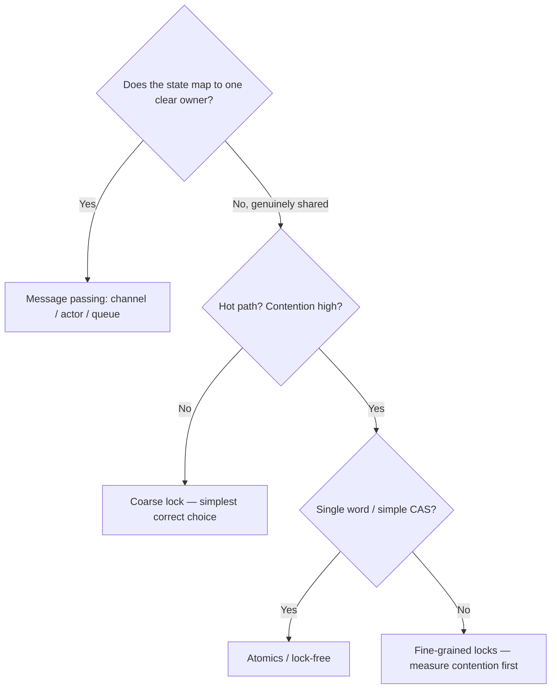

# Concurrency — Middle Level

> Focus: "Why?" and "When does it bend?" — the trade-offs behind shared-memory vs message-passing, lock granularity, lock-free atomics, the four classic hazards, memory-model visibility, the GIL's real meaning, and structured concurrency. Go + Java + Python.

---

## Table of Contents

1. [The one decision: shared memory vs message passing](#the-one-decision-shared-memory-vs-message-passing)
2. [Lock granularity: coarse vs fine](#lock-granularity-coarse-vs-fine)
3. [When lock-free / atomics earn their complexity](#when-lock-free--atomics-earn-their-complexity)
4. [The four hazards and how to avoid each](#the-four-hazards-and-how-to-avoid-each)
5. [Memory models and visibility](#memory-models-and-visibility)
6. [The GIL: what it actually means for Python](#the-gil-what-it-actually-means-for-python)
7. [Structured concurrency, errgroup, and context cancellation](#structured-concurrency-errgroup-and-context-cancellation)
8. [Idempotency and retries](#idempotency-and-retries)
9. [Common Mistakes](#common-mistakes)
10. [Test Yourself](#test-yourself)
11. [Cheat Sheet](#cheat-sheet)
12. [Summary](#summary)
13. [Further Reading](#further-reading)
14. [Related Topics](#related-topics)

---

## The one decision: shared memory vs message passing

Every concurrency design starts with one question: **how do two units of execution agree on a value?** There are exactly two answers, and most production bugs trace back to picking the wrong one or mixing them carelessly.

### Shared memory with locks

State lives in one place. Multiple threads read and write it, and a mutex serializes access so only one is inside the critical section at a time.

```java
class Counter {
    private final Object lock = new Object();
    private long value;

    void increment() {
        synchronized (lock) { value++; }   // read-modify-write is atomic only inside the lock
    }
    long get() {
        synchronized (lock) { return value; }
    }
}
```

**When it wins:** the state is small, the access pattern is simple, and the cost of copying the data would be higher than the cost of locking. A reference counter, an in-memory cache, a connection pool.

**Where it bends:** every reader and writer must agree on *which* lock guards *which* field. That agreement is a convention the compiler cannot check. As the struct grows, the convention frays, and you get the worst bug in concurrency — the field that is "usually" locked.

### Message passing ("share memory by communicating")

State is owned by exactly one goroutine/thread. Others don't touch it; they send a message and wait for a reply. Go's motto is the canonical statement:

> Do not communicate by sharing memory; instead, share memory by communicating.

```go
// One goroutine owns `total`. Nobody else can race on it because nobody else sees it.
func counter(ops <-chan func(int) int, results chan<- int) {
    total := 0
    for op := range ops {
        total = op(total)
        results <- total
    }
}
```

**When it wins:** the ownership boundary maps to a real domain boundary (one goroutine per connection, per request, per partition). You eliminate whole classes of races by construction — there is no shared field to race on.

**Where it bends:** message passing is not free. Each hand-off is an allocation + a scheduling point + a copy. For a hot counter incremented a million times a second, a channel is 10–50× slower than an atomic add. And channels can *re-introduce* the hazards you fled — a deadlock from two goroutines each blocked sending to a full channel is just as fatal as a lock-order deadlock.

### The honest rule

Neither is universally correct. Use **message passing for coordination and ownership transfer** (who works on what), and **shared memory + locks (or atomics) for hot, fine-grained shared counters/caches** where copying would dominate. The mistake is dogma in either direction: a channel around a single integer is cargo-culting Go; a 12-mutex spaghetti for a request-scoped pipeline is cargo-culting Java.



---

## Lock granularity: coarse vs fine

A **coarse lock** guards a large region (one mutex for the whole map). A **fine-grained lock** guards a small slice (one mutex per bucket, per row, per shard).

### Coarse: simple, correct, and the right default

```go
type Store struct {
    mu sync.Mutex
    m  map[string]int
}
func (s *Store) Get(k string) int      { s.mu.Lock(); defer s.mu.Unlock(); return s.m[k] }
func (s *Store) Set(k string, v int)   { s.mu.Lock(); defer s.mu.Unlock(); s.m[k] = v }
```

One lock, impossible to deadlock (there's only one), trivial to reason about. **Start here.** You should only move off coarse locking when you have *measured* contention — the metric is "threads spend significant time blocked waiting for this lock," not "I imagine this might be slow."

### Fine-grained: faster under contention, much harder to get right

Sharding the lock lets unrelated keys proceed in parallel:

```go
type ShardedStore struct {
    shards [256]struct {
        mu sync.Mutex
        m  map[string]int
    }
}
func (s *ShardedStore) shard(k string) *... { return &s.shards[fnv(k)%256] }
```

The win is real: 256 shards means up to 256 concurrent writers that touch different keys. The cost is also real:

- **Lock ordering becomes a liability.** Any operation that touches two shards (e.g., "move key A to key B") must acquire both — and if two threads acquire them in opposite order, you deadlock. Now you need a global ordering rule.
- **Cross-shard invariants vanish.** You can no longer read a globally consistent snapshot without locking everything, which defeats the purpose.
- **`RWMutex` is not a free upgrade.** A read-write lock helps only when reads vastly outnumber writes *and* read critical sections are long enough to amortize the higher bookkeeping cost. Under write-heavy load, `RWMutex` is slower than a plain `Mutex` because of its internal accounting.

### The trade-off, stated plainly

| | Coarse lock | Fine-grained locks |
|---|---|---|
| Correctness effort | Low | High (lock ordering, deadlock avoidance) |
| Throughput, low contention | Same | Same (extra overhead, no benefit) |
| Throughput, high contention | Poor (serializes everything) | Good (parallel on disjoint data) |
| Reasoning | "One lock, held briefly" | "Which locks, in what order, always" |

Rule: **coarse until proven contended, then shard along a key that already partitions your data.** Don't invent a partitioning that doesn't match the access pattern — you'll pay the complexity and still serialize on the hot shard.

---

## When lock-free / atomics earn their complexity

Atomics (`atomic.AddInt64`, `AtomicLong`, `compare-and-swap`) let you mutate a single word without a lock. They are tempting because they're fast and "lock-free." They are also where most subtle concurrency bugs are born.

### Where atomics clearly win

A single counter or flag, read and written by many threads, on a hot path:

```go
var requests atomic.Int64
func handle() { requests.Add(1) }   // no lock, no contention on a mutex, just a CPU instruction
```

```java
private final AtomicLong requests = new AtomicLong();
void handle() { requests.incrementAndGet(); }
```

A single atomic counter beats a mutex-guarded `long` by a wide margin under contention, because there is no parking/unparking and no critical section to serialize.

### Where atomics turn into a trap

The moment you have **two related values** that must change together, a single atomic is not enough. Consider a bank account with `balance` and `lastTxnId`:

```go
// WRONG: two atomics ≠ one atomic transaction.
balance.Add(-amount)        // another thread can observe the new balance
lastTxnId.Store(txnID)      // ...before this line runs — torn state
```

There is no consistent moment where another reader sees "balance updated AND txn recorded." Atomics give you *per-word* atomicity, never *multi-word* atomicity. For multi-word invariants you need a lock (or a CAS loop over a single immutable struct pointer, which is genuinely hard to get right).

### The CAS loop — powerful, and the source of the ABA problem

`compare-and-swap` reads a value, computes a new one, and swaps only if the value hasn't changed since the read:

```go
for {
    old := p.Load()
    nw := transform(old)
    if p.CompareAndSwap(old, nw) { break }  // retry if someone raced us
}
```

This is correct for monotonic updates, but it has a famous pitfall: the **ABA problem**. If the value goes A → B → A between your read and your CAS, the CAS succeeds even though the world changed underneath you. Pointer-based lock-free stacks hit this constantly; the fix is a tagged pointer or a generation counter — at which point you are well into "professional" territory and should ask whether a lock would have been simpler.

### The honest threshold

Reach for atomics when (a) the shared state is a **single word**, and (b) the operation is a **simple increment, flag, or single-pointer swap**. The instant you have multiple fields, ordering requirements, or "read these three and update those two," use a lock. Lock-free data structures are a specialist tool, not a default; the complexity-to-benefit ratio rarely pays off outside libraries and runtimes.

---

## The four hazards and how to avoid each

| Hazard | What happens | Root cause | Avoidance |
|---|---|---|---|
| **Race condition** | Result depends on timing; corrupted/torn state | Unsynchronized read-modify-write on shared data | Lock the data, or don't share it (message passing), or make it immutable |
| **Deadlock** | Threads wait forever in a cycle | Locks acquired in inconsistent order | Global lock ordering; lock timeouts; acquire-all-or-none |
| **Livelock** | Threads run but make no progress, repeatedly reacting to each other | Naive retry/back-off symmetry | Randomized back-off; break symmetry |
| **Starvation** | One thread never gets the resource | Unfair scheduling/lock policy | Fair locks; bounded priorities; avoid indefinite spinning |

### Race condition

The defining property: **the program is correct only for some interleavings.** `i++` is three operations (read, add, write); two threads can both read `5`, both write `6`, and you lost an increment. The fix is to make the read-modify-write a single indivisible step — a lock, an atomic, or sole ownership.

### Deadlock

The four Coffman conditions must all hold; break any one. The practical lever is **lock ordering**: if every thread always acquires locks in the same global order (e.g., by address or by ID), a cycle is impossible.

```go
// Always lock the lower ID first — no two threads can form a cycle.
func transfer(a, b *Account, amt int) {
    first, second := a, b
    if a.id > b.id { first, second = b, a }
    first.mu.Lock(); defer first.mu.Unlock()
    second.mu.Lock(); defer second.mu.Unlock()
    a.balance -= amt; b.balance += amt
}
```

### Livelock

Two people in a hallway both step left, then both step right, forever. In code: two threads each detect contention, both back off, both retry at the same instant, collide again. The fix is **asymmetry** — randomized (jittered) back-off so the two retries diverge.

### Starvation

A thread is perpetually skipped. A non-fair `RWMutex` can starve writers under a continuous stream of readers. A spinning thread at high priority can starve the thread holding the lock it's waiting for. The fix is a **fair policy** (FIFO lock) and never spinning unboundedly without yielding.

---

## Memory models and visibility

The hazards above are about *atomicity*. There is a second, sneakier problem: **visibility**. Even with no torn writes, one thread may simply never *see* another thread's write, because the CPU and compiler are free to reorder and cache memory operations as long as a *single thread's* observable behavior is preserved.

### The core concept: happens-before

A memory model defines a **happens-before** relation. If write `W` happens-before read `R`, then `R` is guaranteed to see `W`. If there is *no* happens-before edge between them, the read may see a stale value — forever. Synchronization primitives exist precisely to *create* these edges.

### Java (JMM)

`volatile` establishes happens-before: a write to a `volatile` field happens-before every subsequent read of it. Lock release happens-before the next acquire of the same lock.

```java
class Flag {
    private volatile boolean ready;   // without volatile, another thread may NEVER see ready==true
    private int data;

    void publish() { data = 42; ready = true; }   // data write happens-before ready write
    int read()     { return ready ? data : -1; }  // if it sees ready, it sees data==42
}
```

Drop `volatile` and the JVM may hoist `ready` into a register; the reader loops forever on a stale `false`. This is not theoretical — it is the standard outcome under server JIT.

### Go memory model

Go gives happens-before through channel operations and `sync` primitives. A send on a channel happens-before the corresponding receive completes; a `Mutex.Unlock` happens-before a later `Lock`. There is **no `volatile`** — you use `sync/atomic` or channels.

```go
// A send/receive creates the happens-before edge; `data` is safely visible.
var data int
done := make(chan struct{})
go func() { data = 42; close(done) }()  // write happens-before close
<-done                                   // receive happens-after close
fmt.Println(data)                        // guaranteed to see 42
```

The Go race detector (`go test -race`) finds missing happens-before edges at runtime — run it in CI.

### Python

CPython's bytecode ops are individually protected by the GIL, but **compound** operations are not atomic, and visibility across threads still depends on synchronization. Use `threading.Lock`, `Event`, or `queue.Queue` to establish ordering; do not rely on the GIL to make `x = x + 1` safe (it isn't — the `+` and the assignment are separate bytecodes).

> **The takeaway:** a missing lock can corrupt data (atomicity); a missing `volatile`/atomic/channel can hide data (visibility). Both are bugs, but visibility bugs are worse because they pass every test on your machine and fail only on the customer's CPU under load.

---

## The GIL: what it actually means for Python

The Global Interpreter Lock allows only **one thread to execute Python bytecode at a time** in CPython. This single fact dictates Python's entire concurrency strategy, and it is constantly misunderstood.

### What the GIL does NOT give you

It does **not** make your code thread-safe. `counter += 1` across threads still loses updates, because the GIL can be released *between* the read and the write bytecodes. You still need locks.

### The decision rule

| Workload | Use | Why |
|---|---|---|
| **I/O-bound** (network, disk, DB) | `threading` or `asyncio` | The GIL is released during blocking I/O, so threads genuinely overlap waiting. 100 sockets, one core, big win. |
| **CPU-bound** (parsing, math, compression) | `multiprocessing` (or a C extension / `numpy`) | Threads can't run Python bytecode in parallel — they serialize on the GIL. Separate processes have separate GILs. |

```python
# I/O-bound: threads overlap because the GIL is released during the request.
with ThreadPoolExecutor(max_workers=50) as pool:
    pool.map(fetch_url, urls)        # 50 requests in flight, one core

# CPU-bound: processes, because threads would just serialize on the GIL.
with ProcessPoolExecutor() as pool:
    pool.map(crunch, big_chunks)     # true parallelism across cores
```

**The classic mistake:** using a `ThreadPoolExecutor` for a CPU-heavy task, seeing zero speedup (or a *slowdown* from GIL contention and context switching), and concluding "Python threads are useless." They aren't — they were aimed at the wrong workload.

> Note: free-threaded CPython (PEP 703, optional in 3.13+) removes the GIL, but it is not yet the default and most libraries are still being audited for it. For now, assume the GIL exists and choose threads-vs-processes by I/O-vs-CPU.

---

## Structured concurrency, errgroup, and context cancellation

The oldest concurrency anti-pattern is the **orphan task**: you spawn a goroutine/thread, return, and never learn whether it finished, failed, or leaked. **Structured concurrency** is the discipline that a task's lifetime is bounded by a lexical scope — no child outlives its parent, and the parent collects every child's outcome.

### Go: `errgroup` + `context`

`errgroup` ties N goroutines to one scope: the first error cancels the rest, and `Wait` returns once all are done.

```go
func fetchAll(ctx context.Context, urls []string) error {
    g, ctx := errgroup.WithContext(ctx)   // first error cancels ctx for the others
    for _, u := range urls {
        u := u
        g.Go(func() error {
            req, _ := http.NewRequestWithContext(ctx, "GET", u, nil)
            resp, err := http.DefaultClient.Do(req)   // respects cancellation
            if err != nil { return err }
            resp.Body.Close()
            return nil
        })
    }
    return g.Wait()   // blocks until all return; nothing leaks past this line
}
```

The `context.Context` is the cancellation signal. Pass it down every call; a worker that ignores `ctx.Done()` cannot be cancelled and will keep running after the request is abandoned — a leak that looks like a memory problem in production.

### Java: structured concurrency

```java
try (var scope = new StructuredTaskScope.ShutdownOnFailure()) {
    Subtask<User>  user  = scope.fork(() -> fetchUser(id));
    Subtask<Order> order = scope.fork(() -> fetchOrder(id));
    scope.join();                 // wait for both
    scope.throwIfFailed();        // propagate the first failure, cancelling the other
    return new Page(user.get(), order.get());
}   // scope closes: no fork can outlive this block
```

### Python: `asyncio.TaskGroup`

```python
async def fetch_all(urls):
    async with asyncio.TaskGroup() as tg:      # all tasks complete or all are cancelled
        for u in urls:
            tg.create_task(fetch(u))
    # leaving the block guarantees every task finished or was cancelled
```

The common thread: **cancellation is cooperative.** A task is only cancellable at the points where it checks the signal (`ctx.Done()`, interrupt checks, `await`). Long CPU loops with no check point cannot be cancelled — insert periodic checks or chunk the work.

---

## Idempotency and retries

Concurrency and distribution force you to confront a hard truth: **any operation can be delivered more than once.** A timeout doesn't mean the request failed — it means you don't *know* if it succeeded. If you retry a non-idempotent operation, you double-charge the card.

### Idempotency: same input, same effect, no matter how many times

An operation is idempotent if running it twice has the same effect as running it once.

```go
// NOT idempotent: each call adds. A retry after a timeout double-charges.
func charge(acct *Account, amt int) { acct.balance -= amt }

// Idempotent: keyed by a client-supplied token. A retry with the same key is a no-op.
func charge(acct *Account, amt int, key string) error {
    if acct.seen[key] { return nil }       // already applied — safe to retry
    acct.balance -= amt
    acct.seen[key] = true
    return nil
}
```

The **idempotency key** is the standard tool: the client generates a unique ID per logical operation and sends it on every retry; the server records applied keys and ignores duplicates.

### Retries: necessary, but dangerous without discipline

Naive retries cause two failures:

1. **Retry storms / thundering herd:** a downstream blips, 10,000 clients all retry at once, and the synchronized burst keeps it down. Fix: **exponential back-off with jitter** so retries spread out.
2. **Retrying the un-retryable:** retrying a `400 Bad Request` will never succeed and just wastes capacity. Only retry **transient** failures (timeouts, `503`, connection resets), never deterministic ones.

```python
delay = base * (2 ** attempt)
delay = random.uniform(0, delay)   # full jitter — desynchronizes the herd
```

Retries and idempotency are inseparable: **never retry an operation that isn't idempotent**, or you will silently corrupt state under exactly the conditions (network instability) that make retries necessary.

---

## Common Mistakes

1. **Locking the data in some methods but not all.** A field guarded by a lock in `write()` but read without the lock in `read()` is a race. The "usually locked" field is the single most common concurrency bug — the discipline must be total, not approximate.
2. **`synchronized(this)` / exporting the lock.** When you lock on `this` (Java) or a public mutex, any external caller can lock the same object and block your internal code, causing deadlocks you can't see from inside the class. Lock on a **private** object you fully control.
3. **Double-checked locking without a memory barrier.** The classic broken singleton: checking the field, locking, checking again. Without `volatile` (Java) the reader can see a *non-null but not-yet-constructed* object. Either make the field `volatile` or use a holder/`once` idiom.
4. **Spinning without back-off.** A `for {}` busy-wait pins a core at 100%, starves the thread you're waiting on, and burns battery. Block on a condition variable/channel, or at minimum yield with jittered back-off.
5. **Treating the GIL as a lock.** Assuming `counter += 1` is safe across Python threads because "the GIL serializes everything." The GIL serializes *bytecodes*, not your logical operations. You still need a `Lock`.
6. **Goroutines/tasks without cancellation.** Spawning workers that never check `ctx.Done()` (or never `await` a cancellation point). They leak past the request that started them. Always pass and honor a cancellation signal.
7. **Atomics for multi-field invariants.** Using two `AtomicLong`s for two values that must change together. Per-word atomicity is not per-transaction atomicity — use a lock.
8. **Retrying without idempotency.** Retrying a non-idempotent write on timeout, double-applying the effect. Pair every retry with an idempotency key, and only retry transient failures.

---

## Test Yourself

**1. A teammate wraps a single shared integer counter in a Go channel "to be idiomatic." Good call?**

<details><summary>Answer</summary>

Usually not. "Share memory by communicating" is about *ownership*, not a ban on locks. A channel around one integer adds an allocation and a scheduling point per increment — 10–50× slower than `atomic.Int64.Add`. Use a channel when the state maps to a clear owner doing real work; use an atomic for a hot counter. Idiom is a guideline, not a substitute for matching the tool to the access pattern.
</details>

**2. Your map is guarded by one mutex and a profiler shows threads blocked 40% of the time waiting for it. What's the next step — and what's the risk?**

<details><summary>Answer</summary>

Shard the lock along the key (e.g., 256 buckets), so disjoint keys proceed in parallel. The risk: any operation touching two shards now needs a global lock order or it can deadlock, and you lose the ability to take a globally consistent snapshot cheaply. Shard only after measuring, and only along a key that already partitions the access pattern.
</details>

**3. In Java, you set a `boolean stop` flag from one thread to break a loop in another, but the loop never exits. Why?**

<details><summary>Answer</summary>

Visibility. Without `volatile`, the JIT may hoist `stop` into a register, so the looping thread never re-reads memory and spins on a stale `false` forever. Mark the flag `volatile` to create a happens-before edge between the write and every subsequent read. This is an atomicity-vs-visibility distinction: the value isn't torn, it's simply never observed.
</details>

**4. A CPU-bound Python image-processing job gets *zero* speedup from a 8-worker `ThreadPoolExecutor`. Fix?**

<details><summary>Answer</summary>

Use `ProcessPoolExecutor`. The GIL lets only one thread run Python bytecode at a time, so CPU-bound threads serialize (and the GIL contention can even slow it below single-threaded). Separate processes have separate GILs and achieve true parallelism. Threads are for I/O-bound work, where the GIL is released during blocking calls.
</details>

**5. Two goroutines transfer money between accounts and the program occasionally hangs. Diagnosis and fix?**

<details><summary>Answer</summary>

Deadlock from inconsistent lock order: goroutine 1 locks A then B, goroutine 2 locks B then A, and they wait on each other forever. Fix with a global lock ordering — always acquire the lower account ID's lock first. A consistent order makes a lock cycle impossible (it breaks the circular-wait Coffman condition).
</details>

**6. A payment endpoint times out, so the client retries and the customer is charged twice. The "fix" was to make timeouts longer. Critique.**

<details><summary>Answer</summary>

Longer timeouts only reduce the frequency; they don't fix the bug. A timeout means *unknown outcome*, not failure, so any retry of a non-idempotent charge can double-apply. The real fix is an idempotency key: the client sends a unique ID per logical charge, the server records applied keys and treats duplicates as no-ops. Then retries are safe by construction.
</details>

**7. When is a `RWMutex` actually slower than a plain `Mutex`?**

<details><summary>Answer</summary>

Under write-heavy load and/or very short critical sections. `RWMutex` carries extra bookkeeping to track readers; that overhead only pays off when reads vastly outnumber writes *and* read sections are long enough to amortize it. For a quick guarded counter with frequent writes, a plain `Mutex` is faster and simpler. Measure before "upgrading."
</details>

**8. What's wrong with the textbook double-checked locking singleton, and what's the minimal fix?**

<details><summary>Answer</summary>

Without a memory barrier, the publishing thread's writes that construct the object can be reordered after the write of the reference, so another thread sees a non-null but partially-constructed object. Minimal fix in Java: declare the instance field `volatile` (which forbids that reordering). Cleaner: use a static holder class (lazy class-init is already thread-safe) or an `enum` singleton. In Go, use `sync.Once`.
</details>

---

## Cheat Sheet

| Situation | Reach for | Avoid |
|---|---|---|
| State has a clear single owner | Channel / actor / queue | Sharing the field + locks everywhere |
| Hot single counter or flag | Atomics (`atomic.Int64`, `AtomicLong`) | Mutex (slower) or channel (much slower) |
| Multiple fields with an invariant | Lock (or immutable swap via CAS) | Multiple separate atomics |
| Shared map, low contention | One coarse `Mutex` | Premature sharding |
| Shared map, measured contention | Sharded fine-grained locks + lock order | Sharding without a partition key |
| Reads ≫ writes, long read sections | `RWMutex` | `RWMutex` for write-heavy / tiny sections |
| Cross-thread flag visibility (Java) | `volatile` / `AtomicBoolean` | Plain field (stale-read forever) |
| Cross-goroutine visibility (Go) | Channel or `sync/atomic` | Assuming a plain write is seen |
| Python: network/disk work | `threading` / `asyncio` | `multiprocessing` (overkill) |
| Python: CPU crunching | `multiprocessing` / C ext | `ThreadPoolExecutor` (GIL serializes) |
| N tasks, propagate first error | `errgroup` / `StructuredTaskScope` / `TaskGroup` | Bare goroutines/threads (leaks) |
| Cancel abandoned work | `context.Context`, honored at check points | Workers that ignore `Done()` |
| Operation may be delivered twice | Idempotency key + retry transient-only | Retry without a key; retry `4xx` |
| Concurrent retries | Exponential back-off + jitter | Fixed-interval synchronized retries |

---

## Summary

- **The first decision is shared memory vs message passing.** Message-passing for ownership and coordination; shared memory + locks/atomics for hot, genuinely shared state where copying would dominate. Dogma in either direction is the mistake.
- **Lock granularity is a contention trade-off.** Coarse is simple and correct — the right default. Move to fine-grained only after *measuring* contention, accepting that you now own lock ordering and lose cheap global snapshots.
- **Atomics are for a single word and a simple operation.** Multiple fields with an invariant need a lock; per-word atomicity is never multi-word atomicity, and CAS brings the ABA problem.
- **There are two distinct failure modes:** atomicity (missing lock → torn/lost writes) and visibility (missing `volatile`/atomic/channel → stale reads forever). Memory models define happens-before; synchronization exists to create those edges.
- **The GIL means: threads for I/O, processes for CPU** in CPython — and it never makes your logical operations thread-safe.
- **Structured concurrency bounds task lifetimes:** `errgroup`, `StructuredTaskScope`, `TaskGroup`, propagated by `context`/cancellation that workers must cooperatively honor.
- **Retries demand idempotency.** A timeout is an unknown outcome; pair every retry with an idempotency key, retry only transient failures, and back off with jitter.

---

## Further Reading

- *Java Concurrency in Practice* — Goetz et al. The definitive treatment of the JMM, `volatile`, and safe publication.
- *The Go Memory Model* (official Go documentation) — the precise happens-before guarantees for channels and `sync`.
- *The Art of Multiprocessor Programming* — Herlihy & Shavit. Locks, lock-free structures, ABA, and the theory behind them.
- *Notes on Structured Concurrency* — Nathaniel J. Smith. The essay that reframed task lifetimes (the basis for `TaskGroup`).
- Python docs: `threading`, `multiprocessing`, `asyncio` — and PEP 703 for the free-threaded future.

---

## Related Topics

- [junior.md](junior.md) — the vocabulary: threads, processes, locks, atomics, deadlock, the GIL.
- [senior.md](senior.md) — runtime internals, lock-free structures in depth, schedulers, and production observability.
- [Chapter README](../README.md) — the positive concurrency rules and the anti-patterns to avoid.
- [Async and Functional](../12-async-and-functional/README.md) — async/await, futures, and how immutability simplifies concurrency.
- [Immutability](../14-immutability/README.md) — the cleanest way to make shared state safe is to make it unchangeable.
- [Anti-Patterns](../../anti-patterns/README.md) — concurrency anti-patterns catalogued as smells to recognize.
- [Refactoring](../../refactoring/README.md) — safely restructuring code, including extracting and isolating shared state.
