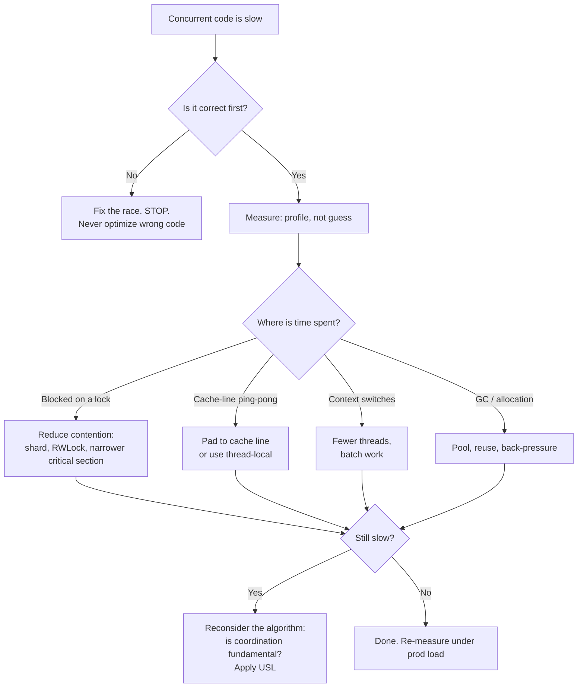

# Concurrency — Optimize & Reconcile

> Correctness and performance are not opposites, but they have an order. A racy program that is fast is worthless; it produces wrong answers quickly. So the discipline is fixed: **make it correct, measure it, then reduce coordination cost.** Every scenario below starts from a correct-but-slow (or fast-but-wrong) concurrent design, shows the measurement that reveals the problem, and resolves it with the cheapest synchronization that preserves correctness. Numbers are order-of-magnitude figures from commodity x86-64 hardware (Skylake-class, 64-byte cache lines, ~3 GHz); treat them as ratios to reproduce on your own box, not constants.

---

## Table of Contents

1. [Lock contention turns a parallel map into a serial one](#scenario-1--lock-contention-turns-a-parallel-map-into-a-serial-one)
2. [Read-write lock when reads dominate](#scenario-2--read-write-lock-when-reads-dominate)
3. [False sharing destroys per-thread counters](#scenario-3--false-sharing-destroys-per-thread-counters)
4. [Mutex vs atomic vs channel: choosing the cheapest primitive](#scenario-4--mutex-vs-atomic-vs-channel-choosing-the-cheapest-primitive)
5. [Thread-pool sizing: CPU-bound vs I/O-bound](#scenario-5--thread-pool-sizing-cpu-bound-vs-io-bound)
6. [More parallelism makes it slower (Universal Scalability Law)](#scenario-6--more-parallelism-makes-it-slower-universal-scalability-law)
7. [Batching to amortize synchronization](#scenario-7--batching-to-amortize-synchronization)
8. [Context-switch and goroutine/thread overhead](#scenario-8--context-switch-and-goroutinethread-overhead)
9. [The Python GIL: multiprocessing vs native extensions](#scenario-9--the-python-gil-multiprocessing-vs-native-extensions)
10. [Back-pressure prevents unbounded memory growth](#scenario-10--back-pressure-prevents-unbounded-memory-growth)
11. [Lock-free stack vs mutex stack: when CAS wins and when it loses](#scenario-11--lock-free-stack-vs-mutex-stack-when-cas-wins-and-when-it-loses)
12. [Per-CPU / thread-local sharding for hot counters](#scenario-12--per-cpu--thread-local-sharding-for-hot-counters)
13. [Lock held across I/O serializes everything](#scenario-13--lock-held-across-io-serializes-everything)
14. [Channel fan-out with the wrong buffer size](#scenario-14--channel-fan-out-with-the-wrong-buffer-size)

[Rules of Thumb](#rules-of-thumb) · [Related Topics](#related-topics)

---

## The decision flow



---

### Scenario 1 — Lock contention turns a parallel map into a serial one

You parallelized an aggregation across 16 worker threads. CPU utilization sits at ~110% (barely more than one core) instead of the ~1600% you expected. Throughput is *worse* than the single-threaded version.

```java
class WordCounter {
    private final Map<String, Integer> counts = new HashMap<>();
    private final Object lock = new Object();

    void count(String word) {
        synchronized (lock) {              // every thread serializes here
            counts.merge(word, 1, Integer::sum);
        }
    }
}
```

Sixteen threads each grab the same monitor for every word. The critical section *is* the entire work, so the threads run strictly one at a time — plus they pay lock acquisition, cache-line transfer of the monitor word, and OS park/unpark when contended. You have built a parallel program that runs slower than serial.

<details><summary>Resolution</summary>

**Measure first.** A profiler (async-profiler `lock` mode, JFR `jdk.JavaMonitorEnter` events) will show ~95% of wall time parked on the monitor. The smoking gun is high lock-wait time with low CPU.

**Principle: shrink or shard the critical section.** The cheapest fix is a sharded counter — `ConcurrentHashMap` already does lock striping internally:

```java
class WordCounter {
    private final ConcurrentHashMap<String, LongAdder> counts = new ConcurrentHashMap<>();

    void count(String word) {
        counts.computeIfAbsent(word, k -> new LongAdder()).increment();
    }
}
```

`ConcurrentHashMap` partitions the table so threads hitting different keys never contend. `LongAdder` further shards the per-key count across cells, so even hot keys (`"the"`) spread their writes. On a 16-core box this typically restores near-linear scaling: ~12–14× over serial instead of <1×.

**When sharding is not enough** (e.g., a single hot key), accept that the contention is fundamental to *that key* and reduce the work per increment, or pre-aggregate per thread and merge once at the end (see [Scenario 12](#scenario-12--per-cpu--thread-local-sharding-for-hot-counters)).

**Correctness note:** never reach for `HashMap` "without the lock because it's faster" — an unsynchronized `HashMap` under concurrent writes can corrupt its internal structure and spin forever during resize. Correctness is non-negotiable; the fix is a *correct* concurrent structure, not removing safety.

</details>

---

### Scenario 2 — Read-write lock when reads dominate

A configuration cache is read on every request (~200k reads/sec) and reloaded every 30 seconds. It is guarded by a plain mutex. Under load, request latency p99 spikes even though writes are rare.

```go
type ConfigCache struct {
    mu  sync.Mutex
    cfg *Config
}

func (c *ConfigCache) Get() *Config {
    c.mu.Lock()
    defer c.mu.Unlock()
    return c.cfg            // readers serialize against each other for no reason
}
```

A `sync.Mutex` is *exclusive*: two readers that only want to observe `cfg` still block each other. With 200k reads/sec across many goroutines, the mutex becomes a serialization point even though no reader mutates anything.

<details><summary>Resolution</summary>

**Reasoning, not just measurement:** reads are ~99.99% of operations and are pure observations. Exclusive locking pays for a write-conflict that almost never happens.

**Fix 1 — `sync.RWMutex`:** multiple readers proceed concurrently; only the rare reload takes the write lock.

```go
func (c *ConfigCache) Get() *Config {
    c.mu.RLock()
    defer c.mu.RUnlock()
    return c.cfg
}
```

But measure: a `RWMutex` is *not* free. Each `RLock`/`RUnlock` still does atomic bookkeeping on a shared reader-count word, so under extreme read rates the readers contend on *that* cache line. Benchmarks commonly show `RWMutex` beating `Mutex` only when the critical section is long (microseconds), and losing for tiny ones because of the heavier read path.

**Fix 2 — `atomic.Pointer` (copy-on-write):** for a "rarely replaced, read constantly" value, skip locks entirely.

```go
type ConfigCache struct {
    cfg atomic.Pointer[Config]
}
func (c *ConfigCache) Get() *Config   { return c.cfg.Load() }   // wait-free read
func (c *ConfigCache) Set(n *Config)  { c.cfg.Store(n) }        // atomic publish
```

A `Load()` is a single acquire-load — no contention, no parking. The reload allocates a fresh `*Config` and swaps the pointer. Readers see either the old or the new config, never a torn one. This is the immutable-snapshot pattern (see [`../14-immutability/README.md`](../14-immutability/README.md)) and is usually the right answer for hot config/state.

**Java equivalent:** `ReentrantReadWriteLock` or `StampedLock` (whose optimistic read mode avoids touching shared state on the happy path); for the copy-on-write variant, a `volatile Config` field updated by reference. `StampedLock.tryOptimisticRead()` can be 2–5× faster than `RWLock` for short reads because it does no write to shared memory unless a writer intervened.

**Python:** the GIL already serializes bytecode, so an immutable config swapped via a single attribute assignment (atomic at the bytecode level) needs no lock at all for readers.

</details>

---

### Scenario 3 — False sharing destroys per-thread counters

You gave each worker its own counter to *avoid* contention — yet 8 threads run barely faster than 1. There is no shared lock, no shared variable each thread writes. So why?

```go
type Counters struct {
    n [8]int64    // one slot per worker; 8 * 8 bytes = 64 bytes
}
// worker i does, in a tight loop:  c.n[i]++
```

All 8 `int64`s sit in the *same 64-byte cache line*. When core 0 writes `n[0]`, the MESI protocol invalidates that line in every other core's L1. Core 1 writing `n[1]` then takes a cache miss to re-fetch the line, writes, and invalidates everyone again. The line ping-pongs between cores on every increment though the threads touch *logically disjoint* data. This is **false sharing**.

<details><summary>Resolution</summary>

**Measure:** `perf c2c` (cache-to-cache) on Linux directly reports HITM (hit-modified) events on a hot cache line. Typical observed slowdown for this exact pattern: a packed array runs **3–10× slower** than padded slots, and adding cores makes it *worse*, not better.

**Fix — pad each counter to its own cache line:**

```go
type paddedCounter struct {
    n   int64
    _   [56]byte    // pad: 8 (int64) + 56 = 64 bytes, one full line
}
type Counters struct {
    c [8]paddedCounter
}
```

Now `c[0].n` and `c[1].n` live on different lines; cores never invalidate each other. The same loop scales near-linearly with cores.

**Java:** use `@Contended` (`jdk.internal.vm.annotation.Contended`, requires `-XX:-RestrictContended`), which the JVM honors by inserting padding. This is exactly how `LongAdder`'s `Cell[]` is laid out — each cell is `@Contended` so concurrent increments on different cells never false-share.

```java
@jdk.internal.vm.annotation.Contended
static final class Cell { volatile long value; }
```

**Python:** false sharing is a non-issue under the GIL for pure-Python objects (only one thread runs bytecode), but it *does* bite C extensions and `multiprocessing` shared-memory arrays — pad those the same way.

**Reconciliation:** padding trades memory for speed (56 wasted bytes per counter). For 8 counters that is trivial; for millions of objects it is not, so pad only the *hot, concurrently-written* fields you measured. Premature padding is just cache-unfriendly bloat.

</details>

---

### Scenario 4 — Mutex vs atomic vs channel: choosing the cheapest primitive

A request counter is incremented on every request. The team is debating: mutex, atomic, or a channel feeding a single owner goroutine? Each is *correct*. Which is cheapest, and when?

```go
// Option A: mutex
mu.Lock(); count++; mu.Unlock()
// Option B: atomic
atomic.AddInt64(&count, 1)
// Option C: channel to an owner goroutine
incCh <- 1
```

<details><summary>Resolution</summary>

**Order-of-magnitude costs (single op, x86-64, rough):**

| Primitive | Uncontended | Heavily contended |
|---|---|---|
| Atomic add/CAS | ~5–15 ns | ~50–500 ns (cache-line bounce) |
| Mutex lock+unlock | ~15–25 ns | ~1–10 µs (park/unpark, syscall) |
| Buffered channel send/recv | ~50–120 ns | ~hundreds of ns–µs |
| Plain non-atomic increment | ~0.3 ns | (incorrect — data race) |

**Principle:** pick the *least powerful* primitive that is correct for the operation.

- **Single integer, simple op:** `atomic` wins. One instruction, no parking, no allocation. For a request counter, this is the answer.
- **A small group of fields that must change together (an invariant spanning >1 word):** `mutex`. Atomics cannot guarantee atomicity across multiple variables; a mutex makes the whole critical section atomic. Don't try to fake it with several atomics — you'll create a race.
- **Channel:** the most expensive, but you're not paying for the increment — you're paying for *ownership transfer and orchestration*. Use channels when the value crosses goroutine boundaries, when you need back-pressure, or when "share memory by communicating" makes the design dramatically simpler. Using a channel just to increment a counter is ~10× the cost of an atomic for zero benefit.

**Contention is the multiplier that matters.** Uncontended, all three are "fast enough" for most code. The table's right column is where designs die: a mutex under heavy contention costs *microseconds* (parking is a futex syscall + scheduler), 100× its uncontended cost. So the real lever is usually "reduce contention" (Scenarios 1, 12), not "switch primitive."

**Java:** `AtomicLong` vs `synchronized` vs `LongAdder`. Under high contention `LongAdder` beats `AtomicLong` because a single atomic's cache line still bounces — `LongAdder` shards. `AtomicLong.incrementAndGet()` under 16 contending threads can be **5–20× slower** than `LongAdder`.

**Python:** under the GIL, `count += 1` on an `int` is *not* atomic (it's LOAD/ADD/STORE bytecodes with possible thread switches between them). Use `threading.Lock`, or `itertools.count()` / `queue.Queue` whose internals hold the GIL across the critical operation. For true parallelism you need processes (Scenario 9), where you'd use `multiprocessing.Value` with a lock or atomic shared memory.

</details>

---

### Scenario 5 — Thread-pool sizing: CPU-bound vs I/O-bound

A service uses a fixed pool of 4 threads (machine has 4 cores) for *everything*. The CPU-bound image-resize endpoint is fine, but the I/O-bound "call 3 upstream APIs" endpoint achieves terrible throughput — the 4 threads spend most of their time blocked on sockets, and requests queue up behind them.

<details><summary>Resolution</summary>

**The two workloads need opposite sizing.**

**CPU-bound:** threads ≈ number of cores. More threads than cores just adds context-switch overhead and cache thrashing without doing more work — all cores are already busy computing. A classic refinement is `cores + 1` to cover the occasional page fault, but the principle is: parallelism is capped by physical cores when work is pure computation.

**I/O-bound:** size by **Little's Law.** The number of in-flight requests `L = λ × W`, where `λ` is arrival rate and `W` is average time each request holds a thread (mostly blocked on I/O). Equivalently, the pool size that keeps the CPU busy:

```
threads ≈ cores × targetUtilization × (1 + waitTime / computeTime)
```

Example: 4 cores, target 90% utilization, each task computes 5 ms and waits 95 ms on I/O →
`4 × 0.9 × (1 + 95/5) = 4 × 0.9 × 20 ≈ 72 threads`.

So the I/O pool should be ~72, not 4. With 4 threads, three of four cores sit idle while requests wait on sockets.

**Resolution — separate pools (bulkhead):**

```java
ExecutorService cpuPool = Executors.newFixedThreadPool(Runtime.getRuntime().availableProcessors());
ExecutorService ioPool  = Executors.newFixedThreadPool(64);   // sized via Little's Law
```

Separate pools also isolate failures: a slow upstream that exhausts `ioPool` cannot starve CPU work. (See `high-availability` bulkhead patterns under [`../../README.md`](../../README.md).)

**The modern answer for I/O is to not block a thread at all.** Use async/non-blocking I/O so a few threads multiplex thousands of in-flight requests:

- **Go:** goroutines + the netpoller make this automatic — block a goroutine on I/O and the runtime parks it cheaply, scheduling others onto the OS thread. You don't size an I/O pool; you spawn a goroutine per request and let `GOMAXPROCS` (≈ cores) bound the CPU side.
- **Java 21+:** virtual threads (`Executors.newVirtualThreadPerTaskExecutor()`) — block freely, the JVM unmounts the carrier thread. The Little's-Law math disappears; you spawn one virtual thread per task.
- **Python:** `asyncio` with `await` for I/O on a single thread handles thousands of concurrent sockets; reserve `ProcessPoolExecutor` for CPU work (Scenario 9).

**Measure to confirm:** watch CPU utilization and the pool's queue depth. Idle CPUs + growing queue = pool too small for an I/O workload. Saturated CPUs + context-switch storm (`vmstat` `cs` column) = pool too large for a CPU workload.

</details>

---

### Scenario 6 — More parallelism makes it slower (Universal Scalability Law)

You added threads expecting linear speedup. From 1→4 threads it scaled well (~3.6×). From 8→16 it *regressed* — 16 threads were slower than 8. Adding hardware made the system worse.

<details><summary>Resolution</summary>

**This is the Universal Scalability Law (USL).** Speedup is not linear; it is capped and eventually *negative*:

```
            N
C(N) = ---------------------------
       1 + α(N−1) + βN(N−1)
```

- **α (contention):** the serial fraction — Amdahl's Law. Work that must be done one-at-a-time (a shared lock, a single DB row) caps speedup at `1/α` no matter how many cores.
- **β (coherency / crosstalk):** the cost of keeping nodes *consistent* — cache-line transfers, lock handoffs, distributed coordination. This term is *quadratic*: with N workers there are O(N²) pairwise coordination interactions. Past a point, adding workers adds more coordination than work, so throughput goes *down*.

The β term is why 16 threads lost to 8. The retrograde region is real and routinely observed in benchmarks of contended locks and chatty distributed systems.


**Principle:** find the peak, don't run past it.

1. **Measure** throughput at 1, 2, 4, 8, 16, 32 workers and fit α and β (tools: USL spreadsheets, `usl` R package). The fit predicts the optimal concurrency and where you go retrograde.
2. **Reduce α:** shrink critical sections, shard data, replace locks with per-thread state + final merge.
3. **Reduce β (the dangerous one):** eliminate crosstalk — fewer shared writable cache lines (Scenario 3), coarser batching (Scenario 7), partition so workers don't coordinate at all (share-nothing). Going from a shared accumulator to per-worker accumulators changes β dramatically because workers stop talking to each other.
4. **Cap the pool at the measured peak.** If the model says peak throughput is at 12 workers, configure 12 — running 64 burns hardware to go *slower*.

**Cross-language reality:** the law is hardware/coordination-level, so it applies identically to Go goroutines, Java threads, and Python processes. The cure is always the same: less coordination, not more cores.

</details>

---

### Scenario 7 — Batching to amortize synchronization

A pipeline pushes one item at a time onto a shared, locked queue: 1,000,000 items/sec, each `enqueue` taking a lock. The lock is the bottleneck even though the per-item work is trivial.

```java
for (Item item : items) {
    queue.put(item);     // one lock acquisition per item
}
```

<details><summary>Resolution</summary>

**The fixed cost per synchronization dwarfs the per-item work.** If a lock acquire+release is ~20 ns uncontended (much more contended) and the per-item work is ~5 ns, you spend 4× more on coordination than on the actual job.

**Fix — batch:** acquire the lock once per *batch*, not per item.

```java
List<Item> batch = new ArrayList<>(1024);
for (Item item : items) {
    batch.add(item);
    if (batch.size() == 1024) {
        queue.putAll(batch);   // one lock acquisition per 1024 items
        batch.clear();
    }
}
if (!batch.isEmpty()) queue.putAll(batch);
```

Synchronization cost is now amortized: ~20 ns / 1024 ≈ **0.02 ns per item**, a 1000× reduction in coordination overhead. The same idea applies broadly:

- **DB writes:** batch INSERTs / a single transaction instead of one round-trip per row (network + fsync cost amortized).
- **Channels (Go):** send `[]Item` slices, not single items, when the per-send cost matters.
- **Atomics:** accumulate locally, then do one `atomic.Add(&total, localSum)` at the end of a chunk instead of per element.

```go
var local int64
for _, x := range chunk { local += work(x) }
atomic.AddInt64(&total, local)   // one atomic per chunk, not per element
```

**Reconciliation — batching trades latency for throughput.** A larger batch means the first item waits longer before it's processed (it sits in the buffer until the batch fills or a timer fires). For throughput-oriented pipelines, batch large. For latency-sensitive paths, cap batch size and add a flush *timer* (e.g., flush at 1024 items *or* every 5 ms, whichever first) so a partial batch never starves. Measure both p50 throughput and p99 latency — batching that helps one can wreck the other.

**Python:** batching also reduces GIL acquire/release churn and the number of C-level calls; `cursor.executemany(rows)` versus a loop of `execute` is the canonical win (often 10–50× for bulk inserts).

</details>

---

### Scenario 8 — Context-switch and goroutine/thread overhead

A naive design spawns one OS thread per task and ends up creating 50,000 threads. The box thrashes: memory explodes, the scheduler spends most of its time switching, and throughput collapses.

<details><summary>Resolution</summary>

**Know the costs.**

| Unit | Creation cost | Stack / memory | Context switch |
|---|---|---|---|
| OS thread | ~10–100 µs | ~1 MB default stack (virtual) | ~1–10 µs (kernel, TLB/cache effects) |
| Go goroutine | ~hundreds of ns | ~2–8 KB initial, grows | ~tens–hundreds of ns (user-space) |
| Java 21 virtual thread | ~hundreds of ns | small heap-allocated stack | cheap (JVM unmount) |
| Python thread | ~tens of µs | ~MB-ish stack | OS switch + GIL handoff |

50,000 OS threads ≈ ~50 GB of virtual stack reservations and a scheduler run-queue the kernel was never tuned for. Even idle, the *switching* alone — each switch flushing TLB entries and polluting cache — can consume the machine.

**Principle: decouple "number of tasks" from "number of OS threads."**

- **Go:** spawn a goroutine per task freely (50k goroutines ≈ ~100–400 MB, totally fine) but bound the OS-thread parallelism with `GOMAXPROCS` (≈ cores). The runtime multiplexes M goroutines onto N OS threads (M:N scheduler), so context switches are mostly cheap user-space swaps, not kernel transitions.

```go
sem := make(chan struct{}, runtime.GOMAXPROCS(0)*2) // bound concurrency for CPU work
for _, task := range tasks {
    sem <- struct{}{}
    go func(t Task) { defer func() { <-sem }(); process(t) }(task)
}
```

- **Java:** never `new Thread()` per task at scale. Use a bounded pool (CPU work) or virtual threads (I/O work, Java 21+) — virtual threads make "one thread per task" viable for *millions* of tasks because they unmount the carrier OS thread when blocked.
- **Python:** a `ThreadPoolExecutor` with a bounded `max_workers` for I/O; never 50k `threading.Thread` objects. For CPU work, processes (Scenario 9).

**Measure:** `vmstat 1` — a high `cs` (context switches) column with low useful throughput is the signature. Linux `pidstat -w` attributes switches per task. The fix is fewer *OS* threads, achieved by a scheduler (pool / M:N runtime) between your tasks and the kernel.

</details>

---

### Scenario 9 — The Python GIL: multiprocessing vs native extensions

A CPU-bound Python function (numeric crunching) is parallelized with `threading` across 8 threads on an 8-core box. It runs *no faster* than single-threaded — sometimes slightly slower.

```python
from threading import Thread
threads = [Thread(target=crunch, args=(chunk,)) for chunk in chunks]
for t in threads: t.start()
for t in threads: t.join()   # 8 threads, ~1 core of throughput
```

<details><summary>Resolution</summary>

**The Global Interpreter Lock** (CPython ≤ 3.12 by default) allows only one thread to execute Python bytecode at a time. For CPU-bound pure-Python work, threads cannot run in parallel — they take turns holding the GIL, and you even pay extra for GIL handoff contention. Threads help only when threads *release* the GIL: blocking I/O and certain C calls.

**Resolutions, in order of preference for the workload:**

**1. `multiprocessing` / `ProcessPoolExecutor` — true parallelism via separate interpreters.**

```python
from concurrent.futures import ProcessPoolExecutor
with ProcessPoolExecutor(max_workers=8) as ex:
    results = list(ex.map(crunch, chunks))
```

Each process has its own GIL, so 8 processes use 8 cores. **Cost:** process startup (~tens of ms), and data crosses the process boundary via pickling — so for big arrays the serialization can dominate. Mitigate with `multiprocessing.shared_memory` or chunk sizing so compute >> transfer. Net speedup for genuinely CPU-bound chunks is typically ~6–7.5× on 8 cores once IPC is amortized.

**2. Native extensions that release the GIL.** NumPy, Pandas, SciPy, and C/Cython/Rust extensions release the GIL around heavy C loops. A NumPy vectorized op already runs in optimized C off the GIL; `numba`/`Cython` with `nogil` blocks let *threads* run in parallel:

```python
# Cython:  with nogil:  for i in range(n): ...
```

This avoids IPC entirely and is the fastest path when your hot loop can be expressed in C-level code.

**3. Free-threaded Python (3.13+ experimental `--disable-gil` build).** Removes the GIL so threads run truly parallel, at some single-thread overhead cost. Promising but not yet the default; verify on your build.

**Principle/measurement:** first confirm the work is *CPU-bound* (profile: high CPU, no I/O wait). If it is, `threading` is the wrong tool — its only effect under the GIL is overhead. Reach for processes or native code. If the work is *I/O-bound*, the GIL is released during I/O, so `threading` or `asyncio` is correct and processes would be wasteful overkill.

</details>

---

### Scenario 10 — Back-pressure prevents unbounded memory growth

A producer reads a file (or Kafka topic) far faster than the consumer can process. With an unbounded queue between them, memory climbs until OOM. With no queue, you lose data or block badly. The "fix" of making the queue bigger just delays the crash.

```go
ch := make(chan Item)          // ... or worse, an unbounded slice the producer appends to
go func() {
    for item := range source { ch <- item }   // producer races ahead
}()
for item := range ch { slowProcess(item) }     // consumer can't keep up
```

<details><summary>Resolution</summary>

**The real problem is the absence of back-pressure** — a feedback signal that tells a fast producer to slow down when the consumer is behind. An unbounded buffer removes that signal and converts a *rate mismatch* into a *memory leak*: queue depth grows without bound at `(producerRate − consumerRate)` items/sec until the process dies.

**Fix — a bounded buffer makes the channel itself the back-pressure mechanism:**

```go
ch := make(chan Item, 1024)    // bounded
go func() {
    for item := range source {
        ch <- item             // BLOCKS when full → producer is throttled to consumer's pace
    }
    close(ch)
}()
for item := range ch { slowProcess(item) }
```

A full bounded channel blocks the sender, so the producer naturally runs no faster than the consumer drains. Steady-state memory is bounded by the buffer size, not by the rate gap. The buffer absorbs short bursts; it does not paper over a sustained rate mismatch (if the consumer is *permanently* slower, you must scale consumers or shed load).

**Sizing the buffer:** by Little's Law again, buffer ≈ burst size you must absorb without blocking. Too small → producer blocks on every item, losing pipelining benefit; too large → bigger memory footprint and more latency for in-flight items. A few hundred to a few thousand is a common sweet spot; measure queue-full frequency.

**Java:** use a bounded `ArrayBlockingQueue(capacity)` or a `Semaphore` to cap in-flight work; for streams, Reactive Streams (`Flow.Subscription.request(n)`) is back-pressure as a protocol — the consumer *pulls* exactly what it can handle. Project Reactor / RxJava implement this natively.

**Python:** `asyncio.Queue(maxsize=...)` blocks `await queue.put()` when full; `multiprocessing.Queue` with a bound likewise. Never use an unbounded `list` shared across producer/consumer.

**Beyond a single process:** the same principle scales out — TCP flow control, gRPC/HTTP-2 windows, and Kafka consumer lag with bounded fetch are all back-pressure. When you can't slow the producer (it's the outside world), you must *shed load* (drop/reject with 429) rather than buffer to death.

</details>

---

### Scenario 11 — Lock-free stack vs mutex stack: when CAS wins and when it loses

A team replaced a mutex-guarded stack with a lock-free CAS-based one "because lock-free is faster," and benchmarks under their real workload showed it was *slower* and burned CPU spinning.

```go
// Lock-free push (Treiber stack)
for {
    old := head.Load()
    node.next = old
    if head.CompareAndSwap(old, node) { break }   // retries on contention
}
```

<details><summary>Resolution</summary>

**Lock-free is not automatically fast.** A CAS loop retries whenever another thread won the race; under heavy contention, threads waste cycles spinning and re-reading a constantly-changing `head`, and that shared cache line ping-pongs between cores (the same coherency cost as Scenario 3). Lock-free guarantees *system-wide progress* (no thread is blocked forever by a sleeping lock-holder), **not** lower latency.

**Where each wins:**

- **Low/moderate contention or short critical section:** lock-free / atomics win — no parking, no syscalls, ~5–15 ns.
- **High contention on a single point (one stack head):** the CAS loop's retry storm can be *worse* than a mutex, because a good mutex *parks* losers (they sleep instead of burning a core spinning) and hands off fairly. Measured: a contended Treiber stack can lose to a mutex stack once you have many writers all hitting the same head.
- **Long critical section:** always a mutex — you cannot do meaningful work inside a single CAS.

**Resolution principles:**

1. **Don't go lock-free by reputation; measure under your real contention.** Profile spin/retry counts. High retry rate = CAS is the wrong tool for that contention level.
2. **Prefer eliminating the contention to making it lock-free.** A single shared stack head is the problem; sharding it (per-thread stacks, work-stealing deques) removes the contention so *any* primitive is fine. This is why production work-stealing schedulers (Go runtime, Java `ForkJoinPool`, Tokio) use per-worker deques with only occasional stealing, not one global lock-free stack.
3. **Lock-free correctness is genuinely hard** — ABA problem, memory reclamation (when can you free a popped node another thread still holds?), and memory-ordering bugs. The maintenance cost is high. Use a battle-tested library structure (`java.util.concurrent.ConcurrentLinkedQueue`, Go `sync` types) rather than hand-rolling, and only when measurement justifies it.

**Java note:** `ConcurrentLinkedQueue` (lock-free) vs `ArrayBlockingQueue` (lock-based) — the lock-free queue shines for many producers/consumers with short ops, but the array-backed one can win on cache locality and gives you back-pressure (bounded) for free. Choose by measured workload, not folklore.

</details>

---

### Scenario 12 — Per-CPU / thread-local sharding for hot counters

A metrics counter (`requestsTotal`) is incremented on every request across all cores. Even as a single atomic, at millions of increments/sec it's a bottleneck: every core fights for that one cache line.

```go
var requestsTotal int64
// hot path on every core:
atomic.AddInt64(&requestsTotal, 1)
```

<details><summary>Resolution</summary>

**A single atomic is correct but its cache line is a global contention point.** Every `AddInt64` requires exclusive ownership of that line; with N cores incrementing, the line bounces N-ways and each increment costs a coherency miss (~50–200 ns instead of ~5 ns uncontended). Throughput is capped by the memory subsystem, not the ALU.

**Fix — shard the counter per thread/CPU; sum lazily on read.** Writes hit a thread-local cell (no sharing); the rare read aggregates.

**Java — exactly what `LongAdder` is for:**

```java
LongAdder requestsTotal = new LongAdder();
requestsTotal.increment();        // hits a striped, @Contended cell → no cross-core contention
long total = requestsTotal.sum(); // aggregates cells; reads are rarer than writes
```

`LongAdder` under high write contention is commonly **5–20× faster** than `AtomicLong` because increments spread across cells on distinct cache lines. The trade-off: `sum()` is not a perfectly-atomic instantaneous snapshot (it reads cells sequentially) and uses more memory — fine for metrics, wrong if you need an exact "current value" that two threads must agree on atomically.

**Go — shard by P (logical CPU) or use per-goroutine locals merged at read:**

```go
type shardedCounter struct {
    shards [256]paddedCounter   // padded to avoid false sharing (Scenario 3)
}
func (c *shardedCounter) inc(shardIdx int) { c.shards[shardIdx&255].n++ }  // owner-only write
func (c *shardedCounter) sum() (t int64)   { for i := range c.shards { t += atomic.LoadInt64(&c.shards[i].n) }; return }
```

(Go has no public per-P API; common approaches shard by goroutine ID hash or use libraries.) The principle: **convert a contended shared write into an uncontended local write plus a cheap occasional merge.**

**Python:** under the GIL there's no cross-core cache-line war for pure-Python ints, but for `multiprocessing` use per-process counters merged at the end — the same share-nothing-then-merge pattern.

**Reconciliation:** sharding trades read accuracy/cost and memory for write throughput. It's ideal for write-heavy, read-rarely metrics. Don't shard a value that's read as often as written, or that needs a strongly-consistent point-in-time value — there a single atomic or lock is simpler and correct.

</details>

---

### Scenario 13 — Lock held across I/O serializes everything

A cache-fill function holds the lock while it calls the database. Under load, every thread that wants the cache queues behind the one thread doing a slow network round-trip.

```java
synchronized (lock) {
    Value v = cache.get(key);
    if (v == null) {
        v = db.load(key);        // 20 ms network call — INSIDE the lock!
        cache.put(key, v);
    }
    return v;
}
```

<details><summary>Resolution</summary>

**Never hold a lock across blocking I/O.** The critical section's duration sets the serialization floor: if `db.load` takes 20 ms and the lock is held the whole time, the system processes at most 1 cache operation per 20 ms = 50 ops/sec *globally*, regardless of cores. The lock is held ~20 ms but the actual shared-state mutation (`cache.put`) takes ~50 ns — you're holding the lock 400,000× longer than necessary.

**Fix — do I/O outside the lock; lock only the in-memory state mutation:**

```java
Value v = cache.get(key);          // fast read (use a concurrent map)
if (v != null) return v;
Value loaded = db.load(key);       // slow I/O — NO lock held
return cache.computeIfAbsent(key, k -> loaded);  // brief, in-memory only
```

With a `ConcurrentHashMap`, reads and most writes don't block each other at all. The critical section shrinks from 20 ms to ~50 ns, so throughput is bounded by the database and core count, not by a global lock.

**Caveat — the thundering herd / cache-stampede trade-off:** if 100 threads miss the same cold key simultaneously, the lock-free version may issue 100 identical DB loads (wasteful but correct). If those loads are expensive, add *per-key* single-flight (Go's `singleflight.Group`, Java a `ConcurrentHashMap<Key, Future<Value>>`) so only one load happens per key while others await its result — **without** holding a global lock across I/O. This serializes *only* the duplicate loads of *one key*, not the whole cache.

```go
v, _, _ := group.Do(key, func() (any, error) { return db.Load(key) }) // one in-flight load per key
```

**Principle hierarchy:** (1) correctness — the cache must not return torn/partial values; (2) hold locks only over in-memory state, never over I/O; (3) if duplicate I/O is costly, dedup per-key, not globally. This same anti-pattern appears as "lock held across RPC/disk" and is one of the most common causes of mysterious throughput cliffs.

</details>

---

### Scenario 14 — Channel fan-out with the wrong buffer size

A fan-out worker pool uses an *unbuffered* channel to distribute work. CPU sits idle and throughput is low, because every producer send must rendezvous with a ready worker — producers block waiting for handoff and workers block waiting for the next item, so the pipeline is full of stalls.

```go
jobs := make(chan Job)            // unbuffered: every send waits for a receiver
for i := 0; i < workers; i++ { go worker(jobs) }
for _, j := range allJobs { jobs <- j }   // producer blocks on each send
```

<details><summary>Resolution</summary>

**Unbuffered channels are a synchronization point, not a queue.** Each `jobs <- j` blocks until a worker is *at* `<-jobs`. If a worker is mid-job, the producer stalls even though there's CPU available to compute the *next* job's preconditions. The handoff cost (~50–120 ns per item) plus the stall is paid on every single item.

**Fix — a small buffer decouples producer and consumer timing:**

```go
jobs := make(chan Job, workers*2)   // buffer absorbs timing jitter
```

The buffer lets the producer stay ~a few items ahead so workers always find work waiting, smoothing the pipeline. This typically lifts utilization from "spiky/idle" to near-saturated for CPU-bound workers.

**But buffer size is a real trade-off, not "bigger is better":**

| Buffer | Behavior |
|---|---|
| 0 (unbuffered) | Strict handoff; max back-pressure; stalls under timing jitter |
| Small (≈ workers) | Smooths jitter; bounded memory; **usually right** |
| Large / unbounded | Hides back-pressure → memory blowup under sustained overload (Scenario 10); higher latency per in-flight item |

**Principle:** size the buffer to *absorb timing jitter*, not to *store the whole workload*. A buffer of `workers` to `2×workers` is the common sweet spot. Going larger reintroduces the back-pressure problem from Scenario 10 — you can no longer tell the producer to slow down.

**Closing matters too:** the producer should `close(jobs)` when done so the `for j := range jobs` loops in workers terminate cleanly. Forgetting to close leaks goroutines (Scenario 8's overhead, accumulated forever).

**Java equivalent:** `ArrayBlockingQueue(workers*2)` feeding a thread pool — same sizing logic. A `SynchronousQueue` (capacity 0) is the unbuffered analog: it forces direct handoff and is the default for `Executors.newCachedThreadPool()`, which is exactly why that pool can spawn unbounded threads under load. **Measure** worker idle time (low utilization = buffer too small) versus queue depth (steadily growing = buffer too large / consumers too slow).

</details>

---

## Rules of Thumb

1. **Correct first, fast second — always.** A data race that produces wrong results occasionally is worse than a slow program. Never remove synchronization to gain speed; reduce *contention* instead.
2. **Measure, don't guess.** Use a lock profiler (async-profiler/JFR for Java, `go test -bench` + `pprof` + `-race`, Python `cProfile`/`py-spy`). Idle CPU + high lock-wait = contention; high `cs` in `vmstat` = too many threads; `perf c2c` HITM = false sharing.
3. **Pick the least-powerful primitive that's correct:** atomic (single word) < mutex (multi-field invariant) < channel/queue (ownership transfer + back-pressure). Uncontended they're all "fast enough"; contention is the 10–100× multiplier.
4. **Reduce contention before changing primitives.** Shard (`LongAdder`, striped maps, per-thread/per-CPU state) so threads stop touching the same cache line. A sharded mutex beats a contended atomic.
5. **Pad concurrently-written hot fields to a cache line** (`@Contended`, manual padding) to kill false sharing — but only the fields you measured, since padding wastes memory.
6. **Hold locks only over in-memory state, never across I/O.** The critical section duration is your global serialization floor.
7. **Size pools by workload:** CPU-bound ≈ #cores; I/O-bound by Little's Law (`cores × util × (1 + wait/compute)`), or stop blocking threads entirely (goroutines, virtual threads, asyncio).
8. **Respect the Universal Scalability Law:** more parallelism eventually goes *retrograde* due to O(N²) coherency cost. Find the measured peak and cap there.
9. **Batch to amortize per-op synchronization cost** — but cap batch size + add a flush timer so latency doesn't suffer.
10. **Bound every buffer.** Unbounded queues convert a rate mismatch into an OOM. A bounded channel/queue *is* your back-pressure.
11. **Lock-free ≠ fast.** CAS loops can lose to parking mutexes under high single-point contention. Prefer removing contention (sharding) to going lock-free, and use library structures over hand-rolled ones.
12. **Python: the GIL means `threading` only helps I/O.** For CPU parallelism use `multiprocessing`, native extensions that release the GIL (NumPy/Cython `nogil`), or a free-threaded build.

---

## Related Topics

- [`README.md`](README.md) — the positive concurrency rules this file optimizes against.
- [`find-bug.md`](find-bug.md) — race conditions and deadlocks to spot before you optimize (correctness gate).
- [`professional.md`](professional.md) — production-grade concurrency review standards.
- [`../14-immutability/README.md`](../14-immutability/README.md) — immutable snapshots eliminate read-side locking (Scenario 2's copy-on-write).
- [`../README.md`](../README.md) — Clean Code chapter index.
- [`../../refactoring/README.md`](../../refactoring/README.md) — refactoring toward seams that make contention easy to isolate and shard.
