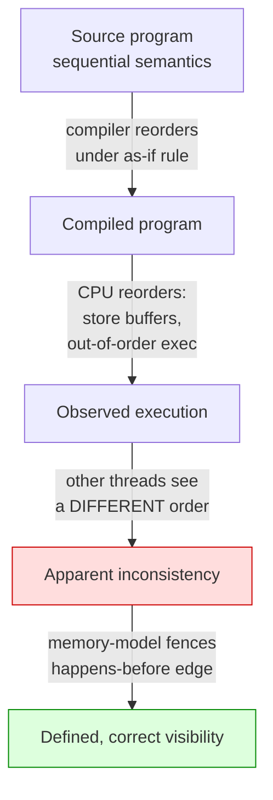
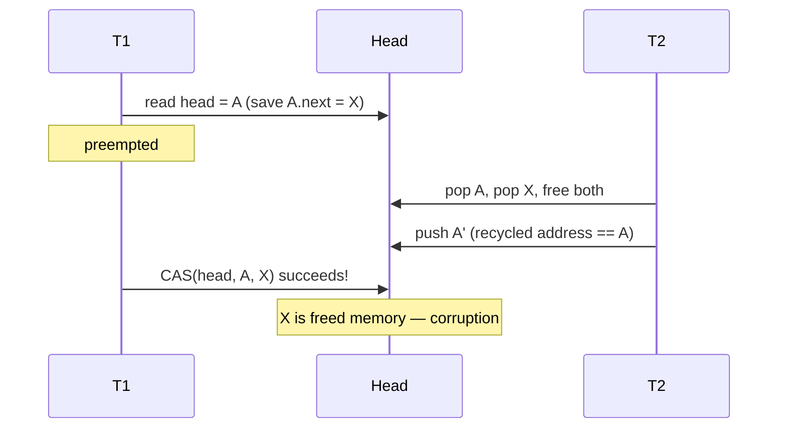

# Concurrency — Professional Level

> Focus: the deep end. Memory models as the contract that makes lock-free code legal; concurrency paradigms and their failure modes; lock-free/wait-free algorithms and their hazards; the physics of contention and false sharing; structured concurrency as control-flow theory; and how to *prove* and *test* concurrent code (linearizability, TLA+, deterministic simulation).

---

## Table of Contents

1. [Why "thread-safe" is meaningless without a memory model](#why-thread-safe-is-meaningless-without-a-memory-model)
2. [Memory models in depth](#memory-models-in-depth)
3. [Double-checked locking: broken, then fixed](#double-checked-locking-broken-then-fixed)
4. [Concurrency paradigms and their failure modes](#concurrency-paradigms-and-their-failure-modes)
5. [Lock-free and wait-free algorithms](#lock-free-and-wait-free-algorithms)
6. [The ABA problem and safe memory reclamation](#the-aba-problem-and-safe-memory-reclamation)
7. [False sharing and cache-line physics](#false-sharing-and-cache-line-physics)
8. [The cost of contention: Amdahl and the USL](#the-cost-of-contention-amdahl-and-the-usl)
9. [Structured concurrency as control flow](#structured-concurrency-as-control-flow)
10. [Reasoning formally: linearizability and TLA+](#reasoning-formally-linearizability-and-tla)
11. [Deterministic testing (DST)](#deterministic-testing-dst)
12. [Common Mistakes](#common-mistakes)
13. [Test Yourself](#test-yourself)
14. [Cheat Sheet](#cheat-sheet)
15. [Summary](#summary)
16. [Further Reading](#further-reading)
17. [Related Topics](#related-topics)

---

## Why "thread-safe" is meaningless without a memory model

At the junior level, concurrency bugs are framed as "two threads touched the same variable." That framing is wrong at this level. The hardware does not execute your program. It executes a *reordered, cached, speculatively-issued* approximation of your program that is observably equivalent **only to a single thread**. The compiler does the same: it hoists loads, sinks stores, and fuses operations under the as-if rule, which guarantees single-threaded semantics and nothing more.

A **memory model** is the formal contract that says which writes by one thread are *guaranteed* visible to a read by another, and in what order. Without invoking that contract — via a lock, an atomic with the right ordering, a `volatile`, or a channel — your program is in **undefined behavior** (C/C++) or merely "unspecified but bounded" (Java). "It worked on my machine" means the model permitted a schedule you didn't observe; it does not mean the code is correct.



The model is not academic. The single most cited example — **double-checked locking** — was *correct-looking C++ idiom, correct-looking Java idiom, and provably broken under both pre-2004 memory models simultaneously*. We return to it below.

---

## Memory models in depth

### Sequential consistency (the ideal nobody gives you)

Lamport (1979) defined **sequential consistency (SC)**: the result of any execution is as if all operations were executed in *some* total order, and each processor's operations appear in that order in program order. SC is the model programmers intuitively assume. No mainstream hardware provides it for free — x86 is *almost* SC (it only reorders store-before-load via the store buffer, i.e. **TSO**, Total Store Order); ARM and POWER are dramatically weaker, permitting load-load and store-store reordering.

The cost of SC is fences on every relevant access. Languages therefore expose **weaker, opt-in** orderings and reserve SC for when you ask.

### Acquire / release: the workhorse

The release/acquire pair is the minimum that makes a publish-then-consume pattern correct:

- A **release** store: no memory operation *before* it (in program order) may be reordered *after* it.
- An **acquire** load: no memory operation *after* it may be reordered *before* it.
- If an acquire load reads the value written by a release store, everything the writer did before the release is visible to the reader after the acquire. This is the **synchronizes-with** edge.

This is strictly cheaper than SC: it is a one-way barrier, not a full fence, and on ARM compiles to `stlr`/`ldar` rather than a `dmb ish`.

### The Java Memory Model (JMM)

JSR-133 (Manson, Pugh, Adve; 2004) rebuilt Java's broken original model around **happens-before**, a partial order built from:

- Program order within a thread.
- A `volatile` write happens-before every subsequent `volatile` read of the same field — and, crucially, `volatile` accesses are *sequentially consistent* with one another in the JMM, stronger than C++'s bare `acquire`/`release`.
- An `unlock` happens-before every subsequent `lock` of the same monitor.
- `Thread.start()` happens-before the started thread's first action; a thread's last action happens-before another thread's return from `Thread.join()` on it.
- `final` fields: if an object is *properly constructed* (the `this` reference does not escape the constructor), any thread sees the correctly initialized `final` fields without synchronization. This is the foundation of safe publication for immutable objects.

A **data race** in the JMM is two accesses to the same non-`volatile` location, at least one a write, not ordered by happens-before. The JMM does *not* make racy programs UB — it preserves type safety and an out-of-thin-air guarantee — but the observable values become essentially unusable. (The "out-of-thin-air" problem is formally unsolved; the JMM forbids it by fiat, which is why a fully satisfactory axiomatic model for Java/C++ remains open research — see Batty et al., *"The Problem of Programming Language Concurrency Semantics"*.)

### The Go memory model

Go's model (revised 2022 to align with C/C++ release/acquire) shares the happens-before spine but is **channel-centric**:

- A send on a channel happens-before the corresponding receive completes.
- The *close* of a channel happens-before a receive that returns zero because the channel is closed.
- A receive from an *unbuffered* channel happens-before the send on that channel *completes* — a stronger guarantee than buffered channels give.
- `sync.Mutex`/`RWMutex`: the *n*-th `Unlock` happens-before the *(n+1)*-th `Lock`.
- `sync/atomic` operations behave as sequentially consistent atomics.

The Go model explicitly states that a program with a data race has *undefined behavior* with respect to the racing accesses, and `go test -race` (ThreadSanitizer) is the supported detector.

### C++ atomics and the `memory_order` menu

C++11 gave the first *standardized* memory model for a systems language. `std::atomic` operations take a `memory_order`:

| Order | Guarantee | Typical use |
|---|---|---|
| `relaxed` | atomicity only, no ordering | counters, statistics |
| `consume` | data-dependent ordering (effectively deprecated; promoted to `acquire`) | RCU pointer chasing |
| `acquire` / `release` | one-way barrier pair | lock-free publish / consume |
| `acq_rel` | both, for read-modify-write | CAS in a stack / queue |
| `seq_cst` | global total order across all `seq_cst` ops | default; when in doubt |

`seq_cst` is the default precisely because it is the only ordering most programmers can reason about. Reaching for `relaxed` to "go faster" without a proof is the classic expert-beginner mistake.

### A note on Rust's `Send`/`Sync`

Rust encodes the memory-safety half of concurrency in the *type system*, not in runtime discipline. `Send` means a value may be moved to another thread; `Sync` means `&T` may be shared across threads (equivalently, `&T: Send`). The compiler refuses to compile a program that shares a non-`Sync` type across a thread boundary — data races on memory are a *compile error*. This does not prevent deadlocks or logical race conditions (those are not memory-unsafe), but it eliminates the entire "I forgot the lock" class of UB statically. It is the cleanest demonstration that the memory model can be lifted into types: the same release/acquire atomics exist (`std::sync::atomic::Ordering`), but you cannot *accidentally* share mutable state.

---

## Double-checked locking: broken, then fixed

The canonical anti-pattern, and the best teaching example of why the model matters.

```java
// BROKEN under the pre-JSR-133 JMM (and a naive reading of C++).
class Holder {
    private static Resource instance;          // plain field
    static Resource get() {
        if (instance == null) {                 // 1st check, unlocked
            synchronized (Holder.class) {
                if (instance == null) {          // 2nd check, locked
                    instance = new Resource();   // (a) allocate (b) init (c) publish ref
                }
            }
        }
        return instance;
    }
}
```

The bug: `instance = new Resource()` is not atomic. The compiler/CPU may publish the reference (c) *before* the constructor finishes (b) — no single-threaded observer can tell. A second thread takes the fast path, sees a non-null `instance`, and returns a **partially constructed** object. No lock was violated; the *ordering* was. This was legal under the original JMM and under a naive reading of pre-2011 C++: the program had a data race, so all bets were off.

**The fix adds a synchronizes-with edge on the racy read:**

```java
class Holder {
    private static volatile Resource instance;   // volatile is the fix
    static Resource get() {
        Resource r = instance;                    // single volatile read
        if (r == null) {
            synchronized (Holder.class) {
                r = instance;
                if (r == null) instance = r = new Resource();
            }
        }
        return r;
    }
}
```

`volatile` (JMM 5+) makes the write to `instance` happen-before any subsequent read, so the constructor's stores are visible. In C++11 the fix is `std::atomic<Resource*>` with `release` on publish and `acquire` on the fast-path load.

**The better fix in all three languages is to not hand-write DCL at all:**

- **Java** — the *initialization-on-demand holder idiom*. A nested static class gets correctness and laziness from the JVM's class-initialization lock for free:
  ```java
  class Holder {
      private static class H { static final Resource INSTANCE = new Resource(); }
      static Resource get() { return H.INSTANCE; }   // lazy, thread-safe, no volatile
  }
  ```
- **Go** — `sync.Once`: `once.Do(func() { instance = newResource() })` encodes the barriers correctly and is idiomatic.
- **C++** — a function-local `static` is guaranteed thread-safe-initialized since C++11 ("magic statics"): `static Resource& get() { static Resource r; return r; }`.

The lesson: DCL is the smell. The cure is almost always a language primitive that already encodes the fence, not hand-rolled `volatile`.

---

## Concurrency paradigms and their failure modes

There is no paradigm without failure modes; there is only choosing which failures you can detect and recover from.

| Paradigm | Core idea | Signature failure mode | Detection / mitigation |
|---|---|---|---|
| **Shared state + locks** | mutual exclusion over memory | deadlock, lock convoy, priority inversion, missed unlock, lock-ordering bugs | lock hierarchies; `tryLock` + timeout; deadlock detectors; ThreadSanitizer |
| **CSP / channels** (Go, occam) | share by communicating | goroutine leak (blocked send/recv with no peer); deadlock on unbuffered channels | `context.Context` cancellation; `select` + `default`; the race detector finds shared-memory leaks, not channel deadlocks |
| **Actors** (Erlang, Akka) | isolated state, async mailboxes, supervision | unbounded mailbox growth; message-ordering assumptions; "let it crash" hides logic bugs | bounded mailboxes / backpressure; supervision trees; idempotent handlers |
| **STM** (Haskell, Clojure) | transactions over shared refs, auto-retry on conflict | livelock under high contention; cannot wrap irreversible I/O; retry storms | small pure transactions; `orElse`/`retry`; no I/O inside `atomically` |
| **async/await** (futures) | cooperative scheduling on an event loop | blocking the loop; *colored functions*; forgotten `await` swallowing errors; unbounded fan-out | never block the loop; lint un-awaited promises; structured nurseries |

**CSP** is Hoare's 1978 calculus; Go's channels are its mainstream incarnation. Its clean-code virtue is that *ownership transfers with the message* — "Do not communicate by sharing memory; instead, share memory by communicating" (Go proverb, Pike). But an unbuffered channel with no receiver is a silent leak, and the Go runtime's "all goroutines are asleep — deadlock!" panic only fires when *every* goroutine is blocked, not when one leaks.

**The actor model** (Hewitt 1973; Armstrong's Erlang) trades shared-memory races for *protocol* races: state is never shared, so there is no data race, but message-ordering bugs and mailbox overflow remain. Erlang's answer — supervision trees and "let it crash" — is a *fault-tolerance* strategy, not a correctness proof.

**async/await** is the most deceptive because it *looks* sequential. Its unique failure mode is **blocking the event loop**: one synchronous `sleep`, a blocking DB driver, or a CPU-bound loop inside a coroutine stalls every other task on that loop. Its second is the **function-color** problem (Nystrom, *"What Color Is Your Function?"*): `async` infects every caller, and the sync/async boundary becomes a refactoring tax.

---

## Lock-free and wait-free algorithms

Definitions (Herlihy & Shavit, *The Art of Multiprocessor Programming*):

- **Obstruction-free:** a thread completes in finite steps *if it runs in isolation*. Weakest.
- **Lock-free:** *system-wide* progress — some thread always completes in finite steps. Individual threads may starve.
- **Wait-free:** *every* thread completes in a bounded number of steps regardless of contention. Strongest, rarest, often slower in the common case.

The primitive underneath nearly all of them is **compare-and-swap (CAS)**: atomically, "if location holds `expected`, store `new` and return true; else return false." On x86 it is `lock cmpxchg`; it backs `java.util.concurrent.atomic`, Go's `atomic.CompareAndSwap*`, and C++'s `compare_exchange_weak/strong`.

A lock-free Treiber stack push:

```go
type node struct{ val int; next *node }
type Stack struct{ head atomic.Pointer[node] }

func (s *Stack) Push(v int) {
    n := &node{val: v}
    for {                                    // retry loop
        old := s.head.Load()
        n.next = old
        if s.head.CompareAndSwap(old, n) {   // CAS: succeeds only if head unchanged
            return
        }
    }
}
```

This is lock-free, not wait-free: a thread can loop forever if it keeps losing the CAS race, but the *system* always advances because a losing CAS means someone else won. Wait-freedom requires *helping* schemes (a thread completes others' operations), which is why wait-free queues (Kogan–Petrank) are real but rare outside hard-real-time.

**`compare_exchange_weak` vs `strong`:** the weak form may fail *spuriously* (return false even when the value matched) on LL/SC architectures (ARM/POWER), where a cache-line eviction breaks the reservation. Use `weak` inside a loop (you retry anyway); `strong` when you don't.

The professional caveat: **lock-free is not automatically faster.** Under low contention a well-implemented mutex — on Linux a futex with a userspace fast path, entering the kernel only on contention — often beats a CAS-retry loop because it doesn't burn cycles spinning. Lock-free wins on the *latency tail* and on *progress under preemption*, not on raw throughput. Measure.

---

## The ABA problem and safe memory reclamation

CAS checks *value equality*, not *identity over time*. The **ABA problem**: thread 1 reads pointer `A`, is preempted; thread 2 pops `A`, pushes `B`, then pushes `A` again (possibly a *recycled* address); thread 1's CAS sees `A`, succeeds, and splices in a node whose `next` now points into freed memory. The CAS was "correct" and the structure is corrupt.



Mitigations, in increasing robustness:

1. **Tagged pointers / version counters (double-width CAS):** pack a monotonic counter beside the pointer; `lock cmpxchg16b` on x86-64. ABA now needs the *exact* (pointer, tag) pair, which the counter makes astronomically unlikely. Cheap, but not a reclamation strategy on its own.
2. **Hazard pointers** (Michael, 2004): each thread publishes the pointers it is currently dereferencing. A thread wanting to free a node first checks no hazard pointer references it; if one does, it defers. Bounded memory, lock-free reclamation, but a fence per access.
3. **Epoch-based reclamation (EBR):** threads enter an "epoch"; memory retired in epoch *e* is freed only once all threads have advanced past *e*. Near-zero per-access overhead (Crossbeam in Rust; the Linux kernel's RCU family). The cost: a stalled thread can pin an epoch and balloon memory.
4. **RCU (Read-Copy-Update):** readers are essentially free (no locks, no fences on most reads); writers copy, update, and defer reclamation to a grace period. The backbone of Linux-kernel read scalability.

The clean-code takeaway: if you reach for hazard pointers, *first* ask whether a `sync.Map`, a sharded lock, or a channel solves it. Hand-rolled reclamation is a maintenance liability that needs a model checker to trust.

---

## False sharing and cache-line physics

Two variables that are *logically independent* but share a 64-byte cache line are *physically coupled*. When core A writes one and core B writes the other, the MESI cache-coherence protocol bounces the line between cores' L1 caches on every write — each write invalidates the other core's copy. Throughput collapses though there is no logical contention. This is **false sharing**.

```go
// BAD: a and b share a cache line; concurrent writers ping-pong it.
type Counters struct{ a, b uint64 } // 16 bytes, same 64B line

// GOOD: pad each hot field onto its own cache line.
type PaddedCounter struct {
    v uint64
    _ [56]byte // 8 + 56 = 64, isolates v on its own line
}
```

Java's tool is `@jdk.internal.vm.annotation.Contended` (the JVM inserts padding; `-XX:-RestrictContended` to use it in user code); `java.util.concurrent` uses it internally — the `ForkJoinPool` work queues and the `LongAdder` striped cells. The reason `LongAdder` beats `AtomicLong` under contention is precisely that it stripes counters onto separate lines and sums on read, avoiding the bounced line.

Detect false sharing with `perf c2c` (cache-to-cache) on Linux, or by the counter-intuitive signature: *adding* padding *increases* throughput.

---

## The cost of contention: Amdahl and the USL

**Amdahl's Law** (1967) bounds speedup by the serial fraction *p*: with *n* processors, speedup ≤ 1 / ((1 − p) + p/n). If 5% of the work is serial (a global lock, a single-writer log), maximum speedup is **20×**, no matter how many cores — at infinite cores, 1/0.05 = 20.

Amdahl is *optimistic* for real systems because it ignores coordination overhead. **Gunther's Universal Scalability Law (USL)** adds a *coherency* term:

> C(n) = n / (1 + α(n − 1) + βn(n − 1))

- α = **contention** (serialization — the Amdahl term).
- β = **coherency** (crosstalk: caches, locks, coordination that grows as *n²*).

The β term is the killer: throughput doesn't merely plateau, it can *fall* as you add cores — the **retrograde** region. This matches reality: a hot mutex or a false-shared counter can make a 64-core box slower than a 16-core box. The USL is what you fit to load-test data to predict where adding capacity stops helping (Gunther, *Guerrilla Capacity Planning*).

The clean-code consequence: **reducing the serial fraction and the coherency cost beats any micro-optimization.** Shard the lock, partition the data, keep per-core / per-goroutine state and aggregate lazily (`LongAdder`, sharded counters). Architecture beats cleverness.

---

## Structured concurrency as control flow

The deepest recent idea: concurrency should obey the same scoping discipline as functions. Nathaniel Smith's *"Notes on structured concurrency, or: Go statement considered harmful"* (2018) argues that a bare `go f()` / `thread.start()` is the `goto` of concurrency — it creates a thread of control that outlives its lexical context, so you can never know, reading a block, whether all the work it started has finished or errored.

**Structured concurrency** says child tasks are spawned inside a scope — a **nursery** (Trio), a `TaskGroup` (Python 3.11+), `errgroup` + `context` (Go), `StructuredTaskScope` (Java 21 preview) — and the scope **does not return until every child completes**. This gives concurrency the same guarantees as `try`/`finally`:

- **No leaks:** when the block exits, no orphan task is still running.
- **Error propagation:** a child's exception propagates to the parent like a normal `throw`, instead of vanishing into a detached thread.
- **Cancellation flows down the tree:** cancelling the scope cancels all children (Sustrik's libdill; Trio's cancel scopes).

```python
# Python 3.11+ — TaskGroup is structured: the `async with` block does not
# exit until all tasks finish; if one raises, the rest are cancelled and the
# errors are aggregated into an ExceptionGroup.
async def fetch_all(urls):
    async with asyncio.TaskGroup() as tg:
        tasks = [tg.create_task(fetch(u)) for u in urls]
    return [t.result() for t in tasks]   # guaranteed all done here
```

```go
// Go's idiomatic equivalent: errgroup bounds lifetime and propagates the
// first error; ctx cancellation tears down siblings.
g, ctx := errgroup.WithContext(ctx)
for _, u := range urls {
    u := u
    g.Go(func() error { return fetch(ctx, u) })
}
if err := g.Wait(); err != nil { // joins all children; first error wins
    return err
}
```

This is a *clean-code* property, not only a safety one: it restores the local reasoning that unstructured `go`/`spawn` destroys. You can read a block and know its concurrency is bounded by its braces.

---

## Reasoning formally: linearizability and TLA+

### Linearizability — the correctness criterion for concurrent objects

Herlihy & Wing (1990) define **linearizability**: a concurrent object is correct if every operation *appears to take effect atomically at a single instant* between its invocation and its response, and that order is consistent with a legal sequential history. It is the gold standard for "is this concurrent data structure correct?" — stronger than sequential consistency (it respects real-time order) and *composable* (a system of linearizable objects is linearizable; SC does not compose).

When you claim "my lock-free queue is correct," you are claiming it is linearizable: there exists a **linearization point** (the instant the successful CAS executes) for each operation. Identifying and justifying that point *is* the proof.

### TLA+ — specifying and model-checking the protocol

For protocols too subtle for hand-reasoning — cache coherence, consensus, a bespoke lock-free reclamation scheme — **TLA+** (Lamport) specifies the system as a state machine, and the **TLC** model checker exhaustively explores every interleaving up to a bound, reporting the shortest trace that violates an invariant or liveness property. Amazon used TLA+ to find deep bugs in DynamoDB and S3 protocols that had survived design review and testing (Newcombe et al., *"How Amazon Web Services Uses Formal Methods,"* CACM 2015) — including a bug requiring a 35-step interleaving no test would stumble onto.

The discipline: you don't TLA+ your whole program. You extract the *concurrency protocol* — the lock-acquisition order, the state-transition rules, the invariant ("a node is never freed while a hazard pointer references it") — and check *that*. The implementation is then a refinement of the verified spec.

---

## Deterministic testing (DST)

Concurrency bugs are Heisenbugs: they depend on a schedule the harness can't reproduce. **Deterministic simulation testing (DST)** makes the *entire world* deterministic and seedable.

The FoundationDB approach — the canonical industrial example — runs the database on a **single-threaded simulator** that controls every source of nondeterminism: the scheduler, the clock, the network (with injected partitions, reorderings, and delays), and disk faults, all driven by one PRNG seed. A failing run prints its seed; replaying the seed reproduces the exact bug, every time. FoundationDB's authors built the simulator *before* shipping the database and credit it with their reliability reputation (Zhou et al.). Antithesis and TigerBeetle's VOPR continue the idea.

DST complements TLA+: TLA+ proves the *protocol*; DST exercises the *implementation* across millions of adversarial-but-reproducible schedules. Together they cover "is the design correct" and "did the code implement the design." The cheap on-ramp most teams can adopt today: ThreadSanitizer (`go test -race`, `clang -fsanitize=thread`) and Java's **jcstress** harness, which runs a snippet across all JMM-permitted interleavings and flags forbidden outcomes.

---

## Common Mistakes

- **Reaching for `relaxed`/lock-free to "go faster" without a contention measurement.** Under low contention a futex-backed mutex usually wins; you spent a week introducing an ABA bug for negative ROI.
- **Hand-rolling double-checked locking with a plain field.** Broken under both the JMM and C++. Use a holder class, `sync.Once`, or a magic static.
- **Assuming `volatile` (Java) makes a compound op atomic.** `volatile int x; x++` is still a race — read-modify-write is three operations. Use `AtomicInteger`/`atomic`.
- **Treating CAS success as proof of correctness.** Value equality ≠ identity over time. Consider ABA and memory reclamation.
- **Blocking the event loop in async code.** One synchronous DB call or `sleep` in a coroutine stalls every task. Offload to a thread pool / `run_in_executor`.
- **Unbuffered Go channel with no receiver, or actor mailbox with no backpressure.** Both leak silently; neither the race detector nor the deadlock panic catches a *single* leaked goroutine.
- **Confusing "no data race" with "no race condition."** Rust / `-race` / a global lock can eliminate *memory* races while your *logic* still has a TOCTOU bug. Atomicity of the operation ≠ atomicity of the transaction.
- **Padding-free shared counters in a hot loop.** False sharing turns independent writes into a cache-line ping-pong; throughput drops as you add cores (USL β term).
- **Believing your concurrent test "passed."** A green CI run explored one schedule. Use `jcstress`, `-race`, or DST to explore the space; otherwise you've proven nothing.

---

## Test Yourself

1. **Why is plain double-checked locking broken, and why does `volatile` fix it while a plain field does not?**

<details><summary>Answer</summary>

`instance = new Resource()` is three steps — allocate, initialize, publish the reference. The compiler/CPU may reorder publish before initialize (no single-threaded observer can tell). A second thread on the fast path then sees a non-null reference to a half-constructed object. Marking the field `volatile` creates a happens-before edge (JMM 5+): the `volatile` write happens-before any subsequent read, forcing the constructor's stores visible before the reference is. A plain field gives no such edge, so the read races the write and the JMM permits the reordered observation. In C++ the fix is `std::atomic` with `release`/`acquire`; the better fix in all three is a language primitive (holder idiom, `sync.Once`, magic static).
</details>

2. **You replace `AtomicLong` with `LongAdder` and 64-thread throughput jumps 8×. What changed at the hardware level?**

<details><summary>Answer</summary>

`AtomicLong` funnels every increment through one cache line via `lock xadd`; under contention that line ping-pongs between cores' L1 caches (MESI invalidation on every write) — pure coherency cost, the USL β term. `LongAdder` stripes the count across multiple `@Contended`-padded cells (roughly one per contending thread), each on its own cache line, and sums them only on `sum()`. Writers no longer contend a single line, so the coherency traffic vanishes. The trade-off: `sum()` is no longer a single atomic read.
</details>

3. **Distinguish lock-free from wait-free, and give the cost trade-off.**

<details><summary>Answer</summary>

Lock-free guarantees *system-wide* progress (some thread always advances); an individual thread can starve in a CAS-retry loop. Wait-free guarantees *every* thread completes in a bounded number of steps, usually via a helping mechanism where threads finish each other's pending operations. Wait-free is strictly stronger and needed for hard-real-time, but the helping machinery makes the common uncontended case slower and the code far more complex. Most production lock-free structures (Treiber stack, Michael–Scott queue) are lock-free, not wait-free.
</details>

4. **A reviewer says "we use Go channels, so we can't have data races." Correct them.**

<details><summary>Answer</summary>

Channels make it *easy* to avoid data races by transferring ownership with the message, and the Go memory model gives a happens-before edge from send to receive. But you can still share a pointer or a map *through* a channel and then mutate it from both sides, or close over the same variable in multiple goroutines — both are data races `go test -race` will flag. And channels don't prevent *race conditions* (logic/ordering bugs) or deadlocks: an unbuffered channel with no receiver is a silent goroutine leak. "We use channels" is a discipline, not a guarantee.
</details>

5. **Explain the ABA problem and when a version counter is insufficient.**

<details><summary>Answer</summary>

CAS compares values, not identity over time. If a pointer goes A → B → A between a thread's read and its CAS, the CAS succeeds though the world changed underneath it, potentially splicing in freed memory. A version/tag counter (double-width CAS) defeats *classic* ABA because the (pointer, counter) pair won't repeat. But the counter alone is not a *memory-reclamation* scheme: it stops the CAS from succeeding spuriously, yet a thread may still dereference a node another thread is freeing. For safe reclamation you need hazard pointers, epoch-based reclamation, or RCU.
</details>

6. **Why might adding cores make a service slower, and how do you predict the inflection point?**

<details><summary>Answer</summary>

The Universal Scalability Law's coherency term β grows as n(n−1) — coordination crosstalk (lock contention, cache-line bouncing, cross-core coherence traffic) scales quadratically. Past a point, the coherency cost of an added core exceeds its useful work, so throughput goes *retrograde*. Fit the USL (α contention, β coherency) to load-test data; the curve's peak is the maximum-useful-concurrency point. The fix is structural: shard locks, partition data, use per-core state with lazy aggregation to drive α and β toward zero.
</details>

7. **What does structured concurrency guarantee that a bare `go`/`thread.start()` cannot?**

<details><summary>Answer</summary>

That child tasks cannot outlive their lexical scope. A nursery/`TaskGroup`/`errgroup` block does not return until every child has completed, so (a) no task leaks, (b) a child's error propagates to the parent like a normal exception instead of disappearing into a detached thread, and (c) cancelling the scope cancels the whole subtree. This restores local reasoning — you can read a block and know its concurrency is bounded by its braces — which Smith's "Go statement considered harmful" argues makes unstructured spawning the `goto` of concurrency.
</details>

8. **Your concurrent data structure passes thousands of stress-test iterations in CI. Why is that not evidence of correctness, and what is?**

<details><summary>Answer</summary>

Each run samples *one* schedule out of an astronomically large interleaving space; the bug may need a specific, rare ordering (Amazon's TLA+ found one needing 35 steps). Evidence of correctness comes from (a) a linearizability argument identifying each operation's linearization point, (b) model-checking the *protocol* in TLA+/TLC over all bounded interleavings, and (c) for the implementation, ThreadSanitizer, `jcstress` (exhaustive over JMM outcomes), or deterministic simulation testing that replays from a seed. CI green means "no failure on the schedules we happened to run."
</details>

---

## Cheat Sheet

| Concept | One-line rule |
|---|---|
| Memory model | The contract for cross-thread visibility/ordering; without it, "thread-safe" is undefined. |
| Sequential consistency | The intuitive ideal; no mainstream hardware gives it free. x86 = TSO; ARM/POWER weaker. |
| Acquire/release | One-way barriers; an acquire that reads a release's value sees everything before the release. |
| `volatile` (Java) | SC across volatile accesses; the supported fix for DCL. Does **not** make `x++` atomic. |
| Go channels | send happens-before receive; share by communicating, not by sharing memory. |
| C++ `memory_order` | Default `seq_cst`; drop to `relaxed`/`acquire`/`release` only with a proof. |
| Rust `Send`/`Sync` | Data races are a compile error; deadlocks and logic races are not. |
| DCL fix | Holder idiom (Java) / `sync.Once` (Go) / magic static (C++) — not hand-rolled `volatile`. |
| CAS | Atomic conditional store; basis of lock-free; checks value, not identity (→ ABA). |
| Lock-free vs wait-free | System progress vs per-thread bounded steps; lock-free is usually enough and faster. |
| ABA fix | Version counter (classic ABA) + hazard pointers / EBR / RCU (reclamation). |
| False sharing | Independent fields on one cache line bounce under MESI; pad to 64 bytes / `@Contended`. |
| Amdahl / USL | Serial fraction caps speedup; the USL β term makes scaling go retrograde. |
| Structured concurrency | Scopes that join all children — no leaks, errors propagate, cancellation flows down. |
| Linearizability | Each op appears atomic at one point; the correctness criterion, and it composes. |
| TLA+ / DST | Prove the protocol (TLA+); exercise the implementation reproducibly (DST, `-race`, `jcstress`). |

---

## Summary

The professional view of concurrency is built on a memory model: cross-thread visibility and ordering exist only where the model grants a happens-before edge, and everything else — locks, channels, atomics, structured scopes — is machinery for creating those edges. Double-checked locking is the touchstone: it *looks* correct, is broken under every naive model, and is best cured by a primitive (holder idiom, `sync.Once`, magic static) that encodes the fence for you. Choosing a paradigm is choosing a failure mode — locks deadlock, channels leak, actors overflow, STM livelocks, async blocks the loop — so you pick the failures you can detect. Lock-free code buys tail-latency and progress under preemption, not free throughput, and drags in the ABA problem and safe reclamation (hazard pointers, EBR, RCU). The physics — false sharing under MESI, the USL's quadratic coherency term — means architecture (sharding, partitioning, per-core state) beats cleverness for scaling. And because a green stress-test run samples one schedule, correctness at this level means *reasoning*: linearizability arguments, TLA+ on the protocol, and deterministic simulation plus ThreadSanitizer/jcstress on the implementation.

---

## Further Reading

- Maurice Herlihy & Nir Shavit — *The Art of Multiprocessor Programming* (2nd ed.). The canonical text: progress conditions, linearizability, lock-free structures.
- Brian Goetz et al. — *Java Concurrency in Practice*. The JMM, safe publication, and `java.util.concurrent` from the people who wrote it.
- Jeremy Manson, William Pugh, Sarita Adve — *"The Java Memory Model"* (POPL 2005) and JSR-133.
- The Go Memory Model — https://go.dev/ref/mem (2022 revision).
- cppreference — `std::memory_order` — https://en.cppreference.com/w/cpp/atomic/memory_order.
- Maged Michael — *"Hazard Pointers: Safe Memory Reclamation for Lock-Free Objects"* (IEEE TPDS, 2004).
- Neil Gunther — *Guerrilla Capacity Planning* (the Universal Scalability Law).
- Nathaniel J. Smith — *"Notes on structured concurrency, or: Go statement considered harmful"* (2018).
- Maurice Herlihy & Jeannette Wing — *"Linearizability: A Correctness Condition for Concurrent Objects"* (TOPLAS, 1990).
- Chris Newcombe et al. — *"How Amazon Web Services Uses Formal Methods"* (CACM, 2015).
- Bob Nystrom — *"What Color Is Your Function?"* (the function-color problem in async).

---

## Related Topics

- [senior.md](senior.md) — applied concurrency patterns and the practical anti-patterns from the chapter README.
- [interview.md](interview.md) — concurrency interview Q&A across levels.
- [Chapter README](../README.md) — the positive rules this professional file deepens.
- [Immutability](../14-immutability/README.md) — immutable objects are trivially safe to publish (the JMM `final`-field guarantee).
- [Pure Functions](../15-pure-functions/README.md) — no shared mutable state means no data races by construction.
- [Async and Functional](../12-async-and-functional/README.md) — the async/await and event-loop side of this chapter.
- [Functional Programming](../../functional-programming/README.md) — STM, persistent data structures, and effect tracking as concurrency strategies.
