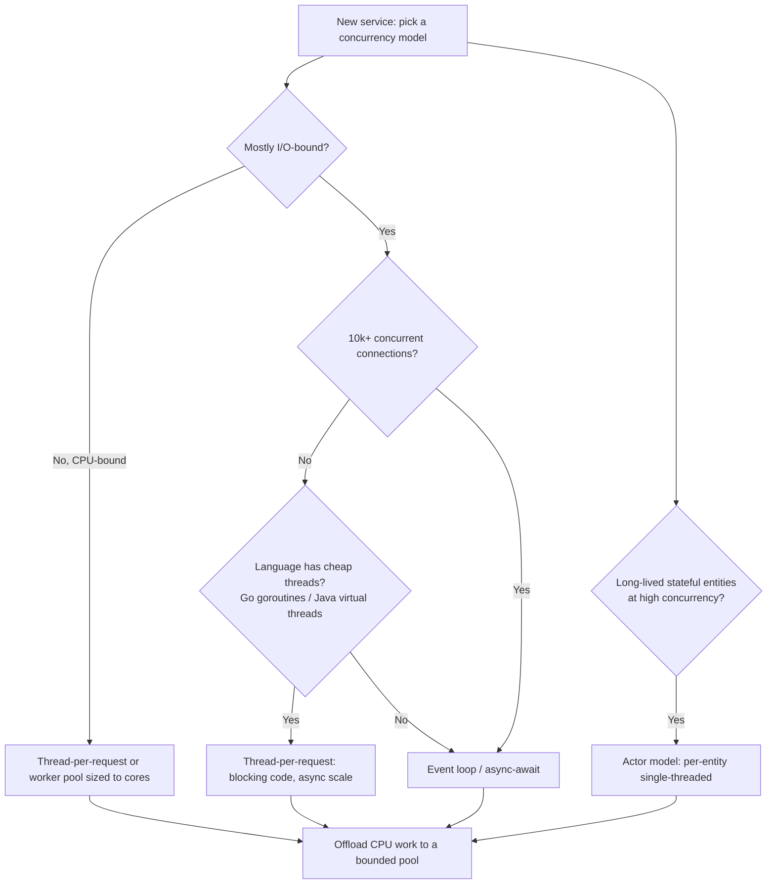
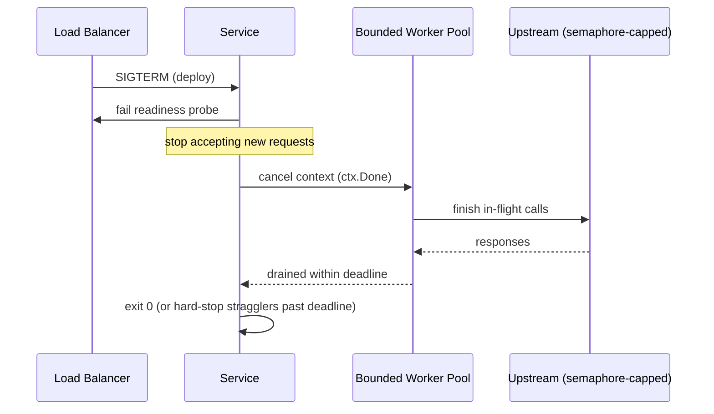

# Concurrency — Senior Level

> Focus: "How to architect?" "How to operate?" — choosing a concurrency model, designing for bounded resources and back-pressure, draining cleanly on shutdown, proving correctness with race detectors and stress tests, and observing concurrency in production.

---

## Table of Contents

1. [Choosing a concurrency architecture](#choosing-a-concurrency-architecture)
2. [Back-pressure and bounded resources](#back-pressure-and-bounded-resources)
3. [Graceful shutdown and draining](#graceful-shutdown-and-draining)
4. [Testing concurrent code](#testing-concurrent-code)
5. [Catching races in CI](#catching-races-in-ci)
6. [Observability of concurrency](#observability-of-concurrency)
7. [Team conventions](#team-conventions)
8. [Common Mistakes](#common-mistakes)
9. [Test Yourself](#test-yourself)
10. [Cheat Sheet](#cheat-sheet)
11. [Summary](#summary)
12. [Further Reading](#further-reading)
13. [Related Topics](#related-topics)

---

## Choosing a concurrency architecture

At junior and middle levels, concurrency is "make this one function thread-safe." At senior level, it's "pick the model the whole service runs on," because that choice constrains every handler, every dependency, and every failure mode for years.

There are four dominant server-side models. Pick deliberately — they are not interchangeable.

| Model | Mental model | Strong when | Weak when | Canonical stacks |
|---|---|---|---|---|
| **Thread-per-request** | One OS/green thread per in-flight request, blocking I/O | CPU-bound or moderate concurrency; simple code; existing blocking drivers | Tens of thousands of slow connections — one stack per connection is expensive (until virtual threads) | Java servlet thread pools, Go goroutines, Python threads |
| **Event loop (async)** | Single thread (or one per core) multiplexing non-blocking I/O via callbacks/`async`/`await` | C10K+ connections, mostly I/O-bound, low per-request CPU | A single blocking call or CPU-heavy task stalls *every* request on that loop | Node.js, Python `asyncio`, Netty, Tokio |
| **Worker pool** | Fixed set of workers pulling from a shared queue | Bounded, smoothable throughput; isolating slow work from the request path | Tasks with wildly varying cost cause head-of-line blocking | Java `ThreadPoolExecutor`, Go worker goroutines + channel, Celery/RQ |
| **Actor** | Independent actors owning private state, communicating only by messages | Stateful entities at scale (sessions, devices, game objects); no shared memory by construction | Request/response RPC where you just want a return value; debugging message storms | Akka/Pekko, Erlang/Elixir (BEAM), Microsoft Orleans |

Key forces that decide the answer:

- **I/O-bound vs CPU-bound.** Event loops shine for I/O fan-out; they are the *wrong* tool for CPU-heavy work, which must be offloaded to a separate thread/process pool or the loop blocks.
- **Per-connection cost.** Classic thread-per-request caps out around a few thousand threads because each carries a ~1 MB stack. **Java virtual threads (Project Loom, JDK 21+)** and **Go goroutines** collapse this cost, letting "blocking" code scale like async — the most consequential concurrency shift of the decade.
- **State ownership.** If entities have long-lived mutable state and high concurrency, actors give you single-threaded-per-entity semantics without locks. If your work is stateless request/response, a worker pool is simpler.
- **The ecosystem you already have.** A blocking JDBC driver inside an event loop is a foot-gun; a non-blocking R2DBC driver inside a thread-per-request app wastes its benefit. Match the model to your drivers.



> A single service can mix models: an event-loop edge accepting connections, a bounded worker pool for CPU work, and actors for stateful sessions. The anti-pattern is *accidental* mixing — a blocking call sneaking into an event loop, or unbounded goroutine spawning inside a "pool."

---

## Back-pressure and bounded resources

The defining senior insight: **every queue, pool, and connection set must be bounded, and the system must have a defined behavior when a bound is hit.** Unbounded concurrency does not fail gracefully — it fails by exhausting memory or file descriptors and taking the whole process down under exactly the load you most needed it to survive.

Back-pressure is the signal that propagates "I am full, slow down" back toward the producer. Without it, a fast producer and a slow consumer turn an unbounded buffer into an OOM.

### Bounded queues

A bounded queue is the simplest back-pressure primitive. When full, it must do one of: **block** the producer, **reject** the item (shed load), or **drop** the oldest. Choosing silently is a bug; choose explicitly.

```go
// Go: a bounded channel IS the back-pressure mechanism.
jobs := make(chan Job, 100) // capacity 100 — sends block when full

// Producer chooses behavior on a full queue instead of blocking forever:
select {
case jobs <- job:
    // accepted
default:
    metrics.Inc("jobs.rejected") // shed load — fail fast, stay alive
    return ErrOverloaded
}
```

```java
// Java: bounded queue + an explicit rejection policy. Never new an unbounded LinkedBlockingQueue.
var pool = new ThreadPoolExecutor(
    8, 8, 0L, TimeUnit.MILLISECONDS,
    new ArrayBlockingQueue<>(100),            // bounded — the back-pressure boundary
    new ThreadPoolExecutor.CallerRunsPolicy() // full → run on caller thread = natural throttle
);
// AbortPolicy (default) throws and sheds; CallerRunsPolicy slows the producer; never DiscardPolicy silently.
```

```python
# Python asyncio: bounded queue; put() suspends the producer when full.
queue: asyncio.Queue[Job] = asyncio.Queue(maxsize=100)
await queue.put(job)         # awaits (back-pressure) when full
# or fail fast:
try:
    queue.put_nowait(job)
except asyncio.QueueFull:
    raise Overloaded
```

### Semaphores to cap concurrent fan-out

When you fan out to a dependency, cap concurrency so you never exceed *its* limits (a connection pool, an upstream rate limit). A semaphore is the right tool — and it composes with timeouts.

```go
sem := make(chan struct{}, 20) // at most 20 concurrent upstream calls
for _, item := range items {
    sem <- struct{}{}          // acquire (blocks past 20 in flight)
    go func(it Item) {
        defer func() { <-sem }() // release
        callUpstream(ctx, it)
    }(item)
}
```

### Rate limiting and load shedding

- **Rate limit at the edge** with a token bucket (`golang.org/x/time/rate`, Resilience4j `RateLimiter`, an API gateway). It bounds *arrival* rate before work is even queued.
- **Shed load** when internal queues fill: return `503 Retry-After` rather than queueing infinitely. A request that will time out anyway should be rejected immediately to free capacity. (See `rate-limiting-throttling` and `retry-pattern` for the upstream/downstream contract.)
- **Bulkheads:** give each downstream its own bounded pool so one slow dependency can't consume all threads and starve the others. This is the concurrency form of fault isolation.

> Rule of thumb: **the only thing worse than a full queue is an unbounded one.** A full bounded queue gives you a clean signal and a choice. An unbounded queue gives you a heap dump.

---

## Graceful shutdown and draining

A service that exits the instant it receives `SIGTERM` drops in-flight requests, corrupts partial writes, and loses messages it has already acknowledged. Graceful shutdown is a first-class concurrency concern, not an afterthought.

The universal sequence:

1. **Stop accepting new work** — close the listener / stop pulling from the queue.
2. **Signal cancellation** to all in-flight work (a cancellable context / cancellation token).
3. **Drain** — wait for in-flight work to finish, up to a deadline.
4. **Hard-stop** anything still running past the deadline, log it, and exit.

```go
func main() {
    srv := &http.Server{Addr: ":8080", Handler: mux}
    go func() { _ = srv.ListenAndServe() }()

    stop := make(chan os.Signal, 1)
    signal.Notify(stop, syscall.SIGTERM, syscall.SIGINT)
    <-stop // received SIGTERM (e.g. Kubernetes pod termination)

    // Give in-flight requests up to 30s to finish; reject new ones immediately.
    ctx, cancel := context.WithTimeout(context.Background(), 30*time.Second)
    defer cancel()
    if err := srv.Shutdown(ctx); err != nil {
        log.Printf("forced shutdown, %d requests dropped: %v", inFlight.Load(), err)
    }
}
```

```java
// Java: orderly executor shutdown — the canonical two-phase drain.
pool.shutdown();                                  // stop accepting; let queued tasks run
if (!pool.awaitTermination(30, TimeUnit.SECONDS)) {
    List<Runnable> dropped = pool.shutdownNow();  // interrupt the stragglers
    log.warn("forced shutdown, {} tasks never started", dropped.size());
}
```

Operational details that separate seniors from the rest:

- **Coordinate the drain window with the orchestrator.** Kubernetes sends `SIGTERM`, waits `terminationGracePeriodSeconds` (default 30), then `SIGKILL`. Your drain deadline must be *shorter* than that grace period, or the kernel kills you mid-drain.
- **Account for the readiness lag.** A pod is removed from the load balancer only after its readiness probe fails *and* endpoint propagation completes. Sleep briefly (or fail readiness first) before closing the listener, or you'll reject requests the LB still routes to you.
- **Drain message consumers, don't just disconnect.** Stop the fetch loop, finish processing in-flight messages, *then* commit offsets / ack and close — otherwise you reprocess or lose messages.
- **Make in-flight work cancellable** so the drain can actually shorten under a deadline. A 25-second blocking call that ignores cancellation makes a 30-second drain meaningless.

---

## Testing concurrent code

Concurrency bugs are non-deterministic: a test passes 10,000 times and fails in production at 3 a.m. under load. You cannot test them away by luck. Senior testing uses tools that *force* the bad interleavings.

### Race detectors — the non-negotiable baseline

| Language | Tool | How |
|---|---|---|
| **Go** | built-in race detector | `go test -race ./...` and `go build -race` for canary binaries |
| **Java** | jcstress, Java Concurrency Stress | concurrency-correctness harness from the OpenJDK team; also `-Xlog`, ThreadSanitizer on the JVM via native agents |
| **C/C++/Rust FFI** | ThreadSanitizer (TSan) | `-fsanitize=thread` |
| **Python** | limited (GIL hides many races); use `pytest` stress loops, `faulthandler`, ThreadSanitizer for C extensions | the GIL is *not* a correctness guarantee — check-then-act races still occur |

Go's `-race` instruments memory accesses and reports the two stacks involved in a data race the moment it observes a conflicting unsynchronized access. It is the single highest-value tool in Go concurrency. It has runtime overhead (~5–10× CPU, ~5–10× memory), so run it in CI and on canaries, not in production hot paths.

```go
func TestCounter_Race(t *testing.T) {
    c := &Counter{}
    var wg sync.WaitGroup
    for i := 0; i < 1000; i++ {
        wg.Add(1)
        go func() { defer wg.Done(); c.Inc() }() // -race flags unsynchronized Inc()
    }
    wg.Wait()
    if c.Value() != 1000 {
        t.Fatalf("lost updates: got %d", c.Value())
    }
}
```

### jcstress — proving memory-model behavior in Java

For lock-free code and memory-ordering questions ("is this `volatile` actually necessary?"), jcstress runs two threads against shared state millions of times and classifies *every observed result* as acceptable or forbidden. It is the only honest way to validate double-checked locking, lazy initialization, and publication safety on a real JVM.

### Stress and soak tests

- **Stress test:** hammer the code with maximum concurrency for a short burst to surface contention, deadlocks, and lost updates.
- **Soak test:** run at moderate load for hours/days to surface slow leaks — goroutine/thread leaks, file-descriptor leaks, unbounded queue growth. A goroutine count that climbs monotonically over a 6-hour soak is a leak, full stop.

### Deterministic simulation testing (DST)

The frontier technique: run the *entire system* — including its concurrency, clock, and network — on a deterministic, seeded scheduler so any failing run is exactly reproducible from its seed. FoundationDB pioneered this; TigerBeetle and Antithesis productized it. It turns "flaky once a month" into "fails reproducibly with `--seed=42`." Reach for it when correctness is existential (databases, ledgers, consensus).

> Mocking and isolation matter here too: inject the clock and the scheduler so tests don't depend on wall-clock timing. See `concurrency-patterns` and `mocking-strategies` for injecting time and coordination points.

---

## Catching races in CI

A race detector that runs only on a developer's laptop catches nothing. Wire it into the pipeline so the gate is automatic.

```yaml
# GitHub Actions — Go: race detector + stress repetition.
- name: Test with race detector
  run: go test -race -count=1 ./...

- name: Stress flaky concurrency tests
  run: go test -race -run TestConcurrent -count=200 ./internal/queue/
```

```yaml
# Java — run jcstress as a separate, longer CI job.
- name: jcstress
  run: ./gradlew jcstress      # nightly, not per-PR — it runs for minutes
```

Practical CI policy:

- **Race detector on every PR** for languages that have a cheap one (Go). It is fast enough and catches the highest-severity class of bug.
- **`-count=N`** to repeat suspect tests — one run of a non-deterministic test proves little. Repetition raises the odds of hitting the bad interleaving.
- **Quarantine, don't ignore, flaky tests.** A test that fails 1-in-50 is reporting a real race or a real test bug. Tag it, track it, fix it — disabling it silently is how the 3 a.m. page is born.
- **Soak/stress on a schedule** (nightly), not per-PR — they're too slow for the inner loop but essential before release.
- **Deadlock watchdog in long tests:** fail the test if it exceeds a hard timeout, and dump all stacks on timeout so you can see the cycle.

---

## Observability of concurrency

When concurrency misbehaves in production, you need to *see* it — what every thread is doing, where contention lives, whether a deadlock has formed.

### Stack/goroutine dumps

| Runtime | Get a full dump | What it shows |
|---|---|---|
| **Go** | `SIGQUIT` to the process, or `pprof.Lookup("goroutine").WriteTo(w, 2)`, or `/debug/pprof/goroutine?debug=2` | every goroutine's stack — a leaked-goroutine count and a stuck `chan receive` jump out instantly |
| **Java** | `jstack <pid>`, `kill -3 <pid>`, or jcmd `Thread.print` | every thread's stack + lock ownership; the JVM **auto-detects and reports deadlocks** ("Found 1 deadlock") |
| **Python** | `faulthandler.dump_traceback_later()`, or `py-spy dump --pid <pid>` | per-thread stacks; `py-spy` works without modifying the running process |

A leaked goroutine/thread shows up as the same stack repeated thousands of times — usually blocked on a channel send/receive or a lock. This is the fastest way to find an unbounded-spawn or missing-cancellation bug.

### Deadlock detection

- **Java** detects deadlocks automatically in thread dumps and via `ThreadMXBean.findDeadlockedThreads()` — wire it to a health check.
- **Go** detects only the *total* deadlock (all goroutines blocked → `fatal error: all goroutines are asleep - deadlock!`); partial deadlocks need a dump + analysis. Tools like `go-deadlock` (a drop-in `sync.Mutex` replacement) detect lock-order inversions at runtime.

### Contention and concurrency profiling

| Runtime | Tool | Surfaces |
|---|---|---|
| **Go** | `pprof` block profile (`runtime.SetBlockProfileRate`) and mutex profile (`runtime.SetMutexProfileFraction`) | where goroutines block and which mutexes are contended |
| **Java** | **JFR** (Java Flight Recorder) `jdk.JavaMonitorEnter`/`ThreadPark` events; **async-profiler** lock mode | lock contention, park/unpark, thread states with near-zero overhead |
| **Python** | `py-spy`, Scalene | thread/async time attribution |

```go
// Enable contention profiling in a build-flagged debug path.
runtime.SetMutexProfileFraction(5) // sample 1/5 of mutex contention events
runtime.SetBlockProfileRate(1)     // record every blocking event (use sparingly)
// then: go tool pprof http://localhost:6060/debug/pprof/mutex
```

> Always expose `pprof` (Go) / JFR (Java) behind an internal-only endpoint or on demand. The first question for "the service hangs intermittently" is "what does the goroutine/thread dump show?" — make that one command away. See `profiling-techniques` and `observability-stack` for the broader picture.

---

## Team conventions

Concurrency correctness does not survive on individual heroics; it survives on conventions a linter or reviewer can enforce.

- **No naked goroutines / threads.** Every concurrent task must have (1) a known owner that waits for it, (2) a cancellation path, and (3) panic/exception recovery. A bare `go doWork()` with no `WaitGroup`, no context, and no recover is the Go equivalent of a memory leak waiting to happen. Wrap spawning in a structured-concurrency helper (`errgroup.Group` in Go, structured `TaskScope` in JDK 21+, `asyncio.TaskGroup` in Python 3.11+) so children are bounded by their parent's lifetime.
- **Always pass and honor a `context` / cancellation token.** It must thread through every blocking call. A function that takes no context but does I/O is uncancellable, which breaks both timeouts and graceful shutdown.
- **Lock ordering to prevent deadlock.** When code must hold two locks, define a global acquisition order (e.g. always lock `account` with the lower ID first) and document it. Deadlocks are almost always lock-order inversions; a single documented order eliminates the entire class. For complex cases, prefer a single coarse lock or a lock-free design over multiple fine-grained locks.
- **Prefer message passing over shared memory** where the model allows it ("share memory by communicating, don't communicate by sharing memory"). It moves correctness from "did everyone remember the lock?" to "who owns this data right now?"
- **Make shared state obviously shared.** Name it, comment the invariant ("guarded by `mu`"), and keep the lock and the data it guards in the same struct. Go's `go vet` and `-copylocks` catch copying a struct that contains a mutex; use it.
- **No business logic inside a critical section.** Hold the lock only to read/write the shared state; do the work outside. A network call under a lock is a latent global stall.



---

## Common Mistakes

- **Unbounded goroutine/thread spawn per request.** `go handle(req)` with no cap turns a traffic spike into an OOM. Bound it with a worker pool or semaphore.
- **Unbounded queues.** `LinkedBlockingQueue` with no capacity, an unbuffered-then-grown slice, or `asyncio.Queue()` with no `maxsize` — all defer the failure to the worst possible moment.
- **No back-pressure.** A fast producer + slow consumer + unbounded buffer = memory blowup. The buffer is not a solution; the bound plus a defined full-behavior is.
- **Blocking call inside an event loop.** One synchronous DB call or `time.sleep` on the Node/asyncio loop stalls *every* concurrent request. Offload to a thread/process pool.
- **Ignoring `go test -race` output / disabling flaky tests.** Both are reports of real races. Suppressing the messenger does not fix the race.
- **No graceful shutdown.** `os.Exit` on `SIGTERM` drops in-flight work and unacked messages on every single deploy.
- **Drain deadline longer than the orchestrator grace period.** The kernel `SIGKILL`s you mid-drain, defeating the whole point.
- **Holding a lock across I/O.** Turns a local mutex into a global throughput ceiling and a deadlock risk.
- **Lock-order inversion.** Two code paths acquire locks A,B and B,A — a deadlock that appears only under concurrency. Fix with a global lock order.
- **Trusting the GIL as a concurrency model.** Python's GIL prevents some races but not check-then-act races; and free-threaded CPython (PEP 703) removes that crutch entirely.

---

## Test Yourself

**1. Your service spawns one goroutine per incoming request to call three upstreams. Under a traffic spike it OOMs. What's the fix, and what's the deeper principle?**

<details><summary>Answer</summary>
Cap the concurrency: route work through a bounded worker pool or guard the upstream calls with a semaphore, and apply back-pressure (block or shed) when the bound is hit. The deeper principle: every concurrent resource must be bounded, and the system must have a defined behavior when the bound is reached. Unbounded concurrency converts load spikes into resource exhaustion — it fails exactly when you need it most. The buffer/spawn count is not a tuning knob to raise; the bound itself is the safety mechanism.
</details>

**2. A `ThreadPoolExecutor` is created with `new LinkedBlockingQueue<>()`. Why is this dangerous, and what would you change?**

<details><summary>Answer</summary>
An unbounded queue means the pool never grows past its core size and the queue absorbs unlimited tasks — under sustained overload it grows until the heap is exhausted and the process dies, with no back-pressure signal to the producer. Use a bounded `ArrayBlockingQueue` with an explicit `RejectedExecutionHandler`: `CallerRunsPolicy` to throttle the producer, or `AbortPolicy` to shed load with a clear error. Now a full system fails fast and visibly instead of silently accumulating until OOM.
</details>

**3. Your team adds a feature requiring two locks. A month later you see intermittent deadlocks under load. Diagnose and prevent.**

<details><summary>Answer</summary>
This is almost certainly a lock-order inversion: one path acquires A then B, another acquires B then A. Confirm with a thread dump — Java reports "Found 1 deadlock" with the two blocked threads and the locks each holds; in Go take a goroutine dump or run with `go-deadlock`. Prevention: define and document a single global lock acquisition order (e.g. always lock the lower account ID first) and enforce it in review. Better still, eliminate the second lock — a single coarser lock or a lock-free / message-passing design removes the entire class of bug.
</details>

**4. A test passes locally but fails 1-in-50 times in CI. A teammate proposes adding `@Disabled` / `t.Skip`. Respond.**

<details><summary>Answer</summary>
Push back. A 1-in-50 failure is a report of a real defect — either a data race in the code under test or a race in the test's own synchronization. Disabling it hides the highest-severity class of bug. Instead: reproduce by running with the race detector and `-count=200` (or jcstress for memory-model questions) to raise the hit rate; fix the underlying race; if it can't be fixed immediately, *quarantine* it (tag, track, still report) rather than delete it. Flaky-test suppression is how a reproducible race becomes a 3 a.m. production incident.
</details>

**5. Kubernetes is `SIGKILL`ing your pods during deploys despite a 30-second graceful shutdown. What's likely wrong?**

<details><summary>Answer</summary>
Your drain deadline is not strictly shorter than `terminationGracePeriodSeconds` (default 30s), so the kernel kills you mid-drain. Set the in-flight drain timeout below the grace period (e.g. 25s for a 30s grace), or raise the grace period. Also check the readiness sequence: the pod is still receiving traffic until its endpoint is removed from the load balancer, so fail the readiness probe (or sleep briefly) *before* closing the listener — otherwise you reject requests the LB still routes to you even though shutdown "started" correctly.
</details>

**6. When would you choose an actor model over a worker pool, and what does it cost you?**

<details><summary>Answer</summary>
Choose actors when you have many long-lived, stateful entities at high concurrency — sessions, devices, game objects, per-key aggregates — where you want single-threaded-per-entity semantics without explicit locks. Each actor owns its state and processes one message at a time, so intra-entity races are impossible by construction. The cost: request/response RPC becomes awkward (you send a message and await a reply), debugging shifts to tracing message flows rather than reading a call stack, message storms and mailbox growth become new failure modes, and you take on a framework (Akka/Pekko, Orleans, BEAM). For stateless request/response work, a worker pool is simpler and you should not pay the actor tax.
</details>

---

## Cheat Sheet

| Decision | Default choice | Reach for instead when |
|---|---|---|
| Concurrency model | Thread-per-request on cheap threads (Go goroutines, Java virtual threads) | Event loop for 10k+ I/O-bound conns; actors for stateful entities |
| Queue | Bounded, with explicit full-behavior | — never unbounded |
| Full-queue behavior | Shed load (`503`/reject) on the request path | Block (`CallerRuns`) for internal batch pipelines |
| Fan-out concurrency | Semaphore-capped to the dependency's limit | Per-dependency bulkhead pools for isolation |
| Cancellation | `context` / token through every blocking call | — always |
| Shutdown | Stop-accept → cancel → drain (deadline < grace) → hard-stop | — always |
| Race testing | `go test -race` per PR | jcstress for memory-model; DST for existential correctness |
| Diagnosing a hang | Goroutine/thread dump first | Block/mutex profile for contention |
| Two locks | Global lock order, documented | Eliminate the second lock if possible |

**Tooling quick reference**

```bash
# Go
go test -race -count=200 ./...                 # race detector + stress repeat
go tool pprof http://host:6060/debug/pprof/goroutine   # goroutine dump / leaks
go tool pprof http://host:6060/debug/pprof/mutex       # mutex contention

# Java
jstack <pid>        # thread dump + auto deadlock detection
jcmd <pid> Thread.print
./gradlew jcstress  # concurrency-correctness harness

# Python
py-spy dump --pid <pid>     # per-thread stacks, no process restart
python -X faulthandler ...   # dump on hang/crash
```

---

## Summary

Senior concurrency is an exercise in *systems thinking*, not clever locking. You choose a concurrency model that matches your I/O profile, per-connection cost, and state ownership — and you avoid mixing models by accident. You bound every queue, pool, and fan-out, and you give each bound a defined behavior (block, shed, or drop) so the system degrades predictably under load instead of OOMing. You design shutdown as a first-class flow — stop accepting, cancel, drain within a deadline shorter than the orchestrator's grace period, then hard-stop. You prove correctness with the tools that *force* bad interleavings — race detectors in CI on every PR, jcstress for memory-model questions, soak tests for leaks, and deterministic simulation when correctness is existential. And you make concurrency observable: a goroutine/thread dump and a contention profile are always one command away. Conventions — no naked goroutines, always-cancel context, a documented lock order — turn all of this from heroics into the default.

---

## Further Reading

- *The Art of Multiprocessor Programming* — Herlihy & Shavit (the canonical text on concurrent data structures and correctness)
- *Java Concurrency in Practice* — Brian Goetz et al. (memory model, executors, safe publication)
- *Concurrency in Go* — Katherine Cox-Buday (pipelines, fan-out/in, context, errgroup)
- *Release It!* — Michael Nygard (bulkheads, circuit breakers, back-pressure, shed-load in production)
- Go blog — "Go Concurrency Patterns: Context" and the race detector docs
- jcstress and async-profiler project documentation
- FoundationDB / TigerBeetle write-ups on deterministic simulation testing

---

## Related Topics

- [junior.md](junior.md) — locks, race conditions, and the basics of shared state
- [middle.md](middle.md) — synchronization primitives, atomics, and thread-safe collections
- [professional.md](professional.md) — memory models, lock-free algorithms, and the cost of synchronization
- [Chapter README](../README.md) — the positive rules of clean concurrency
- [Async and Functional](../12-async-and-functional/README.md) — async/await, futures, and avoiding shared mutable state
- [Unit Tests](../08-unit-tests/README.md) — testing discipline that concurrent testing builds on
- [Anti-Patterns](../../anti-patterns/README.md) — concurrency anti-patterns to recognize and avoid
- [Refactoring](../../refactoring/README.md) — restructuring code safely, including toward concurrency-safe designs
