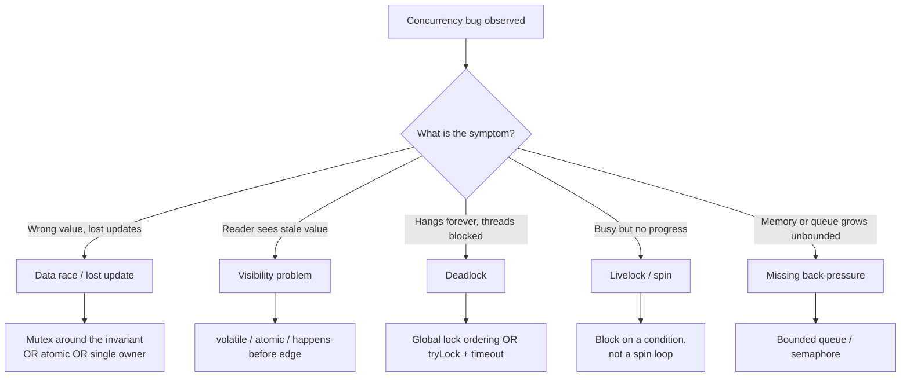

# Concurrency — Practice Tasks

> 12 hands-on exercises on writing correct concurrent code: data races, critical-section scope, thread-safe collections, lazy initialization, back-pressure, producer-consumer, cancellation, deadlock, and atomics. Every task gives a scenario, racy or unsafe code, an instruction, and a full solution with reasoning. Languages vary (Go / Java / Python). Ordered easy → hard.

---

## Table of Contents

1. [Task 1 — Fix a data race with a mutex (Go)](#task-1--fix-a-data-race-with-a-mutex-go)
2. [Task 2 — Make a counter correct with atomics (Java)](#task-2--make-a-counter-correct-with-atomics-java)
3. [Task 3 — Fix a race by switching to message passing (Go)](#task-3--fix-a-race-by-switching-to-message-passing-go)
4. [Task 4 — Replace a thread-unsafe collection (Java)](#task-4--replace-a-thread-unsafe-collection-java)
5. [Task 5 — Shrink an over-broad critical section (Go)](#task-5--shrink-an-over-broad-critical-section-go)
6. [Task 6 — Fix broken double-checked locking (Java)](#task-6--fix-broken-double-checked-locking-java)
7. [Task 7 — Lazy init done right in Python (`functools.cache`)](#task-7--lazy-init-done-right-in-python-functoolscache)
8. [Task 8 — Add back-pressure with a bounded queue (Go)](#task-8--add-back-pressure-with-a-bounded-queue-go)
9. [Task 9 — Correct producer-consumer (Python)](#task-9--correct-producer-consumer-python)
10. [Task 10 — Context, cancellation, and graceful shutdown (Go)](#task-10--context-cancellation-and-graceful-shutdown-go)
11. [Task 11 — Fix a deadlock via lock ordering (Java)](#task-11--fix-a-deadlock-via-lock-ordering-java)
12. [Task 12 — Bound concurrency with a semaphore (Go, open-ended)](#task-12--bound-concurrency-with-a-semaphore-go-open-ended)
- [Self-Assessment](#self-assessment)
- [Related Topics](#related-topics)

---

## How to Use

Each task is self-contained. Read the scenario, study the broken code, and **write your fix before opening the solution.** The goal is not just compiling code — it is code that is correct under the language's memory model and stays correct under contention.

A reliable workflow for every fix:

1. Name the hazard precisely: data race, lost update, visibility (stale read), deadlock, livelock, or unbounded growth.
2. Reproduce it. Concurrency bugs hide on a quiet machine. Use the race detector and load.
3. Apply the smallest correct primitive — not the biggest lock you can find.
4. Re-run under contention to confirm the fix and check you did not serialize a hot path into a bottleneck.

Tools that turn "works on my laptop" into evidence:

```bash
# Go: the race detector instruments memory accesses and reports races at runtime.
go test -race ./...
go run -race main.go

# Java: stress with jcstress (concurrency test harness) or run thousands of iterations.
# Python: the GIL hides some races but NOT compound operations or I/O interleaving.
python -X dev script.py
```



---

## Task 1 — Fix a data race with a mutex (Go)

**Difficulty:** Easy

**Scenario:** A request handler increments a shared hit counter from many goroutines. Under load the reported count is lower than the number of requests, and `go test -race` flags a data race.

```go
package metrics

type Counter struct {
    total int64
}

func (c *Counter) Inc() {
    c.total++ // read-modify-write: not atomic, multiple goroutines collide
}

func (c *Counter) Total() int64 {
    return c.total // racy read concurrent with Inc
}
```

**Instruction:** Make `Counter` safe for concurrent use by guarding the shared field with a `sync.Mutex`. Keep the public API unchanged.

<details>
<summary>Solution</summary>

```go
package metrics

import "sync"

type Counter struct {
    mu    sync.Mutex
    total int64
}

func (c *Counter) Inc() {
    c.mu.Lock()
    c.total++
    c.mu.Unlock()
}

func (c *Counter) Total() int64 {
    c.mu.Lock()
    defer c.mu.Unlock()
    return c.total
}
```

**Reasoning:** `c.total++` compiles to load, add, store. Two goroutines can both load the same value, both add one, and both store — one increment is lost. The fix is not merely "the writes are unsafe": *both* the write in `Inc` and the read in `Total` must be guarded by the **same** mutex. A read concurrent with a write is itself a data race, and the reader may observe a torn or stale value. Guarding only the writer leaves `Total` racy.

Note `defer` in `Total` (the body is a single return, so unlocking on the deferred path is clean) but a plain `Unlock` in `Inc` (the critical section is one line, and avoiding `defer` shaves a tiny cost on a hot path — a reasonable micro-optimization once measured). For a counter specifically, an atomic is even better — see Task 2.

</details>

---

## Task 2 — Make a counter correct with atomics (Java)

**Difficulty:** Easy

**Scenario:** A rate limiter tracks how many requests it has seen. The field is plain `long`, mutated from a thread pool. Counts are wrong and occasionally a reader sees a value that never existed.

```java
public class RequestMeter {
    private long count;           // not safe to publish across threads
    private boolean tripped;      // set when count crosses a threshold

    public void record() {
        count++;                  // lost updates under contention
        if (count > 1000) {
            tripped = true;       // visibility: other threads may never see this
        }
    }

    public long count() { return count; }
    public boolean isTripped() { return tripped; }
}
```

**Instruction:** Replace the primitives with the right `java.util.concurrent.atomic` types so increments never collide and readers always see the latest value, **without** taking a lock.

<details>
<summary>Solution</summary>

```java
import java.util.concurrent.atomic.AtomicLong;
import java.util.concurrent.atomic.AtomicBoolean;

public class RequestMeter {
    private final AtomicLong count = new AtomicLong();
    private final AtomicBoolean tripped = new AtomicBoolean();

    public void record() {
        long now = count.incrementAndGet(); // single atomic read-modify-write
        if (now > 1000) {
            tripped.set(true);              // atomic store, visible to all threads
        }
    }

    public long count() { return count.get(); }
    public boolean isTripped() { return tripped.get(); }
}
```

**Reasoning:** Two distinct hazards live here. First, `count++` is a lost-update race: atomics replace it with a single hardware-level compare-and-swap loop (`incrementAndGet`) that no other thread can interleave. Second, even if increments were correct, a plain `long`/`boolean` written by one thread is not guaranteed *visible* to another — the JVM may keep it in a register or cache indefinitely. Atomic types carry the same memory-ordering guarantees as `volatile`, so every `get` sees the most recent `set`.

Atomics beat a mutex here because the operation is a single variable with no multi-field invariant. Use `incrementAndGet`'s return value (`now`) for the threshold check rather than calling `count.get()` again — re-reading would reintroduce a check-then-act race where two threads each read 1001 and both trip, or worse, drift.

</details>

---

## Task 3 — Fix a race by switching to message passing (Go)

**Difficulty:** Easy–Medium

**Scenario:** A worker pool accumulates results into a shared map. The map is mutated from N goroutines with no synchronization — Go panics with `concurrent map writes`, or silently corrupts the map.

```go
func aggregate(ids []int) map[int]int {
    results := make(map[int]int)
    var wg sync.WaitGroup
    for _, id := range ids {
        wg.Add(1)
        go func(id int) {
            defer wg.Done()
            results[id] = expensiveLookup(id) // concurrent map write — fatal
        }(id)
    }
    wg.Wait()
    return results
}
```

**Instruction:** Fix the race **without a mutex**, by having workers send results over a channel and a single owner goroutine (or the main goroutine) build the map. "Don't communicate by sharing memory; share memory by communicating."

<details>
<summary>Solution</summary>

```go
func aggregate(ids []int) map[int]int {
    type pair struct {
        id, value int
    }
    ch := make(chan pair, len(ids)) // buffered so workers never block on send

    var wg sync.WaitGroup
    for _, id := range ids {
        wg.Add(1)
        go func(id int) {
            defer wg.Done()
            ch <- pair{id, expensiveLookup(id)}
        }(id)
    }

    // Close the channel once all workers are done, from a separate goroutine,
    // so the range loop below terminates.
    go func() {
        wg.Wait()
        close(ch)
    }()

    results := make(map[int]int) // owned exclusively by this goroutine
    for p := range ch {
        results[p.id] = p.value
    }
    return results
}
```

**Reasoning:** The map is now touched by exactly one goroutine, so there is no shared mutable state to protect — the race is structurally impossible, not merely locked away. Each worker computes independently and hands its result to the owner via the channel. The channel provides the happens-before edge: a send happens-before the corresponding receive, so the value is safely published.

Two details matter. The channel is **buffered** to `len(ids)` so a worker's `expensiveLookup` result can be sent without blocking, letting the worker exit and free its slot. And `close(ch)` runs in its own goroutine *after* `wg.Wait()` — closing too early would panic on a send to a closed channel, and never closing would deadlock the `range` loop. A mutex-guarded map would also be correct, but message passing removes the shared object entirely, which is the simpler thing to reason about.

</details>

---

## Task 4 — Replace a thread-unsafe collection (Java)

**Difficulty:** Medium

**Scenario:** A session cache uses a plain `HashMap`. It is read constantly and written occasionally from many threads. In production it sometimes throws `ConcurrentModificationException`, and under heavy resize load a thread has spun at 100% CPU inside `HashMap.get` (a corrupted internal linked list).

```java
public class SessionCache {
    private final Map<String, Session> cache = new HashMap<>(); // not thread-safe

    public Session get(String id) {
        return cache.get(id);
    }

    public void put(String id, Session s) {
        cache.put(id, s); // concurrent put during resize can corrupt the table
    }

    public Session getOrCreate(String id) {
        Session s = cache.get(id);
        if (s == null) {              // check-then-act race
            s = new Session(id);
            cache.put(id, s);         // two threads can both create + overwrite
        }
        return s;
    }
}
```

**Instruction:** Replace the unsafe collection with a proper concurrent one and fix the check-then-act race in `getOrCreate` so exactly one `Session` is created per id.

<details>
<summary>Solution</summary>

```java
import java.util.Map;
import java.util.concurrent.ConcurrentHashMap;

public class SessionCache {
    private final Map<String, Session> cache = new ConcurrentHashMap<>();

    public Session get(String id) {
        return cache.get(id);
    }

    public void put(String id, Session s) {
        cache.put(id, s);
    }

    public Session getOrCreate(String id) {
        // Atomic check-then-act: computeIfAbsent guarantees the mapping
        // function runs at most once per absent key.
        return cache.computeIfAbsent(id, Session::new);
    }
}
```

**Reasoning:** A plain `HashMap` under concurrent writes is not just "occasionally wrong" — a resize racing with a put can leave the bucket array in a state that loops forever on read (the classic Java 7 infinite-loop bug) or drops entries. `ConcurrentHashMap` uses fine-grained synchronization internally so reads are lock-free and writes lock only the affected bin.

But swapping the map type alone does **not** fix `getOrCreate`. Two threads can each call `get`, both see `null`, and both create and `put` a `Session` — one silently overwrites the other, and any caller holding the discarded instance diverges from the cache. `computeIfAbsent` makes the whole check-create-store sequence atomic for that key: the creation lambda runs at most once, and every caller for that id gets the same instance. If `Session::new` is expensive or could recurse into the same map, prefer a memoizing `Supplier` or compute outside and `putIfAbsent`, but for a simple constructor `computeIfAbsent` is exactly right.

</details>

---

## Task 5 — Shrink an over-broad critical section (Go)

**Difficulty:** Medium

**Scenario:** A price service caches quotes. Profiling shows threads queued on a single mutex; the lock is held across a slow network call, serializing every request behind one in-flight fetch.

```go
type PriceService struct {
    mu     sync.Mutex
    cache  map[string]float64
    client *http.Client
}

func (p *PriceService) Price(symbol string) (float64, error) {
    p.mu.Lock()
    defer p.mu.Unlock() // held for the ENTIRE function, including the HTTP call

    if v, ok := p.cache[symbol]; ok {
        return v, nil
    }
    price, err := p.fetchRemote(symbol) // slow network I/O under the lock
    if err != nil {
        return 0, err
    }
    p.cache[symbol] = price
    return price, nil
}
```

**Instruction:** Narrow the critical section so the mutex protects only the map accesses, never the network call. Keep the cache safe.

<details>
<summary>Solution</summary>

```go
func (p *PriceService) Price(symbol string) (float64, error) {
    // Critical section 1: read the cache.
    p.mu.Lock()
    if v, ok := p.cache[symbol]; ok {
        p.mu.Unlock()
        return v, nil
    }
    p.mu.Unlock()

    // Slow I/O happens with NO lock held — concurrent requests proceed in parallel.
    price, err := p.fetchRemote(symbol)
    if err != nil {
        return 0, err
    }

    // Critical section 2: publish the result.
    p.mu.Lock()
    p.cache[symbol] = price
    p.mu.Unlock()
    return price, nil
}
```

**Reasoning:** A lock should cover the shortest span that preserves the invariant — here, the invariant is only "the map is not read and written concurrently." The network fetch touches no shared state, so holding the lock across it serializes the whole service behind one slow request, turning a cache into a global queue. Moving I/O outside the lock lets thousands of requests for different symbols fetch in parallel.

The tradeoff is a benign **redundant fetch**: two goroutines can both miss the cache for the same symbol and both fetch. That is acceptable for an idempotent price read — the last writer wins and both callers get a valid price. When duplicate work is expensive or must be deduplicated, use `golang.org/x/sync/singleflight` to collapse concurrent identical requests into one, which keeps the lock narrow *and* avoids the redundant call. The cardinal rule stands: never hold a lock across I/O or any blocking call.

</details>

---

## Task 6 — Fix broken double-checked locking (Java)

**Difficulty:** Medium–Hard

**Scenario:** A singleton uses double-checked locking to lazily build an expensive config. The field is a plain reference. On some hardware a thread observes a non-null `instance` that is only **partially constructed** — its fields are still default values.

```java
public class Config {
    private static Config instance; // NOT volatile — the bug

    private final Map<String, String> settings;

    private Config() {
        this.settings = loadFromDisk(); // expensive
    }

    public static Config get() {
        if (instance == null) {               // first check (no lock)
            synchronized (Config.class) {
                if (instance == null) {       // second check (locked)
                    instance = new Config();  // unsafe publication
                }
            }
        }
        return instance;
    }
}
```

**Instruction:** Fix the broken double-checked locking. Provide the minimal correct fix, then show the idiom most Java developers should prefer instead.

<details>
<summary>Solution</summary>

Minimal fix — make the field `volatile`:

```java
public class Config {
    private static volatile Config instance; // volatile fixes safe publication

    private final Map<String, String> settings;

    private Config() {
        this.settings = loadFromDisk();
    }

    public static Config get() {
        Config result = instance;          // read volatile once into a local
        if (result == null) {
            synchronized (Config.class) {
                result = instance;
                if (result == null) {
                    instance = result = new Config();
                }
            }
        }
        return result;
    }
}
```

Preferred idiom — the **initialization-on-demand holder** (no `volatile`, no explicit locking, lazy and thread-safe by the class-loading contract):

```java
public class Config {
    private final Map<String, String> settings;

    private Config() {
        this.settings = loadFromDisk();
    }

    private static class Holder {
        static final Config INSTANCE = new Config();
    }

    public static Config get() {
        return Holder.INSTANCE; // class init is lazy + serialized by the JVM
    }
}
```

**Reasoning:** `instance = new Config()` is not atomic: it allocates memory, runs the constructor, and assigns the reference. Without `volatile`, the JVM and CPU are free to reorder so the reference is published *before* the constructor's writes to `settings` are visible. A second thread passing the first (unlocked) check then sees a non-null but half-built object — the dreaded partially constructed object. Marking the field `volatile` inserts the memory barriers that forbid that reordering and guarantee the constructor's effects happen-before any read of the reference. Reading the volatile into a local (`result`) is a small but real win: it turns two volatile reads into one on the hot path.

The holder idiom sidesteps the whole problem. The JVM guarantees a class is initialized lazily, on first use, and exactly once with proper synchronization. `Holder` is not loaded until `get()` first touches `Holder.INSTANCE`, so initialization is deferred and the language spec — not hand-written barriers — provides the safety. It is less code, impossible to get subtly wrong, and the recommended default.

</details>

---

## Task 7 — Lazy init done right in Python (`functools.cache`)

**Difficulty:** Medium

**Scenario:** A Python service lazily loads a large model. The hand-rolled double-checked pattern looks safe but has a race: under threads, two callers can both start the expensive load.

```python
import threading

_model = None
_lock = threading.Lock()

def get_model():
    global _model
    if _model is None:            # check-then-act, no lock yet
        with _lock:
            if _model is None:    # second check
                _model = load_model()   # expensive
    return _model
```

**Instruction:** The double-checked version above is actually *correct* in CPython (the GIL makes the reference read/write atomic), but it is verbose and easy to get wrong if copied. Replace it with the idiomatic, provably-once-initialized approach.

<details>
<summary>Solution</summary>

```python
from functools import cache  # Python 3.9+; use lru_cache(maxsize=None) on older

@cache
def get_model():
    return load_model()   # runs exactly once; subsequent calls return the cached result
```

If the lazy value is an attribute of an object rather than a module-level singleton, use `functools.cached_property`:

```python
from functools import cached_property

class Service:
    @cached_property
    def model(self):
        return load_model()   # computed on first access, stored on the instance
```

**Reasoning:** The hand-rolled version works in CPython today only because the GIL serializes bytecode and a reference assignment is a single bytecode, so the partial-construction problem from Task 6 cannot occur the same way. But it is fragile: it relies on a CPython implementation detail (free-threaded Python, PEP 703, removes the GIL), and the double-check boilerplate invites copy-paste bugs.

`functools.cache` decorates the function with a thread-safe memoization wrapper: the first call computes and stores the result; concurrent and later calls return the stored value. The locking is handled inside the standard library and is correct across interpreter variants. `cached_property` is the per-instance analogue — it computes on first access and replaces itself with the value in the instance `__dict__`, so later accesses skip the descriptor entirely. Both express "compute this exactly once, lazily" as a declaration rather than a manual protocol, which is the whole point of fixing double-checked locking: prefer a vetted idiom over hand-written synchronization.

</details>

---

## Task 8 — Add back-pressure with a bounded queue (Go)

**Difficulty:** Medium–Hard

**Scenario:** An ingestion service reads events from a fast source and hands each to a goroutine for processing. There is no limit: when the source outpaces processing, goroutines and memory grow without bound until the process is OOM-killed.

```go
func ingest(events <-chan Event) {
    for ev := range events {
        go process(ev) // unbounded goroutine spawn — no back-pressure
    }
}
```

**Instruction:** Add back-pressure so at most N events are processed concurrently and a faster producer is naturally slowed down rather than overwhelming the system. Use a bounded worker pool fed by a bounded channel.

<details>
<summary>Solution</summary>

```go
func ingest(events <-chan Event, workers int) {
    // Bounded queue: when full, the loop below blocks on send,
    // which propagates back-pressure to the producer of `events`.
    jobs := make(chan Event, workers)

    var wg sync.WaitGroup
    for i := 0; i < workers; i++ {
        wg.Add(1)
        go func() {
            defer wg.Done()
            for ev := range jobs {
                process(ev) // exactly `workers` of these run at once
            }
        }()
    }

    for ev := range events {
        jobs <- ev // blocks when all workers are busy AND the buffer is full
    }
    close(jobs) // signal workers to drain and exit
    wg.Wait()
}
```

Alternative using a counting semaphore when you want one goroutine per job but a hard cap on concurrency:

```go
func ingest(events <-chan Event, maxConcurrent int) {
    sem := make(chan struct{}, maxConcurrent) // capacity = concurrency limit
    var wg sync.WaitGroup
    for ev := range events {
        sem <- struct{}{} // acquire — blocks once maxConcurrent are in flight
        wg.Add(1)
        go func(ev Event) {
            defer wg.Done()
            defer func() { <-sem }() // release the slot
            process(ev)
        }(ev)
    }
    wg.Wait()
}
```

**Reasoning:** The original code answers a fast producer by spawning unbounded work, which is the opposite of back-pressure — it converts a throughput mismatch into unbounded memory growth and eventual collapse. The fix gives the system a fixed amount of in-flight work. With the worker-pool version, the `jobs <- ev` send **blocks** once every worker is busy and the small buffer is full; that block propagates upstream, so the producer feeding `events` slows down too. Back-pressure is exactly this: a full downstream forces the upstream to wait instead of dropping data or exhausting memory.

The worker-pool form reuses a fixed set of goroutines (cheap, predictable). The semaphore form spawns a goroutine per job but the buffered `sem` channel caps how many run simultaneously — acquire by sending, release by receiving. Choose the pool when per-job goroutine churn matters; choose the semaphore when jobs are heterogeneous and you want each in its own goroutine. Both replace "infinite" with "a number you can reason about under peak load."

</details>

---

## Task 9 — Correct producer-consumer (Python)

**Difficulty:** Medium–Hard

**Scenario:** A producer thread feeds work to consumer threads through a shared list guarded by ad-hoc sleeps. It loses items, busy-waits, and the consumers never shut down cleanly.

```python
import threading, time

buffer = []
done = False

def producer(items):
    global done
    for item in items:
        buffer.append(item)   # unsynchronized mutation
    done = True

def consumer():
    while not done or buffer:
        if buffer:
            item = buffer.pop(0)  # race: two consumers can pop the same index region
            handle(item)
        else:
            time.sleep(0.01)      # busy-wait / spin with arbitrary sleep
```

**Instruction:** Reimplement producer-consumer correctly using `queue.Queue`, which provides the locking and blocking for you. Signal completion cleanly and let consumers exit without spinning.

<details>
<summary>Solution</summary>

```python
import queue
import threading

def run(items, num_consumers):
    q: queue.Queue = queue.Queue(maxsize=100)  # bounded -> built-in back-pressure

    def producer():
        for item in items:
            q.put(item)          # blocks if the queue is full (back-pressure)
        for _ in range(num_consumers):
            q.put(None)          # one sentinel per consumer to signal shutdown

    def consumer():
        while True:
            item = q.get()       # blocks until an item is available (no spin)
            try:
                if item is None: # sentinel: time to stop
                    return
                handle(item)
            finally:
                q.task_done()

    prod = threading.Thread(target=producer)
    consumers = [threading.Thread(target=consumer) for _ in range(num_consumers)]

    prod.start()
    for c in consumers:
        c.start()

    prod.join()
    for c in consumers:
        c.join()
```

**Reasoning:** The broken version has three classic defects. It mutates a plain `list` from multiple threads (`append`/`pop` interleave unsafely for compound logic, and `not done or buffer` reads two unsynchronized variables). It busy-waits with `time.sleep(0.01)`, burning CPU and adding latency. And its shutdown is a data race on `done` with no guarantee consumers see the final items before exiting.

`queue.Queue` is purpose-built for this: every `put` and `get` is internally locked, and `get` **blocks** on an internal condition variable until an item arrives — no polling, no spin. Bounding the queue (`maxsize=100`) gives back-pressure for free: a fast producer blocks on `put` when consumers fall behind. Shutdown uses the **sentinel** (poison-pill) idiom — the producer enqueues one `None` per consumer after the real work, so each consumer reads exactly one sentinel and returns. This guarantees every real item is processed before any consumer exits, and no consumer is left blocked on an empty queue forever. `task_done` pairs with `q.join()` if the caller wants to wait on completion by item count instead of joining threads.

</details>

---

## Task 10 — Context, cancellation, and graceful shutdown (Go)

**Difficulty:** Hard

**Scenario:** A background poller runs forever in a goroutine. On shutdown (SIGTERM) the process exits immediately, killing in-flight work and leaking the goroutine. There is no way to stop it cleanly or to bound how long an operation may run.

```go
func startPoller(interval time.Duration) {
    go func() {
        for {
            poll()                 // no way to cancel; no timeout
            time.Sleep(interval)   // can't be interrupted
        }
    }()
    // nothing ever stops this goroutine
}
```

**Instruction:** Rewrite using `context.Context` so the poller stops promptly on cancellation, each `poll` is bounded by a timeout, and `main` waits for a clean shutdown on SIGTERM/SIGINT.

<details>
<summary>Solution</summary>

```go
func startPoller(ctx context.Context, interval time.Duration) <-chan struct{} {
    done := make(chan struct{})
    go func() {
        defer close(done) // signal that the goroutine has fully exited
        ticker := time.NewTicker(interval)
        defer ticker.Stop()
        for {
            select {
            case <-ctx.Done():
                return // cancellation requested -> exit the loop and goroutine
            case <-ticker.C:
                // Bound each poll so one slow call cannot hang shutdown.
                pollCtx, cancel := context.WithTimeout(ctx, 5*time.Second)
                poll(pollCtx)
                cancel()
            }
        }
    }()
    return done
}

func main() {
    // Root context cancelled on SIGINT/SIGTERM.
    ctx, stop := signal.NotifyContext(context.Background(),
        os.Interrupt, syscall.SIGTERM)
    defer stop()

    done := startPoller(ctx, time.Second)

    <-ctx.Done() // wait for a signal
    log.Println("shutdown signal received, draining...")

    // Give the goroutine a bounded window to finish, then give up.
    select {
    case <-done:
        log.Println("poller stopped cleanly")
    case <-time.After(10 * time.Second):
        log.Println("shutdown timed out; exiting anyway")
    }
}
```

`poll` must respect the context for cancellation to actually work:

```go
func poll(ctx context.Context) {
    req, _ := http.NewRequestWithContext(ctx, http.MethodGet, url, nil)
    resp, err := http.DefaultClient.Do(req) // aborts if ctx is cancelled
    if err != nil {
        return
    }
    defer resp.Body.Close()
    // ... handle resp ...
}
```

**Reasoning:** Cancellation in Go is cooperative: a `context.Context` carries a `Done()` channel that closes when cancellation or timeout fires, and well-behaved code `select`s on it. The original loop can never be interrupted because `time.Sleep` is opaque to the runtime's cancellation. Replacing it with a `ticker` inside a `select` means the goroutine wakes either on the next tick *or* on `ctx.Done()`, whichever comes first — so shutdown is prompt, not delayed by a full interval.

Three pieces make shutdown graceful. `signal.NotifyContext` ties the root context to OS signals, so a SIGTERM cancels everything downstream. Each `poll` gets its own `context.WithTimeout` derived from the root, bounding a single slow call so it cannot stall the whole shutdown — and `cancel()` is called every iteration to release the timer (a leak otherwise). The `done` channel lets `main` *observe* that the goroutine actually exited rather than racing ahead; the outer `select` with `time.After` ensures even a stuck poller cannot block shutdown forever. The non-negotiable rule: a long-lived goroutine must accept a context and return when it is cancelled, or it leaks.

</details>

---

## Task 11 — Fix a deadlock via lock ordering (Java)

**Difficulty:** Hard

**Scenario:** A bank transfer locks the source account, then the destination. When two transfers run in opposite directions at the same time (A→B and B→A), each thread holds one lock and waits forever for the other. Classic deadlock.

```java
class Account {
    final ReentrantLock lock = new ReentrantLock();
    long balance;
    final long id;
    Account(long id, long balance) { this.id = id; this.balance = balance; }
}

void transfer(Account from, Account to, long amount) {
    from.lock.lock();          // Thread 1: locks A. Thread 2: locks B.
    try {
        to.lock.lock();        // Thread 1: waits for B. Thread 2: waits for A. DEADLOCK.
        try {
            from.balance -= amount;
            to.balance += amount;
        } finally {
            to.lock.unlock();
        }
    } finally {
        from.lock.unlock();
    }
}
```

**Instruction:** Eliminate the deadlock by imposing a **global lock ordering** so all threads acquire locks in the same order regardless of transfer direction. Then show the alternative using `tryLock` with backoff.

<details>
<summary>Solution</summary>

Primary fix — total ordering by a stable, unique key (account id):

```java
void transfer(Account from, Account to, long amount) {
    if (from.id == to.id) {
        throw new IllegalArgumentException("cannot transfer to the same account");
    }
    // Always lock the lower id first -> every thread acquires in the same order,
    // so no cycle of "A waits for B while B waits for A" can form.
    Account first  = from.id < to.id ? from : to;
    Account second = from.id < to.id ? to : from;

    first.lock.lock();
    try {
        second.lock.lock();
        try {
            from.balance -= amount;
            to.balance += amount;
        } finally {
            second.lock.unlock();
        }
    } finally {
        first.lock.unlock();
    }
}
```

Alternative — `tryLock` with timeout and retry (use when no stable ordering key exists):

```java
void transfer(Account from, Account to, long amount) throws InterruptedException {
    while (true) {
        if (from.lock.tryLock(100, TimeUnit.MILLISECONDS)) {
            try {
                if (to.lock.tryLock(100, TimeUnit.MILLISECONDS)) {
                    try {
                        from.balance -= amount;
                        to.balance += amount;
                        return;
                    } finally {
                        to.lock.unlock();
                    }
                }
            } finally {
                from.lock.unlock(); // release if we failed to get `to`
            }
        }
        Thread.sleep(ThreadLocalRandom.current().nextInt(1, 20)); // backoff, break symmetry
    }
}
```

**Reasoning:** Deadlock requires a cycle in the "who waits for whom" graph. The original code creates that cycle whenever two transfers run in opposite directions, because lock acquisition order depends on the *arguments* rather than a global rule. Imposing a total order — always lock the account with the smaller `id` first — makes a cycle impossible: if every thread requests locks in the same order, one thread always gets both and the other waits only for that one thread, never in a loop. This is the standard, preferred cure: cheap, deterministic, and it never spins.

The `tryLock` variant is the fallback when objects have no comparable ordering key. It avoids holding-and-waiting by giving up the first lock if it cannot get the second within a timeout, then retrying after a small **randomized** backoff. The randomization is essential — without it two threads can retry in lockstep forever (a livelock). Lock ordering is the better default; reach for `tryLock` only when you genuinely cannot define a consistent order.

</details>

---

## Task 12 — Bound concurrency with a semaphore (Go, open-ended)

**Difficulty:** Hard

**Scenario:** A migration tool copies thousands of files to a remote store. The naive version launches one goroutine per file and immediately exhausts file descriptors and remote connection limits. You are asked to make it robust: bound concurrency, propagate the first error and cancel the rest, and return a clean aggregate result.

```go
func migrateAll(files []string) error {
    for _, f := range files {
        go upload(f) // unbounded; errors ignored; no way to wait or cancel
    }
    return nil // returns before any upload finishes
}
```

**Instruction:** Identify **every** concurrency defect, then implement a correct version. Bound concurrency to N, stop early on the first failure, wait for all in-flight work, and return the first error encountered.

<details>
<summary>Solution</summary>

| Defect | Where | Fix |
|---|---|---|
| Unbounded goroutines | `go upload(f)` per file | Cap with a semaphore (buffered channel) of size N. |
| No waiting | returns immediately | Wait on an `errgroup` / `WaitGroup` before returning. |
| Errors dropped | `upload` returns nothing usable | Capture and return the first error. |
| No cancellation | failures keep uploading | Use a shared context; cancel on first error so the rest stop early. |
| No back-pressure | all files dispatched at once | Acquire a semaphore slot before launching each upload. |

Idiomatic implementation with `golang.org/x/sync/errgroup`:

```go
import (
    "context"
    "golang.org/x/sync/errgroup"
)

func migrateAll(ctx context.Context, files []string, concurrency int) error {
    g, ctx := errgroup.WithContext(ctx) // cancels ctx on the first non-nil error
    g.SetLimit(concurrency)             // bounds concurrent goroutines to N

    for _, f := range files {
        f := f // capture loop variable (pre-Go 1.22)
        g.Go(func() error {
            // Respect cancellation: skip remaining work once one upload has failed.
            if err := ctx.Err(); err != nil {
                return err
            }
            return upload(ctx, f)
        })
    }
    // Wait blocks until all started goroutines return; returns the first error.
    return g.Wait()
}
```

Equivalent built from primitives (semaphore + WaitGroup + sync.Once for the first error), to show what `errgroup` does under the hood:

```go
func migrateAll(ctx context.Context, files []string, concurrency int) error {
    ctx, cancel := context.WithCancel(ctx)
    defer cancel()

    sem := make(chan struct{}, concurrency) // bound concurrency
    var wg sync.WaitGroup
    var once sync.Once
    var firstErr error

    for _, f := range files {
        if ctx.Err() != nil {
            break // stop dispatching once cancelled
        }
        sem <- struct{}{} // acquire a slot (back-pressure on the dispatch loop)
        wg.Add(1)
        go func(f string) {
            defer wg.Done()
            defer func() { <-sem }() // release the slot
            if err := upload(ctx, f); err != nil {
                once.Do(func() { // record only the first error, then cancel the rest
                    firstErr = err
                    cancel()
                })
            }
        }(f)
    }
    wg.Wait()
    return firstErr
}
```

**Reasoning:** The naive version fails on every axis: it ignores the return of `upload`, it never waits (so the function returns `nil` before anything finishes), and it spawns one goroutine per file, exhausting OS resources. A correct concurrent batch operation needs all four properties — bounded concurrency, completion waiting, error propagation, and early cancellation — and they interlock.

`errgroup` packages them: `SetLimit(N)` is an internal semaphore that blocks `g.Go` until a slot frees, `WithContext` cancels the shared context the instant any goroutine returns an error, and `Wait` blocks for all of them and returns the first error. The hand-built version exposes the machinery — a buffered channel as the counting semaphore (send to acquire, receive to release), a `WaitGroup` for completion, `sync.Once` to capture exactly the first error, and `context.CancelFunc` so a failure tells the rest to stop. Checking `ctx.Err()` inside the goroutine is what makes cancellation *prompt*: in-flight uploads see the cancelled context and abort rather than running to completion after the batch has already failed. Prefer `errgroup` in real code; understand the primitives so you know what it guarantees.

</details>

---

## Self-Assessment

Rate yourself on each. If any answer is "no," revisit the linked task and the [chapter README](../README.md).

- [ ] **Data races (Task 1, 3):** Can you state why a read concurrent with a write is itself a race, and choose between a mutex and message passing to fix it?
- [ ] **Atomics (Task 2):** Do you know when a single-variable atomic beats a mutex, and why re-reading after an atomic update reintroduces a race?
- [ ] **Thread-safe collections (Task 4):** Can you explain why swapping in a concurrent map does *not* fix a check-then-act race, and use `computeIfAbsent` correctly?
- [ ] **Critical-section scope (Task 5):** Can you narrow a lock to the shortest correct span and articulate why holding a lock across I/O is forbidden?
- [ ] **Lazy initialization (Task 6, 7):** Can you explain the partially-constructed-object hazard and reach for `volatile`, the holder idiom, or `functools.cache` instead of hand-rolled double-checked locking?
- [ ] **Back-pressure (Task 8):** Can you describe how a full bounded queue propagates slowness upstream, and pick between a worker pool and a semaphore?
- [ ] **Producer-consumer (Task 9):** Can you implement it with a bounded queue and shut consumers down with the sentinel idiom, no spinning?
- [ ] **Cancellation (Task 10):** Can you wire a `context` through a long-lived goroutine so it stops promptly and `main` waits for a clean exit?
- [ ] **Deadlock (Task 11):** Can you break a deadlock with global lock ordering, and explain why `tryLock` needs randomized backoff?
- [ ] **Bounded batch work (Task 12):** Can you list the four properties a correct concurrent batch needs and build them from a semaphore, `WaitGroup`, and context?

---

## Related Topics

- [junior.md](junior.md) — concurrency fundamentals: what a data race is, what a lock does, the mental model
- [find-bug.md](find-bug.md) — buggy concurrent snippets where the hazard hides; spot it before reading the fix
- [optimize.md](optimize.md) — correct-but-slow concurrent code: reducing contention, sharding locks, lock-free reads
- [Chapter README](../README.md) — the positive rules of clean concurrency and the anti-patterns to avoid
- [Refactoring](../../refactoring/README.md) — restructuring techniques that apply when you extract critical sections into well-named methods

> **Next:** Apply these to real code. The fastest way to internalize concurrency correctness is to run every solution under `go test -race`, a Java stress harness, or `python -X dev` and watch the broken version fail before the fix makes it pass.
