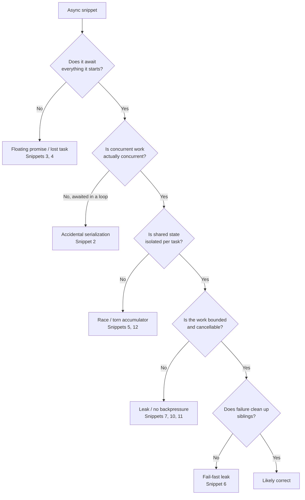

# Async & Functional — Find the Bug

> Twelve snippets, each hiding one concurrency or async defect. The bug compiles, passes a casual read, and usually passes the happy-path test too — that is exactly why it ships. Find it before you open the answer. The fix is rarely "add a keyword"; it is usually a structural change to how the work is awaited, bounded, or isolated.

---

## Table of Contents

1. [Snippet 1 — `forEach` with an async callback (JS)](#snippet-1--foreach-with-an-async-callback-js)
2. [Snippet 2 — `await` inside a loop, accidentally sequential (TS)](#snippet-2--await-inside-a-loop-accidentally-sequential-ts)
3. [Snippet 3 — The floating promise (TS)](#snippet-3--the-floating-promise-ts)
4. [Snippet 4 — `asyncio` task created but never awaited (Python)](#snippet-4--asyncio-task-created-but-never-awaited-python)
5. [Snippet 5 — Shared mutable accumulator across concurrent tasks (Go)](#snippet-5--shared-mutable-accumulator-across-concurrent-tasks-go)
6. [Snippet 6 — `Promise.all` fails fast and leaks in-flight work (JS)](#snippet-6--promiseall-fails-fast-and-leaks-in-flight-work-js)
7. [Snippet 7 — No timeout, slow task leaks forever (Python)](#snippet-7--no-timeout-slow-task-leaks-forever-python)
8. [Snippet 8 — Blocking the event loop with sync I/O (JS)](#snippet-8--blocking-the-event-loop-with-sync-io-js)
9. [Snippet 9 — Mixing a callback API with `async` without promisifying (JS)](#snippet-9--mixing-a-callback-api-with-async-without-promisifying-js)
10. [Snippet 10 — `context` ignored, goroutine outlives its caller (Go)](#snippet-10--context-ignored-goroutine-outlives-its-caller-go)
11. [Snippet 11 — Unbounded fan-out, no backpressure (TS)](#snippet-11--unbounded-fan-out-no-backpressure-ts)
12. [Snippet 12 — Shared mutable default + a "pure" function that isn't (Python)](#snippet-12--shared-mutable-default--a-pure-function-that-isnt-python)
13. [Scorecard](#scorecard)
14. [Related Topics](#related-topics)

---

## How to Use

Read each snippet and answer three questions before expanding the collapsible answer:

1. **What is the observable failure?** A wrong value, a crash, a leak, or "works on my machine, dies under load."
2. **Why is it intermittent or invisible?** Async bugs hide because the happy path schedules things in the order you imagined. Production reorders them.
3. **What is the structural fix?** Not the smallest patch that makes one test green — the change that makes the bug *impossible* to reintroduce.

The defects are grouped roughly from "wrong result" to "leaks and resource exhaustion." Difficulty is marked per snippet. If you find a *second* bug not in the answer, you are reading well — note it.



---

### Snippet 1 — `forEach` with an async callback (JS)

**Difficulty:** Warm-up

```js
async function deleteStaleSessions(sessionIds, store) {
  console.log(`Deleting ${sessionIds.length} sessions...`);

  sessionIds.forEach(async (id) => {
    await store.delete(id);
  });

  console.log("All sessions deleted.");
  return { deleted: sessionIds.length };
}

// Caller
const result = await deleteStaleSessions(ids, redisStore);
console.log("Result returned:", result.deleted);
```

**What's wrong?**

<details><summary>Answer</summary>

`Array.prototype.forEach` ignores the return value of its callback. The callback is `async`, so each invocation returns a promise — and `forEach` throws every one of them on the floor. The loop body *starts* all the deletes, then `forEach` returns synchronously. `"All sessions deleted."` prints and the function resolves **before a single `store.delete` has finished**.

**Why it hides:** the happy path "looks" awaited because there is an `await` right there in the callback. But that `await` only suspends the *anonymous callback*, not `deleteStaleSessions`. Locally, with a fast in-memory store, the deletes often complete in the same tick before anyone checks, so tests pass. In production against a remote Redis, the function reports success while deletes are still in flight; if the process exits or a transaction commits right after, deletes are silently lost. Any rejection inside the callback becomes an **unhandled promise rejection** with no stack tied to the caller.

**The fix** — use a real loop or `Promise.all` with `map`, and decide whether you want concurrency:

```js
async function deleteStaleSessions(sessionIds, store) {
  // Concurrent: all deletes in flight, wait for all.
  await Promise.all(sessionIds.map((id) => store.delete(id)));

  // OR sequential, if the store can't take the load:
  // for (const id of sessionIds) await store.delete(id);

  return { deleted: sessionIds.length };
}
```

`map` returns the promises; `Promise.all` actually waits. A failed delete now rejects the function instead of vanishing.
</details>

---

### Snippet 2 — `await` inside a loop, accidentally sequential (TS)

**Difficulty:** Easy

```ts
async function loadDashboard(userId: string): Promise<Dashboard> {
  const sources = ["profile", "billing", "usage", "notifications", "feed"];
  const data: Record<string, unknown> = {};

  for (const source of sources) {
    data[source] = await fetchSection(userId, source); // each ~120ms
  }

  return assembleDashboard(data);
}
```

**What's wrong?**

<details><summary>Answer</summary>

This is correct *behaviorally* — and that is the trap. There is no wrong value, no crash, no leak. It is a **performance bug**: five independent network calls run strictly one after another. The dashboard takes `5 × 120ms ≈ 600ms` when it could take `~120ms`. Each `await` suspends the loop until that section returns before the next request is even issued.

**Why it hides:** it passes every correctness test. It only shows up as a latency regression, and only once the section count or per-call latency grows. Sequential `await` in a loop is the single most common async performance defect in code review.

**When sequential is correct:** if each iteration *depends* on the previous result (pagination cursors, write-then-read), keep the loop. Here the sections are independent, so issue them concurrently:

```ts
async function loadDashboard(userId: string): Promise<Dashboard> {
  const sources = ["profile", "billing", "usage", "notifications", "feed"] as const;

  const entries = await Promise.all(
    sources.map(async (source) => [source, await fetchSection(userId, source)] as const),
  );

  return assembleDashboard(Object.fromEntries(entries));
}
```

Now total latency is the *slowest* call, not the *sum*. If `fetchSection` can fail and you want partial results, reach for `Promise.allSettled` instead and handle each outcome — see Snippet 6 for why `Promise.all` alone is risky here.
</details>

---

### Snippet 3 — The floating promise (TS)

**Difficulty:** Easy

```ts
class OrderService {
  async placeOrder(order: Order): Promise<OrderId> {
    const id = await this.repo.save(order);

    // Fire off the confirmation email — we don't want to block on it.
    this.emailer.sendConfirmation(order.customerEmail, id);

    this.metrics.increment("orders.placed");
    return id;
  }
}
```

**What's wrong?**

<details><summary>Answer</summary>

`this.emailer.sendConfirmation(...)` is an `async` call whose returned promise is never awaited and never `.catch`-ed — a **floating promise**. The intent ("don't block on the email") is reasonable, but the execution is wrong: if `sendConfirmation` rejects (SMTP timeout, bad address), the rejection has no handler.

**Why it hides:** the email succeeds in dev and staging. In production, when the mail provider has a bad minute, the rejection surfaces as an `unhandledRejection` event far from `placeOrder`, with a stack trace that points at the email library, not the order flow. On Node it may **terminate the process** (the default since Node 15). The order *did* save, so you get the worst outcome: data committed, process crashed mid-request, and no log line connecting the two.

**The fix** — decide explicitly: fire-and-forget *with* a handler, or background it properly.

```ts
async placeOrder(order: Order): Promise<OrderId> {
  const id = await this.repo.save(order);

  // Fire-and-forget, but never let the rejection float.
  void this.emailer
    .sendConfirmation(order.customerEmail, id)
    .catch((err) => this.logger.error("confirmation email failed", { id, err }));

  this.metrics.increment("orders.placed");
  return id;
}
```

For anything that must not be lost (it usually must not), don't fire-and-forget at all — enqueue a durable job and let a worker retry. The `void` operator plus a `.catch` documents "intentionally not awaited" so linters (`@typescript-eslint/no-floating-promises`) stop flagging it *and* the rejection is handled. Enable that lint rule; it catches this entire class mechanically.
</details>

---

### Snippet 4 — `asyncio` task created but never awaited (Python)

**Difficulty:** Medium

```python
import asyncio

async def warm_caches(keys, cache, db):
    for key in keys:
        asyncio.create_task(_warm_one(key, cache, db))
    # All warming tasks scheduled — return immediately.

async def _warm_one(key, cache, db):
    value = await db.fetch(key)
    await cache.set(key, value)

async def handle_startup():
    await warm_caches(important_keys, cache, db)
    print("Caches warmed, accepting traffic.")
```

**What's wrong?**

<details><summary>Answer</summary>

Two distinct bugs, both classic:

1. **Lost results / premature return.** `create_task` schedules the coroutine but does not wait for it. `warm_caches` returns as soon as the tasks are *created*, so `"Caches warmed"` prints before any cache is actually populated. The server starts accepting traffic against cold caches.

2. **Tasks can be garbage-collected mid-flight.** `asyncio` keeps only a *weak* reference to a task through its loop. If nothing holds a strong reference, the task may be collected before it finishes — and you get the famous `Task was destroyed but it is pending!` warning, or the work simply never completes. Because nothing awaits these tasks, a `db.fetch` exception is never retrieved, producing a `Task exception was never retrieved` warning at GC time and nowhere near the real cause.

**Why it hides:** locally, the loop usually drains the tasks before the process does anything else, so caches *appear* warm. Under real startup contention or a slow DB, the race surfaces.

**The fix** — keep references *and* await them (or gather):

```python
async def warm_caches(keys, cache, db):
    tasks = [asyncio.create_task(_warm_one(key, cache, db)) for key in keys]
    results = await asyncio.gather(*tasks, return_exceptions=True)
    for key, res in zip(keys, results):
        if isinstance(res, Exception):
            logging.warning("cache warm failed for %s: %s", key, res)
```

On Python 3.11+, a `TaskGroup` is the structured-concurrency answer — it guarantees every child is awaited and cancels siblings on failure:

```python
async def warm_caches(keys, cache, db):
    async with asyncio.TaskGroup() as tg:
        for key in keys:
            tg.create_task(_warm_one(key, cache, db))
    # Block exits only when every task is done.
```

If you genuinely want background tasks that outlive this call, store them in a long-lived set so they aren't GC'd, and attach a done-callback that logs exceptions.
</details>

---

### Snippet 5 — Shared mutable accumulator across concurrent tasks (Go)

**Difficulty:** Medium

```go
func TotalSizes(ctx context.Context, urls []string) (int64, error) {
    var total int64
    var wg sync.WaitGroup

    for _, u := range urls {
        wg.Add(1)
        go func(u string) {
            defer wg.Done()
            n, err := fetchSize(ctx, u)
            if err != nil {
                return
            }
            total += n // accumulate
        }(u)
    }

    wg.Wait()
    return total, nil
}
```

**What's wrong?**

<details><summary>Answer</summary>

`total += n` runs concurrently from many goroutines with no synchronization. `+=` is read-modify-write, not atomic: two goroutines read the same `total`, each adds its own `n`, and one write clobbers the other. The returned sum is **non-deterministically too low**. This is a textbook data race — `go test -race` flags it instantly, but the code "works" (returns a plausible number) without the detector, which is why it survives review.

A second, quieter bug: errors are swallowed (`if err != nil { return }`), so a failed fetch silently contributes nothing and the caller never learns the total is incomplete.

**Why it hides:** with two or three URLs the goroutines rarely interleave on the same word, so the answer is often correct in tests. At scale, on a multi-core machine, the lost updates appear. It is the canonical "passes locally, wrong in prod" race.

**The fix** — give each goroutine its own result and combine without shared mutation. `errgroup` handles the wait, the error propagation, and cancellation:

```go
func TotalSizes(ctx context.Context, urls []string) (int64, error) {
    g, ctx := errgroup.WithContext(ctx)
    sizes := make([]int64, len(urls))

    for i, u := range urls {
        i, u := i, u // capture (pre-Go 1.22)
        g.Go(func() error {
            n, err := fetchSize(ctx, u)
            if err != nil {
                return fmt.Errorf("fetch %s: %w", u, err)
            }
            sizes[i] = n // each goroutine owns its own index — no race
            return nil
        })
    }
    if err := g.Wait(); err != nil {
        return 0, err
    }

    var total int64
    for _, n := range sizes {
        total += n
    }
    return total, nil
}
```

Each goroutine writes a *disjoint* slice element (safe without a lock); the final summation is single-threaded. If you must share one counter, use `atomic.AddInt64(&total, n)` — but isolating per-task state scales better and reads cleaner. And the first fetch error now aborts the rest via the derived `ctx` instead of being discarded.
</details>

---

### Snippet 6 — `Promise.all` fails fast and leaks in-flight work (JS)

**Difficulty:** Medium

```js
async function provisionTenant(tenantId) {
  await Promise.all([
    createDatabase(tenantId),    // ~2s, allocates a real DB
    createBucket(tenantId),      // ~500ms, allocates S3 bucket
    createSearchIndex(tenantId), // ~300ms, fails fast if quota exceeded
  ]);

  return { tenantId, status: "ready" };
}
```

**What's wrong?**

<details><summary>Answer</summary>

`Promise.all` rejects the moment *any* input rejects — but it does **not cancel the others**. JavaScript promises are not cancellable; the remaining operations keep running to completion. So if `createSearchIndex` rejects fast (quota error at ~300ms), `provisionTenant` throws — yet `createDatabase` and `createBucket` are still in flight and will *succeed* a couple of seconds later. You now have an orphaned database and bucket for a tenant whose provisioning "failed." Retry the request and you leak a second set. This is a resource leak driven by fail-fast semantics over operations that have side effects.

**Why it hides:** in tests, mocks resolve instantly and in order, so the failing case never leaves siblings half-done. The leak only manifests with real services that have real allocation latency, and it shows up as mysterious orphaned infrastructure and cloud-bill creep — rarely traced back to this function.

**The fix** — wait for everything to *settle*, then reconcile/clean up. Don't strand side-effecting work behind a fail-fast gate:

```js
async function provisionTenant(tenantId) {
  const steps = {
    db: createDatabase(tenantId),
    bucket: createBucket(tenantId),
    index: createSearchIndex(tenantId),
  };

  const results = await Promise.allSettled(Object.values(steps));

  if (results.some((r) => r.status === "rejected")) {
    // Everything has finished; tear down whatever succeeded.
    await rollbackTenant(tenantId); // idempotent: deletes db/bucket/index if present
    const reasons = results.filter((r) => r.status === "rejected").map((r) => r.reason);
    throw new AggregateError(reasons, `provisioning failed for ${tenantId}`);
  }

  return { tenantId, status: "ready" };
}
```

`Promise.allSettled` guarantees no operation is left dangling when you decide to roll back, and `rollbackTenant` must be **idempotent** so partial-success cleanup is safe. The general rule: `Promise.all` is fine for read-only work; for side-effecting work, settle-then-reconcile.
</details>

---

### Snippet 7 — No timeout, slow task leaks forever (Python)

**Difficulty:** Medium

```python
async def get_quote(symbol, providers):
    """Return the first provider that responds."""
    for provider in providers:
        try:
            return await provider.fetch(symbol)
        except ProviderError:
            continue
    raise NoQuoteError(symbol)
```

**What's wrong?**

<details><summary>Answer</summary>

There is no timeout. `await provider.fetch(symbol)` will wait **indefinitely** for a provider that has gone silent — a half-open TCP connection, a hung upstream, a load balancer black-holing the request. The coroutine never raises `ProviderError` (it just never returns), so the `for` loop never advances to the next provider, and the caller hangs forever holding whatever it holds (a request slot, a connection, a lock). Under load this exhausts the connection pool and cascades.

A secondary design bug: this is described as "first provider that responds" but it queries them strictly **sequentially**, so a slow-but-eventually-working first provider delays every fallback (compare Snippet 2).

**Why it hides:** every provider responds promptly in tests and almost always in prod. The leak appears only during a partial upstream outage — precisely when you most need the fallback to work — and presents as a slow, mysterious resource exhaustion rather than an error.

**The fix** — bound every awaited external call with a timeout, and treat a timeout as a failed provider:

```python
async def get_quote(symbol, providers, per_provider_timeout=2.0):
    last_error = None
    for provider in providers:
        try:
            async with asyncio.timeout(per_provider_timeout):  # 3.11+
                return await provider.fetch(symbol)
        except (ProviderError, TimeoutError) as e:
            last_error = e
            continue
    raise NoQuoteError(symbol) from last_error
```

`asyncio.timeout` cancels the pending `fetch` (which must handle `CancelledError` to release its socket) and lets the loop move on. To actually race providers concurrently and return the first success, use `asyncio.wait(..., return_when=FIRST_COMPLETED)` and cancel the losers — but the non-negotiable baseline is: **no unbounded `await` on anything that crosses the network.**
</details>

---

### Snippet 8 — Blocking the event loop with sync I/O (JS)

**Difficulty:** Medium

```js
import fs from "node:fs";

app.get("/report/:id", async (req, res) => {
  const template = fs.readFileSync(`./templates/${req.params.id}.html`, "utf8");
  const rows = await db.query("SELECT * FROM events WHERE report_id = $1", [req.params.id]);

  const hash = crypto.pbkdf2Sync(template, "salt", 600000, 64, "sha512"); // integrity check
  res.send(render(template, rows, hash));
});
```

**What's wrong?**

<details><summary>Answer</summary>

Two synchronous calls block Node's single event-loop thread inside a request handler:

1. `fs.readFileSync` — synchronous disk I/O. While it blocks, **no other request on this process can make progress**, including ones that have nothing to do with reports.
2. `crypto.pbkdf2Sync` with 600,000 iterations — a deliberately expensive CPU-bound computation, run synchronously. This can pin the event loop for tens to hundreds of milliseconds *per request*.

The `async` keyword and the `await` on `db.query` make the handler *look* asynchronous, but the two `...Sync` calls are stop-the-world. Throughput collapses under concurrency: requests queue behind each other because the loop can't interleave them.

**Why it hides:** with one user and one request at a time (dev, most tests), latency looks fine — the work has to happen regardless. The defect is invisible until *concurrent* load arrives, where it manifests as p99 latency exploding and the health check timing out, even though CPU and the database look idle.

**The fix** — use async I/O for I/O, and move CPU-bound work off the loop:

```js
import { readFile } from "node:fs/promises";
import { pbkdf2 } from "node:crypto";
import { promisify } from "node:util";

const pbkdf2Async = promisify(pbkdf2); // runs on libuv's threadpool, not the event loop

app.get("/report/:id", async (req, res, next) => {
  try {
    const [template, rows] = await Promise.all([
      readFile(`./templates/${req.params.id}.html`, "utf8"),
      db.query("SELECT * FROM events WHERE report_id = $1", [req.params.id]),
    ]);
    const hash = await pbkdf2Async(template, "salt", 600000, 64, "sha512");
    res.send(render(template, rows, hash));
  } catch (err) {
    next(err);
  }
});
```

`fs/promises` keeps disk I/O off the loop; `promisify(pbkdf2)` runs the KDF on libuv's threadpool. For heavier or unbounded CPU work (image processing, large parsing), a `worker_threads` pool is the right tool — the event loop must never do meaningful CPU work. Async functions don't make blocking calls non-blocking; you have to choose async APIs.
</details>

---

### Snippet 9 — Mixing a callback API with `async` without promisifying (JS)

**Difficulty:** Medium

```js
import { S3 } from "./legacy-s3-client.js"; // callback-style: getObject(key, cb)

async function loadConfig(key) {
  let result;

  s3.getObject(key, (err, data) => {
    if (err) throw err;
    result = JSON.parse(data.Body.toString());
  });

  return result;
}
```

**What's wrong?**

<details><summary>Answer</summary>

The callback runs *later*, asynchronously, after `getObject` returns. But `loadConfig` reads `result` and `return`s **immediately**, in the same tick, before the callback ever fires. So `loadConfig` always resolves to `undefined`. The `async` keyword does not magically make a callback API awaitable — the function returns a promise that resolves to whatever `return result` evaluates to *now*, which is `undefined`.

Worse, the `throw err` inside the callback does **not** reject `loadConfig`'s promise. It is thrown from a later tick on the callback's own stack — there's no `try/catch` that can catch it and no promise to reject. On Node it becomes an uncaught exception that **crashes the process**. So the two failure modes are: silent `undefined`, or a process crash with a stack that doesn't mention `loadConfig`.

**Why it hides:** if a caller does `const c = await loadConfig(key)` and the config happens to have only optional fields, `undefined` may not blow up until something downstream dereferences it — far from the cause. The crash path only triggers on an S3 error.

**The fix** — promisify the callback API and `await` it:

```js
import { promisify } from "node:util";

async function loadConfig(key) {
  const getObject = promisify(s3.getObject).bind(s3);
  const data = await getObject(key); // resolves with data, rejects with err
  return JSON.parse(data.Body.toString());
}
```

`promisify` converts the `(err, data) => ...` convention into a promise: the error path now *rejects* (so `try/catch` or the caller's `.catch` handles it) and the success path resolves with the value `loadConfig` actually returns. Never bridge a callback into `async` by mutating an outer variable from inside the callback. Wrap it once at the boundary (`promisify`, or `new Promise((resolve, reject) => ...)`), then stay in promise-land.
</details>

---

### Snippet 10 — `context` ignored, goroutine outlives its caller (Go)

**Difficulty:** Hard

```go
func StreamUpdates(ctx context.Context, w http.ResponseWriter, sub *Subscription) {
    updates := make(chan Update)

    go func() {
        for u := range sub.Source() { // blocks on upstream feed
            updates <- u
        }
    }()

    for u := range updates {
        fmt.Fprintf(w, "data: %s\n\n", u.JSON())
        w.(http.Flusher).Flush()
    }
}
```

**What's wrong?**

<details><summary>Answer</summary>

The `ctx` parameter is accepted and then never consulted. When the client disconnects, `ctx` is cancelled — but nothing here observes it. The consumer `for u := range updates` loop has no way to stop: `updates` is never closed, so it ranges forever. And the producer goroutine blocks on `updates <- u` once the consumer stops reading (or blocks on `sub.Source()` waiting for upstream). The result is a **goroutine leak**: every disconnected client leaves a goroutine and a subscription pinned for the lifetime of the process. Thousands of brief connections later, the process is out of memory and holding thousands of upstream subscriptions.

**Why it hides:** a single client that stays connected and then triggers a clean shutdown path never exposes it. The leak is proportional to *churn* — short-lived connections, reconnects, flaky networks — which load tests with long-lived connections don't reproduce.

**The fix** — make every loop select on `ctx.Done()`, and ensure the producer can exit:

```go
func StreamUpdates(ctx context.Context, w http.ResponseWriter, sub *Subscription) {
    flusher := w.(http.Flusher)
    src := sub.Source() // assume cancellable / closeable on ctx

    for {
        select {
        case <-ctx.Done(): // client gone or request cancelled
            return
        case u, ok := <-src:
            if !ok {
                return // upstream closed
            }
            fmt.Fprintf(w, "data: %s\n\n", u.JSON())
            flusher.Flush()
        }
    }
}
```

The `select` lets the loop wake on either a new update *or* cancellation, so a disconnect unwinds the goroutine immediately. The contract is: a function that takes a `context.Context` must *respect* it on every blocking operation. Accepting `ctx` and ignoring it is worse than not taking it — it advertises cancellation support that doesn't exist. `sub.Source()` should itself accept `ctx` so the upstream read also unblocks on cancellation.
</details>

---

### Snippet 11 — Unbounded fan-out, no backpressure (TS)

**Difficulty:** Hard

```ts
async function migrateAllUsers(userIds: string[]): Promise<void> {
  await Promise.all(
    userIds.map((id) => migrateUser(id)), // each opens a DB txn + calls 2 APIs
  );
}

// Called with userIds.length === 4_000_000
```

**What's wrong?**

<details><summary>Answer</summary>

`map` over four million IDs builds four million promises, and `Promise.all` starts **all of them at once**. There is no concurrency limit and no backpressure. Each `migrateUser` opens a database transaction and makes two API calls, so this attempts four million concurrent transactions and twelve million concurrent HTTP requests. What actually happens: the DB connection pool is exhausted in milliseconds, the downstream APIs return `429`s or time out, the Node process balloons in memory holding millions of pending promises and their closures, and the whole migration fails — having half-migrated an unknown subset.

**Why it hides:** with a test fixture of 10 or 100 users, `Promise.all` is exactly the right, idiomatic tool and runs beautifully. The code is correct *and* fast for small inputs. The bug is purely one of *scale* and *resource bounds* — the same line that is best-practice at N=100 is catastrophic at N=4,000,000.

**The fix** — bound concurrency. Process in a fixed-size pool so at most *k* migrations are in flight:

```ts
import pLimit from "p-limit";

async function migrateAllUsers(userIds: string[]): Promise<MigrationReport> {
  const limit = pLimit(20); // tune to pool size / downstream rate limits
  const report: MigrationReport = { ok: 0, failed: [] };

  await Promise.all(
    userIds.map((id) =>
      limit(async () => {
        try {
          await migrateUser(id);
          report.ok++;
        } catch (err) {
          report.failed.push({ id, err }); // don't let one failure abort the rest
        }
      }),
    ),
  );

  return report;
}
```

`pLimit(20)` caps in-flight work at 20 regardless of input size, applying backpressure to the rest. Catching per-item failures stops one bad user from aborting the entire batch (the fail-fast problem from Snippet 6). For datasets this large you would also *stream* the IDs (async iterator / cursor) rather than holding four million strings and promises in memory, and persist progress so the migration is resumable. The rule: **concurrency must be bounded by the capacity of the slowest downstream resource, never by the size of the input.**
</details>

---

### Snippet 12 — Shared mutable default + a "pure" function that isn't (Python)

**Difficulty:** Hard

```python
async def fetch_batch(ids, cache={}):
    """Fetch ids, memoizing into `cache`. Returns {id: value}."""
    missing = [i for i in ids if i not in cache]

    results = await asyncio.gather(*(remote_fetch(i) for i in missing))
    for i, v in zip(missing, results):
        cache[i] = v

    return {i: cache[i] for i in ids}
```

**What's wrong?**

<details><summary>Answer</summary>

Two functional-purity defects compounding an async one:

1. **Mutable default argument.** `cache={}` is evaluated *once*, at function-definition time, and the same dict is reused across every call that omits `cache`. So the "memo" silently becomes a **process-global, ever-growing cache** that no caller asked for. It leaks memory unbounded and — worse for correctness — serves stale values forever, because entries are never invalidated. Two unrelated callers share each other's data.

2. **Concurrent mutation of that shared dict.** Because the default `cache` is shared and `fetch_batch` is `async`, two overlapping calls both compute `missing` against the *same* dict, both `await` (yielding control), then both write back. They can issue duplicate `remote_fetch`es for the same id and interleave writes. The function presents as a pure "give ids, get values" helper but carries hidden, racy global state.

**Why it hides:** the first call in a fresh process behaves perfectly, and single-call unit tests always start with the default dict effectively empty (within that test's process), so the persistence across calls never shows up. It surfaces as "why is this returning yesterday's value?" and steadily climbing memory — days into running.

**The fix** — never use a mutable default; make the cache an explicit, owned dependency and guard concurrent fills:

```python
class BatchFetcher:
    def __init__(self):
        self._cache: dict[str, Value] = {}
        self._lock = asyncio.Lock()

    async def fetch_batch(self, ids):
        async with self._lock:  # serialize the read-fetch-write critical section
            missing = [i for i in self._cache.keys() ^ set(ids) if i not in self._cache]
            if missing:
                results = await asyncio.gather(*(remote_fetch(i) for i in missing))
                self._cache.update(zip(missing, results))
            return {i: self._cache[i] for i in ids}
```

The cache now has an explicit owner and lifetime (you can scope it per-request, per-tenant, or add TTL eviction), and the lock makes the check-then-fill atomic so concurrent batches don't double-fetch. The universal Python rule stands regardless of async: **default arguments must be immutable** (`None` sentinel, then construct inside). A function that mutates hidden state is not the pure helper its signature pretends to be.
</details>

---

## Scorecard

Count the bugs you identified *before* expanding each answer. Partial credit if you spotted the symptom but not the structural fix.

| Snippets correct | Level | What it means |
| --- | --- | --- |
| 0–3 | Apprentice | You read async code as if it executes top-to-bottom. The next step is internalizing that `async`/`await` schedules work — it does not serialize it — and that starting work is not the same as awaiting it. |
| 4–7 | Practitioner | You catch the obvious floats and missing awaits. The gaps are the *scale* and *cancellation* bugs (6, 7, 10, 11) — the ones that pass every test and only fail in production. |
| 8–10 | Senior | You see leaks and races, not just wrong values. You instinctively ask "what bounds this?" and "who cancels this?" Tighten up on the purity/state-isolation defects (5, 12). |
| 11–12 | Staff | You treat every awaited external call as something that can hang, every concurrent write as a race until proven isolated, and every `Promise.all`/`gather` over side effects as a leak risk. You'd have caught these in review. |

The pattern across all twelve: **async correctness is mostly about what you await, what you bound, what you cancel, and what state you share** — not about sprinkling keywords. A function that *starts* work without *awaiting*, *bounding*, *cancelling*, and *isolating* it is broken even when the happy path is green.

---

## Related Topics

- [junior.md](junior.md) — the junior-level definitions of these async and functional concepts.
- [tasks.md](tasks.md) — hands-on exercises that build the habits these bugs violate.
- [Chapter README](../README.md) — the positive rules for Async & Functional code.
- [Anti-Patterns](../../anti-patterns/README.md) — the failure modes (callback hell, unbounded queues, coloured-function violations) that produce bugs like these.
- [Refactoring](../../refactoring/README.md) — the mechanical techniques for safely restructuring async code once you've found the defect.
