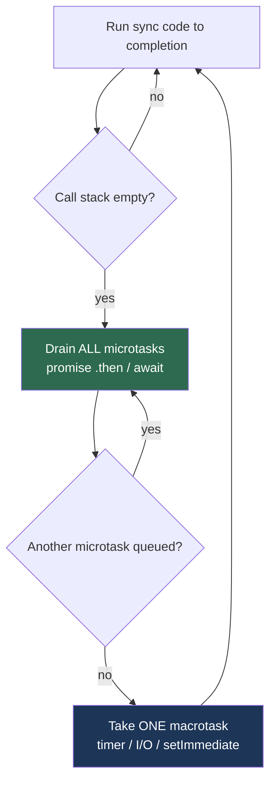

# Async & Functional — Interview Questions

> 50+ questions across all skill levels (Junior → Staff). Each harder answer notes *what the interviewer is really checking*. Use as self-review or interview prep. Focus: promises/async-await mechanics, the event loop, concurrency vs parallelism, cancellation, back-pressure, and function coloring across JS, Python, Go, and Java.

---

## Table of Contents

- [Junior level (14 questions)](#junior-level-14-questions)
- [Mid level (14 questions)](#mid-level-14-questions)
- [Senior level (12 questions)](#senior-level-12-questions)
- [Staff level (10 questions)](#staff-level-10-questions)
- [Trick Questions](#trick-questions)
- [Rapid-Fire](#rapid-fire)
- [Summary](#summary)
- [Further Reading](#further-reading)
- [Related Topics](#related-topics)

---

## Junior level (14 questions)

### J1. What is a Promise / Future?

<details><summary>Answer</summary>

An object representing the eventual result of an asynchronous operation. It exists in one of three states: **pending**, **fulfilled** (resolved with a value), or **rejected** (failed with a reason). Once settled, the state is immutable. The same idea appears as `Future`/`CompletableFuture` (Java), `Future`/`Task` (Python via `asyncio`), and channels-plus-goroutines (Go, no first-class future).
</details>

### J2. What does `async`/`await` actually do?

<details><summary>Answer</summary>

`async` marks a function as returning a promise/coroutine. `await` suspends the function until the awaited promise settles, then resumes with its value — *without blocking the underlying thread*. It is syntactic sugar over promise chaining (`.then`) or coroutine scheduling. The function's progress is paused; the runtime is free to run other work meanwhile.
</details>

### J3. Concurrency vs parallelism — what's the difference?

<details><summary>Answer</summary>

**Concurrency** is *dealing with* many things at once — interleaving tasks so progress is made on several without finishing one first. **Parallelism** is *doing* many things at once — literally executing on multiple cores simultaneously. Concurrency is a structure; parallelism is an execution mode. You can have concurrency on a single core (async I/O), and parallelism without much concurrency (a tight `parallel-for`).
</details>

### J4. Does `async` mean multithreaded?

<details><summary>Answer</summary>

No. In JavaScript (Node, browser) async runs on a **single thread** via the event loop. Python's `asyncio` is also single-threaded. Async overlaps *waiting* (I/O), not *computation*. Parallelism needs threads/processes/cores; async by itself does not give you any.
</details>

### J5. What's a callback, and what is "callback hell"?

<details><summary>Answer</summary>

A callback is a function passed to be invoked when an async operation completes. **Callback hell** is deeply nested callbacks — each step nested inside the previous one's callback — producing a rightward-drifting pyramid that is hard to read, error-handle, and refactor. Promises and `async`/`await` flatten this into linear code.
</details>

### J6. How do you handle errors with `async`/`await`?

<details><summary>Answer</summary>

Wrap the `await` in `try`/`catch`. A rejected promise that is awaited throws inside the `async` function, so it behaves like a synchronous exception. With raw promises you use `.catch()`. The trap: forgetting either one produces an **unhandled rejection**.
</details>

### J7. What is `Promise.all`?

<details><summary>Answer</summary>

Runs an array of promises concurrently and resolves to an array of their results once **all** succeed. If **any** rejects, `Promise.all` rejects immediately with that reason — the others keep running but their results are discarded. Use it to fan out independent work and gather results.
</details>

### J8. What is the event loop?

<details><summary>Answer</summary>

The runtime mechanism that lets single-threaded environments handle async work. It repeatedly: runs the current synchronous code to completion, drains queued callbacks (timers, I/O completions, resolved promises), and repeats. When the call stack is empty, the loop picks the next task from a queue. Nothing runs *while* synchronous code is on the stack.
</details>

### J9. What does "blocking the event loop" mean?

<details><summary>Answer</summary>

Running CPU-heavy or synchronous work (a long loop, `JSON.parse` of a huge string, sync file read) on the event-loop thread. While it runs, no other callback, timer, or request can be processed — the whole server stalls. Symptom: latency spikes and unresponsiveness under load.
</details>

### J10. What's the fix for CPU-bound work blocking the loop?

<details><summary>Answer</summary>

Move it off the loop thread: Worker Threads / `worker_threads` (Node), `ProcessPoolExecutor` or `run_in_executor` (Python), goroutines on the scheduler (Go handles this natively), or a separate service/queue. Alternatively, chunk the work and yield between chunks. Async does **not** solve CPU-bound problems — it only helps with I/O-bound waiting.
</details>

### J11. What is a "fire-and-forget" task and why is it risky?

<details><summary>Answer</summary>

Starting an async operation without awaiting or storing its result. Risk: if it rejects, you get an unhandled rejection; if the process exits, the work may be lost; and you have no way to know it failed. Always retain the handle (`await` later, store the `Task`, or attach `.catch`).
</details>

### J12. What is a pure function?

<details><summary>Answer</summary>

A function whose output depends only on its inputs and which has no observable side effects (no mutation of external state, no I/O, no randomness). Same input → same output, always. Pure functions are trivial to test, cache, and reason about, and are safe to run concurrently.
</details>

### J13. What is immutability and why does it help concurrency?

<details><summary>Answer</summary>

Immutable data cannot change after creation; "modifying" returns a new copy. It helps concurrency because shared immutable data needs **no locks** — there are no writes to race on. Most data races disappear when state is immutable.
</details>

### J14. What's the difference between `map`/`filter`/`reduce` and a `for` loop?

<details><summary>Answer</summary>

They are declarative: they say *what* transformation to apply, not *how* to iterate. `map` transforms each element, `filter` keeps elements matching a predicate, `reduce` folds a collection into one value. They favor immutability (produce new collections) and compose well. A `for` loop is imperative and mutation-prone but can be faster in hot paths.
</details>

---

## Mid level (14 questions)

### M1. `Promise.all` vs `Promise.allSettled` vs `Promise.race` vs `Promise.any`?

<details><summary>Answer</summary>

| Combinator | Resolves when | Rejects when | Result |
|---|---|---|---|
| `all` | all fulfill | any rejects (fail-fast) | array of values |
| `allSettled` | all settle | never | array of `{status, value/reason}` |
| `race` | first **settles** | first settles with rejection | first settled outcome |
| `any` | first **fulfills** | all reject | first value, else `AggregateError` |

Use `allSettled` when you want every result regardless of individual failures (e.g., a dashboard of independent widgets). Use `all` when one failure makes the whole batch meaningless.
</details>

### M2. Microtasks vs macrotasks — what's the queue order?

<details><summary>Answer</summary>

After each macrotask (timer, I/O callback, `setTimeout`), the loop **drains the entire microtask queue** before the next macrotask. Promise `.then`/`await` continuations are microtasks; `setTimeout`/`setInterval`/I/O are macrotasks; `queueMicrotask` and `process.nextTick` (highest priority in Node) enqueue microtasks. So a resolved promise's callback runs *before* a `setTimeout(0)` scheduled earlier.

*Interviewer is checking:* whether you understand starvation — an endless microtask chain can block all macrotasks (timers, I/O) forever.
</details>

### M3. Predict the output:

```js
console.log('A');
setTimeout(() => console.log('B'), 0);
Promise.resolve().then(() => console.log('C'));
console.log('D');
```

<details><summary>Answer</summary>

`A D C B`. Synchronous lines first (`A`, `D`). Then the microtask queue drains (`C`). Then the macrotask (`B`). The promise callback beats the zero-delay timer because microtasks run before the next macrotask.
</details>

### M4. What is an unhandled rejection and how do you guard against it?

<details><summary>Answer</summary>

A rejected promise with no `.catch` / no `try`-`await`. In Node it now **crashes the process** by default (`--unhandled-rejections=throw`); in browsers it fires `unhandledrejection`. Guards: always attach handlers, use `process.on('unhandledRejection')` as a last-resort logger (not a fix), enable lint rules (`no-floating-promises`), and never leave a `await`-less promise dangling.
</details>

### M5. What does the sequential-await-in-a-loop pitfall look like?

<details><summary>Answer</summary>

```js
// SLOW: each request waits for the previous one
for (const url of urls) {
  results.push(await fetch(url));   // serialized!
}
// FAST: fire concurrently, then await together
const results = await Promise.all(urls.map(u => fetch(u)));
```

The first version turns N independent I/O calls into a serial chain — total time is the **sum** of latencies instead of the **max**. Only serialize when each step truly depends on the previous result.

*Interviewer is checking:* can you spot accidental serialization, the single most common async performance bug?
</details>

### M6. What is back-pressure?

<details><summary>Answer</summary>

A flow-control mechanism where a slow consumer signals a fast producer to slow down, preventing unbounded buffering. Without it, an in-memory queue grows until the process runs out of memory. Node streams implement it via `.write()` returning `false` and the `drain` event; reactive libraries (RxJS, Reactor) have explicit back-pressure strategies; Go channels provide it naturally through bounded buffers that block the sender when full.
</details>

### M7. How do you implement a timeout on an async operation?

<details><summary>Answer</summary>

- **JS:** `Promise.race([work(), rejectAfter(ms)])`, or `AbortSignal.timeout(ms)` passed to `fetch`.
- **Python:** `asyncio.wait_for(coro, timeout=ms)` or `async with asyncio.timeout(...)`.
- **Go:** `context.WithTimeout(ctx, d)` and select on `ctx.Done()`.

The key subtlety: a timeout should also **cancel** the underlying work, not just stop waiting for it — otherwise the work leaks.
</details>

### M8. How does cancellation work in JS, Python, and Go?

<details><summary>Answer</summary>

- **JS:** `AbortController` → pass its `signal` to cancellable APIs (`fetch`, etc.); call `controller.abort()`.
- **Python:** `task.cancel()` raises `CancelledError` inside the coroutine at the next suspension point.
- **Go:** `context.Context` — propagate `ctx`, cancel it, and have functions return on `<-ctx.Done()`.

Common thread: cancellation is **cooperative**. The runtime cannot forcibly kill in-progress work; the code must check the signal/context and bail out.
</details>

### M9. What is "function coloring"?

<details><summary>Answer</summary>

The phenomenon (Bob Nystrom's "What Color Is Your Function?") where `async` functions are a different "color" than sync ones: you can only `await` inside an `async` function, so async-ness is *contagious* up the call stack. A sync caller cannot transparently call an async function without becoming async itself. It splits the ecosystem into two incompatible halves and forces duplicate APIs.
</details>

### M10. `asyncio.gather` vs `asyncio.TaskGroup`?

<details><summary>Answer</summary>

`gather` runs awaitables concurrently and returns results in order; with `return_exceptions=False` (default) the first exception propagates but **sibling tasks are not cancelled** unless you handle it. `TaskGroup` (Python 3.11+) implements **structured concurrency**: if any child fails, the others are cancelled, and errors surface as an `ExceptionGroup` when the `async with` block exits. Prefer `TaskGroup` for new code — it guarantees no orphaned tasks.
</details>

### M11. Are goroutines and channels a form of async?

<details><summary>Answer</summary>

Yes — Go's model is concurrency via lightweight goroutines (cheap, M:N scheduled onto OS threads) communicating over channels. There is no `async`/`await` keyword; instead you write straight-line "blocking" code and the runtime scheduler parks a goroutine when it blocks on I/O or a channel, running another. This sidesteps function coloring entirely: every function can block, none are "colored."
</details>

### M12. What are Java virtual threads (Project Loom)?

<details><summary>Answer</summary>

Lightweight threads (JDK 21+) scheduled by the JVM onto a small pool of carrier (OS) threads. A virtual thread that blocks on I/O is *unmounted* from its carrier, freeing it to run others — so you can have millions of them. They let you write simple blocking code that scales like async, removing the need for `CompletableFuture` chains and "uncoloring" Java's concurrency.
</details>

### M13. Why is excessive shared mutable state a problem in concurrent code?

<details><summary>Answer</summary>

Concurrent reads and writes to the same memory without synchronization cause **data races**: torn reads, lost updates, and undefined behavior. Even single-threaded async can interleave at `await` points, exposing half-updated state. Cures: immutability, confining state to one task, message passing (channels/actors), or explicit locks — in roughly that order of preference.
</details>

### M14. What is referential transparency?

<details><summary>Answer</summary>

An expression is referentially transparent if it can be replaced by its value without changing the program's behavior. It follows from purity. It enables memoization, common-subexpression elimination, lazy evaluation, and safe parallelization — because order and repetition of evaluation no longer matter.
</details>

---

## Senior level (12 questions)

### S1. Walk through Node's event loop phases.

<details><summary>Answer</summary>

Each tick proceeds through phases: **timers** (`setTimeout`/`setInterval`), **pending callbacks**, **poll** (retrieve new I/O events; execute I/O callbacks), **check** (`setImmediate`), **close callbacks**. Between *every* phase transition — and after each callback — the **microtask queue** (promises) and `process.nextTick` queue are fully drained, with `nextTick` taking priority over promises.

*Interviewer is checking:* whether you can explain why `setImmediate` vs `setTimeout(0)` ordering is non-deterministic from the main module but deterministic inside an I/O callback.
</details>

### S2. How do you stop a long microtask chain from starving I/O?

<details><summary>Answer</summary>

Microtasks always run to exhaustion before the loop advances, so a self-rescheduling `.then` chain or recursive `queueMicrotask` blocks timers and I/O indefinitely. Break it by yielding to a macrotask: `await new Promise(r => setTimeout(r, 0))` (or `setImmediate`) periodically, so the loop can service pending I/O. Same idea as cooperatively yielding in any single-threaded scheduler.
</details>

### S3. Design back-pressure for a pipeline reading a huge file and writing to a slow DB.

<details><summary>Answer</summary>

Use bounded buffering and honor the consumer's readiness:

- **Node:** `readable.pipe(transform).pipe(writable)` — `pipe` handles back-pressure automatically by pausing the source when `write()` returns `false`. Or use async iterators with `for await`.
- **Go:** a bounded channel between producer and consumer goroutines; the producer blocks when the channel is full.
- **General:** cap concurrency (a semaphore of N in-flight writes), and never read faster than you can write.

The anti-pattern is reading the whole file into an unbounded array of pending write promises — memory blows up.
</details>

### S4. Compare cancellation: `AbortController`, `context.Context`, and `CancelledError`.

<details><summary>Answer</summary>

All three are **cooperative propagation** mechanisms, differing in plumbing:

| | JS `AbortSignal` | Go `context` | Python `asyncio` |
|---|---|---|---|
| Propagation | pass `signal` explicitly | pass `ctx` explicitly (first arg) | implicit via task tree |
| Trigger | `abort()` | `cancel()` / deadline | `task.cancel()` |
| Observed via | `signal.aborted` / `'abort'` event | `<-ctx.Done()` | `CancelledError` raised at await |
| Forced? | no | no | no (still cooperative) |

None can preempt CPU-bound code that never checks. Cancellation only takes effect at suspension/check points.
</details>

### S5. How do you bound concurrency (e.g., "max 10 in-flight requests")?

<details><summary>Answer</summary>

Use a semaphore / worker pool. In JS: a pool that pulls from a queue, keeping at most N promises in flight (e.g., `p-limit`). In Python: `asyncio.Semaphore(10)` acquired around each task. In Go: a buffered channel of size 10 used as a token bucket, or a fixed number of worker goroutines reading from a jobs channel. This caps memory, respects rate limits, and avoids overwhelming downstreams — strictly better than naive `Promise.all` over thousands of items.
</details>

### S6. Why isn't `Promise.all` the right tool for 10,000 tasks?

<details><summary>Answer</summary>

It launches all 10,000 *immediately* and concurrently — exhausting sockets/file descriptors, blowing past downstream rate limits, and ballooning memory with 10,000 pending promises. It also fails fast on the first rejection, wasting the rest. Use bounded concurrency (a pool) plus `allSettled`-style per-task error capture instead.
</details>

### S7. What is structured concurrency and why does it matter?

<details><summary>Answer</summary>

A discipline where the lifetime of concurrent tasks is bound to a lexical scope: tasks spawned in a block must complete (or be cancelled) before the block exits. No task outlives its parent; errors propagate to the parent; cancellation flows down the tree. It eliminates orphaned tasks and leaked goroutines. Implementations: Python `TaskGroup`, Kotlin `coroutineScope`, Java `StructuredTaskScope` (preview), Trio nurseries.

*Interviewer is checking:* do you see it as the answer to "fire-and-forget" leaks and the chaos of unscoped `gather`?
</details>

### S8. How do you avoid race conditions at `await` points in single-threaded async?

<details><summary>Answer</summary>

Even single-threaded, control can switch to another task at every `await`, so an invariant true before the `await` may be false after. Fixes: read all needed state *before* awaiting and don't assume it's unchanged after; use an async mutex/lock around the critical section; or make the shared state immutable so interleaving can't corrupt it. This is the "check-then-act" hazard ported to async.
</details>

### S9. When are goroutines or virtual threads better than explicit async/await?

<details><summary>Answer</summary>

When you want the scalability of async without function coloring. Goroutines (Go) and virtual threads (Java/Loom) let you write straight-line blocking code; the runtime unmounts blocked tasks so a small thread pool serves millions of logical threads. Benefits: simpler stack traces, no `async` contagion, existing blocking libraries work. Trade-off: you lose the explicit, visible suspension points of `await`, and CPU-bound parallelism still needs real cores.
</details>

### S10. How do you make functional pipelines memory-efficient on large data?

<details><summary>Answer</summary>

Eager `map`/`filter` allocate an intermediate collection per step. Use **lazy** sequences/iterators that stream one element through the whole pipeline: generators (JS/Python), Java `Stream`, Go iterators, or transducers (Clojure). This avoids N intermediate arrays and supports infinite/streaming sources, at the cost of slightly more per-element overhead and harder debugging.
</details>

### S11. What is the actor model and how does it relate to async + immutability?

<details><summary>Answer</summary>

Actors are isolated units of state that communicate only by asynchronous messages; each actor processes one message at a time, so its internal state needs no locks. Combined with immutable messages, it removes shared-memory races entirely — concurrency by isolation rather than synchronization. Erlang/Elixir, Akka, and Orleans build on it. It's a structural answer to "shared mutable state is the enemy."
</details>

### S12. Why can't you just `await` your way out of a deadlock?

<details><summary>Answer</summary>

If task A awaits a result only task B can produce, and B awaits something only A can produce, both park forever — a deadlock with no thread blocked at all. Single-threaded async can deadlock just like threads. Causes include awaiting your own queue, an async lock acquired in the wrong order, or synchronously blocking (`.get()`/`run_until_complete`) on a future that needs the current loop to advance. Cure: consistent lock ordering, timeouts, and never block the loop you're running on.
</details>

---

## Staff level (10 questions)

### St1. Your p99 latency spikes under load but CPU is idle. Diagnose.

<details><summary>Answer</summary>

Idle CPU with high latency points to **head-of-line blocking on the event loop** or **exhausted concurrency limits**, not compute. Suspects: a synchronous CPU burst (e.g., large `JSON.stringify`, crypto, regex backtracking) periodically freezing the loop; an unbounded microtask chain starving I/O; or a connection/thread pool capped too low so requests queue. Measure event-loop lag (`perf_hooks.monitorEventLoopDelay`), profile for long ticks, and check pool saturation. Async hides as *queuing delay*, which never shows up as CPU.
</details>

### St2. Design a cancellation-and-timeout strategy across a microservice call chain.

<details><summary>Answer</summary>

Propagate a **deadline**, not a duration, end to end (e.g., `Deadline: <timestamp>` header / `context` with deadline). Each hop computes its remaining budget and shortens its own timeouts so inner calls can't exceed the outer deadline. On timeout, cancel downstream work (abort signal / context cancel) to stop wasting capacity, and return a typed timeout error. Add jittered retries only for idempotent calls, guarded by the same deadline so retries never exceed the budget. The failure modes you're avoiding: retry storms and zombie work continuing after the client gave up.
</details>

### St3. How do you guarantee no orphaned tasks in a large async service?

<details><summary>Answer</summary>

Adopt structured concurrency everywhere: every spawned task belongs to a scope (`TaskGroup`, nursery, `StructuredTaskScope`, an errgroup in Go). Ban bare fire-and-forget via lint (`no-floating-promises`, `errcheck`). On shutdown, cancel the root scope and `await` graceful drain with a hard deadline. Track in-flight tasks with a counter/registry for observability. The invariant: a task cannot outlive the scope that created it.
</details>

### St4. When is "make everything async" the wrong call?

<details><summary>Answer</summary>

Async adds real cost: scheduling overhead, harder debugging (broken stack traces), function-coloring contagion across the whole codebase, and zero benefit for CPU-bound or trivially fast work. For a pure computation or a sub-microsecond in-memory lookup, async is slower and more complex than a direct call. Reserve async for genuinely I/O-bound or long-running operations; keep hot, pure paths synchronous.

*Interviewer is checking:* do you treat async as a tool with a cost, or as a default to apply reflexively?
</details>

### St5. Compare event-loop concurrency vs thread-per-request vs virtual threads at scale.

<details><summary>Answer</summary>

- **Event loop (Node/asyncio):** one thread, cheap context switches, scales to many connections, but one blocking call stalls everything and CPU work needs offloading.
- **Thread-per-request (classic Java/Tomcat):** simple blocking code, but OS threads cost ~1 MB stack each, so a few thousand exhausts memory; context switches are expensive.
- **Virtual threads (Loom) / goroutines:** blocking code that scales to millions; the runtime multiplexes onto few carriers. Best of both for I/O-bound workloads.

The deciding axes: connection count, blocking-library ecosystem, and CPU vs I/O mix.
</details>

### St6. How does function coloring shape large-codebase architecture?

<details><summary>Answer</summary>

Because async is contagious upward, introducing one `async` leaf often forces the entire call chain above it to become `async`, sometimes touching hundreds of functions. This drives "async all the way" architectures, duplicate sync/async API variants, and pressure to pick a single concurrency model project-wide. Languages that avoid coloring (Go goroutines, Java virtual threads) let you mix freely and refactor I/O boundaries without rippling signature changes. Architecturally: push async to the edges (I/O boundary), keep the core pure and sync, and isolate the model behind interfaces.

*Interviewer is checking:* whether you've felt the maintenance tax of coloring on a real codebase, not just read the blog post.
</details>

### St7. How do you test async code deterministically?

<details><summary>Answer</summary>

Control time and scheduling rather than sleeping. Use fake timers/clocks (`jest.useFakeTimers`, an `asyncio` event loop with a virtual clock, Go's injectable `clock`); inject the deadline/timeout as a parameter; await explicit signals instead of arbitrary delays. For ordering, assert on observable effects, not wall-clock timing. Test cancellation paths explicitly (abort mid-flight and assert cleanup). Flaky async tests almost always come from real `sleep`s and unhandled background tasks; eliminate both.
</details>

### St8. What failure modes does unbounded async introduce in production?

<details><summary>Answer</summary>

Without back-pressure and concurrency limits: memory exhaustion from unbounded queues/pending promises, file-descriptor and socket exhaustion, thundering-herd retries amplifying an outage, downstream rate-limit breaches, and unbounded latency as work queues silently. The cure set is bounded buffers, semaphores/pools, circuit breakers, load shedding, and deadlines. The mental model: every queue must be bounded and every fan-out must be capped.
</details>

### St9. How far does "functional core, imperative shell" go in an I/O-heavy system?

<details><summary>Answer</summary>

Push all I/O and mutation to a thin **imperative shell**; keep the **functional core** pure (decisions as data transformations). The shell gathers inputs, calls the pure core to compute *what* to do (a list of effects/commands), then executes those effects. Benefits: the core is trivially unit-testable without mocks, deterministic, and concurrency-safe. Limits: genuinely I/O-bound orchestration (sagas, streaming) still needs careful effect management — but even there, isolating decisions from effects shrinks the hard-to-test surface dramatically.
</details>

### St10. Walk me through diagnosing a goroutine/task leak.

<details><summary>Answer</summary>

Symptom: steadily climbing goroutine/task count and memory. Process: snapshot the count over time (`runtime.NumGoroutine`, a `pprof` goroutine dump, `asyncio.all_tasks()`); diff to find growing stacks all parked at the same point — usually a channel send/receive with no counterpart, a context never cancelled, or a `range` over a never-closed channel. Root causes are almost always a missing cancellation path or a producer/consumer that exited without signaling. Fix with structured concurrency, context propagation, and ensuring every spawned task has a guaranteed termination path.

*Interviewer is checking:* a systematic, evidence-first debugging method rather than guessing.
</details>

---

## Trick Questions

### T1. Is async always faster?

<details><summary>Answer</summary>

**No.** Async overlaps *waiting*, not *computing*. For CPU-bound or trivially fast work it is *slower* — you pay scheduling overhead and gain nothing. It only wins when there's I/O latency to hide and multiple operations to overlap. A single sequential I/O call is no faster async than sync.
</details>

### T2. Does `await` block the thread?

<details><summary>Answer</summary>

**No.** It suspends the *function* and yields the thread back to the runtime to do other work. The whole point is non-blocking. (Synchronously *blocking* on a future — `.get()`, `run_until_complete` inside a running loop — is the bug, not `await`.)
</details>

### T3. Why not just make every function `async`?

<details><summary>Answer</summary>

Coloring contagion, scheduling overhead on hot paths, worse stack traces and debugging, no benefit for pure/CPU work, and the temptation to introduce hidden serialization. Async is a cost you pay to overlap I/O; spend it where there's I/O to overlap, not by default.
</details>

### T4. `Promise.all([])` — what happens?

<details><summary>Answer</summary>

It resolves **immediately** to an empty array (already-fulfilled, on the next microtask). Empty input is the identity case — no work, instant success. (Likewise `Promise.race([])` never settles.)
</details>

### T5. Does `Promise.all` rejecting cancel the other promises?

<details><summary>Answer</summary>

**No.** Promises have no built-in cancellation. The other operations keep running to completion; their results are just discarded. If you need them stopped, wire up `AbortController`/`context` explicitly.
</details>

### T6. Is a single-threaded event loop immune to race conditions?

<details><summary>Answer</summary>

**No.** Control can switch tasks at every `await`, so check-then-act sequences across an `await` can interleave and corrupt shared state. No torn machine-word writes, but logical races very much exist.
</details>

### T7. `map`/`filter`/`reduce` — always cleaner than a loop?

<details><summary>Answer</summary>

**No.** They're cleaner for straightforward transforms, but chaining many of them allocates intermediate collections and can obscure logic with side effects or early exit. For performance-critical hot loops or complex control flow, a plain loop (or a lazy stream) is often clearer and faster.
</details>

### T8. Does using more goroutines/tasks always increase throughput?

<details><summary>Answer</summary>

**No.** Past the point where you saturate the bottleneck (cores for CPU work, connection/IOPS limits for I/O), more concurrency adds scheduling overhead, contention, and memory without throughput gains — and can cause collapse via context-switch thrash or downstream overload. Bound concurrency to the bottleneck's capacity.
</details>

---

## Rapid-Fire

| Question | Answer |
|---|---|
| Three promise states? | pending, fulfilled, rejected |
| `all` vs `allSettled`? | fail-fast vs always-resolve-with-outcomes |
| Microtask before macrotask? | yes — drained fully each tick |
| Does `await` block the thread? | no, suspends the function |
| Async ⇒ multithreaded? | no |
| Concurrency vs parallelism? | structure vs simultaneous execution |
| Cure for blocked event loop? | offload CPU work to a worker/process |
| Function coloring? | async-ness is contagious up the stack |
| Cancellation in Go? | `context.Context` |
| Cancellation in JS? | `AbortController` |
| `gather` vs `TaskGroup`? | unscoped vs structured concurrency |
| Virtual threads = ? | Loom; blocking code that scales |
| Back-pressure = ? | slow consumer throttles fast producer |
| Sequential await in loop? | accidental serialization — use `Promise.all` |
| Pure function? | no side effects, output from inputs only |
| Fire-and-forget risk? | unhandled rejection / lost work |
| Bound 10k tasks how? | semaphore / worker pool, not raw `all` |
| Single-thread race possible? | yes, at `await` points |

---

## Summary

Async is about **overlapping waiting**, not adding compute power — it is single-threaded by default and never substitutes for parallelism. Master the event loop (microtasks drain before macrotasks; never block the loop), pick the right promise combinator (`all` fail-fast, `allSettled` for independent work, `race`/`any` for first-to-finish), and avoid accidental serialization with concurrent fan-out. Treat **cancellation, timeouts, and back-pressure** as first-class: every fan-out bounded, every queue bounded, every task scoped (structured concurrency) so nothing leaks. Understand **function coloring** and why goroutines and virtual threads sidestep it. On the functional side, lean on purity and immutability to make concurrent code race-free, and keep a functional core behind an imperative shell. The recurring senior judgment: async and "everything functional" are tools with real costs — apply them where I/O latency or shared-state hazards justify them, not reflexively.



---

## Further Reading

- *What Color Is Your Function?* — Bob Nystrom (the canonical function-coloring essay)
- *Notes on structured concurrency* — Nathaniel J. Smith (Trio nurseries)
- Node.js docs: *The Node.js Event Loop, Timers, and process.nextTick()*
- Python docs: `asyncio` — Coroutines, Tasks, and `TaskGroup`
- Go blog: *Concurrency is not parallelism* (Rob Pike); *Go Concurrency Patterns: Context*
- JEP 444: *Virtual Threads* (Project Loom)
- MDN: *Using Promises* and *Promise concurrency*

---

## Related Topics

- [Async & Functional — Junior](junior.md)
- [Async & Functional — Professional](professional.md)
- [Chapter README](../README.md)
- [Concurrency (clean-code)](../11-concurrency/README.md)
- [Functional Programming](../../functional-programming/README.md)