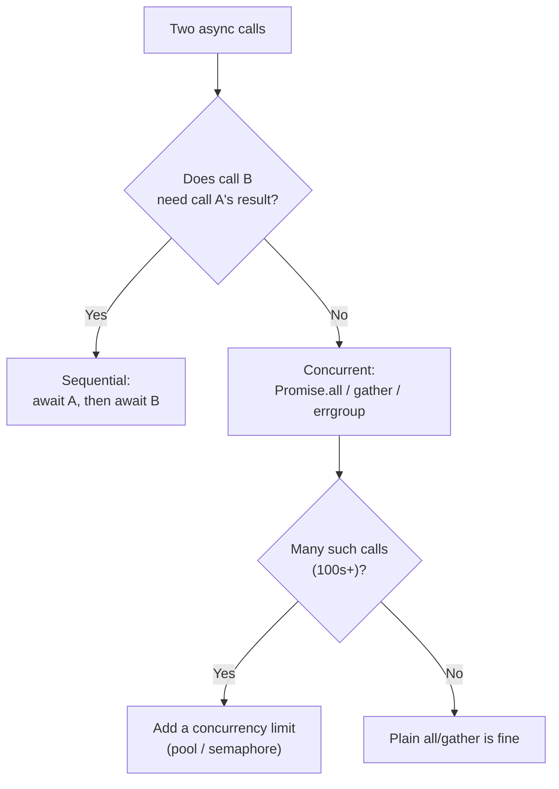

# Async & Functional — Junior Level

> **Level:** Junior — "What's the rule? What does the clean version look like?"
> This file teaches the *rules*. [middle.md](middle.md) covers when they bend; [senior.md](senior.md) covers the trade-offs at scale. For the full chapter overview, see the [chapter README](../README.md).

---

## Table of Contents

1. [Why this chapter exists](#why-this-chapter-exists)
2. [Real-world analogy](#real-world-analogy)
3. [The rules at a glance](#the-rules-at-a-glance)
4. [Rule 1 — Compose async work, don't nest callbacks](#rule-1--compose-async-work-dont-nest-callbacks)
5. [Rule 2 — Build pipelines over async streams](#rule-2--build-pipelines-over-async-streams)
6. [Rule 3 — Always handle errors and rejections](#rule-3--always-handle-errors-and-rejections)
7. [Rule 4 — Don't block the event loop with CPU work](#rule-4--dont-block-the-event-loop-with-cpu-work)
8. [Rule 5 — Respect back-pressure](#rule-5--respect-back-pressure)
9. [Rule 6 — Isolate the async boundary](#rule-6--isolate-the-async-boundary)
10. [Common Mistakes](#common-mistakes)
11. [Test Yourself](#test-yourself)
12. [Cheat Sheet](#cheat-sheet)
13. [Summary](#summary)
14. [Further Reading](#further-reading)
15. [Related Topics](#related-topics)

---

## Why this chapter exists

Async code is where clean-code instincts break down for most junior engineers. The logic is correct in your head — fetch this, then transform it, then save it — but the code on the page becomes a staircase of nested callbacks, a function that silently swallows errors, or a loop that loads ten million rows into memory before the first one is processed.

The good news: the same principles you already know — small composable units, explicit error paths, one responsibility per function — apply directly to async code. They just wear different clothes. A "pipeline" replaces a "loop." A "promise chain" replaces "call B inside A's callback." "Back-pressure" is just "don't take on more work than you can finish."

This chapter is about writing async code that reads like the synchronous version: top to bottom, one step at a time, with errors and resource limits made visible instead of hidden.

> **Key idea:** Asynchrony is *when* work runs, not *how* you structure it. Clean async code looks almost exactly like clean sync code — flat, named, and honest about what can go wrong.

---

## Real-world analogy

### The coffee shop

Picture a coffee shop with one barista (the event loop).

A **good** barista takes your order, *starts* the espresso machine, and while it runs turns to the next customer. The machine beeps; they finish your drink. One person serves a queue of twenty because no single step blocks the others. That's **non-blocking async**: kick off slow work, do something else, come back when it's ready.

A **bad** barista takes your order and then *stares at the machine* for the full 90 seconds, ignoring everyone behind you. That's **blocking the event loop** — one slow CPU-bound task freezes the whole line.

Now imagine orders arriving faster than the barista can make them. A wise shop puts up a "we can take 10 orders, please wait" sign — a **bounded queue**. A foolish shop accepts unlimited orders, scribbles them on an endless ribbon of paper that piles to the ceiling, and eventually collapses under the weight. That's **missing back-pressure**: accepting work faster than you finish it until memory runs out.

Clean async code is the wise barista: never idle-staring, never hoarding unbounded work, always tracking which drink failed so the customer hears about it.

---

## The rules at a glance

| # | Rule | Anti-pattern it kills |
|---|------|-----------------------|
| 1 | Compose async work; don't nest callbacks | Callback hell (pyramid of doom) |
| 2 | Build pipelines over async streams | Manual index-juggling loops |
| 3 | Always handle errors and rejections | Unhandled rejections / dropped futures |
| 4 | Don't block the event loop with CPU work | Frozen server, missed timers |
| 5 | Respect back-pressure | Unbounded queues, memory blowup |
| 6 | Isolate the async boundary | Mixing sync and async ("coloured functions") |

---

## Rule 1 — Compose async work, don't nest callbacks

**The rule:** when one async step depends on the previous one, *compose* them as a flat sequence (`await`, promise chaining, channel reads) instead of nesting one callback inside another.

Nesting grows rightward. Each new step indents one level deeper, until the closing braces form a staircase nobody can read — the **pyramid of doom** (a.k.a. callback hell).

### JavaScript / TypeScript

```typescript
// DIRTY — callback hell: error handling is duplicated, order is hard to see
function loadProfile(userId, done) {
  getUser(userId, (err, user) => {
    if (err) return done(err);
    getOrders(user.id, (err, orders) => {
      if (err) return done(err);
      getShipping(orders[0].id, (err, shipping) => {
        if (err) return done(err);
        done(null, { user, orders, shipping });
      });
    });
  });
}
```

```typescript
// CLEAN — async/await reads top to bottom, one error path
async function loadProfile(userId: string): Promise<Profile> {
  const user = await getUser(userId);
  const orders = await getOrders(user.id);
  const shipping = await getShipping(orders[0].id);
  return { user, orders, shipping };
}
```

When steps are **independent**, don't `await` them one after another (that serializes them needlessly). Run them concurrently:

```typescript
// CLEAN — independent fetches run in parallel
const [user, settings, flags] = await Promise.all([
  getUser(userId),
  getSettings(userId),
  getFeatureFlags(userId),
]);
```

### Python

```python
# DIRTY — nested callbacks (older asyncio / library style)
def load_profile(user_id, done):
    def on_user(user):
        def on_orders(orders):
            def on_shipping(shipping):
                done({"user": user, "orders": orders, "shipping": shipping})
            get_shipping(orders[0].id, on_shipping)
        get_orders(user.id, on_orders)
    get_user(user_id, on_user)
```

```python
# CLEAN — await sequences the dependent steps
async def load_profile(user_id: str) -> Profile:
    user = await get_user(user_id)
    orders = await get_orders(user.id)
    shipping = await get_shipping(orders[0].id)
    return Profile(user=user, orders=orders, shipping=shipping)


# CLEAN — independent calls run concurrently with gather
async def load_dashboard(user_id: str) -> Dashboard:
    user, settings, flags = await asyncio.gather(
        get_user(user_id),
        get_settings(user_id),
        get_feature_flags(user_id),
    )
    return Dashboard(user, settings, flags)
```

### Go

Go has no callbacks for this — goroutines plus channels are the composition model. Sequential dependent steps are just ordinary straight-line code, because each call blocks the *goroutine*, not the OS thread:

```go
// CLEAN — dependent steps read top to bottom (each call is blocking-but-cheap)
func LoadProfile(ctx context.Context, userID string) (Profile, error) {
    user, err := GetUser(ctx, userID)
    if err != nil {
        return Profile{}, err
    }
    orders, err := GetOrders(ctx, user.ID)
    if err != nil {
        return Profile{}, err
    }
    shipping, err := GetShipping(ctx, orders[0].ID)
    if err != nil {
        return Profile{}, err
    }
    return Profile{User: user, Orders: orders, Shipping: shipping}, nil
}
```

```go
// CLEAN — independent calls run concurrently with errgroup
func LoadDashboard(ctx context.Context, userID string) (Dashboard, error) {
    g, ctx := errgroup.WithContext(ctx)
    var user User
    var settings Settings
    g.Go(func() (err error) { user, err = GetUser(ctx, userID); return })
    g.Go(func() (err error) { settings, err = GetSettings(ctx, userID); return })
    if err := g.Wait(); err != nil {
        return Dashboard{}, err
    }
    return Dashboard{User: user, Settings: settings}, nil
}
```

> **Note:** In Go, "compose async work" means *spawn a goroutine and coordinate with a channel or `errgroup`*, never callbacks. The blocking style is the idiom — the runtime makes it cheap.

---

## Rule 2 — Build pipelines over async streams

**The rule:** when you process a *stream* of async items (rows from a query, lines from a file, messages from a queue), express the work as a **pipeline** of `map` / `filter` / `reduce`-style stages over an async iterable, instead of a hand-rolled loop with manual indexes and accumulator variables.

Pipelines describe *what* happens to each item; loops describe *how* to walk the collection. The pipeline version is shorter, composable, and — crucially — processes items one at a time instead of materializing the whole collection.

### JavaScript / TypeScript

```typescript
// DIRTY — buffers the entire result set, then loops with manual state
async function totalActiveSpend(userId: string): Promise<number> {
  const orders = await db.query(`SELECT * FROM orders WHERE user = $1`, [userId]); // all rows in memory
  let total = 0;
  for (let i = 0; i < orders.length; i++) {
    if (orders[i].status === "active") {
      total += orders[i].amount;
    }
  }
  return total;
}
```

```typescript
// CLEAN — async iterator streams rows; pipeline stays flat
async function totalActiveSpend(userId: string): Promise<number> {
  let total = 0;
  for await (const order of db.stream(`SELECT * FROM orders WHERE user = $1`, [userId])) {
    if (order.status === "active") total += order.amount;
  }
  return total;
}

// Reusable async pipeline helpers compose cleanly
async function* filter<T>(src: AsyncIterable<T>, keep: (x: T) => boolean) {
  for await (const x of src) if (keep(x)) yield x;
}
async function* map<T, U>(src: AsyncIterable<T>, fn: (x: T) => U) {
  for await (const x of src) yield fn(x);
}
```

### Python

```python
# DIRTY — loads everything, then filters/sums in memory
async def total_active_spend(user_id: str) -> int:
    orders = await db.fetch_all("SELECT * FROM orders WHERE user = $1", user_id)
    total = 0
    for o in orders:
        if o.status == "active":
            total += o.amount
    return total
```

```python
# CLEAN — async generator streams rows; pipeline expresses intent
async def active_orders(user_id: str):
    async for order in db.stream("SELECT * FROM orders WHERE user = $1", user_id):
        if order.status == "active":
            yield order


async def total_active_spend(user_id: str) -> int:
    total = 0
    async for order in active_orders(user_id):
        total += order.amount
    return total
```

### Go

Go expresses an async stream as a **channel**. Each pipeline stage is a goroutine that reads one channel and writes another:

```go
// CLEAN — generator -> filter -> consumer, each a stage over a channel
func activeOrders(ctx context.Context, in <-chan Order) <-chan Order {
    out := make(chan Order)
    go func() {
        defer close(out)
        for o := range in {
            if o.Status != "active" {
                continue
            }
            select {
            case out <- o:
            case <-ctx.Done():
                return
            }
        }
    }()
    return out
}

func TotalActiveSpend(ctx context.Context, orders <-chan Order) int {
    total := 0
    for o := range activeOrders(ctx, orders) {
        total += o.Amount
    }
    return total
}
```

> **Why streaming matters:** the dirty versions all load the full result set first. With a million rows that is a million-row spike in memory before any work starts. The streaming pipeline holds one row at a time — and naturally supports back-pressure (Rule 5).

---

## Rule 3 — Always handle errors and rejections

**The rule:** every async operation can fail, and the failure path must be *explicit*. A promise with no `.catch`, an `await` with no surrounding handling, or a goroutine whose error is never read is a bug waiting to surface in production logs as "unhandled rejection" — or worse, as silence.

### JavaScript / TypeScript

```typescript
// DIRTY — rejection is unhandled; process may crash or log a warning, caller never knows
function sendWelcome(userId: string) {
  getUser(userId).then((user) => emailService.send(user.email, "Welcome!"));
  // no .catch — if getUser or send rejects, the error vanishes
}
```

```typescript
// CLEAN — try/catch makes the failure path explicit
async function sendWelcome(userId: string): Promise<void> {
  try {
    const user = await getUser(userId);
    await emailService.send(user.email, "Welcome!");
  } catch (err) {
    logger.error("welcome email failed", { userId, err });
    throw err; // let the caller decide; don't swallow silently
  }
}
```

When you fan out to many tasks, choose your aggregator deliberately. `Promise.all` rejects on the **first** failure and abandons the rest; `Promise.allSettled` waits for **all** and reports each outcome — use it when one failure shouldn't cancel the others:

```typescript
// CLEAN — one bad email shouldn't drop the rest; inspect every outcome
const results = await Promise.allSettled(users.map((u) => emailService.send(u.email, body)));
const failures = results.filter((r) => r.status === "rejected");
if (failures.length) logger.warn(`${failures.length} emails failed`);
```

### Python

```python
# DIRTY — task created and forgotten; if it raises, the error is lost
async def send_welcome(user_id: str) -> None:
    asyncio.create_task(_send(user_id))   # fire-and-forget; exception never observed
```

```python
# CLEAN — await the work; handle failure explicitly
async def send_welcome(user_id: str) -> None:
    try:
        user = await get_user(user_id)
        await email_service.send(user.email, "Welcome!")
    except Exception:
        logger.exception("welcome email failed for %s", user_id)
        raise


# CLEAN — gather all outcomes; return_exceptions keeps one failure from cancelling the rest
async def send_all(users, body) -> None:
    results = await asyncio.gather(
        *(email_service.send(u.email, body) for u in users),
        return_exceptions=True,
    )
    failures = [r for r in results if isinstance(r, Exception)]
    if failures:
        logger.warning("%d emails failed", len(failures))
```

### Go

In Go, errors are values — the compiler nudges you, but a goroutine's error still has to be sent somewhere a reader will see it:

```go
// DIRTY — goroutine's error is silently dropped
func SendWelcome(ctx context.Context, userID string) {
    go func() {
        user, _ := GetUser(ctx, userID) // error ignored
        _ = emailService.Send(user.Email, "Welcome!") // error ignored
    }()
}
```

```go
// CLEAN — propagate the error back through a channel (or errgroup)
func SendWelcome(ctx context.Context, userID string) error {
    user, err := GetUser(ctx, userID)
    if err != nil {
        return fmt.Errorf("get user: %w", err)
    }
    if err := emailService.Send(user.Email, "Welcome!"); err != nil {
        return fmt.Errorf("send welcome: %w", err)
    }
    return nil
}
```

> **Rule of thumb:** if you start async work, *something* must observe its result. A dropped future / abandoned goroutine is the async equivalent of an empty `catch {}` block.

---

## Rule 4 — Don't block the event loop with CPU work

**The rule:** in single-threaded async runtimes (Node.js, Python's asyncio), the event loop runs *your* code and *everyone's* I/O callbacks on one thread. A long CPU-bound computation — parsing a 50 MB file, hashing a password with a high cost factor, resizing an image — **stalls the entire process**: no other request is served, no timer fires, until your loop returns. Offload that work to a worker thread or process pool.

### JavaScript / TypeScript

```typescript
// DIRTY — synchronous CPU work blocks every other request for seconds
app.post("/report", (req, res) => {
  const summary = crunchMillionRows(req.body.rows); // 4s of pure CPU on the event loop
  res.json(summary);                                // the whole server was frozen for 4s
});
```

```typescript
// CLEAN — offload CPU work to a worker thread; event loop stays responsive
import { Worker } from "node:worker_threads";

function crunchInWorker(rows: Row[]): Promise<Summary> {
  return new Promise((resolve, reject) => {
    const worker = new Worker("./crunch-worker.js", { workerData: rows });
    worker.once("message", resolve);
    worker.once("error", reject);
  });
}

app.post("/report", async (req, res) => {
  const summary = await crunchInWorker(req.body.rows); // loop free to serve others
  res.json(summary);
});
```

### Python

```python
# DIRTY — CPU-bound hashing on the event loop blocks all coroutines
async def hash_password(pw: str) -> bytes:
    return bcrypt.hashpw(pw.encode(), bcrypt.gensalt(rounds=14))  # ~0.5s of pure CPU, blocking
```

```python
# CLEAN — run CPU work in a process pool; loop keeps serving
import asyncio, concurrent.futures, bcrypt

_pool = concurrent.futures.ProcessPoolExecutor()

async def hash_password(pw: str) -> bytes:
    loop = asyncio.get_running_loop()
    return await loop.run_in_executor(
        _pool, lambda: bcrypt.hashpw(pw.encode(), bcrypt.gensalt(rounds=14))
    )
```

> **Why a *process* pool for Python CPU work?** The GIL means CPU-bound threads still contend for one core; processes sidestep it. Use a *thread* pool only for blocking *I/O* (e.g., a legacy synchronous library).

### Go

Go's runtime schedules goroutines across multiple OS threads, so there is no single event loop to block. But the lesson still applies: a tight CPU loop should respect `context` cancellation and yield, so it doesn't starve a logical pipeline or ignore a shutdown signal.

```go
// CLEAN — heavy work runs in its own goroutine; cancellation is honored
func Crunch(ctx context.Context, rows []Row) (Summary, error) {
    var s Summary
    for i, r := range rows {
        if i%10_000 == 0 { // periodically check for cancellation
            select {
            case <-ctx.Done():
                return Summary{}, ctx.Err()
            default:
            }
        }
        s.Add(r)
    }
    return s, nil
}
```

---

## Rule 5 — Respect back-pressure

**The rule:** never accept or produce work faster than the next stage can consume it. If a fast producer pushes into an **unbounded** queue feeding a slow consumer, the queue grows without limit until the process runs out of memory. The fix is a **bounded** buffer plus a **concurrency limit**: producers wait when the buffer is full.

### JavaScript / TypeScript

```typescript
// DIRTY — fires all N requests at once; with 100k URLs this exhausts sockets/memory
async function fetchAll(urls: string[]): Promise<Response[]> {
  return Promise.all(urls.map((u) => fetch(u))); // no limit on in-flight requests
}
```

```typescript
// CLEAN — bounded concurrency: at most `limit` requests in flight
async function fetchAll(urls: string[], limit = 8): Promise<Response[]> {
  const results: Response[] = [];
  let next = 0;
  async function worker() {
    while (next < urls.length) {
      const i = next++;
      results[i] = await fetch(urls[i]);
    }
  }
  await Promise.all(Array.from({ length: limit }, worker));
  return results;
}
```

### Python

```python
# DIRTY — schedules every coroutine immediately; unbounded concurrency
async def fetch_all(urls):
    return await asyncio.gather(*(fetch(u) for u in urls))  # 100k sockets at once
```

```python
# CLEAN — a semaphore caps in-flight work, giving back-pressure
async def fetch_all(urls, limit: int = 8):
    sem = asyncio.Semaphore(limit)

    async def bounded(url):
        async with sem:                # waits when `limit` are already running
            return await fetch(url)

    return await asyncio.gather(*(bounded(u) for u in urls))
```

### Go

Go channels have back-pressure built in: a **buffered channel** blocks the sender once full, and a fixed pool of worker goroutines caps concurrency.

```go
// CLEAN — bounded buffer + fixed worker pool = natural back-pressure
func FetchAll(ctx context.Context, urls []string, workers int) []Result {
    jobs := make(chan string, workers) // bounded buffer: producer blocks when full
    results := make(chan Result, workers)

    var wg sync.WaitGroup
    for i := 0; i < workers; i++ { // only `workers` requests in flight at once
        wg.Add(1)
        go func() {
            defer wg.Done()
            for url := range jobs {
                results <- fetch(ctx, url)
            }
        }()
    }

    go func() { // feed jobs; blocks when the buffer is full -> back-pressure
        for _, u := range urls {
            jobs <- u
        }
        close(jobs)
    }()

    go func() { wg.Wait(); close(results) }()

    var out []Result
    for r := range results {
        out = append(out, r)
    }
    return out
}
```

> **The memory-blowup test:** ask "what happens if the producer is 100× faster than the consumer, forever?" If the answer is "the queue grows forever," you have no back-pressure. A bounded buffer turns that into "the producer slows down" — exactly what you want.

---

## Rule 6 — Isolate the async boundary

**The rule:** keep functions "one color" where you can — a function is either synchronous (pure computation) or asynchronous (does I/O), not a confusing mix. Push the async/I/O parts to the *edges* and keep a synchronous, easily-testable core in the middle. This is the **coloured-function** problem: in many languages `async` is contagious — an `async` function can only be naturally awaited by another `async` function — so an `async` keyword sprinkled deep in your call graph forces everything above it to also become `async`.

The clean shape: **async shell, sync core.** Fetch the data (async), compute the answer (sync, pure), write the result (async).

### JavaScript / TypeScript

```typescript
// DIRTY — async tangled through pure logic; pricing is now hard to test in isolation
async function priceOrder(orderId: string): Promise<number> {
  const order = await db.getOrder(orderId);
  let total = 0;
  for (const item of order.items) {
    const rate = await db.getTaxRate(item.region); // I/O hidden inside the math loop
    total += item.price * (1 + rate);
  }
  return total;
}
```

```typescript
// CLEAN — async shell gathers data, then a pure sync function does the math
async function priceOrder(orderId: string): Promise<number> {
  const order = await db.getOrder(orderId);
  const regions = [...new Set(order.items.map((i) => i.region))];
  const rates = await db.getTaxRates(regions); // one batched async call at the edge
  return computeTotal(order.items, rates);     // pure, synchronous, trivially testable
}

function computeTotal(items: Item[], rates: Map<string, number>): number {
  return items.reduce((sum, i) => sum + i.price * (1 + rates.get(i.region)!), 0);
}
```

### Python

```python
# CLEAN — I/O at the edges, pure computation in the middle
async def price_order(order_id: str) -> float:
    order = await db.get_order(order_id)
    regions = {i.region for i in order.items}
    rates = await db.get_tax_rates(regions)   # async edge
    return compute_total(order.items, rates)  # sync core, no await inside


def compute_total(items, rates) -> float:     # pure: test with plain dicts, no event loop
    return sum(i.price * (1 + rates[i.region]) for i in items)
```

### Go

Go does not split functions into two colors — any function can call a blocking one, and `context.Context` carries cancellation instead of an `async` keyword. The *design* lesson still holds: separate the I/O-touching code from the pure computation.

```go
// CLEAN — fetch at the edge, compute in a pure function
func PriceOrder(ctx context.Context, orderID string) (float64, error) {
    order, err := db.GetOrder(ctx, orderID)
    if err != nil {
        return 0, err
    }
    rates, err := db.GetTaxRates(ctx, regionsOf(order.Items)) // async/I/O edge
    if err != nil {
        return 0, err
    }
    return computeTotal(order.Items, rates), nil // pure core, no ctx, no I/O
}

func computeTotal(items []Item, rates map[string]float64) float64 {
    var total float64
    for _, i := range items {
        total += i.Price * (1 + rates[i.Region])
    }
    return total
}
```

> **Payoff:** `computeTotal` / `compute_total` has no I/O, no `await`, no mocks. You test it with plain in-memory data. The async shell is thin enough to verify with a small integration test. This is the [pure-functions](../15-pure-functions/README.md) idea applied to async.


---

## Common Mistakes

| Mistake | Why it hurts | Fix |
|---------|--------------|-----|
| **Callback hell** — nesting each step inside the previous callback | Rightward staircase; error handling duplicated per level; impossible to read | `await` / chain / channels (Rule 1) |
| **Forgotten `await`** | The function returns a pending promise; the value is `undefined`/coroutine object; errors vanish | `await` the call; enable lint rules like `no-floating-promises` |
| **Serializing independent calls** — `await a(); await b();` when they don't depend on each other | Doubles latency for no reason | `Promise.all` / `asyncio.gather` / `errgroup` |
| **Unhandled rejection / dropped future** | Error logged as a warning at best, lost silently at worst | `try/catch`, `.catch`, `allSettled`, `return_exceptions=True` (Rule 3) |
| **Blocking the event loop** with CPU work | Whole process freezes; timers and other requests stall | Worker thread / process pool (Rule 4) |
| **Unbounded concurrency** — `Promise.all(urls.map(fetch))` over 100k items | Sockets/memory exhausted; OOM crash | Bounded pool / semaphore / buffered channel (Rule 5) |
| **Buffering a whole result set** before processing | Memory spike proportional to data size | Stream with async iterators / channels (Rule 2) |
| **`async` smeared through pure logic** | Coloured-function contagion; core logic needs an event loop to test | Async shell, sync core (Rule 6) |
| **Swallowing errors** with empty `catch {}` / `except: pass` / `_ = err` | Failures become invisible; debugging is guesswork | Log *and* rethrow, or handle meaningfully |

---

## Test Yourself

**1. You have three independent API calls. A junior writes `const a = await getA(); const b = await getB(); const c = await getC();`. What's wrong, and what's the fix?**

<details><summary>Answer</summary>

Nothing is *incorrect*, but the calls are **serialized**: total latency is `getA + getB + getC`. Since they're independent, run them concurrently with `Promise.all([getA(), getB(), getC()])` (or `asyncio.gather`, or an `errgroup` in Go). Latency drops to the slowest single call. Only `await` sequentially when a later step needs an earlier step's result (Rule 1).

</details>

**2. What is the difference between `Promise.all` and `Promise.allSettled`, and when do you pick each?**

<details><summary>Answer</summary>

`Promise.all` rejects as soon as **one** promise rejects and gives you no results from the others — use it when any failure means the whole operation is pointless (e.g., loading three pieces of data all required to render a page). `Promise.allSettled` waits for **every** promise and returns `{status, value|reason}` for each — use it when failures are independent and you want to process the successes anyway (e.g., sending 1000 emails; one bounce shouldn't drop the other 999). Python's equivalent is `asyncio.gather(..., return_exceptions=True)`.

</details>

**3. Why does hashing a password with `bcrypt.hashpw` directly inside an `async def` hurt a Python web server, even though it's "just one line"?**

<details><summary>Answer</summary>

`bcrypt` is **CPU-bound** — it deliberately burns hundreds of milliseconds of CPU. In asyncio that work runs on the single event-loop thread, so *no other coroutine* (no other request, no timer, no health check) makes progress until it finishes. Under load this serializes every request behind the hashing. The fix is `loop.run_in_executor` with a **process** pool (the GIL makes a thread pool ineffective for CPU work), keeping the event loop free (Rule 4).

</details>

**4. A producer reads URLs from a file (millions of lines) and does `Promise.all(lines.map(fetch))`. The process crashes with "out of memory." What happened, and how do you fix it without losing any URLs?**

<details><summary>Answer</summary>

`lines.map(fetch)` starts **all** fetches at once — millions of in-flight requests, each holding a socket and a buffer. There is **no back-pressure**: the producer (the loop) outruns what the network and memory can handle. Fix it with a **bounded concurrency limit** — a worker pool of, say, 8 workers, or a semaphore — so only N requests run at a time and the rest wait. In Go this is a buffered channel plus a fixed pool of worker goroutines (Rule 5).

</details>

**5. What does "async shell, sync core" mean, and why does it make code easier to test?**

<details><summary>Answer</summary>

Push all I/O (database, network, file) to the *edges* of a function — the async "shell" — and keep the decision-making logic in a *pure synchronous* "core" that takes plain data in and returns plain data out. The core has no `await`, no I/O, no mocks: you test it with in-memory values and zero setup. Only the thin shell needs an integration test. This also tames the **coloured-function** problem — `async` stops leaking into your pure logic (Rule 6). See [pure-functions](../15-pure-functions/README.md).

</details>

**6. A teammate says "Go doesn't have async, so this chapter doesn't apply to us." Are they right?**

<details><summary>Answer</summary>

No. Go's model is *different* (goroutines + channels instead of `async`/`await`), but every rule maps over: compose with channels not callbacks (1); pipeline stages are goroutines over channels (2); a goroutine's error must still be sent somewhere readable (3); a tight CPU loop should honor `context` cancellation (4); buffered channels + worker pools *are* back-pressure (5); and separating I/O from pure computation is just good design (6). Go even *avoids* one trap entirely — it has no two-color function split.

</details>

---

## Cheat Sheet

```text
COMPOSE, DON'T NEST
  dependent steps   -> await / chain / sequential channel reads
  independent steps -> Promise.all | asyncio.gather | errgroup

STREAM, DON'T BUFFER
  for await (...)            (JS async iterator)
  async for ... in ...       (Python async generator)
  for x := range ch { ... }  (Go channel)

HANDLE EVERY FAILURE
  try/catch + rethrow         never empty catch {}
  Promise.allSettled          when one failure must not cancel the rest
  gather(return_exceptions=True)
  Go: send the error on a channel / use errgroup; never `_ = err`

DON'T BLOCK THE LOOP
  CPU-bound work -> Worker thread (Node) | ProcessPoolExecutor (Python)
  Go: honor ctx.Done() in long loops

RESPECT BACK-PRESSURE
  bounded worker pool | semaphore | buffered channel
  ask: "producer 100x faster forever -> does the queue grow forever?"

ISOLATE THE BOUNDARY
  async shell (I/O at edges) + pure sync core (logic in middle)
```

**Quick decision: should these two calls be concurrent?**



---

## Summary

- **Compose, don't nest.** Dependent async steps become a flat `await` sequence (or channel reads in Go); independent ones run concurrently with `Promise.all` / `gather` / `errgroup`.
- **Pipeline over streams.** Process async data with `map`/`filter`/`reduce`-style stages over async iterators or channels — one item at a time, not a buffered mountain.
- **Handle every failure.** No promise without a path to a handler; no goroutine whose error is never read. Use `allSettled` / `return_exceptions=True` when failures are independent.
- **Never block the event loop.** Offload CPU-bound work to a worker thread or process pool; in Go, honor cancellation in long loops.
- **Respect back-pressure.** Bound your queues and concurrency so a fast producer can't OOM the process.
- **Isolate the async boundary.** Async shell, pure sync core — easy to read, easy to test, and the `async` color stops spreading.

The throughline: **clean async code looks like clean sync code** — flat, named, honest about errors and resource limits.

---

## Further Reading

- *Clean Code* (Robert C. Martin) — Chapter 13, "Concurrency": the principles that underpin async hygiene.
- MDN Web Docs — *Using Promises* and *async/await*: the canonical JS reference.
- Python docs — *asyncio* (coroutines, tasks, `gather`, semaphores) and *async generators* (PEP 525).
- *Concurrency in Go* (Katherine Cox-Buday) — channels, pipelines, and the worker-pool / back-pressure patterns.
- Bob Nystrom, *"What Color Is Your Function?"* — the essay that named the coloured-function problem.

---

## Related Topics

- [middle.md](middle.md) — these rules in real codebases: where they bend, library-specific gotchas, and trade-offs.
- [senior.md](senior.md) — async architecture at scale: streaming systems, structured concurrency, and back-pressure across service boundaries.
- [chapter README](../README.md) — the chapter's anti-patterns to recognize and avoid.
- [Concurrency](../11-concurrency/README.md) — threads, locks, and shared-state correctness (the layer beneath async).
- [Pure Functions](../15-pure-functions/README.md) — the "sync core" half of Rule 6.
- [Error Handling](../06-error-handling/README.md) — the general discipline behind Rule 3.
- [Functional Programming](../../functional-programming/README.md) — `map`/`filter`/`reduce` and pipeline composition in depth.
- [Anti-Patterns](../../anti-patterns/README.md) — callback hell and friends as named anti-patterns.
- [Refactoring](../../refactoring/README.md) — turning callback pyramids into composed sequences step by step.