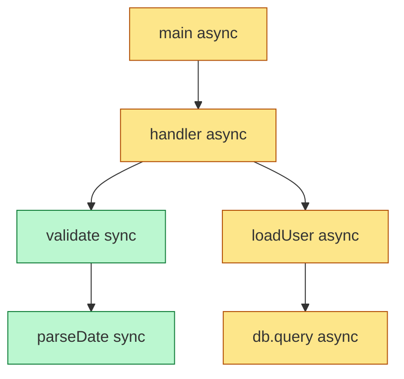
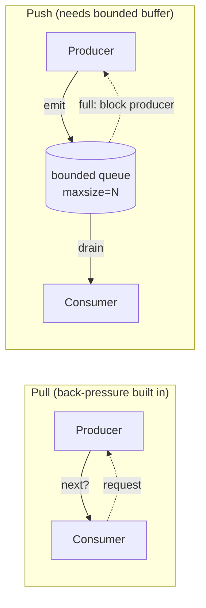

# Async & Functional — Middle Level

> Focus: "Why?" and "When does it bend?" — the trade-offs behind async boundaries, concurrency vs. parallelism, back-pressure, cancellation, and error propagation across JS/TS, Python, and Go.

---

## Table of Contents

1. [Function coloring: the cost of `async`](#function-coloring-the-cost-of-async)
2. [Functional core, imperative shell](#functional-core-imperative-shell)
3. [Concurrency vs. parallelism in async code](#concurrency-vs-parallelism-in-async-code)
4. [The accidental-sequential-await trap](#the-accidental-sequential-await-trap)
5. [Back-pressure: pull vs. push](#back-pressure-pull-vs-push)
6. [Cancellation and timeouts](#cancellation-and-timeouts)
7. [Error propagation across concurrent tasks](#error-propagation-across-concurrent-tasks)
8. [Common Mistakes](#common-mistakes)
9. [Test Yourself](#test-yourself)
10. [Cheat Sheet](#cheat-sheet)
11. [Summary](#summary)
12. [Further Reading](#further-reading)
13. [Related Topics](#related-topics)

---

## Function coloring: the cost of `async`

The term *function coloring* (from Bob Nystrom's "What Color Is Your Function?") describes a structural property of async runtimes: an `async` function is a **different color** from a sync one, and the colors don't mix freely. The rules are asymmetric:

- An async function can call a sync function.
- A sync function **cannot** await an async function without itself becoming async — or blocking.

The practical consequence: `async` is **viral**. The moment one leaf function does I/O and becomes async, every caller up the stack must either `await` it (becoming async too) or break the chain by blocking a thread / spawning a task. This is why a single `await fetch(...)` deep in a utility can force `async` onto fifty call sites.



The yellow path is "infected" by async; once `db.query` is async, the color propagates straight to `main`.

### Why each language colors differently

| Language | Coloring mechanism | Escape hatch |
|---|---|---|
| JS/TS | `async`/`await` over a single-threaded event loop. Sync code blocks *everything*. | `Atomics.wait` (workers only); there is no general "block on a promise." |
| Python | `async def` coroutines on an event loop; separate sync world. | `asyncio.run`, `loop.run_until_complete`, `asyncio.to_thread` for sync calls. |
| Go | **No coloring.** Every function is the same color; `go` spawns a goroutine, blocking calls park the goroutine, not the OS thread. | Not needed — the runtime multiplexes goroutines over threads. |

Go's design is the key insight: coloring is not inherent to concurrency, it's a consequence of *stackless coroutines on a cooperative event loop*. Go uses stackful goroutines with a preemptive scheduler, so a "blocking" read is just a goroutine park. JS and Python pay the coloring tax to avoid a multi-threaded runtime.

### The trade-off you actually make

`async` buys you **high I/O concurrency on few threads** at the cost of **viral signatures and a split ecosystem** (sync libs can't be awaited; calling one blocks the loop). The mistake is treating `async` as free and spraying it everywhere. The discipline: keep async at the **edges** where I/O lives, and keep the core synchronous.

---

## Functional core, imperative shell

Gary Bernhardt's *functional core, imperative shell* is the antidote to async sprawl. The idea:

- **Functional core** — pure functions: decisions, calculations, transformations. No I/O, no `await`, no clock, no randomness. Easy to test, trivially parallelizable, the *uncolored* part of your program.
- **Imperative shell** — a thin async layer that reads inputs (DB, network, files), hands plain data to the core, and writes the core's outputs back out.

The boundary matters because async is contagious *only through the shell*. If business logic is pure, it stays sync, stays the same color everywhere, and never needs an event loop to be tested.

```python
# SHELL (async, does I/O) — keep this thin
async def settle_invoice(invoice_id: str, repo: Repo, gateway: Gateway) -> None:
    invoice = await repo.load(invoice_id)            # I/O in
    charges = await gateway.fetch_charges(invoice_id)

    result = compute_settlement(invoice, charges)    # CORE: pure, sync, testable

    await repo.save(result.invoice)                  # I/O out
    if result.refund:
        await gateway.issue_refund(result.refund)

# CORE (pure, sync) — no await, no clock, no network
def compute_settlement(invoice: Invoice, charges: list[Charge]) -> Settlement:
    paid = sum(c.amount for c in charges if c.status == "captured")
    if paid > invoice.total:
        return Settlement(invoice.mark_paid(), refund=Refund(paid - invoice.total))
    return Settlement(invoice.with_paid(paid), refund=None)
```

`compute_settlement` has zero `async`, no mocks, no event loop in its tests. The shell is where every `await`, retry, and timeout lives — and it's small enough to read at a glance.

> **When it bends:** streaming pipelines where the data doesn't fit in memory. You can't load everything, transform purely, then write — you process incrementally. There the core becomes a pure *transducer* (a function over one item, or a generator), and the shell drives the iteration and back-pressure. The principle holds; the shape changes.

---

## Concurrency vs. parallelism in async code

These words get used interchangeably and it causes real bugs. Precise definitions:

- **Concurrency** — multiple tasks *in progress* over the same period, interleaved. One CPU is enough. This is what async/await gives you: while task A waits on the network, task B runs.
- **Parallelism** — multiple tasks executing *at the same instant* on multiple cores. Requires multiple threads/processes.

The litmus test: **async makes waiting concurrent, not computation parallel.** Awaiting ten HTTP calls concurrently is great. Awaiting ten SHA-256 hashes concurrently is pointless — there's nothing to wait on; the CPU does them one after another anyway, and on a single-threaded loop you've just added overhead.

### Choosing the right primitive

| Goal | JS/TS | Python | Go |
|---|---|---|---|
| Concurrent I/O (the common case) | `Promise.all`, `Promise.allSettled` | `asyncio.gather`, `TaskGroup` | goroutines + `WaitGroup` / `errgroup` |
| CPU parallelism | Worker threads (`worker_threads`) | `multiprocessing`, `ProcessPoolExecutor` | goroutines (already use all cores via `GOMAXPROCS`) |

```js
// CONCURRENT I/O — correct use of Promise.all
const [user, orders, prefs] = await Promise.all([
  fetchUser(id),
  fetchOrders(id),
  fetchPrefs(id),
]);

// WRONG: hashing is CPU-bound. Promise.all does NOT parallelize this on
// the single event-loop thread — it runs serially, plus promise overhead.
const hashes = await Promise.all(files.map((f) => sha256Sync(f)));

// RIGHT for CPU work: push it off the loop to workers.
const hashes2 = await Promise.all(files.map((f) => pool.run(f)));
```

Go is the odd one out: because goroutines are scheduled across OS threads by default, the *same* `errgroup` pattern gives you concurrency for I/O **and** parallelism for CPU work with no API change. In JS and Python, CPU parallelism requires explicitly crossing the worker/process boundary (and paying serialization costs), because the event loop and the GIL respectively serialize CPU-bound work on one thread.

> **The decision:** if the work is *waiting*, use async concurrency. If the work is *computing*, you need a separate OS thread (workers / processes / Go's scheduler). Putting CPU work on the event loop blocks every other task — see the event-loop-blocking mistake below.

---

## The accidental-sequential-await trap

The single most common async performance bug is `await` inside a loop when the iterations are independent.

```js
// SEQUENTIAL — 100 ids × 50ms each = ~5 seconds. Each await blocks the next.
const users = [];
for (const id of ids) {
  users.push(await fetchUser(id)); // waits for THIS before starting next
}

// CONCURRENT — all 100 in flight at once = ~50ms total.
const users = await Promise.all(ids.map((id) => fetchUser(id)));
```

The sequential version is correct *if* each iteration depends on the previous one (e.g., pagination cursors, or a write that the next read must observe). It's a bug only when the iterations are independent — which is most of the time.

```python
# Python — same trap, same fix
# SEQUENTIAL:
results = []
for id in ids:
    results.append(await fetch_user(id))

# CONCURRENT:
results = await asyncio.gather(*(fetch_user(id) for id in ids))
```

### When concurrency needs a limit

`Promise.all` / `gather` start **everything at once**. With 10,000 ids that's 10,000 concurrent connections — you'll exhaust sockets, hit rate limits, or OOM. The fix is a bounded concurrency window: a semaphore, a worker pool, or a chunked loop.

```python
sem = asyncio.Semaphore(20)  # at most 20 in flight

async def bounded_fetch(id):
    async with sem:
        return await fetch_user(id)

results = await asyncio.gather(*(bounded_fetch(id) for id in ids))
```

```go
// Go: errgroup with SetLimit caps in-flight goroutines.
g, ctx := errgroup.WithContext(ctx)
g.SetLimit(20)
results := make([]*User, len(ids))
for i, id := range ids {
    i, id := i, id // capture for the closure (pre-Go 1.22)
    g.Go(func() error {
        u, err := fetchUser(ctx, id)
        results[i] = u
        return err
    })
}
err := g.Wait()
```

> **The trade-off:** unbounded concurrency is fastest in the lab and catastrophic in production. Bounded concurrency trades a little latency for stability under load. Pick the bound from the downstream's capacity (connection-pool size, rate limit), not a round number.

---

## Back-pressure: pull vs. push

Back-pressure is what a slow consumer uses to tell a fast producer "slow down." Without it, the producer's output piles up in an unbounded buffer until memory runs out. This is the headline failure mode of naive async pipelines: an event source emitting faster than you can process, with every event queued in RAM.

Two models:

- **Pull (demand-driven)** — the consumer asks for the next item when ready. The producer can't outrun the consumer because it only produces on demand. Iterators, generators, and `for await...of` are pull-based and have *built-in* back-pressure.
- **Push (event-driven)** — the producer emits whenever it wants; the consumer must keep up or buffer. Raw event emitters and `socket.on('data')` are push-based and have *no* back-pressure unless you add it (pause/resume, bounded queues, reactive `Subscription.request(n)`).



### Bounded channels and queues

The universal back-pressure tool is a **bounded** buffer. When it fills, the producer blocks (or drops, or errors — a policy choice).

```python
# asyncio.Queue with maxsize → producer awaits put() when full = back-pressure
queue: asyncio.Queue[Event] = asyncio.Queue(maxsize=100)

async def producer():
    async for event in source():
        await queue.put(event)   # BLOCKS when 100 unconsumed events queued

async def consumer():
    while True:
        event = await queue.get()
        await handle(event)      # slow consumer naturally throttles producer
        queue.task_done()
```

```go
// Go: an unbuffered or small-buffered channel IS back-pressure.
ch := make(chan Event, 100) // bounded buffer
// send blocks when full; the producer can't outrun the consumer.
```

In JS, Node streams implement back-pressure via the return value of `write()` (`false` = "pause") and the `drain` event; modern code uses async iterators (`for await...of`) which pull and pause automatically. **Drop the buffer bound and you've reintroduced the unbounded-queue memory blowup.**

> **When push is right:** UI events, telemetry where dropping is acceptable, or low-volume signals. Pick a *drop* policy explicitly (drop-oldest, drop-newest, sample) rather than letting an unbounded queue make the policy for you by crashing.

---

## Cancellation and timeouts

An async operation with no timeout is a latent hang: one stuck dependency and your request pool drains. Every external call needs a deadline, and a deadline needs a *propagating cancellation signal*.

```js
// JS — AbortController is the standard cancellation token.
const ctrl = new AbortController();
const t = setTimeout(() => ctrl.abort(), 3000); // 3s deadline
try {
  const res = await fetch(url, { signal: ctrl.signal });
  return await res.json();
} finally {
  clearTimeout(t); // don't leak the timer
}
```

```python
# Python — wait_for wraps any awaitable with a timeout; raises TimeoutError
# and cancels the inner task on expiry.
try:
    user = await asyncio.wait_for(fetch_user(id), timeout=3.0)
except asyncio.TimeoutError:
    user = cached_user(id)  # degrade gracefully
```

```go
// Go — context.Context carries the deadline and cancellation down the call tree.
ctx, cancel := context.WithTimeout(ctx, 3*time.Second)
defer cancel() // ALWAYS cancel to release the timer
user, err := fetchUser(ctx, id) // fetchUser must honor ctx.Done()
```

### What makes cancellation actually work

A cancellation signal is **cooperative**: it only cancels if the code checks it. Three principles:

1. **Propagate, don't recreate.** Pass the same `signal` / `context` down the whole chain. A child call that ignores it keeps running after the parent gave up — a goroutine/task leak.
2. **Cancellation is not "stop instantly."** It's a request. In-flight CPU work and non-cancellable syscalls finish first. Design idempotent operations so a cancelled-then-retried write is safe.
3. **Clean up on cancel.** Use `finally` / `defer` / context-aware `with` to release timers, connections, and locks. The biggest cancellation bug is a leaked resource, not a missed deadline.

> **The trade-off:** timeouts trade *correctness-if-we-just-wait* for *bounded latency*. A timeout can abort an operation that would have succeeded in one more second. Set deadlines from real latency percentiles (p99 + margin), not guesses, and pair them with retries (with jitter) for transient failures — but make the work idempotent first.

---

## Error propagation across concurrent tasks

When you run N tasks concurrently, you must decide what one failure does to the others. The two policies have names and they behave very differently.

### Fail-fast vs. collect-all

```js
// FAIL-FAST: Promise.all rejects on the FIRST rejection. The other promises
// keep running but their results are abandoned, and you get one error.
try {
  const [a, b, c] = await Promise.all([taskA(), taskB(), taskC()]);
} catch (e) {
  // e is whichever rejected first. b and c may still be in flight.
}

// COLLECT-ALL: allSettled never rejects; you inspect each outcome.
const results = await Promise.allSettled([taskA(), taskB(), taskC()]);
const ok = results.filter((r) => r.status === "fulfilled").map((r) => r.value);
const failed = results.filter((r) => r.status === "rejected");
```

| Policy | JS/TS | Python | Go | Use when |
|---|---|---|---|---|
| Fail-fast | `Promise.all` | `asyncio.gather(...)` (default) or `TaskGroup` | `errgroup` | All results are required; one failure makes the whole op meaningless. |
| Collect-all | `Promise.allSettled` | `gather(..., return_exceptions=True)` | manual: collect errors into a slice | Partial success is useful; you want every outcome. |

### The leak hiding inside fail-fast

`Promise.all`'s reject-on-first leaves the siblings running detached — if they later reject, you get an *unhandled rejection*. Python's `asyncio.TaskGroup` (3.11+) and Go's `errgroup` fix this properly: on first error they **cancel the siblings**, then surface the error.

```python
# TaskGroup: first failure cancels the rest, then raises an ExceptionGroup.
async with asyncio.TaskGroup() as tg:
    t1 = tg.create_task(task_a())
    t2 = tg.create_task(task_b())
    t3 = tg.create_task(task_c())
# Exiting the block awaits all; any failure cancels siblings + propagates.
```

```go
// errgroup: g.Wait() returns the first non-nil error; ctx is cancelled
// so well-behaved siblings stop early.
g, ctx := errgroup.WithContext(ctx)
g.Go(func() error { return taskA(ctx) })
g.Go(func() error { return taskB(ctx) })
if err := g.Wait(); err != nil {
    return err // first error wins
}
```

> **The decision:** fail-fast for "all-or-nothing" reads where partial data is useless; collect-all for fan-out where each result stands alone (e.g., notifying 100 subscribers — one bad email shouldn't drop the other 99). Prefer structured concurrency (`TaskGroup`, `errgroup`) over raw `gather`/`Promise.all` so a failure cancels stragglers instead of leaking them.

---

## Common Mistakes

1. **Blocking the event loop with CPU work.** A 200ms JSON parse or image resize on the JS/Python event loop stalls *every* concurrent request, not just this one. Offload to a worker thread / process pool. (Go: not an issue — the scheduler preempts.)
2. **`await` in a loop for independent work.** The accidental-sequential trap above. Each iteration waits for the last; 100× latency for nothing.
3. **`Promise.all` / `gather` with no concurrency cap.** Works for 10 items, exhausts sockets and memory at 10,000. Bound it with a semaphore or `SetLimit`.
4. **Forgetting back-pressure.** An unbounded `Queue()` or push-based subscription with a slow consumer = monotonically growing memory until OOM. Always bound the buffer.
5. **No timeout on external calls.** One slow dependency hangs the request indefinitely and drains your connection pool. Every I/O call gets a deadline.
6. **Not propagating the cancellation signal.** Creating a fresh `AbortController`/`context` per layer instead of passing the parent's down. Children outlive cancelled parents — task leaks.
7. **Swallowing rejections from fire-and-forget tasks.** `someAsync()` with no `await` and no `.catch` → unhandled rejection, lost error. If you fire-and-forget, attach a handler or use a structured group.
8. **Spraying `async` through pure logic.** Marking a function `async` "just in case" colors every caller. Keep the functional core sync; isolate `await` in the shell.
9. **Using `Promise.all` when you meant `allSettled`.** Fail-fast silently abandons sibling results and can leak rejections. If partial success matters, you want collect-all.
10. **Mixing sync and async APIs in one function.** A function that sometimes returns a value and sometimes a Promise (e.g., a cache that returns sync on hit, Promise on miss) forces every caller to handle both. Always return a Promise — `async`/`await` normalizes it for free.

---

## Test Yourself

1. **Why is `async` called "viral" or "colored," and which of JS/Python/Go avoids it?**

<details><summary>Answer</summary>

A sync function can't `await` an async one without becoming async itself (or blocking), so async propagates up every caller — it's *viral* / a different *color* than sync. JS and Python both have coloring (stackless coroutines on an event loop). **Go avoids it**: stackful goroutines on a preemptive scheduler mean a blocking call parks the goroutine, not the thread, so every function is the same color.

</details>

2. **You have `for (const id of ids) results.push(await fetchUser(id))`. When is this correct, and when is it a bug?**

<details><summary>Answer</summary>

It's a **bug** when the fetches are independent — you serialize 100 independent calls and pay 100× the latency; use `Promise.all(ids.map(fetchUser))`. It's **correct** when each iteration depends on the previous (e.g., following a pagination cursor, or a write the next read must observe). The signal is data dependency between iterations.

</details>

3. **Why doesn't `Promise.all` give you CPU parallelism?**

<details><summary>Answer</summary>

`Promise.all` only waits on multiple promises concurrently — it doesn't add threads. On a single-threaded event loop, CPU-bound work between awaits still runs serially, one piece at a time. To parallelize computation you must cross a thread boundary (worker threads in Node, `ProcessPoolExecutor` in Python). Concurrency ≠ parallelism: async parallelizes *waiting*, not *computing*.

</details>

4. **Your service runs `await asyncio.gather(*(fetch(u) for u in 50_000_urls))` and falls over in production but passed every test. Why, and what's the fix?**

<details><summary>Answer</summary>

`gather` starts all 50,000 coroutines at once — 50,000 simultaneous connections exhaust sockets/file descriptors, trip downstream rate limits, and balloon memory. Tests used a handful of URLs so the problem never appeared. Fix: bound concurrency with an `asyncio.Semaphore` (or chunked batches / a worker pool). Choose the limit from the downstream's actual capacity, not a guess.

</details>

5. **What is back-pressure, and why do pull-based pipelines have it "for free" while push-based ones don't?**

<details><summary>Answer</summary>

Back-pressure is a slow consumer signaling a fast producer to slow down. Pull-based sources (iterators, generators, `for await...of`, channels with a blocking receive) only produce the next item when the consumer asks — the producer literally cannot outrun the consumer. Push-based sources (event emitters, `socket.on('data')`) emit whenever they want; without an explicit bounded buffer + pause/resume, items pile up in an unbounded queue until OOM.

</details>

6. **What's the difference between `Promise.all` and `Promise.allSettled`, and what subtle leak does fail-fast cause?**

<details><summary>Answer</summary>

`Promise.all` rejects on the **first** failure; `Promise.allSettled` never rejects and returns a status for each task. The leak: when `Promise.all` rejects early, the sibling promises keep running detached. If one later rejects, it surfaces as an *unhandled rejection*. Structured-concurrency tools (`asyncio.TaskGroup`, Go `errgroup`) avoid this by **cancelling** siblings on the first error.

</details>

7. **Why must a cancellation signal be propagated rather than recreated at each layer?**

<details><summary>Answer</summary>

Cancellation is cooperative — only code that observes the *same* signal stops. If a layer creates a fresh `AbortController` / `context` instead of passing the parent's down, the parent's cancellation never reaches the child. The child keeps running after the parent gave up, leaking a task/goroutine and the resources it holds. Always thread the parent's `signal`/`ctx` through the whole call chain.

</details>

8. **A cache helper returns the cached value synchronously on a hit and a Promise on a miss. Why is this a smell, and what's the clean fix?**

<details><summary>Answer</summary>

It's a sync/async-mixed API: every caller must branch on whether the result is a value or a Promise, and a refactor that flips a hit to a miss breaks callers silently. Make the function **always** return a Promise (e.g., `async get(): Promise<V>`). `await` on an already-resolved value is essentially free, and every call site gets one uniform shape.

</details>

---

## Cheat Sheet

| Situation | Reach for | Avoid |
|---|---|---|
| N independent I/O calls | `Promise.all` / `asyncio.gather` / `errgroup` | `await` in a loop |
| N I/O calls, partial success OK | `Promise.allSettled` / `gather(return_exceptions=True)` | `Promise.all` (loses siblings) |
| Thousands of calls | semaphore / `SetLimit` / chunking | unbounded `all`/`gather` |
| CPU-bound work | worker threads / `ProcessPoolExecutor` / goroutines | running it on the event loop |
| Producer faster than consumer | bounded queue / channel / `for await...of` | unbounded `Queue()` / raw `.on('data')` |
| External call | timeout + cancellation (`AbortController`/`wait_for`/`context`) | no deadline |
| Business logic | pure sync functions (functional core) | `async` "just in case" |
| Fire-and-forget task | attach `.catch` / use a task group | dropping the promise |

**Quick rules**

- Async parallelizes *waiting*, not *computing*.
- Keep `await` in the shell; keep the core pure and sync.
- Every concurrent fan-out needs a bound; every external call needs a deadline.
- Propagate one cancellation signal; never recreate it per layer.
- Choose fail-fast vs. collect-all *consciously* — they fail differently.

---

## Summary

Async is a trade, not a free upgrade. It buys massive I/O concurrency on a tiny thread pool, and charges you in **function coloring** (viral signatures) and a split sync/async ecosystem. The discipline that keeps the cost contained is **functional core, imperative shell**: pure, sync, testable logic surrounded by a thin async layer that owns all the `await`s, timeouts, and retries.

The four levers you actually tune at the boundary:

- **Concurrency vs. parallelism** — async concurrency for waiting; threads/processes/goroutines for computing. Never put CPU work on the event loop.
- **Back-pressure** — bound every buffer. Pull-based pipelines get it for free; push-based ones need an explicit bounded queue and a drop policy.
- **Cancellation & timeouts** — every external call gets a deadline and a propagated, cooperative cancellation signal, plus cleanup on cancel.
- **Error propagation** — choose fail-fast (`all`/`errgroup`) vs. collect-all (`allSettled`) deliberately, and prefer structured concurrency so a failure cancels stragglers instead of leaking them.

Get these four right and async stays a tool at the edges of your system rather than a contagion running through it.

---

## Further Reading

- Bob Nystrom — *What Color Is Your Function?* (the canonical essay on function coloring)
- Gary Bernhardt — *Boundaries* / *Functional Core, Imperative Shell* (Destroy All Software)
- Nathaniel J. Smith — *Notes on structured concurrency, or: Go statement considered harmful*
- Python docs — `asyncio` Task Groups, `wait_for`, and Queues
- Go blog — *Pipelines and cancellation*; the `golang.org/x/sync/errgroup` package docs
- Node.js docs — Stream back-pressure and the `for await...of` async-iterator protocol

---

## Related Topics

- [`junior.md`](junior.md) — definitions and the clean baseline for each async/functional rule
- [`senior.md`](senior.md) — system-level concurrency design, observability, and failure modes at scale
- [`../README.md`](../README.md) — the Clean Code chapter index
- [`../11-concurrency/README.md`](../11-concurrency/README.md) — threads, locks, and shared-state concurrency (the layer beneath async)
- [`../15-pure-functions/README.md`](../15-pure-functions/README.md) — purity is what makes the functional core possible
- [`../../functional-programming/README.md`](../../functional-programming/README.md) — composition, immutability, and effect tracking in depth
- [`../../refactoring/README.md`](../../refactoring/README.md) — mechanics for extracting a pure core out of an async tangle
