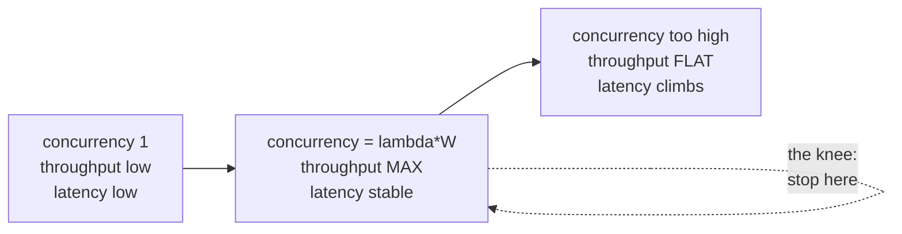

# Async & Functional — Optimize & Reconcile

> Clean async code reads top-to-bottom like sync code. That readability hides three traps: it makes serial `await` chains invisible, it makes unbounded fan-out look harmless, and it makes "just `await` everything" feel free. Each scenario below takes a clean-looking async or functional snippet, measures where it bleeds latency, memory, or stability, and resolves it without sacrificing clarity. Numbers are order-of-magnitude, reproducible on commodity hardware — verify with your own profiler before acting.

---

## Table of Contents

1. [Sequential awaits in a loop (the #1 async perf bug)](#scenario-1--sequential-awaits-in-a-loop)
2. [Unbounded `Promise.all` / `gather` overwhelms downstream](#scenario-2--unbounded-fan-out-overwhelms-downstream)
3. [Bounded concurrency by Little's Law](#scenario-3--sizing-the-pool-with-littles-law)
4. [async/await overhead vs sync for trivial work](#scenario-4--asyncawait-overhead-for-trivial-work)
5. [Blocking the event loop with CPU work](#scenario-5--cpu-bound-work-on-the-event-loop)
6. [Streaming vs buffering: don't materialize](#scenario-6--streaming-vs-materializing-the-whole-result)
7. [Connection reuse at the async I/O boundary](#scenario-7--connection-reuse-and-keep-alive)
8. [Back-pressure as a stability tool](#scenario-8--back-pressure-as-a-performance-tool)
9. [The cost of a million tasks vs batching](#scenario-9--a-million-tasks-vs-batching)
10. [Functional pipelines that copy the data N times](#scenario-10--functional-pipelines-that-copy-n-times)
11. [`await` inside a transaction holds the connection](#scenario-11--await-inside-a-held-resource)
12. [Cancellation and timeouts as a perf control](#scenario-12--cancellation-as-a-tail-latency-control)

---

## Scenario 1 — Sequential awaits in a loop

**Scenario.** A clean refactor turned a batch fetch into a readable loop. Each user's profile is fetched from a service that takes ~50 ms per call. There are 100 users.

```typescript
// TypeScript — reads clean, runs slow
async function loadProfiles(ids: string[]): Promise<Profile[]> {
  const out: Profile[] = [];
  for (const id of ids) {
    out.push(await fetchProfile(id)); // each await blocks the next
  }
  return out;
}
```

```python
# Python — same shape, same problem
async def load_profiles(ids: list[str]) -> list[Profile]:
    out = []
    for id in ids:
        out.append(await fetch_profile(id))
    return out
```

**Measurement.** The calls are independent I/O, but each `await` suspends until the previous one finishes. Wall time = `100 × 50 ms = 5000 ms`. The CPU is idle the whole time; you are paying full latency for zero compute.

<details><summary>Resolution</summary>

Fan out the independent calls, then join once.

```typescript
async function loadProfiles(ids: string[]): Promise<Profile[]> {
  return Promise.all(ids.map(fetchProfile)); // all in flight; join once
}
```

```python
async def load_profiles(ids: list[str]) -> list[Profile]:
    return await asyncio.gather(*(fetch_profile(i) for i in ids))
```

```go
// Go — errgroup bounds errors and joins
func loadProfiles(ctx context.Context, ids []string) ([]Profile, error) {
    out := make([]Profile, len(ids))
    g, ctx := errgroup.WithContext(ctx)
    for i, id := range ids {
        i, id := i, id
        g.Go(func() error {
            p, err := fetchProfile(ctx, id)
            out[i] = p
            return err
        })
    }
    return out, g.Wait()
}
```

**Result.** Wall time drops to ~`max(latencies)` ≈ `50–80 ms` — a **60–100× speedup**. The clean version is also *shorter*. This is the single highest-leverage async fix: any time you `await` inside a loop over independent work, you have likely serialized it by accident.

**Caveat.** Only valid when the iterations are independent. If iteration N+1 needs the result of N (a cursor, a dependency chain), the sequential loop is correct — parallelizing it is a bug, not an optimization. And note Scenario 2: unbounded `Promise.all`/`gather` over *thousands* of items trades latency for a stampede. The fix here assumes a bounded N (≤ a few hundred). Beyond that, bound the concurrency.

</details>

---

## Scenario 2 — Unbounded fan-out overwhelms downstream

**Scenario.** Scenario 1 worked so well it got copy-pasted onto a 50,000-item import. `Promise.all(items.map(saveToDb))` now opens 50,000 concurrent DB writes.

```typescript
// Looks like the "fast" version. It is a denial-of-service against your own DB.
await Promise.all(items.map(item => db.insert(item)));
```

**Measurement.** A Postgres pool has, say, 20 connections. 50,000 promises start "immediately," but 49,980 of them block waiting for a connection. Symptoms: connection-pool timeouts, `ECONNRESET`, p99 latency exploding from 5 ms to 30 s, memory ballooning because every pending promise holds its closure and the full item. The downstream — DB, an upstream API with a rate limit, a thread pool — is the bottleneck, and you removed the only thing that was protecting it: serialization.

<details><summary>Resolution</summary>

Cap concurrency to a fixed worker count. Process a bounded window, not the whole list at once.

```typescript
// TypeScript — bounded pool, no external dep
async function mapPool<T, R>(items: T[], limit: number, fn: (x: T) => Promise<R>): Promise<R[]> {
  const out: R[] = new Array(items.length);
  let next = 0;
  async function worker() {
    while (next < items.length) {
      const i = next++;
      out[i] = await fn(items[i]);
    }
  }
  await Promise.all(Array.from({ length: limit }, worker));
  return out;
}
await mapPool(items, 16, item => db.insert(item));
```

```python
# Python — a Semaphore caps in-flight work without changing the gather shape
sem = asyncio.Semaphore(16)
async def bounded(item):
    async with sem:
        return await db.insert(item)
await asyncio.gather(*(bounded(i) for i in items))
```

```go
// Go — errgroup.SetLimit caps goroutines (Go 1.20+)
g, ctx := errgroup.WithContext(ctx)
g.SetLimit(16)
for _, item := range items {
    item := item
    g.Go(func() error { return db.Insert(ctx, item) })
}
err := g.Wait()
```

**Result.** With a limit of 16 against a 20-connection pool, throughput stabilizes, p99 returns to single-digit ms, and memory stays flat (only 16 items + closures live at once instead of 50,000). The right limit is rarely "infinity" and rarely "1" — it is the downstream's capacity (Scenario 3).

</details>

---

## Scenario 3 — Sizing the pool with Little's Law

**Scenario.** You picked `limit = 16` in Scenario 2 by gut feel. Is it right? Too low and you leave throughput on the table; too high and you queue at the bottleneck, adding latency with no throughput gain.

**Measurement / reasoning.** Little's Law: `L = λ × W`, where `L` = concurrency in flight, `λ` = throughput (req/s), `W` = average latency (s). Rearranged, the concurrency you *need* to saturate a target throughput is `L = λ × W`.

- Downstream API sustains `λ = 200 req/s`, each call takes `W = 80 ms = 0.08 s`.
- Required in-flight requests: `L = 200 × 0.08 = 16`.

So 16 is exactly right *for that latency*. If latency rises to 200 ms under load, you would need `L = 200 × 0.2 = 40` to hold 200 req/s — but if the downstream's true ceiling is 200 req/s, raising concurrency past 16 just grows the queue (and tail latency) without raising throughput. Past the knee, `W` increases in lock-step with `L` and `λ` stays flat.

<details><summary>Resolution</summary>

Pick the pool size from measured downstream capacity, not from CPU count or instinct. The recipe:

1. Measure single-request latency `W` at low load.
2. Measure the downstream's max sustained throughput `λ_max` (the point where adding concurrency stops increasing req/s).
3. Set `limit = λ_max × W`. Round down — overshoot only grows queues.

```python
# Make the limit a tuned, documented constant — not a magic number.
# Downstream sustains ~200 req/s at ~80ms/call  ->  L = 200 * 0.08 = 16
DOWNSTREAM_CONCURRENCY = 16
sem = asyncio.Semaphore(DOWNSTREAM_CONCURRENCY)
```

For CPU-bound pools the formula differs: size to the number of cores (`runtime.NumCPU()` / `os.cpu_count()`), because more workers than cores just context-switch. The mistake is using one heuristic for both: I/O pools size to `λ × W` (often dozens–hundreds); CPU pools size to cores (often single digits).

**Diagram — throughput vs concurrency:**



</details>

---

## Scenario 4 — async/await overhead for trivial work

**Scenario.** Every function in the codebase is `async` "for consistency," including ones that do no I/O.

```typescript
async function double(x: number): Promise<number> {
  return x * 2; // no I/O — but every caller must await, every call schedules a microtask
}
// called 10M times in a hot loop
let total = 0;
for (const x of arr) total += await double(x);
```

```python
async def double(x: int) -> int:
    return x * 2  # await of a coroutine that never suspends
```

**Measurement.** `async`/`await` is not free. Each `await` of an already-resolved value still allocates a promise/coroutine object and schedules a microtask, which the event loop must dequeue. Microbenchmarks put a resolved-promise `await` at roughly **50–200 ns** vs **1–3 ns** for a direct call — a 30–100× per-call overhead. At 10M calls that is 0.5–2 s of pure scheduling overhead doing zero useful work. In Python, `await` on a non-suspending coroutine adds coroutine-frame allocation and a loop trip, easily 10–50× the cost of the plain call.

<details><summary>Resolution</summary>

A function should be `async` only if it `await`s something. If it does no I/O, make it sync.

```typescript
function double(x: number): number { return x * 2; } // sync; the JIT inlines it
let total = 0;
for (const x of arr) total += double(x);
```

The "consistency" argument is real but applies at *module boundaries*, not to every leaf function. Keep the async color where the I/O lives; let pure transforms stay sync. This is the inverse of the "coloured function" anti-pattern (see [`find-bug.md`](find-bug.md)): the cure is not to paint everything async, it is to confine async to the functions that truly suspend.

**Caveat.** Don't make a function sync if it *might* need to suspend later — flip-flopping the color ripples through every caller. The rule is empirical: if there's no `await` in the body and none plausibly coming, it should not be `async`. Measure before micro-tuning a single function; this matters in 10M-iteration hot loops, not in a request handler called 100 times/s.

</details>

---

## Scenario 5 — CPU-bound work on the event loop

**Scenario.** An async HTTP handler resizes an image / parses a 5 MB JSON / hashes a password — synchronously, on the event loop.

```typescript
app.post("/hash", async (req, res) => {
  const hash = bcrypt.hashSync(req.body.password, 12); // ~250ms of pure CPU, ON the event loop
  res.json({ hash });
});
```

**Measurement.** Node's event loop is single-threaded. A 250 ms synchronous CPU burst blocks *every other request* for those 250 ms. At 100 concurrent requests, request #100 waits `100 × 250 ms = 25 s`. The same trap exists in Python's asyncio (the GIL + single loop thread) and in any Go handler doing heavy compute without yielding — though Go's scheduler is preemptive, so it degrades more gracefully. The tell: event-loop lag. Measure it.

<details><summary>Resolution</summary>

Detect first, then offload CPU work off the loop.

```typescript
// Detect event-loop blocking (Node) — alert if lag exceeds ~50ms
import { monitorEventLoopDelay } from "perf_hooks";
const h = monitorEventLoopDelay({ resolution: 20 });
h.enable();
setInterval(() => {
  if (h.mean / 1e6 > 50) console.warn(`event loop lag ${(h.mean / 1e6).toFixed(0)}ms`);
}, 1000);
```

Offload to a worker:

```typescript
// Async bcrypt yields to the loop; or use a Worker / worker pool for arbitrary CPU work
app.post("/hash", async (req, res) => {
  const hash = await bcrypt.hash(req.body.password, 12); // native async, runs off the JS thread
  res.json({ hash });
});
```

```python
# Python — run_in_executor pushes CPU work to a thread/process pool
loop = asyncio.get_running_loop()
with concurrent.futures.ProcessPoolExecutor() as pool:  # process pool dodges the GIL for pure-CPU work
    hashed = await loop.run_in_executor(pool, bcrypt.hashpw, pw, salt)
```

```go
// Go — heavy compute in a goroutine; the scheduler runs it on another OS thread (GOMAXPROCS)
result := make(chan []byte, 1)
go func() { result <- expensiveHash(pw) }()
select {
case h := <-result:
    return h, nil
case <-ctx.Done():
    return nil, ctx.Err()
}
```

**Rule.** I/O concurrency (async/await, goroutines) and CPU parallelism (worker threads, process pools) are different tools. async/await does **not** make CPU work faster or non-blocking — it only overlaps *waiting*. CPU work needs real parallelism: threads, processes, or in Python a `ProcessPoolExecutor` to escape the GIL. For Node, `ThreadPoolExecutor`-style worker pools (e.g. Piscina) keep the latency benefit while bounding worker count per Scenario 3.

</details>

---

## Scenario 6 — Streaming vs materializing the whole result

**Scenario.** Export endpoint loads a 2 GB table into memory, maps it, and returns JSON.

```python
# Materializes the entire result set, then the entire mapped list, then the entire JSON string
async def export() -> str:
    rows = await db.fetch_all("SELECT * FROM events")   # 2 GB in RAM
    mapped = [transform(r) for r in rows]               # another ~2 GB
    return json.dumps(mapped)                           # a third copy as a string
```

**Measurement.** Peak memory ≈ 3 copies of the dataset (rows + mapped list + serialized string) ≈ **6 GB** for a 2 GB table. With a 4 GB container, this OOM-kills the process. Time-to-first-byte is also terrible: the client waits for the *entire* table to load and serialize before receiving byte one.

<details><summary>Resolution</summary>

Process as a stream: fetch a row, transform it, write it, discard it. Memory stays O(1) in the dataset size.

```python
# Python — async generator streams rows; constant memory, immediate first byte
async def export_stream():
    async for row in db.iterate("SELECT * FROM events"):  # server-side cursor
        yield json.dumps(transform(row)) + "\n"           # NDJSON: one record per line
# FastAPI: return StreamingResponse(export_stream(), media_type="application/x-ndjson")
```

```typescript
// Node — pipe a DB cursor stream through a transform into the response; back-pressure is automatic
import { pipeline } from "stream/promises";
await pipeline(
  db.queryStream("SELECT * FROM events"),
  new Transform({ objectMode: true, transform(row, _e, cb) { cb(null, JSON.stringify(transform(row)) + "\n"); } }),
  res
);
```

```go
// Go — scan one row at a time, encode straight to the writer; never hold the whole set
rows, _ := db.QueryContext(ctx, "SELECT * FROM events")
defer rows.Close()
enc := json.NewEncoder(w)
for rows.Next() {
    var e Event
    rows.Scan(&e.ID, &e.Type, &e.At)
    enc.Encode(transform(e)) // flushes incrementally
}
```

**Result.** Peak memory drops from ~6 GB to a few MB (one row + buffers). Time-to-first-byte drops from minutes to milliseconds. Streaming also composes with back-pressure (Scenario 8): if the client reads slowly, the cursor naturally pauses. The trade-off: streaming responses can't set `Content-Length` up front and can't easily retry mid-stream — acceptable for exports, not for small responses where buffering is simpler and just as cheap.

</details>

---

## Scenario 7 — Connection reuse and keep-alive

**Scenario.** A clean helper makes one HTTP call. It is called in a loop (or per request) and creates a fresh client each time.

```python
# A new client per call — no connection reuse
async def fetch(url: str) -> dict:
    async with httpx.AsyncClient() as client:  # opens a new pool, new TCP+TLS, every call
        return (await client.get(url)).json()
```

```typescript
// Node — new agent / no keep-alive means a fresh TCP+TLS handshake per request
await fetch(url); // default global agent in older Node didn't keep-alive
```

**Measurement.** Each new HTTPS connection pays a TCP handshake (~1 RTT) plus a TLS handshake (~1–2 RTT). On a 30 ms-RTT link that is **60–120 ms of pure handshake** before any data flows — often dwarfing the request itself. At 1000 calls that is 60–120 s wasted on handshakes that a reused connection would have amortized to zero.

<details><summary>Resolution</summary>

Create the client/pool once and reuse it; enable keep-alive.

```python
# One client for the process lifetime; connection pool reused across calls
client = httpx.AsyncClient(limits=httpx.Limits(max_connections=100, max_keepalive_connections=20))
async def fetch(url: str) -> dict:
    return (await client.get(url)).json()
# close client on shutdown
```

```typescript
// Node — a keep-alive agent reuses sockets; share one instance
import { Agent } from "undici";
const agent = new Agent({ connections: 100, keepAliveTimeout: 30_000 });
await fetch(url, { dispatcher: agent });
```

```go
// Go — http.Client is safe for concurrent reuse; reuse ONE, tune the transport
var client = &http.Client{
    Transport: &http.Transport{
        MaxIdleConns:        100,
        MaxIdleConnsPerHost: 20, // default is 2 — raise it or you serialize on idle-conn reuse
        IdleConnTimeout:     90 * time.Second,
    },
}
```

**Result.** After the first call, subsequent requests skip the handshake entirely — per-call latency drops from ~90 ms to ~30 ms (one RTT for the request itself). Watch two Go-specific gotchas: `MaxIdleConnsPerHost` defaults to **2**, silently serializing concurrent calls to one host; and a response body that isn't read-to-EOF and closed leaks the connection so it can't be reused. The same rule applies to DB pools — create one pool, reuse it; never open a connection per query.

</details>

---

## Scenario 8 — Back-pressure as a performance tool

**Scenario.** A producer (Kafka consumer, file reader, upstream stream) pushes items into an in-memory queue; a slower async worker drains it. The queue is unbounded "so we never drop data."

```python
queue = asyncio.Queue()  # unbounded
async def producer():
    async for msg in kafka_stream():
        await queue.put(msg)        # never blocks — grows without limit
async def consumer():
    while True:
        msg = await queue.get()
        await slow_process(msg)     # 100ms each; producer feeds 1000/s
```

**Measurement.** Producer rate 1000/s, consumer rate 10/s (100 ms each). The queue grows by 990 items/s. Within a minute it holds ~60,000 messages; within an hour, millions — then OOM. The unbounded queue didn't prevent data loss, it *deferred* it into a crash that loses everything in flight. Memory grows linearly with the producer/consumer rate gap.

<details><summary>Resolution</summary>

Bound the queue. A full queue makes `put` block, which propagates the slowdown back to the producer — that *is* back-pressure. The producer naturally slows to the consumer's rate.

```python
queue = asyncio.Queue(maxsize=1000)  # bounded
async def producer():
    async for msg in kafka_stream():
        await queue.put(msg)  # BLOCKS when full -> producer slows to consumer's pace
```

```go
// Go — a buffered channel is bounded back-pressure by construction
ch := make(chan Msg, 1000)         // capacity 1000
go func() { for msg := range source { ch <- msg } }() // blocks when full
for msg := range ch { slowProcess(msg) }
```

```typescript
// Node streams implement back-pressure: write() returns false when the buffer is full
const ok = writable.write(chunk);
if (!ok) await once(writable, "drain"); // pause reading until the consumer catches up
```

**Why this is a perf tool, not just a safety one.** A bounded queue keeps the working set in cache and the heap flat, so GC pauses stay short and allocation stays predictable. An unbounded queue degrades *gradually* — more GC pressure, more cache misses, rising latency — long before it crashes. Back-pressure trades a small, visible throttle now for avoiding a catastrophic, invisible collapse later.

**Trade-off.** If the producer is an external source you can't slow (a UDP firehose, a paying customer's API), back-pressure isn't available — then you must shed load explicitly: drop, sample, or spill to disk. Choose deliberately; an unbounded queue chooses "crash" for you.

</details>

---

## Scenario 9 — A million tasks vs batching

**Scenario.** A pipeline spawns one task/promise/goroutine per item to "maximize concurrency" over 1,000,000 items.

```python
# One coroutine object + task wrapper per item — a million of them, all scheduled at once
await asyncio.gather(*(process(item) for item in million_items))
```

```go
for _, item := range millionItems {
    go process(item) // a million goroutines
}
```

**Measurement.** Each task/promise/goroutine has fixed overhead: a goroutine starts at ~2–8 KB of stack, an asyncio Task wraps a coroutine in an event-loop-tracked object (hundreds of bytes to low KB each), a JS promise plus its closure is hundreds of bytes. A million of them is **gigabytes** of scheduler bookkeeping before any work runs — plus the scheduler itself slows under the sheer count. And per Scenario 2, they all contend for the same bounded downstream anyway, so the extra tasks buy nothing but overhead.

<details><summary>Resolution</summary>

Two complementary fixes: **batch** the work, and **bound** the workers (Scenario 3).

```python
# Batch: process 500 items per network round-trip instead of 1 task per item
async def run(items, batch_size=500, concurrency=8):
    sem = asyncio.Semaphore(concurrency)
    async def do_batch(batch):
        async with sem:
            await process_batch(batch)  # one bulk insert / bulk API call
    batches = [items[i:i+batch_size] for i in range(0, len(items), batch_size)]
    await asyncio.gather(*(do_batch(b) for b in batches))
```

```go
// Go — a fixed worker pool over a channel; constant goroutine count regardless of item count
jobs := make(chan []Item)
var wg sync.WaitGroup
for w := 0; w < 8; w++ {            // 8 workers, not 1M goroutines
    wg.Add(1)
    go func() { defer wg.Done(); for b := range jobs { processBatch(b) } }()
}
for _, b := range chunk(millionItems, 500) { jobs <- b }
close(jobs); wg.Wait()
```

**Result.** 1,000,000 items at batch 500 with 8 workers = 2000 batches, 8 concurrent — a few KB of scheduler state instead of GBs, and 2000 network round-trips instead of 1,000,000. Bulk operations also amortize per-call fixed costs (query parsing, network framing, transaction overhead): a bulk insert of 500 rows is typically **10–100× faster** than 500 single inserts.

**Note.** Goroutines are genuinely cheap — millions are *possible*. But "possible" isn't "free"; even cheap units cost memory and scheduler time at 10⁶ scale, and they still funnel into the same bounded downstream. Batch the work to the downstream's natural unit (a bulk API page size, a DB statement limit), then bound the workers to its capacity.

</details>

---

## Scenario 10 — Functional pipelines that copy N times

**Scenario.** A clean, declarative transform chains `map`/`filter` — each stage allocating a fresh intermediate array.

```typescript
// Four passes, three throwaway 1M-element arrays
const result = data            // 1,000,000 items
  .map(parse)                  // new array #1
  .filter(isValid)             // new array #2
  .map(enrich)                 // new array #3
  .filter(x => x.score > 0.5); // new array #4
```

```python
# List comprehensions chained the same way each build a full intermediate list
result = [e for e in (enrich(p) for p in map(parse, data)) if e.score > 0.5]
```

**Measurement.** Four chained array operations over 1M items allocate ~3 intermediate arrays of ~1M elements each, then GC them. That is ~3M extra allocations plus the GC to reclaim them, plus 4 full passes (4× cache traffic). For a 1M-item pipeline this is typically a 2–4× slowdown vs a single pass, and a multi-hundred-MB transient memory spike.

<details><summary>Resolution</summary>

Fuse the stages so each element flows through all transforms once, with no intermediate collection. Lazy iterators do this without sacrificing the declarative style.

```typescript
// Generator fuses the pipeline: one pass, no intermediate arrays
function* pipeline(data: Raw[]) {
  for (const r of data) {
    const p = parse(r);
    if (!isValid(p)) continue;
    const e = enrich(p);
    if (e.score > 0.5) yield e;
  }
}
const result = [...pipeline(data)]; // single allocation, at the end
```

```python
# Generators are lazy: nothing is materialized until the final list() pulls it
def pipeline(data):
    for r in data:
        p = parse(r)
        if not is_valid(p): continue
        e = enrich(p)
        if e.score > 0.5:
            yield e
result = list(pipeline(data))  # one pass, one allocation
```

```go
// Go has no lazy map/filter; a single explicit loop is both clean and fast
result := make([]Enriched, 0, len(data)/2) // preallocate the estimated capacity
for _, r := range data {
    p := parse(r)
    if !isValid(p) { continue }
    e := enrich(p)
    if e.score > 0.5 { result = append(result, e) }
}
```

**Result.** One pass, one final allocation (sized once), GC pressure cut by ~3M allocations. The declarative intent survives in the generator — you keep readability *and* get the single-pass performance. See [`../../functional-programming/README.md`](../../functional-programming/README.md) for lazy-evaluation and transducer patterns that generalize this.

**Trade-off.** For small collections (hundreds of items) the chained `map`/`filter` is more readable and the allocation cost is noise — keep it. Fuse only when the collection is large and the pipeline is hot. Premature fusion just reintroduces an imperative loop where a one-liner would do.

</details>

---

## Scenario 11 — `await` inside a held resource

**Scenario.** A clean transaction wrapper does extra async work (an HTTP call, a log flush) while holding the DB connection.

```python
async with db.transaction():           # checks out a pooled connection, opens a tx
    await db.execute(insert_order)
    await notify_external_service(order)  # 300ms HTTP call — connection idle but HELD
    await db.execute(update_inventory)
```

**Measurement.** The 300 ms external call happens *inside* the transaction, so the DB connection (and its lock on the row) is held for the full 300 ms doing nothing. With a 20-connection pool and 100 req/s each holding 300 ms, required connections = `100 × 0.3 = 30` (Little's Law again) — the pool is exhausted, new requests queue, and you get pool timeouts. Worse, the row lock held for 300 ms invites lock contention and deadlocks.

<details><summary>Resolution</summary>

Do the slow, unrelated async work *outside* the transaction. Keep the critical section as short as the data integrity requires.

```python
# Transaction holds the connection only for the DB work — milliseconds, not 300ms
async with db.transaction():
    await db.execute(insert_order)
    await db.execute(update_inventory)
# External call AFTER commit — connection already returned to the pool
await notify_external_service(order)
```

If the notification must be reliable, don't put it in the request path at all — use the outbox pattern: write an outbox row inside the transaction, let a background worker deliver it. That keeps the transaction short *and* makes delivery durable.

```go
// Go — same principle: the tx scope contains only DB ops
tx, _ := db.BeginTx(ctx, nil)
tx.ExecContext(ctx, insertOrder)
tx.ExecContext(ctx, updateInventory)
tx.Commit()                       // connection released here
notifyExternalService(ctx, order) // slow call outside the held resource
```

**Rule.** A held resource — DB connection, lock, semaphore, file handle — is a concurrency budget. Every millisecond you hold it while awaiting *unrelated* work shrinks the effective pool by Little's Law. Hold it only for the work that genuinely needs it. This is the resource-scoped sibling of Scenario 1: there the cost was serial latency; here it is resource starvation.

</details>

---

## Scenario 12 — Cancellation as a tail-latency control

**Scenario.** A request fans out to three backends and waits for all of them. One backend occasionally hangs for 30 s. The clean code has no timeout — it "just waits."

```typescript
const [a, b, c] = await Promise.all([svcA(), svcB(), svcC()]); // p99 of A dominates everything
```

**Measurement.** `Promise.all` resolves at the *slowest* member. If `svcC`'s p99 is 30 s while A and B are 50 ms, the whole call's p99 is 30 s. Without cancellation, the slow call also keeps holding a connection and a goroutine/task the entire time (Scenario 11). Worse, a hung upstream with no timeout lets work pile up unbounded — the failure of one dependency becomes the failure of the whole service.

<details><summary>Resolution</summary>

Bound every external await with a timeout, and cancel the losers so they release resources.

```typescript
// AbortController cancels the in-flight request when the timeout fires
function withTimeout<T>(p: (signal: AbortSignal) => Promise<T>, ms: number): Promise<T> {
  const ac = new AbortController();
  const t = setTimeout(() => ac.abort(), ms);
  return p(ac.signal).finally(() => clearTimeout(t));
}
const [a, b, c] = await Promise.all([
  withTimeout(s => svcA(s), 200),
  withTimeout(s => svcB(s), 200),
  withTimeout(s => svcC(s), 200), // now p99 is capped at ~200ms, not 30s
]);
```

```python
# asyncio.timeout cancels the coroutine (and its socket) on expiry (3.11+)
async def call(fn, ms):
    async with asyncio.timeout(ms / 1000):
        return await fn()
a, b, c = await asyncio.gather(call(svc_a, 200), call(svc_b, 200), call(svc_c, 200))
```

```go
// Go — context deadline propagates cancellation down to the HTTP/DB layer
ctx, cancel := context.WithTimeout(ctx, 200*time.Millisecond)
defer cancel()                         // releases resources promptly
a, err := svcA(ctx)                    // returns ctx.Err() when the deadline trips
```

**Result.** p99 drops from 30 s to ~200 ms. The cancellation is the load-bearing part: a timeout that doesn't actually abort the underlying socket leaves the slow call running, still consuming a connection — you've capped the *caller's* latency but not the *resource* cost. In Go, cancellation only works if `ctx` is threaded all the way down to the I/O call; a context that isn't checked is decorative. Pair timeouts with the circuit-breaker and retry patterns to avoid hammering a backend that's already down.

</details>

---

## Rules of Thumb

- **`await` in a loop over independent work is the #1 async perf bug.** Fan out with `Promise.all` / `asyncio.gather` / `errgroup`, then join once. 10–100× wins are routine. (Scenario 1)
- **Never `Promise.all` / `gather` an unbounded list.** Bound concurrency to the downstream's capacity with a semaphore, worker pool, or `SetLimit`. (Scenario 2)
- **Size pools with Little's Law, not instinct:** I/O pool ≈ `throughput × latency`; CPU pool ≈ core count. Different tools, different sizing. (Scenarios 3, 5)
- **`async` is only for functions that `await`.** Painting trivial leaf functions async adds 30–100× per-call scheduling overhead for nothing. (Scenario 4)
- **async/await overlaps *waiting*, not *computing*.** CPU-bound work blocks the loop — offload to worker threads / process pools / goroutines. Monitor event-loop lag. (Scenario 5)
- **Stream, don't materialize.** Process row-by-row / chunk-by-chunk; keep memory O(1) in dataset size and time-to-first-byte near zero. (Scenario 6)
- **Reuse connections.** Create one client/pool, enable keep-alive; a fresh TCP+TLS handshake per call costs 1–3 RTT each. Mind `MaxIdleConnsPerHost`. (Scenario 7)
- **Bounded queues are back-pressure.** A blocking `put` propagates the slowdown upstream and keeps the heap flat; unbounded queues defer a crash. (Scenario 8)
- **Batch to the downstream's natural unit, then bound the workers.** A million tasks is GBs of scheduler state for no throughput gain. (Scenario 9)
- **Fuse hot functional pipelines** into one lazy pass to avoid N intermediate collections — but only when the data is large. (Scenario 10)
- **Never `await` unrelated slow work while holding a connection, lock, or transaction.** It shrinks your effective pool by Little's Law. (Scenario 11)
- **Every external await needs a timeout that actually cancels.** `Promise.all` is only as fast as its slowest member; cancellation frees the resource, not just the caller. (Scenario 12)
- **Measure before optimizing.** Profile the event loop, the allocation rate, and the downstream's saturation point. Most of these wins are invisible until you measure; a few "optimizations" are noise on small inputs.

---

## Related Topics

- [`README.md`](README.md) — the positive clean-async rules these scenarios reconcile with performance.
- [`find-bug.md`](find-bug.md) — spot the async anti-patterns (coloured functions, callback hell, dropped futures) before they cost latency.
- [`professional.md`](professional.md) — async/functional judgment in production code review.
- [`../11-concurrency/README.md`](../11-concurrency/README.md) — the concurrency primitives (pools, channels, locks) these patterns build on.
- [`../../functional-programming/README.md`](../../functional-programming/README.md) — laziness, transducers, and immutable-data performance that underpin Scenario 10.
