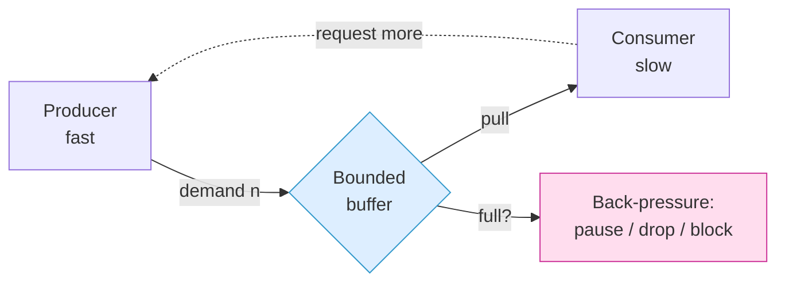
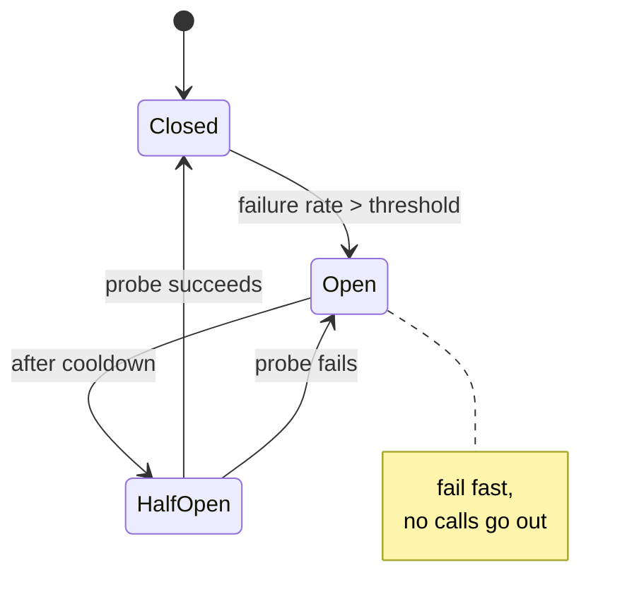

# Async & Functional — Senior Level

> Focus: "How do we run async at team scale without melting the event loop?" — back-pressure protocols, bounded concurrency, resilient async pipelines, structured concurrency, idempotency, deterministic async testing, and the lint rules that keep a 30-engineer codebase from drowning in floating promises.

---

## Table of Contents

1. [The senior mental model: async is a flow-control problem](#the-senior-mental-model-async-is-a-flow-control-problem)
2. [Back-pressure: the Reactive Streams protocol](#back-pressure-the-reactive-streams-protocol)
3. [Event-loop health and starvation monitoring](#event-loop-health-and-starvation-monitoring)
4. [Bounded concurrency patterns](#bounded-concurrency-patterns)
5. [Resilience in async pipelines: timeout, retry, circuit-breaker](#resilience-in-async-pipelines-timeout-retry-circuit-breaker)
6. [Structured concurrency at scale](#structured-concurrency-at-scale)
7. [Idempotency for retried async work](#idempotency-for-retried-async-work)
8. [Testing async code deterministically](#testing-async-code-deterministically)
9. [Team conventions and lint enforcement](#team-conventions-and-lint-enforcement)
10. [Common Mistakes](#common-mistakes)
11. [Test Yourself](#test-yourself)
12. [Cheat Sheet](#cheat-sheet)
13. [Summary](#summary)
14. [Further Reading](#further-reading)
15. [Related Topics](#related-topics)

---

## The senior mental model: async is a flow-control problem

Juniors learn that async is about *not blocking*. Seniors learn that the hard part is **what happens when the producer is faster than the consumer**. Every async incident at scale reduces to one of three failure modes:

| Failure mode | Symptom | Root cause |
|---|---|---|
| **Unbounded buffering** | Memory climbs until OOM | Producer outpaces consumer; queue has no limit |
| **Loop starvation** | p99 latency spikes; health checks time out | A CPU-bound task or sync I/O hogs the single-threaded loop |
| **Leaked work** | Zombie requests, double-charges, dangling connections | Cancellation never propagates; a task outlives its parent |

The unifying lens is **flow control**: a healthy async system regulates the rate at which work enters faster than it can leave. The rest of this document is a toolkit for imposing that regulation — at the stream level (back-pressure), the task level (bounded concurrency), the failure level (timeouts/retries), and the lifecycle level (structured concurrency).



The arrow that matters is the dashed one: the consumer signals demand *upstream*. A system without that feedback channel is not async-at-scale; it is a memory leak waiting for traffic.

---

## Back-pressure: the Reactive Streams protocol

Back-pressure is the mechanism by which a slow consumer tells a fast producer "slow down." Without it, an unbounded queue grows until the process dies. The **Reactive Streams** specification (adopted into `java.util.concurrent.Flow`, RxJS, and Project Reactor) standardizes this as a four-interface protocol built on *demand signalling*: the subscriber calls `request(n)`, and the publisher may emit at most `n` items.

### The contract in one diagram

| Signal | Direction | Meaning |
|---|---|---|
| `subscribe` | consumer → producer | "I want to receive" |
| `request(n)` | consumer → producer | "I can handle `n` more items" |
| `onNext(item)` | producer → consumer | one item (only up to outstanding demand) |
| `onError` / `onComplete` | producer → consumer | terminal |
| `cancel` | consumer → producer | "stop; release resources" |

The producer is **forbidden** from emitting more than the cumulative requested amount. That single rule is what bounds memory.

### Reactor / RxJS

In Project Reactor and RxJS, operators carry back-pressure for you. The senior skill is choosing the **overflow strategy** when a buffer would be needed:

```typescript
import { interval } from 'rxjs';
import { onBackpressureBuffer } from 'rxjs/operators'; // conceptual; RxJS uses sampling/throttling operators

// Reactor (Java/Kotlin) overflow strategies — the choice is a product decision:
//   onBackpressureBuffer(maxSize)  -> bounded queue, then error/drop
//   onBackpressureDrop()           -> drop newest when consumer is behind (metrics, telemetry)
//   onBackpressureLatest()         -> keep only the most recent (live dashboards)
//   onBackpressureError()          -> fail fast (financial events that must not be dropped)
```

The strategy encodes intent: dropping a telemetry sample is fine; dropping a payment event is a bug. **Default behaviour (unbounded buffer) is almost never correct** — it just defers the OOM.

### asyncio flow control

Python's `asyncio` does not expose Reactive Streams, but the same protocol exists in two primitives:

- **`asyncio.Queue(maxsize=N)`** — `await queue.put()` *blocks* the producer when full. That blocking *is* back-pressure. A `maxsize=0` (unbounded) queue is the `asyncio` equivalent of forgetting back-pressure entirely.
- **Streams protocol** — `StreamWriter.write()` plus `await writer.drain()`. `drain()` pauses the writer until the OS send buffer has room. Code that calls `write()` in a loop *without* `drain()` is a classic unbounded-buffer bug.

```python
import asyncio

async def produce(queue: asyncio.Queue[bytes]) -> None:
    async for chunk in upstream():
        await queue.put(chunk)   # blocks here when consumer lags — this is back-pressure
    await queue.put(None)        # sentinel

async def consume(queue: asyncio.Queue[bytes]) -> None:
    while (chunk := await queue.get()) is not None:
        await slow_write(chunk)
        queue.task_done()

async def main() -> None:
    queue: asyncio.Queue[bytes] = asyncio.Queue(maxsize=100)  # the bound is the point
    async with asyncio.TaskGroup() as tg:                     # structured concurrency
        tg.create_task(produce(queue))
        tg.create_task(consume(queue))
```

### Go: channels are back-pressure

In Go, a bounded channel `make(chan T, n)` *is* the protocol. Send blocks when the buffer is full; that block propagates pressure to the goroutine upstream. An unbuffered channel (`make(chan T)`) is maximum back-pressure: the sender waits for a receiver. The mistake is spawning a goroutine per send to "avoid blocking" — that converts a bounded channel back into an unbounded goroutine pile.

---

## Event-loop health and starvation monitoring

In single-threaded runtimes (Node.js, a single `asyncio` loop), **one slow synchronous block delays every other task**. At team scale you must *measure* this, not assume it.

### Node.js: event-loop lag and utilization

```typescript
import { monitorEventLoopDelay } from 'node:perf_hooks';

const histogram = monitorEventLoopDelay({ resolution: 20 }); // sample every 20ms
histogram.enable();

setInterval(() => {
  const p99Ms = histogram.percentile(99) / 1e6; // nanoseconds -> ms
  if (p99Ms > 100) {
    logger.warn({ p99Ms }, 'event loop lag — something is blocking the loop');
  }
  histogram.reset();
}, 10_000);
```

`perf_hooks.eventLoopUtilization()` complements this: a utilization near `1.0` means the loop never idles — you are CPU-bound and need to offload. Export both as metrics; alert on event-loop lag p99, not just request latency, because lag is the *leading* indicator.

### The cure for CPU-bound work

A senior never runs a CPU-bound loop (JSON parse of a 50 MB body, bcrypt, image resize, regex catastrophic backtracking) directly on the loop. Offload it:

| Runtime | Offload mechanism |
|---|---|
| Node.js | `worker_threads`, or `Piscina` worker pool; native addons release the loop |
| Python `asyncio` | `loop.run_in_executor(pool, fn)` for blocking calls; `ProcessPoolExecutor` for CPU |
| Go | not applicable — the scheduler is multi-threaded (`GOMAXPROCS`); back-pressure still matters |

```python
import asyncio
from concurrent.futures import ProcessPoolExecutor

_pool = ProcessPoolExecutor(max_workers=4)

async def handle(request) -> Response:
    loop = asyncio.get_running_loop()
    # CPU-bound work runs in a separate process; the loop stays responsive
    digest = await loop.run_in_executor(_pool, expensive_hash, request.body)
    return Response(digest)
```

---

## Bounded concurrency patterns

"Fire off a request per item in a 10,000-element array" is the most common production outage I review. It opens 10,000 sockets, exhausts the file-descriptor limit, and trips the downstream's rate limiter. The fix is a **concurrency bound**.

### Semaphores and limiters

```typescript
import pLimit from 'p-limit';

const limit = pLimit(10); // at most 10 in flight at once

// WRONG: unbounded fan-out
// await Promise.all(ids.map(id => fetchUser(id)));

// RIGHT: bounded fan-out, same ergonomics
const users = await Promise.all(
  ids.map((id) => limit(() => fetchUser(id))),
);
```

```python
import asyncio

sem = asyncio.Semaphore(10)

async def bounded_fetch(id: str) -> User:
    async with sem:                 # acquire a slot; blocks past 10 concurrent
        return await fetch_user(id)

users = await asyncio.gather(*(bounded_fetch(i) for i in ids))
```

```go
// Go: errgroup with SetLimit is the idiomatic bounded worker pool.
g, ctx := errgroup.WithContext(ctx)
g.SetLimit(10)                       // at most 10 goroutines run concurrently
for _, id := range ids {
    id := id
    g.Go(func() error { return fetchUser(ctx, id) })
}
if err := g.Wait(); err != nil {     // first error cancels ctx for the rest
    return err
}
```

### Choosing the bound

The bound is not arbitrary. It is derived from the *downstream's* capacity, not yours:

- Database: bound by the **connection pool size**. Concurrency above pool size just queues on the pool — pointless and confusing.
- HTTP API: bound by the partner's **rate limit** (and respect `Retry-After`).
- Internal service: bound by its measured **saturation point** (Little's Law: `concurrency = throughput × latency`).

> **Senior rule:** every queue and every worker pool has an explicit, justified maximum. "Unbounded" is a decision you must defend in review, never a default.

---

## Resilience in async pipelines: timeout, retry, circuit-breaker

A network call that *can* hang *will* hang. At scale, the danger is **resource exhaustion through waiting**: 5,000 requests each blocked on a dead dependency hold 5,000 sockets and 5,000 stack frames.

### Timeouts: the non-negotiable

Every outbound call gets a timeout. No exceptions. The modern idiom is `AbortSignal.timeout` (JS) and `context.WithTimeout` (Go); Python uses `asyncio.timeout`.

```typescript
// AbortSignal.timeout(ms) — cancels the fetch and rejects after the deadline.
const res = await fetch(url, { signal: AbortSignal.timeout(2_000) });
```

```python
async with asyncio.timeout(2.0):     # raises TimeoutError, cancels the awaited work
    res = await client.get(url)
```

### Retry with backoff and jitter

Retries amplify load. Naive fixed-interval retries from thousands of clients create a **thundering herd** that keeps the dependency down. Always use exponential backoff *with jitter*:

```python
import asyncio, random

async def with_retry(fn, *, attempts=4, base=0.1, cap=5.0):
    for i in range(attempts):
        try:
            return await fn()
        except TransientError:
            if i == attempts - 1:
                raise
            # full jitter: spread retries to avoid synchronized stampede
            delay = min(cap, base * 2 ** i) * random.random()
            await asyncio.sleep(delay)
```

Two rules seniors enforce: **only retry idempotent or idempotency-keyed operations** (see next section), and **retry only transient errors** (timeouts, 503, connection reset) — never a 400 or 422, which will fail identically forever.

### Circuit breaker

When a dependency is down, stop calling it. A circuit breaker tracks the failure rate; after a threshold it *opens* and fails fast for a cooldown, then *half-opens* to probe recovery. This converts a slow cascading failure into a fast, contained one and gives the dependency room to recover.



Libraries: `opossum` (Node), `pybreaker` (Python), `sony/gobreaker` (Go), Resilience4j (JVM). The ordering in the pipeline matters: **timeout → retry → circuit-breaker → bulkhead (concurrency limit)**, from innermost to outermost.

---

## Structured concurrency at scale

The defining bug of unstructured async is the **orphaned task**: you spawn work, lose the handle, and it runs (or fails silently) after its logical parent is gone. Structured concurrency makes task lifetimes follow lexical scope — like a `try/finally` for concurrency. When the scope exits, all child tasks are guaranteed finished or cancelled.

| Runtime | Primitive | Guarantee on scope exit |
|---|---|---|
| Python 3.11+ | `asyncio.TaskGroup` | all tasks complete; first exception cancels siblings and propagates as `ExceptionGroup` |
| Go | `errgroup.Group` + `context` | `Wait()` blocks for all; first error cancels the shared `ctx` |
| JS/TS | `AbortController` + `Promise.all` (convention, no built-in nursery) | manual: pass `signal` everywhere, abort on first failure |
| Trio (Python) | `nursery` (the original design) | strict: no task escapes the nursery block |

### Cancellation propagation

The companion discipline is **always pass the cancellation token**. In Go this is `ctx context.Context` as the first parameter of every blocking function — and never storing it on a struct. In JS it is threading `AbortSignal` through every layer down to `fetch`. A function that accepts no cancellation token cannot participate in a timeout or a graceful shutdown.

```go
// The signature itself enforces the discipline: ctx is first, always.
func fetchUser(ctx context.Context, id string) (*User, error) {
    req, _ := http.NewRequestWithContext(ctx, "GET", url(id), nil)
    return doRequest(req) // cancellation flows all the way to the socket
}
```

```typescript
// AbortSignal threads through the call stack; one abort cancels the whole subtree.
async function loadDashboard(signal: AbortSignal) {
  const [user, stats] = await Promise.all([
    fetchUser(signal),   // each accepts the signal
    fetchStats(signal),
  ]);
  return render(user, stats);
}
const ac = new AbortController();
setTimeout(() => ac.abort(), 5_000);
await loadDashboard(ac.signal);
```

The payoff: graceful shutdown (`SIGTERM` → cancel the root → every in-flight task unwinds cleanly), request-scoped timeouts, and no zombie work surviving a cancelled request.

---

## Idempotency for retried async work

Retries and at-least-once delivery (every real queue: SQS, Kafka, Pub/Sub) mean **the same message will be processed more than once**. If processing has side effects — charge a card, send an email, increment a counter — duplicates corrupt state. Idempotency is the contract that makes "process twice" equal "process once."

### The idempotency-key pattern

The client (or producer) attaches a unique, stable key. The consumer records processed keys and short-circuits duplicates *atomically*.

```python
async def charge(payment_id: str, amount: int, db) -> Receipt:
    async with db.transaction():
        # INSERT ... ON CONFLICT DO NOTHING returns 0 rows if the key already exists.
        inserted = await db.execute(
            "INSERT INTO processed_charges(key) VALUES($1) ON CONFLICT DO NOTHING",
            payment_id,
        )
        if inserted.rowcount == 0:
            return await load_existing_receipt(db, payment_id)  # duplicate -> return prior result
        receipt = await stripe.charge(amount, idempotency_key=payment_id)
        await save_receipt(db, payment_id, receipt)
        return receipt
```

Senior nuances:

- **The dedup check and the side effect must share a transaction** (or use the provider's own idempotency key, as with Stripe). Otherwise a crash between them re-opens the duplicate window.
- **Natural idempotency beats added idempotency.** `SET status = 'shipped'` is idempotent for free; `status = status + 1` is not. Prefer set-to-value over increment-by-delta where you can.
- **Idempotency keys expire.** Store a TTL; you cannot remember every key forever.

This is why retries are safe only on idempotent operations — the two sections are one design, not two.

---

## Testing async code deterministically

Flaky async tests come from **real time and real concurrency** leaking into the test. The senior fix is to control both: inject the clock, control the loop, and assert on completion rather than `sleep`.

### Fake clocks

Never `sleep` in a test to "wait for" a timer. Replace the clock.

```typescript
import { vi } from 'vitest';

test('retries with backoff', async () => {
  vi.useFakeTimers();
  const promise = withRetry(failingFn);     // schedules setTimeout(backoff)
  await vi.runAllTimersAsync();             // advance virtual time instantly
  await expect(promise).rejects.toThrow();
  vi.useRealTimers();
});
```

### Controlling the asyncio loop

```python
import asyncio, pytest

@pytest.mark.asyncio
async def test_bounded_concurrency_blocks_past_limit():
    sem = asyncio.Semaphore(2)
    started: list[int] = []

    async def worker(i):
        async with sem:
            started.append(i)
            await asyncio.sleep(0)   # yield so the test can observe state
    tasks = [asyncio.create_task(worker(i)) for i in range(5)]
    await asyncio.sleep(0)           # let the loop schedule one tick
    assert len(started) <= 2         # at most 2 acquired the semaphore
    await asyncio.gather(*tasks)
```

`pytest-asyncio` (`asyncio_mode = "auto"` in config) runs each test on a fresh loop. For time-dependent code, `aiotools`/`time-machine` or a hand-injected clock keeps tests deterministic.

### Go: deterministic concurrency

Go's race detector (`go test -race`) is the highest-leverage tool here — it catches data races that are invisible in normal runs. For timing, inject a `Clock` interface rather than calling `time.Now()` directly, and use `context` deadlines that the test controls. Avoid `time.Sleep` in tests; synchronize on channels or `sync.WaitGroup` instead.

> **The principle across all three:** a correct async test never depends on wall-clock timing. If removing a `sleep` breaks it, the test was asserting on luck.

---

## Team conventions and lint enforcement

Conventions that aren't enforced by tooling decay. Encode the async discipline in the linter so the build, not a senior reviewer, catches violations.

### TypeScript: `@typescript-eslint`

```jsonc
// .eslintrc — the three rules that prevent the majority of async bugs
{
  "rules": {
    // A promise that is created but never awaited or .catch()-ed.
    "@typescript-eslint/no-floating-promises": "error",
    // An async value used where a sync one is expected (e.g. `if (asyncFn())`).
    "@typescript-eslint/no-misused-promises": "error",
    // An async function that never awaits — usually a missing await bug.
    "@typescript-eslint/require-await": "warn"
  }
}
```

`no-floating-promises` alone eliminates an entire class of silent failures: the unhandled rejection that vanishes because nobody awaited the promise.

### Python

```ini
# ruff / flake8-async catch un-awaited coroutines and blocking calls in async defs.
# Key checks:
#   RUF006  — store a reference to asyncio.create_task() (else it may be GC'd mid-flight)
#   ASYNC100 — blocking call (e.g. time.sleep, requests.get) inside an async function
#   ASYNC230 — open()/blocking I/O inside async — use aiofiles / run_in_executor
```

The `create_task` reference rule (`RUF006`) is subtle and important: a task with no live reference can be garbage-collected before it finishes. Either keep the reference, or — better — use a `TaskGroup`.

### Go: `go vet` and friends

`go vet` flags a `context.Context` not passed through, lost cancel functions, and copied locks. `golangci-lint` with `contextcheck` ensures a child call inherits the parent context, and `noctx` flags HTTP requests built without a context. These mechanize the "always pass cancellation" rule.

### The non-negotiable team rules

1. **No floating promises** — enforced by lint, not review.
2. **Always pass the cancellation token** — `ctx`/`AbortSignal`/timeout reaches every blocking call.
3. **Bound every queue and pool** — `maxsize`/`SetLimit`/`pLimit` with a justified number.
4. **Every outbound call has a timeout.**
5. **Retries only on idempotent operations.**

---

## Common Mistakes

- **Unbounded `Promise.all` / `gather` over a large array.** Opens thousands of connections, exhausts FDs, trips rate limits. Always bound with `p-limit`/semaphore/`errgroup.SetLimit`.
- **Unbounded queues** (`asyncio.Queue()` with no `maxsize`, `make(chan T, 1_000_000)`). Defers the OOM until traffic arrives. Bound it and choose an overflow strategy.
- **CPU-bound work on the event loop.** A 50 MB JSON parse or a tight regex freezes every concurrent request. Offload to a worker/process pool.
- **Floating promises.** A promise created and dropped; its rejection disappears. Enable `no-floating-promises`.
- **Fixed-interval retries without jitter.** Synchronized clients create a thundering herd that keeps the dependency down. Use exponential backoff with full jitter.
- **Retrying non-idempotent operations.** A retried "charge card" double-charges. Add an idempotency key or make the operation naturally idempotent first.
- **No timeout on outbound calls.** One hung dependency exhausts your sockets and threads. Every call gets a deadline.
- **Orphaned tasks.** `create_task` with no reference (may be GC'd) or no structured scope (outlives its parent). Use `TaskGroup`/`errgroup`.
- **Not propagating cancellation.** A function with no `ctx`/`signal` parameter can't be timed out or shut down gracefully — it becomes zombie work.
- **`sleep`-based async tests.** Flaky and slow. Use fake clocks and assert on completion, not elapsed time.

---

## Test Yourself

**1. Your service does `await Promise.all(ids.map(id => fetchOrder(id)))` over 8,000 IDs. It works in staging (50 IDs) and crashes production. Diagnose and fix.**

<details><summary>Answer</summary>

Unbounded fan-out: 8,000 concurrent `fetch` calls exhaust file descriptors and trip the downstream rate limiter. Staging never revealed it because 50 concurrent connections is within limits. Fix with a concurrency bound: `const limit = pLimit(10); await Promise.all(ids.map(id => limit(() => fetchOrder(id))))`. Choose the bound from the downstream's capacity (connection pool size or rate limit), not arbitrarily.

</details>

**2. What does `request(n)` in the Reactive Streams protocol guarantee, and why does it bound memory?**

<details><summary>Answer</summary>

It signals demand from consumer to producer: "I can handle `n` more items." The producer is contractually forbidden from emitting more than the cumulative requested amount via `onNext`. Because the producer can never get ahead of demand, the in-flight buffer is bounded by outstanding demand rather than producer speed — which is exactly what prevents unbounded buffering and OOM.

</details>

**3. Why is event-loop lag a better alert signal than request latency in a Node.js service?**

<details><summary>Answer</summary>

Event-loop lag is a *leading* indicator; request latency is *lagging*. When something blocks the loop (CPU-bound work, sync I/O), lag rises first — every queued callback, including health checks, is delayed before user-visible latency fully degrades. Alerting on `monitorEventLoopDelay` p99 catches the cause before symptoms cascade. High `eventLoopUtilization` (near 1.0) additionally tells you the loop never idles — you're CPU-bound and must offload.

</details>

**4. You add retries to a payment endpoint and start seeing double charges. What's the design fix — and what's the ordering rule?**

<details><summary>Answer</summary>

Retries are only safe on idempotent operations. Add an idempotency key: the client sends a stable `payment_id`; the consumer records processed keys and the charge in one transaction (`INSERT ... ON CONFLICT DO NOTHING` plus the side effect), returning the prior receipt on a duplicate. Or use the provider's idempotency key (Stripe's `idempotency_key`). Ordering rule: the dedup check and the side effect must be atomic, or a crash between them re-opens the duplicate window.

</details>

**5. A teammate writes `asyncio.create_task(background_sync())` and the task sometimes never completes. The linter (`RUF006`) flags it. Why?**

<details><summary>Answer</summary>

`create_task` returns a task the event loop holds only a *weak* reference to. With no strong reference kept, the task can be garbage-collected mid-flight and silently stop. Fix: keep a reference (`self._task = asyncio.create_task(...)`) or, better, run it inside an `asyncio.TaskGroup` so its lifetime is structurally tied to a scope and exceptions propagate instead of vanishing.

</details>

**6. Order these resilience layers from innermost to outermost and justify: circuit-breaker, timeout, concurrency-limit, retry.**

<details><summary>Answer</summary>

`timeout → retry → circuit-breaker → concurrency-limit (bulkhead)`. Timeout is innermost: each individual attempt must be bounded. Retry wraps attempts (each retried attempt still needs its own timeout). The circuit-breaker observes the retried-call outcome to decide whether to fail fast. The bulkhead (concurrency limit) is outermost, capping total simultaneous in-flight calls regardless of the inner logic. Reversed ordering (e.g. retry outside the breaker, or no per-attempt timeout) breaks the guarantees.

</details>

**7. Why does removing a `time.sleep(0.5)` "wait" from an async test usually mean the test was wrong, not the code?**

<details><summary>Answer</summary>

A correct concurrency test synchronizes on *events* (a task completed, a channel closed, a semaphore acquired), not on wall-clock time. A `sleep` asserts "by now it's probably done," which is luck — slower CI makes it flake, faster CI hides real races. The fix is a fake/virtual clock (advance time deterministically) plus assertions on completion (`await gather`, `WaitGroup`, channel receive). Run Go tests with `-race` to catch the data races that timing-based tests mask.

</details>

---

## Cheat Sheet

| Concern | JS/TS | Python | Go |
|---|---|---|---|
| Bounded fan-out | `p-limit` | `asyncio.Semaphore` | `errgroup` + `SetLimit` |
| Bounded queue | array + drain | `asyncio.Queue(maxsize=N)` | `make(chan T, n)` |
| Back-pressure | RxJS / Reactor strategies | `Queue.put` blocks; `writer.drain()` | channel send blocks |
| Timeout | `AbortSignal.timeout(ms)` | `asyncio.timeout(s)` | `context.WithTimeout` |
| Cancellation token | `AbortSignal` | task cancellation / token | `context.Context` (1st arg) |
| Structured concurrency | `AbortController` + `Promise.all` | `asyncio.TaskGroup` | `errgroup` + `ctx` |
| Loop health | `monitorEventLoopDelay` | loop callback timing | scheduler (N/A) |
| Offload CPU work | `worker_threads` / Piscina | `run_in_executor` | goroutines (built-in) |
| Lint discipline | `no-floating-promises` | `RUF006`, `ASYNC100` | `go vet`, `contextcheck` |
| Deterministic tests | fake timers | `pytest-asyncio` + fake clock | `-race`, injected `Clock` |

**Resilience pipeline order (inner → outer):** `timeout → retry(+jitter) → circuit-breaker → bulkhead`.

**Five team rules:** no floating promises · always pass cancellation · bound every queue · timeout every call · retry only idempotent work.

---

## Summary

At team scale, async stops being about "not blocking" and becomes a **flow-control** discipline. The three failure modes — unbounded buffering, loop starvation, and leaked work — each have a structural cure: back-pressure (consumer signals demand upstream), bounded concurrency (every fan-out has a justified maximum), and structured concurrency with propagated cancellation (no task outlives its scope). Resilience layers — timeout, jittered retry, circuit-breaker, bulkhead — compose in a fixed inner-to-outer order, and retries are safe only when the operation is idempotent (or carries an idempotency key inside a transaction). None of this survives contact with a growing team unless it is mechanized: lint rules (`no-floating-promises`, `RUF006`, `contextcheck`) and deterministic, fake-clock tests turn senior judgement into a build gate. The senior contribution is not writing one fast async function — it is making the *whole codebase* incapable of the common async outages.

---

## Further Reading

- **Reactive Streams specification** — the four-interface demand-signalling protocol behind Reactor, RxJS, and `java.util.concurrent.Flow`.
- **Nathaniel J. Smith, "Notes on structured concurrency, or: Go statement considered harmful"** — the essay that motivated Trio nurseries and `asyncio.TaskGroup`.
- **Project Reactor reference: back-pressure and overflow strategies** — `onBackpressureBuffer/Drop/Latest/Error` semantics.
- **Marc Brooker (AWS), "Timeouts, retries, and backoff with jitter"** — why full jitter beats fixed intervals at scale.
- **Michael Nygard, *Release It!*** — circuit breakers, bulkheads, and timeouts as first-class architecture.
- **Node.js `perf_hooks` docs** — `monitorEventLoopDelay` and `eventLoopUtilization`.
- **Stripe API: idempotent requests** — a production reference design for idempotency keys.

---

## Related Topics

- [junior.md](junior.md) — async fundamentals: promises, `async/await`, callbacks vs. composition.
- [middle.md](middle.md) — composing async correctly, error propagation, avoiding callback hell.
- [professional.md](professional.md) — applying async patterns in real features and services.
- [Chapter README](../README.md) — the positive Async & Functional rules.
- [Concurrency](../11-concurrency/README.md) — threads, locks, and shared-state coordination underneath async.
- [Error Handling](../06-error-handling/README.md) — error propagation, which feeds retry and circuit-breaker decisions.
- [Functional Programming](../../functional-programming/README.md) — purity and immutability that make async code safe to retry and reason about.
- [Anti-Patterns](../../anti-patterns/README.md) — the inverse: async-without-backpressure, callback hell, dropped futures.
