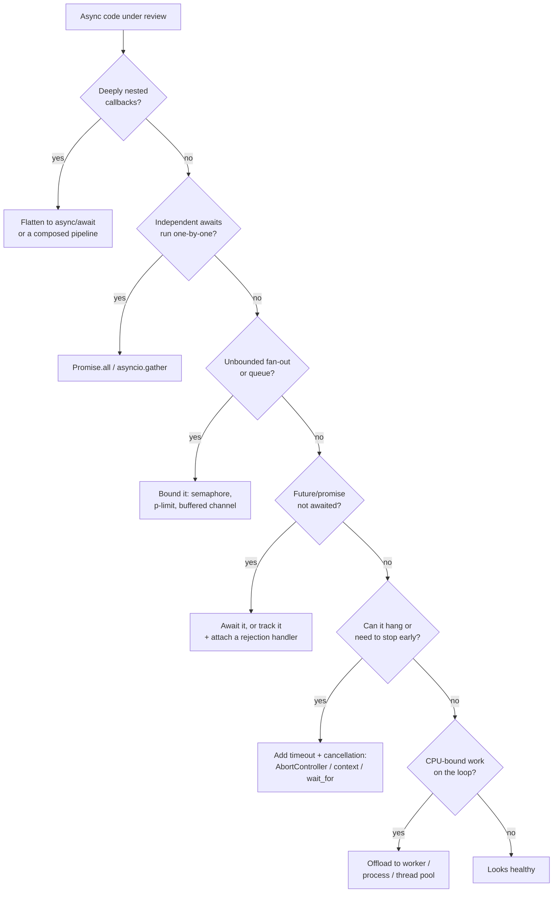

# Async & Functional — Practice Tasks

> 12 hands-on exercises on writing correct, composable asynchronous code. Each task gives a scenario, problematic code (JS/TS, Python `asyncio`, or Go — varied), an instruction, and a collapsible full solution with the reasoning that makes it correct. Ordered easy → hard.

---

## Table of Contents

1. [Flatten callback hell into async/await (JS)](#task-1--flatten-callback-hell-easy)
2. [Parallelize independent sequential awaits (JS)](#task-2--parallelize-independent-awaits-easy)
3. [Gather independent coroutines (Python)](#task-3--gather-independent-coroutines-easy)
4. [Stop swallowing/dropping a future (Python)](#task-4--stop-dropping-a-future-medium)
5. [Fix the unhandled rejection (JS)](#task-5--fix-the-unhandled-rejection-medium)
6. [Add timeout + cancellation with AbortController (JS)](#task-6--timeout--cancellation-medium)
7. [Add cancellation with context (Go)](#task-7--cancellation-with-context-medium)
8. [Bound concurrency with a semaphore / p-limit (JS)](#task-8--bound-concurrency-medium)
9. [Back-pressure on a producer/consumer pipe (Go)](#task-9--back-pressure-with-a-bounded-channel-hard)
10. [Move CPU-bound work off the event loop (Python)](#task-10--get-cpu-bound-work-off-the-loop-hard)
11. [Aggregate errors with allSettled-style results (JS)](#task-11--aggregate-errors-instead-of-failing-fast-hard)
12. [Build an async map/filter pipeline over a stream (JS)](#task-12--async-mapfilter-pipeline-hard)

---

## How to Use

1. Read the scenario and the broken code. Predict *what goes wrong at runtime* before reading the instruction — latency, a crash, a leak, or a silently-swallowed error.
2. Write your fix. Keep behaviour identical except for the defect being repaired.
3. Open the solution, compare, and read the reasoning. The reasoning is the point — the diff is easy, knowing *why the original was a bug* is the skill.
4. The decision tree below routes each smell to the technique that removes it.



---

## Task 1 — Flatten Callback Hell (Easy)

**Scenario:** A Node.js handler reads a user, then their cart, then prices each item, then writes an order — each step depending on the previous. It was written with nested callbacks and is now unreadable and hard to error-handle.

```javascript
function checkout(userId, callback) {
  getUser(userId, (err, user) => {
    if (err) return callback(err);
    getCart(user.id, (err, cart) => {
      if (err) return callback(err);
      priceItems(cart.items, (err, priced) => {
        if (err) return callback(err);
        createOrder(user, priced, (err, order) => {
          if (err) return callback(err);
          callback(null, order);
        });
      });
    });
  });
}
```

**Instruction:** Promisify the leaf functions and rewrite `checkout` as a flat `async` function. Errors should propagate via a single `try`/`catch` (or just by being thrown), not four manual `if (err)` branches.

<details><summary>Solution</summary>

```javascript
import { promisify } from "node:util";

const getUserAsync = promisify(getUser);
const getCartAsync = promisify(getCart);
const priceItemsAsync = promisify(priceItems);
const createOrderAsync = promisify(createOrder);

async function checkout(userId) {
  const user = await getUserAsync(userId);
  const cart = await getCartAsync(user.id);
  const priced = await priceItemsAsync(cart.items);
  return createOrderAsync(user, priced);
}
```

**Reasoning.** The dependency chain is genuinely sequential — each call needs the previous result — so `await`-ing in sequence is correct, not a parallelization miss. What `async`/`await` removes is the *pyramid*: the four `if (err) return callback(err)` lines collapse into normal exception propagation. A rejected promise throws out of `checkout`, so the caller's `try`/`catch` (or `.catch`) handles every failure in one place. The control flow now reads top-to-bottom like synchronous code, which is the whole point of un-nesting. Note `checkout` no longer takes a `callback` — returning a promise is the modern contract, and it composes with everything else.

</details>

---

## Task 2 — Parallelize Independent Awaits (Easy)

**Scenario:** A dashboard endpoint fetches three things that do not depend on each other: the user profile, their notifications, and the current feature flags. It `await`s them one after another, so the request takes the *sum* of three round-trips instead of the *max*.

```javascript
async function loadDashboard(userId) {
  const profile = await fetchProfile(userId);       // 120 ms
  const notifications = await fetchNotifications(userId); // 90 ms
  const flags = await fetchFeatureFlags();          // 60 ms
  return { profile, notifications, flags };          // ~270 ms total
}
```

**Instruction:** Make the three independent requests run concurrently so total latency is ~max(120, 90, 60) ≈ 120 ms. Keep the return shape identical.

<details><summary>Solution</summary>

```javascript
async function loadDashboard(userId) {
  const [profile, notifications, flags] = await Promise.all([
    fetchProfile(userId),
    fetchNotifications(userId),
    fetchFeatureFlags(),
  ]);
  return { profile, notifications, flags };
}
```

**Reasoning.** `await` on a separate line forces *serialization*: the next promise is not even created until the previous resolves. Because none of these three calls reads another's result, that ordering buys nothing — it only stacks latency. `Promise.all` starts all three immediately (the functions are invoked synchronously when the array is built) and resolves once all settle, so wall-clock time drops to the slowest leg. The cost: `Promise.all` is fail-fast — the first rejection rejects the whole thing. That is the right default here; if you need partial success, see [Task 11](#task-11--aggregate-errors-instead-of-failing-fast-hard).

A common trap is "concurrent assignment" that is secretly serial:

```javascript
// STILL serial — the await happens before the next line runs
const profile = await fetchProfile(userId);
const notifications = await fetchNotifications(userId);
```

Kicking off the promises first and awaiting later also works, but `Promise.all` is clearer and propagates rejections correctly:

```javascript
const pProfile = fetchProfile(userId);        // started now
const pFlags = fetchFeatureFlags();           // started now
const profile = await pProfile;               // but an unawaited rejection here can warn
```

</details>

---

## Task 3 — Gather Independent Coroutines (Python)

**Scenario:** A Python service enriches an order by calling three downstream services. The current code `await`s them sequentially inside a loop-free function.

```python
import asyncio

async def enrich_order(order_id: int) -> dict:
    customer = await fetch_customer(order_id)
    inventory = await fetch_inventory(order_id)
    shipping = await fetch_shipping_quote(order_id)
    return {"customer": customer, "inventory": inventory, "shipping": shipping}
```

**Instruction:** Run the three coroutines concurrently with `asyncio.gather`. Then add a variant that does *not* abort the others if one fails.

<details><summary>Solution</summary>

```python
import asyncio

async def enrich_order(order_id: int) -> dict:
    customer, inventory, shipping = await asyncio.gather(
        fetch_customer(order_id),
        fetch_inventory(order_id),
        fetch_shipping_quote(order_id),
    )
    return {"customer": customer, "inventory": inventory, "shipping": shipping}
```

Fail-fast is the default: the first exception propagates out of `gather`, and the *other* tasks keep running in the background unless you cancel them. If you instead want every result, successes and failures alike:

```python
async def enrich_order_lenient(order_id: int) -> dict:
    results = await asyncio.gather(
        fetch_customer(order_id),
        fetch_inventory(order_id),
        fetch_shipping_quote(order_id),
        return_exceptions=True,   # exceptions become return values, not raises
    )
    keys = ("customer", "inventory", "shipping")
    out = {}
    for key, result in zip(keys, results):
        if isinstance(result, Exception):
            out[key] = None  # or log / record the error per field
        else:
            out[key] = result
    return out
```

**Reasoning.** `gather` schedules every awaitable as a task and runs them on the one event loop, overlapping their I/O waits — that is where the speedup comes from (it is concurrency, not parallelism; CPU work would still serialize — see [Task 10](#task-10--get-cpu-bound-work-off-the-loop-hard)). The subtlety teams get wrong: with default `gather`, a raised exception propagates immediately but the sibling tasks are *not* cancelled, so they can leak or finish into a dropped result. In Python 3.11+, prefer `asyncio.TaskGroup`, which cancels remaining tasks on the first failure and raises an `ExceptionGroup`:

```python
async def enrich_order_tg(order_id: int) -> dict:
    async with asyncio.TaskGroup() as tg:
        c = tg.create_task(fetch_customer(order_id))
        i = tg.create_task(fetch_inventory(order_id))
        s = tg.create_task(fetch_shipping_quote(order_id))
    return {"customer": c.result(), "inventory": i.result(), "shipping": s.result()}
```

`return_exceptions=True` is the explicit "I want partial results" switch — use it only when a missing field is acceptable.

</details>

---

## Task 4 — Stop Dropping a Future (Medium)

**Scenario:** A worker fires off an audit-log write but never awaits it. Under `asyncio`, calling a coroutine without awaiting it produces a coroutine object that is **never scheduled** — the audit write silently never happens, and Python emits a `RuntimeWarning: coroutine was never awaited`.

```python
async def handle_request(req):
    result = process(req)
    log_audit_event(req.user, "processed", result)  # BUG: coroutine created, never awaited
    return result
```

**Instruction:** The audit write is fire-and-forget (we don't want to block the response on it), but it must actually run and its failures must not vanish. Fix it so the coroutine is scheduled and any exception is observed.

<details><summary>Solution</summary>

```python
import asyncio
import logging

logger = logging.getLogger(__name__)

# Hold strong references so the GC can't collect a running task mid-flight.
_background_tasks: set[asyncio.Task] = set()

def _spawn(coro) -> None:
    task = asyncio.create_task(coro)
    _background_tasks.add(task)
    task.add_done_callback(_background_tasks.discard)
    task.add_done_callback(_log_if_failed)

def _log_if_failed(task: asyncio.Task) -> None:
    if task.cancelled():
        return
    exc = task.exception()
    if exc is not None:
        logger.error("background task failed", exc_info=exc)

async def handle_request(req):
    result = await process(req)
    _spawn(log_audit_event(req.user, "processed", result))  # scheduled, fire-and-forget
    return result
```

**Reasoning.** Three distinct bugs hide in the original line:

1. **Never scheduled.** A bare `log_audit_event(...)` only *constructs* a coroutine. Without `await` or `create_task`, the event loop never runs it, so the audit write doesn't occur at all. `create_task` is what hands it to the loop.
2. **GC eviction.** `asyncio` keeps only a *weak* reference to a task. If you don't keep a strong reference, the task can be garbage-collected and cancelled before it finishes — hence the `_background_tasks` set, with `discard` on completion so it doesn't leak references forever.
3. **Swallowed exception.** A failing task's exception is only surfaced when someone calls `task.exception()` / awaits it. Fire-and-forget tasks have no awaiter, so the failure is invisible. The `add_done_callback` retrieves and logs it.

`process` was also missing its `await` — fixed here. The shape "spawn, track in a set, log on done" is the standard safe fire-and-forget idiom; if the work must complete before shutdown, await the set during graceful teardown instead.

</details>

---

## Task 5 — Fix the Unhandled Rejection (Medium)

**Scenario:** A route handler kicks off a non-critical cache warm in the background. The rejection is never handled, so Node logs `UnhandledPromiseRejection` and — on modern Node — crashes the process.

```javascript
app.post("/products/:id", async (req, res) => {
  const product = await saveProduct(req.params.id, req.body);
  warmCache(product);   // BUG: returns a promise; if it rejects, nothing catches it
  res.json(product);
});
```

**Instruction:** `warmCache` is best-effort — a failure must not crash the process or fail the request — but it must be logged. Fix the unhandled rejection. Also explain why `res.json` running before the cache warm is intentional here.

<details><summary>Solution</summary>

```javascript
app.post("/products/:id", async (req, res, next) => {
  try {
    const product = await saveProduct(req.params.id, req.body);

    // Fire-and-forget, but the rejection is handled so it can never go unhandled.
    warmCache(product).catch((err) => {
      logger.warn("cache warm failed", { productId: product.id, err });
    });

    res.json(product);
  } catch (err) {
    next(err); // saveProduct failing IS request-critical — surface it
  }
});
```

**Reasoning.** Any promise you create must have a consumer that handles rejection — either `await` it, attach `.catch`, or pass it to a sink that does. Here `warmCache(product)` produced a "floating" promise: nothing awaited it, nothing caught it. An attached `.catch` converts the floating promise into a handled one, downgrading a process-killing `unhandledRejection` into a logged warning. We deliberately *don't* `await warmCache` — the client shouldn't wait on a non-critical side effect, and warming the cache after responding is the correct ordering. By contrast, `saveProduct` *is* critical, so it stays awaited inside `try`/`catch` and its failure is routed to the Express error handler via `next(err)`. The rule of thumb: critical work is awaited and its errors fail the request; best-effort work is fire-and-forget *with an explicit `.catch`*. A bare floating promise is always a bug.

</details>

---

## Task 6 — Timeout + Cancellation (Medium)

**Scenario:** A function fetches from a slow upstream that occasionally hangs forever. There is no timeout, so requests pile up and exhaust the connection pool. There is also no way for the caller to cancel an in-flight fetch.

```javascript
async function getQuote(symbol) {
  const res = await fetch(`https://quotes.example.com/${symbol}`);
  return res.json();
}
```

**Instruction:** Add a 2-second timeout using `AbortController`, and let the caller pass in their own signal so the fetch is cancellable from outside. On timeout, throw a clear error; make sure the timer is always cleared.

<details><summary>Solution</summary>

```javascript
async function getQuote(symbol, { signal: callerSignal, timeoutMs = 2000 } = {}) {
  const controller = new AbortController();

  // Cancel if the caller cancels...
  callerSignal?.addEventListener("abort", () => controller.abort(callerSignal.reason), {
    once: true,
  });

  // ...or if we time out.
  const timer = setTimeout(() => {
    controller.abort(new DOMException(`getQuote(${symbol}) timed out`, "TimeoutError"));
  }, timeoutMs);

  try {
    const res = await fetch(`https://quotes.example.com/${symbol}`, {
      signal: controller.signal,
    });
    if (!res.ok) throw new Error(`upstream ${res.status}`);
    return await res.json();
  } finally {
    clearTimeout(timer); // always runs — no leaked timer on success, error, or abort
  }
}
```

On Node 18+ / modern browsers you can replace the manual timer with `AbortSignal.timeout` and merge signals with `AbortSignal.any`:

```javascript
async function getQuote(symbol, { signal, timeoutMs = 2000 } = {}) {
  const signals = [AbortSignal.timeout(timeoutMs)];
  if (signal) signals.push(signal);
  const res = await fetch(`https://quotes.example.com/${symbol}`, {
    signal: AbortSignal.any(signals),
  });
  if (!res.ok) throw new Error(`upstream ${res.status}`);
  return res.json();
}
```

**Reasoning.** A bare `fetch` with no `signal` can hang until the OS socket timeout (often tens of seconds), and during that time it holds a connection — that is how one slow upstream drains a pool and stalls everything. `AbortController` gives `fetch` a cancellation channel: aborting the signal makes the in-flight request reject with an `AbortError`. We wire *two* abort sources into one controller — the caller's signal and our timeout — so the request dies on whichever fires first; this is exactly what `AbortSignal.any` does natively. The `finally { clearTimeout }` is load-bearing: without it, a fast success still leaves a dangling timer that keeps the event loop alive (in Node, that delays process exit). Throwing a `TimeoutError` rather than a generic abort lets callers distinguish "took too long" from "user navigated away."

</details>

---

## Task 7 — Cancellation with context (Go)

**Scenario:** A Go function calls a downstream service in a loop with retries. It ignores `context.Context`, so a cancelled or timed-out request keeps retrying and a `Sleep` between retries can't be interrupted — goroutines pile up.

```go
func fetchWithRetry(url string) ([]byte, error) {
    var lastErr error
    for i := 0; i < 5; i++ {
        body, err := doGet(url) // ignores cancellation
        if err == nil {
            return body, nil
        }
        lastErr = err
        time.Sleep(time.Second) // can't be cancelled
    }
    return nil, lastErr
}
```

**Instruction:** Thread a `context.Context` through. Honour cancellation both during the request and during the backoff sleep. Return the context's error when it is cancelled.

<details><summary>Solution</summary>

```go
func fetchWithRetry(ctx context.Context, url string) ([]byte, error) {
    var lastErr error
    backoff := 200 * time.Millisecond

    for attempt := 0; attempt < 5; attempt++ {
        // Bail out immediately if the caller already cancelled.
        if err := ctx.Err(); err != nil {
            return nil, err
        }

        body, err := doGet(ctx, url) // request is cancellable via ctx
        if err == nil {
            return body, nil
        }
        lastErr = err

        // Cancellable backoff: wake on timer OR on cancellation, whichever first.
        timer := time.NewTimer(backoff)
        select {
        case <-ctx.Done():
            timer.Stop()
            return nil, ctx.Err()
        case <-timer.C:
        }
        backoff *= 2 // exponential
    }
    return nil, lastErr
}

func doGet(ctx context.Context, url string) ([]byte, error) {
    req, err := http.NewRequestWithContext(ctx, http.MethodGet, url, nil)
    if err != nil {
        return nil, err
    }
    resp, err := http.DefaultClient.Do(req)
    if err != nil {
        return nil, err
    }
    defer resp.Body.Close()
    return io.ReadAll(resp.Body)
}
```

**Reasoning.** In Go, cancellation is cooperative and travels through `context.Context`. The original code is uncancellable in two ways: `doGet` never sees the context, and `time.Sleep` blocks for a full second no matter what. The fix addresses both. `http.NewRequestWithContext` ties the HTTP request's lifetime to `ctx`, so cancelling the context aborts the in-flight call. The `select` over `<-ctx.Done()` and `<-timer.C` turns the dumb sleep into an interruptible wait — if the caller's deadline passes mid-backoff, we return `ctx.Err()` (`context.Canceled` or `context.DeadlineExceeded`) instead of sleeping pointlessly. The leading `ctx.Err()` check short-circuits when we were cancelled before even starting an attempt. `timer.Stop()` on the cancellation path avoids leaking a timer goroutine. The caller controls the deadline: `ctx, cancel := context.WithTimeout(parent, 5*time.Second); defer cancel()`.

</details>

---

## Task 8 — Bound Concurrency (Medium)

**Scenario:** A migration script processes 50,000 records by calling an external API for each. The author "parallelized" it with `Promise.all` over the whole array — opening 50,000 sockets at once, which the API rate-limits and the local machine can't sustain (file-descriptor exhaustion, OOM).

```javascript
async function migrateAll(records) {
  return Promise.all(records.map((r) => migrateOne(r))); // 50,000 concurrent calls
}
```

**Instruction:** Cap concurrency at, say, 10 in-flight requests. Implement it two ways: with the `p-limit` library, and from scratch with a simple worker-pool so you understand the mechanism.

<details><summary>Solution</summary>

With `p-limit`:

```javascript
import pLimit from "p-limit";

async function migrateAll(records, concurrency = 10) {
  const limit = pLimit(concurrency);
  return Promise.all(records.map((r) => limit(() => migrateOne(r))));
}
```

From scratch — a fixed pool of workers draining a shared cursor:

```javascript
async function migrateAll(records, concurrency = 10) {
  const results = new Array(records.length);
  let cursor = 0;

  async function worker() {
    while (cursor < records.length) {
      const i = cursor++;            // claim an index (single-threaded, so no race)
      results[i] = await migrateOne(records[i]);
    }
  }

  const workers = Array.from({ length: Math.min(concurrency, records.length) }, worker);
  await Promise.all(workers);
  return results;
}
```

**Reasoning.** `Promise.all(array.map(fn))` starts *every* task synchronously — the array of promises is fully materialized before a single one resolves. That is the right tool for a handful of known requests ([Task 2](#task-2--parallelize-independent-awaits-easy)) and a footgun for an unbounded collection: it ignores back-pressure entirely, so you DOS your own dependency and run the machine out of sockets/memory. Bounding concurrency keeps a fixed *window* of work in flight. `p-limit` wraps each task so that no more than `concurrency` run at once; the rest queue. The hand-rolled version makes the mechanism explicit: spawn exactly `concurrency` workers, each pulling the next index off a shared cursor until the list is exhausted. Because JavaScript is single-threaded, `cursor++` is atomic — no lock needed. This is the foreground analogue of [Task 9](#task-9--back-pressure-with-a-bounded-channel-hard)'s bounded channel: the constant is the *number of in-flight operations*, which is what protects both ends.

</details>

---

## Task 9 — Back-pressure with a Bounded Channel (Hard)

**Scenario:** A Go pipeline reads lines from a fast source and ships each to a slow uploader via a goroutine-per-line. With an unbounded buffer (or a goroutine per item), a fast producer outruns the slow consumer, memory balloons, and the program can OOM. There is no back-pressure.

```go
func pipeline(lines []string) {
    for _, line := range lines {
        go upload(line) // unbounded: spawns one goroutine per line, no limit
    }
}
```

**Instruction:** Replace the unbounded fan-out with a bounded worker pool fed by a buffered channel, so the producer *blocks* when consumers are saturated. Propagate the first error and stop. Use a small, fixed number of workers.

<details><summary>Solution</summary>

```go
func pipeline(ctx context.Context, lines []string, workers int) error {
    jobs := make(chan string, workers) // small buffer == back-pressure point
    g, ctx := errgroup.WithContext(ctx)

    // Workers: bounded consumers.
    for i := 0; i < workers; i++ {
        g.Go(func() error {
            for line := range jobs {
                if err := upload(ctx, line); err != nil {
                    return err // errgroup cancels ctx, siblings unwind
                }
            }
            return nil
        })
    }

    // Producer: blocks on a full channel — that IS the back-pressure.
    g.Go(func() error {
        defer close(jobs)
        for _, line := range lines {
            select {
            case jobs <- line:
            case <-ctx.Done():
                return ctx.Err() // stop feeding if a worker failed
            }
        }
        return nil
    })

    return g.Wait()
}
```

**Reasoning.** "A goroutine per item" is the Go form of unbounded fan-out: cheap as goroutines are, a million in-flight uploads still means a million buffers and sockets — memory grows with the input, not with what the downstream can absorb. The fix decouples the producer from a *fixed* set of consumers through a **buffered channel**, and the buffer is intentionally small (`workers`, not `len(lines)`). When all workers are busy and the buffer fills, `jobs <- line` *blocks* the producer. That blocking is back-pressure: the fast side is forced to match the slow side's rate, so memory stays bounded regardless of input size. `errgroup` gives coordinated shutdown — the first worker to return an error cancels the shared `ctx`, the producer's `select` sees `ctx.Done()` and stops feeding, the workers drain and exit, and `g.Wait()` returns that first error. `defer close(jobs)` lets the `range jobs` loops terminate cleanly once the producer is done. The control knob is `workers`: it caps both concurrency *and* memory.

</details>

---

## Task 10 — Get CPU-bound Work off the Loop (Hard)

**Scenario:** An `asyncio` web service hashes uploaded files with a deliberately expensive KDF (`scrypt`) inside an `async` handler. Because hashing is pure CPU, it blocks the single event loop for hundreds of milliseconds — every other in-flight request stalls, and concurrency collapses to one.

```python
import hashlib

async def store_file(data: bytes) -> str:
    # BUG: CPU-bound, runs ON the event loop, blocks all other coroutines
    digest = hashlib.scrypt(data, salt=SALT, n=2**15, r=8, p=1, dklen=64)
    await db.save(digest.hex(), data)
    return digest.hex()
```

**Instruction:** Move the CPU-bound hashing off the event loop so other coroutines keep progressing. Use a process pool (since this is true CPU work, not I/O). Keep the function's signature and behaviour.

<details><summary>Solution</summary>

```python
import asyncio
import hashlib
from concurrent.futures import ProcessPoolExecutor

# One pool for the process lifetime; sized to CPU cores by default.
_cpu_pool = ProcessPoolExecutor()

def _hash(data: bytes) -> bytes:
    return hashlib.scrypt(data, salt=SALT, n=2**15, r=8, p=1, dklen=64)

async def store_file(data: bytes) -> str:
    loop = asyncio.get_running_loop()
    digest = await loop.run_in_executor(_cpu_pool, _hash, data)  # off-loop
    await db.save(digest.hex(), data)
    return digest.hex()
```

**Reasoning.** `asyncio` runs everything on *one* thread. `await` only yields control at I/O suspension points; a tight CPU loop (or a C extension like `scrypt` that doesn't release work back to the loop) holds the thread for its entire duration. While `hashlib.scrypt` runs, the loop cannot service any other coroutine — throughput drops to one-request-at-a-time and latency spikes across the board. `loop.run_in_executor` hands the work to an executor and returns an awaitable; the coroutine suspends, the loop is freed to run other tasks, and it resumes when the result is ready. The choice of executor matters: a **`ProcessPoolExecutor`** sidesteps the GIL, so the hashing truly runs in parallel on another core — the right choice for CPU-bound work. A `ThreadPoolExecutor` would help only for work that releases the GIL (much I/O and some C extensions) and would still serialize pure-Python CPU work. Reuse one pool (creating processes is expensive) and ensure `_hash` and its arguments are picklable, since process pools serialize across the boundary. In Python 3.9+, `asyncio.to_thread` is the convenient form for the thread-pool case.

</details>

---

## Task 11 — Aggregate Errors Instead of Failing Fast (Hard)

**Scenario:** A status page pings six microservices and renders each one's health. The author used `Promise.all`, so the *first* service that is down throws and the entire page shows an error — even though five services are healthy. They want per-service results: each row shows up or down independently.

```javascript
async function checkAll(services) {
  // BUG: one failure rejects everything; we lose the five successes
  const results = await Promise.all(services.map((s) => ping(s.url)));
  return services.map((s, i) => ({ name: s.name, ok: true, latency: results[i] }));
}
```

**Instruction:** Switch to a strategy that returns *all* outcomes — successes and failures — so the page renders every service's true status. Aggregate the failures into a summary the caller can act on.

<details><summary>Solution</summary>

```javascript
async function checkAll(services) {
  const settled = await Promise.allSettled(services.map((s) => ping(s.url)));

  const report = services.map((s, i) => {
    const r = settled[i];
    return r.status === "fulfilled"
      ? { name: s.name, ok: true, latency: r.value }
      : { name: s.name, ok: false, error: String(r.reason) };
  });

  const failures = report.filter((r) => !r.ok);
  return { report, healthy: failures.length === 0, failures };
}
```

If you're on an older runtime without `allSettled`, the polyfill is just "catch each promise into a tagged result":

```javascript
const reflect = (p) =>
  p.then(
    (value) => ({ status: "fulfilled", value }),
    (reason) => ({ status: "rejected", reason }),
  );

const settled = await Promise.all(services.map((s) => reflect(ping(s.url))));
```

For the case where you want partial success but *also* a single aggregate error to throw if everything matters, `AggregateError` is the standard carrier:

```javascript
if (failures.length === services.length) {
  throw new AggregateError(
    failures.map((f) => new Error(f.error)),
    "all health checks failed",
  );
}
```

**Reasoning.** `Promise.all` is *fail-fast by design*: it rejects on the first rejection and discards the other results. That is correct when the operation is all-or-nothing (you need every piece to proceed). It is wrong here, where each service's status is independent and a single outage shouldn't blank the whole page. `Promise.allSettled` waits for *every* promise to settle and returns a uniform array of `{status, value}` / `{status, reason}` — no result is ever lost. The reflect-into-tagged-object polyfill shows the underlying trick: convert "may reject" into "always resolves to a labelled outcome," which is exactly what neutralizes fail-fast. Choosing between the two is a real design decision: `all` for atomic operations, `allSettled` for independent ones. `AggregateError` is how you re-raise a collection of failures as one when the caller does need to know everything broke.

</details>

---

## Task 12 — Async Map/Filter Pipeline (Hard)

**Scenario:** A log-processing job reads a large file line by line, parses JSON, keeps only `ERROR` entries, enriches each by calling a (slow) geo-IP service, and writes the result. The original loads the whole file into memory, then does the geo-IP calls one at a time — slow *and* memory-hungry. The push-style approach also ignores demand: it pulls every line eagerly regardless of how fast the downstream can write.

```javascript
async function processLogs(path) {
  const text = await fs.promises.readFile(path, "utf8"); // whole file in memory
  const out = [];
  for (const line of text.split("\n")) {
    const entry = JSON.parse(line);
    if (entry.level !== "ERROR") continue;
    entry.geo = await geoIp(entry.ip); // serial, one slow call at a time
    out.push(entry);
  }
  return out;
}
```

**Instruction:** Rebuild this as a *pull-based* async pipeline using async generators: stream lines lazily (so memory stays flat), `filter` to errors, then `map` through the geo-IP enrichment with **bounded** concurrency so demand is respected and the slow service isn't flooded. Compose `filter` and `map` as reusable async-iterator combinators.

<details><summary>Solution</summary>

```javascript
import { createReadStream } from "node:fs";
import { createInterface } from "node:readline";

// --- reusable async-iterator combinators (lazy, pull-based) ---

async function* asyncFilter(source, predicate) {
  for await (const item of source) {
    if (await predicate(item)) yield item;
  }
}

// Bounded-concurrency map that preserves demand: at most `concurrency`
// enrichments run at once; results are yielded as they become available.
async function* asyncMap(source, fn, concurrency = 8) {
  const inFlight = new Set();
  const buffer = [];

  async function pump(item) {
    const value = await fn(item);
    buffer.push(value);
  }

  for await (const item of source) {
    const p = pump(item).finally(() => inFlight.delete(p));
    inFlight.add(p);
    if (inFlight.size >= concurrency) {
      await Promise.race(inFlight); // back-pressure: wait for a slot
    }
    while (buffer.length) yield buffer.shift();
  }
  await Promise.all(inFlight); // drain the tail
  while (buffer.length) yield buffer.shift();
}

// --- the pipeline ---

async function* lines(path) {
  const rl = createInterface({
    input: createReadStream(path, { encoding: "utf8" }),
    crlfDelay: Infinity,
  });
  for await (const line of rl) {
    if (line.trim()) yield line; // lazy: one line at a time, flat memory
  }
}

async function* processLogs(path) {
  const parsed = asyncMap(lines(path), (line) => JSON.parse(line), 1);
  const errorsOnly = asyncFilter(parsed, (e) => e.level === "ERROR");
  const enriched = asyncMap(errorsOnly, async (e) => ({ ...e, geo: await geoIp(e.ip) }), 8);
  yield* enriched;
}

// Consumer pulls at its own rate — demand flows back up the pipeline:
// for await (const entry of processLogs("app.log")) await writeOut(entry);
```

**Reasoning.** Two defects, two fixes. **Memory:** `readFile` materializes the whole file; `readline` over a stream yields one line at a time, so memory is O(longest line), not O(file). Async generators are *pull-based* — nothing is read until the consumer asks for the next value with `for await`, so a slow writer naturally throttles the reader. That is demand propagation: back-pressure for free, the inverse of a push stream that floods you. **Latency:** the serial `await geoIp` made throughput equal to the sum of every geo call. `asyncMap` runs up to `concurrency` enrichments at once and uses `Promise.race(inFlight)` to wait for a free slot before pulling the next item — so it overlaps the slow calls *but* still respects demand and never exceeds the bound (the [Task 8](#task-8--bound-concurrency-medium) idea, expressed as a streaming combinator). Building `filter` and `map` as standalone async-generator combinators makes the pipeline read declaratively — `lines → parse → filter errors → enrich` — and each stage is independently testable and reusable. (Note: this `asyncMap` does not preserve input order; if order matters, key results by index and emit in order, or use an ordered library like `p-map`.)

</details>

---

## Self-Assessment

Score yourself honestly. For each, can you do it *without* looking back?

- [ ] **Sequential vs. parallel.** Given a function with several `await`s, I can say which are independent and rewrite those with `Promise.all` / `asyncio.gather` — and explain why the rest must stay serial.
- [ ] **Fail-fast vs. aggregate.** I know when `Promise.all` / `gather` is correct (atomic) and when I want `allSettled` / `return_exceptions=True` / `TaskGroup` (independent), and I can justify the choice.
- [ ] **No floating promises.** I never leave a created promise/coroutine without an awaiter or an explicit error handler, and I can describe what goes wrong if I do (crash, leak, silent drop, never-scheduled).
- [ ] **Cancellation + timeout.** I can add a timeout and external cancellation with `AbortController` (JS), `context` (Go), or `wait_for`/`TaskGroup` (Python), and I always clean up timers/resources in `finally`.
- [ ] **Back-pressure.** I can bound fan-out with a semaphore / `p-limit` / buffered channel, and I can explain why unbounded `Promise.all(...map)` or goroutine-per-item is a memory/DOS hazard.
- [ ] **Off the loop.** I can identify CPU-bound work blocking an event loop and offload it to a worker/process/thread pool, choosing the right executor for the GIL situation.
- [ ] **Pull-based streams.** I can express a transform as composable async-iterator combinators and explain how demand propagates as back-pressure.

If any box is unchecked, redo the matching task from scratch on a blank file.

---

## Related Topics

- [README.md](README.md) — the chapter's positive rules and anti-pattern catalog
- [junior.md](junior.md) — the foundational definitions these tasks build on
- [find-bug.md](find-bug.md) — buggy async snippets where these defects hide
- [optimize.md](optimize.md) — performance-focused async refactors
- [Functional Programming](../../functional-programming/README.md) — composition, immutability, and pipelines that make async code easier to reason about
- [Refactoring](../../refactoring/README.md) — the systematic techniques (Extract Function, Replace Loop with Pipeline) used to reshape the code above
