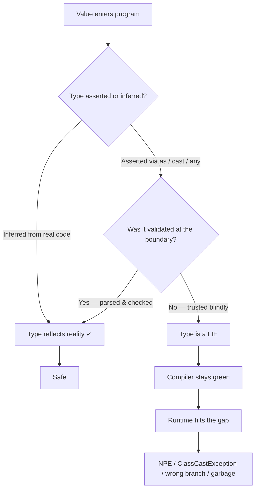

# Generics & Types — Find the Bug

> 12 buggy snippets where a type-system misuse produces a *real* runtime failure — an NPE-equivalent, a `ClassCastException`, an `ArrayStoreException`, a silently-missed union variant, garbage data slipping past a domain type. In every case the code **compiles and the type checker is green**. The type system was lied to, widened, or subverted, and the lie surfaced at runtime. Find where the type and the reality diverge.

---

## Table of Contents

1. [Snippet 1 — `as` cast lies about a shape (TypeScript)](#snippet-1--as-cast-lies-about-a-shape-typescript)
2. [Snippet 2 — `JSON.parse` typed as a domain type (TypeScript)](#snippet-2--jsonparse-typed-as-a-domain-type-typescript)
3. [Snippet 3 — Unchecked cast / raw type → `ClassCastException` (Java)](#snippet-3--unchecked-cast--raw-type--classcastexception-java)
4. [Snippet 4 — Array covariance → `ArrayStoreException` (Java)](#snippet-4--array-covariance--arraystoreexception-java)
5. [Snippet 5 — Non-exhaustive switch silently drops a variant (TypeScript)](#snippet-5--non-exhaustive-switch-silently-drops-a-variant-typescript)
6. [Snippet 6 — Type hint that lies via an `Any` leak (Python)](#snippet-6--type-hint-that-lies-via-an-any-leak-python)
7. [Snippet 7 — `interface{}` round-trip loses the type (Go)](#snippet-7--interface-round-trip-loses-the-type-go)
8. [Snippet 8 — `Number` widening / boxing identity (Java)](#snippet-8--number-widening--boxing-identity-java)
9. [Snippet 9 — Generic method violates an unstated invariant (TypeScript)](#snippet-9--generic-method-violates-an-unstated-invariant-typescript)
10. [Snippet 10 — Optional chaining hides a missing field after a cast (TypeScript)](#snippet-10--optional-chaining-hides-a-missing-field-after-a-cast-typescript)
11. [Snippet 11 — `==` identity vs structural equality (Go / Java)](#snippet-11---identity-vs-structural-equality-go--java)
12. [Snippet 12 — `TypedDict` / `cast` lets `str` masquerade as `int` (Python)](#snippet-12--typeddict--cast-lets-str-masquerade-as-int-python)

---

## How to Use

For each snippet:

1. Read the code. Assume it **compiles cleanly** — `tsc --strict` is green, `javac` emits at most a warning, `mypy --strict` passes, `go build` succeeds.
2. Ask: *where does the static type disagree with the runtime value?* The type checker believed a claim the code never proved.
3. Predict the failure: `undefined`/NPE, wrong branch taken, `ClassCastException`, `ArrayStoreException`, silent corruption, or a metric that lies.
4. Open the answer. It names the bug, explains **why the type system did not catch it** (where the type was widened, asserted, or erased), and gives the fix that re-grounds the type in reality.

The recurring lesson: a type is a *promise*. `as`, `any`, raw types, `interface{}`, unvalidated `JSON.parse`, and unchecked casts all let you make a promise you never keep. The compiler trusts you; the runtime does not.



---

### Snippet 1 — `as` cast lies about a shape (TypeScript)

**Difficulty:** ⭐ Warm-up

```typescript
interface User {
  id: string;
  name: string;
  profile: { avatarUrl: string };
}

function getUser(id: string): User {
  // The API actually returns { id, name } — `profile` is on a separate endpoint.
  const raw = fetchSync(`/users/${id}`); // returns { id: string; name: string }
  return raw as User;
}

function renderAvatar(id: string): string {
  const user = getUser(id);
  return ``;
}
```

**What's wrong?**

<details><summary>Answer</summary>

`getUser` claims its return type is `User`, but the API response has no `profile` field. The `as User` cast tells the compiler "trust me, this is a `User`" — so `tsc` never complains that `profile` is missing.

At runtime, `user.profile` is `undefined`, and `user.profile.avatarUrl` throws:

```
TypeError: Cannot read properties of undefined (reading 'avatarUrl')
```

This is the TypeScript NPE-equivalent. The crash happens in `renderAvatar`, two functions away from the lie in `getUser`.

**Why the type system didn't catch it:** `as` is a *type assertion*, not a *type conversion*. It performs zero runtime work and zero structural checking — it simply overrides the compiler's knowledge. `raw` was `{ id, name }`, but `as User` erased that and substituted the richer type. The compiler had the correct information (`raw` was narrower than `User`) and was forced to discard it.

**The fix:** never `as` across a structural gap. Either parse-and-validate at the boundary, or model the truth.

```typescript
import { z } from "zod";

const UserApiSchema = z.object({ id: z.string(), name: z.string() });

// The API's true shape — no profile.
type UserApi = z.infer<typeof UserApiSchema>;

function getUser(id: string): UserApi {
  const raw = fetchSync(`/users/${id}`);
  return UserApiSchema.parse(raw); // throws here, at the boundary, if the shape is wrong
}

async function renderAvatar(id: string): Promise<string> {
  const user = getUser(id);
  const profile = await fetchProfile(id); // profile is a separate concern — model it as one
  return ``;
}
```

Now the type matches the API, and the missing `profile` is a compile error at `user.profile`, not a runtime crash.
</details>

---

### Snippet 2 — `JSON.parse` typed as a domain type (TypeScript)

**Difficulty:** ⭐⭐ Common in the wild

```typescript
interface Order {
  id: string;
  total: number;     // dollars
  status: "pending" | "paid" | "shipped";
  createdAt: Date;
}

function loadOrder(json: string): Order {
  return JSON.parse(json) as Order;
}

function isOverdue(order: Order): boolean {
  const ageMs = Date.now() - order.createdAt.getTime();
  return order.status === "pending" && ageMs > 7 * 24 * 60 * 60 * 1000;
}

const order = loadOrder('{"id":"A1","total":"49.99","status":"PAID","createdAt":"2026-01-01T00:00:00Z"}');
console.log(isOverdue(order));
```

**What's wrong?**

<details><summary>Answer</summary>

`JSON.parse` returns `any` by design — JSON has no notion of `Date`, of string-literal unions, or of "this number must not be a string". The `as Order` slaps a domain type onto raw deserialized data without checking anything. **Three lies** ride in on that cast:

1. **`createdAt` is a `string`, not a `Date`.** JSON has no date type. At runtime `order.createdAt.getTime` is `undefined`, so `order.createdAt.getTime()` throws `TypeError: order.createdAt.getTime is not a function`.
2. **`total` is the string `"49.99"`, not the number `49.99`.** Any arithmetic (`total * 1.08` for tax) would do string coercion — `"49.99" * 1.08` happens to coerce, but `total + shipping` would concatenate (`"49.995.00"`).
3. **`status` is `"PAID"`, not one of `"pending" | "paid" | "shipped"`.** The literal-union type is violated; the `order.status === "pending"` check silently never matches a `"PAID"` order, so it is treated as not-pending.

`tsc` is green because `as` suppressed all of it.

**Why the type system didn't catch it:** TypeScript types are erased before runtime and `JSON.parse`'s return is `any`. The compiler has *no* information about the parsed bytes — `as Order` is the programmer asserting knowledge they do not have. The domain type (`Date`, the literal union) describes an *in-memory* model that the wire format does not satisfy.

**The fix:** validate and transform at the deserialization boundary. A schema library does the parsing *and* the coercion:

```typescript
import { z } from "zod";

const OrderSchema = z.object({
  id: z.string(),
  total: z.number(),                                  // rejects "49.99" (string)
  status: z.enum(["pending", "paid", "shipped"]),     // rejects "PAID"
  createdAt: z.coerce.date(),                          // ISO string -> Date
});

function loadOrder(json: string): Order {
  return OrderSchema.parse(JSON.parse(json)); // throws on the bad fixture above
}
```

The malformed payload now fails *loudly at the boundary* with a precise message, instead of producing an `Order` that crashes or lies later.
</details>

---

### Snippet 3 — Unchecked cast / raw type → `ClassCastException` (Java)

**Difficulty:** ⭐⭐ Common in the wild

```java
import java.util.*;

public class Cache {
    private final Map store = new HashMap(); // raw type

    public void put(String key, Object value) {
        store.put(key, value);
    }

    @SuppressWarnings("unchecked")
    public <T> T get(String key) {
        return (T) store.get(key); // unchecked cast
    }
}

// Caller:
Cache cache = new Cache();
cache.put("retries", 3);              // an Integer
int retries = cache.<Integer>get("retries");

cache.put("name", "service-a");        // a String
long timeout = cache.<Long>get("name"); // (!) expecting a Long
```

**What's wrong?**

<details><summary>Answer</summary>

`get` is declared `<T> T` and casts with `(T) store.get(key)`. Because of **type erasure**, `(T)` compiles to `(Object)` at the call boundary and the *real* cast is inserted at the use site by the compiler. So `cache.<Long>get("name")` actually compiles to:

```java
long timeout = (Long) cache.get("name"); // ((Object) "service-a") cast to Long
```

`"service-a"` is a `String`. At runtime:

```
java.lang.ClassCastException: class java.lang.String cannot be cast to class java.lang.Long
```

The cache cannot enforce that the `T` requested on `get` matches the type stored on `put` — there is no record of the value's intended type, and the cast is unchecked.

**Why the type system didn't catch it:** two layers conspire. (1) The **raw type** `Map` (instead of `Map<String, Object>`) disables generic checking on `store`. (2) The `@SuppressWarnings("unchecked")` + `(T)` cast is a *promise* the method makes to every caller: "whatever `T` you name, the stored value is one." Erasure means that promise is never verified — the `(T)` cast is a no-op in `get`'s body, and the failing cast is deferred to the assignment, far from `put`.

**The fix:** make the key carry its own type, so the compiler ties `put` and `get` together — the classic typesafe heterogeneous container (Effective Java, Item 33):

```java
public final class TypedKey<T> {
    private final String name;
    private final Class<T> type;
    public TypedKey(String name, Class<T> type) { this.name = name; this.type = type; }
    String name() { return name; }
    Class<T> type() { return type; }
}

public class Cache {
    private final Map<String, Object> store = new HashMap<>();

    public <T> void put(TypedKey<T> key, T value) {
        store.put(key.name(), value);
    }

    public <T> T get(TypedKey<T> key) {
        return key.type().cast(store.get(key.name())); // checked cast — throws at put-time mismatch impossible
    }
}

static final TypedKey<Integer> RETRIES = new TypedKey<>("retries", Integer.class);
// cache.put(RETRIES, "oops") -> compile error: String is not Integer
```

`Class.cast` is a *checked* cast, and `put` requires `T value` to match the key's `T`, so the type the caller gets out is guaranteed to be the type that went in.
</details>

---

### Snippet 4 — Array covariance → `ArrayStoreException` (Java)

**Difficulty:** ⭐⭐⭐ Subtle

```java
public class Inventory {
    static void fillWithDefault(Object[] slots) {
        for (int i = 0; i < slots.length; i++) {
            slots[i] = "EMPTY"; // a String as the default
        }
    }

    public static void main(String[] args) {
        Integer[] partNumbers = new Integer[3];
        fillWithDefault(partNumbers); // compiles fine
        System.out.println(partNumbers[0]);
    }
}
```

**What's wrong?**

<details><summary>Answer</summary>

Java arrays are **covariant**: `Integer[]` is a subtype of `Object[]`, so passing an `Integer[]` where `Object[]` is expected compiles without complaint. Inside `fillWithDefault`, the static type is `Object[]`, so writing a `String` into it type-checks.

But the *runtime* array is still an `Integer[]`. The JVM checks every array store against the array's actual component type, and:

```
java.lang.ArrayStoreException: java.lang.String
```

is thrown at `slots[i] = "EMPTY"`.

**Why the type system didn't catch it:** covariant arrays are a known unsoundness in Java's type system, intentionally traded for expressiveness in the pre-generics era. The compiler accepts the covariant widening (`Integer[]` → `Object[]`), so the write *looks* legal statically. Soundness is recovered only by a runtime store check — which is exactly the `ArrayStoreException`. The type system "didn't catch it" because it deliberately defers this category of error to runtime.

**The fix:** use generic collections, which are *invariant* (`List<Integer>` is **not** a `List<Object>`), so the analogous mistake is a compile error:

```java
import java.util.*;

static void fillWithDefault(List<Object> slots) { /* ... */ }

List<Integer> partNumbers = new ArrayList<>(List.of(0, 0, 0));
fillWithDefault(partNumbers); // COMPILE ERROR: List<Integer> is not List<Object>
```

If you genuinely need to fill a list of unknown element type with a value of that type, express it with a bounded type parameter so the value and the list agree:

```java
static <T> void fillWith(List<T> slots, T value) {
    for (int i = 0; i < slots.size(); i++) slots.set(i, value);
}
// fillWith(partNumbers, "EMPTY") -> compile error: String is not Integer
```
</details>

---

### Snippet 5 — Non-exhaustive switch silently drops a variant (TypeScript)

**Difficulty:** ⭐⭐ Common in the wild

```typescript
type PaymentEvent =
  | { kind: "authorized"; amount: number }
  | { kind: "captured"; amount: number }
  | { kind: "refunded"; amount: number };
// Six months later a teammate adds:
//   | { kind: "disputed"; amount: number; reason: string };

function netRevenue(events: PaymentEvent[]): number {
  let total = 0;
  for (const e of events) {
    switch (e.kind) {
      case "authorized":
        break; // not yet money
      case "captured":
        total += e.amount;
        break;
      case "refunded":
        total -= e.amount;
        break;
    }
  }
  return total;
}
```

**What's wrong?**

<details><summary>Answer</summary>

When `"disputed"` is added to the `PaymentEvent` union, this `switch` has no case for it. A disputed payment is money that left the account (a chargeback), so it should reduce revenue — but it falls through every `case` and contributes `0`. **Revenue is silently overstated** by the sum of all disputes. No crash, no error — just wrong numbers in a financial report.

**Why the type system didn't catch it:** a `switch` with no `default` and no exhaustiveness guard is *not* required to handle every union member. TypeScript happily compiles a partial `switch`; the missing variant is invisible. The type checker would only help if the code *forced* exhaustiveness via the `never` trick.

**The fix:** add an exhaustiveness check in `default` so adding a variant breaks the build:

```typescript
function assertNever(x: never): never {
  throw new Error(`Unhandled payment event: ${JSON.stringify(x)}`);
}

function netRevenue(events: PaymentEvent[]): number {
  let total = 0;
  for (const e of events) {
    switch (e.kind) {
      case "authorized":
        break;
      case "captured":
        total += e.amount;
        break;
      case "refunded":
        total -= e.amount;
        break;
      default:
        return assertNever(e);
      // ^ When "disputed" is added, `e` is `{ kind: "disputed"; ... }` here,
      //   which is NOT assignable to `never` -> COMPILE ERROR.
    }
  }
  return total;
}
```

Now the day the union grows, `tsc` points at this exact `switch` and refuses to build until `"disputed"` is handled. The non-exhaustive bug is converted from a silent runtime miscount into a compile error.
</details>

---

### Snippet 6 — Type hint that lies via an `Any` leak (Python)

**Difficulty:** ⭐⭐⭐ Subtle

```python
import json
from typing import Any


def load_config(path: str) -> dict[str, Any]:
    with open(path) as f:
        return json.load(f)


def get_max_connections(config: dict[str, Any]) -> int:
    return config["max_connections"]  # annotated int, but it's Any


def make_pool(config: dict[str, Any]) -> "ConnectionPool":
    size: int = get_max_connections(config)  # mypy: OK
    return ConnectionPool(size=size)


# config.json contains:  {"max_connections": "50"}   <-- a string
pool = make_pool(load_config("config.json"))
# Later:
for _ in range(pool.size):  # TypeError: 'str' object cannot be interpreted as an integer
    ...
```

**What's wrong?**

<details><summary>Answer</summary>

`get_max_connections` is annotated `-> int`, and `size: int = get_max_connections(config)` is annotated `int`. But `config` is `dict[str, Any]`, so `config["max_connections"]` has type `Any`. **`Any` is assignable to anything and everything is assignable to it** — so mypy accepts `return config["max_connections"]` as an `int` without proof, and accepts assigning it to `size: int`. The annotations *claim* `int`, but the value is whatever JSON produced — here the string `"50"`.

`mypy --strict` is green. At runtime, `range(pool.size)` is `range("50")`:

```
TypeError: 'str' object cannot be interpreted as an integer
```

**Why the type system didn't catch it:** `Any` is a hole in the type system — it disables checking for any expression that touches it, and the "hole" propagates outward through return values and assignments (the `Any` leak). The `-> int` annotation is unbacked: nothing converts or verifies the value. mypy trusts the annotation precisely because the source is `Any`.

**The fix:** validate at the boundary and *narrow* `Any` into a real `int` with an explicit, checked conversion:

```python
def get_max_connections(config: dict[str, Any]) -> int:
    raw = config["max_connections"]
    if not isinstance(raw, int) or isinstance(raw, bool):  # bool is an int subclass — exclude it
        raise ValueError(f"max_connections must be an int, got {type(raw).__name__}: {raw!r}")
    return raw
```

Better still, parse the whole config into a typed model so the leak is sealed at one point:

```python
from pydantic import BaseModel

class Config(BaseModel):
    max_connections: int   # coerces "50" -> 50, rejects "abc"

def load_config(path: str) -> Config:
    with open(path) as f:
        return Config.model_validate_json(f.read())
```

Now `config.max_connections` is genuinely an `int`, and a non-numeric value fails loudly where the file is read.
</details>

---

### Snippet 7 — `interface{}` round-trip loses the type (Go)

**Difficulty:** ⭐⭐ Common in the wild

```go
package main

import (
	"encoding/json"
	"fmt"
)

type Metric struct {
	Name  string
	Value interface{} // accepts "any" numeric type
}

func total(metrics []Metric) int {
	sum := 0
	for _, m := range metrics {
		sum += m.Value.(int) // type assertion
	}
	return sum
}

func main() {
	data := `[{"Name":"hits","Value":10},{"Name":"misses","Value":5}]`
	var metrics []Metric
	_ = json.Unmarshal([]byte(data), &metrics)
	fmt.Println(total(metrics))
}
```

**What's wrong?**

<details><summary>Answer</summary>

`Value` is `interface{}`, so it can hold anything — but `encoding/json` decodes every JSON number into a **`float64`**, never an `int`, when the target is `interface{}`. So after `Unmarshal`, `m.Value` holds `float64(10)`, not `int(10)`.

The assertion `m.Value.(int)` then fails. In single-return form it **panics**:

```
panic: interface conversion: interface {} is float64, not int
```

The code compiles cleanly — `interface{}` accepts any concrete type, and `.(int)` is a syntactically valid assertion.

**Why the type system didn't catch it:** `interface{}` (now `any`) erases the static type entirely; the compiler has no idea what concrete type lives inside, so `m.Value.(int)` is accepted as a *runtime-checked* assertion. The mismatch between "what JSON produced" (`float64`) and "what the code assumed" (`int`) is exactly the kind of fact `interface{}` throws away.

**The fix:** give the field a concrete type so unmarshalling and use agree, and the compiler does the work:

```go
type Metric struct {
	Name  string
	Value int // concrete — json decodes the number straight into int
}

func total(metrics []Metric) int {
	sum := 0
	for _, m := range metrics {
		sum += m.Value
	}
	return sum
}
```

If `Value` genuinely must be polymorphic, use the comma-ok assertion (never the single-return form on untrusted data) and handle every real case — including `float64`:

```go
func asInt(v interface{}) (int, bool) {
	switch n := v.(type) {
	case int:
		return n, true
	case float64: // what encoding/json actually produces
		return int(n), true
	default:
		return 0, false
	}
}
```
</details>

---

### Snippet 8 — `Number` widening / boxing identity (Java)

**Difficulty:** ⭐⭐⭐ Subtle

```java
import java.util.*;

public class FeatureFlags {
    private final Map<String, Long> rollout = new HashMap<>();

    public void setPercent(String flag, long percent) {
        rollout.put(flag, percent);
    }

    public boolean isFullyRolledOut(String flag) {
        Long value = rollout.get(flag);
        return value == 100; // compare to fully-on
    }
}

// Caller:
FeatureFlags flags = new FeatureFlags();
flags.setPercent("new-checkout", 100);
System.out.println(flags.isFullyRolledOut("new-checkout")); // true or false?

flags.setPercent("dark-mode", 200);          // clamp bug elsewhere, ignore
System.out.println(flags.isFullyRolledOut("dark-mode"));     // ?
```

**What's wrong?**

<details><summary>Answer</summary>

`value` is a boxed `Long`; `100` is an `int` literal. The comparison `value == 100` triggers **unboxing**: `value.longValue() == 100`. For `"new-checkout"` that is `100L == 100`, which is `true` — *this one works*. The trap is more dangerous than it looks and bites in two ways:

1. **If anyone "optimizes" the comparison to `value == Long.valueOf(100)`** (comparing two `Long` objects), `==` becomes *reference* identity, not value equality. Java caches boxed values only in `[-128, 127]`, so `Long.valueOf(100) == Long.valueOf(100)` is `true` (cached) but `Long.valueOf(200) == Long.valueOf(200)` is **`false`** (two distinct objects). A flag set to a value above 127 would never compare equal to itself.
2. **If `rollout.get(flag)` returns `null`** (flag never set), `value == 100` unboxes `null` and throws `NullPointerException` — an NPE hidden inside an innocent-looking `==`.

The `200` case in the caller is a landmine for variant (1) if the comparison is ever rewritten to box both sides — `200 > 127`, so identity comparison fails.

**Why the type system didn't catch it:** `==` is overloaded by the *static* type of its operands. With a primitive on one side, it unboxes (value compare); with two boxed operands, it is reference compare. The type system happily accepts both, but they mean different things — and autoboxing makes the switch invisible. `null` is a legal value of every boxed type, so `Long value = ...; value == 100` type-checks even though unboxing `null` is fatal.

**The fix:** never use `==` on boxed numbers; never let a boxed number be implicitly the comparison's "value" side without a null check.

```java
public boolean isFullyRolledOut(String flag) {
    Long value = rollout.get(flag);
    return value != null && value.longValue() == 100L; // explicit, null-safe, value compare
}
// or, avoid boxing entirely:
private final Map<String, Long> rollout = new HashMap<>();
public boolean isFullyRolledOut(String flag) {
    return rollout.getOrDefault(flag, 0L) == 100L; // primitive long on the right forces value compare
}
```

For object comparisons of any boxed type, always use `.equals` / `Objects.equals`, never `==`.
</details>

---

### Snippet 9 — Generic method violates an unstated invariant (TypeScript)

**Difficulty:** ⭐⭐⭐ Subtle

```typescript
// "Merge a partial update into an entity."
function merge<T>(base: T, patch: Partial<T>): T {
  return { ...base, ...patch };
}

interface Account {
  id: string;
  balance: number;
  currency: "USD" | "EUR";
}

const account: Account = { id: "A1", balance: 100, currency: "USD" };

// A patch built from untyped form data:
const formPatch = { balance: undefined, currency: "GBP" } as Partial<Account>;

const updated = merge(account, formPatch);
console.log(updated.balance.toFixed(2)); // ?
```

**What's wrong?**

<details><summary>Answer</summary>

`merge` compiles and is "correct" for its signature — but `Partial<T>` permits two things the `Account` invariants forbid:

1. **`balance: undefined`** — `Partial<Account>` makes every property *optional*, which in TypeScript means `number | undefined`. Spreading `{ ...base, ...patch }` does **not** skip `undefined` values; `{...{balance:100}, ...{balance:undefined}}` yields `{ balance: undefined }`. So `updated.balance` is `undefined`, and `updated.balance.toFixed(2)` throws `TypeError: Cannot read properties of undefined`.
2. **`currency: "GBP"`** — the `formPatch` was forced to `Partial<Account>` with `as`, smuggling an out-of-range literal past the `"USD" | "EUR"` union. After the merge, `updated.currency` is `"GBP"`, a value the type says is impossible.

The generic `merge` compiles for *all* `T`, but it silently assumes an unstated invariant — "a patch only ever contains valid, present values" — that `Partial<T>` does not guarantee.

**Why the type system didn't catch it:** `Partial<T>` widens every field to `... | undefined`, so `balance: undefined` is well-typed. And the `as Partial<Account>` cast (Snippet 1's sin again) defeated the `"USD" | "EUR"` check at the construction site. The spread operator's runtime semantics (`undefined` overwrites, it does not skip) is invisible to the type — the type of `{ ...base, ...patch }` is `T`, masking that a field became `undefined`.

**The fix:** strip `undefined` values before merging, and validate the patch instead of casting it:

```typescript
function merge<T extends object>(base: T, patch: Partial<T>): T {
  const defined = Object.fromEntries(
    Object.entries(patch).filter(([, v]) => v !== undefined),
  ) as Partial<T>;
  return { ...base, ...defined };
}

// And build the patch through validation, not `as`:
const PatchSchema = z.object({
  balance: z.number().optional(),
  currency: z.enum(["USD", "EUR"]).optional(),
});
const formPatch = PatchSchema.parse(rawFormData); // rejects "GBP" here
```

Now `undefined` fields don't overwrite real values, and an invalid `currency` fails at the boundary.
</details>

---

### Snippet 10 — Optional chaining hides a missing field after a cast (TypeScript)

**Difficulty:** ⭐⭐ Common in the wild

```typescript
interface ApiResponse {
  data: {
    user: {
      settings: {
        theme: "light" | "dark";
        notificationsEnabled: boolean;
      };
    };
  };
}

function shouldNotify(json: unknown): boolean {
  const res = json as ApiResponse;
  // Defensive optional chaining — surely safe?
  return res?.data?.user?.settings?.notificationsEnabled ?? true;
}

// The real payload nests settings one level deeper: data.user.preferences.settings
const payload = { data: { user: { preferences: { settings: { notificationsEnabled: false } } } } };
console.log(shouldNotify(payload)); // ?
```

**What's wrong?**

<details><summary>Answer</summary>

The real payload nests `settings` under `preferences`, but the code (and the asserted `ApiResponse` type) expects it directly under `user`. So `res.data.user.settings` is `undefined`, optional chaining short-circuits, and `?? true` returns the **default `true`** — meaning the user is notified even though they set `notificationsEnabled: false`.

The output is `true`. The user explicitly disabled notifications and gets them anyway. No crash; just a privacy/UX bug that looks like "defensive code working as intended."

**Why the type system didn't catch it:** `json as ApiResponse` (again `as`) asserts a shape that does not match reality, so `tsc` validates the access path against the *fictional* type and approves `res.data.user.settings`. Optional chaining then masks the runtime mismatch: instead of throwing, it quietly yields `undefined`, and `??` substitutes a default. **Defensive `?.` + `??` on top of a lying `as` cast converts a structural mismatch into a silently-wrong default** — arguably worse than a crash, because nothing signals the error.

**The fix:** parse the unknown input against the real schema, so a structural mismatch is a loud failure, not a silent default:

```typescript
const ResponseSchema = z.object({
  data: z.object({
    user: z.object({
      preferences: z.object({
        settings: z.object({
          theme: z.enum(["light", "dark"]),
          notificationsEnabled: z.boolean(),
        }),
      }),
    }),
  }),
});

function shouldNotify(json: unknown): boolean {
  const res = ResponseSchema.parse(json); // throws if the shape is wrong
  return res.data.user.preferences.settings.notificationsEnabled;
}
```

If the field is genuinely sometimes absent, model it as `.optional()` and decide the default *deliberately* — don't let a typo in the access path masquerade as "absent."
</details>

---

### Snippet 11 — `==` identity vs structural equality (Go / Java)

**Difficulty:** ⭐⭐⭐ Subtle

```go
package main

import "fmt"

type UserID struct {
	Tenant string
	Local  string
}

func dedupe(ids []*UserID) []*UserID {
	seen := map[*UserID]bool{} // keyed by pointer
	out := []*UserID{}
	for _, id := range ids {
		if !seen[id] {
			seen[id] = true
			out = append(out, id)
		}
	}
	return out
}

func main() {
	a := &UserID{Tenant: "acme", Local: "42"}
	b := &UserID{Tenant: "acme", Local: "42"} // same value, different pointer
	fmt.Println(len(dedupe([]*UserID{a, b}))) // expected 1?
}
```

**What's wrong?**

<details><summary>Answer</summary>

`dedupe` keys the `seen` map by `*UserID` — the **pointer**, not the value. `a` and `b` describe the same user (`acme/42`) but are distinct allocations, so `a != b` as pointers and the map treats them as two different keys. `dedupe` returns **2**, not 1 — duplicate users survive.

The author conflated "same identity" (pointer equality) with "same value" (structural equality). Comparing pointers asks *"are these the same object in memory?"*; the dedupe intent is *"do these represent the same user?"*.

**Why the type system didn't catch it:** `*UserID` is a perfectly valid, *comparable* map key — Go allows pointer keys, and `==` on pointers is meaningful (identity). The type system has no way to know that the program *meant* value equality; both interpretations are well-typed. The bug lives entirely in the gap between "comparable by identity" and "the equality the domain needs."

**The fix:** key by the *value* (the struct itself is comparable since all fields are comparable), so structural equality drives dedup:

```go
func dedupe(ids []*UserID) []*UserID {
	seen := map[UserID]bool{} // keyed by VALUE
	out := []*UserID{}
	for _, id := range ids {
		if !seen[*id] {
			seen[*id] = true
			out = append(out, id)
		}
	}
	return out
}
```

**The same trap in Java**, where the distinction is `==` vs `.equals`:

```java
String a = new String("acme/42");
String b = new String("acme/42");
System.out.println(a == b);        // false  — different objects (identity)
System.out.println(a.equals(b));   // true   — same characters (structural)

// In a HashSet you must override equals()/hashCode() or dedup compares identity.
record UserId(String tenant, String local) {} // records auto-generate value equals/hashCode
new HashSet<>(List.of(new UserId("acme","42"), new UserId("acme","42"))).size(); // 1
```

A plain class without `equals`/`hashCode` would `HashSet`-dedup by identity and keep both — the exact Go bug, in a different syntax. Use a `record` (or override both methods) to get value semantics.
</details>

---

### Snippet 12 — `TypedDict` / `cast` lets `str` masquerade as `int` (Python)

**Difficulty:** ⭐⭐⭐ Subtle

```python
from typing import TypedDict, cast
import csv


class Sale(TypedDict):
    product: str
    quantity: int
    price: float


def load_sales(path: str) -> list[Sale]:
    rows: list[Sale] = []
    with open(path) as f:
        for row in csv.DictReader(f):
            rows.append(cast(Sale, row))  # csv gives all-str dicts
    return rows


def revenue(sales: list[Sale]) -> float:
    return sum(s["quantity"] * s["price"] for s in sales)


# sales.csv:
#   product,quantity,price
#   widget,3,9.99
print(revenue(load_sales("sales.csv")))  # ?
```

**What's wrong?**

<details><summary>Answer</summary>

`csv.DictReader` yields dicts whose **values are all strings** — `{"product": "widget", "quantity": "3", "price": "9.99"}`. `cast(Sale, row)` tells the type checker "treat this as a `Sale`" without converting anything, so `s["quantity"]` is statically `int` and `s["price"]` is statically `float`, but at runtime both are `str`.

`s["quantity"] * s["price"]` is `"3" * "9.99"`:

```
TypeError: can't multiply sequence by non-int of type 'str'
```

(And had both been the *same* kind — e.g. `"3" * 4` — Python would have produced a repeated-string `"3333"` instead of arithmetic, a silent corruption rather than a crash.)

`mypy --strict` is green because `cast` is a pure type-checker directive with **zero runtime effect**.

**Why the type system didn't catch it:** `cast(Sale, row)` is the Python equivalent of TS `as` and Java's unchecked cast — it overrides the inferred type (`dict[str, str | Any]` from `DictReader`) with the asserted one and verifies nothing. `TypedDict` describes the *intended* shape but does no parsing; it cannot conjure `int`/`float` out of CSV strings.

**The fix:** convert at the parse boundary — build each `Sale` field by field with real `int`/`float` constructors, which fail loudly on bad data:

```python
def load_sales(path: str) -> list[Sale]:
    rows: list[Sale] = []
    with open(path) as f:
        for row in csv.DictReader(f):
            rows.append(Sale(
                product=row["product"],
                quantity=int(row["quantity"]),   # "3" -> 3, raises on "three"
                price=float(row["price"]),        # "9.99" -> 9.99
            ))
    return rows
```

Now `quantity` and `price` are genuinely numeric, `revenue` computes correctly, and a malformed cell (`"three"`) raises `ValueError` at load time instead of crashing — or silently corrupting — deep in `revenue`.
</details>

---

## Scorecard

Tally how the type system was defeated in each snippet. The four columns are the four ways a static type loses contact with the runtime value.

| # | Language | Defeat mechanism | Runtime symptom |
|---|----------|------------------|-----------------|
| 1 | TypeScript | `as` cast over a structural gap | `undefined` property → `TypeError` |
| 2 | TypeScript | `as` over `JSON.parse` `any` | wrong types: `string`/wrong enum, `Date` method missing |
| 3 | Java | raw type + unchecked `(T)` cast + erasure | `ClassCastException` at use site |
| 4 | Java | array covariance (intentional unsoundness) | `ArrayStoreException` |
| 5 | TypeScript | non-exhaustive `switch`, no `never` guard | silently dropped variant → wrong total |
| 6 | Python | `Any` leak through annotated `int` | `TypeError` from `str` where `int` expected |
| 7 | Go | `interface{}` erasure + bad assertion | `panic`: `float64`, not `int` |
| 8 | Java | autoboxing: `==` value vs identity, `null` unbox | `false` for cached-range miss / `NPE` |
| 9 | TypeScript | `Partial<T>` widening + `as` + spread semantics | `undefined` field / out-of-range enum |
| 10 | TypeScript | `as` + optional chaining + `??` default | silently wrong default, no signal |
| 11 | Go / Java | identity (`==` / pointer) vs structural equality | dedup keeps duplicates |
| 12 | Python | `cast` over CSV all-`str` dict | `TypeError`/silent string corruption |

**Score yourself:**

- **0–4 found:** You read types as documentation. Start treating every `as`, `cast`, `(T)`, and `interface{}` as an unverified claim — circle them on sight.
- **5–8 found:** Solid instincts. You spot the casts; now sharpen on the *quiet* ones (Snippet 10's silent default, Snippet 5's missing variant) where there is no crash to point at.
- **9–12 found:** You think like the runtime, not the compiler. You know a green type check is a *conditional* proof — conditional on every assertion being honest.

**The one rule:** a type assertion (`as`, `cast`, raw `(T)`, `interface{}` + `.()`) is a promise *you* must keep, because the compiler stopped checking the moment you wrote it. Keep the promise at the boundary — parse, validate, convert — or the runtime will collect on it.

---

## Related Topics

- [junior.md](junior.md) — the foundational rules these snippets violate: prefer narrow types, validate at boundaries, avoid escape hatches.
- [tasks.md](tasks.md) — hands-on exercises to practice replacing casts with validated parsing and constrained generics.
- [Chapter README](../README.md) — the positive rules for Generics & Types, and the anti-patterns this file weaponizes.
- [Anti-Patterns](../../anti-patterns/README.md) — broader catalog of code-level traps, including type-system abuse.
- [Refactoring](../../refactoring/README.md) — systematic techniques for re-grounding lying types in reality (Replace Cast with Parse, Encapsulate Primitive).
