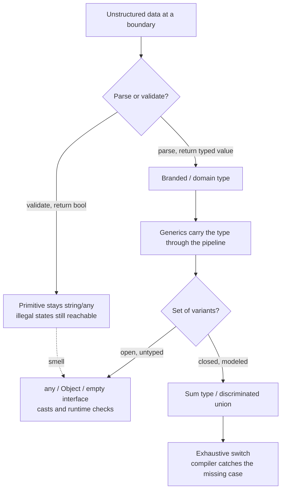

# Generics & Types — Interview Questions

> 50+ questions across all skill levels (Junior → Staff). Each harder question notes *what the interviewer is really checking*. Use as self-review or interview prep. The recurring theme: use the type system to make illegal states unrepresentable, and reach for generics and sum types instead of `any`, casts, and stringly-typed APIs.

---

## Table of Contents

- [Junior](#junior-12-questions)
- [Mid](#mid-14-questions)
- [Senior](#senior-14-questions)
- [Staff](#staff-12-questions)
- [Rapid-Fire](#rapid-fire)
- [Summary](#summary)
- [Further Reading](#further-reading)
- [Related Topics](#related-topics)



---

## Junior (12 questions)

### Q1. What are generics for?
<details><summary>Answer</summary>

Writing one piece of code that works over many types **without losing type information**. A `List<T>` stores any element type yet `get` returns exactly that type — no casts, no `any`. Generics give you reuse (one implementation) plus safety (the compiler still knows the concrete type at each call site).
</details>

### Q2. Give a concrete example where a generic beats duplication.
<details><summary>Answer</summary>

A `max` function. Without generics you write `maxInt`, `maxDouble`, `maxString`. With a generic `max<T: Comparable>(a: T, b: T): T` you write it once, and the return type tracks the argument type. The alternative — `maxObject(Object, Object): Object` — forces the caller to cast back and silently accepts mismatched types.
</details>

### Q3. What's the difference between a generic and `Object`/`any`?
<details><summary>Answer</summary>

Both let one function accept many types. The difference is *what the compiler remembers*. `Object`/`any` erases the type — the caller gets back something untyped and must cast. A generic **threads the type through**: pass a `User`, get a `User` back, checked at compile time.
</details>

### Q4. What is a bounded (constrained) type parameter?
<details><summary>Answer</summary>

A type parameter restricted to types that satisfy a constraint, so you can use the constraint's operations inside the generic body. `<T extends Comparable<T>>` (Java), `T: Comparable` (Swift/Rust trait bound), `[T constraints.Ordered]` (Go). Without the bound, `T` could be anything, so you couldn't legally compare, add, or call methods on it.
</details>

### Q5. Why prefer `<T extends Comparable<T>>` over plain `<T>` for a sort?
<details><summary>Answer</summary>

A sort needs to compare elements. Plain `<T>` gives you no operations except those of `Object`, so you can't order anything — you'd have to cast or take a comparator. The bound `<T extends Comparable<T>>` lets the compiler verify at the call site that the element type is actually orderable, turning a runtime `ClassCastException` into a compile error.
</details>

### Q6. What does "make illegal states unrepresentable" mean?
<details><summary>Answer</summary>

Design types so that a value that shouldn't exist *can't be constructed*. Instead of a `Connection` with a nullable `socket` that's only set when `connected == true`, model `Disconnected` and `Connected(socket)` as two variants. Now "connected but no socket" isn't a bug you have to guard against — it can't be expressed.
</details>

### Q7. What is a stringly-typed API?
<details><summary>Answer</summary>

An API that passes domain concepts as raw strings (or ints) instead of types. `fetch("GET", "/users")`, `setState("acive")` (typo compiles), `getConfig("tieout")`. The compiler can't catch typos, invalid values, or swapped arguments, and there's no autocomplete. Replace with enums, typed methods, or string-literal union types.
</details>

### Q8. What's wrong with `interface{}` / `any` as a parameter type?
<details><summary>Answer</summary>

It accepts everything, so the compiler stops helping you. Inside the function you must type-assert or reflect to do anything useful, and every caller can pass garbage that only fails at runtime. It's the type-system equivalent of giving up. Use a generic type parameter or a concrete interface that names the behavior you actually need.
</details>

### Q9. What is a sum type / discriminated union?
<details><summary>Answer</summary>

A type that is **exactly one of** a fixed set of variants, each possibly carrying different data. `Result = Ok(value) | Err(error)`; `Shape = Circle(r) | Rect(w,h)`. TypeScript models it with a tagged union (`{kind: "circle", r: number} | {kind: "rect", ...}`); Rust/Swift have native enums with payloads. The opposite of a product type (a struct, which holds *all* its fields at once).
</details>

### Q10. What is exhaustiveness checking?
<details><summary>Answer</summary>

When you `switch`/`match` over a sum type, the compiler verifies you handled every variant. Add a new variant and every non-exhaustive switch becomes a compile error pointing you at exactly the code to update. This is the single biggest payoff of sum types over a `kind` string plus `if/else`.
</details>

### Q11. What's a type assertion / cast, and why is it risky?
<details><summary>Answer</summary>

It tells the compiler "trust me, this value is type X." In TypeScript `value as User`, in Java `(User) obj`. It's risky because you've overruled the checker. If you're wrong, TS fails silently (no runtime check at all) and Java throws `ClassCastException`. Each cast is a place where you, not the compiler, are now responsible for correctness.
</details>

### Q12. When is a plain enum enough versus a discriminated union?
<details><summary>Answer</summary>

A plain enum is enough when the variants carry **no extra data** — `Color = Red | Green | Blue`. The moment different variants need different fields (`Circle` has a radius, `Rect` has width/height), you want a discriminated union so each variant carries exactly its own payload and nothing illegal sneaks in.
</details>

---

## Mid (14 questions)

### Q13. Explain covariance and contravariance in one sentence each.
<details><summary>Answer</summary>

- **Covariance:** if `Cat` is a `Animal`, then `Producer<Cat>` is a `Producer<Animal>` — safe when the type only comes *out*.
- **Contravariance:** if `Cat` is a `Animal`, then `Consumer<Animal>` is a `Consumer<Cat>` — safe when the type only goes *in*.

Mnemonic: producers are covariant, consumers are contravariant (PECS — Producer Extends, Consumer Super).
</details>

### Q14. What do Java's `? extends T` and `? super T` mean?
<details><summary>Answer</summary>

- `List<? extends Number>` — a list you can **read** `Number`s from but can't add to (you don't know the exact element type). Covariant / producer.
- `List<? super Integer>` — a list you can **add** `Integer`s to but can only read as `Object`. Contravariant / consumer.

PECS: use `extends` when the parameter produces values, `super` when it consumes them.
</details>

### Q15. *(Interviewer is checking: do you understand why arrays are a soundness hole?)* Why are Java arrays covariant and why is that a bug?
<details><summary>Answer</summary>

`Object[] a = new String[1]` compiles because Java arrays are covariant. But `a[0] = 42` then throws `ArrayStoreException` at runtime. Array covariance lets an unsafe write slip past the compiler, so the JVM has to insert a runtime store check on every array write. Generics fixed this by being **invariant** by default — `List<String>` is not a `List<Object>` — pushing the error to compile time.
</details>

### Q16. What is type erasure?
<details><summary>Answer</summary>

The compiler checks generic types, then **discards** them so the runtime sees raw types. Java/Kotlin/Scala erase: at runtime `List<String>` and `List<Integer>` are both just `List`. Consequences: you can't write `new T[]`, `obj instanceof List<String>`, or overload on `List<String>` vs `List<Integer>`. You recover the type at runtime only by passing a `Class<T>` token or a reified type.
</details>

### Q17. Erasure vs monomorphization — contrast them.
<details><summary>Answer</summary>

- **Erasure** (Java, TS): one compiled copy, types thrown away at runtime. Small binaries, no per-type specialization, but no runtime type info and boxing for primitives.
- **Monomorphization** (Rust, C++ templates, Go generics partly): the compiler generates a **specialized copy per concrete type**. Full speed, no boxing, types known — at the cost of code bloat and longer compiles.

TypeScript erases entirely (types vanish in the emitted JS).
</details>

### Q18. What is parse-don't-validate?
<details><summary>Answer</summary>

Instead of a `validate(input): bool` that leaves you holding the same untyped value, write a `parse(input): Maybe<Typed>` that **returns a more precise type** on success. The type then proves the check already happened, so downstream code can't re-introduce the invalid case. `validate` throws away the information it just learned; `parse` captures it in the type.
</details>

### Q19. Show parse-don't-validate with a non-empty list.
<details><summary>Answer</summary>

```typescript
// validate: caller still has string[], can still be empty downstream
function isNonEmpty(xs: string[]): boolean { return xs.length > 0; }

// parse: returns a type that *is* non-empty
type NonEmpty<T> = [T, ...T[]];
function parseNonEmpty<T>(xs: T[]): NonEmpty<T> | null {
  return xs.length > 0 ? (xs as NonEmpty<T>) : null;
}
// head() can now take NonEmpty<T> and never check for empty again
```
The `NonEmpty<T>` parameter makes "empty list" unrepresentable at the call site.
</details>

### Q20. What is a branded type / newtype, and what problem does it solve?
<details><summary>Answer</summary>

A distinct type that wraps a primitive so the compiler won't let you mix it with the raw primitive or other wrappers. `UserId` and `OrderId` both wrap `string`, but `cancelOrder(id: OrderId)` rejects a `UserId`. It kills the class of bug where two `string` IDs get swapped — a compile error instead of a production incident. Rust/Haskell: `newtype`; Go: `type UserId string`; TS: branded type via a phantom field.
</details>

### Q21. How do you brand a type in TypeScript, which has structural typing?
<details><summary>Answer</summary>

Intersect with a phantom, unique tag:

```typescript
type UserId = string & { readonly __brand: "UserId" };
const asUserId = (s: string): UserId => s as UserId; // single controlled cast
```
The `__brand` field never exists at runtime; it only makes the type *nominally* distinct so a plain `string` won't assign to `UserId`. The one `as` lives in the smart constructor, not scattered across the codebase.
</details>

### Q22. *(Checking: do you know `unknown` exists?)* In TypeScript, when should you use `unknown` instead of `any`?
<details><summary>Answer</summary>

Almost always. `any` disables checking and *propagates* — one `any` poisons everything it touches. `unknown` accepts any value but forces you to **narrow** (typeof/instanceof/a type guard) before using it. Use `unknown` for genuinely dynamic inputs (`JSON.parse`, untyped library returns) and let the compiler force a check at the point of use.
</details>

### Q23. Why is overloading often worse than two well-named functions?
<details><summary>Answer</summary>

Overloads share a name but mean different things, so the reader must resolve which one fires from argument types — and boolean/optional-arg overloads make call sites ambiguous (`render(true)`?). Two named functions (`renderToString`, `renderToStream`) document intent at the call site, give clean autocomplete, and avoid surprising resolution rules. Overload only when the operations are genuinely the same concept over different shapes.
</details>

### Q24. What is the "boolean blindness" problem and how do types fix it?
<details><summary>Answer</summary>

A `boolean` return (or parameter) discards *why*. `if (user.check())` — check what? `setSorted(true)`. The bit carries no meaning at the call site. Fix with a sum type or named enum: `enum AccessResult { Granted, Denied }` or `Result<Ok, Reason>`. The reader sees intent and the compiler can enforce exhaustive handling.
</details>

### Q25. How do generics interact with `null`?
<details><summary>Answer</summary>

A generic `T` may or may not include `null` depending on the language's nullability model. In Kotlin, `<T>` is non-null; `<T : Any?>` admits null. In TypeScript with `strictNullChecks`, `T` doesn't include `null` unless you write `T | null`. Sloppy generics that allow null silently re-introduce the billion-dollar mistake — prefer `Option<T>`/`T?` and make absence explicit.
</details>

### Q26. When is `any`/`interface{}` actually OK?
<details><summary>Answer</summary>

At true type boundaries where the type genuinely isn't known yet: deserialization input before parsing, a generic logging/printf sink, reflection-based frameworks, marshaling to a wire format. The rule is **narrow immediately** — `any` may enter the function but should be parsed into a real type on the first line, never returned or stored as `any`.
</details>

### Q27. What's the difference between a type parameter and a type that takes a `Class<T>` argument?
<details><summary>Answer</summary>

`<T> T parse(Class<T> cls, String json)` passes the type as a runtime value (a "type token") precisely because erasure removed `T` from the runtime. The generic `<T>` gives compile-time checking; the `Class<T>` recovers the runtime info the JVM needs to actually instantiate or reflect. You need the token whenever the body must *do* something type-specific at runtime.
</details>

---

## Senior (14 questions)

### Q28. *(Checking: do you grasp declaration-site vs use-site variance?)* Contrast declaration-site and use-site variance.
<details><summary>Answer</summary>

- **Use-site** (Java wildcards): variance is declared at each *usage* — `List<? extends Number>`. Flexible but verbose; you repeat the wildcard everywhere.
- **Declaration-site** (Kotlin/Scala/C#): you mark the type parameter once at the class — `interface Producer<out T>`, `Consumer<in T>`. The compiler enforces that `out T` only appears in output positions. Cleaner, but the variance is fixed for all uses.

Kotlin supports both: declaration-site `out`/`in`, plus use-site projections.
</details>

### Q29. Is TypeScript's type system sound? *(Checking: do you know "sound" vs "useful" are different goals?)*
<details><summary>Answer</summary>

No, and deliberately. A sound type system never lets a well-typed program go wrong at runtime. TypeScript explicitly trades soundness for pragmatism and JS interop. Known holes: `any`, type assertions (`as`), non-null `!`, bivariant method parameters, unchecked index access (without `noUncheckedIndexedAccess`), and the fact that nothing validates at runtime. TS is a *useful* type system, not a sound one — it catches most mistakes while staying ergonomic over untyped JS.
</details>

### Q30. Give three concrete TypeScript unsoundness examples.
<details><summary>Answer</summary>

1. **Index access:** `const x: number = arr[99]` is typed `number` even when undefined (unless `noUncheckedIndexedAccess`).
2. **Type assertion lies:** `const u = {} as User` — zero runtime check; `u.name` is `undefined` but typed `string`.
3. **Bivariant method params:** an object's method parameters are checked bivariantly, so you can assign a handler with a narrower parameter than declared and crash at runtime.

Each is a place where "it compiled" does not imply "it's correct."
</details>

### Q31. Are generics zero-cost? *(Trick.)*
<details><summary>Answer</summary>

Depends entirely on the implementation strategy.

- **Monomorphized** (Rust, C++): zero runtime cost — specialized native code per type, no boxing — but you pay in binary size and compile time.
- **Erased** (Java, Kotlin, Scala): generics themselves are free at runtime, but they force **boxing** of primitives (`List<Integer>` is `Integer` objects, not `int`s), which is a real cost.
- **TypeScript:** literally zero runtime cost because types are erased entirely — they don't exist in the emitted JS.

So "zero-cost" is true for monomorphization, mostly true for erased reference types, and false once boxing enters.
</details>

### Q32. Should everything be generic? *(Trick.)*
<details><summary>Answer</summary>

No. Generics earn their keep only when code genuinely varies over a type that is **threaded through** input to output (containers, algorithms, Result/Option). Premature generics — `<T>` parameters used exactly once with a single concrete type, or "future-proofing" abstractions — add cognitive load, worsen error messages, and obscure intent. Make it concrete first; generalize when a second real type shows up.
</details>

### Q33. How do you model a state machine to make illegal transitions unrepresentable?
<details><summary>Answer</summary>

Give each state its own type and let only the legal transition methods exist on it. A `Draft` has `.submit(): Review`; a `Review` has `.approve(): Published` / `.reject(): Draft`; `Published` has none. You can't call `.approve()` on a `Draft` because the method doesn't exist on that type. The compiler enforces the diagram; no `if (state == ...)` guards needed. (Rust's typestate pattern; Java's sealed-interface-per-state.)
</details>

### Q34. How do sum types and exhaustiveness make adding a feature safer?
<details><summary>Answer</summary>

Add a variant to the sum type and **every** non-exhaustive `match`/`switch` becomes a compile error, each pointing at exactly the code that must handle the new case. Contrast the `kind`-string-plus-`if/else` approach: adding a case compiles fine and silently falls through default branches, shipping a bug. The type system turns "find all the places" from a grep into a guaranteed compile-time checklist.
</details>

### Q35. How do you force exhaustiveness in a language whose `switch` is lenient (e.g., TS, Go)?
<details><summary>Answer</summary>

The **exhaustiveness assertion** idiom: in the `default` branch, assign the value to a `never` (TS) and let the compiler reject it if a case was missed.

```typescript
function area(s: Shape): number {
  switch (s.kind) {
    case "circle": return Math.PI * s.r ** 2;
    case "rect":   return s.w * s.h;
    default: const _exhaustive: never = s; return _exhaustive;
  }
}
```
Add a variant and the `default` assignment fails to compile. Go has no `never`, so you lean on linters (`exhaustive`) or a panic in default.
</details>

### Q36. What's the trade-off of branded types at runtime?
<details><summary>Answer</summary>

In erased/structural systems (TS branded types, Kotlin inline value classes, Go named types) there's usually **zero runtime cost** — the brand exists only at compile time. The real cost is the discipline of a smart constructor: every value must enter through `parse`/`asUserId`, and you must resist scattering `as` casts that bypass it. The brand is only as strong as the chokepoint that creates it.
</details>

### Q37. *(Checking: do you know where validation should live?)* Where in a system should parsing happen?
<details><summary>Answer</summary>

At the **edges** — the boundary where untrusted/untyped data enters (HTTP handler, queue consumer, config loader, DB row mapper). Parse once at the boundary into rich domain types; the entire core then operates on values that are correct by construction. Validating deep inside business logic means the same checks are repeated, drift apart, and the core still has to handle "what if it's invalid."
</details>

### Q38. How do higher-kinded types relate to this topic, and what do you do without them?
<details><summary>Answer</summary>

Higher-kinded types abstract over type constructors (`F<_>`), letting you write code generic over `List`, `Option`, `Future` at once (e.g., a single `map`/`traverse`). Haskell and Scala have them; Java, Go, TS don't. Without HKTs you either duplicate per-container code, or simulate them with awkward encodings. Pragmatically, most teams accept a little duplication rather than the complexity of emulating HKTs.
</details>

### Q39. What's wrong with throwing on bad input instead of returning a typed result?
<details><summary>Answer</summary>

An exception doesn't appear in the function's *type*, so callers aren't reminded to handle it and the happy path looks total when it isn't. A `Result<T, E>` / `Either` return type makes failure part of the signature — the caller must unwrap it, and the compiler tracks the error type. This is the same parse-don't-validate idea applied to errors: encode the failure mode in the type.
</details>

### Q40. How do generics improve error handling specifically?
<details><summary>Answer</summary>

A generic `Result<T, E>` carries *both* the success and the error type through the call chain, so callers know precisely what can go wrong and get exhaustive handling via `match`. Without it you fall back to untyped exceptions or `(value, err)` pairs where `err` is a bare `error`/`Exception` with no structure. See [error handling](../06-error-handling/README.md) for the broader treatment.
</details>

### Q41. *(Checking: nominal vs structural intuition.)* Nominal vs structural typing — how does each affect "illegal states"?
<details><summary>Answer</summary>

- **Structural** (TS, Go): types are equal if their shapes match. Two distinct concepts with the same fields are interchangeable, which weakens "illegal states" — hence the need for *brands* to force nominal distinctness.
- **Nominal** (Java, Rust, C#): types are equal only by name, so `UserId` and `OrderId` are distinct even if both wrap a string, for free.

Structural systems are more flexible but need explicit tagging to recover the safety nominal systems give by default.
</details>

---

## Staff (12 questions)

### Q42. You're setting an org-wide policy on `any`. What do you ban, allow, and how do you enforce it?
<details><summary>Answer</summary>

Ban implicit `any` (`noImplicitAny`) and `any` in **return types and stored fields** — those propagate. Allow `any`/`unknown` transiently at deserialization and FFI boundaries, with a lint rule that requires narrowing in the same function. Enforce with `typescript-eslint` (`no-explicit-any`, `no-unsafe-*`), a CI gate on the `any` count with a ratcheting baseline (like SonarQube baseline mode), and code-review norms. The goal isn't zero `any` — it's *no `any` that escapes its function*.
</details>

### Q43. *(Checking: migration judgment, not ideology.)* How do you migrate a large stringly-typed/`any`-heavy codebase toward strong types without halting feature work?
<details><summary>Answer</summary>

Incrementally, from the edges in. (1) Turn on strict flags with a baseline so only *new* code is held to the bar. (2) Introduce parsing at boundaries first — one HTTP handler at a time — so typed values flow inward. (3) Add branded types for the highest-risk IDs (money, user/order IDs) where swaps cause incidents. (4) Replace `kind`-string conditionals with discriminated unions as you touch them. Never a big-bang rewrite; each PR is independently shippable and tested.
</details>

### Q44. When does a discriminated union become a worse choice than polymorphism (subtyping)?
<details><summary>Answer</summary>

A sum type is best when **variants are fixed and operations grow** — adding a function over all variants is easy; adding a variant breaks every switch (good, you want that). Subtyping/polymorphism is best when **operations are fixed and variants grow** — adding a new subclass requires no edits to existing code. This is the *expression problem*: choose sum types for closed sets with many operations, open polymorphism for extensible sets with a stable interface.
</details>

### Q45. Defend or attack: "we'll add generics later when we need them."
<details><summary>Answer</summary>

Mostly defensible. Adding a type parameter later is usually a backward-compatible refactor (existing concrete call sites still work), whereas premature generics cost clarity now for speculative reuse. The exception is *public API*: once `process(x: User)` ships, widening to `process<T>(x: T)` can change inference and break callers, and you can't add a constraint without a breaking change. So: stay concrete internally, but think hard about variance and constraints before publishing a generic API.
</details>

### Q46. How would you design an API so that callers physically cannot forget required configuration?
<details><summary>Answer</summary>

Type-state / step builder: each step returns an interface exposing only the next legal step, and `build()` exists only on the type reached after all required steps. This is "make illegal states unrepresentable" applied to construction — a missing required field is a compile error, not a runtime check. See the builder pattern for the mechanics.
</details>

### Q47. *(Checking: do you understand variance soundness at the JVM/CLR level?)* Why can't a mutable `List<T>` be covariant?
<details><summary>Answer</summary>

Because it's both a producer and a consumer of `T`. If `List<Cat>` were a `List<Animal>`, you could `add(new Dog())` through the `Animal` view, corrupting the cat list — exactly Java's `ArrayStoreException` hole. Covariance is sound only for read-only (producer) interfaces and contravariance only for write-only (consumer) interfaces. Immutable collections *can* be safely covariant, which is why `IReadOnlyList<out T>` (C#) and Kotlin's `List<out T>` are covariant while `MutableList` is invariant.
</details>

### Q48. Reflection/serialization frameworks rely on runtime type info, but Java erases generics. How do mature libraries cope?
<details><summary>Answer</summary>

Super-type tokens. Jackson's `TypeReference<List<User>>` and Guava's `TypeToken` exploit the fact that erasure keeps generic info in **class metadata of subclasses** — an anonymous subclass `new TypeReference<List<User>>(){}` preserves `List<User>` in its generic superclass signature, which reflection can read. So the library recovers at runtime what erasure removed from the call site. It's a workaround for a missing language feature (reification).
</details>

### Q49. What's the cost model of "type everything precisely" on compile time and developer velocity?
<details><summary>Answer</summary>

Heavily-encoded types (deep conditional types in TS, elaborate type-level programming) can blow up type-check time, produce inscrutable error messages, and raise the bar for every contributor. The staff judgment: encode the invariants that prevent *real, costly* bugs (money, IDs, auth state, state machines) and stop there. A type that takes 40 lines to express a constraint that a code review would catch is usually net-negative. Strong typing is a tool, not a scoreboard.
</details>

### Q50. How do you decide between a sum type and an enum-plus-map for dispatch?
<details><summary>Answer</summary>

Sum type with exhaustive `match` when the branches carry **different data** or you want compile-time "handle every case." Enum-keyed map (`Map<Kind, Handler>`) when variants are **open/plugin-style**, registered dynamically, or numerous and uniform — it trades compile-time exhaustiveness for runtime extensibility (and you must handle the missing-key case). It's the expression problem again, decided per call site.
</details>

### Q51. A team proposes a `Money` type. Walk through the type-design decisions.
<details><summary>Answer</summary>

(1) **Branded, not `double`** — never floating point for money; store minor units as integer + currency. (2) **Currency in the type or as a field**, so you can't add USD to EUR silently — ideally a compile error or a checked operation. (3) **Smart constructor** that rejects negative or absurd values (parse-don't-validate). (4) **Immutable** — operations return new `Money`. (5) Decide nominal distinctness so `Money` never implicitly becomes a raw number. This collapses an entire bug class (unit mix-ups, rounding drift, currency confusion) into compile errors.
</details>

### Q52. Generics in Go arrived in 1.18. What changed about idiomatic API design, and what didn't?
<details><summary>Answer</summary>

Changed: container utilities (`slices`, `maps`), constraint-based functions (`[T constraints.Ordered]`), and typed `Result`-like helpers no longer need `interface{}` plus casts. Didn't change: Go still favors concrete interfaces ("accept interfaces, return structs"), and the community resists over-generic code. The litmus test is the same as everywhere — generics where the type is genuinely threaded through, not as a default. `any` (the alias for `interface{}`) is still a smell when used to dodge real types.
</details>

### Q53. *(Checking: principled view of the whole topic.)* Tie it together: what's the single principle behind generics, sum types, branding, and parse-don't-validate?
<details><summary>Answer</summary>

**Push correctness into the type system so the compiler does the checking you'd otherwise do by hand (or forget to).** Generics preserve type information through abstraction; sum types make the set of cases explicit and exhaustively checked; branded types make distinct concepts non-interchangeable; parse-don't-validate captures a runtime check as a permanent type-level fact. All four shrink the space of representable-but-illegal states until "it compiles" carries much more of the weight of "it's correct."
</details>

---

## Rapid-Fire

| Question | Answer |
|---|---|
| PECS stands for? | Producer Extends, Consumer Super |
| `? extends T` is what variance? | Covariant (read-only / producer) |
| `? super T` is what variance? | Contravariant (write-only / consumer) |
| Java generics: erased or monomorphized? | Erased |
| Rust generics: erased or monomorphized? | Monomorphized |
| TypeScript types at runtime? | Erased entirely — gone in emitted JS |
| Is TypeScript sound? | No (any, `as`, `!`, bivariance, index access) |
| Safer than `any` in TS? | `unknown` — forces narrowing |
| Parse-don't-validate returns what? | A more precise type, not a bool |
| Brand a TS type with? | Intersection with a phantom tag field |
| Force exhaustiveness in TS? | Assign to `never` in `default` |
| Why not `double` for money? | Floating point isn't decimal-exact |
| Mutable List covariant? | No — corrupts on write (ArrayStoreException) |
| Recover erased type at runtime? | `Class<T>` / super-type token |
| Sum type best when? | Variants fixed, operations grow |
| Subtyping best when? | Operations fixed, variants grow |
| Stringly-typed cure? | Enums / union types / typed methods |
| Should everything be generic? | No — generalize on the second real type |

---

## Summary

Strong typing is the cheapest, most durable form of testing: a constraint encoded in a type is checked on every build, forever, with no test to maintain.

- **Generics** give reuse without losing type information; bound them (`T extends Comparable`) so the body can actually use the type.
- **Variance** (`extends`/`super`, `out`/`in`) is about who reads vs writes — producers covariant, consumers contravariant; mutable containers must be invariant for soundness.
- **Sum types + exhaustiveness** make the set of cases explicit and turn "add a feature" into a compiler-guided checklist.
- **Avoid `any`/`Object`/`interface{}`** except transiently at boundaries — and narrow immediately.
- **`as`/type assertions are promises you make to the compiler**; TypeScript is intentionally unsound, so each cast is a place you've taken over responsibility.
- **Parse-don't-validate** and **branded types** capture runtime facts as compile-time guarantees at the system edges.
- **Don't over-type:** encode the invariants that prevent costly bugs; stop before the types cost more than the bugs.

The unifying idea: make illegal states unrepresentable, so "it compiles" carries more of the weight of "it's correct."

---

## Further Reading

- Alexis King — *Parse, Don't Validate* (the canonical essay)
- Joshua Bloch — *Effective Java*, items on generics, wildcards, and PECS
- Yaron Minsky — *Make Illegal States Unrepresentable* (OCaml/F# lineage)
- TypeScript Handbook — Narrowing, Discriminated Unions, and the `unknown` type
- Rust Book — Generics, Traits, and the typestate pattern
- *The Expression Problem* — Wadler's framing of sum types vs subtyping

---

## Related Topics

- [Generics & Types — README](README.md) · [Junior level](junior.md) · [Professional level](professional.md)
- [Error Handling](../06-error-handling/README.md) — `Result`/`Either` as typed failure
- [Functional Programming](../../functional-programming/README.md) — algebraic data types and immutability
- Builder pattern — step builders that make required fields a compile error

---

[← README](README.md) · [Junior](junior.md) · [Professional](professional.md) · [Clean Code](../README.md)
