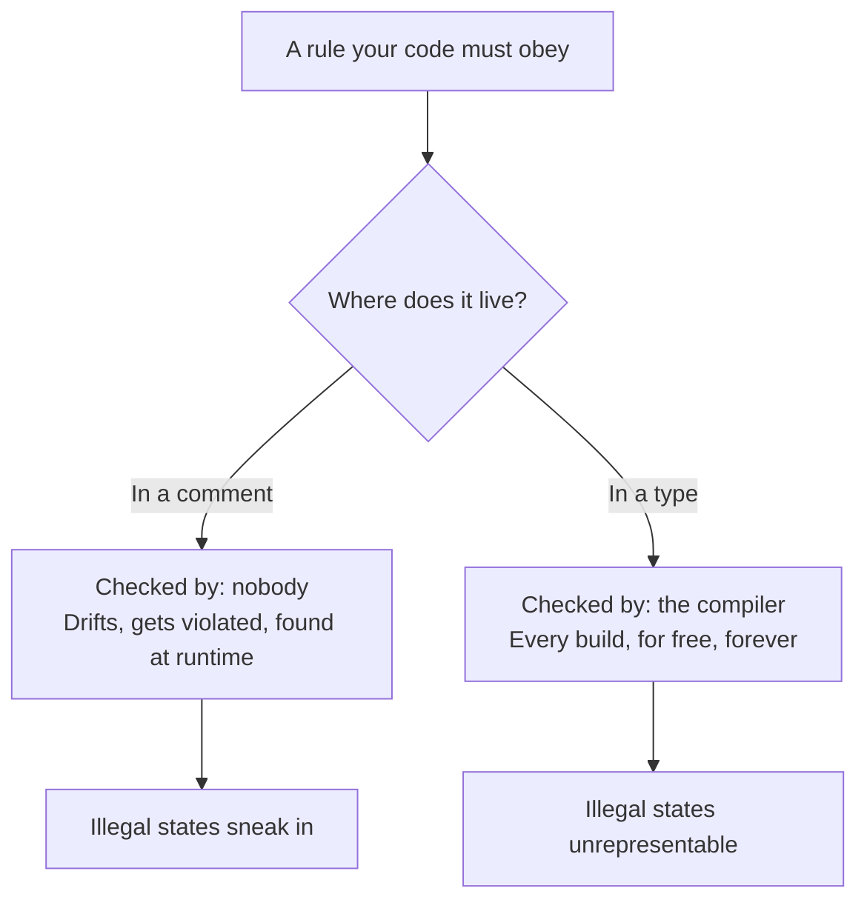

# Generics & Types — Junior Level

> **Level:** Junior — *"What's the rule? Show me a clean example."*
> This file teaches the everyday rules for using a language's type system to **prevent bugs before they run**. Modern extension to Clean Code: code is cleanest when the compiler refuses to let you write the wrong thing.

---

## Table of Contents

1. [The core idea: make illegal states unrepresentable](#the-core-idea-make-illegal-states-unrepresentable)
2. [Real-world analogy](#real-world-analogy)
3. [Rule 1 — Replace flag-soup with sum types](#rule-1--replace-flag-soup-with-sum-types)
4. [Rule 2 — Use generics for reusable, type-safe code](#rule-2--use-generics-for-reusable-type-safe-code)
5. [Rule 3 — Constrain your generics (bounds, not free-for-all)](#rule-3--constrain-your-generics-bounds-not-free-for-all)
6. [Rule 4 — Prefer typed parameters over stringly-typed APIs](#rule-4--prefer-typed-parameters-over-stringly-typed-apis)
7. [Rule 5 — Use newtype / branded types for domain values](#rule-5--use-newtype--branded-types-for-domain-values)
8. [Rule 6 — Avoid escape hatches (`any` / `Object` / `interface{}`)](#rule-6--avoid-escape-hatches-any--object--interface)
9. [Common Mistakes](#common-mistakes)
10. [Test Yourself](#test-yourself)
11. [Cheat Sheet](#cheat-sheet)
12. [Summary](#summary)
13. [Further Reading](#further-reading)
14. [Related Topics](#related-topics)

---

## The core idea: make illegal states unrepresentable

A type is a **promise the compiler enforces**. When you write `int age`, you promise "this holds a whole number." When you write `Email email`, you can promise much more — "this holds a string that has passed validation." The more promises your types carry, the more bugs the compiler catches for you, for free, on every build.

The mantra for this whole chapter is:

> **Make illegal states unrepresentable.**

If your code can be in a state that should never exist — a "loading" request that also has a result, a `User` with no id, a discount that's both a percentage *and* a fixed amount — then someday it *will* be in that state, and you'll debug it at 2 a.m. The fix is to design types so that bad combinations simply **cannot be constructed**. The compiler becomes your first reviewer.

Three habits get you most of the way there:

1. **Model alternatives as alternatives** (sum types / unions / enums), not as a pile of optional flags.
2. **Make values self-describing** (a `UserId`, not a bare `string`).
3. **Refuse to escape the type system** (`any`, `Object`, `interface{}`) unless you genuinely cannot type the thing.

Everything below is a concrete application of these three habits.



---

## Real-world analogy

### The light switch with no "in-between"

A wall light switch has exactly two positions: **up** and **down**. There is no physical way to leave it "half on." The switch's *shape* makes the illegal state ("partially on") impossible. You don't need a sticky note saying "please don't leave the switch halfway" — the hardware enforces it.

Now imagine a switch that was actually three separate sliders: `power`, `brightness`, `mode`. Nothing stops you from setting `power = off` but `brightness = 90%` and `mode = "on"`. Those three values *contradict each other*, and now every piece of code that reads the switch has to defensively check "wait, is this combination even valid?"

Good types are the two-position switch. Bad types are the three-slider mess. Your job as the designer is to choose the shape that makes contradictions impossible — so readers and the compiler never have to ask "is this combination valid?"

---

## Rule 1 — Replace flag-soup with sum types

**The rule:** when a value can be in one of several *mutually exclusive* states, model it as **one type with named cases** (a sum type / discriminated union / enum) — not as a bag of booleans and optional fields where most combinations are illegal.

The classic smell is **boolean flag-soup**: `isLoading`, `isError`, `data`, `errorMessage` all on one object. Of the 16 combinations of four booleans, maybe 3 are valid. The other 13 are bugs waiting to happen.

### TypeScript — discriminated union

```typescript
// ❌ Dirty — flag-soup. Many illegal combinations are representable.
interface RequestState {
  isLoading: boolean;
  data: User | null;
  error: string | null;
}
// What does { isLoading: true, data: someUser, error: "boom" } mean? Nonsense.
// Every reader must defensively check all three fields.

// ✅ Clean — discriminated union. Each case carries exactly its own data.
type RequestState =
  | { status: "idle" }
  | { status: "loading" }
  | { status: "success"; data: User }
  | { status: "error"; message: string };

function render(state: RequestState): string {
  switch (state.status) {
    case "idle":    return "Press load";
    case "loading": return "Spinner…";
    case "success": return state.data.name;   // `data` exists ONLY here
    case "error":   return state.message;      // `message` exists ONLY here
  }
}
```

The `status` field is the **discriminant**: TypeScript *narrows* the type inside each `case`, so `state.data` is only reachable when `status === "success"`. The illegal combo "loading with data and error" cannot be typed at all.

### Go — discriminated union via interface + type switch

Go has no native sum type, but a sealed interface plus a type switch gets you there:

```go
// ✅ Clean — only these three concrete types implement requestState.
type requestState interface{ isRequestState() }

type Loading struct{}
type Success struct{ Data User }
type Failure struct{ Err error }

func (Loading) isRequestState() {}
func (Success) isRequestState() {}
func (Failure) isRequestState() {}

func render(s requestState) string {
	switch v := s.(type) {
	case Loading:
		return "Spinner…"
	case Success:
		return v.Data.Name // Data exists only on Success
	case Failure:
		return v.Err.Error()
	default:
		panic("unreachable")
	}
}
```

The unexported `isRequestState()` method seals the interface to this package, so callers cannot smuggle in a fourth illegal state.

### Java — sealed interface + records + pattern matching

```java
// ✅ Clean — a sealed hierarchy: the compiler knows the full list of cases.
sealed interface RequestState
    permits Loading, Success, Failure {}

record Loading()              implements RequestState {}
record Success(User data)     implements RequestState {}
record Failure(String message) implements RequestState {}

String render(RequestState state) {
    return switch (state) {                 // exhaustive — no default needed
        case Loading l       -> "Spinner…";
        case Success(var d)  -> d.name();    // data bound only in this branch
        case Failure(var m)  -> m;
    };
}
```

Because the interface is `sealed`, the `switch` is **exhaustive**: if you later add a `Cancelled` case, the compiler *forces* you to handle it everywhere.

### Python — tagged classes + `match`

```python
from dataclasses import dataclass

# ✅ Clean — each state is its own type; match narrows to the right one.
@dataclass(frozen=True)
class Loading: ...
@dataclass(frozen=True)
class Success:
    data: "User"
@dataclass(frozen=True)
class Failure:
    message: str

RequestState = Loading | Success | Failure  # type alias, Python 3.10+

def render(state: RequestState) -> str:
    match state:
        case Loading():        return "Spinner…"
        case Success(data=d):  return d.name   # `data` only here
        case Failure(message=m): return m
```

> **Junior takeaway:** if you find yourself writing comments like *"only set `error` when `isLoading` is false"*, that comment is a sum type begging to be born. Make the rule a type, not a comment.

---

## Rule 2 — Use generics for reusable, type-safe code

**The rule:** when the *logic* is the same but the *element type* varies, use a generic (a type parameter) instead of (a) duplicating the function per type, or (b) falling back to an untyped escape hatch. Generics give you **one** implementation that stays **fully type-checked** at every call site.

### TypeScript

```typescript
// ❌ Dirty — `any` throws away all type information.
function first(arr: any[]): any {
  return arr[0];
}
const x = first([1, 2, 3]); // x: any — no autocomplete, no safety

// ✅ Clean — a type parameter preserves the element type.
function first<T>(arr: T[]): T | undefined {
  return arr[0];
}
const n = first([1, 2, 3]);       // n: number | undefined
const s = first(["a", "b"]);      // s: string | undefined
```

### Go

```go
// ✅ Clean — one generic function works for any element type, fully typed.
func First[T any](xs []T) (T, bool) {
	var zero T
	if len(xs) == 0 {
		return zero, false
	}
	return xs[0], true
}

n, ok := First([]int{1, 2, 3})      // n is int
s, ok2 := First([]string{"a", "b"}) // s is string
```

Before Go 1.18 you'd have used `interface{}` and a type assertion at every call — losing safety. Generics remove the assertion entirely.

### Java

```java
// ✅ Clean — the type parameter ties input and output together.
static <T> Optional<T> first(List<T> xs) {
    return xs.isEmpty() ? Optional.empty() : Optional.of(xs.get(0));
}

Optional<Integer> n = first(List.of(1, 2, 3)); // typed as Integer, no cast
```

### Python

```python
from typing import TypeVar

T = TypeVar("T")

# ✅ Clean — TypeVar links the list's element type to the return type.
def first(xs: list[T]) -> T | None:
    return xs[0] if xs else None

n = first([1, 2, 3])      # type checker infers int | None
s = first(["a", "b"])     # type checker infers str | None
```

> **Junior takeaway:** if you wrote `firstInt`, `firstString`, `firstUser` — three copies of the same body — you wanted a generic. One generic function is less code *and* safer than three copies *and* safer than one untyped copy.

---

## Rule 3 — Constrain your generics (bounds, not free-for-all)

**The rule:** a fully open `<T>` says "I work with literally any type, and I can only do to it what you can do to *anything* (store it, return it)." The moment your function needs the value to *do* something — be compared, be added, have a `.length` — **constrain** the type parameter so the compiler guarantees that capability. A bound documents the requirement *and* enforces it.

### TypeScript — `extends`

```typescript
// ❌ Dirty — unbounded T, then we secretly rely on `.length` via `any`.
function longest<T>(items: T[]): T {
  let best = items[0];
  for (const x of items) {
    if ((x as any).length > (best as any).length) best = x; // a lie
  }
  return best;
}

// ✅ Clean — constrain T to "things that have a numeric length".
function longest<T extends { length: number }>(items: T[]): T {
  let best = items[0];
  for (const x of items) {
    if (x.length > best.length) best = x; // safe: T is guaranteed to have length
  }
  return best;
}
longest(["a", "bbb"]);     // ✅
longest([[1], [1, 2, 3]]); // ✅ arrays have length
// longest([1, 2, 3]);     // ❌ compile error — numbers have no .length
```

### Go — type constraints / type sets

```go
import "cmp"

// ❌ Dirty — `any` can't be compared with <, so this wouldn't even compile
// without reflection or assertions.

// ✅ Clean — cmp.Ordered constrains T to types that support < <= > >=.
func Max[T cmp.Ordered](xs []T) T {
	best := xs[0]
	for _, x := range xs[1:] {
		if x > best {
			best = x
		}
	}
	return best
}

Max([]int{3, 1, 2})          // ✅ 3
Max([]string{"a", "c", "b"}) // ✅ "c"
```

`cmp.Ordered` is a constraint defining a **type set** — the set of types on which `<` is legal. You can also write your own: `type Number interface{ ~int | ~float64 }`.

### Java — bounded type parameters & wildcards

```java
// ❌ Dirty — unbounded T; can't call compareTo, so we'd cast to Comparable (unsafe).

// ✅ Clean — T is bounded to be comparable with itself.
static <T extends Comparable<T>> T max(List<T> xs) {
    T best = xs.get(0);
    for (T x : xs) {
        if (x.compareTo(best) > 0) best = x; // safe — T has compareTo
    }
    return best;
}

max(List.of(3, 1, 2));            // ✅ Integer is Comparable<Integer>
// max(List.of(new Object()));    // ❌ compile error
```

For *consuming* vs *producing* collections, use bounded wildcards (PECS — *Producer `extends`, Consumer `super`*): `List<? extends Number>` to read, `List<? super Integer>` to write.

### Python — bounded `TypeVar` / `Protocol`

```python
from typing import TypeVar, Protocol

class Comparable(Protocol):
    def __lt__(self, other: object) -> bool: ...

# ✅ Clean — T is bounded to types that support < (structural, via Protocol).
TC = TypeVar("TC", bound=Comparable)

def maximum(xs: list[TC]) -> TC:
    best = xs[0]
    for x in xs[1:]:
        if best < x:
            best = x
    return best
```

> **Junior takeaway:** the bound is free documentation. `<T extends Comparable<T>>` tells the reader *and* the compiler exactly what `max` needs. An unbounded `<T>` that secretly assumes comparability is a bug-in-waiting.

---

## Rule 4 — Prefer typed parameters over stringly-typed APIs

**The rule:** don't pass *commands, modes, or routes as raw strings*. A "stringly-typed" API like `fetch("GET", "/users")` accepts every misspelling (`"GTE"`, `"/uesrs"`) and only fails at runtime. Replace magic strings with enums/literal-union types and structured parameters, so a typo is a compile error.

### TypeScript — literal unions

```typescript
// ❌ Dirty — any string is accepted; typos compile fine, fail at runtime.
function request(method: string, url: string) { /* ... */ }
request("GTE", "/users"); // 💥 typo, no error until production

// ✅ Clean — only the four real verbs are accepted.
type HttpMethod = "GET" | "POST" | "PUT" | "DELETE";
function request(method: HttpMethod, url: string) { /* ... */ }
request("GET", "/users"); // ✅
// request("GTE", "/users"); // ❌ compile error: not assignable to HttpMethod
```

### Go — named constants on a defined type

```go
// ✅ Clean — Method is its own type; only the declared constants are valid.
type Method string

const (
	GET    Method = "GET"
	POST   Method = "POST"
	PUT    Method = "PUT"
	DELETE Method = "DELETE"
)

func Request(m Method, url string) { /* ... */ }

Request(GET, "/users") // ✅
// Request("GTE", "/users") // compiles (Go converts the literal) — so guard at the boundary:

func ParseMethod(s string) (Method, error) {
	switch Method(s) {
	case GET, POST, PUT, DELETE:
		return Method(s), nil
	default:
		return "", fmt.Errorf("unknown method %q", s)
	}
}
```

> Go's defined string types still accept untyped string *literals*, so validate external input once at the boundary with `ParseMethod`, then pass the typed value everywhere inside.

### Java — enum

```java
// ✅ Clean — the enum is a closed set; the compiler rejects anything else.
enum HttpMethod { GET, POST, PUT, DELETE }

void request(HttpMethod method, String url) { /* ... */ }

request(HttpMethod.GET, "/users"); // ✅
// request("GTE", "/users");        // ❌ won't compile
```

### Python — `Literal` / `Enum`

```python
from typing import Literal

Method = Literal["GET", "POST", "PUT", "DELETE"]

# ✅ Clean — a type checker rejects any string outside the four literals.
def request(method: Method, url: str) -> None: ...

request("GET", "/users")   # ✅
request("GTE", "/users")   # ❌ flagged by mypy/pyright
```

> **Junior takeaway:** every magic string in a parameter is a typo the compiler can't catch. Convert it to a literal union or enum and the typo becomes a build error.

---

## Rule 5 — Use newtype / branded types for domain values

**The rule:** when two values share a primitive type but mean different things — a `UserId` and an `OrderId` are both strings; `Meters` and `Miles` are both numbers — give each its own named type. Otherwise the compiler happily lets you swap them, and `charge(orderId, userId)` compiles even though the arguments are backwards.

### TypeScript — branded types

```typescript
// ❌ Dirty — both are string; nothing stops you swapping them.
function transfer(from: string, to: string, amount: number) { /* ... */ }
transfer(userId, accountId, 100); // wrong order — compiles fine 💥

// ✅ Clean — brand the strings so they're distinct at compile time.
type UserId = string & { readonly __brand: "UserId" };
type AccountId = string & { readonly __brand: "AccountId" };

const asUserId = (s: string) => s as UserId;       // validate at the boundary
const asAccountId = (s: string) => s as AccountId;

function transfer(from: AccountId, to: AccountId, amount: number) { /* ... */ }
// transfer(asUserId("u1"), asAccountId("a2"), 100); // ❌ UserId not an AccountId
```

> The brand exists only at compile time (zero runtime cost). The single `as` cast lives in one boundary function — that's the *legitimate* use of `as`, unlike the lying casts warned against in Rule 6.

### Go — defined types

```go
// ✅ Clean — distinct named types; mixing them is a compile error.
type UserID string
type AccountID string

func Transfer(from, to AccountID, amount int) { /* ... */ }

var u UserID = "u1"
var a AccountID = "a2"
// Transfer(u, a, 100) // ❌ cannot use u (UserID) as AccountID
```

### Java — small wrapper types (records)

```java
// ✅ Clean — each id is its own type; the compiler enforces the distinction.
record UserId(String value) {}
record AccountId(String value) {}

void transfer(AccountId from, AccountId to, long amount) { /* ... */ }
// transfer(new UserId("u1"), new AccountId("a2"), 100); // ❌ won't compile
```

### Python — `NewType`

```python
from typing import NewType

UserId = NewType("UserId", str)
AccountId = NewType("AccountId", str)

def transfer(frm: AccountId, to: AccountId, amount: int) -> None: ...

u = UserId("u1")
a = AccountId("a2")
# transfer(u, a, 100)  # ❌ a type checker flags UserId where AccountId is required
```

`NewType` has **zero runtime overhead** — at runtime `UserId("u1")` is just the string `"u1"` — but the type checker treats them as different types.

> **Junior takeaway:** "both are strings" is *why* they get swapped. A `UserId` that is not interchangeable with an `AccountId` turns an entire class of argument-order bugs into compile errors.

---

## Rule 6 — Avoid escape hatches (`any` / `Object` / `interface{}`)

**The rule:** `any` (TS), `Object` (Java), `interface{}`/`any` (Go), and untyped Python all **switch off the type checker** for that value. Every escape hatch is a place where the compiler stops helping you. Reach for them only when you genuinely cannot type the thing (e.g., parsing arbitrary JSON) — and then re-establish a real type at the earliest boundary.

### TypeScript — `unknown` instead of `any`, and no lying `as`

```typescript
// ❌ Dirty — `any` infects everything it touches; `as` lies about runtime shape.
function parse(json: string): any {
  return JSON.parse(json);
}
const user = parse(input) as User;   // claims it's a User without checking
console.log(user.naem);              // typo compiles; undefined at runtime 💥

// ✅ Clean — `unknown` forces you to check before use.
function parse(json: string): unknown {
  return JSON.parse(json);
}
function isUser(v: unknown): v is User {
  return typeof v === "object" && v !== null && "name" in v;
}
const data = parse(input);
if (isUser(data)) {
  console.log(data.name); // safe — narrowed to User by the guard
}
```

`unknown` is the honest version of `any`: it says "I don't know the type yet," and the compiler *won't let you touch it* until you've narrowed it. An `as` cast, by contrast, *asserts* a type without checking — use it only when you truly know more than the compiler (like the branded-type boundary in Rule 5), never to silence an error.

### Go — concrete types over `any` (`interface{}`)

```go
// ❌ Dirty — any forces a runtime assertion that can panic.
func Area(shape any) float64 {
	return shape.(Rectangle).Width * shape.(Rectangle).Height // panics on non-Rectangle
}

// ✅ Clean — a real interface declares the behavior you actually need.
type Shape interface{ Area() float64 }

type Rectangle struct{ Width, Height float64 }
func (r Rectangle) Area() float64 { return r.Width * r.Height }

func TotalArea(shapes []Shape) float64 {
	var sum float64
	for _, s := range shapes {
		sum += s.Area() // no assertion, no panic
	}
	return sum
}
```

### Java — generics/interfaces over raw `Object`

```java
// ❌ Dirty — Object loses the type; every use needs an unchecked cast.
class Box {
    private Object value;
    void set(Object v) { this.value = v; }
    Object get() { return value; }
}
Box b = new Box();
b.set("hello");
Integer n = (Integer) b.get(); // compiles, ClassCastException at runtime 💥

// ✅ Clean — a generic Box keeps the real type.
class Box<T> {
    private T value;
    void set(T v) { this.value = v; }
    T get() { return value; }
}
Box<String> b2 = new Box<>();
b2.set("hello");
String s = b2.get(); // no cast, no runtime surprise
```

### Python — typed signatures over bare/`Any`

```python
from typing import Any

# ❌ Dirty — Any disables checking; the typo below is invisible to the checker.
def total_price(items: Any) -> Any:
    return sum(i.prce for i in items)  # typo, but Any hides it

# ✅ Clean — a real type catches the typo before runtime.
from dataclasses import dataclass

@dataclass
class Item:
    price: float

def total_price(items: list[Item]) -> float:
    return sum(i.price for i in items)  # i.prce → flagged by the checker
```

> **Junior takeaway:** treat every `any`/`Object`/`interface{}` as a TODO with a cost. Sometimes it's the right tool — but it should be a deliberate, commented decision, not the default you reach for to make a red squiggle disappear.

---

## Common Mistakes

| # | Mistake | Why it bites | Fix |
|---|---|---|---|
| 1 | Boolean **flag-soup** (`isLoading`, `isError`, `data`) | Most flag combinations are illegal yet representable | Discriminated union / sealed type (Rule 1) |
| 2 | Reaching for `any` to silence a compiler error | Disables checking for that whole value; bugs reappear at runtime | `unknown` + narrowing, or a real type (Rule 6) |
| 3 | Unbounded `<T>` that secretly needs `.compareTo` / `<` | Forces unsafe casts inside; the requirement is hidden | Add a bound: `<T extends Comparable<T>>` (Rule 3) |
| 4 | Magic-string parameters (`request("GTE", url)`) | Typos compile, fail in production | Literal union / enum (Rule 4) |
| 5 | Passing `UserId` where `OrderId` is expected | Both are strings, so swaps compile | Newtype / branded type (Rule 5) |
| 6 | `as User` (TS) to "fix" a type error | The cast *lies*; runtime shape is unchecked | Type guard / `is` predicate (Rule 6) |
| 7 | Copy-pasting `firstInt`, `firstStr`, `firstUser` | Three places to fix one bug; drift | One generic function (Rule 2) |
| 8 | **Overloading** one name for unrelated behaviors | Reader can't tell which variant runs; signatures blur | Separate, well-named functions (`parseJson`, `parseCsv`) |

> **On overloading:** when a single function name does *genuinely different things* depending on argument types, prefer two clearly named functions over one overloaded name. `findById(id)` and `findByEmail(email)` read better than two `find` overloads — the name carries the intent that the types alone don't.

---

## Test Yourself

**1. You have `{ isLoading: boolean; data: User | null; error: string | null }`. Why is this worse than a discriminated union?**

<details><summary>Answer</summary>

It allows illegal combinations — e.g. `{ isLoading: true, data: someUser, error: "boom" }` — that have no meaning, so every reader must defensively check all three fields. A discriminated union (`{status:"loading"} | {status:"success"; data} | {status:"error"; message}`) makes each piece of data exist *only* in the state where it's valid, so illegal combinations cannot even be typed.
</details>

**2. When should you write `<T>` and when `<T extends Comparable<T>>`?**

<details><summary>Answer</summary>

Use bare `<T>` only when your function treats the value opaquely — stores it, returns it, counts it — and never inspects it. The moment you call a method on `T` or compare it (`<`, `.compareTo`, `.length`), add the corresponding bound. The bound both documents the requirement and lets the compiler verify it, removing the unsafe casts you'd otherwise need.
</details>

**3. TypeScript's `as` and `unknown` both deal with uncertain types. What's the difference?**

<details><summary>Answer</summary>

`unknown` is *honest*: it says "I don't know the type," and the compiler forbids using the value until you narrow it with a check. `as` is an *assertion*: it tells the compiler "trust me, it's this type" with no runtime verification — so `parse(x) as User` will happily let you read `user.name` even if the object has no `name`. Use `unknown` + a type guard for untrusted data; reserve `as` for the rare case where you provably know more than the compiler (like a validated branded-type boundary).
</details>

**4. `UserId` and `OrderId` are both strings. Why bother making them separate types?**

<details><summary>Answer</summary>

Because "both are strings" is exactly why they get swapped. With a newtype (`NewType` in Python, `record` in Java, defined type in Go, branded type in TS), `charge(orderId, userId)` becomes a compile error instead of a runtime bug. The cost is near zero — most newtypes erase at runtime — and a whole class of argument-order mistakes disappears.
</details>

**5. Your teammate added `any` to make a red error go away. What do you say in review?**

<details><summary>Answer</summary>

Ask what value flows through there. If it's genuinely untyped external data (arbitrary JSON), suggest `unknown` plus a type guard so the value is validated before use. If it's data we *do* control, the `any` is hiding a real type that should be written out — the red error was the type system correctly reporting a mismatch. `any` doesn't fix the mismatch; it just stops the compiler from telling you about it.
</details>

**6. Why prefer `enum HttpMethod` over a `string` parameter?**

<details><summary>Answer</summary>

A `string` parameter accepts every typo (`"GTE"`) and every irrelevant value, failing only at runtime. An enum (or literal union, or defined-type constants) is a *closed set*: the compiler rejects anything outside the declared values, so the typo becomes a build error and autocomplete shows you the valid options.
</details>

---

## Cheat Sheet

| Goal | TypeScript | Go | Java | Python |
|---|---|---|---|---|
| Mutually exclusive states | discriminated union (`{status:…}`) | sealed interface + type switch | `sealed interface` + records | tagged classes + `match` |
| Reusable typed logic | `function f<T>(…)` | `func FT any` | `<T> … f(…)` | `TypeVar` + `Generic` |
| Constrain a generic | `<T extends …>` | type set (`cmp.Ordered`, `~int`) | `<T extends Comparable<T>>`, wildcards | `TypeVar(bound=…)`, `Protocol` |
| Closed set of values | literal union `"a"\|"b"` | defined type + const | `enum` | `Literal[…]` / `Enum` |
| Distinct domain value | branded type | defined type (`type UserID string`) | wrapper `record` | `NewType` |
| Unknown external data | `unknown` + guard | concrete interface | generics, not raw `Object` | typed signature, not `Any` |
| Escape hatch to avoid | `any`, lying `as` | `interface{}`/`any` + assertion | raw `Object`, unchecked cast | `Any`, untyped |

> **One-line rule of thumb:** if a comment explains which field combinations or string values are valid, a *type* should be doing that job instead.

---

## Summary

- **Make illegal states unrepresentable.** Design types so contradictory combinations can't be constructed; the compiler becomes your first reviewer.
- **Sum types over flag-soup.** Mutually exclusive states → one type with named cases (union / sealed type / enum), so each piece of data exists only where it's valid.
- **Generics for reuse without losing safety.** One typed implementation beats N copies *and* beats one untyped copy.
- **Constrain your generics.** A bound (`<T extends Comparable<T>>`, `cmp.Ordered`, `Protocol`) documents the requirement and lets the compiler enforce it — no unsafe casts.
- **Typed parameters over stringly-typed APIs.** Magic strings → literal unions / enums so typos become build errors.
- **Newtypes for domain values.** A `UserId` that isn't an `OrderId` turns argument-order bugs into compile errors at near-zero cost.
- **Avoid escape hatches.** `any`/`Object`/`interface{}` switch off the compiler; reach for them only deliberately, and re-type at the boundary.

The throughline: **let the type system carry your invariants.** A rule encoded in a type is checked on every build, for free, forever. A rule written only in a comment is checked by nobody.

---

## Further Reading

- *Effective TypeScript* — Dan Vanderkam (items on `unknown`, discriminated unions, and branded types).
- *Effective Java* (3rd ed.) — Joshua Bloch (Item 26: don't use raw types; Item 28: prefer lists to arrays; Item 31: use bounded wildcards).
- Go blog — *An Introduction to Generics* and the `cmp` / `constraints` package docs.
- Python *typing* module docs — `TypeVar`, `Generic`, `Literal`, `Protocol`, `NewType`.
- Yaron Minsky, *"Make illegal states unrepresentable"* — the essay that popularized the phrase.

---

## Related Topics

- [middle.md](middle.md) — variance, conditional/mapped types, generic design trade-offs, and where the type system bends.
- [senior.md](senior.md) — type-level programming, API evolution under types, and when expressiveness costs more than it pays.
- [Chapter README](../README.md) — the anti-patterns this chapter teaches you to recognize and avoid.
- [Meaningful Names](../01-meaningful-names/README.md) — a well-named type (`Email`, `UserId`) is half the clarity battle.
- [Error Handling](../06-error-handling/README.md) — `Result`/`Either` types are sum types applied to failure.
- [Immutability](../14-immutability/README.md) — immutable value objects pair naturally with newtypes and frozen records.
- [Functional Programming](../../functional-programming/README.md) — algebraic data types and exhaustive matching come from here.
- [Anti-Patterns](../../anti-patterns/README.md) — the catalog of habits that erode type safety.
- [Refactoring](../../refactoring/README.md) — how to migrate stringly-typed code toward strong types incrementally.
