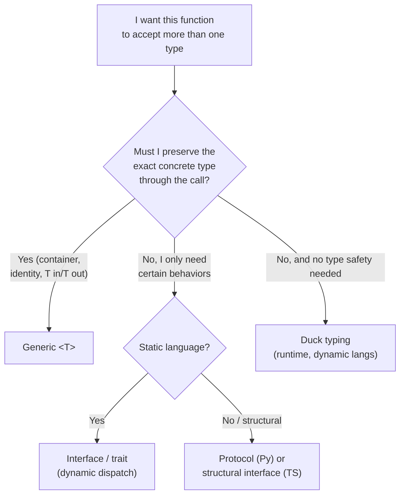

# Generics & Types — Middle Level

> Focus: "Why?" and "When does it bend?" — the trade-offs of generics, variance, and escape hatches. When a type parameter pays for itself, and when it's just noise.

---

## Table of Contents

1. [The core question: does this generic earn its keep?](#the-core-question-does-this-generic-earn-its-keep)
2. [YAGNI for type parameters](#yagni-for-type-parameters)
3. [Variance: why `List<Dog>` is not a `List<Animal>`](#variance-why-listdog-is-not-a-listanimal)
4. [When `any` / `interface{}` / `Object` is the right answer](#when-any--interface--object-is-the-right-answer)
5. [Type narrowing and exhaustiveness](#type-narrowing-and-exhaustiveness)
6. [Generics vs. interfaces vs. duck typing](#generics-vs-interfaces-vs-duck-typing)
7. [The readability cost of nested generic signatures](#the-readability-cost-of-nested-generic-signatures)
8. [Type inference and its limits](#type-inference-and-its-limits)
9. [Common Mistakes](#common-mistakes)
10. [Test Yourself](#test-yourself)
11. [Cheat Sheet](#cheat-sheet)
12. [Summary](#summary)
13. [Further Reading](#further-reading)
14. [Related Topics](#related-topics)

---

## The core question: does this generic earn its keep?

A generic exists to express **one relationship between two or more types** that the compiler then enforces everywhere. The canonical shape:

```ts
// The return type is tied to the input type. That tie is the whole point.
function first<T>(items: T[]): T | undefined {
  return items[0];
}

const n: number = first([1, 2, 3])!;   // T = number, inferred
const s: string = first(["a", "b"])!;  // T = string, inferred
```

Remove the type parameter and you lose the tie:

```ts
function first(items: unknown[]): unknown { /* ... */ }
const n = first([1, 2, 3]); // n: unknown — caller must cast. The contract is gone.
```

So the litmus test for "should this be generic?" is one question:

> **Is there a relationship between two types in this signature that I want the compiler to enforce?**

- **Container/element:** `Stack<T>` ties `push(T)` to `pop(): T`. Yes — generic.
- **Input/output transform:** `map<T, U>(items: T[], f: (t: T) => U): U[]`. Yes — `U` flows from `f`'s return into the result.
- **A function that takes a `User` and returns a `string`:** no relationship between unrelated types. Not generic.

When there is no relationship to tie, a type parameter is decoration. The next section is about resisting that decoration.

---

## YAGNI for type parameters

The most common middle-level mistake is **speculative generality** applied to types: adding `<T>` "in case we need it later."

### Symptom: the type parameter used exactly once

```ts
// Looks generic. Isn't earning it.
function logAndReturn<T>(value: T): T {
  console.log(value);
  return value;
}
```

`T` appears in both input and output, so this *resembles* the legitimate `first<T>` above. The difference: the body does nothing type-specific, and every caller could equally use a concrete type. The generic buys only identity-preservation — occasionally useful in a pipeline, usually overkill. If you only ever call `logAndReturn(user)`, write `logAndReturn(value: User): User`, or don't have the function at all.

### Symptom: the "framework for one"

```java
// One implementation. One caller. One set of types.
interface Repository<ID, ENTITY, QUERY, RESULT> {
    RESULT find(QUERY q);
    void save(ENTITY e);
}

class UserRepository implements Repository<Long, User, UserQuery, List<User>> { /* ... */ }
```

Four type parameters, one concrete subclass that pins all of them. The abstraction never varies, so it never pays off — it only makes every signature four words longer and every error message a paragraph. Write the concrete `UserRepository` with concrete methods. Introduce `Repository<ID, ENTITY>` the day you have a **second** entity that genuinely shares the contract.

### The rule

> Add a type parameter when you have (or imminently will have) **two or more** concrete instantiations, *or* when the type relationship is the contract you're selling to callers. One instantiation means no generic. This is YAGNI, applied to the type system.

The cost of being wrong is asymmetric, which is why "default to concrete" is correct. Removing an unused type parameter later is a trivial, local refactor. Adding one to a shipped non-generic function is also easy. So default to concrete and generalize on the second real use — you lose almost nothing by waiting and you avoid a whole class of premature abstraction.

---

## Variance: why `List<Dog>` is not a `List<Animal>`

This is the trade-off that trips up nearly everyone at the middle level. Intuition says "a `Dog` is an `Animal`, so a list of dogs is a list of animals." The type system says no — and it is **right**.

### The mutation problem

```java
List<Dog> dogs = new ArrayList<>();
List<Animal> animals = dogs;   // IF this were allowed...
animals.add(new Cat());        // ...you just put a Cat into a List<Dog>.
Dog d = dogs.get(0);           // ClassCastException at runtime. Disaster.
```

The danger is the **write**. A `List<Dog>` promises every element is a `Dog`. Treating it as `List<Animal>` would let a caller add a `Cat`, breaking that promise. So mutable generic containers are **invariant**: `List<Dog>` and `List<Animal>` are unrelated types, full stop.

### The direction matters — covariance and contravariance

The fix is to admit subtyping only in the direction that is safe:

- **Covariance (`? extends`)** — safe when you only **read** (the type is a *producer* of `T`).
- **Contravariance (`? super`)** — safe when you only **write** (the type is a *consumer* of `T`).

Java's wildcards make this explicit; the mnemonic is **PECS — Producer Extends, Consumer Super**:

```java
// Producer: we READ Animals out. Covariant. Accepts List<Dog>, List<Cat>, ...
double totalWeight(List<? extends Animal> animals) {
    double sum = 0;
    for (Animal a : animals) sum += a.weight();  // read: OK
    // animals.add(new Dog());                   // write: COMPILE ERROR — correct
    return sum;
}

// Consumer: we WRITE Dogs in. Contravariant. Accepts List<Dog>, List<Animal>, List<Object>.
void addPuppies(List<? super Dog> sink) {
    sink.add(new Dog());        // write: OK
    // Dog d = sink.get(0);     // read yields Object, not Dog — by design
}
```

### The same idea in other languages

```ts
// TypeScript: function PARAMETERS are contravariant under strictFunctionTypes.
type Animal = { weight: number };
type Dog = Animal & { bark(): void };

const handleAnimal: (a: Animal) => void = (a) => { /* uses .weight */ };
const handleDog: (d: Dog) => void = handleAnimal; // OK: an Animal-handler can stand in for a Dog-handler
// const x: (a: Animal) => void = handleDog;      // ERROR: a Dog-handler needs .bark, Animals lack it
```

TypeScript 4.7+ lets you annotate intent on a type parameter with `in` (contravariant) and `out` (covariant):

```ts
interface Producer<out T> { get(): T; }          // T only appears in output
interface Consumer<in T> { put(t: T): void; }    // T only appears in input
```

```python
# Python typing: variance is declared on the TypeVar, not the use site.
from typing import TypeVar, Generic

T_co = TypeVar("T_co", covariant=True)               # producer
T_contra = TypeVar("T_contra", contravariant=True)   # consumer

class Source(Generic[T_co]):
    def get(self) -> T_co: ...

class Sink(Generic[T_contra]):
    def put(self, value: T_contra) -> None: ...
```

Go (generics since 1.18) has **no variance and no wildcards** — type parameters are always invariant. The Go answer to "accept any animal list" is an interface element type, not a wildcard:

```go
type Animal interface{ Weight() float64 }

// Accepts []Animal. A []Dog must be converted/copied element-wise; there is no covariance.
func TotalWeight(animals []Animal) float64 {
    var sum float64
    for _, a := range animals { sum += a.Weight() }
    return sum
}
```

> **The trade-off:** variance annotations buy flexibility at the call site (your function accepts more list types) at the cost of restricting what the body may do (read-only or write-only). Reach for `? extends` / `out` the moment a method rejects valid callers because it over-promised mutability it never uses.

---

## When `any` / `interface{}` / `Object` is the right answer

The escape hatch is not always a sin. There are boundaries where the type genuinely **is not known statically**, and pretending otherwise produces worse code than admitting it.

### Legitimate uses

1. **The deserialization boundary.** JSON arriving over the wire has no compile-time type. The honest signature is `unknown` (TS) / `interface{}` or `any` (Go) / `Any` (Python) at the *edge*, immediately followed by validation that narrows it:

   ```ts
   function parseUser(raw: unknown): User {
     // `unknown` forces the narrowing. `any` would skip it silently.
     if (!isUser(raw)) throw new ValidationError("not a User");
     return raw; // narrowed to User here
   }
   ```

2. **Truly heterogeneous storage.** A generic event bus, a plugin registry, or a cache holding values of mixed types. The container legitimately holds "things," and type recovery happens on retrieval via a typed key or a tag.

3. **Reflection and serialization libraries.** Code that operates *on* arbitrary types by design (an ORM, a JSON encoder, a dependency-injection container) is exactly where `interface{}` / `Object` belongs.

### Illegitimate uses (lazy, not principled)

- Reaching for `any` because narrowing the type is *annoying*, not because the type is *unknown*.
- `as any` in TypeScript to silence an error you do not understand — this hides the mismatch until runtime, it does not fix it.
- A parameter typed `interface{}` / `Object` when the function only ever receives one or two concrete types.

> **The distinguishing test:** prefer `unknown` over `any` in TypeScript. `unknown` is the *honest* escape hatch — it admits "I don't know the type" while still **forcing** you to narrow before use. `any` says "I don't know and I don't care," and it poisons everything it touches: `let x: any; x.foo.bar.baz` compiles, then explodes in production. If `unknown` feels too painful, that pain is the type system correctly telling you a boundary needs validation. See [`../06-error-handling/README.md`](../06-error-handling/README.md) for handling the failures that boundary validation surfaces.

---

## Type narrowing and exhaustiveness

The flip side of escape hatches is recovering type safety *inside* a function. The premier tool is the **discriminated union** (tagged union / sum type), plus an exhaustiveness check that fails the build when a case is forgotten.

### TypeScript: discriminated unions + `never`

```ts
type Shape =
  | { kind: "circle"; radius: number }
  | { kind: "square"; side: number }
  | { kind: "rect"; w: number; h: number };

function area(s: Shape): number {
  switch (s.kind) {
    case "circle": return Math.PI * s.radius ** 2;
    case "square": return s.side ** 2;
    case "rect":   return s.w * s.h;
    default:
      // If a new variant is added to Shape and not handled above,
      // `s` is no longer `never`, and this line becomes a COMPILE ERROR.
      const _exhaustive: never = s;
      return _exhaustive;
  }
}
```

The `never` assignment is the load-bearing trick: it turns "forgot a case" from a silent runtime gap into a compile-time failure. Add `{ kind: "triangle"; ... }` to `Shape` and the build breaks at exactly the switches that need updating. This is the single highest-leverage typing pattern at the middle level.

### The same guarantee in other languages

```python
# Python 3.10+: match + assert_never (typing 3.11, or typing_extensions earlier)
from typing import assert_never

def area(s: Shape) -> float:
    match s:
        case Circle(radius=r): return 3.14159 * r * r
        case Square(side=a):   return a * a
        case _:                assert_never(s)  # mypy errors if a case is unhandled
```

```java
// Java 21: sealed interfaces + switch patterns are exhaustive by the COMPILER.
sealed interface Shape permits Circle, Square, Rect {}

double area(Shape s) {
    return switch (s) {                 // no default branch needed
        case Circle c -> Math.PI * c.radius() * c.radius();
        case Square q -> q.side() * q.side();
        case Rect r   -> r.w() * r.h();
    }; // adding a permit without a matching case = COMPILE ERROR
}
```

Go has no sum types and no compiler-enforced exhaustiveness. The idiomatic substitute is a type switch with a `default` panic, plus the `exhaustive` linter for enum-style constants:

```go
func area(s Shape) float64 {
    switch v := s.(type) {
    case Circle: return math.Pi * v.Radius * v.Radius
    case Square: return v.Side * v.Side
    default:
        panic(fmt.Sprintf("unhandled shape: %T", v)) // runtime, not compile-time
    }
}
```

> **The trade-off ranking:** Java sealed types and TS discriminated unions give *compile-time* exhaustiveness — the gold standard. Python's `assert_never` gives it *if you run mypy*. Go gives *runtime* detection only. Knowing which guarantee your language offers tells you how far you can lean on the compiler versus how much you must cover with tests.

---

## Generics vs. interfaces vs. duck typing

These are three different answers to "how does my function accept more than one type?" Choosing the wrong one is a common middle-level smell.



| Mechanism | Binds at | Use when | Cost |
|---|---|---|---|
| **Generic `<T>`** | compile time, monomorphized per type | you must preserve the *exact* type through the call (container, identity, relationship) | signature noise; longer error messages |
| **Interface / trait** | compile time, dynamic dispatch | callers vary but you only need a fixed set of *behaviors*; the concrete type can be forgotten | one vtable indirection; type erased |
| **Duck typing** | runtime | dynamic language, prototyping, or genuinely open-ended structural shapes | no compile-time safety; errors surface late |

### The decision in practice

```go
// Interface: you only need behavior and you discard the concrete type. Prefer this.
func WriteAll(w io.Writer, data [][]byte) { for _, d := range data { w.Write(d) } }

// Generic: you must RETURN the same concrete type you took in. An interface cannot do this.
func Map[T, U any](in []T, f func(T) U) []U {
    out := make([]U, len(in))
    for i, v := range in { out[i] = f(v) }
    return out
}
```

> **Rule of thumb (Go, but it generalizes):** if a type parameter appears in *exactly one* position and is otherwise only used for its methods, you wanted an interface, not a generic. Generics earn their place when a type appears in **multiple** positions and must stay the same across them.

In Python and TypeScript, "duck typing made safe" is **structural typing** — `Protocol` (Python) and plain interfaces / structural assignability (TS). These keep duck-typing's flexibility while adding compile-time checks: a value fits if it has the right shape, no `implements` keyword required.

```python
from typing import Protocol

class Writer(Protocol):
    def write(self, data: bytes) -> int: ...

def write_all(w: Writer, chunks: list[bytes]) -> None:  # any object with write() fits
    for c in chunks: w.write(c)
```

---

## The readability cost of nested generic signatures

Every type parameter is information the reader must hold in their head. Generics compose, and composed generics get unreadable fast:

```ts
// Technically correct. Practically unreadable.
function process<T extends Record<string, unknown>, K extends keyof T, R>(
  data: Map<K, Array<Partial<T>>>,
  reducer: (acc: R, item: Partial<T>, key: K) => R,
  seed: R
): Map<K, R> { /* ... */ }
```

Once a signature has three type parameters, two bounds, and four levels of nesting, the type *is* the complexity — and it has leaked from the implementation into every call site and every error message. The reader can no longer answer "what does this take and return?" without a whiteboard.

### Mitigations

1. **Name intermediate types.** Replace inline `Map<K, Array<Partial<T>>>` with a named `type Grouped<T, K> = Map<K, Partial<T>[]>`. The alias gives the reader a handle and a place for a doc comment.
2. **Cap your type parameters.** Two is comfortable, three is a warning, four is almost always a missing abstraction — the same instinct as "too many function parameters" (see [`../../refactoring/README.md`](../../refactoring/README.md) on Long Parameter List).
3. **Prefer concrete over clever.** Two readable concrete functions usually beat one unreadable generic one. The generic only wins if it eliminates *real* duplication, not hypothetical duplication.

> **The trade-off:** generics trade *implementation* duplication for *interface* complexity. A good trade when the duplication is large and the interface stays simple. A bad trade when you collapse two 10-line functions into one with a 5-line type signature — you saved 10 lines of body and spent them, illegibly, in the signature. The [`../../functional-programming/README.md`](../../functional-programming/README.md) section's higher-order combinators are the case where the trade reliably pays off.

---

## Type inference and its limits

Inference is what makes generics ergonomic — you write `first([1, 2, 3])`, not `first<number>([1, 2, 3])`. But inference has hard limits, and knowing them prevents both confusing errors and over-annotation.

### Where inference reliably works

- **From arguments to type parameters:** `map([1, 2], x => x * 2)` infers `T = number, U = number`.
- **From initializers:** `const xs = [1, 2, 3]` infers `number[]`.
- **From an unambiguous return position** in most languages.

### Where it breaks, and what to do

```ts
// 1. Empty literals have nothing to infer from.
const xs = [];          // any[] (or never[] under strict) — annotate: const xs: number[] = [];

// 2. A return type cannot drive parameter inference in TS.
const parsed = JSON.parse(text);  // returns `any` — annotate the target and validate:
const u: User = JSON.parse(text); // (see the narrowing section — validate before trusting)

// 3. Over-wide literal inference.
let mode = "fast";      // inferred `string`, not "fast" | "slow" — use `as const` or a literal type
```

```go
// Go: inference works from arguments, NOT from the result.
xs := Map([]int{1, 2}, func(i int) string { return strconv.Itoa(i) }) // T,U inferred from args
// n := Zero()   // if Zero[T]() takes no args, you MUST write Zero[int]() — nothing to infer from
```

```java
// Java: the diamond infers from the LHS; method type args usually infer from arguments,
// but a no-argument generic call needs an explicit witness:
var list = new ArrayList<String>();              // inferred from diamond + var
List<String> empty = Collections.emptyList();    // target-typed
var empty2 = Collections.<String>emptyList();    // explicit witness when no target/argument exists
```

> **The middle-level instinct:** let inference do the work in the common case, and reach for an explicit type argument only at the two places it genuinely cannot infer — **empty containers** and **functions whose type is fixed only by the return position**. Annotating everything "to be safe" is noise; annotating nothing leaves `any` / `never` landmines. Annotate at the inference boundaries.

---

## Common Mistakes

1. **A type parameter used in only one position.** `function log<T>(x: T): void` — `T` relates to nothing. Use a concrete type, or `unknown` if truly any type. (See [generics vs. interfaces](#generics-vs-interfaces-vs-duck-typing).)

2. **`any` where `unknown` was meant.** Using `any` at a deserialization boundary skips the narrowing that is the entire reason the boundary exists. `any` propagates silently; `unknown` forces validation.

3. **Assuming `List<Dog>` is a `List<Animal>`.** It is not, because writes would break the subtype's promise. Reach for `? extends` / `out` when you only read.

4. **`as` casts that lie.** `const u = data as User` asserts a type the compiler cannot verify. If `data` is not actually a `User` at runtime, you have moved a compile error into a production crash. Validate, do not assert.

5. **Forgetting the exhaustiveness check.** A `switch` over a union with no `never` default (TS) / `assert_never` (Python) silently does nothing when a new variant is added. Add the check so the compiler catches the omission.

6. **Unbounded generics where a bound was meant.** `function max<T>(a: T, b: T)` cannot compare arbitrary `T`. Constrain it: `<T extends Comparable<T>>` (Java) / `[T constraints.Ordered]` (Go) / `<T extends { compareTo(o: T): number }>` (TS).

7. **Over-nesting generic signatures.** Three-plus type parameters with multiple bounds usually signals a missing named abstraction, or that two concrete functions would read better.

8. **Stringly-typed instead of typed.** `fetch("GET", "/users")` where `method: "GET" | "POST"` and a typed route would catch typos at compile time. A union of string literals is nearly free and turns runtime 404s into red squiggles.

---

## Test Yourself

1. **You have one `UserRepository` and no plans for a second repository. Should `Repository<T>` be generic?**

<details><summary>Answer</summary>

No. A generic with a single instantiation is speculative generality — signature noise and worse error messages with zero payoff. Write the concrete `UserRepository`. Introduce `Repository<T>` the day a second entity genuinely shares the contract. Adding or removing a type parameter later is a cheap, local refactor, so default to concrete.

</details>

2. **Why does the compiler reject assigning a `List<Dog>` to a `List<Animal>`, even though a `Dog` is an `Animal`?**

<details><summary>Answer</summary>

Because of the *write* side. If `List<Dog>` were a `List<Animal>`, a caller could `.add(new Cat())` through the `Animal` view, violating the `List<Dog>` promise that every element is a `Dog`. Mutable containers are therefore invariant. You regain subtyping safely with `? extends Animal` (read-only / covariant) or `? super Dog` (write-only / contravariant) — PECS.

</details>

3. **When is `unknown` strictly better than `any`, and when is even `unknown` wrong?**

<details><summary>Answer</summary>

`unknown` is better at any boundary where the type is genuinely unknown (deserialization, dynamic input): it admits the uncertainty while *forcing* you to narrow before use, whereas `any` skips that and propagates silently. Even `unknown` is wrong when the type *is* known — there you should write the concrete type. The escape hatch is for boundaries, not for avoiding the work of typing known data.

</details>

4. **What does the `const _exhaustive: never = s` line in a TypeScript switch actually buy you?**

<details><summary>Answer</summary>

Compile-time exhaustiveness. After every variant is handled, TS narrows `s` to `never`, so the assignment type-checks. Add a new variant to the union and `s` is no longer `never` at that point, so the assignment becomes a compile error — pointing at exactly the switches that need a new case. It converts "forgot a case" from a silent runtime gap into a build failure.

</details>

5. **A Go function has a type parameter `T` used only to call `T`'s `Read` method, appearing nowhere else. What did the author actually want?**

<details><summary>Answer</summary>

An interface (`io.Reader`), not a generic. A type parameter earns its place only when the type appears in *multiple* positions and must stay identical across them (e.g., take `[]T` and return `[]T`). When `T` is used solely for its behavior in one position, an interface with dynamic dispatch is simpler and reads better.

</details>

6. **Your generic function's signature has grown to three type parameters and two `extends` bounds. What does that signal?**

<details><summary>Answer</summary>

Usually a missing abstraction or a bad trade. Generics trade implementation duplication for interface complexity; once the signature is harder to read than the bodies it unifies, the trade has gone negative. Mitigations: name intermediate types with aliases, cap type parameters at two (three is a warning), or split back into concrete functions if the "duplication" was small.

</details>

7. **You write `const items = []` and later get `any[]` errors. Why did inference not help, and what is the fix?**

<details><summary>Answer</summary>

An empty literal gives inference nothing to work from — there are no elements whose type could flow into the array type, so TS falls back to `any[]` (or `never[]` under strict settings). This is one of the two genuine inference boundaries. The fix is an explicit annotation: `const items: number[] = []`. The other boundary is a function whose type is fixed only by the return position, which also needs an explicit type argument.

</details>

8. **When does collapsing two concrete functions into one generic function make the code worse, not better?**

<details><summary>Answer</summary>

When the duplication removed is smaller than the interface complexity added. Generics trade implementation duplication for signature complexity. Unifying two 10-line bodies behind a 5-line type signature with multiple bounds spreads illegible complexity across every call site and error message — a net loss. The generic pays off only when the shared body is substantial and the resulting signature stays simple (one or two type parameters).

</details>

---

## Cheat Sheet

| Situation | Decision |
|---|---|
| Type appears in **one** position, used only for behavior | Interface / trait, not a generic |
| Type appears in **multiple** positions, must stay identical | Generic `<T>` |
| Only one concrete instantiation today | Stay concrete; generalize on the second |
| You only **read** elements out | Covariant: `? extends` / `out T` |
| You only **write** elements in | Contravariant: `? super` / `in T` |
| You both read and write | Invariant — no wildcard |
| Type genuinely unknown (wire, dynamic) | `unknown` (TS) / `interface{}` / `Any` at the edge, then narrow |
| Silencing a compiler error you don't understand | Stop — validate, never `as any` |
| `switch` over a closed set of variants | Add exhaustiveness check (`never` / `assert_never` / sealed) |
| Need duck-typing flexibility + safety | Structural typing: `Protocol` (Py), interface (TS) |
| Signature has 3+ type parameters | Name intermediate types or split the function |
| Empty container or return-only generic | Annotate explicitly — inference can't help |
| Comparing/ordering generic values | Add a bound (`Comparable`, `constraints.Ordered`) |

---

## Summary

- A type parameter earns its keep only when it **ties two or more types together** for the compiler to enforce. One position used for behavior wants an interface; one instantiation wants a concrete type.
- **YAGNI applies to type parameters.** Default to concrete; the cost of generalizing later is trivial and local, so there is no reason to pay the abstraction tax up front.
- **Mutable containers are invariant** — `List<Dog>` is not a `List<Animal>` because writes would break the promise. Use covariance (`? extends` / `out`) for read-only and contravariance (`? super` / `in`) for write-only.
- `any` / `interface{}` / `Object` is **legitimate at boundaries** (deserialization, heterogeneous storage, reflection) and lazy everywhere else. Prefer `unknown`: the honest escape hatch that still forces narrowing.
- **Discriminated unions plus an exhaustiveness check** (`never`, `assert_never`, sealed types) turn forgotten cases from runtime gaps into build failures — the highest-leverage typing pattern at this level.
- Generics trade implementation duplication for **interface complexity**. Past two or three type parameters the trade usually goes negative; name intermediate types or split.
- **Lean on inference** in the common case, and annotate only the two boundaries it cannot cross: empty containers and return-position-only generics.

---

## Further Reading

- *Effective Java* (Joshua Bloch), Items 26–33 — generics, bounded wildcards, and PECS, the definitive treatment.
- *Programming TypeScript* (Boris Cherny) — variance, discriminated unions, and `unknown` vs `any` in depth.
- The Go blog, "An Introduction to Generics" — when to use generics and the "prefer interfaces" guidance from the language designers.
- *Types and Programming Languages* (Benjamin Pierce) — the theory behind variance and subtyping, if you want the foundations.

---

## Related Topics

- [`junior.md`](junior.md) — the syntax and mechanics of generics, type parameters, and basic constraints.
- [`senior.md`](senior.md) — type-level programming, API design under generics, and migration of untyped codebases.
- [`../README.md`](../README.md) — the Clean Code chapter index.
- [`../14-immutability/README.md`](../14-immutability/README.md) — immutable data is what makes covariant read-only views safe; the two topics reinforce each other.
- [`../06-error-handling/README.md`](../06-error-handling/README.md) — typed `Result`/`Either` and the failures that boundary validation surfaces.
- [`../../functional-programming/README.md`](../../functional-programming/README.md) — higher-order combinators where generics reliably pay off.
- [`../../refactoring/README.md`](../../refactoring/README.md) — Long Parameter List and the "too many type parameters" parallel.
