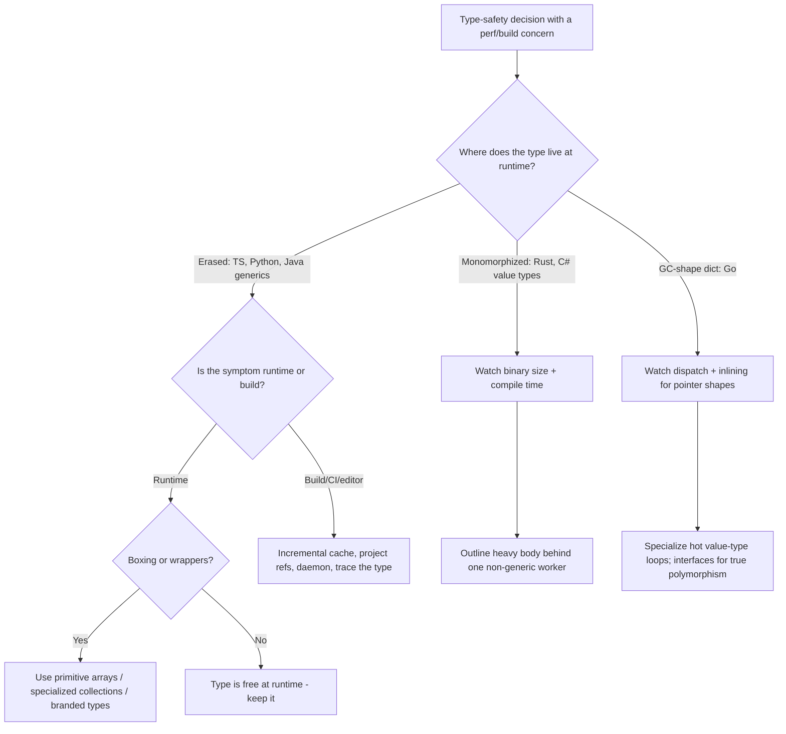

# Generics & Types — Optimize & Reconcile

> Types are a contract checked by the compiler. The question is always: **what survives to runtime, and what does the compiler pay to verify it?** In TypeScript the answer is "nothing survives, but `tsc` can choke." In Java it's "erasure survives as `Object` plus autoboxing." In Go it's "monomorphization or a GC-shape dictionary." In Rust/C# it's "a fresh machine-code copy per type." Each model trades runtime cost, binary size, and build time differently. This file works through 12 scenarios where a type-safety decision has a measurable performance or build-cost consequence — and resolves each on principle, with numbers.

---

## Table of Contents

1. [`List<Integer>` autoboxing vs `int[]` (Java)](#scenario-1--listinteger-autoboxing-vs-int-java)
2. [Go generics: monomorphization vs GC-shape dictionary dispatch](#scenario-2--go-generics-monomorphization-vs-gc-shape-dictionary-dispatch)
3. [Rust/C# monomorphization code bloat](#scenario-3--rustc-monomorphization-code-bloat)
4. [TypeScript types are erased — but the compiler is not free](#scenario-4--typescript-types-are-erased--but-the-compiler-is-not-free)
5. [Conditional/union type explosion and instantiation-depth limits (TS)](#scenario-5--conditionalunion-type-explosion-and-instantiation-depth-limits-ts)
6. [Branded/nominal types are zero-cost at runtime (TS)](#scenario-6--brandednominal-types-are-zero-cost-at-runtime-ts)
7. [Runtime validation (zod/io-ts) at boundaries vs trusting the types](#scenario-7--runtime-validation-zodio-ts-at-boundaries-vs-trusting-the-types)
8. [Specialized primitive collections — fastutil/Eclipse Collections (Java)](#scenario-8--specialized-primitive-collections--fastutileclipse-collections-java)
9. [Generic method dispatch: virtual vs monomorphic (Go interface vs type param)](#scenario-9--generic-method-dispatch-virtual-vs-monomorphic-go-interface-vs-type-param)
10. [mypy / tsc CI time at scale](#scenario-10--mypy--tsc-ci-time-at-scale)
11. [Python generics are documentation — `TypeVar` costs nothing at runtime](#scenario-11--python-generics-are-documentation--typevar-costs-nothing-at-runtime)
12. [`Optional<T>` and wrapper allocation in hot loops (Java)](#scenario-12--optionalt-and-wrapper-allocation-in-hot-loops-java)
13. [Rules of Thumb](#rules-of-thumb)
14. [Related Topics](#related-topics)

---

### Scenario 1 — `List<Integer>` autoboxing vs `int[]` (Java)

You have a numeric-heavy path. Clean-code instinct says "use `List<Integer>`, it's generic and composes with the Collections API." Then a profile shows the loop is 4–6× slower than it should be and the heap is full of boxed integers.

```java
// "Clean" generic version
List<Integer> values = new ArrayList<>();
for (int i = 0; i < 10_000_000; i++) values.add(i);   // autobox: int -> Integer

long sum = 0;
for (int v : values) sum += v;                          // unbox: Integer -> int
```

```java
// Primitive version
int[] values = new int[10_000_000];
for (int i = 0; i < values.length; i++) values[i] = i;

long sum = 0;
for (int v : values) sum += v;
```

<details><summary>Resolution</summary>

**Measurement.** An `Integer` on a 64-bit JVM with compressed oops is **16 bytes** (12-byte object header + 4-byte `int` + padding). `ArrayList<Integer>` also stores a **4-byte reference** per element (8 bytes without compressed oops). So 10M `Integer`s cost roughly `10M × 16 = 160 MB` of objects **plus** `10M × 4 = 40 MB` of references = **~200 MB**. The `int[]` costs `10M × 4 = 40 MB` plus a one-time 16-byte header. That is a **~5× memory difference**.

Speed: the `int[]` is contiguous and cache-friendly — one sequential 40 MB sweep. The `List<Integer>` walks references to scattered heap objects, so each element is a potential cache miss; you also pay an unbox (a field load + null check) per element. Typical JMH result for a sum loop: **`int[]` ~3–6× faster**, and the boxed version generates GC pressure that a primitive array generates zero of.

**Why erasure causes this.** Java generics are *erased* — `List<Integer>` is `List<Object>` at runtime, and `Object` cannot hold a primitive. The boxing is not a style choice; it is forced by the runtime representation. There is no `List<int>` because the type parameter cannot bind to a non-reference type (until Valhalla's value types land).

**Principled resolution.**
- For a fixed-size or append-mostly numeric buffer in a hot path, **use `int[]`/`long[]`/`double[]` directly.** This is not premature optimization; it is choosing the correct representation for bulk numerics.
- If you need list semantics (dynamic growth, API composition) but on primitives, use a **specialized primitive collection** (Scenario 8) — `IntArrayList` from fastutil or Eclipse Collections — which stores an `int[]` internally and never boxes.
- Reserve `List<Integer>` for small collections, configuration, or code that is not hot. At 50 elements the memory and speed difference is irrelevant and the standard generic API wins on readability.

The type `List<Integer>` is *correct and clean*; it is simply the wrong **representation** for ten million numbers. The fix preserves type safety (`int[]` is statically typed) while removing the boxing tax.

</details>

---

### Scenario 2 — Go generics: monomorphization vs GC-shape dictionary dispatch

You wrote a generic `Map[T, U any]` helper. Coming from C++/Rust you assume Go fully monomorphizes (one specialized copy per type), so the call is as fast as a hand-written loop. A microbenchmark shows the generic version is **slower** than the non-generic equivalent for pointer/interface element types, and the disassembly shows an extra register holding a "dictionary."

```go
func Map[T, U any](in []T, f func(T) U) []U {
    out := make([]U, len(in))
    for i, v := range in {
        out[i] = f(v)
    }
    return out
}
```

<details><summary>Resolution</summary>

**How Go actually compiles generics.** Go does **not** monomorphize per concrete type. It monomorphizes per **GC shape** — a coarse equivalence class. All pointer-shaped types (`*T`, `[]T` headers, `string`, `interface`) share **one** instantiation; distinct value types of distinct sizes/layouts get their own. Inside a GC-shape instantiation, the function receives a hidden **dictionary** argument carrying the per-type metadata (method tables, type descriptors) it can't know statically.

**The cost.** For pointer-shaped `T`, the dictionary means:
- An extra implicit argument threaded through every generic call (register pressure, slightly larger stack frames).
- Method calls on a type-parameter value go through the dictionary's itable — effectively an **indirect call**, not inlined or devirtualized. This is similar in cost to calling through an interface: roughly **a few ns per call** and, crucially, **not inlinable**, which blocks downstream optimizations.

Measured: for trivial `f` over pointer types, generic `Map` can be **10–30% slower** than a non-generic hand-rolled loop because the closure call plus dictionary overhead dominates. For `int`/`float64` element types (distinct GC shapes), the body gets a more specialized instantiation and the gap narrows or vanishes.

**Principled resolution.**
- **Do not assume Go generics are zero-cost.** They are cheap, but for pointer-shaped types they behave closer to interface dispatch than to C++ templates. Verify with `go build -gcflags='-m'` (inlining decisions) and `go test -bench` + `-benchmem`.
- For genuinely hot inner loops over a *single* concrete type, a **non-generic specialized function** can still win — and it's perfectly clean to keep a generic public API plus a specialized fast path.
- The dictionary cost is real but small; the bigger trap is the **non-inlinable closure** `f`. If `f` is a hot, simple transform, a monomorphic loop with the transform inlined beats any generic abstraction. Reach for that only when a profile points at this exact loop.

The type safety of `Map[T, U]` is excellent and the dispatch cost is usually invisible. Know the model so you don't mis-attribute a regression.

</details>

---

### Scenario 3 — Rust/C# monomorphization code bloat

The opposite of Go: Rust and C# (for value-type generics) **fully monomorphize**. Your generic data structure is instantiated with 40 different concrete types across the codebase, and now your release binary is megabytes larger and the build takes noticeably longer.

```rust
// One generic definition...
pub fn process<T: Serialize + Clone>(items: &[T]) -> Vec<u8> { /* ~300 instrs */ }

// ...instantiated 40 times across the crate graph:
process::<User>(&users);
process::<Order>(&orders);
process::<Invoice>(&invoices);
// ... 37 more
```

<details><summary>Resolution</summary>

**The mechanism.** Rust generates a **separate compiled copy** of `process` for every distinct `T`. Forty instantiations of a 300-instruction function = forty 300-instruction functions in the binary, each optimized independently. C# does the same for **value-type** generic instantiations (`List<int>`, `List<DateTime>`), while sharing **one** instantiation across all reference types (`List<string>`, `List<User>` share code, since references are uniform pointers — the reverse of where Go specializes).

**Cost, with numbers.**
- **Binary size.** Pervasive generics are a leading cause of large Rust binaries. A heavily-generic crate can add hundreds of KB to MBs purely from duplicated instantiations. The classic real-world case: `serde` derive plus many types can dominate code size.
- **Compile time.** Each instantiation is type-checked, monomorphized, LLVM-IR'd, and optimized separately. Monomorphization + LLVM codegen is frequently the largest slice of a Rust build. Reducing instantiations directly cuts build time.
- **I-cache.** Forty near-identical copies pollute the instruction cache versus one shared routine.

**Principled resolution — the "thin generic wrapper" / outlining pattern.** Keep the generic surface for ergonomics and type safety, but funnel the heavy body through **one non-generic function** that operates on an erased representation:

```rust
pub fn process<T: Serialize + Clone>(items: &[T]) -> Vec<u8> {
    // tiny generic shim: converts to a uniform representation, then calls the
    // single monomorphic worker. Only this shim is duplicated per T.
    let bytes: Vec<Box<dyn erased_serde::Serialize>> = /* ... */;
    process_erased(&bytes)            // one shared copy does the real work
}

fn process_erased(items: &[Box<dyn erased_serde::Serialize>]) -> Vec<u8> { /* ~300 instrs, ONE copy */ }
```

Now the 300-instruction body exists **once**; only a tiny shim is duplicated 40×. This trades a little dynamic dispatch (`dyn`) for a large code-size and compile-time win. C# achieves the analogous effect by preferring reference-type or `object`-erased internals when value-type specialization isn't buying performance.

**When to leave it alone.** If the generic body is small (it inlines away) or instantiated with only a few types, monomorphization bloat is negligible and the full-speed specialized code is the right default. Measure binary size with `cargo bloat` / `cargo llvm-lines` before outlining — `llvm-lines` literally ranks functions by IR generated, which pinpoints the worst monomorphization offenders.

</details>

---

### Scenario 4 — TypeScript types are erased — but the compiler is not free

A teammate worries that the elaborate generic types in the codebase will "slow down the app." They want to delete them for performance.

```typescript
type DeepReadonly<T> = T extends (infer E)[]
  ? readonly DeepReadonly<E>[]
  : T extends object
    ? { readonly [K in keyof T]: DeepReadonly<T[K]> }
    : T;

function freeze<T>(x: T): DeepReadonly<T> { /* ... */ return x as DeepReadonly<T>; }
```

<details><summary>Resolution</summary>

**Runtime cost: exactly zero.** TypeScript types are **fully erased** by the compiler. `tsc` (and Babel/esbuild/swc in transpile-only mode) strip every type annotation, interface, `type` alias, generic parameter, and `as` cast before emitting JavaScript. `DeepReadonly<T>` produces **no** runtime code — the emitted JS is `function freeze(x){ return x; }`. There is no reflection, no metadata, no wrapper. Deleting types for *runtime* speed is a non sequitur; the shipped bundle is byte-identical whether the types are simple or baroque.

**Where the cost actually lives: the compiler.** Complex types cost **`tsc` time** and **editor responsiveness**. The type-checker evaluates conditional and mapped types lazily but, when forced (on hover, on error, on emit-with-checks), instantiation can blow up combinatorially. `DeepReadonly` on a deeply nested object type recurses structurally; over a large config type it can produce thousands of intermediate type instantiations.

**Numbers that matter.** On a large monorepo, `tsc --noEmit` can run from seconds to **many minutes**; a single pathological generic can add seconds to that and make the language server lag on every keystroke in affected files. The compiler tracks an instantiation budget and will hard-error with `TS2589: Type instantiation is excessively deep and possibly infinite` (see Scenario 5) once a type recurses past its depth ceiling.

**Principled resolution.**
- **Keep the types; they are free at runtime and they prevent bugs.** Do not delete a `DeepReadonly` for "performance" — there is no runtime performance to gain.
- If `tsc`/editor performance degrades, that is a **compiler-cost** problem, diagnosed with `tsc --extendedDiagnostics` and `tsc --generateTrace traceDir` (the latter produces a Chrome-loadable trace showing which type instantiations dominate `checkTime`).
- Tame an expensive type by **caching with a named alias**, capping recursion depth, or replacing an unbounded conditional with a generated concrete type. The fix targets the type's definition, not its existence.

The mental model: in TypeScript, types are a **build-time** asset with **runtime** value of zero bytes. Optimize them for compiler throughput, never for app speed.

</details>

---

### Scenario 5 — Conditional/union type explosion and instantiation-depth limits (TS)

A "clever" utility type works on small inputs, then `tsc` either takes 40 seconds on one file or fails outright with `TS2589`.

```typescript
// Builds a union of every dotted path through an object — quadratic-to-exponential.
type Paths<T, Prev extends string = ""> = {
  [K in keyof T]: T[K] extends object
    ? Paths<T[K], `${Prev}${K & string}.`> | `${Prev}${K & string}`
    : `${Prev}${K & string}`;
}[keyof T];

type AllPaths = Paths<EntireApplicationConfig>;  // 200-field nested config
```

<details><summary>Resolution</summary>

**Why it explodes.** Each level of nesting multiplies the union. A config with `b` branching factor and `d` depth yields on the order of `b^d` member strings. The checker must materialize and dedupe this union; union types over a few thousand members make every assignability check that touches `AllPaths` slow, because assignability against a union is **per-member**. Template-literal types compound it — concatenating a 1,000-member union with a 50-member union is a 50,000-member cross product.

**The hard ceiling.** TypeScript caps recursive type instantiation depth (historically around **50 levels** for the recursion guard, with a separate ~**100M** instantiation-count circuit breaker) and emits `TS2589: Type instantiation is excessively deep and possibly infinite`. This is a safety valve, not a bug — without it the checker could loop forever.

**Measurement.** Use `tsc --extendedDiagnostics`: watch `Instantiations` and `Check time`. A healthy project is in the low millions of instantiations; a single explosive type can push it to tens of millions and add **5–40 s** to a previously sub-second check. `--generateTrace` will show `Paths` dominating the flame chart.

**Principled resolution.**
- **Cap the recursion explicitly.** Add a depth counter as a tuple and bail at a fixed level:

```typescript
type Paths<T, D extends number = 5, Acc extends unknown[] = []> =
  Acc["length"] extends D ? never : /* ...recurse with [unknown, ...Acc]... */;
```

- **Prefer a generated concrete type** for huge fixed shapes. If `AllPaths` is over a *known* config, generate the literal union at build time (codegen) instead of computing it in the type system on every check. Codegen moves the cost off the hot `tsc` path entirely.
- **Narrow the input.** Computing paths over a 200-field config is almost always more than callers need; compute paths over the specific subtree a function touches.
- If the type is fundamentally needed, **memoize via intermediate named aliases** so the checker caches instantiations rather than recomputing them at each use site.

Type safety is achievable here; the unbounded version is just an O(b^d) algorithm running inside the type-checker. Bound it like any other algorithm.

</details>

---

### Scenario 6 — Branded/nominal types are zero-cost at runtime (TS)

You want to stop mixing up `UserId` and `OrderId` (both `string`) without paying for wrapper objects in a hot path that processes millions of IDs.

```typescript
// Object-wrapper approach — allocates
class UserId { constructor(public readonly value: string) {} }
class OrderId { constructor(public readonly value: string) {} }

// Branded approach — zero allocation
type Brand<T, B extends string> = T & { readonly __brand: B };
type UserId = Brand<string, "UserId">;
type OrderId = Brand<string, "OrderId">;

const asUserId = (s: string): UserId => s as UserId;  // erased cast, no runtime op
```

<details><summary>Resolution</summary>

**The runtime difference.** The `class` version creates a real object per ID: a heap allocation, a property access (`.value`) on every use, and GC pressure. Over 10M IDs that's 10M allocations. The **branded** type `Brand<string, "UserId">` is `string` intersected with a phantom `{ __brand }` property that **exists only in the type system**. The `__brand` field is never assigned at runtime; `asUserId(s)` compiles to `return s;`. A `UserId` *is* a `string` at runtime — same identity, same `===`, **zero allocation, zero indirection**.

**So you get nominal typing for free.** The compiler refuses to assign a `UserId` where an `OrderId` is expected (the brands differ), catching the exact bug — `getOrder(userId)` — at build time, while the emitted JS treats both as plain strings. This is the canonical "types are free at runtime" win: maximal safety, zero runtime tax.

**The one caveat.** Branding is a *compile-time fiction*. At runtime there is nothing to check — a value crossing a trust boundary (JSON from the network, a DB row) is **not** actually validated just because you typed it as `UserId`. The cast `s as UserId` asserts; it does not verify. That's the job of Scenario 7.

**Principled resolution.**
- Use **branded types** (or the equivalent in other languages: Go's `type UserID string`, a single-field struct; Java/C# wrapper records — though those *do* allocate unless value types) to get nominal safety in hot paths without wrappers.
- Reserve object wrappers for when you need attached **behavior** or **invariant-enforcing construction** that genuinely must travel with the value.
- Pair branding with **runtime validation at the boundary only** so the brand reflects a checked fact, not a wish.

Branded types are the textbook example of the chapter's thesis: the type costs nothing at runtime; it pays for itself entirely at compile time.

</details>

---

### Scenario 7 — Runtime validation (zod/io-ts) at boundaries vs trusting the types

A service parses every incoming request body with zod, and also re-validates the same objects on internal function calls "to be safe." A profile shows validation is a top CPU consumer.

```typescript
const User = z.object({
  id: z.string().uuid(),
  email: z.string().email(),
  roles: z.array(z.enum(["admin", "user", "guest"])),
  createdAt: z.string().datetime(),
});
type User = z.infer<typeof User>;

// At the boundary — correct:
const user = User.parse(req.body);

// Deep in a hot internal loop — wasteful:
function score(u: unknown): number {
  const user = User.parse(u);   // re-validating already-validated data
  return /* ... */;
}
```

<details><summary>Resolution</summary>

**Why this is needed at all.** TypeScript types are erased (Scenario 4), so `req.body as User` is a **lie** — nothing checks it at runtime. zod/io-ts/valibot exist to turn an untrusted `unknown` into a value whose shape is *actually verified*, then hand you a statically-typed result via `z.infer`. This is the correct way to bridge the erased-types gap at a trust boundary.

**The cost, with numbers.** Runtime validation is real work: per field it does type checks, regex (`.email()`, `.uuid()`, `.datetime()`), array iteration, and object construction. Benchmarks routinely show schema validators processing on the order of **hundreds of thousands to a few million simple objects/sec**, dropping sharply with regex-heavy or deeply nested schemas. For a complex object with email+uuid+datetime regexes, a single `parse` can cost **microseconds to tens of microseconds**. Multiply by request volume and by *redundant* internal re-validation and it becomes a measurable slice of CPU. (valibot and `@sinclair/typebox` are markedly faster than zod for the same schema, often several-fold, because of tree-shakable, lower-overhead designs.)

**Principled resolution — validate at the boundary, then trust the type.**
- **Validate exactly once, at the edge** (HTTP handler, queue consumer, DB read of untrusted data). After `User.parse(req.body)` succeeds, the value *is* a `User`; downstream code takes `User`, not `unknown`, and **must not re-validate**. The boundary is the only place the data was untrusted.
- This is the [Parse, Don't Validate](https://lexi-lambda.github.io/blog/2019/11/05/parse-don-t-validate/) discipline: parsing at the boundary produces a value whose *type* now encodes the invariant, so internal functions get safety from the type system at **zero runtime cost**.
- Use `.parse` for unknown input; use `.safeParse` to avoid exception cost on expected-invalid paths; choose a faster validator (typebox/valibot) when the boundary is genuinely hot.
- For ultra-hot ingestion, consider **compiled validators** (typebox compiles a schema to a specialized JS function via JIT-friendly code) which can be **an order of magnitude faster** than interpreted schema walking.

The reconciliation: runtime validation is the *price of erasure*, and it is worth paying — **once, at the boundary**. Everywhere inside that boundary, the erased type is free and you trust it. Re-validating internally pays the price repeatedly for a guarantee you already have.

</details>

---

### Scenario 8 — Specialized primitive collections — fastutil/Eclipse Collections (Java)

A graph algorithm keeps adjacency lists as `Map<Integer, List<Integer>>`. It's correct and generic, but for 50M edges it's slow and uses several GB.

```java
Map<Integer, List<Integer>> adjacency = new HashMap<>();   // boxes every vertex id
adjacency.computeIfAbsent(u, k -> new ArrayList<>()).add(v);
```

<details><summary>Resolution</summary>

**The boxing tax, compounded.** Every key and every list element is a boxed `Integer` (16 bytes + reference; Scenario 1). `HashMap.Node` itself is an object (~32–48 bytes) per entry. For 50M edges across millions of vertices you pay boxing on keys, boxing on every neighbor, node objects, and ArrayList headers — easily **2–4× the memory** of a primitive representation and far worse cache behavior, because every lookup chases references to scattered boxed objects.

**Specialized collections.** Libraries like **fastutil** and **Eclipse Collections** provide `Int2ObjectOpenHashMap`, `IntArrayList`, `IntOpenHashSet`, etc., backed by **primitive arrays** with open-addressing (no per-entry node objects, no boxing):

```java
import it.unimi.dsi.fastutil.ints.*;

Int2ObjectMap<IntArrayList> adjacency = new Int2ObjectOpenHashMap<>();
adjacency.computeIfAbsent(u, k -> new IntArrayList()).add(v);   // no boxing, contiguous storage
```

**Measurement.** Replacing `HashMap<Integer,…>` + `ArrayList<Integer>` with fastutil's primitive equivalents commonly yields **2–5× memory reduction** and **substantial throughput gains** (often 1.5–3×) on iteration-heavy numeric workloads, driven mainly by eliminated boxing and cache-friendly open-addressing. For 50M edges the difference can be the line between fitting in heap and OOM.

**Principled resolution.**
- The generic `Map<Integer, List<Integer>>` is the right *default*: it's standard, obvious, and fine up to moderate sizes. Don't pull in a dependency for a 1,000-entry map.
- When a numeric collection is **large** and **hot**, reach for fastutil / Eclipse Collections. You keep static type safety (`Int2ObjectMap` is fully typed) while dropping the boxing and node-object overhead the JDK's reference-only generics force.
- The deeper cause is the same as Scenario 1: erased generics can't hold primitives, so the JDK collections box. Specialized collections sidestep erasure by being hand-written per primitive — exactly the manual monomorphization that Java's generics don't do.

This is "the type is right, the representation is wrong" again, at the collection level.

</details>

---

### Scenario 9 — Generic method dispatch: virtual vs monomorphic (Go interface vs type param)

You need a `Sum` over anything addable. Two clean designs: an **interface** (`interface{ Add(x) }`) or a **type-parameter constraint** (`[T Number]`). The interface version is slower in a tight loop.

```go
// Interface-based — dynamic dispatch per call
type Adder interface{ Value() float64 }
func SumIface(xs []Adder) float64 {
    var s float64
    for _, x := range xs { s += x.Value() }   // virtual call, not inlined
    return s
}

// Type-parameter constrained — specialized by GC shape
type Number interface{ ~int | ~int64 | ~float64 }
func Sum[T Number](xs []T) T {
    var s T
    for _, x := range xs { s += x }            // direct add, inlinable for value shapes
    return s
}
```

<details><summary>Resolution</summary>

**The dispatch difference.** The interface version makes an **indirect (virtual) call** through the itable for every element — the compiler can't inline `Value()` because it doesn't know the concrete type, and indirect calls also defeat branch prediction in tight loops. The generic `Sum[T Number]` over a concrete value type (`int`, `float64`) gets a GC-shape instantiation where `s += x` is a **direct primitive add** with **no dispatch and full inlining**.

**Numbers.** For a trivial per-element operation, eliminating the virtual call and enabling inlining typically yields **2–10×** on the loop, because the operation itself is one instruction and the call overhead dominated. Verify with `go test -bench -benchmem` and inspect inlining via `-gcflags='-m'`. Note the nuance from Scenario 2: if `T` is **pointer-shaped**, the generic version routes through a dictionary and the advantage over an interface shrinks — generics help most for **distinct value shapes**.

**Principled resolution.**
- For **homogeneous numeric/value loops**, prefer the **type-parameter constraint** — it monomorphizes to direct, inlinable code and is also more precise (`Sum[int]` returns `int`, not `interface{}`).
- For **genuinely heterogeneous** collections (mixed concrete types behind one behavior), an interface is the correct *and* idiomatic tool — the dynamic dispatch is the feature, not a bug. Don't contort generics to avoid an interface that models the domain.
- Don't reach for either until the loop is shown hot. For a 100-element slice the dispatch cost is noise.

Same principle as Scenario 2/3: generics buy speed when they let the compiler specialize and inline; they buy nothing (or cost a dictionary) when the type is uniform-pointer-shaped.

</details>

---

### Scenario 10 — mypy / tsc CI time at scale

Type checking is correctness insurance, but on a large monorepo `tsc --noEmit` and `mypy` each take 6–12 minutes and gate every PR. Engineers start typing `# type: ignore` and `any` to "make CI faster."

<details><summary>Resolution</summary>

**Reframe: this is a build-throughput problem, not a reason to abandon types.** The runtime is unaffected either way (erasure). Slow type-checking is fixable with caching and incrementality, not by deleting types.

**TypeScript.**
- **`tsc --incremental`** (and project references / `--build` mode) persists a `.tsbuildinfo` so unchanged projects are skipped. On large repos this turns a cold 10-minute check into a warm **tens-of-seconds** check.
- Split the monorepo into **TypeScript project references**; each package type-checks independently and caches independently, so a one-line change rechecks one project, not the world.
- Diagnose with `tsc --extendedDiagnostics` (look at `Check time`, `Instantiations`, `Memory used`) and `--generateTrace` to find the expensive types (Scenario 5). One pathological generic can dominate the whole check.
- `skipLibCheck: true` skips checking `.d.ts` in `node_modules`, often a large, safe time saver.

**mypy.**
- Enable the **incremental cache** (on by default) and persist `.mypy_cache` between CI runs — cold vs warm mypy is frequently a **5–10×** difference.
- For very large codebases, **`mypy --daemon` (`dmypy`)** keeps an in-memory state and re-checks only changed files in **seconds**; pyright (the engine behind Pylance, in Node) is also substantially faster on many large codebases.
- Type-check **per package** in parallel CI jobs rather than one monolithic invocation.

**Numbers.** Realistic outcomes: incremental + caching commonly cuts a multi-minute check to **under a minute** warm; daemon mode brings interactive checks to **single-digit seconds**. The fix is engineering the build, not weakening the types.

**Principled resolution.** Never trade *type safety* for *CI seconds* — `any`/`# type: ignore` move the cost from a fast machine to a slow incident. Instead: enable incremental caching, use project references / daemon, parallelize per package, and fix the handful of pathological types that dominate the trace. The point of the checker is to be the cheap place a bug dies; keep it fast so the team keeps it on.

</details>

---

### Scenario 11 — Python generics are documentation — `TypeVar` costs nothing at runtime

A team hesitates to add `TypeVar`/`Generic[T]`/`list[int]` annotations to a hot numerical service, fearing runtime overhead.

```python
from typing import TypeVar, Generic
T = TypeVar("T")

class Stack(Generic[T]):
    def __init__(self) -> None:
        self._items: list[T] = []
    def push(self, x: T) -> None: self._items.append(x)
    def pop(self) -> T: return self._items.pop()
```

<details><summary>Resolution</summary>

**Runtime cost: effectively zero for the annotations themselves.** Python type hints are **not enforced at runtime** by the interpreter. `list[T]`, `Generic[T]`, and `x: T` are checked only by **mypy/pyright** at lint time. At runtime `Stack[int]()` and `Stack()` behave identically — Python stores the parametrization on `__orig_class__` but does no checking. With `from __future__ import annotations` (or Python 3.14's deferred evaluation), annotations are stored as strings and never even evaluated unless something introspects them, so the import/definition cost is negligible.

**The genuine micro-costs to know.**
- Evaluating an annotation expression *at module load* (without lazy annotations) costs a little; `TypeVar`/`Generic` subscription builds small objects once at class-definition time, not per instance. This is a one-time, sub-millisecond cost — irrelevant to steady-state throughput.
- `typing.get_type_hints()` and `@runtime_checkable` Protocols **do** cost at runtime if you actually call them in a hot path. Reflection-based dispatch (e.g., pydantic v1's per-field validation, `functools.singledispatch`) is where Python "type" machinery shows on a profile — and pydantic v2 moved its core to Rust precisely to cut that cost.

**Principled resolution.**
- **Annotate freely.** Static types in Python are documentation + a free correctness net via mypy; they don't slow the running program. The fear is misplaced.
- If a profile shows type-related runtime cost, it is almost always **runtime validation/reflection** (pydantic, `dataclasses` with validators, `get_type_hints`), *not* the annotations — the same boundary-validation trade-off as Scenario 7. Validate at the edge, trust internally.
- For numeric hot loops the real lever is representation (numpy arrays, not `list[int]`) — analogous to Java's `int[]` vs `List<Integer>`: the *type* is free, the *representation* is what costs.

</details>

---

### Scenario 12 — `Optional<T>` and wrapper allocation in hot loops (Java)

A clean API returns `Optional<Customer>` everywhere to avoid nulls. A profile of a 10M-iteration lookup loop shows `Optional` allocation as a measurable cost.

```java
public Optional<Customer> find(long id) {
    Customer c = cache.get(id);
    return Optional.ofNullable(c);     // allocates an Optional per call
}

// Hot loop:
for (long id : ids) {                  // 10M ids
    find(id).ifPresent(this::process);
}
```

<details><summary>Resolution</summary>

**The cost.** Each `Optional.ofNullable` may allocate a wrapper object (`Optional.empty()` is a shared singleton, but every *present* value is a fresh `Optional`). Over 10M present lookups that's up to 10M short-lived allocations — minor-GC churn, even though escape analysis *can* scalarize an `Optional` that doesn't escape. The trouble: when the `Optional` is **returned** from `find`, it escapes the method, so EA often can't elide it, and the allocation is real.

**Measurement.** For a tight loop dominated by trivial work, the per-call `Optional` allocation can add meaningful young-gen pressure and a measurable percentage to the loop; JMH plus `-prof gc` shows the allocation rate. If EA *does* scalarize (when `find` is inlined into the loop and the `Optional` provably doesn't escape), the cost vanishes — so always measure before reacting.

**Principled resolution.**
- **Keep `Optional` as the public API contract.** It's the right design: it makes absence explicit in the type, killing a class of NPEs. The chapter's whole point is that this type-safety is worth it.
- For a **proven-hot internal** path, drop to a representation that doesn't wrap: return the nullable reference directly (documented `@Nullable`), or use a primitive-specialized variant. For primitive results, `OptionalInt`/`OptionalLong`/`OptionalDouble` avoid the *additional* boxing that `Optional<Integer>` would incur.
- Effective Java's guidance applies: **don't return `Optional` from methods that are called in extremely hot loops on primitives** — the wrapper + boxing cost can dominate. Use `Optional` for ordinary APIs; use a fast nullable path behind the boundary where a profile demands it.

The reconciliation mirrors every scenario here: the **type** (`Optional<T>`) encodes a real invariant and is the correct default; the **cost** is the wrapper allocation, paid only when the path is hot enough to matter, and removed surgically — not by abandoning the safer API everywhere.

</details>

---

## Rules of Thumb



- **Types are usually free at runtime.** In TypeScript and Python they are *fully erased* — deleting them for "app speed" gains nothing. Optimize the **compiler/checker**, not the program.
- **The three real costs of generics are: boxing, monomorphization bloat, and compile time.** Name which one you're facing before touching anything.
- **Boxing is a representation problem, not a type problem.** `List<Integer>` is correct; `int[]` / fastutil is the right *representation* for bulk numerics. Same for `list[int]` vs numpy in Python.
- **Branded/nominal types give maximal compile-time safety at zero runtime cost.** Prefer them over wrapper objects in hot paths when you only need identity, not behavior.
- **Validate at the boundary, trust the type inside it.** zod/pydantic pay the price of erasure *once*, at the edge. Re-validating internally re-pays for a guarantee you already hold.
- **Go generics are not C++ templates.** For pointer-shaped types they dispatch through a dictionary (interface-like cost); they win for distinct value shapes by inlining. Verify with `-gcflags='-m'`.
- **Rust/C# monomorphization trades binary size and build time for speed.** When many instantiations bloat the binary, outline the heavy body behind one erased worker. Measure with `cargo llvm-lines` / `cargo bloat`.
- **Cap recursive types.** A conditional/mapped type with unbounded depth is an O(b^d) algorithm inside the checker; bound it or generate the concrete type at build time. Heed `TS2589`.
- **Never trade type safety for CI seconds.** Fix slow checking with incremental caches, project references, and daemons (`dmypy`, `tsc --build`) — not with `any` and `# type: ignore`.
- **Always measure before optimizing a type-related cost.** Escape analysis may already elide `Optional`/`Coord`; the JIT may already specialize. Profile (`JFR`, `-benchmem`, `--extendedDiagnostics`) before trading clarity for speed.

---

## Related Topics

- [find-bug.md](find-bug.md) — locate the type-safety hole or perf regression in a generic implementation before optimizing it.
- [professional.md](professional.md) — production practices for generic APIs, type design, and build-pipeline hygiene.
- [Chapter README](../README.md) — the positive rules for generics and types.
- [Objects and Data Structures](../05-objects-and-data-structures/README.md) — when to expose data vs. behavior, which decides whether a wrapper type carries methods (Scenario 6) or just identity.
- [Functional Programming](../../functional-programming/README.md) — parse-don't-validate, immutability, and totality, which underpin boundary validation (Scenario 7) and branded types (Scenario 6).
