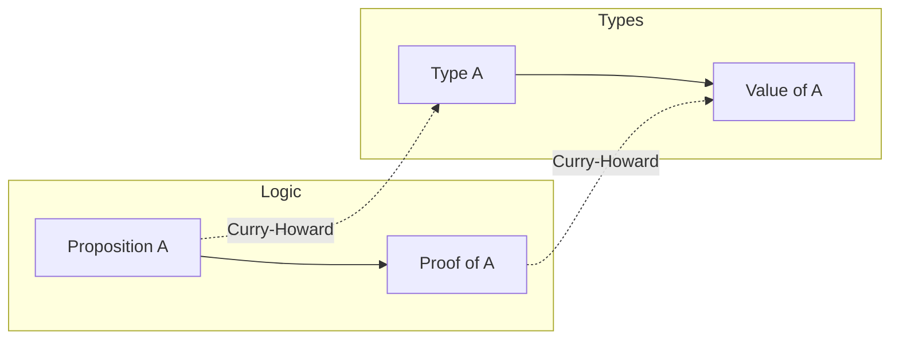

# Generics & Types — Professional Level

> Focus: the type-theoretic foundations under the everyday advice. Algebraic data types as algebra, parametricity and "theorems for free," "parse, don't validate," making illegal states unrepresentable, generics *implementation* strategies and their measured cost, variance as a soundness obligation, the unsound corners of real type systems, and where type-level cleverness stops paying rent.

---

## Table of Contents

1. [Types as propositions — the Curry–Howard view](#types-as-propositions--the-curryhoward-view)
2. [Algebraic data types — sum and product as algebra](#algebraic-data-types--sum-and-product-as-algebra)
3. [Parametricity — theorems for free](#parametricity--theorems-for-free)
4. [Parse, don't validate](#parse-dont-validate)
5. [Making illegal states unrepresentable](#making-illegal-states-unrepresentable)
6. [How generics are *implemented* — and what it costs](#how-generics-are-implemented--and-what-it-costs)
7. [Variance, formally](#variance-formally)
8. [Higher-kinded types and what languages lack them](#higher-kinded-types-and-what-languages-lack-them)
9. [The limits of unsound type systems](#the-limits-of-unsound-type-systems)
10. [Type-level programming and when it becomes too clever](#type-level-programming-and-when-it-becomes-too-clever)
11. [Gradual typing theory](#gradual-typing-theory)
12. [Common Mistakes](#common-mistakes)
13. [Test Yourself](#test-yourself)
14. [Cheat Sheet](#cheat-sheet)
15. [Summary](#summary)
16. [Further Reading](#further-reading)
17. [Related Topics](#related-topics)

---

## Types as propositions — the Curry–Howard view

The Curry–Howard correspondence states that types *are* propositions and programs *are* their proofs. A function `A -> B` is a proof that "from a witness of `A` you can construct a witness of `B`." This is not a metaphor for working engineers — it is the reason a well-chosen type *prevents* a class of bugs at compile time rather than catching them at runtime.

| Logic | Types |
|---|---|
| Proposition `A` | Type `A` |
| Proof of `A` | Value of type `A` |
| `A ∧ B` (and) | Product `(A, B)` / struct |
| `A ∨ B` (or) | Sum `A | B` / tagged union |
| `A ⇒ B` (implies) | Function `A -> B` |
| `True` | Unit type (`()`, `void`-ish, `null`-free unit) |
| `False` | Empty / uninhabited type (`never`, Rust `!`) |
| `¬A` | `A -> False` |

The practical consequence: if your type is *inhabited only by valid values*, then constructing a value is a proof of validity, and code downstream cannot observe an invalid state. The whole of "parse, don't validate" and "illegal states unrepresentable" falls out of taking this correspondence seriously. The empty type matters too — `never` in TypeScript and `!` in Rust mark code paths that cannot return, which the compiler uses for exhaustiveness reasoning.



---

## Algebraic data types — sum and product as algebra

ADTs are called *algebraic* because the operations on them mirror arithmetic on the *number of values a type can hold* (its cardinality).

- **Product type** `(A, B)` — a struct/tuple/record. Cardinality `|A| × |B|`. It holds an `A` *and* a `B`.
- **Sum type** `A + B` — a tagged union / discriminated union / enum-with-payload. Cardinality `|A| + |B|`. It holds an `A` *or* a `B`, with a tag saying which.

This algebra is exact. `Bool` has cardinality 2. `(Bool, Bool)` has 4. `Bool + Bool` (e.g. `Either<bool, bool>`) has 4 as well but the two arms are distinguishable. The empty type has cardinality 0; the unit type has cardinality 1. `1 + A` is "optional `A`" — exactly `Option`/`Maybe`/nullable.

The design lesson: **prefer sums where the domain is genuinely a choice**, and avoid encoding a sum as a product with "impossible" combinations. A classic anti-pattern is the product where some field combinations are illegal:

```typescript
// BAD: product type with 2^3 = 8 states, but only 3 are legal
interface RequestState {
  loading: boolean;
  data?: Response;
  error?: Error;
}
// loading && data && error? loading && error? All representable, all nonsense.

// GOOD: sum type — exactly 3 states, nothing else representable
type RequestState =
  | { status: "loading" }
  | { status: "success"; data: Response }
  | { status: "error"; error: Error };
```

The same modelling in each language:

```haskell
data RequestState
  = Loading
  | Success Response
  | Failure Error
```

```rust
enum RequestState {
    Loading,
    Success(Response),
    Failure(Error),
}
```

```go
// Go has no sum types. The idiomatic encoding is a sealed interface:
type RequestState interface{ isRequestState() }

type Loading struct{}
type Success struct{ Data Response }
type Failure struct{ Err error }

func (Loading) isRequestState() {}
func (Success) isRequestState() {}
func (Failure) isRequestState() {}
// Exhaustiveness is NOT checked by the compiler — a type switch can silently
// miss a case. This is Go's biggest type-modelling gap (proposal: golang/go#19412).
```

```python
# Python: a Union of frozen dataclasses; exhaustiveness via match + assert_never
from dataclasses import dataclass

@dataclass(frozen=True)
class Loading: ...
@dataclass(frozen=True)
class Success: data: "Response"
@dataclass(frozen=True)
class Failure: error: Exception

RequestState = Loading | Success | Failure
```

```java
// Java 21 sealed interface + records + pattern matching switch
sealed interface RequestState permits Loading, Success, Failure {}
record Loading() implements RequestState {}
record Success(Response data) implements RequestState {}
record Failure(Throwable error) implements RequestState {}
```

Sealed hierarchies (Java `sealed`, Kotlin `sealed`, Rust `enum`, TS discriminated union, Haskell `data`) let the compiler verify **exhaustiveness**: every `match`/`switch` must handle every arm, so adding a fourth state breaks compilation everywhere that needs updating. That is the payoff — the compiler maintains your case analysis for you.

---

## Parametricity — theorems for free

Parametric polymorphism (generics) carries a deep guarantee Reynolds and Wadler formalized: a *fully parametric* function cannot inspect the values of its type parameters, so its behavior is constrained purely by its type. Wadler's "Theorems for Free!" (1989) shows you can read non-trivial theorems straight off a polymorphic signature.

The textbook example:

```haskell
-- The ONLY total, non-bottom function with this type is `id`.
f :: a -> a
-- Parametricity proof sketch: f cannot construct an `a` (it knows nothing about a),
-- cannot inspect the `a`, so the only value it can return is the one it received.
```

```haskell
-- Any function of this type satisfies: map g . f == f . map g  (a "free theorem").
f :: [a] -> [a]
-- It can drop, duplicate, reorder, or rearrange elements, but it can NEVER
-- invent new ones or examine their values. So pre- or post-mapping g commutes.
```

Why a working engineer cares:

- A signature like `<T> List<T> dedup(List<T> in)` *cannot* depend on what `T` is — so it must be implemented via `equals`/`Comparable` passed explicitly, or it is suspicious. If it secretly does `instanceof String`, parametricity is broken and the "free" reasoning your callers rely on is a lie.
- **The narrower the type, the more behavior is pinned down.** `<T> T head(List<T>)` can only return an element of the list (or diverge/throw). `Object head(List<?>)` could return anything. Prefer the parametric signature.
- Constraints (`T extends Comparable<T>`, Rust trait bounds, Go `constraints.Ordered`, Haskell type classes) *relax* parametricity in a controlled way: now the function may use exactly the capabilities the bound grants, and nothing else. The free theorem weakens precisely by what you added.

**Parametricity is broken by escape hatches**: reflection, `instanceof`/type assertions, `any`, runtime type tests. Each one converts a "theorem for free" into "read the implementation and hope." Treat them as parametricity-defeating and isolate them.

---

## Parse, don't validate

Alexis King's "Parse, don't validate" (2019) is the engineering distillation of Curry–Howard. A *validator* checks a condition and returns `bool` (or throws), leaving the input at its original, still-too-wide type — the proof of validity evaporates the instant the function returns. A *parser* consumes a wide input and returns a *narrower type* that can only exist if the input was valid; the proof is captured in the type and travels with the value.

```haskell
-- Validation: the knowledge "this list is non-empty" is thrown away.
validateNonEmpty :: [a] -> Bool

-- Parsing: the result type GUARANTEES non-emptiness for everyone downstream.
parseNonEmpty :: [a] -> Maybe (NonEmpty a)
```

The smell that "parse, don't validate" eliminates is the **shotgun re-check** — the same `if list.isEmpty() throw` repeated at every layer because no layer can trust that an earlier one already checked. Parse once at the boundary; thereafter the type carries the invariant.

```typescript
// Validate (bad): callers still receive `string`, must re-check or trust by convention.
function isValidEmail(s: string): boolean { /* ... */ }

// Parse (good): the only way to get an `Email` is through the parser at the edge.
type Email = string & { readonly __brand: unique symbol };
function parseEmail(s: string): Email | null {
  return /^[^@]+@[^@]+$/.test(s) ? (s as Email) : null;
}
function send(to: Email) { /* no re-validation; the type is the proof */ }
```

```rust
// Rust: the smart-constructor / newtype pattern. The field is private,
// so the only way to obtain an Email is via try_new -> validity is structural.
pub struct Email(String);
impl Email {
    pub fn try_new(s: String) -> Result<Self, ParseError> {
        if s.contains('@') { Ok(Email(s)) } else { Err(ParseError) }
    }
}
```

```python
# Python: parse at the boundary with a validating model; the rest of the app
# receives the parsed type, not raw dict[str, Any].
from pydantic import BaseModel, EmailStr
class Signup(BaseModel):
    email: EmailStr          # parsed; downstream code never sees an invalid string
    age: int
```

Push parsing to the **outermost boundary** (HTTP handler, CLI arg parse, file read). The interior of the system then speaks only in already-parsed, total types, and most defensive `if`s disappear.

---

## Making illegal states unrepresentable

Yaron Minsky's maxim from the OCaml-at-Jane-Street world: design types so the *invalid* configurations simply cannot be constructed. It is the structural sibling of "parse, don't validate" — the latter is about boundaries, this is about the interior data model.

Tactics, in increasing power:

1. **Replace booleans-with-correlations by a sum.** Two booleans that are never both true → a three-arm enum.
2. **Make optional fields conditional on a tag.** `data` should exist only in the `success` arm — express it inside the arm, not as a top-level `data?`.
3. **Use `NonEmptyList`, `Positive`, `Percentage` newtypes** so the invariant lives in the type, not in scattered guards.
4. **Phantom types / type-state** to track lifecycle in the type: a `Connection<Open>` and `Connection<Closed>` are different types, so `read` can require `Connection<Open>` and the compiler rejects reading a closed one.

```rust
// Type-state: `send` exists only on Open; close() consumes and returns Closed.
struct Connection<State> { /* ... */ _s: PhantomData<State> }
struct Open; struct Closed;
impl Connection<Open> {
    fn send(&self, _m: &[u8]) { /* ... */ }
    fn close(self) -> Connection<Closed> { /* ... */ }
}
// conn.send() after close() is a *compile* error, not a runtime panic.
```

The reward is the same in every language: bugs become *unrepresentable* rather than *untested*. You delete the test for "what if data is present during loading?" because the state cannot be built.

---

## How generics are *implemented* — and what it costs

The same source-level generic compiles to wildly different machine code depending on the strategy. This is where "generics are free" stops being true and you must measure.

### Type erasure (Java, Kotlin, Scala, TypeScript)

The type parameter is *erased* after type-checking; one compiled body serves all instantiations. `List<String>` and `List<Integer>` are the same class at runtime.

- **Cost:** primitives must be **boxed** (`List<Integer>` stores `Integer` objects, each a heap allocation with a header). No generic-specialized machine code, so no monomorphization bloat.
- **Consequences:** you cannot write `new T[n]`, `T.class`, or `o instanceof List<String>`. Reflection sees `List`, not `List<String>`. Java's `Arrays` vs `List` mismatch (covariant arrays, invariant generics) traces directly to erasure being bolted on for backward compatibility.

```java
List<String> ls = new ArrayList<>();
List<Integer> li = new ArrayList<>();
// true at runtime — same Class object. Erasure made the parameter vanish.
System.out.println(ls.getClass() == li.getClass());
```

### Reified monomorphization (C#, Rust, C++ templates)

A *separate* specialized copy of the code is generated for each concrete type argument. `Vec<i32>` and `Vec<String>` are distinct, fully specialized machine code.

- **Cost:** **code bloat** and longer compile times; each instantiation is its own function the instruction cache must hold. Rust's and C++'s notorious compile times are partly this.
- **Win:** no boxing, full inlining, types are reified — C# can do `typeof(T)` and `new T[n]` because the runtime knows `T`. Rust generics are zero-cost at runtime, paid for at compile time.

### Go — GC-shape stenciling with dictionaries

Go 1.18+ chose a hybrid that is worth understanding precisely, because it surprises people who expect either erasure or full monomorphization. Go generates **one copy of the code per *GC shape*** ("stenciling"), where a GC shape groups types the garbage collector treats identically (e.g. all pointer-shaped types share one shape; each distinct value layout gets its own). Runtime type information that the shared body needs is threaded in through an implicit **dictionary** argument.

- All pointer-typed instantiations (`*T`, interfaces, slices, maps, strings via their headers) collapse to *one* stenciled body, parameterized by a dictionary. Distinct *value* layouts (e.g. `int`, a 24-byte struct) get their own stencils.
- **Cost:** dictionary indirection can add overhead and **inhibit inlining and devirtualization** versus full monomorphization. Generic Go code over interface-shaped types can be *slower* than the equivalent hand-monomorphized code — a measured, documented effect; benchmark hot generic paths.

```go
// One stenciled body serves *T for all pointer T; an int instantiation gets its own.
func Max[T constraints.Ordered](a, b T) T { if a > b { return a }; return b }
```

### Implementation-strategy comparison

| Strategy | Languages | Primitive cost | Code size | Runtime type info | Inlining |
|---|---|---|---|---|---|
| Erasure | Java, Kotlin, Scala, TS | Boxing | Minimal (1 body) | Lost (`List` only) | Through one shared body |
| Monomorphization | C#, Rust, C++ | None | Bloat (N bodies) | Reified (`typeof T`) | Full, per-instantiation |
| GC-shape stenciling | Go 1.18+ | None for values; ptr shapes share | Moderate (per GC shape) | Via dictionary | Often inhibited for shared shapes |

**Engineering takeaway:** "generics" is not one performance profile. On the JVM, prefer specialized primitive collections (`IntArrayList`, Valhalla value types eventually) for hot numeric loops. In Go, do not assume a generic helper matches hand-written code on a hot path — `go test -bench` it. In Rust/C#, watch *binary size* and compile time, not runtime.

---

## Variance, formally

Variance answers: if `Cat <: Animal`, what is the subtype relationship between `Box<Cat>` and `Box<Animal>`? For a type constructor `F`:

- **Covariant** (`F<+T>`): `Cat <: Animal ⇒ F<Cat> <: F<Animal>`. Safe when `T` appears only in **output** position (you read `T` out).
- **Contravariant** (`F<-T>`): `Cat <: Animal ⇒ F<Animal> <: F<Cat>`. Safe when `T` appears only in **input** position (you write `T` in). A `Comparator<Animal>` *is a* `Comparator<Cat>`.
- **Invariant**: no relationship. Required when `T` is in **both** positions (read *and* write), e.g. a mutable `Box<T>` with `get` and `set`.

The mnemonic is the **PECS** rule (Naftalin & Wadler, *Java Generics and Collections*): **Producer Extends, Consumer Super**.

```java
// Producer (we read T out) -> use extends (covariant)
void copy(List<? extends Number> src, List<? super Number> dst) {
    for (Number n : src) dst.add(n);  // read from src, write to dst
}
```

Declaration-site (Kotlin `out`/`in`, Scala `+`/`-`) vs use-site variance (Java wildcards): declaration-site is decided once by the library author; use-site is decided per usage by the caller. Kotlin chose declaration-site precisely because Java wildcards are notoriously hard to use correctly at every call.

```kotlin
interface Source<out T> { fun next(): T }      // covariant: T only produced
interface Sink<in T> { fun accept(item: T) }    // contravariant: T only consumed
```

**The famous soundness hole — Java's covariant arrays.** Java arrays are covariant (`String[] <: Object[]`), but arrays are *mutable* (you can read and write), which by the rule above must be *invariant*. The unsoundness is patched at runtime:

```java
Object[] arr = new String[2];   // legal: arrays are covariant
arr[0] = 42;                     // compiles fine; throws ArrayStoreException at RUNTIME
```

This is exactly why generics chose invariance: the type system trades a compile-time error for the runtime check that arrays still require. Function types are the canonical mixed case — `(A) -> B` is **contravariant in `A`, covariant in `B`**.

---

## Higher-kinded types and what languages lack them

A *kind* is "the type of a type." A concrete type like `Int` has kind `*`. A type constructor like `List` is not itself a type — it's a function on types, kind `* -> *`. A **higher-kinded type (HKT)** is a generic that abstracts over a type *constructor* rather than a type:

```haskell
-- `f` here is a type CONSTRUCTOR (kind * -> *), not a type.
class Functor f where
  fmap :: (a -> b) -> f a -> f b
-- One Functor instance covers List, Maybe, Either e, IO, ... uniformly.
```

This lets you write `map`, `traverse`, `sequence` *once* for every container, and is the foundation of `Functor`/`Applicative`/`Monad` abstractions.

| Language | HKT support |
|---|---|
| Haskell | Native (`f :: * -> *`) |
| Scala | Native (`F[_]`) |
| Rust | **No** (only via GATs + traits as a partial workaround; full HKT absent) |
| Java | **No** (cannot write `interface Functor<F<?>>`) |
| Go | **No** (no generic type parameters that are themselves generic) |
| TypeScript | **No** natively (simulated with the "lightweight HKT"/defunctionalization encoding) |
| Kotlin | **No** |
| Swift | Limited |

The mainstream languages' lack of HKT is *why* you cannot write a single generic `Repository<F>` abstracting "the effect type" (`Optional`, `CompletableFuture`, `Result`) — you end up duplicating the interface per effect, or erasing types. Recognizing "I want HKT here and the language can't express it" is the senior signal to **stop fighting the type system** and pick a simpler, duplicated-but-honest design.

---

## The limits of unsound type systems

A type system is **sound** if "well-typed programs don't go wrong" — a value's runtime type always matches its static type. Several mainstream systems are *deliberately* unsound for ergonomics or backward compatibility. Knowing the holes is professional self-defense.

### TypeScript — unsound by design

The TS team explicitly states soundness was traded for productivity. Known holes:

- **`any`** — opts a value entirely out of checking; it is assignable to and from everything, and *propagates* silently through expressions.
- **Type assertions (`as`)** — assert a type the compiler can't verify; a runtime lie if wrong. `as any as T` is the universal escape hatch.
- **Bivariant method parameters** — under default settings, method parameters are checked *bivariantly* (both co- and contravariantly), which is unsound. `strictFunctionTypes` fixes *function-typed properties* but, by design, **not method syntax**, to preserve array/DOM ergonomics.
- **`as const` + index access, excess-property holes, `Object.keys` returning `string[]`** — small daily unsoundnesses.

```typescript
const xs: number[] = [1, 2, 3];
const obj: { a: number } = xs[10] as { a: number }; // compiles; obj is `undefined` at runtime
```

### Java — array covariance (above) and unchecked casts

`(List<String>) rawList` produces only an *unchecked* warning; the cast is unverifiable due to erasure and can plant a `ClassCastException` far from its cause (heap pollution).

### The professional stance

Treat every escape hatch (`any`, `as`, `@SuppressWarnings("unchecked")`, `interface{}` + assertion, Python `cast`, Rust `unsafe`) as a **localized, documented, tested exception** — wrap it in a parser at a boundary so the unsoundness can't travel. Lint them: `@typescript-eslint/no-explicit-any`, `no-unsafe-*`; `golangci-lint forcetypeassert`; `-Xlint:unchecked -Werror`.

---

## Type-level programming and when it becomes too clever

TypeScript's conditional types, mapped types, template literal types, and recursion make the type system Turing-complete (it has been shown you can implement nontrivial computation in types). The same is true of C++ templates and Haskell with extensions. This is power that **earns its place at library boundaries and burns money in application code**.

```typescript
// Legitimately useful: derive the param object type of an event map.
type Handlers<E> = { [K in keyof E]: (payload: E[K]) => void };

// Too clever: a fully type-level SQL parser in template literal types.
// Compile times explode, errors become unreadable walls, and the next
// engineer cannot maintain it. The cost is paid on every `tsc` run forever.
```

Heuristics for "too clever":

- **Error messages** become multi-screen and reference internal helper types — the cost has shifted to every future reader.
- **Compile time** measurably regresses (TS `--diagnostics`, `--generateTrace`; Rust `cargo build --timings`).
- The abstraction is used in **exactly one place** — a comment or a runtime check would be simpler and clearer.
- You're encoding *business logic* in types. Types should make illegal states unrepresentable, not run your domain rules.

The senior judgment: type-level programming in a *published library's public surface* (where it buys safety for thousands of callers) is often worth it; the same technique in a single app's internals is usually premature cleverness. Prefer the simplest types that make the illegal states unrepresentable, and stop there.

---

## Gradual typing theory

Gradual typing (Siek & Taha, 2006) formalizes the *mixing* of statically and dynamically typed code via a **dynamic type** (`Any`/`any`) and a **consistency** relation that is reflexive and symmetric but **not transitive** — that intransitivity is what lets `Any` mediate between otherwise-incompatible types without collapsing the whole system.

The crucial theoretical result is the **gradual guarantee**: making annotations *more precise* should only ever turn runtime errors into static errors, never change a program's behavior otherwise. Sound gradual systems enforce the static/dynamic boundary with **runtime casts** — which is where the *cost* lives.

- **Python (`mypy`, `pyright`)** — type hints are **erased**; CPython does **no runtime enforcement**. So Python's gradual typing is *optional and unsound at runtime* by default. A wrong hint is a lie CPython never catches; only the checker does, and only on annotated paths. Runtime enforcement requires opt-in tools (`typeguard`, `beartype`, Pydantic).
- **TypeScript** — same shape: `any` is the dynamic type, all types erased, **zero runtime enforcement**. The "boundary cast" cost Siek's theory predicts is simply *skipped*, which is *why* TS unsoundness can reach runtime silently.
- **Sound gradual typing (Typed Racket)** inserts contracts at boundaries; this is theoretically clean but can carry severe runtime overhead (the well-known performance cliff of fully-sound gradual typing).

**Engineering implication:** because Python and TS *erase* and do *not* enforce at runtime, a type annotation is a **claim checked only where the checker runs**. Untyped or `any` regions are unverified holes. The professional pattern is to **parse at the dynamic/static boundary** (Pydantic, Zod, io-ts) so a real runtime check restores the guarantee the gradual system declined to enforce.

---

## Common Mistakes

1. **Encoding a sum as a product** — three booleans for a three-state machine, then guarding the 5 illegal combinations everywhere. Use a discriminated union.
2. **`any`/`interface{}`/`Object` as the default escape valve** — it deletes parametricity and pushes every guarantee to runtime. Constrain instead (`T extends X`, trait bounds, `constraints.Ordered`).
3. **Unbounded `<T>` where a bound was intended** — `<T> T max(T a, T b)` cannot compare; you meant `<T extends Comparable<T>>`. The compiler should reject misuse, not the runtime.
4. **`as`/unchecked casts that lie about runtime types** — `x as Foo` with no parser behind it plants a delayed `ClassCastException`/`undefined`. Parse and narrow instead.
5. **Validating instead of parsing** — returning `bool` and re-checking the same condition at every layer. Parse once at the boundary into a narrow type.
6. **Assuming generics are free at runtime** — boxing on the JVM, dictionary indirection in Go, binary bloat in Rust. Benchmark hot generic paths.
7. **Relying on TS/Java unsound corners** — covariant method params, array covariance, `as any as T`. Enable `strict`/`-Xlint:unchecked -Werror` and treat escapes as audited exceptions.
8. **Type-level cleverness in application code** — a Turing-complete type computation no teammate can read, paid for on every compile.
9. **Trusting Python/TS hints at runtime** — they're erased and unenforced; add a real parser at the boundary.
10. **Stringly-typed APIs** — `fetch("GET", "/users")` instead of typed verb/route values, defeating the type system at the most error-prone edge.

---

## Test Yourself

1. **Why is a `{ loading: bool; data?: T; error?: E }` shape a type smell, in cardinality terms?**

<details><summary>Answer</summary>

It is a *product* with cardinality `2 × (|T|+1) × (|E|+1)`, but the domain has only three legal states. The extra states (loading with data and error, neither loading nor done, etc.) are representable and must be defended against at runtime. A *sum* type (`loading | success(T) | error(E)`) has cardinality exactly 3 — illegal states become unrepresentable, and exhaustiveness checking maintains your case analysis.

</details>

2. **You see `<T> List<T> sortDescending(List<T> in)` with no bound. What does parametricity tell you, and what's wrong?**

<details><summary>Answer</summary>

Parametricity says a fully generic `[a] -> [a]` cannot inspect element values — it can only reorder/drop/duplicate them. So it *cannot* sort by value without a comparison capability. The signature is either lying (it secretly does `instanceof Comparable`, breaking the free theorem) or impossible. The correct signature passes the capability: `<T extends Comparable<T>>` or an explicit `Comparator<T>` parameter.

</details>

3. **`List<String> ls; List<Integer> li; ls.getClass() == li.getClass()` — true or false on the JVM, and why does it matter?**

<details><summary>Answer</summary>

true. Erasure means both are `ArrayList` at runtime; the type argument is gone. It matters because you cannot do `new T[]`, `T.class`, reflection on the type argument, or `instanceof List<String>`, and `(List<String>) raw` is only an unchecked cast that can cause heap pollution and a delayed `ClassCastException`. Contrast C#, where reified generics make `typeof(T)` and `new T[n]` work.

</details>

4. **Why are Java arrays covariant but generics invariant, and what is the cost of the array choice?**

<details><summary>Answer</summary>

Mutable containers read *and* write `T`, so soundness *requires* invariance. Java made arrays covariant (a pre-generics decision for code reuse) and pays for it with a runtime `ArrayStoreException` check on every array store — `Object[] a = new String[1]; a[0] = 42;` compiles but throws at runtime. Generics, designed later, chose invariance and use wildcards (`? extends`/`? super`, PECS) to opt into variance only where it is read-only or write-only.

</details>

5. **Go: why might a generic `Max[T]` be slower than a hand-written `int` version, despite "monomorphization"?**

<details><summary>Answer</summary>

Go uses **GC-shape stenciling**, not full monomorphization. All pointer-shaped instantiations share one stenciled body parameterized by a runtime **dictionary**; the dictionary indirection can inhibit inlining and devirtualization. For value types like `int` you get a dedicated stencil (fast), but for interface/pointer-shaped `T` the shared body plus dictionary can lose to hand-specialized code. Always `go test -bench -benchmem` hot generic paths.

</details>

6. **What does "parse, don't validate" capture that "validate your inputs" misses?**

<details><summary>Answer</summary>

A validator returns `bool` and leaves the value at its wide type, so the proof of validity is discarded the moment it returns — forcing every downstream layer to re-check or blindly trust. A parser returns a *narrower type* (`NonEmpty a`, `Email`, parsed model) that can only be constructed from valid input, so the invariant is captured in the type and travels with the value. Parse once at the boundary; the interior speaks only total types.

</details>

7. **Why is TypeScript unsound even with `strict: true`, and name one hole that remains?**

<details><summary>Answer</summary>

TS deliberately trades soundness for productivity. Even under `strict`, `any` opts out of checking and propagates; `as` assertions are unverified runtime lies; and **method-syntax parameters are checked bivariantly** — `strictFunctionTypes` only fixes function-typed *properties*, not method declarations, to keep array/DOM types ergonomic. Hence `xs[10]` is typed `number` though it's `undefined` at runtime.

</details>

8. **What is a higher-kinded type, and why can't you write a single generic `Functor` in Java or Go?**

<details><summary>Answer</summary>

An HKT abstracts over a type *constructor* (kind `* -> *`) rather than a type (kind `*`) — e.g. `Functor f` where `f` is `List`/`Maybe`/`IO`. Java and Go generics can only take *types* as parameters, not type constructors, so you cannot express `interface Functor<F<?>>`. The result is per-effect duplication (`Optional`, `Future`, `Result` each get their own interface) or type erasure. Recognizing the missing HKT is the cue to choose a simpler, honest design.

</details>

9. **A teammate writes a 200-line type-level CSV parser in TS template literal types. What questions decide whether it stays?**

<details><summary>Answer</summary>

(1) Does it live in a library's public surface (safety for many callers) or one app internal (premature)? (2) What does `tsc --diagnostics`/`--generateTrace` show for compile-time regression? (3) Are the *error messages* readable, or multi-screen references to internal helper types? (4) Is it encoding business logic in types (wrong) versus making illegal states unrepresentable (right)? Usually: move it to runtime parsing or a simpler type; types shouldn't run your domain.

</details>

10. **Your Python service has full type hints and `mypy` passes, yet a `str` shows up where an `int` was annotated at runtime. How?**

<details><summary>Answer</summary>

Python type hints are **erased** and CPython enforces nothing at runtime — gradual typing here is unsound by default. The bad value entered through an unchecked boundary (untyped JSON, `Any`, a wrong `cast`, a third-party stub gap) that `mypy` never saw or where `Any` masked it. Gradual typing's consistency relation lets `Any` bridge silently. Fix: parse at the boundary with Pydantic/`typeguard`/`beartype` so a real runtime check restores the guarantee.

</details>

---

## Cheat Sheet

| Concept | One-line professional take |
|---|---|
| Curry–Howard | Types are propositions; a value is a proof. A precise type *is* a compile-time correctness argument. |
| Product `A×B` | struct/tuple — holds `A` **and** `B`. |
| Sum `A+B` | discriminated union — holds `A` **or** `B`; enables exhaustiveness checking. |
| Cardinality smell | If legal states < representable states, switch product → sum. |
| Parametricity | A fully generic signature constrains behavior; escape hatches (`any`, reflection) void the free theorem. |
| Parse, don't validate | Return a narrower *type*, not `bool`; capture the proof, parse once at the boundary. |
| Illegal states unrepresentable | Model so invalid configs can't be constructed (sums, newtypes, type-state). |
| Erasure (Java/Kotlin/Scala/TS) | One body, boxing for primitives, no runtime type args. |
| Monomorphization (C#/Rust/C++) | N specialized bodies; no boxing, code bloat, slow compiles, reified types. |
| GC-shape stenciling (Go 1.18+) | One body per GC shape + dictionary; can inhibit inlining — benchmark. |
| Variance / PECS | Producer `extends` (covariant out), Consumer `super` (contravariant in), mutable → invariant. |
| Array covariance hole | Java arrays covariant but mutable ⇒ runtime `ArrayStoreException`. |
| HKT | Abstracts over a type *constructor*; absent in Java/Go/Kotlin/TS — expect per-effect duplication. |
| TS unsoundness | `any`, `as`, bivariant method params survive `strict`; never reaches runtime safety. |
| Type-level cleverness | Earns its keep in library surfaces; premature in app internals — watch compile time & error size. |
| Gradual typing (Py/TS) | Hints erased, unenforced at runtime; parse at the boundary to restore the guarantee. |

---

## Summary

The everyday rules of this chapter — prefer constrained generics over `any`, model with discriminated unions, don't lie with casts — are downstream of a small set of deep ideas. **Curry–Howard** says a precise type is a proof, so **algebraic data types** (sums for choices, products for conjunctions) let the compiler maintain your case analysis and make **illegal states unrepresentable**. **Parametricity** turns generic signatures into free theorems, which is exactly why escape hatches are expensive: each one voids a guarantee and pushes it to runtime. **"Parse, don't validate"** operationalizes all of this at boundaries — return narrow types, not booleans.

On the implementation side, "generics" is three different performance stories — **erasure** (boxing, no runtime types), **monomorphization** (no boxing, bloat), and **Go's GC-shape stenciling** (dictionaries that can inhibit inlining) — so you must know which you're paying for and benchmark hot paths. **Variance** is a soundness obligation (PECS; Java's covariant-array hole shows the cost of getting it wrong), **HKT** is the expressiveness ceiling most mainstream languages hit, and the **unsound corners** of TS and Java plus the **erased, unenforced** nature of Python/TS gradual typing mean the type system is only as strong as its weakest boundary. The senior discipline is to make the type carry the invariant — and to stop exactly when type-level cleverness stops paying rent.

---

## Further Reading

- Philip Wadler, *Theorems for Free!* (FPCA 1989) — parametricity and free theorems.
- Alexis King, *Parse, Don't Validate* (2019) — the design principle, with Haskell examples.
- Yaron Minsky, *Effective ML* / "Make illegal states unrepresentable" (Jane Street) — type-driven domain modelling.
- Maurice Naftalin & Philip Wadler, *Java Generics and Collections* — PECS, wildcards, erasure in depth.
- Jeremy Siek & Walid Taha, *Gradual Typing for Functional Languages* (2006) — the gradual guarantee and consistency.
- Benjamin Pierce, *Types and Programming Languages* (TAPL) — soundness, variance, the Curry–Howard correspondence formally.
- The Go Blog, *An Introduction to Generics* and the dictionaries-and-GC-shapes design doc — Go's implementation strategy.
- TypeScript Handbook, *Type Compatibility* and the design-goals note on intentional unsoundness.
- John Reynolds, *Types, Abstraction and Parametric Polymorphism* (1983) — the origin of parametricity.

---

## Related Topics

- [senior.md](senior.md) — applied generic design: bounded type parameters, variance in real APIs, newtypes.
- [interview.md](interview.md) — generics & types Q&A across levels.
- [Chapter README](../README.md) — the positive rules and anti-patterns for this chapter.
- [Immutability](../14-immutability/README.md) — newtypes and unrepresentable-state modelling pair with immutable data.
- [Error Handling](../06-error-handling/README.md) — `Result`/`Either` sum types and parsing at boundaries.
- [Functional Programming](../../functional-programming/README.md) — ADTs, parametricity, and HKT in their native habitat.
- Algebraic Data Types — sums and products in depth.
