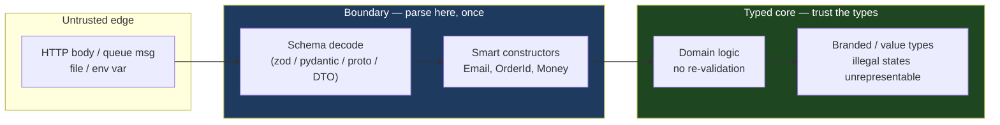
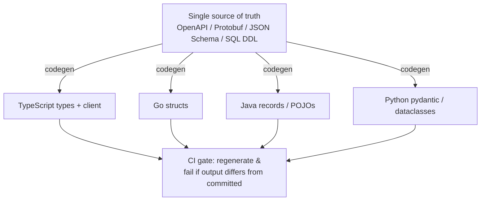

# Generics & Types — Senior Level

> Focus: type discipline across a codebase — designing APIs that make misuse impossible, modeling the domain with types, turning strictness on incrementally without halting delivery, shipping inference-friendly generics in shared libraries, generating types from schemas at every boundary, and migrating untyped code at scale.

---

## Table of Contents

1. [The senior mandate: types are a team-scale invariant](#the-senior-mandate-types-are-a-team-scale-invariant)
2. [Parse, don't validate — the boundary contract](#parse-dont-validate--the-boundary-contract)
3. [Domain modeling with types](#domain-modeling-with-types)
4. [Designing generic APIs for shared libraries](#designing-generic-apis-for-shared-libraries)
5. [Banning `any` and enabling strictness incrementally](#banning-any-and-enabling-strictness-incrementally)
6. [Schema-to-type generation at boundaries](#schema-to-type-generation-at-boundaries)
7. [Migrating untyped code at scale](#migrating-untyped-code-at-scale)
8. [CI/CD: enforcing type discipline](#cicd-enforcing-type-discipline)
9. [Common Mistakes](#common-mistakes)
10. [Test Yourself](#test-yourself)
11. [Cheat Sheet](#cheat-sheet)
12. [Summary](#summary)
13. [Further Reading](#further-reading)
14. [Related Topics](#related-topics)

---

## The senior mandate: types are a team-scale invariant

At junior level you choose the right type for a variable. At senior level you decide **where the type system's guarantees begin and end** — and you encode that decision so the whole team inherits it for free.

The governing idea: a type is a **compressed proof**. `NonEmptyList<OrderLine>` is a proof, checked at compile time, that nobody downstream needs a `if (lines.isEmpty())` guard. Every such proof you push to the boundary deletes a class of runtime bugs and a class of defensive code from the interior.



The senior's three levers across a codebase:

| Lever | What it controls | Mechanism |
|---|---|---|
| **Boundary discipline** | Where untyped data becomes typed | parse-don't-validate, schema codecs |
| **Domain vocabulary** | What the interior is allowed to say | branded/opaque types, smart constructors, value objects |
| **Strictness ratchet** | How much the compiler enforces | `strict`, `--strict`, lint bans, never loosening |

These are not stylistic preferences. They are **architectural constraints** that you enforce through config and CI so that they survive turnover, deadline pressure, and the next twenty PRs.

---

## Parse, don't validate — the boundary contract

The canonical senior failure mode is the codebase that validates the *same* untyped value in twelve places:

```typescript
// Anti-pattern: validation scattered, type never changes.
function sendInvoice(email: string) {
  if (!email.includes("@")) throw new Error("bad email"); // again
  // ...
}
function subscribe(email: string) {
  if (!isValidEmail(email)) throw new Error("bad email"); // and again
  // ...
}
```

`string` carries no proof. Every consumer re-validates or — worse — forgets to. **Parse, don't validate**: do the check *once*, at the edge, and emit a type that *cannot* exist unless the check passed.

```typescript
// Branded type: a string the compiler refuses to confuse with a raw string.
declare const brand: unique symbol;
type Email = string & { readonly [brand]: "Email" };

// Smart constructor — the ONLY way to produce an Email.
function parseEmail(raw: string): Email {
  const v = raw.trim().toLowerCase();
  if (!/^[^@\s]+@[^@\s]+\.[^@\s]+$/.test(v)) {
    throw new TypeError(`invalid email: ${raw}`);
  }
  return v as Email; // the single sanctioned cast, isolated in one function
}

// Interior signatures now demand proof. Misuse is a compile error.
function sendInvoice(email: Email) { /* no re-validation */ }

sendInvoice("hi");                 // ✗ compile error: string is not Email
sendInvoice(parseEmail(req.body.email)); // ✓ proof carried in the type
```

The same shape in the other three languages:

```python
# Python — NewType is the zero-cost branding primitive; pydantic does the parse.
from typing import NewType
from pydantic import BaseModel, EmailStr

Email = NewType("Email", str)

class Signup(BaseModel):
    email: EmailStr          # parsed + validated at the boundary
    age: int

def send_invoice(email: Email) -> None: ...   # interior trusts the type
# mypy --strict rejects send_invoice("hi"); only NewType-wrapped values pass.
```

```go
// Go — unexported field + constructor makes the zero value unconstructable elsewhere.
package email

type Email struct{ v string }                 // v is unexported: package-private

func Parse(raw string) (Email, error) {
    v := strings.ToLower(strings.TrimSpace(raw))
    if !emailRe.MatchString(v) {
        return Email{}, fmt.Errorf("invalid email: %q", raw)
    }
    return Email{v}, nil
}
func (e Email) String() string { return e.v }
// No other package can build a non-empty Email except via Parse — the proof holds.
```

```java
// Java — record + compact constructor; validation inside the type, not the caller.
public record Email(String value) {
    public Email {                              // compact canonical constructor
        Objects.requireNonNull(value);
        value = value.trim().toLowerCase();
        if (!EMAIL.matcher(value).matches())
            throw new IllegalArgumentException("invalid email");
    }
    private static final Pattern EMAIL = Pattern.compile("^[^@\\s]+@[^@\\s]+\\.[^@\\s]+$");
}
```

**The team-scale payoff:** when `Email` exists, a code reviewer seeing `function send(email: string)` in a PR knows instantly it's wrong — the smell is *visible in the signature*. The type becomes the review checklist.

> **The one rule about casts:** every `as`, `# type: ignore`, `interface{}` assertion, and `(Cast)` should live inside a named parse function, not scattered through business logic. One audited unsafe line at the boundary is fine; a hundred unaudited ones are a typed codebase that lies.

---

## Domain modeling with types

Senior type design is **making illegal states unrepresentable**. If a state can't be constructed, you delete every test, guard, and bug for that state.

### Value objects over primitive tuples

A `Money` flowing as `(amount float64, currency string)` invites `addUSD(eur)`:

```go
type Currency string // ISO-4217; could be a sealed enum-like set
type Money struct {
    cents    int64    // integer minor units — never float for money
    currency Currency
}
func (a Money) Add(b Money) (Money, error) {
    if a.currency != b.currency {
        return Money{}, fmt.Errorf("currency mismatch: %s + %s", a.currency, b.currency)
    }
    return Money{a.cents + b.cents, a.currency}, nil
}
```

### Sum types / discriminated unions for state machines

Model "exactly one of N shapes" so impossible combinations can't compile:

```typescript
// A request is loading XOR loaded XOR errored — never two at once.
type RemoteData<T, E> =
  | { status: "loading" }
  | { status: "success"; data: T }
  | { status: "error"; error: E };

function render(r: RemoteData<User, ApiError>) {
  switch (r.status) {
    case "loading": return spinner();
    case "success": return view(r.data);   // r.data is in scope ONLY here
    case "error":   return banner(r.error); // r.error is in scope ONLY here
    // exhaustiveness: add a 4th case and TS flags every switch missing it
    default: { const _exhaustive: never = r; return _exhaustive; }
  }
}
```

```python
# Python 3.10+ — pattern matching + frozen dataclasses as a closed union.
from dataclasses import dataclass

@dataclass(frozen=True)
class Loading: ...
@dataclass(frozen=True)
class Success: data: "User"
@dataclass(frozen=True)
class Failure: error: str

RemoteData = Loading | Success | Failure

def render(r: RemoteData) -> str:
    match r:
        case Loading():        return spinner()
        case Success(data=d):  return view(d)
        case Failure(error=e): return banner(e)
    # mypy --strict warns if a variant is unhandled
```

Java seals the hierarchy so the compiler enforces exhaustiveness in `switch`:

```java
sealed interface RemoteData<T> permits Loading, Success, Failure {}
record Loading<T>()        implements RemoteData<T> {}
record Success<T>(T data)  implements RemoteData<T> {}
record Failure<T>(String error) implements RemoteData<T> {}

String render(RemoteData<User> r) {
    return switch (r) {                       // no default needed — sealed = exhaustive
        case Loading<User> l    -> spinner();
        case Success<User> s    -> view(s.data());
        case Failure<User> f    -> banner(f.error());
    };
}
```

### The modeling checklist a senior applies

- **Can two fields be inconsistent?** → replace with a sum type. (No more `isLoading && data != null`.)
- **Is there a primitive with rules?** → wrap it in a value object with a smart constructor.
- **Can a collection be empty when callers assume it isn't?** → `NonEmptyList<T>`.
- **Are two IDs swappable at a call site?** → brand them: `UserId` vs `OrderId`, both wrapping `UUID`.
- **Is `null` meaningful or accidental?** → `Optional<T>` / `T | undefined` / `*T`, and turn on null-strictness so the compiler tracks it.

---

## Designing generic APIs for shared libraries

A shared library's generics are a **public contract for the org**. The bar is higher than application code: the signature is read a thousand times, changed at peril, and inference quality determines whether teams adopt or route around it.

### Constrain generics; never leave them unbounded by accident

The README's anti-pattern: `<T>` where you meant `<T extends Comparable<T>>`. An unbounded `T` permits no operations, so the implementation reaches for casts and the call site loses safety.

```java
// Bad: unbounded; body must cast, callers get no guarantee.
static <T> T max(List<T> xs) { /* (Comparable) cast inside — unsafe */ }

// Good: the constraint IS the contract; body is safe, callers are checked.
static <T extends Comparable<? super T>> T max(List<T> xs) {
    T best = xs.get(0);
    for (T x : xs) if (x.compareTo(best) > 0) best = x;
    return best;
}
```

Go's modern equivalent uses constraint interfaces / `constraints`:

```go
import "cmp"

func Max[T cmp.Ordered](xs []T) T {   // T must support < > ; checked at compile time
    best := xs[0]
    for _, x := range xs[1:] {
        if x > best { best = x }
    }
    return best
}
```

### Optimize signatures for inference, not just for correctness

A correct signature the caller must annotate by hand is a UX failure. Order type parameters and arguments so inference flows:

```typescript
// Inference-hostile: caller must write keyBy<User, string>(...).
function keyBy<T, K extends string | number>(xs: T[], key: (x: T) => K): Record<K, T> { /*…*/ }

// Inference-friendly: T infers from xs, K infers from key's return — zero annotations.
// (Same signature — the win comes from putting the inferable argument FIRST so TS
//  fixes T before it has to resolve K, and from constraining K narrowly.)
const byId = keyBy(users, u => u.id);   // T=User, K inferred — no <…> needed
```

Practical inference rules for library authors:

- Put the argument that *determines* a type parameter **before** arguments that depend on it.
- Prefer a single type parameter the compiler can infer from a concrete argument over multiple parameters the caller must supply.
- Use `const` type parameters (TS 5.0+) when you need literal narrowing: `function tuple<const T>(...xs: T)`.
- In Go, prefer constraints that are **interfaces with methods or `~underlying` types**; avoid forcing explicit `[T]` at call sites by accepting the value, not just the type.
- Avoid return-position type parameters that can't be inferred from arguments — they force annotations at every call.

### Variance and the producer/consumer rule

Wildcards/variance are where library generics earn their keep. Java's PECS — *Producer `extends`, Consumer `super`*:

```java
// Reads from src (producer ⇒ extends), writes to dst (consumer ⇒ super).
static <T> void copy(List<? extends T> src, List<? super T> dst) {
    for (T t : src) dst.add(t);
}
copy(List.of(1, 2, 3), new ArrayList<Number>()); // Integer producer → Number consumer ✓
```

TypeScript expresses the same via covariant outputs / contravariant inputs; modeling a callback `in`/`out` correctly prevents both unsoundness and false errors. For library APIs, get variance right *once* so consumers never fight the type checker.

### Don't overload when separate names are clearer

The README flags overloading as an anti-pattern when it hides intent. A senior picks generics + clear names over a stack of overloads:

```typescript
// Overload soup — opaque, brittle, poor inference.
function get(key: string): string;
function get(key: string, def: number): number;
function get(key: string, def: boolean): boolean;

// Clearer: one generic with a defaulted, inferred type — or just separate names.
function get<T>(key: string, def: T): T { /* … */ }
```

---

## Banning `any` and enabling strictness incrementally

You cannot flip `strict: true` on a 400k-line codebase Monday morning — you'd get 9,000 errors and revert by Tuesday. Senior work is the **ratchet**: tighten monotonically, never loosen.

### TypeScript: the strict flags that actually matter

```jsonc
// tsconfig.json — the senior baseline
{
  "compilerOptions": {
    "strict": true,                       // umbrella: enables the block below
    "noImplicitAny": true,                //   ↳ no silent any on params/returns
    "strictNullChecks": true,             //   ↳ null/undefined tracked in types
    "exactOptionalPropertyTypes": true,   // { a?: T } ≠ { a: T | undefined } — closes a real gap
    "noUncheckedIndexedAccess": true,     // arr[i] is T | undefined — kills off-by-one bugs
    "useUnknownInCatchVariables": true,   // catch (e) is unknown, not any
    "noImplicitOverride": true,
    "forceConsistentCasingInFileNames": true
  }
}
```

Ban `any` with lint, because the compiler alone won't:

```jsonc
// .eslintrc — type-aware rules; require parserOptions.project for the no-unsafe-* set
{
  "extends": ["plugin:@typescript-eslint/recommended-type-checked"],
  "rules": {
    "@typescript-eslint/no-explicit-any": "error",
    "@typescript-eslint/no-unsafe-assignment": "error",
    "@typescript-eslint/no-unsafe-call": "error",
    "@typescript-eslint/no-unsafe-member-access": "error",
    "@typescript-eslint/no-unsafe-return": "error",
    "@typescript-eslint/no-unsafe-argument": "error"
  }
}
```

> `unknown` is the safe `any`: it accepts anything but lets you do *nothing* with it until you narrow. Teach the team to reach for `unknown` (then a type guard or schema parse), never `any`.

### Python: mypy `--strict` and the per-module ratchet

```ini
# mypy.ini — global floor, per-module ratchet for migration
[mypy]
python_version = 3.12
warn_unused_ignores = True
warn_redundant_casts = True
disallow_untyped_defs = True            # every function needs annotations
disallow_any_explicit = True            # ban explicit Any

# Legacy package: relaxed today, tightened module-by-module as it's typed.
[mypy-legacy.billing.*]
disallow_untyped_defs = False
ignore_errors = True
```

`--strict` bundles `disallow_untyped_defs`, `disallow_any_generics`, `warn_return_any`, `no_implicit_optional`, and more. Adopt it globally as the **target**, exempt legacy modules explicitly, and delete exemptions one merge at a time.

### Go: vet, typecheck, and the lint stack

Go has no `any`-escape problem at the same scale (`interface{}`/`any` is opt-in and `go vet` catches misuse), but the senior still enforces:

```yaml
# .golangci.yml
linters:
  enable:
    - govet            # includes printf, copylocks, etc.
    - errcheck         # unchecked errors are the Go "untyped boundary" leak
    - staticcheck      # SA-series; catches unsound type assertions
    - forcetypeassert  # flag v.(T) without the comma-ok form
    - gocritic
```

The Go equivalent of "banning any" is **banning unchecked `interface{}` assertions** (`forcetypeassert`) and **unchecked errors** (`errcheck`) — those are where Go's static guarantees leak.

### Java: nullness and unchecked generics

```xml
<!-- maven-compiler-plugin: turn unchecked-generics warnings into build failures -->
<compilerArgs>
  <arg>-Xlint:unchecked,rawtypes</arg>
  <arg>-Werror</arg>
</compilerArgs>
```

Pair with `@NonNull`/`@Nullable` (JSpecify) checked by NullAway or the Checker Framework so null-ness becomes a compile-time property, not a runtime surprise.

### The incremental playbook (any language)

1. Turn strict on for **new files only** (TS `include`/path overrides; mypy per-module; lint `overrides`).
2. Add a **ratchet metric** to CI: count of `any`/`type: ignore`/`interface{}`/`@SuppressWarnings`. It may only go *down*.
3. Convert by **leaf dependency order** — type the modules nothing depends on first, so each conversion is self-contained.
4. Each PR that touches a legacy file must leave it **at least as typed** as it found it ("boy scout" rule for types).
5. Delete the exemption for a module the moment it compiles clean under strict.

---

## Schema-to-type generation at boundaries

The most reliable way to keep boundary types honest is to **not hand-write them**. Generate types from the schema that already defines the contract, so the type and the wire format cannot drift.



| Source | TS | Python | Go | Java |
|---|---|---|---|---|
| **OpenAPI** | `openapi-typescript`, `orval` | `datamodel-code-generator` | `oapi-codegen` | `openapi-generator` |
| **Protobuf / gRPC** | `ts-proto`, `protobuf-es` | `protoc` + `mypy-protobuf` | `protoc-gen-go` | `protoc` Java plugin |
| **JSON Schema** | `json-schema-to-typescript` | `datamodel-code-generator` | `quicktype` | `jsonschema2pojo` |
| **SQL schema** | `kysely-codegen`, Prisma | SQLAlchemy / `sqlacodegen` | `sqlc` | jOOQ |

**The senior rules for generated types:**

- The generated file is a **build artifact**: never hand-edit it; commit it *and* regenerate in CI, failing if the diff is non-empty (catches "forgot to regenerate" PRs).
- Generation gives you the *shape*; you still **parse at runtime** for data crossing the network. A generated TS `interface` is erased at runtime — pair it with a runtime decoder (zod from the same OpenAPI, or `protobuf-es`'s built-in decode) so a malformed payload fails at the edge, not three layers in.
- Treat the schema as the **API-versioning surface**: a breaking type change is a breaking API change. Run schema-diff (e.g. `buf breaking` for proto, `oasdiff` for OpenAPI) in CI.
- One schema, N languages = the contract is enforced *between services*, not just within one. This is the boundary-safety multiplier.

---

## Migrating untyped code at scale

Moving a large untyped or weakly-typed codebase to strict typing is a multi-quarter program, not a sprint. The patterns mirror large refactors generally.

### Strangler at the type layer

Wrap the untyped module in a **typed facade**. New callers use the typed facade (which parses at its boundary); old callers keep hitting the untyped internals. Over time, push the parse boundary inward until the untyped core is empty.

### Convert in dependency (leaf-first) order

Type the modules with **no internal dependencies** first. Each becomes a fixed point other modules can rely on. Converting a high-fan-in module first means every dependent still feeds it `any`, and you gain nothing.

### Per-file ratchet with a baseline

Exactly as with linters on legacy code: snapshot today's errors as a **baseline**; the build fails only on *new* errors or *increases* per file. The baseline can only shrink. (`tsc` via project references + a baseline tool; mypy via `--baseline` workflows; both wired so a PR can't add a fresh `any`.)

### Automated codemods for the mechanical 80%

Most of a migration is mechanical: add obvious annotations, replace `any` with `unknown`, wrap bare IDs in branded types. Use codemods:

- **TypeScript:** `ts-morph`, `jscodeshift`, or `@typescript-eslint` autofixers.
- **Python:** `pyupgrade`, `MonkeyType` / `pyannotate` to infer annotations from runtime traces, then hand-review.
- **Java:** OpenRewrite recipes for nullness annotations and raw-type fixes.

Run the codemod, commit the mechanical diff alone (reviewable), then do the *interesting* 20% (sum types, value objects) by hand in follow-up PRs.

### Measure progress, make it visible

A migration that isn't measured stalls. Track and dashboard: `% of files under strict`, `count of any / type:ignore / interface{} assertions`, `% of public API with generated/parsed boundary types`. Falling numbers keep momentum and justify the investment to stakeholders.

---

## CI/CD: enforcing type discipline

Type discipline that isn't enforced in CI degrades to zero within a quarter — deadline pressure always wins against a guideline. Wire it into the pipeline:

```yaml
# A representative type-discipline job (pseudo-CI)
type-check:
  steps:
    - run: tsc --noEmit                 # types must compile, no emit
    - run: eslint . --max-warnings 0    # no-explicit-any etc. as errors
    - run: mypy --strict src/           # Python strict on the typed surface
    - run: go vet ./... && golangci-lint run
    - run: scripts/regen-types.sh && git diff --exit-code  # generated types are fresh
    - run: scripts/any-ratchet.sh       # count of escapes ≤ committed baseline
    - run: buf breaking --against '.git#branch=main'        # no breaking schema change
```

Gate principles:

- **No new escapes.** The `any`/`# type: ignore`/unchecked-assertion count is a ratchet that only descends.
- **Generated types are verified fresh**, not trusted to be regenerated by hand.
- **Schema breaking changes are caught at PR time**, not in a consumer's runtime.
- **Strict applies fully to new code**, baseline to legacy — the two-tier gate from the migration plan.

---

## Common Mistakes

- **Treating types as documentation, not enforcement.** Writing `Email` everywhere but allowing `as Email` casts anywhere defeats the proof. Isolate the cast in one parse function and ban the rest with lint.
- **Validating instead of parsing.** Re-checking `string` in twelve consumers instead of producing `Email` once at the edge. The interior should *trust*, not re-verify.
- **Flipping `strict: true` globally on a large codebase.** Produces thousands of errors and an instant revert. Ratchet per-file/per-module instead.
- **Unbounded generics by accident.** `<T>` where `<T extends Comparable<T>>` was meant forces casts in the body and erases caller safety.
- **Inference-hostile library signatures.** Type parameters the caller must annotate by hand; multiple type params where one inferred param would do. Adoption suffers and teams route around you.
- **Hand-editing generated types.** They drift from the schema on the next regeneration; the next person's regen silently reverts your edit. Generated files are build artifacts.
- **Generated type ≠ runtime safety.** A TS `interface` is erased at runtime; without a decoder a malformed payload sails past the boundary. Pair codegen with a runtime parse for network data.
- **`any` as the escape hatch.** Use `unknown` and narrow; `any` silently disables checking for everything it touches downstream.
- **Branding everything.** Not every `string` needs to be a branded type — brand the ones with rules or confusability (IDs, emails, currencies), not `firstName`.
- **No CI enforcement.** A type guideline without a gate is a suggestion. Within a quarter, deadline pressure erodes it to nothing.

---

## Test Yourself

1. **Why is "parse, don't validate" structurally superior to validating in each consumer?**

<details><summary>Answer</summary>

Validation returns the *same type* it received (`string → string`), so it carries no proof forward; every downstream consumer must re-validate or risk using unchecked data. Parsing returns a *narrower type* (`string → Email`) that can only exist if the check passed. The proof is encoded in the type and checked at compile time, so the interior trusts it without re-checking. The check happens once, at the boundary, and misuse becomes a compile error rather than a runtime bug.

</details>

2. **A teammate adds `<T>` to a shared `sort` helper and casts to `Comparable` inside. What's wrong and what's the fix?**

<details><summary>Answer</summary>

The generic is unbounded, so the body has no compile-time guarantee that `T` is comparable — hence the cast, which can throw `ClassCastException` at runtime, and callers get no protection if they pass a non-comparable type. The fix is to put the constraint in the signature: `<T extends Comparable<? super T>>` (Java) or `[T cmp.Ordered]` (Go). The constraint *is* the contract: the body becomes cast-free and safe, and callers are checked at compile time.

</details>

3. **Why is a generated TypeScript `interface` insufficient for safety on data arriving over the network?**

<details><summary>Answer</summary>

TypeScript types are erased at compile time — at runtime the `interface` doesn't exist and performs no checking. A malformed or malicious payload that doesn't match the shape will be accepted and flow inward typed as something it isn't, causing failures deep in the code. You need a *runtime* decoder at the boundary (zod, a proto decoder, pydantic in Python) that actually inspects the bytes and rejects bad data at the edge. Codegen gives you the shape; a runtime parse gives you the guarantee.

</details>

4. **How do you turn on `mypy --strict` for a 200k-line codebase without halting delivery?**

<details><summary>Answer</summary>

Adopt strict as the global *target* but exempt legacy packages explicitly via per-module `mypy.ini` sections (`ignore_errors = True`). Apply full strictness to new code immediately. Convert legacy in leaf-dependency order so each conversion is self-contained. Add a CI ratchet that counts `# type: ignore` and exempt modules — the count may only decrease. Delete each exemption the moment its module compiles clean. The codebase tightens monotonically without a flag-day big bang.

</details>

5. **When does branding a `string` add value, and when is it noise?**

<details><summary>Answer</summary>

Brand when the value has *rules* (an `Email` must match a format) or is *confusable* with other values of the same primitive type (`UserId` vs `OrderId`, both UUIDs — branding stops swapping them at a call site). It's noise for values with no invariants and no confusability risk (`firstName`) — there the brand adds ceremony without preventing a real bug. Brand where it deletes a class of mistakes; skip it where it only adds wrappers.

</details>

6. **What's the difference between `any` and `unknown`, and why prefer `unknown` at boundaries?**

<details><summary>Answer</summary>

`any` opts out of type checking entirely — anything you do with an `any` value (call it, access members, assign it elsewhere) is unchecked, and the "infection" spreads to everything it touches. `unknown` accepts any value too, but lets you do *nothing* with it until you narrow it (via a type guard, schema parse, or assertion). At a boundary you receive data of unknown shape; typing it `unknown` forces an explicit narrowing/parse step before use, which is exactly the discipline you want. `any` would let unvalidated data flow inward silently.

</details>

7. **Why must generated types be regenerated and diff-checked in CI rather than trusted as committed?**

<details><summary>Answer</summary>

Because the committed generated file can silently drift from the schema: someone changes `openapi.yaml` (or a `.proto`) and forgets to regenerate, so the types no longer describe the real wire format — and nothing catches it until a consumer breaks at runtime. Regenerating in CI and failing on a non-empty `git diff` proves the committed types match the current schema on every PR. It turns "forgot to regenerate" from a runtime incident into a build failure, and keeps the schema as the single source of truth.

</details>

8. **A shared-library generic forces every caller to write explicit type arguments. Why is that a design failure and how do you fix it?**

<details><summary>Answer</summary>

A correct-but-unergonomic generic is an adoption failure: teams find writing `keyBy<User, string>(...)` annoying, so they route around the helper or copy-paste untyped versions, and the library's value evaporates. The fix is to design for inference: order arguments so the type parameter is determined by a concrete argument the compiler sees first; prefer a single inferable type parameter over multiple caller-supplied ones; avoid return-position type parameters that can't be inferred from arguments; and constrain parameters narrowly so the compiler can fix them. The goal is zero annotations at the call site for the common case.

</details>

---

## Cheat Sheet

**Boundary discipline**

| Do | Don't |
|---|---|
| Parse once at the edge → narrow type | Validate the same `string` in every consumer |
| Isolate every cast in one parse function | Scatter `as` / `# type: ignore` / `v.(T)` everywhere |
| Type boundary inputs as `unknown`, then narrow | Type them `any` and use directly |
| Pair codegen types with a runtime decoder | Trust an erased TS `interface` against the network |

**Domain modeling**

| Symptom | Type-level cure |
|---|---|
| Two fields can be inconsistent | Sum type / discriminated union |
| Primitive with rules | Value object + smart constructor |
| Collection assumed non-empty | `NonEmptyList<T>` |
| Two same-typed IDs swappable | Brand them (`UserId` vs `OrderId`) |
| `null` accidental vs meaningful | `Optional<T>` / `T | undefined` + null-strictness |

**Generics in shared libraries**

- Constrain: `<T extends Comparable<? super T>>`, `[T cmp.Ordered]` — never unbounded by accident.
- Order args so type params infer from a concrete argument; one inferable param beats several supplied ones.
- PECS: Producer `extends`, Consumer `super` (Java); model variance once.
- Prefer one named generic over a stack of overloads.

**Strictness config (target floor)**

| Lang | Turn on |
|---|---|
| TS | `strict`, `noImplicitAny`, `exactOptionalPropertyTypes`, `noUncheckedIndexedAccess`; lint `no-explicit-any`, `no-unsafe-*` |
| Python | `mypy --strict`, `disallow_untyped_defs`, `disallow_any_explicit` |
| Go | `go vet`, `errcheck`, `forcetypeassert`, `staticcheck` |
| Java | `-Xlint:unchecked,rawtypes -Werror`; JSpecify + NullAway |

**Migration**

- Strict on new code now; baseline + per-module exemptions for legacy.
- Convert leaf-first (dependency order).
- Ratchet metric in CI: escape count only descends.
- Codemod the mechanical 80%; hand-craft the modeling 20%.

---

## Summary

Senior type work is about **encoding decisions once so the whole team inherits them**. Push proofs to the boundary — parse, don't validate — so the typed interior can trust its inputs and shed defensive code. Model the domain so illegal states can't be constructed: value objects for primitives with rules, sum types for mutually exclusive states, branded types for confusable IDs. Design shared-library generics that are both constrained (the constraint is the contract) and inference-friendly (or teams route around them). Generate boundary types from the schema that already defines the contract, and pair them with runtime decoders so the wire format and the type can't drift. Turn strictness on as a monotonic ratchet — never a flag day — exempting legacy explicitly and deleting exemptions module by module. And enforce all of it in CI, because a type guideline without a gate degrades to nothing under deadline pressure. The output is a codebase where the compiler, not the reviewer, catches whole categories of bugs before they ship.

---

## Further Reading

- Alexis King — *Parse, Don't Validate* (the canonical essay on boundary types).
- Scott Wlaschin — *Domain Modeling Made Functional* (making illegal states unrepresentable).
- *Effective Java* (Joshua Bloch) — Item 31 (PECS / bounded wildcards), Item 26 (raw types), Item 28 (lists over arrays).
- The TypeScript Handbook — *Generics*, *Narrowing*, and the `strict` family of compiler flags.
- The mypy docs — *Existing code* (incremental adoption) and the `--strict` flag reference.
- *Go Generics* (the type-parameters proposal) and the `cmp`/`constraints` packages.
- Martin Fowler — *StranglerFigApplication* (the migration pattern applied at the type layer).

---

## Related Topics

- [junior.md](junior.md) — what generics and types are, and the basic syntax in each language.
- [middle.md](middle.md) — applying generics and modeling with types in everyday feature work.
- [professional.md](professional.md) — type-system internals, variance edge cases, and runtime cost of abstractions.
- [Chapter README](../README.md) — the positive rules for generics and types.
- [Boundaries](../07-boundaries/README.md) — where untyped external data meets your typed core; the natural home of parse-don't-validate.
- [Abstraction & Information Hiding](../22-abstraction-and-information-hiding/README.md) — opaque/branded types as an information-hiding mechanism.
- [Functional Programming](../../functional-programming/README.md) — sum types, smart constructors, and making illegal states unrepresentable.
- [Anti-Patterns](../../anti-patterns/README.md) — stringly-typed APIs, `any`-escapes, and primitive obsession as recognized smells.