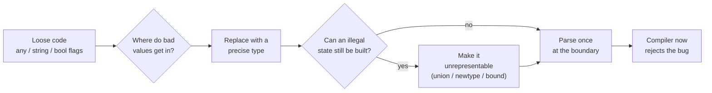
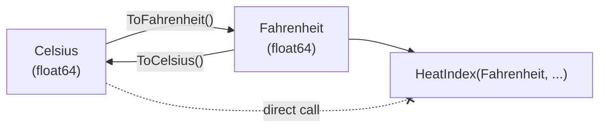

# Generics & Types — Practice Tasks

> 12 exercises that turn weakly-typed code into code where the compiler does the reviewing. Each task gives you a scenario, the loose version, an instruction, and a full solution with the reasoning behind it. The thread running through all of them: **push errors from runtime to compile time, and make illegal states unrepresentable.** Difficulty climbs from "swap `any` for a generic" to "redesign a boundary so bad data can't get past the front door."

Languages rotate across TypeScript, Go, Java, and Python so the ideas don't get welded to one type system. The principles are portable; the syntax is incidental.

---

## Table of Contents

1. [Task 1 — Replace `any` with a generic (TypeScript)](#task-1--replace-any-with-a-generic-typescript) · _Easy_
2. [Task 2 — Replace `interface{}` with a constrained generic (Go)](#task-2--replace-interface-with-a-constrained-generic-go) · _Easy_
3. [Task 3 — Add a bound to an unbounded generic (Java)](#task-3--add-a-bound-to-an-unbounded-generic-java) · _Easy_
4. [Task 4 — Replace a stringly-typed API with typed params (TypeScript)](#task-4--replace-a-stringly-typed-api-with-typed-params-typescript) · _Medium_
5. [Task 5 — Introduce a branded type: `UserId` vs `string` (TypeScript)](#task-5--introduce-a-branded-type-userid-vs-string-typescript) · _Medium_
6. [Task 6 — Model illegal states out of existence (TypeScript)](#task-6--model-illegal-states-out-of-existence-typescript) · _Medium_
7. [Task 7 — Remove a lying `as` cast with a type guard (TypeScript)](#task-7--remove-a-lying-as-cast-with-a-type-guard-typescript) · _Medium_
8. [Task 8 — Add exhaustiveness checking with `never` (TypeScript)](#task-8--add-exhaustiveness-checking-with-never-typescript) · _Medium_
9. [Task 9 — Replace overloads with one well-typed generic (TypeScript)](#task-9--replace-overloads-with-one-well-typed-generic-typescript) · _Hard_
10. [Task 10 — Parse, don't validate, at a boundary (TypeScript)](#task-10--parse-dont-validate-at-a-boundary-typescript) · _Hard_
11. [Task 11 — A newtype with operations in a nominal-by-default language (Go)](#task-11--a-newtype-with-operations-in-a-nominal-by-default-language-go) · _Hard_
12. [Task 12 — Type-audit: find every escape hatch and close it (Python)](#task-12--type-audit-find-every-escape-hatch-and-close-it-python) · _Hard_

---

## How to Use

- Read the scenario and the loose code first. Before opening the solution, write down the answer to one question: **what bug does the current code allow that a better type would forbid?**
- Try the instruction yourself in a real editor with the type checker on (`tsc --strict`, `go vet`, `javac`, `mypy --strict`). The whole point is the squiggly red line; you only feel the payoff when the checker rejects the bad call.
- Then open the solution and compare. The reasoning matters more than matching the exact code — there's usually more than one defensible design.
- The closing comment in each solution shows a call that **used to compile and now doesn't.** That line is the deliverable. If your version doesn't reject it, the type isn't doing its job.



---

## Task 1 — Replace `any` with a generic (TypeScript)

**Difficulty:** Easy

**Scenario:** A small utility returns the first element of an array. Someone reached for `any` to "make it work with everything." It does — including in ways that erase every type downstream.

```typescript
function first(arr: any): any {
  return arr[0];
}

const names = ["Ada", "Linus", "Grace"];
const n = first(names);   // n: any — TypeScript has given up on it
n.toFixed(2);             // compiles. Crashes at runtime: strings have no toFixed.
```

**Instruction:** Rewrite `first` so the return type tracks the element type of the array passed in. No `any`. Handle the empty-array case honestly in the type.

<details>
<summary>Solution</summary>

```typescript
function first<T>(arr: readonly T[]): T | undefined {
  return arr[0];
}

const names = ["Ada", "Linus", "Grace"];
const n = first(names);   // n: string | undefined

// n.toFixed(2);          // Compile error: 'toFixed' does not exist on 'string'.
n?.toUpperCase();         // OK once you account for undefined.
```

**Reasoning.** `any` is not "a type that holds anything" — it's an instruction to the compiler to **stop checking.** Every value derived from an `any` is also `any`, so the looseness spreads. A type parameter `<T>` keeps the relationship: the element type flows from the argument straight through to the return value, so `string[]` in means `string` out.

Two refinements that separate junior from senior here:

- `readonly T[]` because `first` doesn't mutate the array — accepting `readonly` widens what callers can pass and documents the non-mutation in the signature.
- `T | undefined`, not `T`. `arr[0]` on an empty array is `undefined` at runtime. Pretending the return is always `T` is the same lie `any` told, just narrower. Make the caller acknowledge it.

</details>

---

## Task 2 — Replace `interface{}` with a constrained generic (Go)

**Difficulty:** Easy

**Scenario:** Pre-generics Go code summed numbers through `interface{}` and a type switch. It compiles, but every caller can pass nonsense and only finds out by panicking.

```go
func Sum(values []interface{}) float64 {
    var total float64
    for _, v := range values {
        switch n := v.(type) {
        case int:
            total += float64(n)
        case float64:
            total += n
        default:
            panic("not a number")   // discovered at runtime, with real data
        }
    }
    return total
}

// Compiles fine, panics in production:
// Sum([]interface{}{1, 2, "three"})
```

**Instruction:** Replace `interface{}` with a type-parameter constrained to numeric types so non-numbers are rejected at compile time and the panic disappears.

<details>
<summary>Solution</summary>

```go
import "golang.org/x/exp/constraints"

func Sum[T constraints.Integer | constraints.Float](values []T) T {
    var total T
    for _, v := range values {
        total += v
    }
    return total
}

// Sum([]int{1, 2, 3})         => 6
// Sum([]float64{1.5, 2.5})    => 4.0
// Sum([]string{"a", "b"})     // Compile error: string does not satisfy the constraint.
```

If you don't want the `x/exp/constraints` dependency, declare the constraint inline:

```go
type Number interface {
    ~int | ~int64 | ~float32 | ~float64
}

func Sum[T Number](values []T) T { /* same body */ }
```

**Reasoning.** `interface{}` (now spelled `any`) accepts every value, so the *only* place to reject a string is at runtime, with a `panic`. A constraint moves that rejection to compile time: the type set `Integer | Float` is the closed list of types `Sum` is willing to add, and the compiler enforces it at every call site.

Two bonus wins fall out for free: the type switch and `float64(n)` conversion both vanish (the body is now `total += v`), and the return type is `T` instead of `float64`, so summing `int`s gives you an `int` back with no precision laundering. The `~int` (tilde) in the inline constraint means "int **and** any named type whose underlying type is int," so a `type Celsius int` still qualifies.

</details>

---

## Task 3 — Add a bound to an unbounded generic (Java)

**Difficulty:** Easy

**Scenario:** A `max` helper is generic over `T`, but the body needs to compare two `T`s. With no bound, the only thing the compiler knows about `T` is that it's an `Object`, so the author cast their way out — reintroducing exactly the runtime risk generics were meant to remove.

```java
static <T> T max(T a, T b) {
    Comparable<T> ca = (Comparable<T>) a;   // unchecked cast; warning suppressed and ignored
    return ca.compareTo(b) >= 0 ? a : b;
}

// max("apple", "banana")          => works
// max(new Object(), new Object()) // compiles, then ClassCastException at runtime
```

**Instruction:** Constrain `T` so that only comparable types can be passed, and delete the cast.

<details>
<summary>Solution</summary>

```java
static <T extends Comparable<? super T>> T max(T a, T b) {
    return a.compareTo(b) >= 0 ? a : b;
}

// max("apple", "banana")           => "banana"
// max(LocalDate.now(), tomorrow)   => tomorrow
// max(new Object(), new Object()); // Compile error: Object is not Comparable.
```

**Reasoning.** Without a bound, `T` is treated as `Object`, which has no `compareTo`. The cast `(Comparable<T>) a` was a promise to the compiler — "trust me, this is comparable" — backed by nothing, so a non-comparable argument blows up at runtime. The bound `T extends Comparable<? super T>` makes that promise into a **checked precondition:** the compiler refuses any `T` that isn't comparable, and inside the method `a.compareTo(b)` is statically known to exist. No cast, no `@SuppressWarnings`, no `ClassCastException`.

Why `Comparable<? super T>` rather than the simpler `Comparable<T>`? Because a subtype should be allowed to reuse an ancestor's comparison logic. If `class Manager extends Employee implements Comparable<Employee>`, then `Manager` is comparable *as an Employee*. The lower-bounded wildcard `? super T` accepts that; plain `Comparable<T>` would reject it. This is the "Producer Extends, Consumer Super" (PECS) rule: a `Comparable` consumes `T`, so it gets `super`.

</details>

---

## Task 4 — Replace a stringly-typed API with typed params (TypeScript)

**Difficulty:** Medium

**Scenario:** An HTTP client takes the method and a couple of options as free-form strings and booleans. Every value is a `string`, so the compiler can't tell a method from a typo, and the boolean pair encodes a state that should never both be true.

```typescript
function request(
  method: string,        // "GET"? "get"? "FETCH"? all accepted
  url: string,
  cache: string,         // "no-store" | "reload" | ...? who knows
  retryOnFail: boolean,
  throwOnFail: boolean,  // both true is contradictory, both false is silent
): Promise<Response> {
  // ...
  return fetch(url, { method });
}

// All of these compile; some are bugs:
// request("GTE", "/users", "no-stroe", true, true);
```

**Instruction:** Replace the stringly-typed and boolean-flag parameters with a typed surface: a union of literal methods, a union for cache mode, and a single field that captures the on-failure behavior as a closed set instead of two contradictory booleans.

<details>
<summary>Solution</summary>

```typescript
type HttpMethod = "GET" | "POST" | "PUT" | "PATCH" | "DELETE";
type CacheMode = "default" | "no-store" | "reload" | "force-cache";

// One axis replaces two booleans whose 4 combinations were only 3 valid:
type OnFailure = "retry" | "throw" | "return-error";

interface RequestOptions {
  method: HttpMethod;
  url: string;
  cache?: CacheMode;        // optional, with a sane default
  onFailure?: OnFailure;
}

function request(opts: RequestOptions): Promise<Response> {
  const { method, url, cache = "default", onFailure = "throw" } = opts;
  // ... onFailure drives a switch, not two ifs
  return fetch(url, { method, cache });
}

// request({ method: "GTE", url: "/users" });
//   Compile error: '"GTE"' is not assignable to HttpMethod.
// request({ method: "GET", url: "/users", cache: "no-stroe" });
//   Compile error: '"no-stroe"' is not assignable to CacheMode.
request({ method: "GET", url: "/users", onFailure: "retry" });   // OK
```

**Reasoning.** Three separate problems hide under "stringly typed":

1. **Free-form `string` for a closed set.** `method: string` accepts `"GTE"` and `"fetch"` and `""`. A literal union `"GET" | "POST" | ...` is the actual domain; typos become compile errors and editors autocomplete the valid values.
2. **Boolean flags encoding a multi-valued state.** `retryOnFail` + `throwOnFail` is four combinations, but `{retry: true, throw: true}` is contradictory and `{false, false}` silently swallows errors. Only three behaviors are real, so the type should *be* a three-member union. This is "make illegal states unrepresentable" applied to a flag pair.
3. **Positional booleans.** `request(..., true, true)` is unreadable and easy to transpose. Named fields in an options object remove the ordering hazard entirely.

The default values (`cache = "default"`, `onFailure = "throw"`) live in the destructuring, so the common call stays short while the type stays precise.

</details>

---

## Task 5 — Introduce a branded type: `UserId` vs `string` (TypeScript)

**Difficulty:** Medium

**Scenario:** IDs are passed around as plain `string`s. Because `OrderId` and `UserId` are both `string`, nothing stops you from passing one where the other is expected — and at runtime they look identical, so the bug is invisible until the wrong record is loaded.

```typescript
function getUser(userId: string): User { /* ... */ }
function getOrder(orderId: string): Order { /* ... */ }

const userId = "u_123";
const orderId = "o_456";

getUser(orderId);   // compiles. Loads nothing or the wrong thing. No warning.
```

**Instruction:** Introduce branded (nominal) types `UserId` and `OrderId` so the two cannot be swapped, while staying assignable to nothing by accident. Provide a single construction point for each.

<details>
<summary>Solution</summary>

```typescript
// A brand is a phantom field that exists only at the type level.
declare const brand: unique symbol;
type Brand<T, B> = T & { readonly [brand]: B };

type UserId = Brand<string, "UserId">;
type OrderId = Brand<string, "OrderId">;

// The ONLY way to mint one — a parse step that can also validate.
function toUserId(raw: string): UserId {
  if (!raw.startsWith("u_")) throw new Error(`Not a user id: ${raw}`);
  return raw as UserId;          // the single sanctioned cast, behind a check
}
function toOrderId(raw: string): OrderId {
  if (!raw.startsWith("o_")) throw new Error(`Not an order id: ${raw}`);
  return raw as OrderId;
}

function getUser(userId: UserId): User { /* ... */ }
function getOrder(orderId: OrderId): Order { /* ... */ }

const userId = toUserId("u_123");
const orderId = toOrderId("o_456");

getUser(userId);    // OK
// getUser(orderId);    Compile error: OrderId not assignable to UserId.
// getUser("u_123");    Compile error: string not assignable to UserId.
```

**Reasoning.** TypeScript is **structurally** typed: two types are interchangeable if their shapes match, and `UserId = string` has the same shape as `OrderId = string`. Branding adds a phantom property (`{ readonly [brand]: "UserId" }`) that has no runtime cost — it's never actually set — but makes the two shapes structurally distinct, so the compiler treats them as different types.

The crucial discipline is that the `as` cast appears in exactly one place per brand: inside the `toUserId` / `toOrderId` constructors, right after a check that the string is actually well-formed. Everywhere else, a bare `string` won't satisfy the parameter, so callers are forced through the validating front door. This is the type-system half of "parse, don't validate" (Task 10): once a value is a `UserId`, every function downstream can trust it without re-checking.

</details>

---

## Task 6 — Model illegal states out of existence (TypeScript)

**Difficulty:** Medium

**Scenario:** A remote-data container uses optional fields for every part of its lifecycle. The shape technically allows `loading: true` *and* a populated `error` *and* `data` all at once — a state that should be impossible, but the type permits it, so the rendering code is littered with defensive checks.

```typescript
interface RemoteData<T> {
  loading: boolean;
  data?: T;
  error?: Error;
}

// All of these typecheck, but most are nonsense:
const a: RemoteData<User> = { loading: true, data: someUser, error: new Error() };
const b: RemoteData<User> = { loading: false };  // done? failed? empty? unknowable
```

**Instruction:** Redesign `RemoteData<T>` as a discriminated union so that each lifecycle state carries exactly the fields it can have, and no other. The `loading: true` state must not be allowed to also carry data or an error.

<details>
<summary>Solution</summary>

```typescript
type RemoteData<T> =
  | { status: "idle" }
  | { status: "loading" }
  | { status: "success"; data: T }
  | { status: "failure"; error: Error };

function render(rd: RemoteData<User>): string {
  switch (rd.status) {
    case "idle":    return "Click to load";
    case "loading": return "Spinner…";
    case "success": return rd.data.name;     // rd.data exists ONLY here
    case "failure": return rd.error.message;  // rd.error exists ONLY here
  }
}

// const bad: RemoteData<User> = { status: "loading", data: someUser };
//   Compile error: 'data' does not exist on the 'loading' variant.
```

**Reasoning.** The original interface has `2 × 2 × 2 = 8` representable combinations of `(loading, data?, error?)`, but only **4** of them are meaningful. Every illegal combination is a latent bug the rendering code must guard against, and every guard is a place to get it wrong (the classic "blank screen because `loading` is false but `data` is also undefined").

A discriminated union flips this: the `status` tag is the single source of truth, and each variant lists *only* the fields valid in that state. The set of representable values now equals the set of legal values — `4 = 4`. The compiler enforces that you cannot read `rd.data` until you've narrowed to the `"success"` branch, which both prevents the bug and eliminates the optional-chaining noise. This is the most load-bearing idea in the whole chapter: when in doubt, count the representable states and the legal states; if they differ, the type is too loose.

</details>

---

## Task 7 — Remove a lying `as` cast with a type guard (TypeScript)

**Difficulty:** Medium

**Scenario:** Data comes back from `JSON.parse` (type `any`) and is immediately asserted into a `User` with `as`. The assertion is a promise the compiler can't verify; when the payload is malformed, the lie surfaces three function calls away from the cast.

```typescript
function loadUser(json: string): User {
  const parsed = JSON.parse(json);   // any
  return parsed as User;             // "trust me" — verified by nothing
}

// loadUser('{"naem": "Ada"}')  // typo'd key; returns a "User" with undefined name.
// Later: user.name.toUpperCase()  ->  TypeError, far from the real cause.
```

**Instruction:** Replace the `as User` assertion with a real runtime type guard (a `value is User` predicate) so that a malformed payload is rejected *at the parse site* with a clear error, and the returned value is genuinely a `User`.

<details>
<summary>Solution</summary>

```typescript
interface User {
  id: string;
  name: string;
  age: number;
}

function isUser(value: unknown): value is User {
  return (
    typeof value === "object" &&
    value !== null &&
    typeof (value as Record<string, unknown>).id === "string" &&
    typeof (value as Record<string, unknown>).name === "string" &&
    typeof (value as Record<string, unknown>).age === "number"
  );
}

function loadUser(json: string): User {
  const parsed: unknown = JSON.parse(json);   // unknown, not any
  if (!isUser(parsed)) {
    throw new Error("Malformed user payload");  // fails HERE, with context
  }
  return parsed;   // narrowed to User by the guard — no cast needed
}
```

**Reasoning.** `as User` is an **assertion**, not a check: it changes what the compiler *believes* about a value without inspecting the value at all. A typo'd or missing field sails right through, and the resulting `TypeError` fires wherever the bad field is finally read — often far from `loadUser`, making it miserable to debug.

Two moves fix this. First, type `parsed` as `unknown` rather than letting it be `any`; `unknown` forces you to prove the type before using it (`any` would let the lie continue). Second, the user-defined type guard `isUser(value): value is User` does the *actual* runtime inspection and tells the compiler the result, so inside the `if` the value is genuinely narrowed to `User` with no cast. The single `as Record<string, unknown>` inside the guard is the one honest, scoped cast — it only says "treat this as an object with unknown-typed keys" so we can index it, and every key is then checked.

For real projects, hand-writing guards for every shape is tedious and drifts from the type; a schema library (Zod, io-ts, Valibot) generates the guard *and* the type from one declaration. The principle is identical: **validate at the boundary, return a trusted type.**

</details>

---

## Task 8 — Add exhaustiveness checking with `never` (TypeScript)

**Difficulty:** Medium

**Scenario:** A `switch` over a union of shapes computes area. It's correct today. Next sprint someone adds a `Triangle` variant to the `Shape` union — and this function silently falls through to a wrong default, returning `0` for every triangle. Nothing flags it.

```typescript
type Shape =
  | { kind: "circle"; radius: number }
  | { kind: "square"; side: number };

function area(shape: Shape): number {
  switch (shape.kind) {
    case "circle": return Math.PI * shape.radius ** 2;
    case "square": return shape.side ** 2;
    default: return 0;   // swallows any future variant silently
  }
}
```

**Instruction:** Add a compile-time exhaustiveness check so that adding a new variant to `Shape` *without* handling it here becomes a build error rather than a silent `0`.

<details>
<summary>Solution</summary>

```typescript
type Shape =
  | { kind: "circle"; radius: number }
  | { kind: "square"; side: number }
  | { kind: "triangle"; base: number; height: number };   // newly added

function assertNever(x: never): never {
  throw new Error(`Unhandled variant: ${JSON.stringify(x)}`);
}

function area(shape: Shape): number {
  switch (shape.kind) {
    case "circle":   return Math.PI * shape.radius ** 2;
    case "square":   return shape.side ** 2;
    // case "triangle": return 0.5 * shape.base * shape.height;
    default:
      return assertNever(shape);
    //                   ~~~~~ Compile error while 'triangle' is unhandled:
    //   Argument of type '{ kind: "triangle"; ... }' is not assignable
    //   to parameter of type 'never'.
  }
}
```

**Reasoning.** `never` is the type with **no values** — the empty set. Inside the `default` branch, the compiler narrows `shape` to "whatever union members haven't been handled yet." If every member is covered, that residual type is `never`, and passing it to `assertNever(x: never)` typechecks. The moment a new variant goes unhandled, the residual type is that variant — *not* `never` — so the call to `assertNever` fails to compile.

This converts an *invisible* future bug (silent `0` for triangles) into a *loud* one the build catches before merge. The `assertNever` helper doubles as a runtime guard for data that violates the types (e.g. a value deserialized from an untrusted source with an unexpected `kind`), throwing with a useful message instead of returning garbage. The pattern generalizes to any closed union: reducers, AST visitors, state machines, protocol handlers — anywhere "handle every case" must stay true as the union grows.

</details>

---

## Task 9 — Replace overloads with one well-typed generic (TypeScript)

**Difficulty:** Hard

**Scenario:** A `getSetting` function was written with three overload signatures so callers get the right return type per key. The overloads have drifted out of sync with the implementation, and adding a new setting means editing four places (three signatures + the impl) — a maintenance trap.

```typescript
function getSetting(key: "theme"): "light" | "dark";
function getSetting(key: "fontSize"): number;
function getSetting(key: "notifications"): boolean;
function getSetting(key: string): unknown {   // impl signature, loosely typed
  return store[key];
}

// Add a "language" setting → must touch all four lines, or callers get 'unknown'.
```

**Instruction:** Collapse the overloads into a single generic signature driven by a settings map type, so the return type is derived from the key automatically and a new setting requires editing only one place.

<details>
<summary>Solution</summary>

```typescript
interface Settings {
  theme: "light" | "dark";
  fontSize: number;
  notifications: boolean;
  language: string;        // adding a setting = one line, here.
}

const store: Settings = {
  theme: "dark",
  fontSize: 14,
  notifications: true,
  language: "en",
};

function getSetting<K extends keyof Settings>(key: K): Settings[K] {
  return store[key];
}

const t = getSetting("theme");          // t: "light" | "dark"
const f = getSetting("fontSize");       // f: number
const l = getSetting("language");       // l: string  — no extra overload needed
// getSetting("nope");                  // Compile error: not a key of Settings.
```

**Reasoning.** The overload set was hand-maintaining a key-to-type mapping that the language can express directly. The `Settings` interface *is* that mapping; `K extends keyof Settings` constrains the key to a real setting name, and the indexed access type `Settings[K]` looks up the corresponding value type. One generic signature now covers every key, present and future.

The payoff is a single source of truth: adding `language: string` to the interface immediately gives `getSetting("language")` the correct return type with no further edits, and a typo like `getSetting("langauge")` is rejected because it isn't a `keyof Settings`. Overloads still have their place — when the parameter *count* or fundamentally different argument *shapes* change per call (think `Array.prototype.flat`'s depth-dependent return). But when the only thing varying is "return type depends on a key," a generic keyed on `keyof` is strictly better: less code, no drift, and the implementation signature is no longer a loosely-typed liability.

</details>

---

## Task 10 — Parse, don't validate, at a boundary (TypeScript)

**Difficulty:** Hard

**Scenario:** A signup handler validates its input with a boolean-returning check, then proceeds to use the raw, still-untyped object. The validation result is thrown away — the type system never learns that the data is now safe, so every downstream function re-checks or, worse, trusts blindly.

```typescript
function isValidSignup(body: any): boolean {
  return typeof body.email === "string" && body.email.includes("@")
      && typeof body.age === "number" && body.age >= 18;
}

function handleSignup(body: any) {
  if (!isValidSignup(body)) {
    throw new Error("invalid");
  }
  // body is STILL 'any' here — validation proved nothing to the compiler.
  createAccount(body.emial, body.age);   // typo 'emial' compiles. Bug ships.
}
```

**Instruction:** Refactor to "parse, don't validate": a function that takes `unknown` and returns a **typed** `Signup` (or throws), so that past the parse line the data is statically known-good and the typo is caught.

<details>
<summary>Solution</summary>

```typescript
interface Signup {
  email: string;
  age: number;
}

// Parse: unknown in, a typed value out (or an exception).
function parseSignup(body: unknown): Signup {
  if (typeof body !== "object" || body === null) {
    throw new Error("Body must be an object");
  }
  const b = body as Record<string, unknown>;

  if (typeof b.email !== "string" || !b.email.includes("@")) {
    throw new Error("email must be a valid address");
  }
  if (typeof b.age !== "number" || b.age < 18) {
    throw new Error("age must be a number >= 18");
  }

  return { email: b.email, age: b.age };   // construct the trusted value
}

function handleSignup(body: unknown) {
  const signup = parseSignup(body);   // signup: Signup — known-good from here on
  createAccount(signup.email, signup.age);
  // createAccount(signup.emial, ...) // Compile error: no 'emial' on Signup.
}
```

**Reasoning.** *Validation* answers a yes/no question and discards the evidence; the data after an `isValid` check is exactly as untyped as before, so the knowledge "this is safe" lives only in the programmer's head and the compiler can't help. That's why `body.emial` still compiles — `body` is `any`.

*Parsing* keeps the evidence by **changing the type:** `parseSignup` consumes `unknown` and produces a `Signup`, so the act of getting past it is the proof. Downstream code receives a `Signup`, not an `any`, and the compiler now flags the typo, missing field, or wrong type. You also get one canonical, narrowed value to pass around instead of re-validating in five places, and the error messages live at the boundary where you have the most context to write a good one.

This is the same principle as the branded type in Task 5 (construction through a checked front door) and the type guard in Task 7 (proof recorded in the type), scaled up to a whole boundary object. In practice, reach for a schema library so the `Signup` type and the parser are generated from one declaration and can't drift:

```typescript
import { z } from "zod";
const SignupSchema = z.object({
  email: z.string().email(),
  age: z.number().int().min(18),
});
type Signup = z.infer<typeof SignupSchema>;        // type derived from schema
const signup = SignupSchema.parse(body);            // throws on bad input
```

</details>

---

## Task 11 — A newtype with operations in a nominal-by-default language (Go)

**Difficulty:** Hard

**Scenario:** Temperatures and durations both flow through the code as `float64` and `int`. Nothing stops you adding a Celsius value to a Fahrenheit value, or passing a count of seconds where milliseconds were expected. The units exist only in variable names and comments — invisible to the compiler.

```go
func HeatIndex(tempF float64, humidity float64) float64 { /* ... */ }

func Sleep(ms int) { time.Sleep(time.Duration(ms) * time.Millisecond) }

// All compile; the second is a 1000x bug:
// HeatIndex(celsiusReading, humidity)   // wrong unit, looks fine
// Sleep(seconds)                         // sleeps 1000x too long
```

**Instruction:** Introduce distinct newtypes for the units (`Celsius`, `Fahrenheit`, and use the standard library's `time.Duration` for time), with conversion methods, so that mixing units is a compile error and the only way between units is an explicit, named conversion.

<details>
<summary>Solution</summary>

```go
type Celsius float64
type Fahrenheit float64

func (c Celsius) ToFahrenheit() Fahrenheit {
    return Fahrenheit(c*9/5 + 32)
}
func (f Fahrenheit) ToCelsius() Celsius {
    return Celsius((f - 32) * 5 / 9)
}

func HeatIndex(temp Fahrenheit, humidity float64) float64 { /* ... */ }

// HeatIndex(Celsius(20), 0.5)        // Compile error: Celsius is not Fahrenheit.
HeatIndex(Celsius(20).ToFahrenheit(), 0.5)   // explicit, correct, readable.

// For time, the standard library already provides the newtype:
func Sleep(d time.Duration) { time.Sleep(d) }

// Sleep(5)                  // Compile error: int is not time.Duration.
Sleep(5 * time.Second)       // unambiguous — and 5*time.Millisecond is just as clear.
```

**Reasoning.** Go is **nominally** typed for named types: `type Celsius float64` and `type Fahrenheit float64` share an underlying representation but are distinct types, so the compiler refuses to mix them even though both are "really" floats. The unit, which used to live only in a variable name (`tempF`), is now part of the type — a transposition bug becomes a build error.

The conversions are explicit methods (`ToFahrenheit`, `ToCelsius`), which means crossing a unit boundary is always visible in the source and always uses the right formula in one audited place — no scattered `* 9/5 + 32` to get wrong. For time specifically, you rarely need a custom type: `time.Duration` is the standard library's newtype over `int64` nanoseconds, and writing `5 * time.Second` makes the unit unmistakable at the call site, which is exactly why `time.Sleep` takes a `Duration` and not an `int`. The lesson generalizes: any `int`/`float64`/`string` carrying a unit, currency, or identity (Task 5) is a newtype waiting to happen.



</details>

---

## Task 12 — Type-audit: find every escape hatch and close it (Python)

**Difficulty:** Hard

**Scenario:** Below is a plausible service module that "has type hints," yet almost every hint is an escape hatch. List **every** way the types fail to constrain the code, then sketch the fix for each. This is the capstone — it touches every idea in the chapter.

```python
from typing import Any

class EventProcessor:
    def __init__(self, handlers: dict):           # dict of what to what?
        self.handlers = handlers

    def process(self, event: Any) -> Any:          # Any in, Any out
        kind = event["type"]                        # event could be anything
        handler = self.handlers.get(kind)
        if handler:
            return handler(event)
        return None

    def make_user(self, data: dict) -> "User":
        return data                                 # type: ignore  # lies: returns a dict

    def status_code(self, status: str) -> int:     # status is a closed set, typed open
        return {"ok": 200, "fail": 500}[status]     # KeyError on any typo at runtime
```

**Instruction:** Produce an audit table naming each type weakness, the bug it permits, and the fix. Then show the corrected `status_code` and `process` signatures.

<details>
<summary>Solution</summary>

| # | Weakness | Where | Bug it permits | Fix |
|---|----------|-------|----------------|-----|
| 1 | Bare `dict` (no params) | `__init__(handlers: dict)` | Any keys, any values; `handlers42)` typechecks | `dict[EventKind, Callable[[Event], Result]]` — key and value types stated |
| 2 | `Any` in / `Any` out | `process(event: Any) -> Any` | All type info erased through the call; callers get `Any`, the plague spreads | Type `event` as a `TypedDict`/dataclass union; return a concrete `Result` |
| 3 | `event["type"]` on untyped dict | `process` | `KeyError` if absent; value is `Any`, used as a dict key blindly | A `TypedDict` with a `Literal` `type` field, or a discriminated dataclass union |
| 4 | `return data` typed as `User` | `make_user` | Returns a `dict` while claiming `User`; `# type: ignore` silences the truth | Construct and return an actual `User`; never `type: ignore` a real mismatch |
| 5 | `status: str` for a closed set | `status_code` | `status_code("OK")` (wrong case) or `"okay"` → runtime `KeyError` | `Literal["ok", "fail"]` so typos are compile-time (mypy) errors |
| 6 | Dict-indexing as control flow | `status_code` | `KeyError` instead of a typed, total mapping | `Literal` argument makes the dict total over its domain; mypy verifies coverage |

**Corrected `status_code` — closed input set via `Literal`:**

```python
from typing import Literal

Status = Literal["ok", "fail"]

def status_code(self, status: Status) -> int:
    table: dict[Status, int] = {"ok": 200, "fail": 500}
    return table[status]

# self.status_code("ok")     # OK -> 200
# self.status_code("OK")     # mypy error: "OK" not assignable to Literal["ok","fail"]
```

**Corrected `process` — discriminated union instead of `Any`:**

```python
from dataclasses import dataclass
from typing import assert_never

@dataclass(frozen=True)
class UserCreated:
    user_id: str

@dataclass(frozen=True)
class UserDeleted:
    user_id: str

Event = UserCreated | UserDeleted          # closed, discriminated by class
Result = str                                # whatever your domain result is

def process(self, event: Event) -> Result:
    match event:
        case UserCreated(user_id):
            return f"created {user_id}"
        case UserDeleted(user_id):
            return f"deleted {user_id}"
        case _:
            assert_never(event)             # exhaustiveness: mypy flags a new unhandled variant
```

**Reasoning.** "Has type hints" is not "is type-safe." `Any` is Python's `any` (Task 1): it disables checking and the looseness propagates through every return. A bare `dict` is barely better than `Any` for its contents. `# type: ignore` on a genuine mismatch (`return data` as a `User`) is the Python cousin of a lying `as` cast (Task 7) — it doesn't fix the mismatch, it hides it until runtime.

The fixes recapitulate the chapter: replace `Any`/bare containers with parameterized types and unions (Tasks 1–2), turn closed string sets into `Literal`s (Task 4), model events as a discriminated dataclass union so illegal events can't be built (Task 6), get exhaustiveness from `assert_never` (Task 8), and construct real domain objects instead of asserting that a dict *is* one (Tasks 7, 10). Run `mypy --strict` and treat every `Any`, every bare `dict`/`list`, and every `# type: ignore` as a finding to justify or remove. The goal is the same as everywhere in this chapter: **make the compiler do the reviewing.**

</details>

---

## Self-Assessment

Rate yourself on each. If any is a "no," revisit the linked task.

- [ ] I can explain why `any`/`interface{}`/`Any` is contagious, not merely permissive. (Tasks 1, 2, 12)
- [ ] Given a generic that casts inside its body, I can add the bound that deletes the cast. (Task 3)
- [ ] I reach for a literal union or enum instead of a `string` whenever the values are a closed set. (Tasks 4, 12)
- [ ] I can introduce a branded/newtype to stop two same-shaped types from being swapped. (Tasks 5, 11)
- [ ] Given an interface with optional fields, I can count representable vs. legal states and collapse it into a discriminated union. (Task 6)
- [ ] I never use `as`/`# type: ignore` to assert a type I haven't actually checked at runtime. (Tasks 7, 12)
- [ ] I add `never`/`assert_never` exhaustiveness checks to every `switch`/`match` over a union. (Tasks 8, 12)
- [ ] I can tell when overloads are the right tool versus when a `keyof`-driven generic is strictly better. (Task 9)
- [ ] At every boundary I **parse into a typed value** rather than validating and discarding the proof. (Tasks 10, 12)
- [ ] My mental test for a type is: "what bug does this forbid?" — and if the answer is "none," I tighten it.

**Scoring:** 9–10 yes → you design types as specifications. 6–8 → solid; drill the boundary tasks (7, 10, 12). ≤5 → re-read the [chapter README](../README.md) and redo Tasks 1, 6, and 10 in that order.

---

## Related Topics

- [Generics & Types — chapter README](../README.md) — the positive rules these tasks invert.
- [junior.md](junior.md) — definitions and first examples of each anti-pattern.
- [find-bug.md](find-bug.md) — buggy snippets where a missing or lying type hides the defect.
- [optimize.md](optimize.md) — tightening loose-but-working types in existing code.
- [Functional Programming](../../functional-programming/README.md) — discriminated unions, exhaustive matching, and "make illegal states unrepresentable" are core FP ideas; sum types and parse-don't-validate live here too.
- [Refactoring](../../refactoring/README.md) — Primitive Obsession and stringly-typed APIs are also code smells; the type-driven fixes here pair with the structural refactorings there.
