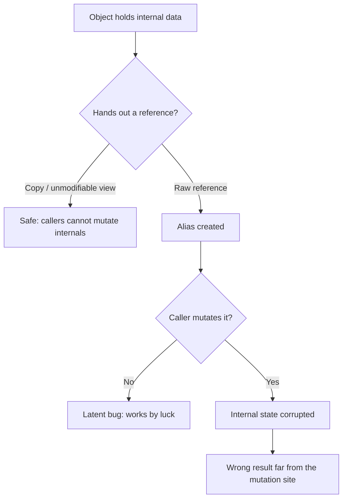

# Immutability — Find the Bug

> 12 buggy snippets where a mutability, aliasing, or shared-state mistake causes a real, shippable bug. Each one looks correct on a casual read. Find the leak first — *who else holds a reference to this object, and when does it change underneath them?* — then read the fix.

---

## Table of Contents

1. [Snippet 1 — Getter returns the internal slice (Go)](#snippet-1--getter-returns-the-internal-slice-go)
2. [Snippet 2 — Mutable default argument (Python)](#snippet-2--mutable-default-argument-python)
3. [Snippet 3 — Frozen record, mutable list (Java)](#snippet-3--frozen-record-mutable-list-java)
4. [Snippet 4 — Mutated map key (Python)](#snippet-4--mutated-map-key-python)
5. [Snippet 5 — Constructor aliasing (Java)](#snippet-5--constructor-aliasing-java)
6. [Snippet 6 — Shared backing array via slice (Go)](#snippet-6--shared-backing-array-via-slice-go)
7. [Snippet 7 — Stored time mutated after the fact (Python)](#snippet-7--stored-time-mutated-after-the-fact-python)
8. [Snippet 8 — Shallow copy where deep was needed (Java)](#snippet-8--shallow-copy-where-deep-was-needed-java)
9. [Snippet 9 — "Immutable" wrapper around a mutable map (Java)](#snippet-9--immutable-wrapper-around-a-mutable-map-java)
10. [Snippet 10 — Concurrent readers of a mutated singleton (Go)](#snippet-10--concurrent-readers-of-a-mutated-singleton-go)
11. [Snippet 11 — Mutating a caller's argument (Python)](#snippet-11--mutating-a-callers-argument-python)
12. [Snippet 12 — Set membership lost after element mutation (Java)](#snippet-12--set-membership-lost-after-element-mutation-java)
13. [Scorecard](#scorecard)
14. [Related Topics](#related-topics)

---

## How to Use

For each snippet:

1. Read the code and ask the immutability questions: *Who else holds a reference to this data? Can it change after I hand it out? Is this "constant" actually shared?*
2. Write down the exact line where the aliasing or mutation happens and the observable symptom (corrupted state, wrong result, lost map entry, data race).
3. Open the answer. Confirm you found the **leak** (the shared reference) and not just the **mutation** (the write). The fix almost always means *copying at the boundary* or *making the type genuinely immutable*.

Difficulty is marked per snippet. The mutation that triggers the bug is rarely on the same line as the mistake that allowed it — that distance is the whole point.



---

### Snippet 1 — Getter returns the internal slice (Go)

**Difficulty:** Easy

```go
package order

type Order struct {
    id    string
    items []string
}

func NewOrder(id string) *Order {
    return &Order{id: id, items: []string{}}
}

func (o *Order) AddItem(item string) {
    o.items = append(o.items, item)
}

// Items returns the order's line items.
func (o *Order) Items() []string {
    return o.items
}

// Caller code:
func auditTopItems(o *Order) []string {
    items := o.Items()
    // Auditor only wants the first 3, sorted, for a report.
    sort.Strings(items)
    if len(items) > 3 {
        items = items[:3]
    }
    return items
}
```

**Where is the bug?**

<details><summary>Hint</summary>

`Items()` returns `o.items` directly. What does `sort.Strings(items)` sort?
</details>

<details><summary>Answer</summary>

`Items()` returns the **same slice header** that backs `o.items`. The caller receives an alias to the order's internal storage. `sort.Strings(items)` sorts in place — it reorders the order's *actual* line items. After `auditTopItems` runs, `o.items` is permanently sorted, even though the audit was supposed to be a read-only report.

The symptom shows up far away: some later code assumes items are in insertion order (e.g., "first item added is the primary item"), and now they're alphabetical. Nobody suspects the audit function, because audits "only read."

`items = items[:3]` is harmless to the caller's copy of the *header* but does not undo the in-place sort on the shared backing array.

**Fix:** return a copy. The getter must not leak internal storage.

```go
func (o *Order) Items() []string {
    out := make([]string, len(o.items))
    copy(out, o.items)
    return out
}
```

If copying on every read is too expensive, expose only the operations callers need (`ItemCount()`, `ItemAt(i)`) instead of the whole slice.
</details>

---

### Snippet 2 — Mutable default argument (Python)

**Difficulty:** Easy

```python
def append_event(event, log=[]):
    log.append(event)
    return log


def make_session_logger():
    """Each call should start a fresh, empty log."""
    return append_event


# Two unrelated requests:
req1 = append_event("login")
req2 = append_event("logout")

print(req1)  # expected: ['login']
print(req2)  # expected: ['logout']
```

**Where is the bug?**

<details><summary>Answer</summary>

The default value `log=[]` is evaluated **once**, when the function is defined — not on each call. Every call that omits `log` shares the *same* list object. So:

```text
req1 == ['login', 'logout']
req2 == ['login', 'logout']
```

Both variables point to one growing list. `req1` is not `['login']`; it has accumulated every event ever logged through the default. In a long-running server this list grows without bound (a memory leak) and leaks one user's events into another user's "fresh" log — a confidentiality bug, not just a correctness one.

**Why it hides:** the mutation (`log.append`) is correct in isolation. The mistake is the shared *default object*, which is invisible at the call site.

**Fix:** use `None` as the sentinel and create a new list inside the body, so each call gets its own.

```python
def append_event(event, log=None):
    if log is None:
        log = []
    log.append(event)
    return log
```

The same trap applies to `{}`, `set()`, and any mutable default (including a mutable dataclass field — use `field(default_factory=list)` there).
</details>

---

### Snippet 3 — Frozen record, mutable list (Java)

**Difficulty:** Medium

```java
import java.util.List;
import java.util.ArrayList;

// A "value object" meant to be immutable.
public record Invoice(String id, List<LineItem> lines) {

    public double total() {
        return lines.stream().mapToDouble(LineItem::amount).sum();
    }
}

// Usage:
List<LineItem> lines = new ArrayList<>();
lines.add(new LineItem("Widget", 10.0));
Invoice invoice = new Invoice("INV-001", lines);

double snapshot = invoice.total();   // 10.0
sendToBilling(invoice);              // bills $10.00

// ... elsewhere, the same `lines` list is reused as a scratch buffer:
lines.add(new LineItem("Surprise fee", 999.0));
```

**Where is the bug?**

<details><summary>Hint</summary>

`record` makes the *reference* final. Is the `List` it points to immutable?
</details>

<details><summary>Answer</summary>

A Java `record` gives you a `final` field — the `Invoice` can never point at a *different* `List`. But the `List` itself is fully mutable, and the record stored the **caller's** list by reference. This is **false immutability**: the object looks frozen but its contents are wide open.

After `sendToBilling` already billed $10.00, the caller mutates the original `lines` (reusing it as a scratch buffer). Now `invoice.total()` returns `1009.0`. Any code that recomputes the total — a later reconciliation job, an audit, a retry — sees a different number than what was billed. The "immutable" invoice changed after the fact.

**Why it hides:** `record` advertises immutability so loudly that nobody checks the collection field. The mutation happens in unrelated code that has no idea it shares a list with a billing record.

**Fix:** copy on the way in (defensive copy) and on the way out, and store an unmodifiable view.

```java
public record Invoice(String id, List<LineItem> lines) {
    public Invoice {                          // compact constructor
        lines = List.copyOf(lines);           // immutable snapshot, defensive copy
    }
    public List<LineItem> lines() {
        return lines;                          // already unmodifiable
    }
}
```

`List.copyOf` both snapshots the contents (so later caller mutation is invisible) and returns an unmodifiable list (so accessors cannot be used to mutate internals). Now the invoice is genuinely immutable.
</details>

---

### Snippet 4 — Mutated map key (Python)

**Difficulty:** Medium

```python
class Point:
    def __init__(self, x, y):
        self.x = x
        self.y = y

    def __hash__(self):
        return hash((self.x, self.y))

    def __eq__(self, other):
        return (self.x, self.y) == (other.x, other.y)


# Cache keyed by point:
heat = {}
p = Point(1, 1)
heat[p] = 42

print(heat[p])      # 42

# Reuse the same Point object to scan the next cell:
p.x = 2
p.y = 2
heat[p] = 7

print(heat.get(Point(1, 1)))   # expected to still find 42?
print(len(heat))
```

**Where is the bug?**

<details><summary>Answer</summary>

`Point` is mutable but is used as a dictionary key. A dict places a key in a bucket chosen by `hash(key)` *at insertion time*. When `p` was inserted with `(1, 1)`, it landed in the bucket for `hash((1, 1))`. Then the code mutates `p` to `(2, 2)` — but the entry is still physically sitting in the `(1, 1)` bucket, now holding a key that reports `hash == hash((2,2))`.

The dict is corrupted:

- `heat.get(Point(1, 1))` hashes to the `(1,1)` bucket, finds the stored key, but `key == Point(1,1)` is now `False` (the key mutated to `(2,2)`), so it returns `None` — the original entry is **lost**.
- `heat[p] = 7` hashes `(2,2)` to a *different* bucket and inserts a second entry, so `len(heat) == 2` even though "the same object" was used.

You now have an unreachable entry leaking memory and a key you can no longer look up.

**Why it hides:** the code "reuses the object to save allocations" — a common micro-optimization. The contract "keys must be immutable while in the dict" is implicit.

**Fix:** make the key immutable so mutation is impossible. A frozen dataclass (or a tuple) is the right tool.

```python
from dataclasses import dataclass

@dataclass(frozen=True)
class Point:
    x: int
    y: int

heat = {}
heat[Point(1, 1)] = 42
heat[Point(2, 2)] = 7   # must construct a NEW point — cannot mutate the old one
```

`frozen=True` forbids attribute assignment (`p.x = 2` raises `FrozenInstanceError`), turning the latent bug into an immediate, obvious error.
</details>

---

### Snippet 5 — Constructor aliasing (Java)

**Difficulty:** Medium

```java
import java.util.List;

public class Team {
    private final List<String> members;

    public Team(List<String> members) {
        this.members = members;   // stored by reference
    }

    public List<String> getMembers() {
        return members;
    }
}

// Usage:
List<String> roster = new ArrayList<>(List.of("Ada", "Linus"));

Team teamA = new Team(roster);
Team teamB = new Team(roster);   // same list passed to both

teamA.getMembers().add("Grace");

System.out.println(teamB.getMembers());  // who is on team B?
```

**Where is the bug?**

<details><summary>Hint</summary>

How many `List` objects exist? How many `Team` objects? Count the references to that one list.
</details>

<details><summary>Answer</summary>

There is exactly **one** `List` object. `roster`, `teamA.members`, and `teamB.members` are three references to it. Adding "Grace" through `teamA` mutates the single shared list, so `teamB.getMembers()` prints `[Ada, Linus, Grace]` — Grace silently joined a team she was never added to.

This is aliasing via the constructor. The `final` keyword again protects only the reference, not the referent. Both teams will forever stay in lockstep because they are, in memory, the same roster.

**Why it hides:** in tests you usually build a fresh list per object, so the aliasing never surfaces. It appears only when a caller (reasonably) reuses one list to seed two objects.

**Fix:** defensive copy in the constructor, and hand out an unmodifiable view from the getter.

```java
public Team(List<String> members) {
    this.members = new ArrayList<>(members);   // own copy, no aliasing
}

public List<String> getMembers() {
    return Collections.unmodifiableList(members);  // callers cannot mutate internals
}
```

Now `teamA` and `teamB` have independent rosters, and `getMembers().add(...)` throws instead of corrupting state.
</details>

---

### Snippet 6 — Shared backing array via slice (Go)

**Difficulty:** Hard

```go
package main

import "fmt"

// splitBatch returns the first n items as a "batch" and the rest as "remaining".
func splitBatch(items []int, n int) (batch, remaining []int) {
    batch = items[:n]
    remaining = items[n:]
    return
}

func main() {
    items := []int{1, 2, 3, 4, 5}
    batch, remaining := splitBatch(items, 2)

    // Tag every item in the batch as processed by negating it.
    batch = append(batch, -1) // append a sentinel to mark end-of-batch

    fmt.Println("batch:", batch)         // [1 2 -1]
    fmt.Println("remaining:", remaining) // expected [3 4 5]?
}
```

**Where is the bug?**

<details><summary>Hint</summary>

`batch := items[:2]` has length 2 but what capacity? Where does `append` write?
</details>

<details><summary>Answer</summary>

`batch = items[:2]` is a slice with `len == 2` but `cap == 5` — it shares the **same backing array** as `items` and `remaining`. When `append(batch, -1)` runs, the new length (3) is still within capacity, so Go writes the sentinel *in place* at index 2 of the backing array — which is `items[2]`, the first element of `remaining`.

Output:

```text
batch:     [1 2 -1]
remaining: [-1 4 5]   // index 0 got stomped, not [3 4 5]
```

`remaining[0]` was silently overwritten from `3` to `-1`. The two slices are not independent views; an `append` that fits in capacity mutates shared memory.

**Why it hides:** slicing *looks* like it produces separate sub-lists. The danger is invisible until an `append` (or an indexed write) reaches into the shared region. Reading both slices works fine; writing through one corrupts the other.

**Fix:** cap the first slice so any `append` is forced to allocate a fresh array — the "full slice expression" `a[low:high:max]`.

```go
batch = items[:n:n]   // len=n, cap=n  -> append must reallocate
remaining = items[n:]
```

Now `append(batch, -1)` allocates a new array and copies, leaving `remaining` untouched: `[3 4 5]`. If `batch` and `remaining` must be fully independent regardless of later writes, copy them outright with `copy`.
</details>

---

### Snippet 7 — Stored time mutated after the fact (Python)

**Difficulty:** Medium

```python
from datetime import datetime, timedelta


class AuditEntry:
    def __init__(self, action, occurred_at):
        self.action = action
        self.occurred_at = occurred_at


def record_actions(actions, clock):
    """clock is a mutable cursor advanced as we walk the actions."""
    entries = []
    for action in actions:
        entries.append(AuditEntry(action, clock))
        clock += timedelta(seconds=1)  # advance the cursor
    return entries


start = datetime(2026, 1, 1, 12, 0, 0)
entries = record_actions(["login", "view", "logout"], start)

for e in entries:
    print(e.action, e.occurred_at)
```

**Where is the bug?**

<details><summary>Answer</summary>

This one is a **trap that does *not* fire** in Python — and understanding why is the lesson. `datetime` and `timedelta` are immutable. `clock += timedelta(seconds=1)` does **not** mutate the object every `AuditEntry` is pointing at; `+=` on an immutable type rebinds the local `clock` to a *brand-new* `datetime`. The already-stored entries keep their original instants. Output is correct: 12:00:00, 12:00:01, 12:00:02.

Now port the exact same design to a language with a **mutable** date type and it breaks. The classic offender is JavaScript's `Date` or Java's legacy `java.util.Date`/`Calendar`:

```java
// Java with the mutable legacy Calendar — the bug DOES fire:
Calendar clock = Calendar.getInstance();
List<AuditEntry> entries = new ArrayList<>();
for (String action : actions) {
    entries.add(new AuditEntry(action, clock));   // stores the SAME Calendar ref
    clock.add(Calendar.SECOND, 1);                // mutates that shared object
}
// Every entry now reports the FINAL time — all three are 12:00:02.
```

Every entry aliases one mutable clock; advancing it changes the timestamp on every record already stored. All three audit rows end up with the last timestamp.

**Why it hides:** the Python version works, so the design "looks proven." The aliasing bug is latent and only emerges when the same pattern meets a mutable time type.

**Fix (defensive across languages):** never store a shared mutable temporal object. Snapshot an immutable value at the moment of capture.

```java
entries.add(new AuditEntry(action, Instant.now()));   // java.time is immutable
```

Prefer immutable time types (`java.time.Instant`, `LocalDateTime`; Python's `datetime`) and, if you must accept a mutable one, copy it on store: `new Date(clock.getTime())`.
</details>

---

### Snippet 8 — Shallow copy where deep was needed (Java)

**Difficulty:** Hard

```java
import java.util.*;

public class Board {
    private List<List<Integer>> grid;   // grid of rows

    public Board(List<List<Integer>> grid) {
        this.grid = grid;
    }

    // Return a copy so callers can experiment with moves without
    // affecting the original board.
    public Board copy() {
        return new Board(new ArrayList<>(this.grid));
    }

    public void set(int row, int col, int value) {
        grid.get(row).set(col, value);
    }

    public int get(int row, int col) {
        return grid.get(row).get(col);
    }
}

// Usage:
Board original = new Board(List.of(
    new ArrayList<>(List.of(0, 0)),
    new ArrayList<>(List.of(0, 0))
));

Board trial = original.copy();
trial.set(0, 0, 9);                 // experiment on the copy

System.out.println(original.get(0, 0));  // expected 0?
```

**Where is the bug?**

<details><summary>Hint</summary>

`new ArrayList<>(this.grid)` copies the outer list. What is *in* the outer list?
</details>

<details><summary>Answer</summary>

`copy()` does a **shallow** copy. `new ArrayList<>(this.grid)` creates a new outer list, but it fills it with the *same row objects* — the inner `List<Integer>` rows are shared between `original` and `trial`. So `original.grid` and `trial.grid` are different outer lists pointing at the **same rows**.

`trial.set(0, 0, 9)` calls `grid.get(0).set(0, 9)` — it mutates row 0, which both boards share. `original.get(0, 0)` now returns `9`. The "experiment on a copy" silently rewrote the original. In a game tree or undo system, this corrupts every parent state.

**Why it hides:** the outer copy is real, so `trial.grid != original.grid` and reference-equality checks pass. Only a nested mutation reveals that the rows were never copied.

**Fix:** deep copy — clone each row, not just the top-level list.

```java
public Board copy() {
    List<List<Integer>> deep = new ArrayList<>(grid.size());
    for (List<Integer> row : grid) {
        deep.add(new ArrayList<>(row));   // copy each row
    }
    return new Board(deep);
}
```

For arbitrarily nested or recursive structures, recurse the copy or, far better, make the structure immutable (persistent data structures) so "copy to experiment" is just sharing — no mutation can leak.
</details>

---

### Snippet 9 — "Immutable" wrapper around a mutable map (Java)

**Difficulty:** Hard

```java
import java.util.*;

public final class Config {
    private final Map<String, String> settings;

    public Config(Map<String, String> settings) {
        // Wrap in an unmodifiable view so the config is "immutable".
        this.settings = Collections.unmodifiableMap(settings);
    }

    public String get(String key) {
        return settings.get(key);
    }
}

// Usage:
Map<String, String> raw = new HashMap<>();
raw.put("timeout", "30");
Config config = new Config(raw);

System.out.println(config.get("timeout"));  // 30

// Much later, the loader reuses `raw` to build the next config:
raw.put("timeout", "5000");

System.out.println(config.get("timeout"));  // still 30?
```

**Where is the bug?**

<details><summary>Answer</summary>

`Collections.unmodifiableMap` is a **view**, not a copy. It blocks mutation *through the wrapper* (`config` can't add keys), but it keeps a live reference to the underlying `raw` map. Anyone holding `raw` can still mutate it, and those changes are visible through the wrapper.

When the loader later does `raw.put("timeout", "5000")`, `config.get("timeout")` returns `5000`. The "immutable" config changed under the feet of every reader. If `config` was published to other threads as a safe immutable object, this is also a data race.

**Why it hides:** `unmodifiableMap` + `final` field reads as "fully immutable." The leak is the original `raw` reference retained by the caller — the wrapper does nothing to sever it.

**Fix:** copy first, then (optionally) wrap. Snapshot the contents so no external reference can mutate them.

```java
public Config(Map<String, String> settings) {
    this.settings = Map.copyOf(settings);   // immutable snapshot, severs aliasing
}
```

`Map.copyOf` allocates a new immutable map from the entries, so later mutation of `raw` is invisible. (Pre-Java 10: `Collections.unmodifiableMap(new HashMap<>(settings))` — copy *then* wrap, in that order.)
</details>

---

### Snippet 10 — Concurrent readers of a mutated singleton (Go)

**Difficulty:** Hard

```go
package featureflags

import "sync"

// flags is treated as a read-only, "effectively immutable" snapshot
// after startup, so reads are done without locking for speed.
var flags = map[string]bool{}
var mu sync.Mutex

func Load(initial map[string]bool) {
    flags = initial
}

// Enabled is called on the hot path by many goroutines, no lock.
func Enabled(name string) bool {
    return flags[name]
}

// Refresh is called by a background goroutine every 30s.
func Refresh(updates map[string]bool) {
    mu.Lock()
    defer mu.Unlock()
    for k, v := range updates {
        flags[k] = v   // mutate the live map in place
    }
}
```

**Where is the bug?**

<details><summary>Hint</summary>

`Enabled` reads `flags` with no lock. `Refresh` writes `flags` under a lock. Does the lock help the reader?
</details>

<details><summary>Answer</summary>

The map is documented as "effectively immutable after startup," which would justify lock-free reads. But `Refresh` **mutates the same map in place** while unlocked readers are calling `Enabled`. A mutex on the writer does nothing for readers that don't take the mutex. This is a textbook Go data race: concurrent read and write of a `map` without synchronization. The Go runtime may detect it and `panic("concurrent map read and map write")`, or you may get torn reads — silently wrong flag values.

The "immutable" claim is the bug: the snapshot is not actually frozen, it is mutated under live readers.

**Why it hides:** under light load the writer and readers rarely overlap, so it passes tests and even staging. It crashes in production at peak traffic, intermittently, where it is hardest to reproduce.

**Fix:** make the snapshot genuinely immutable. Never mutate the published map; build a *new* map and swap the pointer atomically. Readers always see one complete, never-mutated version.

```go
import (
    "sync/atomic"
)

var flags atomic.Pointer[map[string]bool]

func Load(initial map[string]bool) {
    m := initial
    flags.Store(&m)
}

func Enabled(name string) bool {
    m := flags.Load()
    return (*m)[name]   // reading a map that is never mutated after publish
}

func Refresh(updates map[string]bool) {
    old := *flags.Load()
    next := make(map[string]bool, len(old)+len(updates))
    for k, v := range old {
        next[k] = v
    }
    for k, v := range updates {
        next[k] = v
    }
    flags.Store(&next)   // atomic swap; old snapshot stays valid for in-flight readers
}
```

Copy-on-write plus an atomic pointer swap gives lock-free reads that are actually safe, because each published map is immutable for its entire lifetime.
</details>

---

### Snippet 11 — Mutating a caller's argument (Python)

**Difficulty:** Easy

```python
def normalize_tags(tags):
    """Lowercase and dedupe tags, returning the cleaned list."""
    for i in range(len(tags)):
        tags[i] = tags[i].lower()
    seen = set()
    result = []
    for t in tags:
        if t not in seen:
            seen.add(t)
            result.append(t)
    return result


# Caller:
original = ["Python", "GO", "python"]
cleaned = normalize_tags(original)

print(cleaned)    # ['python', 'go']
print(original)   # what is in here now?
```

**Where is the bug?**

<details><summary>Answer</summary>

`normalize_tags` mutates the caller's list in place: `tags[i] = tags[i].lower()` writes through the passed-in reference. The function returns a deduped `result`, but as a side effect it has also lowercased `original`:

```text
cleaned  == ['python', 'go']
original == ['python', 'go', 'python']   # lowercased, NOT deduped, mutated
```

The caller still holds `original` and reasonably expects it to be unchanged (the function's name and docstring say it *returns* a cleaned list — nothing about mutating the input). Any later code relying on the original casing or contents is now broken, and the bug is attributed to the wrong place.

**Why it hides:** the in-place loop *looks* like a harmless local transformation. In Python, lists are passed by reference, so the loop reaches back into the caller's data.

**Fix:** treat the argument as read-only. Build the result from a fresh derivation and never assign into `tags`.

```python
def normalize_tags(tags):
    seen = set()
    result = []
    for t in tags:
        low = t.lower()
        if low not in seen:
            seen.add(low)
            result.append(low)
    return result
```

The input is untouched; all transformation flows into a new list. As a rule, a function that returns a value should not also mutate its inputs unless that is the explicit, documented contract.
</details>

---

### Snippet 12 — Set membership lost after element mutation (Java)

**Difficulty:** Medium

```java
import java.util.*;

public class Tag {
    String name;
    Tag(String name) { this.name = name; }

    @Override public int hashCode() { return name.hashCode(); }
    @Override public boolean equals(Object o) {
        return o instanceof Tag t && t.name.equals(this.name);
    }
}

// Usage:
Set<Tag> tags = new HashSet<>();
Tag t = new Tag("draft");
tags.add(t);

System.out.println(tags.contains(t));  // true

// Rename the tag in place:
t.name = "published";

System.out.println(tags.contains(t));   // still true?
System.out.println(tags.contains(new Tag("published")));
```

**Where is the bug?**

<details><summary>Answer</summary>

`HashSet` places each element in a bucket chosen by its `hashCode()` *at insertion time*. `t` was inserted while `name == "draft"`, so it sits in the bucket for `"draft".hashCode()`. Mutating `t.name = "published"` changes the object's hash code, but the element does not move buckets — it is now stored in the wrong bucket.

Result:

- `tags.contains(t)` hashes `"published"` to a *different* bucket, finds nothing there, and returns **false** — even though `t` is physically still in the set.
- `tags.contains(new Tag("published"))` also looks in the `"published"` bucket and finds nothing → **false**.
- `tags.remove(t)` will fail to remove it, and iterating the set still yields `t`. The element is now unreachable by lookup but present in iteration — a corrupted, leaking set.

**Why it hides:** the mutation (`t.name = ...`) happens in unrelated code that has no idea `t` is a live set member. The contract "do not mutate fields that affect `hashCode`/`equals` while the object is in a hash-based collection" is implicit.

**Fix:** make hash/equals keys immutable. Mark the field `final` so it cannot change after construction; to "rename," create a new `Tag` and re-insert.

```java
public final class Tag {
    private final String name;
    public Tag(String name) { this.name = name; }
    public String name() { return name; }
    @Override public int hashCode() { return name.hashCode(); }
    @Override public boolean equals(Object o) {
        return o instanceof Tag t && t.name.equals(this.name);
    }
}

// To rename:
tags.remove(t);
tags.add(new Tag("published"));
```

Immutable identity keys make this entire class of "lost in the collection" bugs impossible.
</details>

---

## Scorecard

Track how many you diagnosed correctly. For each, the real test is whether you named the **leak** (the shared reference), not just the symptom.

| # | Snippet | Language | Core defect | Difficulty | Got it? |
|---|---------|----------|-------------|------------|---------|
| 1 | Getter returns internal slice | Go | Accessor leaks internal storage | Easy | ☐ |
| 2 | Mutable default argument | Python | Default evaluated once, shared | Easy | ☐ |
| 3 | Frozen record, mutable list | Java | False immutability via collection field | Medium | ☐ |
| 4 | Mutated map key | Python | Mutating a key after insertion | Medium | ☐ |
| 5 | Constructor aliasing | Java | Two objects share one list | Medium | ☐ |
| 6 | Shared backing array | Go | `append` writes into shared capacity | Hard | ☐ |
| 7 | Stored time mutated | Python/Java | Aliased mutable temporal object | Medium | ☐ |
| 8 | Shallow vs deep copy | Java | Inner elements shared after copy | Hard | ☐ |
| 9 | Unmodifiable wrapper | Java | View, not snapshot; source still mutable | Hard | ☐ |
| 10 | Mutated "immutable" singleton | Go | In-place mutation under lock-free readers | Hard | ☐ |
| 11 | Mutating caller's argument | Python | Unexpected input mutation side effect | Easy | ☐ |
| 12 | Set membership lost | Java | Mutating a field used by `hashCode` | Medium | ☐ |

**Scoring:**

- **10–12:** You reflexively ask "who else holds this reference?" before handing out or storing any object. This is the senior instinct.
- **7–9:** Strong. Revisit the two you missed and identify the exact line that *created the alias*, separate from the line that *mutated*.
- **4–6:** You spot mutations but not the aliasing that enables them. Re-read snippets 5, 6, 8, and 9 — they all turn on the difference between copying a reference and copying the data.
- **0–3:** Work through the [chapter README](README.md) on defensive copying and genuine immutability, then return.

The recurring fix across almost every snippet: **copy at the boundary** (defensive copy on input and output) or **make the type genuinely immutable** so the dangerous mutation cannot be written at all.

---

## Related Topics

- [README.md](README.md) — the positive rules of this chapter: immutable value objects, defensive copying, copy-on-write.
- [junior.md](junior.md) — foundational definitions: aliasing, references vs. values, shallow vs. deep copy.
- [tasks.md](tasks.md) — exercises to convert mutable, alias-prone types into immutable ones.
- [Code Smells](../../refactoring/README.md) — Mutable Data and Feature Envy smells that frequently accompany these bugs.
- [Anti-Patterns](../../anti-patterns/README.md) — broader catalog of design mistakes, including shared-state and global-mutable-state anti-patterns.
