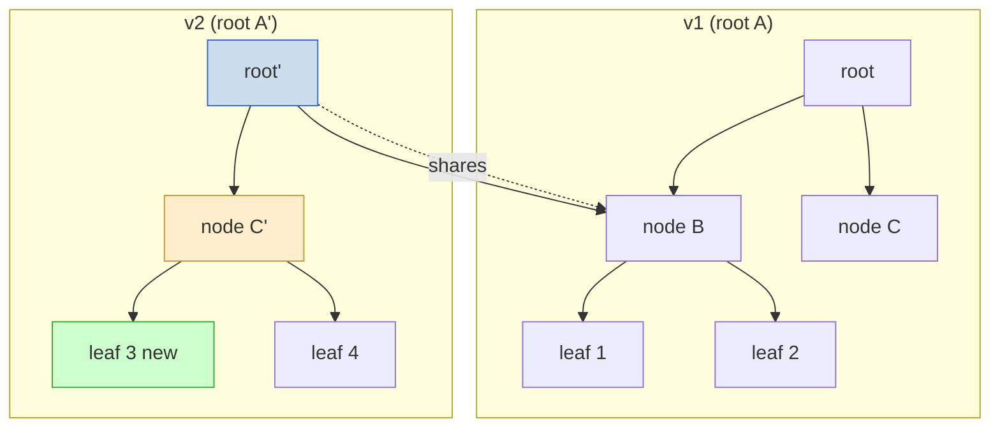
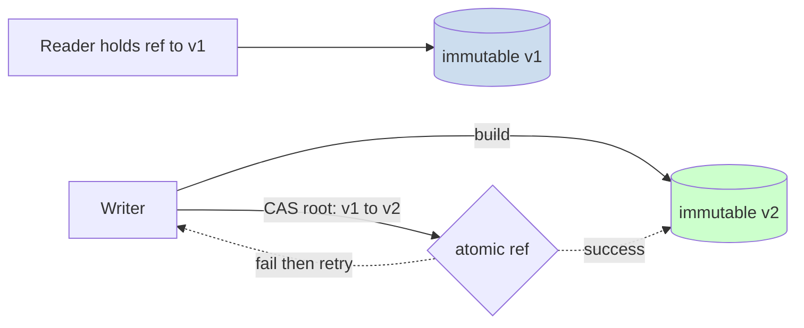
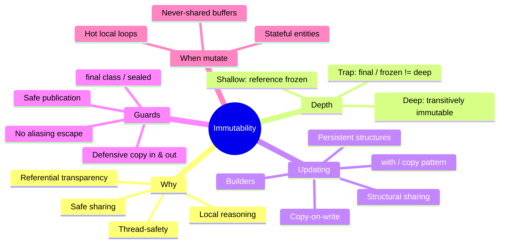

# Immutability — Interview Questions

> 50+ questions across all skill levels (Junior → Staff). Use as self-review or interview prep. Immutability is the discipline of building objects whose observable state never changes after construction — the cheapest concurrency strategy ever invented, and the foundation of value semantics, safe sharing, and local reasoning.

---

## Table of Contents

- [Junior level](#junior-level-13-questions)
- [Mid level](#mid-level-14-questions)
- [Senior level](#senior-level-13-questions)
- [Staff level](#staff-level-12-questions)
- [Rapid-Fire](#rapid-fire)
- [Summary](#summary)
- [Further Reading](#further-reading)
- [Related Topics](#related-topics)

---

## Junior level (13 questions)

### J1. What does "immutable" mean?

An object is immutable if its observable state cannot change after construction. Every "modification" returns a *new* object; the original is untouched. `String` in Java/Python, `tuple` in Python, and `time.Time` in Go are familiar examples.

### J2. Why is immutability worth the trouble?

Three big wins:
- **Thread-safety for free.** No writes after construction means no data races — no locks, no `volatile`, no memory-visibility surprises.
- **Safe sharing.** You can hand the same object to ten callers without defensive copies; none can corrupt another's view.
- **Local reasoning.** A value that can't change is one less thing to track. You read the field once and trust it forever.

### J3. What's a value object?

A small object defined entirely by its attributes, not its identity. Two `Money(10, "USD")` instances are *equal* and interchangeable. Value objects are almost always immutable: `Money`, `Coordinate`, `DateRange`, `Color`. They carry validation and behavior, not just data.

### J4. Immutable vs `const`/`final`/`readonly` — same thing?

No. `final` (Java), `readonly` (C#), `const` (JS) make a *reference* unreassignable — you can't point the variable at a different object. They say nothing about whether the object itself can mutate. `final List<String> xs` still lets you call `xs.add(...)`. (See [J11](#j11-does-final-readonly-make-an-object-deeply-immutable).)

### J5. How do you "update" an immutable object?

With the **copy / `with` pattern**: produce a new instance that shares the old fields except the one you changed.

```python
@dataclass(frozen=True)
class Point:
    x: int
    y: int

p = Point(1, 2)
p2 = replace(p, x=9)   # Point(9, 2); p is untouched
```

Java records get this manually; Kotlin data classes get `copy()`; C# records get `with`.

### J6. What's a frozen dataclass / record?

A language feature that builds an immutable value type with generated equality, hashing, and `repr`/`toString`. `@dataclass(frozen=True)` (Python), `record` (Java 16+, C# 9+), `data class` + no `var` (Kotlin). They eliminate the boilerplate of writing immutable classes by hand.

### J7. Why are immutable objects good map keys?

A map key must have a *stable* hash and equality. If a key mutates after insertion, its hash changes, the map looks for it in the wrong bucket, and `get` silently returns `null`. Immutable keys can never drift, so they're always safe.

### J8. What is defensive copying?

Copying a mutable input or output at the boundary so callers can't reach into your internals. A constructor that stores a passed-in `List` should copy it; a getter that returns one should return a copy or an unmodifiable view. Otherwise the caller holds an alias to your private state.

### J9. Give a real bug immutability prevents.

Two threads share a `Date`. Thread A calls `date.setTime(...)` while Thread B reads it — torn reads, race conditions, Heisenbugs. With an immutable `Instant`, there's nothing to set; both threads read a frozen value. The entire class of bug disappears.

### J10. Is `String` immutable in every language?

In Java, C#, Python, JavaScript — yes. In C, a `char*` is fully mutable. In Go, `string` is immutable (backed by a read-only byte slice). Knowing this per-language matters: in C you must treat strings defensively; in Go you can share them freely.

### J11. Does `final`/`readonly` make an object deeply immutable?

**No — this is the classic trap.** `final` freezes the *reference*, not the *referent*.

```java
final List<String> tags = new ArrayList<>();
tags.add("x");   // perfectly legal — the list is mutable
tags = other;    // illegal — reassigning the final reference
```

`final` gives you *shallow* immutability of the binding. Deep immutability requires the referenced object to be immutable too.

### J12. What's the difference between immutable and read-only?

Read-only means *you* can't modify it through this reference — but someone else might. `Collections.unmodifiableList(xs)` is a read-only *view*; if anyone still holds `xs`, they can mutate the underlying list and your "read-only" view changes under you. Immutable means *no one* can modify it, ever.

### J13. When is mutation actually the right choice?

When immutability would be wasteful or unnatural:
- Hot loops building a large buffer (`StringBuilder`, not `String +=`).
- Local, never-escaping accumulators inside one function.
- Large arrays updated in place for performance.
- Genuinely stateful entities (a bank account *balance* changes over time).

Immutability is a default, not a religion.

---

## Mid level (14 questions)

### M14. Deep vs shallow immutability — define both.

**Shallow:** the object's own fields can't be reassigned, but a field that points to a mutable object can still be mutated through that reference. **Deep:** the object and everything transitively reachable from it is immutable. A `record Box(List<Item> items)` is shallowly immutable (the `items` field is fixed) but not deeply immutable (the list's contents can change).

### M15. Is a frozen dataclass with a list field immutable?

**No — only shallowly.** `@dataclass(frozen=True)` prevents reassigning the field, but the list it points to is still mutable:

```python
@dataclass(frozen=True)
class Cart:
    items: list

c = Cart([])
c.items = []        # FrozenInstanceError — can't reassign
c.items.append(1)   # works fine — the list mutates!
```

To get deep immutability, use an immutable collection (`tuple`, `frozenset`) for the field.

### M16. What are persistent data structures?

Immutable collections that, on "modification", return a new version while *sharing* most of their internal structure with the old version. Adding one element to a 1,000-entry persistent map doesn't copy 1,000 entries — it shares the unchanged subtrees and allocates only the path to the new node. Both old and new versions remain valid and queryable.

### M17. What is structural sharing?

The mechanism that makes persistent data structures cheap. The new version reuses (shares) the unchanged nodes of the old version's tree. Only the nodes on the path from root to the changed leaf are copied — `O(log n)` nodes, not `O(n)`. This is what makes immutable collections in Clojure, Scala, and Immutable.js practical.



### M18. What is copy-on-write (COW)?

A strategy where data is shared (not copied) until someone tries to mutate it; the first write triggers a copy so the writer gets a private version. Used by `std::shared_ptr`-backed COW strings (older libstdc++), Linux `fork()` page tables, Python's `copy` semantics in some libraries, and Swift's arrays. It gives the illusion of value semantics with the performance of sharing — until a write forces the split.

### M19. COW vs persistent data structures — how do they differ?

- **COW** copies the *whole* structure on the first write (`O(n)`), then shares again. Cheap reads, expensive first write, no permanent sharing between versions.
- **Persistent** structures share *internally* and copy only the changed path (`O(log n)` per write), keeping every version cheap and alive simultaneously.

COW shines when writes are rare; persistent structures shine when many versions coexist (undo stacks, time-travel debugging, concurrent snapshots).

### M20. Walk through the `with`/copy update pattern across languages.

```java
// Java record
record Point(int x, int y) {
    Point withX(int nx) { return new Point(nx, y); }
}
```
```csharp
// C# record
var p2 = p with { X = 9 };
```
```kotlin
// Kotlin data class
val p2 = p.copy(x = 9)
```
```python
# Python frozen dataclass
p2 = dataclasses.replace(p, x=9)
```
All express "give me a copy with one field changed" without touching the original.

### M21. How do equality and hashing work for immutable map keys?

The key computes its hash from its fields *once* and that hash never changes, because the fields never change. `equals`/`__eq__` compares by value. This is exactly the contract a hash map needs: **equal objects must have equal hashes, and the hash must be stable for the key's lifetime in the map.** Immutability guarantees stability automatically.

### M22. Why must `equals` and `hashCode` agree, and how does immutability help?

The hash-map contract: if `a.equals(b)` then `a.hashCode() == b.hashCode()`. Records and frozen dataclasses generate both from the same fields, so they're consistent by construction. And because the fields are immutable, the hash can even be cached after first computation — a common optimization in `String`.

### M23. What's the defensive-copy boundary, and where exactly do you copy?

Two boundaries:
- **On the way in (constructor / setter):** copy mutable arguments before storing, so the caller's later mutations don't leak into you.
- **On the way out (getter):** return a copy or unmodifiable view, so callers can't mutate your internals.

```java
final class Schedule {
    private final List<Date> dates;
    Schedule(List<Date> dates) { this.dates = List.copyOf(dates); }  // in
    List<Date> dates() { return List.copyOf(dates); }                // out
}
```

### M24. What's "escape via aliasing"?

A subtle leak where a constructor stores a reference to a *mutable* object the caller still holds. The caller later mutates it, and your "immutable" object changes behind your back.

```java
Date d = new Date();
var p = new Period(d, ...);   // stored the same Date object
d.setTime(0);                 // mutated p's internals from outside!
```

Cure: defensive-copy the `Date` in the constructor.

### M25. Is immutability always slower?

**No — this is a myth.** Immutability trades allocation for elimination of locking, copying, and defensive coding:
- More short-lived allocations — but generational GCs and escape analysis make young-gen allocation nearly free.
- No locks → no contention, no cache-line ping-pong.
- No defensive copies on every read.
- Persistent structures make "modification" `O(log n)`, not `O(n)`.

For shared, concurrent, read-heavy data, immutability is often *faster*. For tight single-threaded numeric loops, in-place mutation wins. Measure.

### M26. How do immutable objects interact with garbage collectors?

They generate more young-generation garbage (each "update" allocates). Modern generational/region GCs (G1, ZGC, Go's collector) are optimized for exactly this: most allocations die young and are collected cheaply. Escape analysis can stack-allocate or scalar-replace short-lived copies entirely, paying zero GC cost. The "immutability stresses GC" worry is mostly outdated.

### M27. Can an immutable object hold a cache or memoized field?

Yes — this is **observable** vs **representational** immutability. A `String` caches its hash code in a mutable field, but since the cached value is a pure function of the immutable contents, no observer can tell. The object is *observably* immutable even though one internal field is written lazily. This is safe as long as the computation is idempotent and benign under races (or guarded).

---

## Senior level (13 questions)

### S28. How do you design a deeply immutable type in a language without enforced immutability?

Layered discipline:
1. Make all fields `final`/`readonly` and private.
2. Defensively copy mutable inputs in the constructor.
3. Return copies or unmodifiable views from getters — never the live field.
4. Ensure every referenced type is *also* immutable (recurse).
5. Don't leak `this` during construction (no listener registration in the constructor).
6. If subclassable, beware: a mutable subclass breaks the guarantee — make the class `final`/`sealed`.

### S29. Why does `final class` matter for immutability in Java?

If your class is extensible, a subclass can add mutable state or override methods to return changing values, defeating the immutability guarantee callers rely on. Marking the class `final` (or `sealed` with known immutable subtypes) closes that hole. Effective Java Item 17: "Minimize mutability — make the class final."

### S30. How do you publish an immutable object safely across threads?

The good news: a *properly constructed* immutable object (all fields `final`, no `this` escape during construction) is safe to publish through *any* mechanism — even a data race — under the Java Memory Model's final-field semantics. The JMM guarantees other threads see the correctly initialized final fields. Mutable objects need `volatile`/`synchronized`/`AtomicReference` to publish safely; immutable ones don't.

### S31. What breaks final-field safe publication?

Letting `this` escape before the constructor finishes (e.g., registering a callback, starting a thread, or storing `this` in a static field mid-construction). Another thread can then observe a partially constructed object with default-valued final fields. Rule: never publish `this` from inside a constructor.

### S32. Compare records, frozen dataclasses, and hand-written immutable classes.

| | Java `record` | Python `@dataclass(frozen=True)` | Hand-written |
|---|---|---|---|
| Equality/hash | Generated | Generated | Manual |
| Field reassignment | Blocked | Blocked (raises) | Manual `final` |
| Deep immutability | Not guaranteed | Not guaranteed | Up to you |
| Defensive copy | Manual in compact ctor | Manual in `__post_init__` | Manual |
| Boilerplate | Minimal | Minimal | High |

None give deep immutability for free; all stop field *reassignment*, none stop mutation of mutable field *contents*.

### S33. When is copy-on-write the right tool over a fully persistent structure?

When reads vastly outnumber writes and you want plain in-memory representation for read performance (a contiguous array, cache-friendly), accepting an occasional `O(n)` copy on the rare write. `CopyOnWriteArrayList` in Java is built for read-mostly listener lists. Persistent structures win when writes are frequent *and* you need many live versions.

### S34. What's the interview really checking with "is immutability always slower"?

Whether you reason about performance with evidence instead of folklore. A strong answer names the real trade (more allocation vs. less synchronization), cites mitigations (generational GC, escape analysis, structural sharing), and ends with "it depends on the access pattern — measure." A weak answer says "immutable is slow because it copies" — revealing they've never profiled it.

### S35. How does immutability simplify concurrency design?

It removes shared *mutable* state, which is the root cause of nearly every concurrency bug. With immutable data you don't need locks for reads, you can freely cache and share, snapshots are trivial (just keep the old reference), and the actor/CSP model becomes clean (pass immutable messages). Concurrency reduces to *coordinating updates to references*, not *protecting object internals*. (See [../11-concurrency/README.md](../11-concurrency/README.md).)

### S36. How do you handle "modifying" a large immutable collection efficiently?

Don't naively copy. Options:
- **Persistent collections** (Vavr, PCollections in Java; Immutable.js; Clojure's defaults) — `O(log n)` updates via structural sharing.
- **Builder pattern** — accumulate mutably in a builder, then `build()` a frozen result once.
- **Batch transients** — Clojure's transients let you mutate locally then freeze, avoiding per-step allocation.

### S37. What is referential transparency and how does immutability enable it?

An expression is referentially transparent if you can replace it with its value without changing the program's behavior. Immutable data makes functions pure (same input → same output, no hidden state changes), which makes expressions referentially transparent — enabling memoization, reordering, parallelization, and equational reasoning. This is the bridge to functional programming (see [../../functional-programming/README.md](../../functional-programming/README.md)).

### S38. How do you migrate a mutable API to an immutable one without breaking callers?

1. Introduce an immutable type alongside the mutable one.
2. Add `with`/`copy` update methods to express former setter calls.
3. Deprecate the setters; have them throw or log in new code paths.
4. Migrate callers PR by PR, replacing `obj.setX(v)` with `obj = obj.withX(v)`.
5. Remove the mutators once all callers are migrated.

The reassignment-of-the-reference idiom (`obj = obj.with...`) is the key mental shift to teach the team.

### S39. What's the relationship between immutability and the Builder pattern?

Builder is the standard answer to "immutable objects with many optional fields." You accumulate state mutably in the builder, validate cross-field constraints in `build()`, and emit a fully constructed immutable product. It avoids telescoping constructors while preserving immutability of the result.

### S40. How do you test that a type is truly immutable?

- Assert that setters/reassignment throw or don't exist (reflection-free check + a negative test).
- Mutate any collection passed to the constructor and confirm the object is unchanged (catches aliasing leaks).
- Mutate the collection returned from a getter and confirm internals are unchanged (catches outward leaks).
- For deep immutability, recurse through referenced objects.
- Property-based test: for any sequence of "update" calls, the original instances remain equal to their initial snapshots.

---

## Staff level (12 questions)

### S41. How does immutability shape an event-sourced / CQRS architecture?

Events are immutable facts that already happened — they're never updated, only appended. Immutability is the natural model: the event log is an append-only sequence of immutable records, current state is a fold over them, and time-travel/audit comes free. Mutability would corrupt the very notion of a historical fact.

### S42. Explain immutability's role in lock-free concurrency.

Lock-free algorithms (e.g., `AtomicReference.compareAndSet`) work by atomically swapping a *reference* from an old immutable snapshot to a new one. Because the snapshots never mutate, readers holding the old reference are unaffected, and the CAS either succeeds (publish new) or fails (retry from the new current). Immutability makes the "build a new version, then atomically swap" pattern correct without locks.



### S43. What are the limits of "immutability for thread-safety"?

It makes *individual objects* safe to share, but composite *operations* still need coordination. "Read balance, compute new, swap reference" is three steps; without CAS or a lock, two threads can interleave and lose an update (lost-update / check-then-act race). Immutability removes data races on object state but not race *conditions* on multi-step logic. You still need atomics or transactions for compound updates.

### S44. How does immutability interact with serialization and schema evolution?

Immutable types serialize cleanly (no hidden mutable state), but deserialization must reconstruct through the constructor, not field-poking — so frameworks need builder support or canonical constructors (Jackson `@JsonDeserialize(builder=...)`, Java record canonical constructors). Schema evolution: since you never mutate old records, adding a field means new immutable versions coexist with old serialized ones; you map across versions at read time rather than migrating in place.

### S45. Discuss memory and cache implications of pervasive immutability at scale.

Trade-offs at scale:
- **Pointer chasing:** persistent trees (HAMTs) trade contiguous arrays for node graphs — worse cache locality than a flat array.
- **Allocation churn:** more young-gen objects; tune GC (region sizes, ZGC for low pause).
- **Sharing wins:** structural sharing can *reduce* total memory when many versions overlap (snapshots, undo history) versus deep-copying each.
- **Escape analysis:** short-lived copies often never hit the heap.

The right call is workload-specific: flat mutable arrays for numeric kernels, persistent structures for versioned/concurrent state.

### S46. How would you enforce deep immutability in a large codebase?

- **Language features:** prefer records/sealed/`value class`; ban mutable collection fields via lint rules.
- **Static analysis:** ArchUnit/Error Prone rules forbidding non-final fields in `@Immutable`-annotated types; `@Immutable` from JSR-305 / Error Prone's `@Immutable` checker verifies transitively.
- **Immutable collection types** as the default in domain models (Guava `ImmutableList`, persistent collections).
- **Code review checklist** for the aliasing-leak patterns from the [README](../README.md) anti-patterns.

### S47. When does immutability hurt, and how do you decide?

It hurts when:
- The object is large and updated frequently in a tight loop (allocation dominates).
- The domain concept is *inherently* stateful and identity-bearing (an `Order` whose lifecycle mutates — model identity separately from value).
- You need O(1) random mutation on huge arrays (numerical computing, image buffers).

Decision rule: **immutable for values and shared/concurrent data; mutable, encapsulated, and never-shared for performance-critical local state.** Combine them — immutable shell, mutable internal buffer that never escapes.

### S48. What's the "freeze after build" / staged-mutability pattern?

Allow mutation during a well-defined construction phase, then permanently freeze. Examples: JavaScript `Object.freeze`, Clojure transients, a builder that mutates internally and emits an immutable product, Python's `__post_init__` validating then `object.__setattr__` locking. It gets the ergonomics and performance of mutation during setup with the guarantees of immutability afterward — but you must ensure the object isn't shared before freezing.

### S49. How do persistent vectors (HAMT / RRB-trees) achieve effectively-constant indexing?

They use a wide branching factor (typically 32). A 32-way trie reaches a billion elements in ~6 levels (`log₃₂(10⁹) ≈ 6`), so index and update are `O(log₃₂ n)` — bounded by a small constant in practice. RRB-trees extend this with relaxed radix balancing to support efficient concatenation and slicing. This is why Clojure/Scala vectors feel like arrays despite being immutable.

### S50. Immutability vs. encapsulation — are they the same goal?

Related but distinct. Encapsulation hides *how* state is represented and controls *who* can change it. Immutability removes change entirely. You can have encapsulated mutable state (a class with private fields and guarded mutators) or exposed immutable state (a public final field is safe to expose *because* it can't change). Immutability lets you *relax* encapsulation safely — exposing a final immutable field leaks nothing dangerous.

### S51. How does immutability enable safe memoization and caching layers?

If a function is pure over immutable inputs, its result depends only on those inputs, so you can cache keyed by the (immutable, hashable) arguments and trust the cache forever — the inputs can't change to invalidate it. Mutable keys break this: a cached entry becomes stale or unreachable when the key mutates. Immutable keys make caches correct and let you cache the inputs themselves by reference.

### S52. Critique: "We made everything immutable and now we have a memory/GC problem."

Diagnose before prescribing. Likely causes: (1) deep-copying instead of structural sharing — switch to persistent collections; (2) immutability applied to a hot inner loop that should use a local mutable buffer — keep the immutable boundary, mutate privately inside; (3) untuned GC for high young-gen churn — try a low-pause collector and larger young gen; (4) caching every intermediate version unnecessarily — only retain versions you need. The fix is rarely "abandon immutability"; it's "apply it at the right granularity."

---

## Rapid-Fire

| Question | Answer |
|---|---|
| Does `final` make an object immutable? | No — only the reference; the object can still mutate. |
| Frozen dataclass with a `list` field — immutable? | No, shallow only; the list can be mutated. |
| Cheapest concurrency strategy? | Sharing immutable data (no locks). |
| Cost of a persistent-structure update? | `O(log n)` via structural sharing. |
| COW copies when? | On the first write after sharing. |
| Why are immutable objects good map keys? | Stable hash and equality for their lifetime. |
| `with`/`copy` returns what? | A new object; the original is unchanged. |
| Is immutability always slower? | No — depends on access pattern; often faster when shared/concurrent. |
| Defensive copy where? | Constructor (in) and getter (out). |
| Safe publication of an immutable object needs locks? | No — final-field semantics suffice (if `this` doesn't escape). |
| Structural sharing copies what? | Only the nodes on the path to the change. |
| When is mutation right? | Hot local loops, never-shared buffers, inherently stateful entities. |
| Escape via aliasing means? | Storing a caller's mutable object without copying. |
| `Object.freeze` is deep? | No — shallow; nested objects stay mutable. |
| Records guarantee deep immutability? | No — only block field reassignment. |

---

## Summary

Immutability is the single highest-leverage discipline in concurrent and maintainable code: it gives thread-safety, safe sharing, and local reasoning for the price of allocating new objects instead of mutating old ones. The recurring interview traps all probe the gap between *shallow* and *deep* immutability — `final`/`readonly` freeze references, frozen dataclasses block reassignment, but neither stops mutation of a referenced collection. Senior-level mastery means knowing how to close that gap (defensive copies, immutable field types, `final` classes), how to update efficiently (persistent structures with structural sharing, copy-on-write, builders), and when to step back from immutability (hot local buffers, inherently stateful entities). The deepest answers tie immutability to safe publication, lock-free CAS, event sourcing, and referential transparency — and always reach for measurement over folklore when performance comes up.



---

## Further Reading

- *Effective Java*, Joshua Bloch — Item 17, "Minimize Mutability."
- *Java Concurrency in Practice*, Goetz et al. — immutability and safe publication.
- *Purely Functional Data Structures*, Chris Okasaki — persistent structures and structural sharing.
- Bagwell, "Ideal Hash Trees" — the HAMT paper behind Clojure/Scala maps.
- Rich Hickey, "The Value of Values" (talk) — values, identity, and time.

---

## Related Topics

- [Immutability — README](./README.md) — the chapter's positive rules and anti-patterns.
- [Junior notes](junior.md) · [Professional notes](professional.md)
- [Concurrency](../11-concurrency/README.md) — where immutability pays off most.
- [Functional Programming](../../functional-programming/README.md) — pure functions and persistent data.
