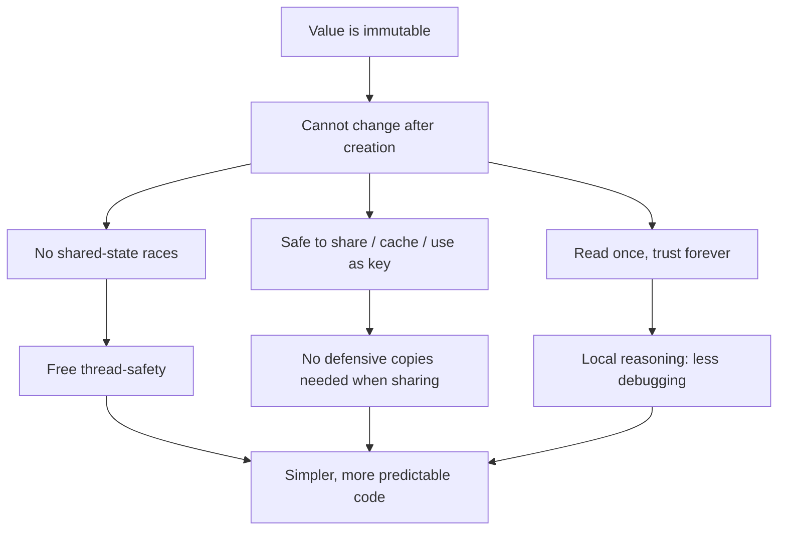

# Immutability — Junior Level

> **Level:** Junior — "What's the rule? Show me a clean example."
> You will learn the single most useful habit for writing predictable code: once a value exists, don't change it — make a new one instead.

---

## Table of Contents

1. [What is immutability?](#what-is-immutability)
2. [Real-world analogy](#real-world-analogy)
3. [Rule 1 — Prefer immutable values](#rule-1--prefer-immutable-values)
4. [Rule 2 — Model concepts as value objects](#rule-2--model-concepts-as-value-objects)
5. [Rule 3 — Don't mutate arguments; return new values](#rule-3--dont-mutate-arguments-return-new-values)
6. [Rule 4 — Copy-on-write for "changes"](#rule-4--copy-on-write-for-changes)
7. [Rule 5 — Make defensive copies at boundaries](#rule-5--make-defensive-copies-at-boundaries)
8. [Why immutability pays off](#why-immutability-pays-off)
9. [Common Mistakes](#common-mistakes)
10. [Test Yourself](#test-yourself)
11. [Cheat Sheet](#cheat-sheet)
12. [Summary](#summary)
13. [Further Reading](#further-reading)
14. [Related Topics](#related-topics)

---

## What is immutability?

An **immutable** value is one that cannot be changed after it is created. If you want a "different" value, you create a new one; the original stays exactly as it was.

A **mutable** value is the opposite: you can reach into it and change its contents in place, and everyone holding a reference to it sees the change.

```text
Mutable:   account.balance = 100   →   account.balance = 50   (same object, new contents)
Immutable: balance = Money(100)    →   newBalance = Money(50)  (two distinct objects)
```

The number `42` is immutable in every language — you never "change" `42` into `43`; you compute a *new* number. Immutability is the practice of giving your own types that same well-behaved quality.

> **Key idea:** "Mutability is the new `goto`." The reason `goto` was dangerous is that control could jump anywhere, so you could never reason locally about what happened next. Shared mutable state is the same hazard for *data*: any code holding a reference can change your value at any time, so you can never reason locally about what a value holds. Immutability removes that hazard.

The languages we use give you different tools:

| Language | Immutability tools |
|---|---|
| **Go** | No language-level immutability. You simulate it: unexported fields + value receivers + return copies + copy slices/maps before storing or exposing. |
| **Java** | `record`, `final` fields, `List.copyOf` / `Collections.unmodifiableList`, hand-written value classes. |
| **Python** | `@dataclass(frozen=True)`, `tuple`, `frozenset`, `typing.NamedTuple`. |

---

## Real-world analogy

### A signed contract vs. a whiteboard

Think of a **signed paper contract**. Once both parties sign, the terms are fixed. If the deal changes, you don't erase clause 4 with correction fluid — you draft **a new contract** (an amendment) and sign that too. The original stays on file, untouched, forever. Anyone who photocopied it still holds an accurate copy. There is never a question of "which version did I agree to?"

Now think of a shared **office whiteboard**. You write the meeting time, leave the room, and come back to find someone erased it and wrote something else. Maybe a colleague. Maybe you, last Tuesday, and you forgot. The whiteboard is mutable shared state: *anyone* can change it, *any time*, and there's no record of who or when.

Immutable values are the signed contract. Mutable shared objects are the whiteboard. The whole point of this chapter is to make the important data in your program behave like contracts, not whiteboards.

### A bank statement

Your December bank statement says "balance: $1,240." When January's transactions arrive, the bank does **not** go back and edit December's statement. December is frozen. January is a *new* statement built from December plus the new events. Because old statements never change, you can always reconstruct exactly what was true at any point in time. That is copy-on-write applied to your finances — and it's why audits are even possible.

---

## Rule 1 — Prefer immutable values

**The rule:** when you create a type that represents a *value* (money, a date range, a coordinate, an email), make it so its contents can never change after construction. Reserve mutability for things that genuinely have a lifecycle and identity (a database connection, a running game session).

A field that never changes after construction can't be corrupted by a faraway bug. You read it once and trust it forever.

### Java — dirty

```java
class Point {
    public int x;   // public, mutable
    public int y;

    public Point(int x, int y) { this.x = x; this.y = y; }
}

Point origin = new Point(0, 0);
drawGrid(origin);          // a helper somewhere...
System.out.println(origin.x);  // ...is it still 0? You can't be sure.
```

`origin` is a sitting duck: any method that receives it can write `origin.x = 999`. To know its value at line 3 you'd have to read every method it was passed to.

### Java — clean

```java
// A record is immutable by construction: every field is final, no setters.
record Point(int x, int y) {}

Point origin = new Point(0, 0);
drawGrid(origin);
System.out.println(origin.x());  // guaranteed still 0 — nothing can change it
```

If you can't use a `record` (older Java, or you need custom behavior), do it by hand with `final`:

```java
final class Point {
    private final int x;
    private final int y;

    Point(int x, int y) { this.x = x; this.y = y; }

    int x() { return x; }
    int y() { return y; }

    // "Change" = return a new instance
    Point withX(int newX) { return new Point(newX, this.y); }
}
```

### Python — dirty

```python
class Point:
    def __init__(self, x, y):
        self.x = x
        self.y = y

origin = Point(0, 0)
draw_grid(origin)          # a helper somewhere...
print(origin.x)            # ...still 0? Anything could have set origin.x = 999
```

### Python — clean

```python
from dataclasses import dataclass

@dataclass(frozen=True)
class Point:
    x: int
    y: int

origin = Point(0, 0)
draw_grid(origin)
print(origin.x)            # guaranteed 0
origin.x = 999             # raises FrozenInstanceError — the type protects itself
```

`frozen=True` makes assignment to fields raise an error, and it gives you free `__eq__` and `__hash__` based on contents (more on that in Rule 2).

### Go — dirty

```go
type Point struct {
    X int  // exported, so any package can write to it
    Y int
}

origin := Point{0, 0}
drawGrid(&origin)          // passed by pointer — drawGrid can mutate it
fmt.Println(origin.X)      // still 0? Not if drawGrid wrote through the pointer.
```

### Go — clean

Go has **no** language keyword for immutability. The idiom is: keep fields **unexported**, expose them through **value-receiver** getter methods, and pass the struct **by value** (not by pointer) so callers get a copy.

```go
type Point struct {
    x int  // lowercase = unexported, unreachable from other packages
    y int
}

func NewPoint(x, y int) Point { return Point{x: x, y: y} }

// Value receiver: operates on a copy, can't mutate the original.
func (p Point) X() int { return p.x }
func (p Point) Y() int { return p.y }

// "Change" = return a new value.
func (p Point) WithX(newX int) Point { return Point{x: newX, y: p.y} }
```

Passing a `Point` by value means the callee gets its own copy. `drawGrid(p Point)` literally cannot affect the caller's `p`.

---

## Rule 2 — Model concepts as value objects

**The rule:** a **value object** is a small immutable type defined entirely by its contents, not by an identity. Two `Money(50, "USD")` values are *equal* the same way two `5`s are equal — there's no "which one" to ask about.

Value objects are where immutability earns its keep. Money, email addresses, date ranges, colors, quantities — these are *values*, not entities. They should be immutable, compared by content, and own their own validation.

### Java — dirty

```java
// Money as a loose pair of mutable primitives. Equality is by reference.
class Money {
    public long cents;
    public String currency;
    Money(long cents, String currency) { this.cents = cents; this.currency = currency; }
}

Money a = new Money(500, "USD");
Money b = new Money(500, "USD");
System.out.println(a.equals(b));  // false! Different objects, even though "$5.00" == "$5.00"
a.cents = -999;                   // and anyone can corrupt it
```

### Java — clean

```java
record Money(long cents, String currency) {
    Money {  // compact constructor: validate invariants once, at the only entry point
        if (cents < 0) throw new IllegalArgumentException("amount cannot be negative");
        if (currency == null || currency.length() != 3)
            throw new IllegalArgumentException("currency must be a 3-letter code");
    }

    Money plus(Money other) {
        if (!currency.equals(other.currency))
            throw new IllegalArgumentException("cannot add " + currency + " to " + other.currency);
        return new Money(cents + other.cents, currency);  // new value, old ones untouched
    }
}

Money a = new Money(500, "USD");
Money b = new Money(500, "USD");
System.out.println(a.equals(b));   // true — records compare by content
Money sum = a.plus(b);             // Money[cents=1000, currency=USD]; a and b unchanged
```

A `record` gives you `equals`, `hashCode`, and `toString` for free, all based on the fields — exactly what a value object needs.

### Python — clean

```python
from dataclasses import dataclass

@dataclass(frozen=True)
class Money:
    cents: int
    currency: str

    def __post_init__(self):
        if self.cents < 0:
            raise ValueError("amount cannot be negative")
        if len(self.currency) != 3:
            raise ValueError("currency must be a 3-letter code")

    def plus(self, other: "Money") -> "Money":
        if self.currency != other.currency:
            raise ValueError(f"cannot add {self.currency} to {other.currency}")
        return Money(self.cents + other.cents, self.currency)

a = Money(500, "USD")
b = Money(500, "USD")
print(a == b)          # True — frozen dataclasses compare by content
print(a.plus(b))       # Money(cents=1000, currency='USD'); a and b unchanged
```

For the simplest fixed records, `NamedTuple` is even lighter:

```python
from typing import NamedTuple

class Coordinate(NamedTuple):
    lat: float
    lon: float

c = Coordinate(40.7, -74.0)
print(c.lat)           # 40.7
# c.lat = 0.0          # AttributeError — tuples are immutable
```

### Go — clean

```go
type Money struct {
    cents    int64  // unexported
    currency string
}

func NewMoney(cents int64, currency string) (Money, error) {
    if cents < 0 {
        return Money{}, fmt.Errorf("amount cannot be negative")
    }
    if len(currency) != 3 {
        return Money{}, fmt.Errorf("currency must be a 3-letter code")
    }
    return Money{cents: cents, currency: currency}, nil
}

func (m Money) Cents() int64     { return m.cents }
func (m Money) Currency() string { return m.currency }

func (m Money) Plus(other Money) (Money, error) {
    if m.currency != other.currency {
        return Money{}, fmt.Errorf("cannot add %s to %s", m.currency, other.currency)
    }
    return Money{cents: m.cents + other.cents, currency: m.currency}, nil
}
```

Because `Money` contains only value-type fields (`int64`, `string`), comparing two of them with `==` already works by content, and copying one is automatically a deep copy. That's the easiest case — it gets harder when a struct holds a slice or map, which is exactly what Rule 5 is about.

---

## Rule 3 — Don't mutate arguments; return new values

**The rule:** a function should not modify the objects passed into it. If the caller wanted a changed thing, return a new one and let them decide what to do with it.

When a function quietly mutates its argument, the caller's variable changes without any visible assignment at the call site. That is one of the most confusing bugs a junior can write — the value "spontaneously" changes three functions away from where you're looking.

### Python — dirty

```python
def apply_discount(items, percent):
    for item in items:
        item["price"] *= (1 - percent / 100)   # mutates the caller's dicts!
    return items

cart = [{"name": "book", "price": 20.0}]
discounted = apply_discount(cart, 10)
print(cart[0]["price"])   # 18.0 — the ORIGINAL cart changed. Surprise.
```

The caller still holds `cart` expecting the original prices — but they're gone. There's no longer any record of the undiscounted price.

### Python — clean

```python
def apply_discount(items, percent):
    factor = 1 - percent / 100
    return [{**item, "price": item["price"] * factor} for item in items]  # new list, new dicts

cart = [{"name": "book", "price": 20.0}]
discounted = apply_discount(cart, 10)
print(cart[0]["price"])         # 20.0 — original untouched
print(discounted[0]["price"])   # 18.0 — new value
```

### Java — dirty

```java
// Sorts the caller's list in place — a hidden side effect.
List<Integer> topThree(List<Integer> scores) {
    Collections.sort(scores);                 // mutates the argument!
    Collections.reverse(scores);
    return scores.subList(0, Math.min(3, scores.size()));
}

List<Integer> original = new ArrayList<>(List.of(3, 1, 2));
topThree(original);
System.out.println(original);  // [3, 2, 1] — caller's list was reordered behind their back
```

### Java — clean

```java
List<Integer> topThree(List<Integer> scores) {
    return scores.stream()
                 .sorted(Comparator.reverseOrder())   // produces a new ordering
                 .limit(3)
                 .toList();                            // new, unmodifiable list
}

List<Integer> original = List.of(3, 1, 2);
List<Integer> top = topThree(original);
System.out.println(original);  // [3, 1, 2] — untouched
System.out.println(top);       // [3, 2, 1]
```

### Go — dirty

```go
// Slices share their backing array. Sorting the argument reorders the caller's data.
func Median(values []int) int {
    sort.Ints(values)              // mutates the caller's slice in place!
    return values[len(values)/2]
}

data := []int{3, 1, 2}
Median(data)
fmt.Println(data)  // [1 2 3] — caller's slice got reordered as a side effect
```

### Go — clean

```go
func Median(values []int) int {
    sorted := make([]int, len(values))  // own backing array
    copy(sorted, values)                // copy the elements in
    sort.Ints(sorted)                   // sort the COPY
    return sorted[len(sorted)/2]
}

data := []int{3, 1, 2}
Median(data)
fmt.Println(data)  // [3 1 2] — original order preserved
```

> **Watch out (Go specifically):** passing a slice by value does **not** protect its elements. A slice header is copied, but it still points at the *same backing array*, so `sort.Ints(values)` reaches right through to the caller's data. To truly leave the input alone, you must `copy` the elements. This is the single most common immutability bug for Go beginners.

---

## Rule 4 — Copy-on-write for "changes"

**The rule:** to produce a modified version of an immutable value, build a *new* value that shares the unchanged parts and replaces only what differs. This is called **copy-on-write**: you don't write into the old value; you copy it (cheaply) and write into the copy.

This is how immutable types support "editing" without ever mutating. Java records give you `with`-style helpers you write yourself; Python dataclasses ship with `replace`.

### Java — clean

```java
record Address(String street, String city, String zip) {
    // copy-on-write helper: same street/city, new zip
    Address withZip(String newZip) {
        return new Address(street, city, newZip);
    }
}

Address home = new Address("1 Main St", "Springfield", "00000");
Address corrected = home.withZip("12345");

System.out.println(home.zip());       // 00000 — original preserved
System.out.println(corrected.zip());  // 12345 — new value
```

### Python — clean

```python
from dataclasses import dataclass, replace

@dataclass(frozen=True)
class Address:
    street: str
    city: str
    zip: str

home = Address("1 Main St", "Springfield", "00000")
corrected = replace(home, zip="12345")   # copy-on-write, built in

print(home.zip)        # 00000 — original preserved
print(corrected.zip)   # 12345 — new value
```

`dataclasses.replace` makes a new instance with the named fields changed and everything else copied — exactly the copy-on-write pattern, for free.

### Go — clean

```go
type Address struct {
    street string
    city   string
    zip    string
}

// Copy-on-write: receiver is a value (a copy), we set one field and return it.
func (a Address) WithZip(newZip string) Address {
    a.zip = newZip   // mutating the LOCAL copy is fine
    return a         // return the modified copy; caller's original is untouched
}

home := Address{street: "1 Main St", city: "Springfield", zip: "00000"}
corrected := home.WithZip("12345")

fmt.Println(home.zip)       // 00000 — original preserved
fmt.Println(corrected.zip)  // 12345 — new value
```

Because the receiver `a` is a *value* (not a pointer), `a.zip = newZip` edits a private copy. The caller never sees that mutation; they only get the returned new value.

> **Note:** for a small struct, copying the whole thing on every change is cheap and perfectly fine. When values get large or change-heavy, libraries provide **persistent data structures** that share most of their structure between versions so copies stay cheap — you'll meet those at the [middle level](middle.md).

---

## Rule 5 — Make defensive copies at boundaries

**The rule:** an immutable type is only as immutable as its *least protected* field. If your value object stores a slice, a list, or a map, you must copy it **on the way in** (in the constructor) and **on the way out** (in getters). Otherwise a caller who still holds the original collection can mutate your "immutable" object from the outside.

This is the trap that catches almost every beginner: they freeze the *wrapper* but leave the *contents* exposed. A frozen object holding a live mutable collection is not immutable — it just looks like it.

### Java — dirty

```java
final class Team {
    private final List<String> members;
    Team(List<String> members) {
        this.members = members;   // stored the caller's list directly — aliased!
    }
    List<String> members() {
        return members;           // handed the internal list back out — leaked!
    }
}

List<String> roster = new ArrayList<>(List.of("Ada", "Linus"));
Team team = new Team(roster);

roster.add("Mallory");            // mutate through the original reference...
team.members().add("Eve");        // ...and through the leaked getter...
System.out.println(team.members()); // [Ada, Linus, Mallory, Eve] — "immutable"?!
```

The `final` field only stops you from *reassigning* `members` to a different list. It does nothing to stop the *contents* of that list from changing.

### Java — clean

```java
final class Team {
    private final List<String> members;
    Team(List<String> members) {
        this.members = List.copyOf(members);  // defensive copy IN — own the data
    }
    List<String> members() {
        return members;                        // List.copyOf produced an unmodifiable list
    }
}

List<String> roster = new ArrayList<>(List.of("Ada", "Linus"));
Team team = new Team(roster);

roster.add("Mallory");                 // mutates only the caller's copy
System.out.println(team.members());    // [Ada, Linus] — protected
team.members().add("Eve");             // UnsupportedOperationException — also protected
```

`List.copyOf` (Java 10+) makes an unmodifiable copy, so it protects you on *both* sides at once. (Older code uses `new ArrayList<>(members)` in the constructor and `Collections.unmodifiableList(members)` in the getter.)

### Python — dirty

```python
from dataclasses import dataclass

@dataclass(frozen=True)
class Team:
    members: list   # a list is mutable — frozen only protects the FIELD, not the LIST

roster = ["Ada", "Linus"]
team = Team(roster)
roster.append("Mallory")     # mutate through the original...
team.members.append("Eve")   # ...and the field is still a live mutable list!
print(team.members)          # ['Ada', 'Linus', 'Mallory', 'Eve']
```

### Python — clean

```python
from dataclasses import dataclass, field

@dataclass(frozen=True)
class Team:
    members: tuple                       # use an immutable container

    def __init__(self, members):
        # bypass the frozen setter once, to store an immutable copy
        object.__setattr__(self, "members", tuple(members))

roster = ["Ada", "Linus"]
team = Team(roster)
roster.append("Mallory")     # only mutates the caller's list
print(team.members)          # ('Ada', 'Linus') — protected
# team.members.append("Eve") # AttributeError — tuples have no append
```

Storing a `tuple` (or `frozenset` for unordered unique items) gives you a container that genuinely can't be mutated, closing the escape hatch.

### Go — dirty

```go
type Team struct {
    members []string  // a slice header pointing at a shared backing array
}

func NewTeam(members []string) Team {
    return Team{members: members}   // aliases the caller's slice
}

func (t Team) Members() []string {
    return t.members                // hands the internal slice back — leaked
}

roster := []string{"Ada", "Linus"}
team := NewTeam(roster)
roster[0] = "Mallory"               // mutate through the original...
team.Members()[1] = "Eve"           // ...and through the leaked getter...
fmt.Println(team.members)           // [Mallory Eve] — both writes landed
```

### Go — clean

```go
type Team struct {
    members []string
}

func NewTeam(members []string) Team {
    cp := make([]string, len(members))
    copy(cp, members)               // defensive copy IN
    return Team{members: cp}
}

func (t Team) Members() []string {
    cp := make([]string, len(t.members))
    copy(cp, t.members)             // defensive copy OUT
    return cp
}

roster := []string{"Ada", "Linus"}
team := NewTeam(roster)
roster[0] = "Mallory"               // mutates only the caller's slice
team.Members()[1] = "Eve"           // mutates only the returned copy
fmt.Println(team.members)           // [Ada Linus] — protected on both sides
```

> **The aliasing trap, in one sentence:** if two variables point at the same mutable container, changing it through *either* name changes it for *both*. Defensive copies break the aliasing so your object owns its data exclusively.

---

## Why immutability pays off

Three concrete payoffs, in plain terms:

1. **Free thread-safety.** A value that never changes can be read by many threads at once with zero locks, because there's nothing to race on. Most concurrency bugs are about *shared mutable* state; remove the "mutable" and the bug class disappears. (See the [Concurrency chapter](../11-concurrency/README.md).)

2. **Safe sharing.** You can hand the same immutable value to ten callers, store it in a cache, or use it as a map key, and never worry that one of them will change it under the others. Mutable objects, by contrast, you must defensively copy before sharing — or live with the aliasing bugs from Rule 5.

3. **Easy reasoning.** Once you've read an immutable value, you know its contents for the rest of its life. You don't have to trace every function it was passed to. This is the single biggest day-to-day win: your mental model stays true.



---

## Common Mistakes

Each of these is an anti-pattern to recognize and avoid. They all share one root: something you *thought* was immutable can still be changed.

### 1. Mutating method arguments

Modifying an object passed into your function. The caller's variable changes with no visible assignment — a "spooky action at a distance" bug. **Fix:** return a new value (Rule 3); never write into a parameter unless the function's whole job is to fill a buffer the caller explicitly handed over for that purpose.

### 2. Returning mutable references to internal state

A getter that hands back the actual internal list/slice/map. Now any caller can mutate your object's guts. **Fix:** return a copy or an unmodifiable view (Rule 5, "copy OUT").

```java
// dirty
List<Order> getOrders() { return this.orders; }
// clean
List<Order> getOrders() { return List.copyOf(this.orders); }
```

### 3. Partial immutability — an immutable wrapper around a mutable map

A `frozen=True` dataclass or a `final` field that *holds* a `HashMap`/`list`/slice. The wrapper is frozen; the contents are wide open. This is the most common false sense of security. **Fix:** store immutable containers (`tuple`, `frozenset`, `List.copyOf`) and defensive-copy at the boundary.

### 4. Using setters to "fix up" a supposedly immutable object

Adding `setX()` "just for one edge case." The moment one setter exists, every guarantee is gone — readers can no longer trust the value. **Fix:** there are no setters on an immutable type. To change something, return a new instance (`withX`, `replace`).

### 5. Deep mutation via aliasing through the constructor

Passing a mutable object into a constructor, then mutating the *original* afterward — the constructor stored the same reference, so your changes leak in. This is the "dirty" half of Rule 5. **Fix:** the constructor must make a defensive copy ("copy IN") so the object owns its data and outside references can't reach it.

```python
# dirty: the object aliases the caller's list
team = Team(roster)
roster.append("oops")   # silently mutates team
# clean: constructor copies, so roster and team are independent
```

---

## Test Yourself

<details>
<summary>1. What does "immutable" mean, and how do you "change" an immutable value?</summary>

Immutable means the value's contents cannot be modified after it is created. You don't change it — you create a **new** value that has the differences you want, leaving the original untouched. (E.g. `corrected = home.withZip("12345")` produces a new `Address`; `home` is unchanged.)
</details>

<details>
<summary>2. Why is "mutability is the new goto" a useful comparison?</summary>

`goto` made control flow jump unpredictably, so you couldn't reason locally about what runs next. Shared mutable state does the same to *data*: any code holding a reference can change a value at any time, so you can never be sure what a value holds just by reading where it was created. Immutability restores local reasoning — once read, a value is trustworthy forever.
</details>

<details>
<summary>3. A Java field is `final` and holds a `List`. Is the object immutable?</summary>

No. `final` stops you from *reassigning* the field to a different list, but the *contents* of the list can still be added to, removed from, or reordered. To be immutable you must store an unmodifiable copy (`List.copyOf(...)`) and never hand the live list out of a getter. This is **partial immutability** — the classic trap.
</details>

<details>
<summary>4. In Go, you pass a slice by value into a function. Are the caller's elements safe from mutation?</summary>

No. The *slice header* is copied, but it still points at the **same backing array**. The function can write to `s[0]`, `sort` it, etc., and the caller sees the change. To leave the input alone, `make` a new slice and `copy` the elements first.
</details>

<details>
<summary>5. What is a "value object" and how does it differ from a normal object?</summary>

A value object is a small immutable type defined entirely by its contents (Money, Email, Address). It has no identity — two value objects with equal contents are equal, like two `5`s. A normal entity has identity (two users with the same name are still different users). Value objects should be immutable and compared by content; in Java use `record`, in Python `@dataclass(frozen=True)`, in Go an unexported-field struct.
</details>

<details>
<summary>6. Why does an immutable value give you "free thread-safety"?</summary>

Race conditions come from two threads *writing*, or one writing while another reads, the same data. If a value can never be written after creation, there is nothing to race on — any number of threads can read it simultaneously with no locks. Remove "mutable" from "shared mutable state" and the whole bug class vanishes.
</details>

<details>
<summary>7. Your "immutable" config object has one tiny setter for a special case. What's wrong?</summary>

The single setter destroys every guarantee the type offered. Other code can no longer assume the config it read a moment ago is still the same. Callers can no longer share or cache it safely. There is no "mostly immutable" — to change a value you must return a new instance, not mutate in place. Remove the setter and add a `withX(...)` / `replace(...)` that returns a new object.
</details>

<details>
<summary>8. What are the two places you must defensively copy a collection, and why?</summary>

**In** (constructor): copy the incoming collection so the object owns its own data and the caller's still-held reference can't mutate it later. **Out** (getter): return a copy or an unmodifiable view so callers can't reach into and edit your internal collection. Copying on only one side still leaves an escape hatch on the other.
</details>

---

## Cheat Sheet

| Goal | Go | Java | Python |
|---|---|---|---|
| Immutable value type | unexported fields + value-receiver getters | `record` or `final` fields + getters | `@dataclass(frozen=True)` |
| Fixed tuple of values | struct of value types | `record` | `NamedTuple` / `tuple` |
| Immutable list | copy slice in & out | `List.copyOf(...)` | `tuple` |
| Immutable set | — | `Set.copyOf(...)` | `frozenset` |
| Immutable map | copy map in & out | `Map.copyOf(...)` | `MappingProxyType` / freeze keys+values |
| "Change" a value | value receiver, set field, return copy | hand-written `withX(...)` | `dataclasses.replace(obj, x=...)` |
| Defensive copy IN | `copy(dst, src)` in constructor | `List.copyOf` in constructor | `tuple(...)` in `__init__` |
| Defensive copy OUT | `copy` then return new slice | `List.copyOf` in getter | return the `tuple` directly |
| Don't mutate args | `copy` then operate on copy | operate on a stream / new list | comprehension building a new list |

**Quick rules of thumb**

- Default to immutable. Make something mutable only when it genuinely has a lifecycle.
- No setters on value objects. Changes return new instances.
- A frozen wrapper around a mutable collection is **not** immutable.
- Copy collections on the way IN and on the way OUT.
- In Go, "by value" protects the struct's own fields but **not** what its slices/maps point at.

---

## Summary

- **Immutable = unchangeable after creation.** To "change" a value, build a new one and leave the original alone.
- **Prefer immutable values** for anything that represents data rather than a living entity. Reserve mutability for things with a real lifecycle.
- **Model concepts as value objects** — small, immutable, compared by content, owning their own validation. `record` (Java), `@dataclass(frozen=True)` / `NamedTuple` (Python), unexported-field struct + value receivers (Go).
- **Don't mutate arguments.** Return new values so the caller's data never changes behind their back.
- **Copy-on-write** is how immutable types support edits: copy the unchanged parts, replace only what differs.
- **Defensive copies at boundaries** (copy IN, copy OUT) close the aliasing escape hatch when your value holds a collection.
- The payoff: **free thread-safety, safe sharing, and local reasoning** — code you can trust without tracing every reference.
- The traps all reduce to one thing: *something you thought was frozen can still be changed*. Mutating arguments, leaking internal references, freezing only the wrapper, sneaking in a setter, or aliasing through the constructor.

---

## Further Reading

- Joshua Bloch, *Effective Java* — Item "Minimize mutability" and "Make defensive copies when needed."
- Eric Evans, *Domain-Driven Design* — the original treatment of **Value Objects** vs. Entities.
- Martin Fowler, ["Value Object"](https://martinfowler.com/bliki/ValueObject.html) and ["Immutability changes everything" notes].
- Python docs — [`dataclasses`](https://docs.python.org/3/library/dataclasses.html) (`frozen`, `replace`) and [`typing.NamedTuple`](https://docs.python.org/3/library/typing.html#typing.NamedTuple).
- The Go Blog — ["Go Slices: usage and internals"](https://go.dev/blog/slices-intro) for why slices alias their backing array.

---

## Related Topics

- [middle.md](middle.md) — persistent data structures, builders for big immutable objects, and the cost/benefit trade-offs in real systems.
- [senior.md](senior.md) — immutability at architectural scale: event sourcing, immutable infrastructure, and when mutability is the right call.
- [Chapter README](../README.md) — the anti-patterns this chapter teaches you to avoid.
- [Objects and Data Structures](../05-objects-and-data-structures/README.md) — value objects sit at the heart of how you choose between objects and plain data.
- [Concurrency](../11-concurrency/README.md) — why immutable values are the simplest path to thread-safe code.
- [Pure Functions](../15-pure-functions/README.md) — functions that don't mutate state are the natural partner of immutable data.
- [Functional Programming](../../functional-programming/README.md) — immutability is a founding principle of the functional style.
- [Refactoring](../../refactoring/README.md) — techniques like Replace Data Value with Object turn loose primitives into proper value objects.
- [Anti-Patterns](../../anti-patterns/README.md) — shared mutable state is a recurring source of the bugs catalogued there.
