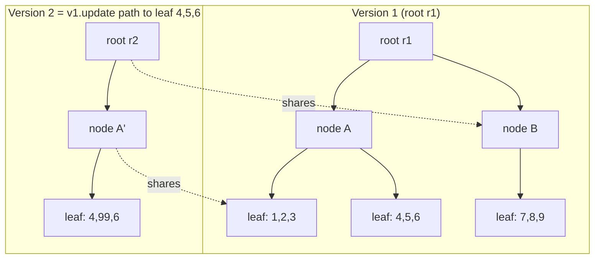

# Immutability — Middle Level

> Focus: "Why?" and "When does it bend?" — the trade-offs behind deep vs shallow immutability, structural sharing, copy-on-update patterns, and the cases where mutation is the correct engineering call.

---

## Table of Contents

1. [Why immutability — the property you actually buy](#why-immutability--the-property-you-actually-buy)
2. [Deep vs shallow immutability — the lie of the frozen wrapper](#deep-vs-shallow-immutability--the-lie-of-the-frozen-wrapper)
3. [Persistent data structures and structural sharing](#persistent-data-structures-and-structural-sharing)
4. [The `with`/copy pattern for updates](#the-withcopy-pattern-for-updates)
5. [Immutability, equality, and hashing](#immutability-equality-and-hashing)
6. [Freezing at the boundary](#freezing-at-the-boundary)
7. [When mutation is the right call](#when-mutation-is-the-right-call)
8. [The cost: copying vs sharing](#the-cost-copying-vs-sharing)
9. [Common Mistakes](#common-mistakes)
10. [Test Yourself](#test-yourself)
11. [Cheat Sheet](#cheat-sheet)
12. [Summary](#summary)
13. [Further Reading](#further-reading)
14. [Related Topics](#related-topics)

---

## Why immutability — the property you actually buy

The junior framing is "immutable values can't change, so you avoid bugs." True, but vague. Concretely, immutability buys you **four properties**, and you should know which one you're paying for in any given decision:

1. **No spooky action at a distance.** If you hand a value to three functions and none of them can mutate it, none of them can corrupt the other two. Aliasing stops being a hazard. This is the property that matters most in concurrent code.
2. **Safe sharing without defensive copies.** Immutable values can be shared across threads, cached, and used as map keys without a single `clone()`. The defensive copy you'd otherwise write at every boundary disappears.
3. **Referential transparency for reasoning.** A variable holding an immutable value means the same thing on line 10 and line 200. You can read code top-to-bottom without re-checking "did something change `x` in between?"
4. **Cheap snapshots and time-travel.** Because old versions are never overwritten, you get undo, audit trails, and event replay almost for free.

When you decide whether to make something immutable, ask *which of these four you need*. If you need none of them — a short-lived local accumulator in a tight loop, say — immutability is overhead with no payoff. The skill at this level is matching the tool to the property, not applying the rule reflexively.

---

## Deep vs shallow immutability — the lie of the frozen wrapper

This is the single most common immutability mistake, and it's subtle enough that it survives code review constantly.

**Shallow immutability** freezes the *outer* container: you cannot reassign the fields. **Deep immutability** guarantees that nothing reachable through those fields can change either. An immutable record that holds a mutable list is shallow — and a lie.

```python
from dataclasses import dataclass

@dataclass(frozen=True)
class Order:
    id: str
    items: list[str]          # frozen=True does NOT freeze this list

o = Order("A-1", ["sku-1", "sku-2"])
# o.id = "A-2"               # raises FrozenInstanceError — good
o.items.append("sku-3")      # succeeds silently — the "immutable" order just changed
```

`frozen=True` only prevents *reassigning the attribute*. The list object the attribute points to is fully mutable. Anyone holding `o` thinks they have a snapshot; they don't. Worse, if `o` is used as a dict key (frozen dataclasses are hashable), its hash was computed from a now-stale view.

The same trap exists everywhere:

```java
public final class Order {
    private final String id;
    private final List<String> items;          // final reference, mutable list

    public Order(String id, List<String> items) {
        this.id = id;
        this.items = items;                      // BUG: stores the caller's list
    }
    public List<String> getItems() { return items; }   // BUG: hands out the live list
}
```

There are *two* leaks here: the constructor aliases the caller's list (the caller can mutate it later), and the getter returns the live internal list (the caller can mutate it now). Both break the immutability contract.

The fix is **copy in, copy out** — or better, use a genuinely immutable collection:

```java
public final class Order {
    private final String id;
    private final List<String> items;

    public Order(String id, List<String> items) {
        this.id = id;
        this.items = List.copyOf(items);          // defensive copy, returns immutable list
    }
    public List<String> getItems() { return items; }  // safe: List.copyOf is unmodifiable
}
```

Go has no `final` and no frozen structs, so deep immutability is purely a *discipline* enforced by not exporting fields and not handing out slices that alias internal state:

```go
type Order struct {
    id    string
    items []string
}

func NewOrder(id string, items []string) Order {
    cp := make([]string, len(items))   // copy in: caller can't mutate our slice later
    copy(cp, items)
    return Order{id: id, items: cp}
}

func (o Order) Items() []string {
    cp := make([]string, len(o.items)) // copy out: caller can't mutate our backing array
    copy(cp, o.items)
    return cp
}
```

> **Rule:** "Immutable" is a claim about the *transitive closure* of what's reachable. A frozen object that exposes one mutable field is not immutable — it's a more confusing version of mutable, because the type system told you to trust it.

---

## Persistent data structures and structural sharing

The obvious objection to immutability is: "if I can't change a 10,000-element list, every update copies 10,000 elements — that's O(n) per operation, unacceptable."

That objection is correct for *naive* copy-on-write and *wrong* for **persistent data structures**, which is what makes immutable-by-default languages (Clojure, Scala, Elm) viable at scale.

The trick is **structural sharing**. A persistent vector or map is internally a balanced tree (commonly a bit-partitioned trie with branching factor 32). "Updating" element *i* doesn't copy the whole tree — it copies only the **path from the root to the changed leaf** and shares every untouched subtree with the previous version.



Version 2 reuses node B and leaf `1,2,3` untouched; it allocates only a new root, a new copy of node A, and the one changed leaf. For a tree of depth *d*, an update copies *d* nodes. With branching factor 32, *d* = ⌈log₃₂ n⌉, which is **≤ 7 nodes for a billion elements**. That's effectively O(log₃₂ n) ≈ O(1) in practice — not O(n).

So "copy-on-write is O(n) every time" is a myth that only holds for the dumbest possible implementation (literally cloning the array). Production immutable collections share structure, which is why both the old and new versions remain valid and cheap.

| Approach | Update cost | Old version after update |
|---|---|---|
| Naive copy-on-write (clone whole array) | O(n) | Still valid (full copy) |
| In-place mutation | O(1) | **Destroyed** |
| Persistent structure (structural sharing) | O(log₃₂ n) | Still valid (shares untouched subtrees) |

Caveat: this requires a real persistent-collection library. Java's `List.copyOf`, Python's `tuple`, and Go slice copies are **naive** — they're O(n) per update. Use them for small collections or infrequent updates; reach for a persistent library (e.g. Vavr in Java, `pyrsistent` in Python, `immutable.js` in JS) when you have large structures updated frequently.

---

## The `with`/copy pattern for updates

If a value can't be mutated, "updating" it means **producing a new value that differs in one field**. Every modern language has sugar for this so you don't hand-write a constructor call listing every unchanged field.

**Python — `dataclasses.replace`:**

```python
from dataclasses import dataclass, replace

@dataclass(frozen=True)
class Account:
    id: str
    balance: int
    currency: str

a = Account("acc-1", 100, "USD")
b = replace(a, balance=150)          # new Account, only balance changed
# a is untouched: Account('acc-1', 100, 'USD')
```

**Java — record + a `with` style:** Java records have no built-in `with` (as of 21), so the idiom is an explicit compact wither, or a Builder for many fields:

```java
public record Account(String id, long balance, String currency) {
    public Account withBalance(long newBalance) {
        return new Account(id, newBalance, currency);
    }
}
Account b = a.withBalance(150);
```

**Go — struct copy by value:** Go's value semantics make this natural — assigning a struct copies it, so you copy then overwrite the one field:

```go
type Account struct {
    ID       string
    Balance  int64
    Currency string
}

func (a Account) WithBalance(b int64) Account {
    a.Balance = b   // 'a' is a copy (value receiver); original is untouched
    return a
}
b := a.WithBalance(150)
```

The Go version mutates `a` *locally* — but `a` is a copy because the receiver is by value, so the caller's value is safe. This is the "mutable internals, immutable interface" idea in miniature.

When a value has many fields and updates set several at once, the wither-per-field approach explodes combinatorially. That's when the **Builder** earns its place: `account.toBuilder().balance(150).currency("EUR").build()`. The builder is a mutable scratch space whose only output is an immutable object.

> **Trade-off to internalize:** the `with`/copy pattern is ergonomic *only* with structural sharing or small objects. A `replace` on a 100-field record copies 99 unchanged fields each call. For deep nested updates (changing `order.customer.address.zip`), every layer must be rebuilt — this is why functional-update of deeply nested state is painful and motivates lenses/optics or flattening your state.

---

## Immutability, equality, and hashing

This is where immutability earns its keep in collections, and where mutability silently corrupts them.

A hash-based container (`HashMap`, `dict`, `set`) computes a key's hash *once at insertion* and files the entry into the corresponding bucket. The container assumes that hash never changes. If you mutate a key after insertion such that its hash changes, the entry is now in the wrong bucket — `get` looks in the new bucket, finds nothing, and the entry is **leaked but unreachable**.

```java
// DON'T: mutable key
Map<List<String>, String> m = new HashMap<>();
List<String> key = new ArrayList<>(List.of("a", "b"));
m.put(key, "value");
key.add("c");                       // hashCode changed
m.get(key);                          // → null. The entry is lost.
```

Immutable values are **safe map keys by construction**: their hash is fixed for their entire lifetime. This is precisely why Python forbids `list` and `dict` as keys but allows `tuple` and `frozenset`, and why a `@dataclass(frozen=True)` is hashable while a non-frozen one is not.

```python
@dataclass(frozen=True)
class Point:
    x: int
    y: int

seen = {Point(1, 2), Point(3, 4)}   # works: frozen → hashable
```

The contract you must uphold: **if two objects are equal, they must hash equal, and equal objects must stay equal forever.** Immutability gives you "forever" for free. As soon as a field that participates in `equals`/`__eq__` can mutate, you've broken the contract for every hash container that ever held the object. This is the deepest reason value objects (money, dates, coordinates) should be immutable — they're constantly used as keys and set members.

---

## Freezing at the boundary

You rarely control every layer of a system. Data arrives from JSON parsers, ORMs, and third-party libraries as mutable structures. The pragmatic strategy is **freeze at the boundary**: accept mutable input, convert it to an immutable representation at the edge, and treat everything inside as immutable.

```python
# Boundary: parse mutable JSON, freeze into immutable domain object
def parse_order(raw: dict) -> Order:
    return Order(
        id=raw["id"],
        items=tuple(raw["items"]),     # list → tuple at the boundary
    )
```

```java
// Boundary: defensive copy turns caller's mutable list into our immutable one
public Order(String id, List<String> items) {
    this.items = List.copyOf(items);   // freeze here, once
}
```

The principle mirrors **validation at the boundary**: do the expensive, safety-critical conversion *once*, at the system's edge, so the entire interior can assume the invariant holds. The alternative — defensive-copying on every internal method call — pays the cost N times and is impossible to audit. Freeze once; trust thereafter.

---

## When mutation is the right call

Dogmatic immutability is as much a smell as dogmatic mutation. There are three legitimate cases where mutation is the correct engineering choice:

**1. Performance-critical loops and large buffers.** Building a 10-million-element result by allocating a new collection per append is catastrophic — O(n²) allocations, GC pressure, cache thrashing. Use a mutable buffer (`StringBuilder`, `bytes.Buffer`, a pre-sized array, a transient collection) and produce the immutable result once at the end.

```go
// Right: mutate a local buffer, return immutable-by-convention result.
func joinLines(lines []string) string {
    var b strings.Builder            // mutable accumulator
    for _, l := range lines {
        b.WriteString(l)
        b.WriteByte('\n')
    }
    return b.String()                // single immutable string out
}
```

**2. Local mutation hidden behind a pure interface — "mutable internals, immutable interface."** A function may mutate freely *as long as the mutation never escapes*. If every input is copied/never retained and the only output is a fresh value, the function is observationally pure even though its body is imperative. The Go `WithBalance` receiver above is exactly this. Clojure's *transients* formalize it: mutate a transient inside a function, then `persistent!` it on the way out.

**3. Object pools and arena allocation.** In latency-sensitive systems (game loops, high-frequency trading, allocators), reusing mutable objects avoids GC pauses. This is a deliberate, measured trade of safety for speed — and it should be confined to a small, well-tested module.

The unifying rule: **mutation is acceptable when it cannot be observed.** Mutate inside a scope, never let the mutable reference escape, and expose only the immutable result. The danger of mutation is *shared* mutation; unshared local mutation is harmless.

> **The test:** can any other part of the program observe the object change? If no (it's local, or copied on the way out), mutate freely for performance. If yes (it's shared, stored, or returned by reference), make it immutable.

---

## The cost: copying vs sharing

Every immutability decision is a trade between two costs, and the right answer depends on which dominates *for your access pattern*:

- **Cost of copying:** time + allocations to produce a new version. Paid on every *write*.
- **Cost of defensive sharing under mutability:** you must copy at every boundary to be safe, plus the cognitive cost of reasoning about aliasing, plus the lock contention of synchronizing shared mutable state. Paid on every *read/share* and every *concurrent access*.

Immutability moves cost from the read/share side to the write side. This is a great trade when:

- reads vastly outnumber writes (configuration, lookup tables, snapshots),
- the data is shared across threads (immutability eliminates all locking),
- or you need historical versions (undo, audit).

It's a poor trade when:

- you write far more than you read (a hot accumulator),
- the object is huge and updated field-by-field without structural sharing,
- and it's never shared (a private local).

| Scenario | Favoured approach | Why |
|---|---|---|
| Config loaded once, read everywhere, multi-threaded | Immutable | No locks, safe sharing, reads dominate |
| Map key / set member | Immutable | Stable hash is mandatory |
| Tight inner loop accumulator | Mutable (local) | Write-heavy, unshared, allocation-sensitive |
| Large structure, frequent partial updates | Persistent (shared structure) | O(log n) updates *and* safe sharing |
| Small DTO crossing a thread boundary | Immutable | Cheap to copy, eliminates a class of bugs |

---

## Common Mistakes

1. **The frozen wrapper around a mutable collection.** `@dataclass(frozen=True)` / `final List` holding a mutable list. The reference can't change; the contents can. Use `tuple`, `List.copyOf`, or a copied slice.

2. **Returning the live internal collection from a getter.** `return this.items;` hands callers a mutable view of your private state. Return a copy or an unmodifiable view.

3. **Aliasing constructor arguments.** Storing the caller's list/slice directly means the caller can mutate your object from the outside later. Copy in.

4. **Assuming copy-on-write is always O(n).** With persistent structures it's O(log₃₂ n). Conversely, assuming a library is persistent when it's actually naive (`List.copyOf`) — that one *is* O(n).

5. **Mutating a key after insertion into a hash container.** Silently leaks the entry. Only immutable values are safe keys.

6. **Deep functional update without optics.** Rebuilding `order → customer → address` by hand for a one-field change is error-prone; flatten state or use a lens library.

7. **Immutability everywhere, including hot loops.** Allocating a new collection per iteration turns O(n) into O(n²) GC pressure. Mutate a local buffer, freeze the result.

8. **Forgetting that Go has no enforced immutability.** No `final`, no `const` structs. Immutability in Go is convention — unexported fields plus copy-in/copy-out, not a compiler guarantee.

---

## Test Yourself

1. **A `@dataclass(frozen=True)` holds a `list` field. Is the object immutable? Can it be a dict key?**

<details><summary>Answer</summary>

No, it is not truly immutable — the list it points to is mutable, so the object's contents can change even though the attribute can't be reassigned. It *is* technically hashable (frozen dataclasses generate `__hash__`), which makes it *worse*: you can use it as a dict key, but if anyone mutates the list its hash drifts and the entry is lost. Fix: use a `tuple` (or `frozenset`) for the field so the object is deeply immutable and its hash is stable.

</details>

2. **Why doesn't a persistent vector copy all n elements when you update index 5?**

<details><summary>Answer</summary>

It's stored as a bit-partitioned trie (branching factor ~32). Updating one element copies only the path from the root to that leaf — about log₃₂ n nodes — and shares every untouched subtree with the previous version (structural sharing). Both versions remain valid; the cost is O(log₃₂ n), effectively constant for any realistic size, not O(n).

</details>

3. **A method needs to build a 5-million-element string. Immutable string concatenation in a loop or a mutable builder?**

<details><summary>Answer</summary>

A mutable builder (`StringBuilder` / `strings.Builder` / list-then-`join`). Repeated immutable concatenation reallocates and copies the growing result each iteration — O(n²). The builder mutates a single internal buffer in O(n) total, then produces one immutable string at the end. This is the "mutable internals, immutable interface" pattern: the mutation is local and never escapes.

</details>

4. **You store an object in a `HashSet`, then mutate a field that participates in its `equals`/`hashCode`. What happens?**

<details><summary>Answer</summary>

The object is filed in the bucket for its *original* hash. After mutation its hash points to a different bucket, so `contains`/`remove` look in the wrong place and report "not present" — the entry is leaked but unreachable. This is exactly why equal objects must hash equal *forever*, and why immutable values are the only safe keys/members.

</details>

5. **What does "freeze at the boundary" mean, and why not defensive-copy on every internal call instead?**

<details><summary>Answer</summary>

Convert mutable external input (JSON, ORM rows, caller-supplied collections) into an immutable representation once, at the system's edge. Thereafter the entire interior can assume immutability and share freely with zero copies. Defensive-copying on every internal call pays the conversion cost N times, is impossible to audit fully, and one missed spot reintroduces the aliasing bug. Pay once at the edge; trust inside.

</details>

6. **Go has no `final`. How do you achieve immutability, and what's the catch?**

<details><summary>Answer</summary>

By convention: keep struct fields unexported, accept inputs by copying (copy-in), and never hand out slices/maps/pointers that alias internal state (copy-out). Value receivers give you free local copies. The catch is that none of this is compiler-enforced — a careless method that returns the internal slice or stores the caller's slice silently breaks the contract. Immutability in Go is a discipline, not a guarantee.

</details>

7. **When is in-place mutation the *correct* choice over an immutable update?**

<details><summary>Answer</summary>

When the mutation cannot be observed by any other part of the program: a local accumulator, a private buffer, or a transient inside a pure function whose only output is a fresh immutable value. Also in measured performance-critical paths (object pools, arenas) where GC pressure dominates. The rule: unshared local mutation is harmless; shared mutation is the hazard. Mutate freely as long as the mutable reference never escapes.

</details>

---

## Cheat Sheet

| Situation | Do | Avoid |
|---|---|---|
| Record/struct with a collection field | Store an immutable collection (`tuple`, `List.copyOf`, copied slice) | A mutable list behind a frozen wrapper |
| Constructor takes a collection | Copy it in | Alias the caller's reference |
| Getter for a collection | Return a copy or unmodifiable view | Return the live internal reference |
| Update one field of an immutable value | `replace` (Py) / `withX` (Java) / value-copy receiver (Go) | Reaching in to mutate |
| Many fields change at once | Builder → `build()` | A wither per combination |
| Large structure, frequent updates | Persistent collection (structural sharing) | Naive clone-the-whole-thing |
| Hash key / set member | Immutable value object | Any object with a mutable equals-field |
| Mutable input from JSON/ORM/library | Freeze at the boundary, once | Defensive-copy on every internal call |
| Hot loop building a big result | Mutable local buffer, freeze on exit | New immutable collection per iteration |

---

## Summary

- Immutability buys four distinct properties: no aliasing hazards, lock-free safe sharing, referential transparency, and free snapshots. Decide which one you need before applying the rule.
- **Deep beats shallow.** A frozen object holding a mutable field is a lie — immutability is a claim about the entire transitive closure of what's reachable. Copy in, copy out, or use genuinely immutable collections.
- **Structural sharing** makes immutable updates O(log₃₂ n), not O(n) — the "copy-on-write is always expensive" objection only holds for naive clones. Know whether your library is persistent or naive.
- Update with `replace`/`with`/value-copy; reach for a Builder when many fields change at once; flatten or use optics for deep nested updates.
- Immutable values are the only safe hash keys and set members, because their hash is stable forever.
- **Freeze at the boundary** once, then trust the interior — don't defensive-copy everywhere.
- Mutation is correct when it can't be observed: local buffers, transients, and measured hot paths. The danger is *shared* mutation, not mutation itself. Expose mutable internals behind an immutable interface.

---

## Further Reading

- [`junior.md`](junior.md) — the definitions and the basic "don't mutate shared state" rules.
- [`senior.md`](senior.md) — enforcement at scale: language guarantees, persistent-collection internals, and architectural patterns (event sourcing, CQRS).
- [Chapter README](../README.md) — the positive rules of this chapter and the anti-patterns to avoid.
- [Objects and Data Structures](../05-objects-and-data-structures/README.md) — why exposing internal state breaks encapsulation, the same leak that breaks immutability.
- [Pure Functions](../15-pure-functions/README.md) — immutability is the precondition for purity; the two reinforce each other.
- [Functional Programming](../../functional-programming/README.md) — persistent data structures, structural sharing, and lenses in depth.
- [Refactoring](../../refactoring/README.md) — mechanical techniques for introducing value objects and replacing mutable state.

---

## Related Topics

- [`junior.md`](junior.md) · [`senior.md`](senior.md) — the other levels of this topic.
- [Objects and Data Structures](../05-objects-and-data-structures/README.md) — encapsulation and the dangers of leaking internal references.
- [Pure Functions](../15-pure-functions/README.md) — referential transparency built on immutable inputs.
- [Functional Programming](../../functional-programming/README.md) — the paradigm where immutability is the default.
- [Refactoring](../../refactoring/README.md) — Replace Data Value with Object, Encapsulate Collection.
