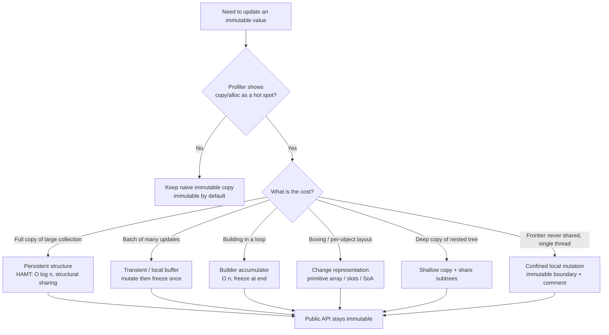

# Immutability — Optimize & Reconcile

> Immutability buys safety: no aliasing bugs, free thread-safety, trivial caching and equality. It is never free. Every "update" is logically a new object, and a naive implementation copies the whole structure. This file reconciles *immutable by default* with the handful of measured hot paths where copy cost, allocation pressure, or boxing actually shows up in a profile. Each scenario states the cost with concrete numbers, then resolves it with the smallest, most principled deviation — usually persistent structures or locally-scoped mutation, not abandoning immutability.

---

## Table of Contents

1. [Copy-on-every-update vs structural sharing (O(n) vs O(log n))](#scenario-1--copy-on-every-update-vs-structural-sharing)
2. [Defensive copy at the boundary vs unmodifiable view vs trust](#scenario-2--defensive-copy-vs-unmodifiable-view-vs-trust)
3. [Allocation/GC pressure from short-lived immutable objects](#scenario-3--gc-pressure-from-short-lived-immutable-objects)
4. [Autoboxing of immutable wrappers (Java)](#scenario-4--autoboxing-of-immutable-wrappers-java)
5. [Go value copies vs pointers; escape analysis](#scenario-5--go-value-copies-vs-pointers-and-escape-analysis)
6. [Building a list in a loop with `+` / `with` (O(n²) copies)](#scenario-6--building-a-collection-in-a-loop-on)
7. [Transients: mutate locally, then freeze](#scenario-7--transients-mutate-locally-then-freeze)
8. [String immutability and the StringBuilder lesson](#scenario-8--string-immutability-and-the-stringbuilder-lesson)
9. [Deep copy vs shallow copy of nested immutables](#scenario-9--deep-copy-vs-shallow-copy-of-nested-immutables)
10. [Recomputing derived values on every "updated" copy](#scenario-10--recomputing-derived-values-on-every-copy)
11. [Frozen-dataclass attribute-access overhead (Python)](#scenario-11--frozen-dataclass-attribute-access-overhead-python)
12. [Mutation in a hot path as a measured de-optimization](#scenario-12--mutation-in-a-hot-path-as-a-measured-de-optimization)
13. [Rules of Thumb](#rules-of-thumb)
14. [Related Topics](#related-topics)

---

### Scenario 1 — Copy-on-every-update vs structural sharing

**Scenario.** A configuration service holds an immutable map of ~50,000 feature flags. On each toggle it produces a new map so readers never see a torn state:

```java
// Naive immutable update: full defensive copy
public final class FlagStore {
    private final Map<String, Boolean> flags;          // 50,000 entries

    public FlagStore set(String key, boolean value) {
        var copy = new HashMap<>(flags);               // copies all 50,000
        copy.put(key, value);
        return new FlagStore(Map.copyOf(copy));
    }
}
```

Toggles arrive at ~2,000/sec during a rollout.

**Measurement / reasoning.** Each `set` copies 50,000 entries → 50,000 entry rehashes + ~50,000-element backing array allocation. At 2,000 toggles/sec that is ~10⁸ entry-copies/sec, plus ~2,000 short-lived arrays of ~400 KB each → ~800 MB/sec of garbage. The structure is O(n) per update where n is the *whole* map, even though one key changed.

<details><summary>Resolution</summary>

Use a **persistent** map with structural sharing — a Hash Array Mapped Trie (HAMT). An update copies only the path from root to the changed leaf: about log₃₂(50,000) ≈ 4 nodes of ≤32 slots each, i.e. ~128 references copied instead of 50,000. That is **O(log n)** per update, ~400× less work here, and the unchanged 99.99% of the tree is shared by reference between old and new versions.

```java
// io.vavr.collection.HashMap — HAMT, structural sharing
import io.vavr.collection.HashMap;

public final class FlagStore {
    private final HashMap<String, Boolean> flags;
    public FlagStore set(String key, boolean value) {
        return new FlagStore(flags.put(key, value)); // copies ~4 nodes, shares the rest
    }
}
```

Equivalent libraries: Scala/Clojure built-in persistent maps, `cats`/`io.vavr` in Java, `immer`/`pyrsistent` in Python (Go has no standard HAMT; see Scenario 12). The garbage drops from ~800 MB/sec to a few MB/sec, and old versions remain valid snapshots for free.

**Principle:** immutable by default. The cost objection to immutability is almost always a cost objection to *naive full copies* — switch the data structure, not the discipline. Reach for a HAMT/persistent vector the moment a copied collection exceeds a few hundred elements *and* is updated on a hot path.
</details>

---

### Scenario 2 — Defensive copy vs unmodifiable view vs trust

**Scenario.** A value object exposes its internal list. To preserve immutability it copies on the way in *and* on the way out:

```java
public final class Route {
    private final List<Stop> stops;
    public Route(List<Stop> stops) { this.stops = new ArrayList<>(stops); } // copy in
    public List<Stop> stops() { return new ArrayList<>(stops); }            // copy out
}

// Renderer reads stops() 60×/sec for a 2,000-stop route:
for (int frame = 0; frame < 60; frame++)
    for (Stop s : route.stops()) draw(s);   // copies 2,000 stops, 60×/sec
```

**Measurement / reasoning.** The copy-out clones 2,000 elements 60 times/sec = 120,000 element-copies/sec for data that never changes. Pure waste — the caller only iterates.

<details><summary>Resolution</summary>

Three tiers, cheapest-correct first:

1. **Unmodifiable view (O(1), no copy).** If the backing list is never mutated after construction (it is `final` and only assigned a copy), hand out a read-only *view*. No per-call allocation:

```java
private final List<Stop> stops;
public Route(List<Stop> stops) { this.stops = List.copyOf(stops); } // copy ONCE, in
public List<Stop> stops() { return stops; }                         // List.copyOf is already unmodifiable
```

`List.copyOf` returns a truly immutable list, so returning it directly is safe and free.

2. **Don't expose the collection at all (Tell, Don't Ask).** Expose the operation, not the container — the caller cannot mutate or copy badly:

```java
public void forEachStop(Consumer<Stop> action) { stops.forEach(action); }
public int stopCount() { return stops.size(); }
```

3. **Trust at the boundary.** Copy-in is only needed if the *caller's* list might still be mutated. If `Route` is built from a parser that immediately discards its buffer, the copy-in is also wasted — accept the reference and document the contract.

**Principle:** copy exactly once, at the trust boundary, and never again. A defensive copy on a getter that returns immutable data is a bug, not safety. See [`../05-objects-and-data-structures/README.md`](../05-objects-and-data-structures/README.md) for why exposing collections at all is the deeper smell.
</details>

---

### Scenario 3 — GC pressure from short-lived immutable objects

**Scenario.** A pricing pipeline produces a fresh immutable `Money` per arithmetic step. A single quote does ~20 operations and the service handles 50,000 quotes/sec → ~10⁶ `Money` allocations/sec.

```java
public final class Money {
    private final long minorUnits; private final String currency;
    public Money plus(Money o) { return new Money(minorUnits + o.minorUnits, currency); }
}
```

A teammate proposes a mutable accumulator "to reduce GC."

**Measurement / reasoning.** These objects are tiny (~24 bytes) and die within microseconds. That is exactly the workload a **generational** collector is built for: allocation is a pointer bump in the TLAB (a few ns), and a young-gen (minor) GC reclaims dead objects in O(live) — it never even visits the dead ones. The cost is proportional to *survivors*, and these never survive. Benchmark intuition: on HotSpot G1, ~10⁶ tiny ephemeral allocations/sec typically costs single-digit-millisecond pauses every few hundred ms — usually < 1% of throughput.

<details><summary>Resolution</summary>

**Do nothing yet — measure first.** Confirm with a profiler (`async-profiler` alloc mode, JFR, or `-Xlog:gc`) before changing anything. In the large majority of cases the allocation is in the noise and the mutable accumulator buys nothing while reintroducing aliasing risk.

Order of escalation *if* GC genuinely dominates a flame graph:

1. Make the type small and flat so it stays scalar-replaceable (see Scenario 5 for escape analysis; Java records and a future Valhalla value class can be stack-allocated when they don't escape).
2. Fuse the pipeline so intermediate `Money` values never materialize (compute on primitive `long` accumulators inside one method, box only the final result).
3. Only then consider pooling/mutation — and confine it (Scenario 7, Scenario 12).

```java
// Fused: one allocation for the result, none for the 20 intermediates.
long acc = 0;
for (LineItem li : items) acc += li.minorUnits();
return new Money(acc, currency);
```

**Principle:** generational GC makes "many small short-lived immutables" cheap by design. Allocation rate alone is not a bug — *survivor* pressure is. Profile before trading away immutability.
</details>

---

### Scenario 4 — Autoboxing of immutable wrappers (Java)

**Scenario.** An immutable event carries a numeric id stored as `List<Long>` (immutable wrapper) of matched user ids. A hot filter sums them:

```java
List<Long> ids = event.matchedUserIds(); // immutable, but Long not long
long total = 0;
for (Long id : ids) total += id;          // unboxing per element
```

The list has ~1M ids and this runs per request.

**Measurement / reasoning.** Each `Long` is a heap object (~16 bytes) versus 8 bytes for a `long`, and the boxed list also stores 8-byte references → ~3× the memory and a pointer-chase per element (cache-hostile). The loop unboxes 1M times/request. Boxed-collection numeric loops commonly run **3–6× slower** than a `long[]` due to cache misses and unbox overhead. Worse: `valueOf` only caches `Long` in −128..127, so ids outside that range allocate.

<details><summary>Resolution</summary>

Keep immutability, drop boxing. Store the immutable payload as a primitive array (defensively copied once at the boundary) or use a primitive-specialized stream:

```java
public final class Event {
    private final long[] ids;                       // primitive, no boxing
    public Event(long[] ids) { this.ids = ids.clone(); }     // copy once in
    public long idSum() { return Arrays.stream(ids).sum(); } // no boxing, vectorizable
}
```

A `long[]` wrapped in an immutable type *is* immutable as long as the array never escapes (don't return it; return a copy or a derived value). If you need a List API on a hot path, a primitive-collection library (Eclipse Collections `LongList`, fastutil `LongArrayList`) gives immutable views without boxing.

**Principle:** immutability does not require the *boxed* representation. Choose the densest representation that preserves the invariant, and pay the one boundary copy. Boxing is a representation choice, orthogonal to mutability.
</details>

---

### Scenario 5 — Go value copies vs pointers, and escape analysis

**Scenario.** Go has no `final`/`const` for structs; immutability is a convention enforced by passing/returning *values* (copies). A geometry type is large:

```go
type Mesh struct {
    Vertices [256]Vec3 // 256 * 24 bytes = 6 KB, by value
    Name     string
}

func translate(m Mesh, d Vec3) Mesh { // copies 6 KB in, 6 KB out
    for i := range m.Vertices { m.Vertices[i] = m.Vertices[i].Add(d) }
    return m
}

// Hot loop, 100k meshes:
for i := range meshes { meshes[i] = translate(meshes[i], delta) }
```

**Measurement / reasoning.** Each call copies ~6 KB in and ~6 KB out = ~12 KB/call × 100k = ~1.2 GB of memcpy per frame. Value semantics give immutability (the caller's `Mesh` is untouched until reassigned) but at full-copy cost for large structs. Meanwhile a small value type like `Vec3` (24 bytes) copies essentially for free and *stays on the stack* — escape analysis (`go build -gcflags='-m'`) proves it never escapes, so there is zero GC involvement.

<details><summary>Resolution</summary>

Match the mechanism to the size:

- **Small immutable values (≤ a few machine words): pass by value.** `Vec3`, `time.Time`, `Money{cents int64; cur string}`. Copies are cheap, they stay on the stack, and value semantics give you immutability for free. Returning a value lets escape analysis keep it stack-allocated.
- **Large immutable values: share a pointer to a never-mutated struct.** The convention becomes "this `*Mesh` is read-only after construction." You lose compiler enforcement but avoid the 6 KB copies:

```go
func translated(m *Mesh, d Vec3) *Mesh { // returns a NEW mesh; input untreated
    out := *m                            // one 6 KB copy
    for i := range out.Vertices { out.Vertices[i] = out.Vertices[i].Add(d) }
    return &out
}
```

This copies once (to build the new immutable version) instead of twice per call. Verify allocation behavior with `-gcflags='-m'`: if `out` escapes (it does — we return `&out`), it heap-allocates once, which is correct here.

**Principle:** in Go, "immutable" is a discipline about *not mutating shared state*, decoupled from value-vs-pointer, which is a *cost* decision. Use values for small types (free immutability), pointers-to-frozen-structs for large ones, and let escape analysis confirm where allocation lands.
</details>

---

### Scenario 6 — Building a collection in a loop (O(n²))

**Scenario.** Code builds an immutable list by repeatedly producing a new list with one more element — the most common accidental quadratic in immutable code.

```python
# Python — list "+" creates a new list each time
result = ()                       # immutable tuple
for x in source:                  # n = 1,000,000
    result = result + (transform(x),)   # copies the whole tuple each iteration
```

```java
// Java — same shape with an "immutable" copy per step
List<T> result = List.of();
for (T x : source) {
    var next = new ArrayList<>(result); // copies all so-far elements
    next.add(transform(x));
    result = List.copyOf(next);
}
```

**Measurement / reasoning.** Iteration *k* copies *k* elements → total work 1+2+…+n = **n(n+1)/2 = O(n²)**. For n = 1,000,000 that is ~5×10¹¹ element-copies — minutes-to-hours instead of milliseconds, and ~n intermediate arrays of growing size as garbage.

<details><summary>Resolution</summary>

Build with a **mutable local accumulator**, then freeze once at the end. The mutation is invisible outside the function, so the *result* is still immutable:

```python
buf = []                          # local, never escapes
for x in source:
    buf.append(transform(x))      # amortized O(1)
result = tuple(buf)               # freeze once -> immutable
# Or simply: result = tuple(transform(x) for x in source)
```

```java
List<T> result = source.stream()        // builder-internal mutation, frozen output
    .map(this::transform)
    .toList();                          // immutable, built in O(n)
```

This is the **builder pattern** generalized: mutate a private buffer, expose only the frozen result. Total work drops from O(n²) to O(n) — for n = 1M, from ~5×10¹¹ to ~10⁶ operations.

**Principle:** "immutable result" never means "immutable intermediate." Local, non-escaping mutation during construction is fully compatible with an immutable API — and is the *correct* way to build immutable collections. See [`find-bug.md`](find-bug.md) for the aliasing trap when that buffer accidentally escapes.
</details>

---

### Scenario 7 — Transients: mutate locally, then freeze

**Scenario.** You must apply 100,000 updates to a persistent map (Scenario 1) before publishing it. Even at O(log n) per update, each `put` allocates ~4 fresh path nodes → ~400,000 transient node allocations for an intermediate map nobody else will ever observe.

```clojure
;; Clojure — persistent, but 100k intermediate versions
(reduce (fn [m [k v]] (assoc m k v)) {} updates) ; ~4 nodes allocated per assoc
```

**Measurement / reasoning.** Persistent updates are cheap per step but still allocate a new path each time. For a batch of 100k updates building *one* final map, those ~400k intermediate nodes are pure garbage — the structural sharing benefit (keeping old versions) is worthless when no old version is retained.

<details><summary>Resolution</summary>

Use a **transient**: a temporarily-mutable view of a persistent structure that mutates its internal nodes in place (legal because no one else holds a reference), then is `persistent!`-frozen back into an immutable structure in O(1).

```clojure
(persistent!
  (reduce (fn [t [k v]] (assoc! t k v))      ; mutates in place, no per-step path copy
          (transient {}) updates))
```

This commonly runs **3–10× faster** and allocates a small fraction of the garbage, while the published result is fully immutable and shares structure with future versions. The contract is strict: a transient must never be read after being frozen, and must stay on one thread.

Other languages, same idea:
- **Java (`io.vavr`)**: `HashMap` already does internal node sharing; for batch builds use `LinkedHashMap`/builder then freeze, or `java.util.HashMap` locally → `Map.copyOf` once.
- **Python (`pyrsistent`)**: `pmap().evolver()` mutates locally, `.persistent()` freezes.
- **JS (`immer`)**: `produce(base, draft => { draft.x = 1 })` — the `draft` is a transient proxy; the output is frozen and structurally shared.

**Principle:** transients are the disciplined generalization of "mutate a local buffer, freeze once" (Scenario 6) to *persistent* structures. Use them only for batch construction on a measured hot path; for one-off updates, plain persistent `put` is simpler and fast enough.
</details>

---

### Scenario 8 — String immutability and the StringBuilder lesson

**Scenario.** Building a CSV row by concatenation — the canonical immutable-copy trap, because strings are immutable in Java, Python, and Go alike:

```java
String row = "";
for (String field : fields)       // m fields per row
    row += field + ",";           // each += allocates a new String
```

**Measurement / reasoning.** Strings are immutable, so `+=` allocates a brand-new char array each time and copies all characters so far → **O(m²)** characters copied per row (same quadratic as Scenario 6). For a row of 200 fields averaging 16 chars, that is ~200×3200/2 ≈ 320k char-copies per row. At 100k rows/sec that is ~3×10¹⁰ char-copies/sec. (Note: the Java compiler rewrites `a + b + c` *within one expression* into a `StringBuilder`, but it cannot fuse across loop iterations — the per-iteration `+=` is the killer.)

<details><summary>Resolution</summary>

Use the language's mutable string builder — the textbook "transient for strings" — then materialize the immutable `String` once:

```java
var sb = new StringBuilder(fields.size() * 16); // pre-size to avoid regrowth copies
for (String field : fields) sb.append(field).append(',');
String row = sb.toString();                     // one immutable String
```

```python
row = ",".join(fields)            # C-level single-pass join; O(total length)
```

```go
var b strings.Builder
b.Grow(len(fields) * 16)          // pre-size like StringBuilder capacity
for _, f := range fields { b.WriteString(f); b.WriteByte(',') }
row := b.String()                 // immutable string, no extra copy (builder hands off its buffer)
```

Pre-sizing matters: an under-sized builder still copies on each capacity doubling (~log m copies of growing arrays). Sizing once turns it into a single allocation.

**Principle:** the `String` → `StringBuilder` relationship is the original, universally-understood case of "immutable value + mutable builder." Every immutable collection should be built the same way: accumulate in a builder, freeze once. Concatenating immutables in a loop is always a latent O(n²).
</details>

---

### Scenario 9 — Deep copy vs shallow copy of nested immutables

**Scenario.** An "update one field" on a nested immutable tree deep-copies everything:

```python
import copy
@dataclass(frozen=True)
class Org:
    name: str
    teams: tuple          # tuple of Team, each with a tuple of Member

def rename_org(org, new_name):
    clone = copy.deepcopy(org)        # copies every team and member
    object.__setattr__(clone, "name", new_name)
    return clone
```

**Measurement / reasoning.** `deepcopy` recursively clones every node — for an org with 50 teams × 100 members = 5,000 objects, that is ~5,000 allocations to change *one top-level string*. The subtrees are themselves immutable and never change, so copying them is pure waste.

<details><summary>Resolution</summary>

Because the children are immutable, a "copy" only needs to **share** them by reference and replace the one node on the changed path — exactly structural sharing (Scenario 1), done by hand with a shallow per-node copy:

```python
@dataclass(frozen=True)
class Org:
    name: str
    teams: tuple
    def with_name(self, new_name):
        return dataclasses.replace(self, name=new_name) # shares the SAME teams tuple
```

`dataclasses.replace` (Java records' `with`-style copy constructor, Kotlin `copy`, the upcoming Java `with` expressions) does a **shallow** copy: new top object, all unchanged fields aliased to the originals. Changing `name` on a 5,000-node tree now allocates 1 object, not 5,000. Sharing is safe *precisely because* the children are immutable — no one can mutate the aliased subtree out from under either version.

**Principle:** never `deepcopy` an immutable structure. Immutability is what makes shallow sharing safe; deep-copying throws away the single biggest performance advantage immutability gives you. Copy only the spine to the changed node.
</details>

---

### Scenario 10 — Recomputing derived values on every copy

**Scenario.** An immutable `Polygon` recomputes its area, bounding box, and hash every time it is constructed — including the thousands of intermediate copies produced while transforming it:

```java
public final class Polygon {
    private final List<Point> points;
    public Polygon(List<Point> points) {
        this.points = List.copyOf(points);
        this.area = computeArea(this.points);   // O(n)
        this.bbox = computeBbox(this.points);    // O(n)
        this.hash = points.hashCode();           // O(n)
    }
    public Polygon translate(Vec d) { /* new Polygon(shifted points) */ }
}
```

A transform applies 1,000 translations; each constructs a new `Polygon` and re-derives area/bbox over n points.

**Measurement / reasoning.** For an n=10,000-vertex polygon, each copy does ~3 O(n) passes = ~30,000 ops, × 1,000 transforms = ~3×10⁷ ops — most of it recomputing an *area that is translation-invariant* and a bbox that just shifts by `d`. The eager precompute, normally a win (compute-once), becomes a tax when the object is copied frequently.

<details><summary>Resolution</summary>

Two complementary fixes:

1. **Propagate, don't recompute, the parts that transform predictably.** Area is invariant under translation; bbox shifts by `d`. Carry them forward:

```java
public Polygon translate(Vec d) {
    return new Polygon(shift(points, d), this.area, this.bbox.shift(d)); // O(n) shift, no re-derive
}
```

2. **Lazily memoize the genuinely-expensive derived values.** Immutability makes memoization trivially safe (the inputs can never change), so a cache field is sound — compute on first access, store, reuse:

```java
private volatile Double cachedHash;
public int hashCode() {
    Double h = cachedHash;
    if (h == null) cachedHash = h = (double) points.hashCode();
    return h.intValue();
}
```

Most copies never call `hashCode()` → those copies pay nothing.

**Principle:** eager derivation is a *copy-time* cost; on a copy-heavy hot path, prefer (a) propagating invariants and (b) lazy memoization, which immutability makes safe without locks-for-correctness. Don't compute what most copies never read.
</details>

---

### Scenario 11 — Frozen-dataclass attribute-access overhead (Python)

**Scenario.** A simulation reads `particle.x`, `particle.y`, `particle.vx`, `particle.vy` billions of times. The particle is a `@dataclass(frozen=True)` for safety.

```python
@dataclass(frozen=True)
class Particle:
    x: float; y: float; vx: float; vy: float
```

**Measurement / reasoning.** `frozen=True` overrides `__setattr__`/`__delattr__` to raise — this only affects *writes*, so reads are normal attribute lookups and frozen adds **no read overhead**. The real cost in tight numeric loops is that *any* Python object attribute access is a dict lookup (~tens of ns), and a per-object Python instance is ~56+ bytes with no memory locality. Construction is slightly slower (frozen `__init__` uses `object.__setattr__`), but that is irrelevant to a read-bound loop.

<details><summary>Resolution</summary>

Don't trade frozen for mutable — that fixes nothing on the read path. Instead change the *representation* for the hot loop while keeping immutability at the API:

1. **`slots=True`** removes the per-instance `__dict__`, cutting memory ~2× and speeding attribute access:

```python
@dataclass(frozen=True, slots=True)
class Particle: x: float; y: float; vx: float; vy: float
```

2. **Structure-of-arrays with NumPy** for the genuinely hot loop — the immutable boundary stays, but the kernel operates on dense, vectorizable arrays:

```python
xs = np.array([p.x for p in particles])   # build once
xs += vxs * dt                            # vectorized, C-speed, no per-object lookup
```

The objects remain frozen for everything outside the kernel; only the numeric core uses arrays.

**Principle:** frozen costs you nothing on reads — don't unfreeze for speed. When per-object access dominates, change *layout* (slots / SoA), not *mutability*. This mirrors Scenario 4: representation is orthogonal to immutability.
</details>

---

### Scenario 12 — Mutation in a hot path as a measured de-optimization

**Scenario.** A real-time pathfinder (A* over a 1M-cell grid) used an immutable persistent set for the open/closed frontier. A profiler shows 40% of CPU in HAMT node allocation; the per-frame budget (16 ms) is blown.

```go
// Persistent set update on every node expansion (millions/sec)
closed = closed.Add(node) // allocates path nodes each call; Go has no std HAMT — hand-rolled
```

**Measurement / reasoning.** A* expands millions of nodes per query; each `Add`/`Contains` on a persistent set allocates and chases pointers. The frontier is a *transient, single-threaded, function-local* accumulator that is never shared and never needs old versions — every property that justifies immutability is absent here. Flame graph: ~40% allocation + GC, search latency ~70 ms vs the 16 ms budget.

<details><summary>Resolution</summary>

This is the legitimate case to **drop immutability for a confined, measured hot path** — exactly the transient idea (Scenario 7) taken to its limit: a plain mutable structure, scoped to one function, never escaping.

```go
func aStar(grid *Grid, start, goal Cell) []Cell {
    closed := make(map[Cell]struct{}, grid.size/4) // plain mutable map, local
    open   := &cellHeap{}
    // ... expand: closed[node] = struct{}{}; O(1), zero per-op allocation
    return reconstruct(came, goal) // the RESULT is a fresh immutable slice
}
```

The mutable map lives and dies inside `aStar`; callers only ever see the immutable result path. Latency drops back under budget and allocation vanishes from the flame graph.

Guardrails for this de-optimization:
- It must be **proven by a profiler**, not assumed — the open/closed frontier was 40% of CPU, not a guess.
- The mutable state must be **function-local and single-threaded** (no escape, so no aliasing or concurrency hazard).
- The **public contract stays immutable** — inputs untouched, output frozen.
- A comment must record *why* (the benchmark number), so the next reader doesn't "clean it up" back to the slow version.

**Principle:** immutable by default; mutate locally only on a measured hot path, behind an immutable boundary. The clean default is immutability — mutation is the exception you justify with a number, confine to a scope, and document. See [`professional.md`](professional.md) for how to communicate such a deliberate trade-off in review.
</details>

---

## Decision flow



---

## Rules of Thumb

1. **Immutable by default; deviate only with a number.** Mutation is the exception you justify with a profiler reading, confine to a scope, and document — never the default reached for on a hunch.
2. **A "cost of immutability" complaint is usually a "cost of naive full copy" complaint.** Before abandoning immutability, switch the data structure: persistent/HAMT update is O(log n) with structural sharing, not O(n).
3. **Copy once, at the trust boundary.** Defensive copy on input where the caller might still mutate; never copy on a getter that already returns immutable data — return an unmodifiable view or the frozen object itself.
4. **Build immutable collections with a mutable local buffer, then freeze.** `StringBuilder` → `String` is the template. Concatenating/`+`-ing immutables in a loop is O(n²); a builder is O(n).
5. **Transients for batch construction of persistent structures.** Mutate internal nodes in place, `persistent!`/freeze once. Use only when no intermediate version is observed and it stays on one thread.
6. **Generational GC makes many small short-lived immutables cheap.** Allocation rate alone is not a problem — survivor pressure is. Don't pool/mutate to "reduce GC" without a flame graph showing GC dominates.
7. **Representation is orthogonal to immutability.** Boxing, `slots`, structure-of-arrays, value vs pointer — choose the densest layout that preserves the invariant. Frozen costs nothing on reads.
8. **Never `deepcopy` an immutable tree.** Shallow-copy the changed spine and alias the unchanged immutable subtrees — safe precisely because they're immutable.
9. **Immutability makes memoization free of correctness locks.** Cache derived values lazily; propagate transform-invariant derived data instead of recomputing it on every copy.
10. **In Go, "immutable" is a discipline, not a keyword.** Pass small values by value (free immutability, stays on stack); share pointers to never-mutated structs for large ones; confirm with `-gcflags='-m'`.
11. **Confined mutation behind an immutable boundary is still clean.** A function-local mutable accumulator that never escapes keeps the public contract immutable — that is the *correct* way to build immutable results, not a violation.

---

## Related Topics

- [`find-bug.md`](find-bug.md) — aliasing bugs when a "local" mutable buffer or returned reference accidentally escapes.
- [`professional.md`](professional.md) — communicating a deliberate immutability/performance trade-off in code review.
- [`../README.md`](../README.md) — the positive rules of this Immutability chapter.
- [`../05-objects-and-data-structures/README.md`](../05-objects-and-data-structures/README.md) — why exposing internal collections at all is the deeper smell behind defensive copies.
- [`../../functional-programming/README.md`](../../functional-programming/README.md) — persistent data structures, structural sharing, and pure-function discipline that immutability rests on.
