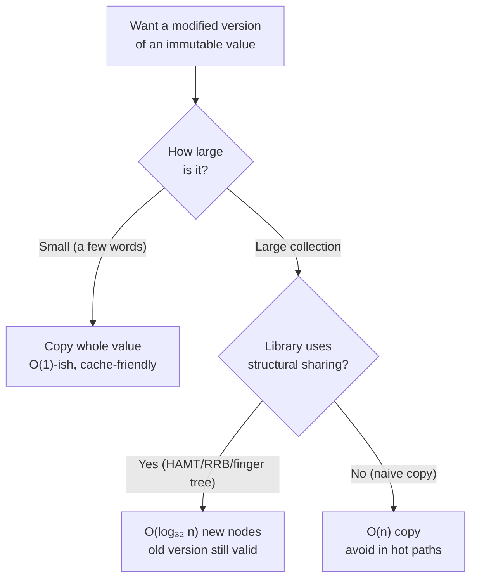
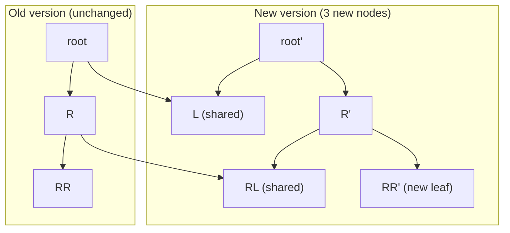

# Immutability — Professional Level

> Focus: "Under the hood" — how persistent data structures buy you O(log₃₂ n) "effectively constant" updates via structural sharing, how GCs and allocators absorb the allocation cost of immutable updates, when value semantics win or lose against the CPU cache, and when immutability is the *wrong* default.

---

## Table of Contents

1. [The two costs of immutability](#the-two-costs-of-immutability)
2. [Persistent data structures: structural sharing](#persistent-data-structures-structural-sharing)
3. [HAMT — the O(log₃₂ n) trick in depth](#hamt--the-olog-n-trick-in-depth)
4. [RRB-trees and finger trees](#rrb-trees-and-finger-trees)
5. [How GCs and allocators cope](#how-gcs-and-allocators-cope)
6. [Value semantics and the CPU](#value-semantics-and-the-cpu)
7. [Mutable internals behind a pure interface](#mutable-internals-behind-a-pure-interface)
8. [Equality and hashing invariants](#equality-and-hashing-invariants)
9. [When immutability is the wrong default](#when-immutability-is-the-wrong-default)
10. [Cross-language cost comparison](#cross-language-cost-comparison)
11. [Common Mistakes](#common-mistakes)
12. [Test Yourself](#test-yourself)
13. [Cheat Sheet](#cheat-sheet)
14. [Summary](#summary)
15. [Further Reading](#further-reading)
16. [Related Topics](#related-topics)

---

## The two costs of immutability

Immutability is not free, and a professional needs to know exactly what is paid and to whom. There are two distinct costs, and conflating them is the source of most bad performance arguments.

1. **The naive-copy cost.** "To change one field of a 1000-element record, copy all 1000 elements." This is `O(n)` per update and `O(n)` memory per version. If this were the only option, immutability would be unusable for large collections.

2. **The persistent-update cost.** A *persistent* data structure (Okasaki's term — see *Purely Functional Data Structures*, 1998) supports the old and new versions simultaneously while sharing most of their internal nodes. The update cost is `O(log n)` time and `O(log n)` *new* memory, not `O(n)`. The base of that logarithm is large (32 in modern HAMTs), so the depth is tiny — `log₃₂(10⁹) ≈ 6`. This is why Clojure, Scala, and Immutable.js call their structures "effectively constant time."



The professional mistake is to reason about (2) using the cost model of (1). When someone says "immutable collections are slow because they copy," they are describing a library that does not use structural sharing — not immutability itself.

---

## Persistent data structures: structural sharing

The foundational idea is decades old. A singly-linked cons list (Lisp, 1959) is already persistent: `cons(x, oldList)` creates one new node that points at the entire unchanged tail. The old list is untouched and still usable; the new list shares all but one node.

```
old:  [b] -> [c] -> [d] -> nil
new:  [a] -> [b] -> [c] -> [d] -> nil
            ^^^^^^^^^^^^^^^^^^^^^ shared, not copied
```

This is **structural sharing**: the new version reuses the unchanged subgraph of the old version. It is safe *only because* the shared nodes are immutable — if anyone could mutate `[b]`, both versions would be corrupted. Immutability is the precondition that makes sharing sound; sharing is the mechanism that makes immutability affordable.

A balanced tree generalizes this to indexed/keyed access. To update one leaf, you create new nodes only along the **root-to-leaf path** — `O(log n)` nodes — and reuse every off-path subtree:



Only `root'`, `R'`, and `RR'` are freshly allocated; `L`, `RL`, and the entire `L` subtree are shared by pointer. This is path copying. Okasaki's monograph is the canonical treatment; Driscoll, Sarnak, Sleator & Tarjan, "Making Data Structures Persistent" (1989) is the foundational theory paper.

---

## HAMT — the O(log₃₂ n) trick in depth

A binary tree gives `log₂ n` depth — for a billion elements that is ~30 levels, meaning ~30 allocations and ~30 pointer hops per update. Too deep. The **Hash Array Mapped Trie (HAMT)** — Phil Bagwell, "Ideal Hash Trees" (2001), as adapted by Rich Hickey for Clojure's `PersistentHashMap` — widens each node to **32 children**, collapsing the depth.

### The mechanics

A HAMT is a trie keyed by chunks of a key's hash. With a 32-way branch you consume **5 bits of hash per level** (2⁵ = 32):

```
hash(key) = 0b ..... 11010 00111 10010   (5 bits per level; level 0 = lowest bits)
                       lvl2  lvl1  lvl0
```

Each level uses its 5-bit slice as an index into a 32-slot node. Depth is `⌈(hash bits) / 5⌉` — for a 32-bit hash, at most 7 levels; for practical sizes, `log₃₂ n ≈ 6`. That is the "effectively constant" claim: the depth never exceeds ~7 regardless of size.

### The bitmap-compression trick

A full 32-slot array per node would waste enormous memory (most slots empty near the leaves). HAMTs store a **32-bit bitmap** plus a *dense* array holding only the occupied slots:

```
bitmap   = 0b00000000_00000000_00000000_10010100  // 3 children present: slots 2, 4, 7
children = [child2, child4, child7]                // dense, length 3
```

To find the child for logical slot `i`:
1. Check `bitmap & (1 << i)` — present?
2. Physical index = `popcount(bitmap & ((1 << i) - 1))` — count set bits below `i`.

`popcount` is a single CPU instruction (`POPCNT` on x86-64, `CNT` on AArch64). This is what makes the lookup genuinely fast in practice, not just asymptotically. The memory footprint of a sparse node is proportional to its actual children, not 32.

```go
// Sketch of a HAMT node lookup (illustrative, not production code).
type bitmapNode struct {
    bitmap   uint32
    children []any // dense; len == popcount(bitmap)
}

func (n *bitmapNode) child(slot uint) (any, bool) {
    bit := uint32(1) << slot
    if n.bitmap&bit == 0 {
        return nil, false
    }
    idx := bits.OnesCount32(n.bitmap & (bit - 1)) // POPCNT
    return n.children[idx], true
}
```

An update copies only the nodes on the path from root to the affected leaf (~6 nodes, each as wide as its `popcount`), reusing all sibling subtrees. New memory per update is therefore a few small arrays, not the whole map.

### CHAMP — the modern refinement

Steindorfer & Vinju, "Optimizing Hash-Array Mapped Tries for Fast and Lean Immutable JVM Collections" (OOPSLA 2015), introduced **CHAMP** (Compressed Hash-Array Mapped Prefix-trees). It separates the bitmap into *data* and *node* bitmaps, keeping inline values and sub-node pointers in distinct regions of the array. This improves iteration locality and makes `equals`/`hashCode` canonical (two equal CHAMPs have identical tree shape). Scala 2.13+ and several JVM libraries use CHAMP.

---

## RRB-trees and finger trees

HAMTs solve keyed maps and sets. Indexed *vectors* (random access, push/pop, concat, slice) use a different structure.

### Persistent vectors and the tail optimization

Clojure's `PersistentVector` and Scala's `Vector` are 32-way **bit-partitioned tries** indexed by position rather than hash. The same `log₃₂ n` depth applies. A key engineering detail is the **tail buffer**: appends accumulate in a 32-element array hanging off the root, so the common case (`conj`/`append`) is amortized `O(1)` — you only push the tail into the trie once every 32 appends. This is why "immutable vectors are slow to append" is false for these implementations.

### RRB-trees: efficient concat and slice

A plain bit-partitioned vector cannot concatenate or slice in sub-linear time without rebalancing. **RRB-trees** (Relaxed Radix Balanced trees) — Bagwell & Rompf, "RRB-Trees: Efficient Immutable Vectors" (2011) — relax the "every internal node is exactly full" invariant, storing a small *size table* on partially-full nodes. This buys `O(log n)` `concat` and `split`/`slice` while keeping `O(log₃₂ n)` indexing. Scala's `Vector` (2.13+) and `immer` (C++) use RRB variants.

### Finger trees: amortized O(1) at both ends

**Finger trees** — Hinze & Paterson, "Finger Trees: A Simple General-Purpose Data Structure" (JFP 2006) — keep "fingers" (fast-access pointers) at both ends, giving amortized `O(1)` access/insert at *either* end and `O(log n)` concat/split. Parameterized by a monoidal measure, the same structure becomes a deque, a random-access sequence, a priority queue, or an interval map. Haskell's `Data.Sequence` is the canonical implementation. They are the most general persistent sequence, at the cost of higher constant factors than RRB-trees.

| Structure | Lookup | Update | Append | Concat | Used by |
|---|---|---|---|---|---|
| Cons list | O(n) | O(n) | O(n) | O(n) | Lisp, Haskell `[]` |
| HAMT / CHAMP | O(log₃₂ n) | O(log₃₂ n) | — | — | Clojure map, Scala HashMap |
| Bit-partitioned vector | O(log₃₂ n) | O(log₃₂ n) | amortized O(1) | O(n) | Clojure vector |
| RRB-tree | O(log₃₂ n) | O(log₃₂ n) | amortized O(1) | O(log n) | Scala `Vector`, `immer` |
| Finger tree | O(log n) | O(log n) | amortized O(1) | O(log n) | Haskell `Data.Sequence` |

---

## How GCs and allocators cope

Persistent updates allocate. Updating a HAMT entry creates ~6 short-lived node copies; the old path nodes become garbage the instant no one references the old version. A persistent-data-structure-heavy program is therefore an *allocation-heavy, short-lifetime-garbage* program. Whether that is cheap depends entirely on the runtime's allocator and GC.

### Generational GC is the enabler

The **generational hypothesis** ("most objects die young") is precisely the access pattern persistent updates produce. Generational collectors (HotSpot G1/ZGC, Go's tri-color collector, .NET) place new allocations in a small nursery / eden region collected frequently and cheaply: a minor GC scans only live young objects and *implicitly* reclaims dead ones by ignoring them — dead garbage costs nothing to collect. Bump-pointer allocation in the nursery makes the allocation itself nearly free (increment a pointer). So the path-copy nodes of a persistent update are exactly the kind of garbage GCs are tuned to handle: allocated cheaply, collected in bulk, never promoted.

This is the deep reason persistent data structures are practical on managed runtimes but historically painful in C/C++ (manual `malloc`/`free` of many tiny nodes is slow and fragmenting — hence `immer`'s custom reference-counted, region-pooled allocators).

### Escape analysis trims the rest

For the *transient*, never-shared intermediate versions of a value within one method, JIT escape analysis (HotSpot) and Go's escape analysis can stack-allocate or scalar-replace the wrappers entirely, so a chain of small immutable updates in a hot local scope may allocate nothing on the heap. The same mechanism that scalar-replaces value objects (see `../05-objects-and-data-structures/README.md`) applies to short-lived immutable wrappers.

### Cost of the write barrier

Generational GCs maintain a **write barrier** / remembered set to track old→young pointers. Structural sharing creates many old→new references when an old, promoted structure's path is updated. The write-barrier cost is usually negligible but is the one place persistent updates impose overhead that mutable in-place updates do not.

---

## Value semantics and the CPU

The persistent-structure story is for *large* aggregates. For *small* values, the correct strategy is the opposite: copy them, by value, and let immutability fall out of value semantics for free.

### Copying small values beats pointer-chasing

A `Point{x, y int}` (16 bytes) passed by value is copied into registers or a contiguous stack slot — no allocation, no indirection, no GC tracking. Compare to a heap-allocated, shared, reference-counted "immutable" point: every access is a pointer dereference, risking a cache miss (a miss to main memory is ~100+ cycles vs ~4 for L1). For small values, *value semantics is the cheapest form of immutability*: there is nothing to share because copying is cheaper than sharing.

```go
type Point struct{ X, Y int } // value type

func translate(p Point, dx, dy int) Point { // p is a copy; result is a new value
    return Point{p.X + dx, p.Y + dy} // no heap allocation, no aliasing possible
}
```

Go structs, Java records / Project Valhalla value classes, C# `readonly record struct`, and Rust `Copy`/`Clone` types all exploit this. The immutability is *structural* (you got a copy) rather than *enforced by a wall around shared state*.

### Cache locality: `[]Point` vs `[]*Point`

An array of value `Point`s is contiguous — iterating it is one streaming, prefetcher-friendly pass. An array of *pointers* to heap `Point`s scatters the actual data across the heap; iteration becomes a sequence of cache misses. This is the same principle behind Data-Oriented Design (DOD): for bulk numeric work, prefer flat arrays of values over arrays of references — even when the values are conceptually immutable. (See [when immutability is the wrong default](#when-immutability-is-the-wrong-default).)

---

## Mutable internals behind a pure interface

The professional reconciliation of "immutability is correct" with "in-place mutation is fast" is: **mutate privately, expose immutably.** Build the value with mutation in a scope where no one else can observe it, then freeze it and hand out only an immutable view. Several languages give this a principled form.

### Rust — ownership as the principled version

Rust makes this a *type-system guarantee* rather than a convention. `&mut T` is an **exclusive** borrow: the compiler statically proves no other reference exists while you mutate. You can mutate freely and efficiently in place, then hand out `&T` (shared, read-only) borrows. There is no copying and no risk of aliased mutation — the borrow checker enforces "either many readers or one writer, never both." This is the cleanest realization of "mutable internals, immutable interface": the mutation window is provably private.

```rust
fn build(n: usize) -> Vec<u64> {
    let mut v = Vec::with_capacity(n); // exclusive &mut, mutate in place — fast
    for i in 0..n { v.push(i as u64); }
    v // moved out as an owned value; callers get shared &Vec — read-only
}
```

### Clojure transients

Clojure exposes the pattern explicitly. A **transient** is a *locally mutable* version of a persistent collection: `transient` / `conj!` / `persistent!`. You batch-mutate in place (single-threaded, unshared) for speed, then call `persistent!` to get back an immutable structure. Internally the transient reuses the HAMT/vector nodes but marks them "editable" with an owner thread id, so `persistent!` is `O(1)`. This is precisely "build mutably, freeze, publish immutably" — and it routinely yields 2–4× speedups for bulk construction over repeated persistent `conj`.

```clojure
(defn build [n]
  (persistent!
    (reduce conj! (transient []) (range n)))) ; mutate locally, freeze at the end
```

### Java — builder then freeze

The Java idiom is the **builder**: accumulate in a mutable builder, then produce an immutable result. `String`/`StringBuilder` is the canonical pair; `List.copyOf(...)`, `Stream.collect(toUnmodifiableList())`, and Guava's `ImmutableList.Builder` all follow it. The mutable object is the private workshop; the returned object is the immutable product.

```java
List<String> result = names.stream()
    .map(String::trim)
    .collect(Collectors.toUnmodifiableList()); // mutable accumulation internally, immutable result out
```

### Python — build mutably, store immutably

Python lacks compiler enforcement, so the pattern is convention plus defensive copying: build with a `list`, then store a `tuple`; or use `@dataclass(frozen=True)` whose factory does the mutable work before construction. Note `frozen=True` only blocks *attribute reassignment* — it does not deep-freeze a contained mutable list (see [Common Mistakes](#common-mistakes)).

The unifying invariant across all four: **the mutation must not be observable by any other reference.** Rust proves it, Clojure tracks an owner thread, Java/Python rely on the builder not leaking. The moment a mutable internal escapes, the "pure interface" is a lie — this is the *partial immutability* anti-pattern the chapter warns about (see `../README.md`).

---

## Equality and hashing invariants

Immutability and hashing are deeply intertwined, and getting this wrong corrupts hash containers silently.

### The cardinal rule

**An object's hash code must not change while it is a key in a hash container.** If you mutate a key after insertion, its hash no longer matches its bucket; lookups for that key fail even though it is "in" the map, and the entry becomes unreachable. Immutable keys make this *impossible*, which is the single strongest correctness argument for immutability of value types.

- **Java:** `hashCode()` and `equals()` must be consistent and stable. A `record` generates both from all components — safe *iff* the components are themselves immutable (a `record` holding a `List` field is a trap). HotSpot also caches `String.hashCode` lazily — sound only because `String` is immutable.
- **Python:** only **hashable** (immutable-by-contract) objects can be dict keys / set members. `list` is unhashable by design; `tuple` is hashable *iff its elements are*. `@dataclass(frozen=True)` auto-generates `__hash__`; a non-frozen dataclass sets `__hash__ = None`.
- **Go:** map keys must be comparable; structs of comparable fields work as keys by value equality. A struct containing a slice or map is *not* comparable and cannot be a key — the language enforces the constraint structurally.

### Value vs reference equality

Immutable value types should compare by **value** (two `Money{100, "USD"}` are equal). Mutable entities usually compare by **identity** (two `User` rows with the same id may differ in state). Mixing them — value equality on a mutable object — reintroduces the hashing hazard, because a "value-equal" object whose value changed now contradicts its earlier hash. The clean rule: **value equality ⟺ immutability.** If it can change, compare by identity.

### Canonical caching

Because immutable values cannot change, you can safely **cache** derived data on them: `String.hashCode` (lazy-cached), interned strings, `BigInteger` small-value caches, `Integer.valueOf`'s boxing cache (−128..127). This caching is only sound under immutability; it is a direct performance dividend.

---

## When immutability is the wrong default

Immutability is the right *default*, not a universal law. A professional knows the exceptions and can justify them with measurement.

### Hot numeric loops

In a tight loop accumulating into a buffer, allocating a new array per iteration to preserve immutability is catastrophic — `O(n)` allocations, GC churn, cache thrash. In-place mutation of a pre-allocated buffer is the correct, idiomatic choice. The discipline is to keep the mutation *local and unshared* (the transient pattern), not to expose a mutable buffer globally.

```go
// Wrong for a hot loop: allocates a fresh slice every iteration -> O(n^2) copies.
func runningImmutable(xs []float64) []float64 {
    acc := []float64{}
    for _, x := range xs {
        acc = append(append([]float64{}, acc...), x*x) // copies the whole prefix each time
    }
    return acc
}

// Right: mutate a pre-sized buffer in place; it never escapes mutably.
func squares(xs []float64) []float64 {
    out := make([]float64, len(xs))
    for i, x := range xs {
        out[i] = x * x
    }
    return out
}
```

### Large arrays and Data-Oriented Design

Game engines, physics simulations, columnar databases (Apache Arrow), and tensor libraries (NumPy, PyTorch) operate on millions of elements. Here the dominant costs are memory bandwidth and SIMD throughput. DOD mandates flat, mutable, contiguous arrays mutated in place; a persistent structure with `log₃₂ n` indirection per element would destroy SIMD vectorization and defeat the prefetcher. NumPy's `ndarray` is deliberately mutable; immutability is opt-in via `arr.flags.writeable = False`.

### Persistent vs ephemeral trade-off

Okasaki's distinction: a **persistent** structure preserves all past versions; an **ephemeral** structure has exactly one version and is destroyed by updates. You pay the structural-sharing tax (extra indirection, allocation, write barriers) *only if you actually need old versions* — for undo, time-travel debugging, MVCC snapshots, concurrent readers of a stable snapshot, or functional purity. If you never look at a previous version, an ephemeral mutable structure is strictly cheaper. The design question is not "immutable or mutable?" but **"do I need history/sharing here?"** If yes, persistent; if no, ephemeral-and-local.

| Need | Choose |
|---|---|
| Concurrent readers of a stable snapshot | Persistent (lock-free reads) |
| Undo / time-travel / audit history | Persistent |
| Pass a value across an API boundary safely | Immutable value / persistent |
| Single-threaded bulk build, no history | Mutable local (or transient) |
| Hot numeric kernel / SIMD | Mutable flat array (DOD) |

---

## Cross-language cost comparison

A canonical operation: "update one entry in a 1,000,000-element associative collection, keeping the old version usable."

| Language / structure | Update time | New memory per update | Old version preserved? |
|---|---|---|---|
| Clojure `PersistentHashMap` (HAMT) | O(log₃₂ n) ≈ 4 hops | ~6 small nodes | Yes |
| Scala `HashMap` (CHAMP) | O(log₃₂ n) | ~6 nodes, dense arrays | Yes |
| Java `Map.copyOf` (naive immutable) | O(n) | O(n) full copy | Yes, but expensive |
| Java `HashMap.put` (mutable) | O(1) amortized | O(1) | No |
| Go built-in `map` (mutable) | O(1) amortized | O(1) | No |
| Go + persistent library | O(log₃₂ n) | ~6 nodes | Yes |
| Python `dict` (mutable) | O(1) amortized | O(1) | No |
| Python `dict(old, **{k: v})` (copy) | O(n) | O(n) | Yes, but expensive |
| Immutable.js `Map` (HAMT) | O(log₃₂ n) | ~6 nodes | Yes |
| Rust `im` crate (HAMT/RRB) | O(log₃₂ n) | ~6 nodes | Yes |

**Takeaway:** languages with a HAMT/RRB library make persistent updates cheap; languages without one force the `O(n)`-copy approximation, which is why naive immutable collections feel slow. Go and Python have no *built-in* persistent collection — for large, frequently-versioned data, reach for a library or accept the copy cost knowingly.

---

## Common Mistakes

- **Partial immutability — an immutable wrapper around a mutable map.** `Collections.unmodifiableMap(m)` or a `frozen=True` dataclass holding a `list` blocks *reassignment* but not *deep mutation*. The wrapper is a label, not a wall; a held reference to the inner mutable object bypasses it entirely. Freeze deeply, or store already-immutable contents.
- **Returning a mutable reference to internal state.** `getItems()` returning the live backing `List` lets callers mutate your object's guts. Return a copy, an unmodifiable view, or a persistent structure. (See `../05-objects-and-data-structures/README.md`.)
- **Mutating a constructor argument that the caller still holds (escape via aliasing).** Storing the *same* list/slice the caller passed means the caller can later mutate your internals. Defensively copy on the way in (or take ownership explicitly, as Rust's move semantics make unavoidable).
- **Mutating a key after it is in a hash container.** Corrupts the bucket invariant; the entry becomes unreachable. Use immutable keys.
- **Reasoning about persistent updates with the naive-copy cost model.** Concluding "immutable = slow" because you imagined an `O(n)` copy, when the library actually uses `O(log₃₂ n)` structural sharing.
- **Deep immutability in a hot numeric loop.** Allocating per iteration to "stay pure" turns an `O(n)` kernel into an allocation-bound, GC-thrashing mess. Mutate a local, unshared buffer.
- **Value equality on a still-mutable object.** Breaks the hash invariant the moment the value changes. Value equality requires immutability.
- **Assuming `final`/`readonly`/`const` means deep immutability.** They forbid *rebinding the reference*, not mutating the referent. A `final List` can still have elements added.

---

## Test Yourself

1. Why is the base-32 branching factor of a HAMT the key to its "effectively constant time" claim, and what single CPU instruction makes the sparse-node lookup fast?

<details><summary>Answer</summary>
A 32-way branch consumes 5 hash bits per level, so depth is `⌈hashbits/5⌉` — at most ~7 for a 32-bit hash, ~6 in practice for any realistic n. The depth is bounded by a small constant regardless of size, so `O(log₃₂ n)` reads as "effectively constant." Sparse nodes store a 32-bit bitmap plus a dense array of present children; finding a child's physical index is `popcount(bitmap & ((1<<i)-1))`, and `popcount` is a single instruction (`POPCNT` / `CNT`). Bagwell, "Ideal Hash Trees" (2001).
</details>

2. A teammate argues "immutable collections are slow because every update copies the whole thing." When is this true, and when is it false?

<details><summary>Answer</summary>
True for *naive* immutable collections that clone the entire structure per update (`Map.copyOf`, `dict(old, **delta)`) — `O(n)` time and memory. False for *persistent* structures with structural sharing (HAMT, RRB-tree, finger tree), which create only `O(log₃₂ n)` new nodes per update and share the rest by pointer. The argument confuses the cost model of naive copying with the cost model of structural sharing.
</details>

3. Persistent updates allocate many tiny short-lived node copies. Why is this cheap on the JVM and in Go, but historically painful in C++?

<details><summary>Answer</summary>
Generational GCs are tuned for exactly this pattern: new nodes land in a bump-pointer nursery (near-free allocation), and dead path-copy nodes are reclaimed in bulk by a cheap minor GC that never even visits dead objects ("most objects die young"). Escape analysis can eliminate truly local copies entirely. In C++ with manual `malloc`/`free`, allocating and freeing millions of tiny nodes is slow and fragmenting — which is why `immer` ships custom reference-counted, pooled allocators.
</details>

4. You have a `Point{x, y int}`. Is it better as an immutable heap-allocated, shared object, or as a copied value type? Why?

<details><summary>Answer</summary>
As a copied value type. It is 16 bytes — copying it into registers/stack is cheaper than a heap allocation plus a pointer dereference (which risks a ~100+ cycle cache miss vs ~4 for L1). Value semantics give immutability for free: each holder has its own copy, so there is nothing to share and no aliased mutation is possible. An array of value `Point`s is also contiguous and prefetcher-friendly, unlike an array of pointers. Small values: copy; large aggregates: share structurally.
</details>

5. Clojure transients and Rust's `&mut` both implement "mutable internals behind a pure interface." What invariant must each enforce, and how?

<details><summary>Answer</summary>
The invariant is that the mutation must not be observable by any other reference — the mutating object must be *unshared* during the mutation window. Rust enforces it statically: `&mut T` is an exclusive borrow that the borrow checker proves is the sole reference. Clojure enforces it dynamically: a transient records an owner thread id and refuses edits from other threads, then `persistent!` revokes the editable marker in `O(1)`. Both then publish a read-only/immutable view. If the mutable internal escapes (e.g. a leaked builder), the guarantee breaks and you have the partial-immutability anti-pattern.
</details>

6. Why can `String.hashCode` be cached on the JVM, and why does a Java `record` with a `List` field break the hashing contract?

<details><summary>Answer</summary>
`String` is immutable, so its hash can never change after construction; HotSpot lazily computes it once and caches it in a field — sound precisely because of immutability. A `record` auto-generates `hashCode`/`equals` from its components; if a component is a mutable `List`, the record's hash changes whenever the list is mutated. If such a record is used as a map key and the list is then mutated, its bucket is now wrong and the entry becomes unreachable. Records are only safely immutable when all components are themselves immutable.
</details>

7. When is a persistent (history-preserving) structure the *wrong* choice, and what is the deciding question?

<details><summary>Answer</summary>
When you never need a previous version — single-threaded bulk construction, hot numeric kernels, large SIMD/DOD arrays. The structural-sharing tax (extra indirection, per-update allocation, write barriers, defeated vectorization) buys you persistence and concurrent-snapshot reads; if you don't use those, an ephemeral mutable structure is strictly cheaper. The deciding question is not "immutable or mutable?" but "do I need old versions / shared snapshots here?" — Okasaki's persistent-vs-ephemeral distinction.
</details>

8. How does an RRB-tree achieve `O(log n)` concatenation that a plain bit-partitioned persistent vector cannot?

<details><summary>Answer</summary>
A plain bit-partitioned vector requires every internal node to be exactly full (a strict radix invariant), so concatenation forces an `O(n)` rebalance to restore fullness. RRB-trees *relax* that invariant: internal nodes may be partially full, and such nodes carry a small *size table* so indexing can still locate a position in `O(log₃₂ n)` despite irregular fill. Relaxation lets `concat` and `split` stitch trees together by adjusting a logarithmic number of boundary nodes — Bagwell & Rompf (2011). Scala's `Vector` and `immer` use this.
</details>

---

## Cheat Sheet

| Concept | Key fact |
|---|---|
| Structural sharing | New version reuses old's unchanged subgraph; safe only because nodes are immutable |
| Path copying | Tree update copies only root→leaf path: `O(log n)` new nodes |
| HAMT | 32-way trie on hash bits; depth `log₃₂ n ≈ 6`; bitmap + dense array + `popcount` |
| CHAMP | HAMT with split data/node bitmaps → better locality, canonical equality (Scala 2.13+) |
| Persistent vector | Bit-partitioned trie + 32-element tail buffer → amortized O(1) append |
| RRB-tree | Relaxed radix + size tables → O(log n) concat/split (Scala `Vector`, `immer`) |
| Finger tree | Fingers at both ends → amortized O(1) ends, O(log n) concat (Haskell `Data.Sequence`) |
| GC fit | Path-copy garbage dies young → generational nursery collects it nearly free |
| Escape analysis | Local, non-escaping immutable wrappers may be stack-allocated / scalar-replaced |
| Small values | Copy by value (registers, contiguous, cache-friendly) — cheapest immutability |
| `[]T` vs `[]*T` | Value array is contiguous; pointer array scatters → cache misses |
| Mutable-internals pattern | Build mutably while unshared, freeze, publish immutably (Rust `&mut`, Clojure transient, Java builder) |
| Hash invariant | A key's hash must not change while in a container → immutable keys |
| Value equality | value equality ⟺ immutability; mutable entities compare by identity |
| Wrong default | Hot numeric loops, large SIMD/DOD arrays, no-history single-threaded builds |
| Persistent vs ephemeral | Pay the sharing tax only if you need old versions / shared snapshots |

---

## Summary

The professional understanding of immutability is a cost model, not a slogan. Immutability is affordable for large collections because **structural sharing** lets persistent structures create only `O(log n)` new nodes per update — and modern implementations (HAMT/CHAMP for maps, bit-partitioned and RRB-trees for vectors, finger trees for general sequences) push that base to 32, making the depth ~6 and the cost "effectively constant." The allocation that structural sharing produces is precisely the short-lived garbage that generational GCs and escape analysis collect almost for free, which is why these structures thrive on managed runtimes and need custom allocators in C++.

For small values, the right move is the opposite of sharing: copy by value and let cache-friendly value semantics deliver immutability with zero indirection. The reconciliation of "immutable interface" with "fast mutation" is to **mutate privately and publish immutably** — proven by Rust's exclusive borrows, tracked by Clojure's transients, conventionalized by Java/Python builders. Equality and hashing must obey one rule — *a key's hash cannot change while it is in a container* — which makes immutability the strongest guarantor of hash-container correctness. And immutability is a default, not a law: hot numeric loops and large DOD arrays demand in-place mutation, and you pay the persistence tax only when you actually need history or shared snapshots.

---

## Further Reading

- Chris Okasaki, *Purely Functional Data Structures* (1998) — the canonical text on persistent structures, amortization, and lazy evaluation.
- Phil Bagwell, "Ideal Hash Trees" (EPFL technical report, 2001) — the original HAMT.
- Bagwell & Rompf, "RRB-Trees: Efficient Immutable Vectors" (2011) — relaxed radix balanced trees.
- Steindorfer & Vinju, "Optimizing Hash-Array Mapped Tries for Fast and Lean Immutable JVM Collections" (OOPSLA 2015) — CHAMP.
- Hinze & Paterson, "Finger Trees: A Simple General-Purpose Data Structure" (Journal of Functional Programming, 2006).
- Driscoll, Sarnak, Sleator & Tarjan, "Making Data Structures Persistent" (Journal of Computer and System Sciences, 1989) — the foundational theory.
- Rich Hickey, "The Clojure Programming Language" / Clojure docs on transients and persistent collections.
- "The Rust Programming Language" (the Book), ch. 4 — ownership and borrowing.

---

## Related Topics

- [Immutability — Senior Level](senior.md)
- [Immutability — Interview prep](interview.md)
- [Immutability — chapter README](../README.md)
- [Objects and Data Structures](../05-objects-and-data-structures/README.md) — encapsulation, value objects, and not leaking internal state.
- [Pure Functions](../15-pure-functions/README.md) — immutability is the data-side companion to side-effect-free functions.
- [Functional Programming](../../functional-programming/README.md) — persistent structures and value semantics as first-class language features.
